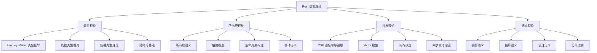
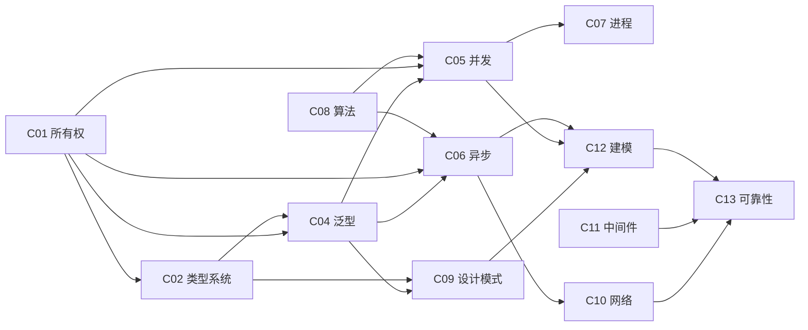
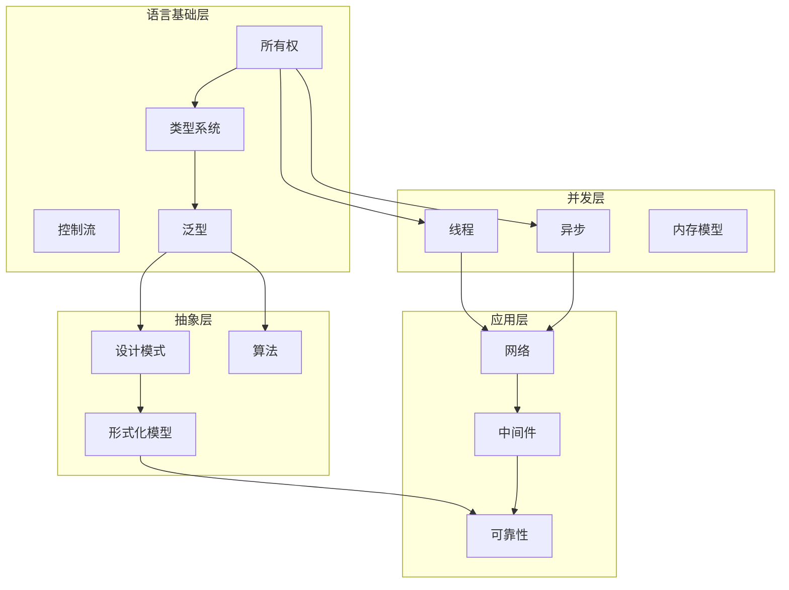
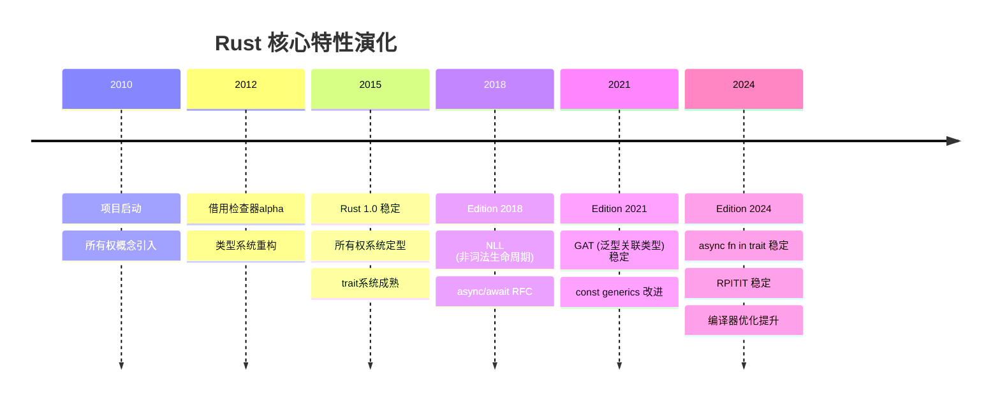

# 🎓 Rust 全局理论体系框架

> **创建日期**: 2025-10-20  
> **版本**: v1.0  
> **范围**: 跨13个模块的统一理论分析

---

## 📋 目录

- [🎓 Rust 全局理论体系框架](#-rust-全局理论体系框架)
  - [📋 目录](#-目录)
  - [🌐 一、全局理论体系结构](#-一全局理论体系结构)
    - [1.1 Rust 语言理论基础](#11-rust-语言理论基础)
      - [核心理论支柱](#核心理论支柱)
      - [理论基础对比矩阵](#理论基础对比矩阵)
    - [1.2 跨模块理论依赖关系](#12-跨模块理论依赖关系)
      - [模块理论依赖图](#模块理论依赖图)
      - [理论依赖关系矩阵](#理论依赖关系矩阵)
  - [🔬 二、语言语义模型分析](#-二语言语义模型分析)
    - [2.1 Rust vs 其他语言语义对比](#21-rust-vs-其他语言语义对比)
      - [多语言语义特性对比矩阵](#多语言语义特性对比矩阵)
    - [2.2 Rust 特性优缺点矩阵](#22-rust-特性优缺点矩阵)
      - [核心特性深度分析](#核心特性深度分析)
  - [📊 三、表达力与应用力对比](#-三表达力与应用力对比)
    - [3.1 横向对比：不同语言的表达力](#31-横向对比不同语言的表达力)
      - [编程范式表达力矩阵](#编程范式表达力矩阵)
      - [领域应用表达力对比](#领域应用表达力对比)
    - [3.2 纵向对比：Rust 在不同应用层次的能力](#32-纵向对比rust-在不同应用层次的能力)
      - [应用层次能力矩阵](#应用层次能力矩阵)
  - [🗺️ 四、全局知识图谱](#️-四全局知识图谱)
    - [4.1 跨模块概念关系网络](#41-跨模块概念关系网络)
      - [核心概念关系图](#核心概念关系图)
      - [概念依赖三元组（形式化表示）](#概念依赖三元组形式化表示)
    - [4.2 技术演化路径](#42-技术演化路径)
      - [Rust 特性演化时间线](#rust-特性演化时间线)
  - [🏗️ 五、技术规范与应用维度](#️-五技术规范与应用维度)
    - [5.1 技术规范层次分析](#51-技术规范层次分析)
      - [规范层次金字塔](#规范层次金字塔)
      - [各层次规范详解](#各层次规范详解)
    - [5.2 应用维度矩阵](#52-应用维度矩阵)
      - [多维度应用能力评估](#多维度应用能力评估)
  - [🎯 六、技术选型决策框架](#-六技术选型决策框架)
    - [6.1 场景驱动的技术选型](#61-场景驱动的技术选型)
      - [决策树](#决策树)
      - [场景-语言匹配矩阵](#场景-语言匹配矩阵)
    - [6.2 权衡分析矩阵](#62-权衡分析矩阵)
      - [核心权衡点](#核心权衡点)
  - [🔄 七、理论到实践的映射](#-七理论到实践的映射)
    - [7.1 理论概念的实践应用](#71-理论概念的实践应用)
      - [理论-实践映射表](#理论-实践映射表)
    - [7.2 最佳实践模式库](#72-最佳实践模式库)
      - [跨模块最佳实践](#跨模块最佳实践)
  - [📚 参考文献与扩展阅读](#-参考文献与扩展阅读)
    - [理论基础](#理论基础)
    - [Rust 特定资源](#rust-特定资源)

---

## 🌐 一、全局理论体系结构

### 1.1 Rust 语言理论基础

#### 核心理论支柱



#### 理论基础对比矩阵

| 理论领域 | Rust 采用 | 来源 | 创新点 | 实践意义 |
|---------|----------|------|--------|---------|
| **类型理论** | Hindley-Milner + 扩展 | Haskell/ML | 局部类型推导 + trait 系统 | 编译期安全保证 |
| **线性类型** | 仿射类型变体 | Linear Logic | 所有权系统 | 内存安全无GC |
| **并发理论** | CSP + Actor 混合 | Hoare/Erlang | 安全并发抽象 | 无数据竞争 |
| **语义理论** | 分离逻辑 | Reynolds | 借用检查形式化 | 别名控制 |
| **范畴论** | Functor/Monad | Haskell | Trait + Generic | 零成本抽象 |

---

### 1.2 跨模块理论依赖关系

#### 模块理论依赖图



#### 理论依赖关系矩阵

| 依赖模块 | C01 | C02 | C03 | C04 | C05 | C06 | C07 | C08 | C09 | C10 | C11 | C12 | C13 |
|---------|-----|-----|-----|-----|-----|-----|-----|-----|-----|-----|-----|-----|-----|
| **C01 所有权** | - | ✓ | ✓ | ✓ | ✓ | ✓ | ✓ | ✓ | ✓ | ✓ | ✓ | ✓ | ✓ |
| **C02 类型系统** | ✗ | - | ✓ | ✓ | ✓ | ✓ | ✓ | ✓ | ✓ | ✓ | ✓ | ✓ | ✓ |
| **C03 控制流** | ✗ | ✗ | - | ✓ | ✓ | ✓ | ✓ | ✓ | ✓ | ✓ | ✓ | ✓ | ✓ |
| **C04 泛型** | ✗ | ✗ | ✗ | - | ✓ | ✓ | ✓ | ✓ | ✓ | ✓ | ✓ | ✓ | ✓ |
| **C05 并发** | ✗ | ✗ | ✗ | ✗ | - | ⚡ | ✓ | ⚡ | ✓ | ⚡ | ✓ | ✓ | ✓ |
| **C06 异步** | ✗ | ✗ | ✗ | ✗ | ⚡ | - | ⚡ | ⚡ | ✓ | ✓ | ✓ | ✓ | ✓ |
| **C07 进程** | ✗ | ✗ | ✗ | ✗ | ✗ | ✗ | - | ✗ | ✗ | ⚡ | ⚡ | ⚡ | ✓ |
| **C08 算法** | ✗ | ✗ | ✗ | ✗ | ⚡ | ⚡ | ✗ | - | ⚡ | ⚡ | ⚡ | ⚡ | ⚡ |
| **C09 设计模式** | ✗ | ✗ | ✗ | ✗ | ⚡ | ⚡ | ✗ | ✗ | - | ⚡ | ⚡ | ✓ | ✓ |
| **C10 网络** | ✗ | ✗ | ✗ | ✗ | ⚡ | ⚡ | ⚡ | ⚡ | ⚡ | - | ✓ | ⚡ | ✓ |
| **C11 中间件** | ✗ | ✗ | ✗ | ✗ | ⚡ | ⚡ | ⚡ | ⚡ | ⚡ | ⚡ | - | ⚡ | ✓ |
| **C12 建模** | ✗ | ✗ | ✗ | ✗ | ⚡ | ⚡ | ⚡ | ⚡ | ✗ | ⚡ | ⚡ | - | ✓ |
| **C13 可靠性** | ✗ | ✗ | ✗ | ✗ | ⚡ | ⚡ | ⚡ | ⚡ | ⚡ | ⚡ | ⚡ | ⚡ | - |

**图例**: ✓ = 强依赖（必须先学）| ⚡ = 弱依赖（有助于理解）| ✗ = 无依赖

---

## 🔬 二、语言语义模型分析

### 2.1 Rust vs 其他语言语义对比

#### 多语言语义特性对比矩阵

| 语义特性 | Rust | C++ | Go | Java | Python | Haskell |
|---------|------|-----|----|----|--------|---------|
| **内存管理** | 所有权（编译期） | 手动/RAII | GC | GC | GC | GC |
| **类型系统** | 静态+强类型+推导 | 静态+强类型 | 静态+弱类型 | 静态+强类型 | 动态+强类型 | 静态+强类型+推导 |
| **null安全** | ✅ `Option<T>` | ❌ nullptr | ❌ nil | ⚠️ Optional | ❌ None | ✅ Maybe |
| **并发模型** | 所有权+Send/Sync | 线程+锁 | goroutine | 线程+锁 | GIL+线程 | STM |
| **错误处理** | ✅ Result<T,E> | ❌ 异常 | ⚠️ 多返回值 | ❌ 异常 | ❌ 异常 | ✅ Either/Maybe |
| **泛型** | ✅ 单态化 | ✅ 模板 | ⚠️ 接口 | ⚠️ 类型擦除 | ❌ 无 | ✅ 参数多态 |
| **生命周期** | ✅ 显式标注 | ❌ 隐式 | ❌ GC | ❌ GC | ❌ GC | ❌ GC |
| **零成本抽象** | ✅ 是 | ✅ 是 | ⚠️ 部分 | ❌ 否 | ❌ 否 | ⚠️ 部分 |
| **trait/接口** | ✅ Trait | ⚠️ 概念 | ✅ Interface | ✅ Interface | ✅ Protocol | ✅ Typeclass |
| **宏系统** | ✅ 声明式+过程式 | ✅ 预处理器 | ❌ 无 | ❌ 无 | ❌ 无 | ✅ Template Haskell |

**评分**: ✅ 优秀 | ⚠️ 一般 | ❌ 欠缺

---

### 2.2 Rust 特性优缺点矩阵

#### 核心特性深度分析

| 特性 | 优点 | 缺点 | 适用场景 | 不适用场景 |
|------|------|------|---------|-----------|
| **所有权系统** | • 内存安全无GC • 无数据竞争 • 零运行时开销 | • 学习曲线陡峭 • 需要显式生命周期 • 某些数据结构难实现 | 系统编程、嵌入式、高性能服务 | 原型开发、脚本任务 |
| **Trait系统** | • 灵活的多态 • 零成本抽象 • 孤儿规则保证一致性 | • 不支持继承 • trait对象有性能开销 • GAT复杂 | 库设计、泛型编程 | 需要深度继承的OO设计 |
| **借用检查** | • 编译期别名分析 • 防止悬垂指针 • 安全并发 | • 某些合法程序被拒绝 • 需要理解生命周期 • Rc/Arc开销 | 无共享可变性的场景 | 复杂的引用关系图 |
| **类型推导** | • 减少冗余标注 • 保持类型安全 • 局部推导快速 | • 不是全局推导 • 某些情况需显式标注 • 错误信息复杂 | 大多数代码 | 复杂泛型场景 |
| **宏系统** | • 编译期元编程 • 零运行时开销 • 卫生宏 | • 调试困难 • 编译时间增加 • 复杂宏难理解 | 重复代码消除、DSL | 简单逻辑 |
| **异步模型** | • 零成本Future • 可组合异步 • 多运行时选择 | • 颜色分裂（async/sync） • 生态碎片化 • 复杂度高 | I/O密集应用 | CPU密集计算 |
| **无GC** | • 可预测性能 • 低延迟 • 小内存占用 | • 需要手动管理 • 循环引用需Rc/Weak • 学习成本 | 实时系统、嵌入式 | 快速原型开发 |

---

## 📊 三、表达力与应用力对比

### 3.1 横向对比：不同语言的表达力

#### 编程范式表达力矩阵

| 范式 | Rust | C++ | Go | Java | Python | Haskell | 说明 |
|------|------|-----|----|------|--------|---------|------|
| **命令式编程** | ⭐⭐⭐⭐⭐ | ⭐⭐⭐⭐⭐ | ⭐⭐⭐⭐⭐ | ⭐⭐⭐⭐⭐ | ⭐⭐⭐⭐⭐ | ⭐⭐⭐ | Rust完全支持 |
| **函数式编程** | ⭐⭐⭐⭐ | ⭐⭐⭐ | ⭐⭐ | ⭐⭐⭐ | ⭐⭐⭐⭐ | ⭐⭐⭐⭐⭐ | Iterator/Closure强大 |
| **面向对象** | ⭐⭐⭐ | ⭐⭐⭐⭐⭐ | ⭐⭐ | ⭐⭐⭐⭐⭐ | ⭐⭐⭐⭐⭐ | ⭐ | 无继承但有trait |
| **泛型编程** | ⭐⭐⭐⭐⭐ | ⭐⭐⭐⭐⭐ | ⭐⭐ | ⭐⭐⭐ | ⭐ | ⭐⭐⭐⭐⭐ | 单态化+trait约束 |
| **元编程** | ⭐⭐⭐⭐ | ⭐⭐⭐⭐⭐ | ⭐ | ⭐⭐ | ⭐⭐⭐⭐ | ⭐⭐⭐⭐ | 声明式+过程宏 |
| **并发编程** | ⭐⭐⭐⭐⭐ | ⭐⭐⭐ | ⭐⭐⭐⭐⭐ | ⭐⭐⭐ | ⭐⭐ | ⭐⭐⭐⭐ | 所有权保证安全 |
| **异步编程** | ⭐⭐⭐⭐ | ⭐⭐⭐ | ⭐⭐⭐⭐⭐ | ⭐⭐⭐ | ⭐⭐⭐⭐ | ⭐⭐⭐ | async/await完善 |

#### 领域应用表达力对比

| 应用领域 | Rust | C++ | Go | Java | Python | 评价标准 |
|---------|------|-----|----|------|--------|---------|
| **系统编程** | ⭐⭐⭐⭐⭐ | ⭐⭐⭐⭐⭐ | ⭐⭐ | ⭐ | ⭐ | 硬件控制、驱动开发 |
| **Web后端** | ⭐⭐⭐⭐ | ⭐⭐ | ⭐⭐⭐⭐⭐ | ⭐⭐⭐⭐⭐ | ⭐⭐⭐⭐⭐ | 生态、开发速度 |
| **网络编程** | ⭐⭐⭐⭐⭐ | ⭐⭐⭐⭐ | ⭐⭐⭐⭐⭐ | ⭐⭐⭐⭐ | ⭐⭐⭐ | 性能、并发处理 |
| **嵌入式** | ⭐⭐⭐⭐⭐ | ⭐⭐⭐⭐⭐ | ⭐ | ⭐ | ⭐ | 资源受限、实时性 |
| **数据科学** | ⭐⭐ | ⭐⭐⭐ | ⭐⭐ | ⭐⭐⭐ | ⭐⭐⭐⭐⭐ | 库生态、易用性 |
| **区块链** | ⭐⭐⭐⭐⭐ | ⭐⭐⭐⭐ | ⭐⭐⭐⭐ | ⭐⭐⭐ | ⭐⭐ | 安全性、性能 |
| **CLI工具** | ⭐⭐⭐⭐⭐ | ⭐⭐⭐ | ⭐⭐⭐⭐⭐ | ⭐⭐ | ⭐⭐⭐⭐ | 编译速度、二进制大小 |
| **游戏开发** | ⭐⭐⭐⭐ | ⭐⭐⭐⭐⭐ | ⭐⭐ | ⭐⭐⭐ | ⭐⭐ | 性能、生态 |

---

### 3.2 纵向对比：Rust 在不同应用层次的能力

#### 应用层次能力矩阵

| 层次 | Rust能力 | 关键特性 | 代表应用 | 局限性 |
|------|---------|---------|---------|--------|
| **硬件层** | ⭐⭐⭐⭐⭐ | 内联汇编、无std、MMIO | 操作系统内核、驱动 | 需要unsafe |
| **操作系统层** | ⭐⭐⭐⭐⭐ | 系统调用、零成本抽象 | Redox OS、Linux内核模块 | 生态尚未成熟 |
| **运行时层** | ⭐⭐⭐⭐⭐ | 无GC、可定制allocator | 数据库、游戏引擎 | 异步运行时碎片化 |
| **中间件层** | ⭐⭐⭐⭐ | 高性能、安全并发 | 消息队列、缓存 | 生态不如Java丰富 |
| **应用层** | ⭐⭐⭐⭐ | Web框架、CLI库 | Web服务、工具 | 开发速度不如动态语言 |
| **用户界面层** | ⭐⭐⭐ | GUI库、WASM | 桌面应用、Web前端 | GUI生态不成熟 |

---

## 🗺️ 四、全局知识图谱

### 4.1 跨模块概念关系网络

#### 核心概念关系图



#### 概念依赖三元组（形式化表示）

```prolog
% 基础关系
depends_on(type_system, ownership).
depends_on(generic, type_system).
depends_on(generic, ownership).
depends_on(thread, ownership).
depends_on(async, ownership).
depends_on(async, generic).

% 应用关系
enables(ownership, memory_safety).
enables(type_system, zero_cost_abstraction).
enables(thread + async, safe_concurrency).
enables(generic, code_reuse).

% 组合关系
synergistic(ownership, type_system, 'compile_time_safety').
synergistic(thread, memory_model, 'data_race_freedom').
synergistic(async, zero_cost, 'efficient_io').
```

---

### 4.2 技术演化路径

#### Rust 特性演化时间线



---

## 🏗️ 五、技术规范与应用维度

### 5.1 技术规范层次分析

#### 规范层次金字塔

```text
                    ┌─────────────────┐
                    │  应用规范层     │
                    │ (最佳实践模式)  │
                    └────────┬────────┘
                             │
                    ┌────────┴────────┐
                    │   设计规范层    │
                    │ (设计模式/架构) │
                    └────────┬────────┘
                             │
              ┌──────────────┴──────────────┐
              │        语言规范层           │
              │  (语法/语义/类型系统)       │
              └──────────────┬──────────────┘
                             │
        ┌────────────────────┴────────────────────┐
        │              内存规范层                 │
        │   (所有权/借用/生命周期/内存模型)      │
        └────────────────────┬────────────────────┘
                             │
                   ┌─────────┴─────────┐
                   │    硬件规范层     │
                   │  (ABI/系统调用)   │
                   └───────────────────┘
```

#### 各层次规范详解

| 层次 | 规范内容 | Rust实现 | 关联模块 |
|------|---------|---------|---------|
| **硬件规范层** | • CPU指令集 • 内存模型 • ABI/调用约定 | • `target_arch` • `#[repr(C)]` • FFI | C01,C07 |
| **内存规范层** | • 所有权规则 • 借用规则 • 生命周期 | • 编译器借用检查 • 'static/'a标注 • Drop trait | C01 |
| **语言规范层** | • 语法定义 • 类型系统 • trait系统 | • Rust Reference • std library • RFC process | C02,C03,C04 |
| **设计规范层** | • 设计模式 • 架构模式 • 并发模型 | • Builder/Iterator • Actor/CSP • Send/Sync | C05,C06,C09 |
| **应用规范层** | • API设计 • 错误处理 • 最佳实践 | • Result<T,E> • thiserror/anyhow • Rust API Guidelines | C10-C13 |

---

### 5.2 应用维度矩阵

#### 多维度应用能力评估

| 维度 | 评估指标 | Rust得分 | 说明 | 改进方向 |
|------|---------|---------|------|---------|
| **安全性** | 内存安全、并发安全、类型安全 | 10/10 | 编译期保证，无unsafe时 | Unsafe代码审计工具 |
| **性能** | 运行时速度、内存占用、启动时间 | 9/10 | 接近C++，优于GC语言 | 编译时间优化 |
| **生产力** | 开发速度、调试体验、工具链 | 7/10 | 学习曲线陡峭 | IDE改进、错误信息优化 |
| **可维护性** | 代码可读性、重构支持、文档 | 9/10 | 类型系统帮助重构 | 宏系统可读性 |
| **生态成熟度** | 库丰富度、社区活跃度、文档 | 7/10 | 快速增长中 | 领域库完善 |
| **跨平台** | 平台支持、交叉编译、兼容性 | 8/10 | 支持多平台 | 某些平台支持不完善 |
| **互操作性** | FFI、语言绑定、集成 | 8/10 | C FFI成熟 | 其他语言绑定 |

---

## 🎯 六、技术选型决策框架

### 6.1 场景驱动的技术选型

#### 决策树

```text
需要高性能吗？
├─ 是 ┐
│     ├─ 需要内存安全吗？
│     │   ├─ 是 → Rust ✅
│     │   └─ 否 → C/C++
│     └─ 需要GC吗？
│         ├─ 是 → Java/Go
│         └─ 否 → Rust ✅
│
└─ 否 ┐
      ├─ 需要快速开发吗？
      │   ├─ 是 → Python/Node.js
      │   └─ 否 → Rust (长期项目)
      └─ 需要并发安全吗？
          ├─ 是 → Rust ✅ / Go
          └─ 否 → 任意语言
```

#### 场景-语言匹配矩阵

| 应用场景 | Rust | C++ | Go | Java | Python | 推荐理由 |
|---------|------|-----|----|------|--------|---------|
| **操作系统** | ⭐⭐⭐⭐⭐ | ⭐⭐⭐⭐⭐ | ⭐ | ❌ | ❌ | Rust: 安全性+性能 |
| **数据库** | ⭐⭐⭐⭐⭐ | ⭐⭐⭐⭐ | ⭐⭐⭐ | ⭐⭐⭐ | ❌ | Rust: 并发+无GC |
| **Web后端** | ⭐⭐⭐⭐ | ⭐⭐ | ⭐⭐⭐⭐⭐ | ⭐⭐⭐⭐⭐ | ⭐⭐⭐⭐⭐ | 看需求：高性能选Rust |
| **CLI工具** | ⭐⭐⭐⭐⭐ | ⭐⭐⭐ | ⭐⭐⭐⭐⭐ | ⭐⭐ | ⭐⭐⭐⭐ | Rust: 单二进制+快速 |
| **嵌入式** | ⭐⭐⭐⭐⭐ | ⭐⭐⭐⭐⭐ | ❌ | ❌ | ❌ | Rust: 安全+no_std |
| **区块链** | ⭐⭐⭐⭐⭐ | ⭐⭐⭐⭐ | ⭐⭐⭐⭐ | ⭐⭐ | ❌ | Rust: 安全性关键 |
| **机器学习** | ⭐⭐⭐ | ⭐⭐⭐⭐ | ⭐⭐ | ⭐⭐⭐ | ⭐⭐⭐⭐⭐ | Python生态最佳 |
| **游戏引擎** | ⭐⭐⭐⭐ | ⭐⭐⭐⭐⭐ | ⭐ | ⭐⭐ | ❌ | C++成熟，Rust潜力大 |
| **网络服务** | ⭐⭐⭐⭐⭐ | ⭐⭐⭐⭐ | ⭐⭐⭐⭐⭐ | ⭐⭐⭐⭐ | ⭐⭐⭐ | Rust/Go都很好 |
| **原型开发** | ⭐⭐ | ⭐⭐ | ⭐⭐⭐⭐ | ⭐⭐⭐⭐ | ⭐⭐⭐⭐⭐ | 动态语言更快 |

---

### 6.2 权衡分析矩阵

#### 核心权衡点

| 权衡维度 | Rust选择 | 收益 | 代价 | 何时值得 |
|---------|---------|------|------|---------|
| **安全 vs 灵活性** | 编译期安全检查 | 无内存漏洞、无数据竞争 | 某些合法模式被拒绝 | 安全性关键的系统 |
| **性能 vs 开发速度** | 零成本抽象+手动管理 | 极致性能 | 学习曲线、开发慢 | 性能是瓶颈 |
| **静态 vs 动态** | 静态类型+推导 | 编译期错误、重构安全 | 需要类型标注 | 大型长期项目 |
| **显式 vs 隐式** | 显式生命周期/错误 | 清晰的控制流 | 代码冗长 | 可维护性重要 |
| **编译期 vs 运行期** | 编译期检查 | 运行时零开销 | 编译时间长 | 运行性能关键 |

---

## 🔄 七、理论到实践的映射

### 7.1 理论概念的实践应用

#### 理论-实践映射表

| 理论概念 | 理论来源 | Rust实现 | 实践价值 | 代码示例模块 |
|---------|---------|---------|---------|-------------|
| **线性类型** | Linear Logic | 所有权系统 | 内存安全无GC | C01 |
| **Hindley-Milner** | 类型理论 | 类型推导 | 简洁+安全 | C02 |
| **Functor/Monad** | 范畴论 | Iterator/Option/Result | 组合抽象 | C04 |
| **CSP** | Hoare | mpsc通道 | 安全消息传递 | C05 |
| **Actor模型** | Erlang | actix/tokio | 并发抽象 | C06 |
| **分离逻辑** | Reynolds | 借用检查 | 别名控制 | C01 |

---

### 7.2 最佳实践模式库

#### 跨模块最佳实践

| 模式类别 | 模式名称 | 理论基础 | 适用场景 | 示例代码位置 |
|---------|---------|---------|---------|-------------|
| **所有权** | RAII | 资源管理 | 所有资源管理 | C01/examples |
| **类型安全** | NewType | 类型论 | 防止类型混淆 | C02/examples |
| **错误处理** | Result传播 | Monad | 错误链式处理 | C03/examples |
| **泛型** | Trait Bound | 约束多态 | 通用算法 | C04/examples |
| **并发** | Send/Sync | 类型系统 | 安全并发 | C05/examples |
| **异步** | Future组合 | Monad | I/O组合 | C06/examples |
| **架构** | Builder | 建造者模式 | 复杂对象构造 | C09/examples |

---

## 📚 参考文献与扩展阅读

### 理论基础

1. **类型理论**:
   - Pierce, B. C. (2002). *Types and Programming Languages*
   - Wadler, P. (1989). *Theorems for free!*

2. **所有权与线性类型**:
   - Girard, J. Y. (1987). *Linear Logic*
   - Walker, D. (2005). *Substructural Type Systems*

3. **并发理论**:
   - Hoare, C. A. R. (1978). *Communicating Sequential Processes*
   - Hewitt, C. (1977). *Actor Model*

4. **形式语义**:
   - Reynolds, J. C. (2002). *Separation Logic*
   - Jung et al. (2018). *RustBelt: Securing Foundations of Rust*

### Rust 特定资源

1. **官方文档**:
   - *The Rust Programming Language*
   - *Rust Reference*
   - *Rust RFC Book*

2. **学术论文**:
   - *Oxide: The Essence of Rust* (2019)
   - *RustBelt: Securing the Foundations* (2018)
   - *Stacked Borrows* (2019)

---

**文档版本**: v1.0  
**最后更新**: 2025-10-20  
**维护者**: Rust Learning Community

---

🎓 **理论与实践的完美结合！** 🦀✨
