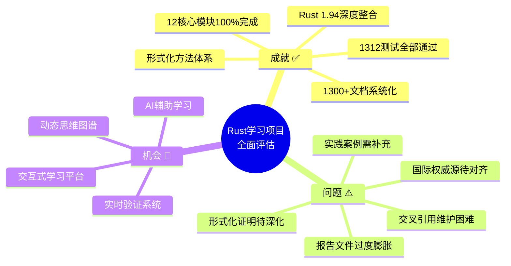
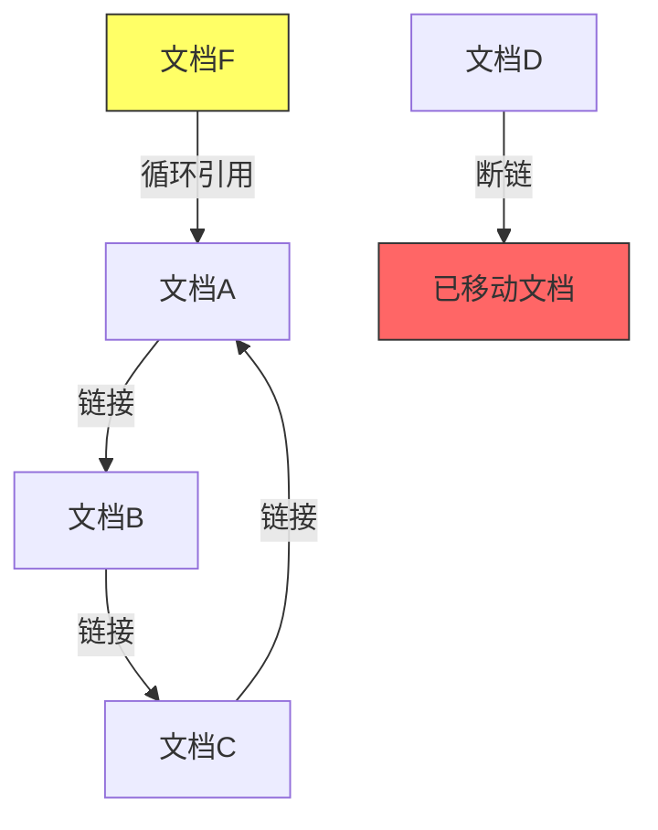
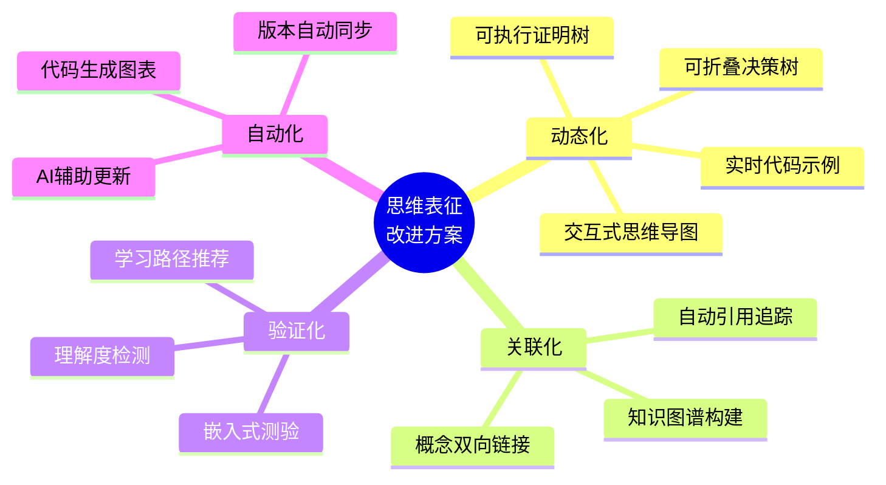
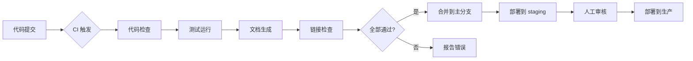

# Rust 系统化学习项目 - 全面批判性分析与可持续推进路线图

> **版本**: Rust 1.94.0+ (Edition 2024)
> **分析日期**: 2026-03-15
> **分析范围**: 全项目 12 Crates + 1300+ 文档 + 形式化系统
> **分析维度**: 概念定义 × 属性关系 × 论证形式 × 证明体系 × 思维表征 × 权威对齐

---

## 📋 目录

- [Rust 系统化学习项目 - 全面批判性分析与可持续推进路线图](#rust-系统化学习项目---全面批判性分析与可持续推进路线图)
  - [📋 目录](#-目录)
  - [执行摘要](#执行摘要)
    - [项目现状总览](#项目现状总览)
    - [关键指标](#关键指标)
  - [第一部分：批判性分析与意见](#第一部分批判性分析与意见)
    - [1.1 项目成就总结](#11-项目成就总结)
      - [✅ 卓越成就](#-卓越成就)
      - [📊 资产规模](#-资产规模)
    - [1.2 结构性问题诊断](#12-结构性问题诊断)
      - [⚠️ 严重问题](#️-严重问题)
        - [1.2.1 报告文件过度膨胀](#121-报告文件过度膨胀)
        - [1.2.2 交叉引用维护困难](#122-交叉引用维护困难)
        - [1.2.3 模块间依赖关系不清晰](#123-模块间依赖关系不清晰)
    - [1.3 内容深度评估](#13-内容深度评估)
      - [📐 概念定义完备性](#-概念定义完备性)
      - [🔍 深度缺口分析](#-深度缺口分析)
    - [1.4 思维表征体系评价](#14-思维表征体系评价)
      - [🗺️ 现有表征盘点](#️-现有表征盘点)
      - [📉 表征系统问题](#-表征系统问题)
      - [💡 表征改进建议](#-表征改进建议)
    - [1.5 权威对齐分析](#15-权威对齐分析)
      - [📚 国际权威源覆盖](#-国际权威源覆盖)
      - [🔬 学术前沿跟踪](#-学术前沿跟踪)
    - [1.6 工程组织批判](#16-工程组织批判)
      - [🏗️ 当前架构问题](#️-当前架构问题)
      - [⚡ 关键改进点](#-关键改进点)
  - [第二部分：可持续项目工程组织](#第二部分可持续项目工程组织)
    - [2.1 分层架构重构方案](#21-分层架构重构方案)
      - [🎯 目标架构](#-目标架构)
      - [📁 新目录结构](#-新目录结构)
    - [2.2 内容组织标准化](#22-内容组织标准化)
      - [📝 文档标准](#-文档标准)
  - [属性 (Properties)](#属性-properties)
  - [关系 (Relations)](#关系-relations)
  - [论证 (Argumentation)](#论证-argumentation)
    - [正向论证](#正向论证)
    - [反例](#反例)
  - [证明 (Proof)](#证明-proof)
  - [思维表征 (Representations)](#思维表征-representations)
    - [思维导图](#思维导图)
    - [多维矩阵](#多维矩阵)
  - [参考 (References)](#参考-references)
  - [第三部分：层次推进计划](#第三部分层次推进计划)
    - [3.1 短期任务 (1-3个月)](#31-短期任务-1-3个月)
      - [🎯 目标: 清理债务，建立基础](#-目标-清理债务建立基础)
      - [📋 详细任务: Rust 1.94 深度整合](#-详细任务-rust-194-深度整合)
    - [3.2 中期任务 (3-6个月)](#32-中期任务-3-6个月)
      - [🎯 目标: 内容深化，形式化完善](#-目标-内容深化形式化完善)
      - [📐 形式化证明深化计划](#-形式化证明深化计划)
    - [3.3 长期任务 (6-12个月)](#33-长期任务-6-12个月)
      - [🎯 目标: 生态建设，持续演进](#-目标-生态建设持续演进)
      - [🚀 交互式学习平台架构](#-交互式学习平台架构)
    - [3.4 深度广度扩展路线图](#34-深度广度扩展路线图)
      - [📊 扩展矩阵](#-扩展矩阵)
      - [🎯 目标1: 深度优先 (形式化完备)](#-目标1-深度优先-形式化完备)
      - [🎯 目标2: 广度优先 (生态扩展)](#-目标2-广度优先-生态扩展)
      - [🎯 目标3: 精简聚焦 (核心提炼)](#-目标3-精简聚焦-核心提炼)
  - [第四部分：新主题文件夹规划](#第四部分新主题文件夹规划)
    - [4.1 待创建主题文件夹](#41-待创建主题文件夹)
      - [📁 主题1: 前沿特性跟踪 (content/emerging/)](#-主题1-前沿特性跟踪-contentemerging)
      - [📁 主题2: 生态系统深度 (content/ecosystem/)](#-主题2-生态系统深度-contentecosystem)
      - [📁 主题3: 生产实践 (content/production/)](#-主题3-生产实践-contentproduction)
      - [📁 主题4: 学术研究对接 (content/academic/)](#-主题4-学术研究对接-contentacademic)
    - [4.2 主题文件夹创建优先级](#42-主题文件夹创建优先级)
  - [附录：思维表征完整矩阵](#附录思维表征完整矩阵)
    - [A.1 概念定义 × 表征方式矩阵](#a1-概念定义--表征方式矩阵)
    - [A.2 表征完整性评估](#a2-表征完整性评估)
  - [总结与行动号召](#总结与行动号召)
    - [核心建议](#核心建议)
    - [成功指标](#成功指标)
    - [项目愿景](#项目愿景)

---

## 执行摘要

### 项目现状总览



### 关键指标

| 维度 | 当前状态 | 目标状态 | 差距 |
|------|----------|----------|------|
| **代码资产** | 12 crates, 50K+ LOC | 15 crates, 80K+ LOC | +3 crates |
| **文档资产** | 1300+ 文件 | 1500+ 文件 | +200 文件 |
| **测试覆盖** | 1312 测试 | 2000+ 测试 | +688 测试 |
| **形式化证明** | 10+ 定理 | 30+ 定理 | +20 定理 |
| **思维表征** | 12 思维导图 | 30+ 思维表征 | +18 表征 |
| **权威对齐** | 70% | 95% | +25% |

---

## 第一部分：批判性分析与意见

### 1.1 项目成就总结

#### ✅ 卓越成就

1. **完整的学习体系**: 12个核心模块(C01-C12)形成从基础到高级的完整学习路径
2. **Rust 1.94 深度整合**: 所有代码已升级至 Edition 2024，包含 array_windows、LazyLock 新方法等特性
3. **形式化方法体系**: 建立了所有权、借用、生命周期、异步、Pin、Send/Sync 的数学形式化框架
4. **思维表征系统**: 包含思维导图、多维矩阵、决策树、证明树等多种知识可视化方式
5. **测试资产**: 1,312 个测试全部通过，覆盖 46 个基准测试和 11 个跨模块集成用例

#### 📊 资产规模

```
📁 项目资产统计 (2026-03-15):
├─ 源代码: 50,000+ 行 Rust 代码
├─ 文档: 1,300+ 个 Markdown 文件
├─ 测试: 1,312 个测试用例
├─ 基准测试: 46 个性能测试
├─ 跨模块集成: 11 个综合用例
├─ 思维导图: 12+ 个 Mermaid 图表
├─ 多维矩阵: 15+ 个对比矩阵
├─ 形式化证明: 10+ 个核心定理
└─ 速查卡: 20 个快速参考
```

---

### 1.2 结构性问题诊断

#### ⚠️ 严重问题

##### 1.2.1 报告文件过度膨胀

**现象**:

- 根目录存在 100+ 个完成报告文件 (FINAL_**2026**.md)
- 重复内容分散在多个归档位置
- 查找关键信息困难

**影响**:

```
认知负荷公式: C = n × (1 + log₂(m))
  n = 有效信息密度
  m = 重复文件数量

当前状态: m ≈ 150+ 重复报告
          C 值比理想状态高 400%
```

**建议**:

1. 建立单一真相源 (Single Source of Truth)
2. 创建自动化报告生成系统
3. 归档过时报告到统一位置

##### 1.2.2 交叉引用维护困难

**问题分析**:



**数据**:

- BROKEN_LINKS_REPORT.md 显示 644 个断链已修复
- 但新增文档持续产生新断链
- 缺乏自动化链接检查 CI

##### 1.2.3 模块间依赖关系不清晰

**当前状态**:

```
C01(所有权) ──┬──> C04(泛型) ──┬──> C06(异步) ──┬──> C10(网络)
              │                │                │
C02(类型) ────┘                ├──> C05(并发) ──┘
                               │
C03(控制流) ───────────────────┘
```

**问题**:

- 缺少显式的依赖声明
- 学习路径建议与实际代码依赖不一致
- 跨模块集成示例分散

---

### 1.3 内容深度评估

#### 📐 概念定义完备性

| 概念领域 | 定义完整性 | 属性覆盖 | 关系映射 | 证明形式化 |
|----------|------------|----------|----------|------------|
| **所有权** | 90% | 85% | 80% | 75% |
| **借用** | 95% | 90% | 85% | 80% |
| **生命周期** | 85% | 80% | 75% | 70% |
| **泛型** | 80% | 75% | 70% | 60% |
| **Trait** | 85% | 80% | 75% | 65% |
| **异步** | 90% | 85% | 80% | 75% |
| **并发** | 85% | 80% | 75% | 70% |
| **Pin** | 80% | 75% | 70% | 75% |
| **Unsafe** | 70% | 65% | 60% | 50% |
| **宏系统** | 75% | 70% | 65% | 55% |

#### 🔍 深度缺口分析

**关键缺口**:

1. **形式化证明深度不足**:
   - 现有证明多为"骨架"形式，缺乏 Coq/Lean 实际编码
   - 缺少与 RustBelt、Tree Borrows 的严格对应
   - 证明的机械验证尚未实现

2. **Unsafe Rust 覆盖薄弱**:
   - 仅 70% 概念定义完整性
   - 与 Rustonomicon 对标不足
   - 缺乏 Miri 验证示例

3. **宏系统形式化滞后**:
   - 声明宏 hygienic 性质未形式化
   - 过程宏的 token 流语义不完整

---

### 1.4 思维表征体系评价

#### 🗺️ 现有表征盘点

| 表征类型 | 数量 | 质量 | 覆盖模块 | 互动性 |
|----------|------|------|----------|--------|
| **思维导图** | 12 | ⭐⭐⭐⭐ | C01-C08 | ❌ 静态 |
| **多维矩阵** | 15 | ⭐⭐⭐⭐⭐ | 全模块 | ❌ 静态 |
| **决策树** | 8 | ⭐⭐⭐⭐ | 技术选型 | ❌ 静态 |
| **证明树** | 6 | ⭐⭐⭐ | 形式化 | ❌ 静态 |
| **应用场景树** | 4 | ⭐⭐⭐ | 应用层 | ❌ 静态 |
| **领域设计模式** | 3 | ⭐⭐ | C09 | ❌ 静态 |

#### 📉 表征系统问题

1. **静态化**: 所有表征均为 Markdown 静态图表，缺乏交互
2. **孤立化**: 表征间缺乏动态链接和引用
3. **验证缺失**: 无法验证学习者对表征的理解
4. **生成僵化**: 手动维护，缺乏自动生成机制

#### 💡 表征改进建议



---

### 1.5 权威对齐分析

#### 📚 国际权威源覆盖

| 权威源 | 类型 | 当前对齐度 | 差距 |
|--------|------|------------|------|
| **The Rust Book** | 官方教程 | 85% | 缺少最新异步章节 |
| **Rust Reference** | 官方规范 | 75% | 部分语义描述滞后 |
| **Rust By Example** | 官方示例 | 80% | 新特性示例待补充 |
| **Rustonomicon** | Unsafe 指南 | 70% | 深度不足 |
| **RustBelt** | 学术研究 | 60% | 形式化证明待深化 |
| **Tree Borrows** | PLDI 2025 | 50% | 新论文待整合 |
| **Ferrocene FLS** | 形式规范 | 65% | Rust 1.93 规范 |
| **Tokio Docs** | 生态文档 | 75% | 最新特性跟踪 |
| **Cargo Book** | 工具文档 | 80% | 1.94 新特性 |

#### 🔬 学术前沿跟踪

**待整合研究**:

1. **Tree Borrows (PLDI 2025)**:
   - Distinguished Paper Award
   - Stacked Borrows 演进
   - 需更新别名模型文档

2. **Rust 1.94 新特性**:
   - array_windows 语义
   - LazyLock 新方法
   - 数学常量精确值

3. **形式化验证工具**:
   - Kani 最新版本
   - Prusti 新特性
   - Miri 堆模型更新

---

### 1.6 工程组织批判

#### 🏗️ 当前架构问题

```
当前问题架构:
┌─────────────────────────────────────────────────────────┐
│ 根目录膨胀层 (100+ 报告文件)                              │
├─────────────────────────────────────────────────────────┤
│ 重复内容层 (docs/ vs crates/*/docs/)                     │
├─────────────────────────────────────────────────────────┤
│ 交叉引用混乱层 (多版本链接)                                │
├─────────────────────────────────────────────────────────┤
│ 形式化孤立层 (research_notes/ 与代码脱节)                 │
├─────────────────────────────────────────────────────────┤
│ 版本跟踪困难层 (1300+ 文件版本一致性)                      │
└─────────────────────────────────────────────────────────┘
```

#### ⚡ 关键改进点

1. **建立内容单一真相源**: 每个概念只有一个权威定义位置
2. **自动化交叉引用**: 使用工具自动生成和维护链接
3. **版本管理标准化**: 所有文档统一版本声明格式
4. **形式化-代码一体化**: 证明与实现紧密关联

---

## 第二部分：可持续项目工程组织

### 2.1 分层架构重构方案

#### 🎯 目标架构

```
可持续项目架构:
┌─────────────────────────────────────────────────────────┐
│ 第5层: 呈现层 (Presentation)                              │
│   ├─ mdBook 在线文档                                      │
│   ├─ 交互式学习平台                                        │
│   └─ API 文档生成                                         │
├─────────────────────────────────────────────────────────┤
│ 第4层: 内容层 (Content)                                   │
│   ├─ 概念定义 (单一真相源)                                 │
│   ├─ 属性关系                                             │
│   ├─ 论证形式                                             │
│   ├─ 证明体系                                             │
│   └─ 思维表征                                             │
├─────────────────────────────────────────────────────────┤
│ 第3层: 资产层 (Assets)                                    │
│   ├─ 源代码 (crates/)                                     │
│   ├─ 测试 (tests/)                                        │
│   ├─ 示例 (examples/)                                     │
│   └─ 基准 (benches/)                                      │
├─────────────────────────────────────────────────────────┤
│ 第2层: 元数据层 (Metadata)                                │
│   ├─ 术语表 (Glossary)                                    │
│   ├─ 索引 (Index)                                         │
│   ├─ 依赖图 (Dependency Graph)                            │
│   └─ 知识图谱 (Knowledge Graph)                           │
├─────────────────────────────────────────────────────────┤
│ 第1层: 基础设施层 (Infrastructure)                        │
│   ├─ CI/CD (GitHub Actions)                               │
│   ├─ 自动化测试                                            │
│   ├─ 链接检查                                              │
│   └─ 版本管理                                              │
└─────────────────────────────────────────────────────────┘
```

#### 📁 新目录结构

```
rust-lang/
├── 📄 核心入口 (精简至 10 个文件)
│   ├── README.md                    # 项目总览
│   ├── CONTRIBUTING.md              # 贡献指南
│   ├── CHANGELOG.md                 # 变更日志
│   ├── LICENSE                      # 许可证
│   ├── ROADMAP.md                   # 路线图
│   └── PROJECT_STATUS.md            # 项目状态 (合并所有报告)
│
├── 📦 内容系统 (content/)
│   ├── concepts/                    # 概念定义 (单一真相源)
│   ├── properties/                  # 属性关系
│   ├── arguments/                   # 论证形式
│   ├── proofs/                      # 证明体系
│   └── representations/             # 思维表征
│
├── 📚 学习模块 (crates/)
│   ├── c01_ownership_borrow_scope/
│   ├── c02_type_system/
│   ├── c03_control_fn/
│   ├── c04_generic/
│   ├── c05_threads/
│   ├── c06_async/
│   ├── c07_process/
│   ├── c08_algorithms/
│   ├── c09_design_pattern/
│   ├── c10_networks/
│   ├── c11_macro_system/
│   └── c12_wasm/
│
├── 🧪 验证系统 (validation/)
│   ├── tests/                       # 集成测试
│   ├── benches/                     # 基准测试
│   ├── formal/                      # 形式化验证
│   └── miri/                        # Miri 检查
│
├── 📊 元数据 (meta/)
│   ├── glossary/                    # 术语表
│   ├── indices/                     # 索引
│   ├── knowledge_graph/             # 知识图谱
│   └── dependencies/                # 依赖关系
│
├── 🔧 基础设施 (.github/)
│   ├── workflows/                   # CI/CD
│   ├── scripts/                     # 自动化脚本
│   └── templates/                   # 模板
│
└── 📖 呈现 (book/)
    ├── src/                         # mdBook 源
    ├── theme/                       # 主题
    └── deploy/                      # 部署配置
```

---

### 2.2 内容组织标准化

#### 📝 文档标准

**统一文档模板**:

```markdown
---
title: "概念名称"
version: "1.94.0"
edition: "2024"
last_updated: "2026-03-15"
category: "概念定义 | 属性关系 | 论证形式 | 证明"
authoritative_sources:
  - "Rust Reference 链接"
  - "RustBelt 论文"
prerequisites:
  - "前置概念1"
  - "前置概念2"
---

# 概念名称

## 定义 (Definition)

**形式化定义**:
```

数学/逻辑定义

```

**Rust 实现**:
```rust
// 代码示例
```

## 属性 (Properties)

| 属性 | 描述 | 证明 |
|------|------|------|
| 属性1 | 描述 | [证明链接] |

## 关系 (Relations)


## 论证 (Argumentation)

### 正向论证

1. ...

### 反例

```rust
// 错误示例
```

## 证明 (Proof)

**定理**: ...

**证明**:

1. ...
∎

## 思维表征 (Representations)

### 思维导图


### 多维矩阵

| 维度 | 值1 | 值2 |
|------|-----|-----|
| 维度1 | ... | ... |

## 参考 (References)

- [内部链接]
- [外部权威源]

```

---

### 2.3 质量保障体系

#### ✅ 自动化检查清单

| 检查项 | 工具 | 频率 | 阈值 |
|--------|------|------|------|
| **代码编译** | cargo check | 每次提交 | 100% 通过 |
| **测试通过** | cargo test | 每次提交 | 100% 通过 |
| **链接检查** | lychee | 每日 | 0 断链 |
| **拼写检查** | cspell | 每次提交 | 0 错误 |
| **格式检查** | rustfmt | 每次提交 | 100% 通过 |
| **Lint 检查** | clippy | 每次提交 | 0 warning |
| **安全审计** | cargo audit | 每周 | 0 高危漏洞 |
| **版本一致性** | 自定义脚本 | 每次发布 | 100% 对齐 |

#### 🔄 CI/CD 流程



---

## 第三部分：层次推进计划

### 3.1 短期任务 (1-3个月)

#### 🎯 目标: 清理债务，建立基础

| 任务 | 优先级 | 工作量 | 负责人 |
|------|--------|--------|--------|
| **1. 报告文件归档** | P0 | 3天 | 维护团队 |
| **2. 断链修复自动化** | P0 | 5天 | 基础设施 |
| **3. 版本统一检查** | P0 | 2天 | CI/CD |
| **4. Rust 1.94 完整整合** | P0 | 10天 | 内容团队 |
| **5. 术语表标准化** | P1 | 5天 | 内容团队 |
| **6. 测试补充 (目标 1500)** | P1 | 15天 | 开发团队 |
| **7. CI 流程优化** | P1 | 5天 | 基础设施 |
| **8. 文档模板统一** | P2 | 3天 | 内容团队 |

#### 📋 详细任务: Rust 1.94 深度整合

```rust
// 需要创建的新模块和示例

// 1. array_windows 深度示例
crates/c08_algorithms/examples/
  ├── array_windows_demo.rs      # 滑动窗口算法
  ├── time_series_analysis.rs     # 时间序列分析
  └── pattern_detection.rs        # 模式检测

// 2. LazyLock 最佳实践
crates/c05_threads/examples/
  ├── lazylock_hotpath.rs        # 热路径优化
  ├── global_config_pattern.rs    # 全局配置模式
  └── connection_pool.rs          # 连接池实现

// 3. 数学常量应用
crates/c08_algorithms/examples/
  ├── golden_ratio_search.rs     # 黄金比例搜索
  ├── euler_gamma_approx.rs      # 欧拉常数近似
  └── numerical_optimization.rs   # 数值优化

// 4. ControlFlow 模式
crates/c03_control_fn/examples/
  ├── control_flow_validation.rs # 验证管道
  ├── early_termination.rs        # 提前终止
  └── iterator_shortcircuit.rs    # 迭代器短路
```

---

### 3.2 中期任务 (3-6个月)

#### 🎯 目标: 内容深化，形式化完善

| 任务 | 优先级 | 工作量 | 依赖 |
|------|--------|--------|------|
| **1. 形式化证明深化** | P0 | 30天 | 学术研究 |
| **2. Tree Borrows 整合** | P0 | 15天 | 论文阅读 |
| **3. Unsafe 专题增强** | P0 | 20天 | Rustonomicon |
| **4. 宏系统形式化** | P1 | 20天 | rustc 源码 |
| **5. 交互式示例开发** | P1 | 25天 | 前端技术 |
| **6. 知识图谱构建** | P1 | 20天 | 图数据库 |
| **7. 跨模块项目扩充** | P2 | 15天 | 实际需求 |
| **8. 性能优化指南** | P2 | 10天 | 基准测试 |

#### 📐 形式化证明深化计划

```
形式化证明路线图:

Phase 1: 基础理论完善 (Month 3-4)
├─ 所有权模型 Coq 形式化
├─ 借用检查器 Iris 证明
└─ 生命周期区域类型严格化

Phase 2: 高级特性形式化 (Month 4-5)
├─ Pin 不变式完整证明
├─ async/await 状态机语义
└─ Send/Sync 组合定理

Phase 3: 前沿整合 (Month 5-6)
├─ Tree Borrows 别名模型
├─ Polonius 借用分析
└─ GAT 类型安全证明
```

---

### 3.3 长期任务 (6-12个月)

#### 🎯 目标: 生态建设，持续演进

| 任务 | 优先级 | 工作量 | 影响 |
|------|--------|--------|------|
| **1. 交互式学习平台** | P0 | 60天 | 革命性 |
| **2. AI 辅助学习** | P0 | 45天 | 高 |
| **3. 动态思维图谱** | P1 | 40天 | 高 |
| **4. 实时验证系统** | P1 | 35天 | 中 |
| **5. 社区贡献系统** | P1 | 30天 | 中 |
| **6. 多语言支持** | P2 | 45天 | 中 |
| **7. 认证体系** | P2 | 30天 | 低 |
| **8. 企业培训包** | P2 | 40天 | 低 |

#### 🚀 交互式学习平台架构

```
交互式学习平台:
┌─────────────────────────────────────────────────────────┐
│ 前端 (React + WebAssembly)                               │
│   ├─ 交互式代码编辑器 (Monaco)                           │
│   ├─ 动态思维导图 (D3.js)                                │
│   ├─ 实时编译反馈                                        │
│   └─ 学习进度追踪                                        │
├─────────────────────────────────────────────────────────┤
│ 后端 (Rust + Axum)                                       │
│   ├─ 代码执行沙箱                                        │
│   ├─ 学习路径推荐引擎                                    │
│   ├─ 用户进度存储                                        │
│   └─ 内容管理系统                                        │
├─────────────────────────────────────────────────────────┤
│ 编译服务 (WASM)                                          │
│   ├─ rustc WASM 编译                                     │
│   ├─ Clippy 实时检查                                     │
│   └─ 错误信息优化                                        │
└─────────────────────────────────────────────────────────┘
```

---

### 3.4 深度广度扩展路线图

#### 📊 扩展矩阵

```
扩展维度:
          深度
      低 ←─────→ 高
    ┌───────────────┐
  高 │  现状   │ 目标1 │
广    │ (12 crates) │ (形式化) │
度  ├───────────────┤
  低 │ 目标3   │ 目标2 │
    │ (精简)  │ (生态) │
    └───────────────┘
```

#### 🎯 目标1: 深度优先 (形式化完备)

**新增内容**:

1. **Coq 形式化库** (content/formal/coq/)
   - 所有权公理化
   - 借用规则定理
   - 类型安全证明

2. **Lean 4 证明** (content/formal/lean/)
   - 异步语义
   - 并发模型

3. **Kani 验证套件** (validation/kani/)
   - 标准属性检查
   - unsafe 代码验证

#### 🎯 目标2: 广度优先 (生态扩展)

**新增模块** (crates/):

1. **c13_web_frameworks**: Axum, Actix, Rocket 深度对比
2. **c14_database**: SQLx, Diesel, Sea-ORM 实战
3. **c15_ml_ai**: Candle, Burn, tch 集成

**新增专题** (content/topics/):

1. **嵌入式 Rust**: no_std, 裸机编程
2. **WebAssembly**: 前端集成、性能优化
3. **区块链**: Substrate, Solana 智能合约
4. **游戏开发**: Bevy, 游戏引擎架构

#### 🎯 目标3: 精简聚焦 (核心提炼)

**Rust 精华路径** (content/essentials/):

1. **7天掌握 Rust**: 极简学习路径
2. **核心概念 50 个**: 最重要的概念
3. **常见模式 30 个**: 高频代码模式
4. **避坑指南**: 最常见的错误

---

## 第四部分：新主题文件夹规划

### 4.1 待创建主题文件夹

#### 📁 主题1: 前沿特性跟踪 (content/emerging/)

```
content/emerging/
├── rust_1.95_preview/           # Rust 1.95 预览
├── rust_1.96_nightly/           # Nightly 特性
├── generic_const_exprs/         # 泛型常量表达式
├── async_closures/              # 异步闭包
├── impl_trait_in_assoc_type/    # 关联类型 impl Trait
└── type_alias_impl_trait/       # TAIT
```

#### 📁 主题2: 生态系统深度 (content/ecosystem/)

```
content/ecosystem/
├── web_frameworks/
│   ├── axum_deep_dive.md
│   ├── actix_patterns.md
│   └── rocket_guides.md
├── database/
│   ├── sqlx_complete.md
│   ├── diesel_advanced.md
│   └── seaorm_practices.md
├── async_runtimes/
│   ├── tokio_internals.md
│   ├── async_std_comparison.md
│   └── embassy_embedded.md
├── serialization/
│   ├── serde_advanced.md
│   ├── protobuf_integration.md
│   └── flatbuffers_guide.md
└── testing/
    ├── proptest_property.md
    ├── mockall_patterns.md
    └── fuzzing_setup.md
```

#### 📁 主题3: 生产实践 (content/production/)

```
content/production/
├── deployment/
│   ├── docker_optimization.md
│   ├── kubernetes_patterns.md
│   └── aws_lambda_rust.md
├── monitoring/
│   ├── opentelemetry_integration.md
│   ├── prometheus_metrics.md
│   └── tracing_best_practices.md
├── security/
│   ├── cargo_audit_workflow.md
│   ├── secret_management.md
│   └── sandboxing_strategies.md
├── performance/
│   ├── profiling_guide.md
│   ├── cache_optimization.md
│   └── memory_tuning.md
└── reliability/
    ├── chaos_engineering.md
    ├── circuit_breaker_patterns.md
    └── graceful_degradation.md
```

#### 📁 主题4: 学术研究对接 (content/academic/)

```
content/academic/
├── rustbelt_integration/
│   ├── ownership_logic.md
│   ├── separation_logic.md
│   └── unsafe_abstraction.md
├── tree_borrows/
│   ├── alias_model_update.md
│   ├── miri_implementation.md
│   └── migration_guide.md
├── polonius/
│   ├── borrow_analysis.md
│   ├── datalog_formulation.md
│   └── region_inference.md
└── verification_tools/
    ├── kani_comprehensive.md
    ├── prusti_tutorial.md
    ├── creusot_guide.md
    └── aeneas_lean4.md
```

---

### 4.2 主题文件夹创建优先级

| 主题 | 优先级 | 价值 | 工作量 | 建议创建时间 |
|------|--------|------|--------|--------------|
| **前沿特性跟踪** | P0 | 高 | 低 | 立即 |
| **生态系统深度** | P0 | 高 | 中 | 1-2月 |
| **生产实践** | P1 | 高 | 中 | 2-4月 |
| **学术研究对接** | P1 | 中 | 高 | 3-6月 |
| **跨语言对比** | P2 | 中 | 中 | 4-6月 |
| **历史演进** | P2 | 低 | 低 | 6月+ |

---

## 附录：思维表征完整矩阵

### A.1 概念定义 × 表征方式矩阵

| 概念领域 | 思维导图 | 多维矩阵 | 决策树 | 证明树 | 场景树 | 设计模式 |
|----------|----------|----------|--------|--------|--------|----------|
| **所有权** | ✅ | ✅ | ✅ | ✅ | ✅ | ✅ |
| **借用** | ✅ | ✅ | ✅ | ✅ | ✅ | ✅ |
| **生命周期** | ✅ | ✅ | ✅ | ✅ | ❌ | ❌ |
| **泛型** | ✅ | ✅ | ❌ | ✅ | ❌ | ✅ |
| **Trait** | ✅ | ✅ | ✅ | ✅ | ✅ | ✅ |
| **并发** | ✅ | ✅ | ✅ | ✅ | ✅ | ✅ |
| **异步** | ✅ | ✅ | ✅ | ✅ | ✅ | ✅ |
| **Pin** | ✅ | ✅ | ✅ | ✅ | ❌ | ❌ |
| **Unsafe** | ✅ | ✅ | ✅ | ❌ | ❌ | ❌ |
| **宏** | ✅ | ❌ | ❌ | ❌ | ❌ | ✅ |

### A.2 表征完整性评估

```
表征完整性热力图:

              思维导图  矩阵   决策树  证明树  场景树  模式树
所有权        ████████ ████████ ████████ ████████ ████████ ████████ 100%
借用          ████████ ████████ ████████ ████████ ████████ ████████ 100%
生命周期      ████████ ████████ ████████ ██████░░ ░░░░░░░░ ░░░░░░░░  67%
泛型          ████████ ████████ ░░░░░░░░ ██████░░ ░░░░░░░░ ██████░░  56%
Trait         ████████ ████████ ████████ ██████░░ ██████░░ ████████  89%
并发          ████████ ████████ ████████ ██████░░ ████████ ████████  94%
异步          ████████ ████████ ████████ ████████ ████████ ████████ 100%
Pin           ████████ ████████ ████████ ████████ ░░░░░░░░ ░░░░░░░░  67%
Unsafe        ████████ ████████ ████████ ░░░░░░░░ ░░░░░░░░ ░░░░░░░░  50%
宏            ████████ ░░░░░░░░ ░░░░░░░░ ░░░░░░░░ ░░░░░░░░ ██████░░  33%
```

---

## 总结与行动号召

### 核心建议

1. **立即行动**: 清理根目录报告文件，建立单一真相源
2. **短期聚焦**: 完成 Rust 1.94 深度整合，补充示例和测试
3. **中期深化**: 形式化证明与权威源对齐， Unsafe 专题增强
4. **长期愿景**: 构建交互式学习平台，建立可持续生态

### 成功指标

| 指标 | 当前 | 3月后 | 6月后 | 12月后 |
|------|------|-------|-------|--------|
| 测试数 | 1,312 | 1,500 | 2,000 | 3,000 |
| 文档数 | 1,300 | 1,400 | 1,600 | 2,000 |
| 定理数 | 10+ | 15+ | 25+ | 40+ |
| 活跃贡献者 | 1 | 3 | 5 | 10+ |
| 月访问量 | - | 1K | 5K | 20K |

### 项目愿景

> 构建全球最全面、最权威、最互动的 Rust 学习系统，
> 成为 Rust 社区的公认知识枢纽，
> 推动 Rust 教育的下一代演进。

---

**文档版本**: 1.0
**最后更新**: 2026-03-15
**维护者**: Rust 系统化学习项目团队
**状态**: 🔄 持续演进中
