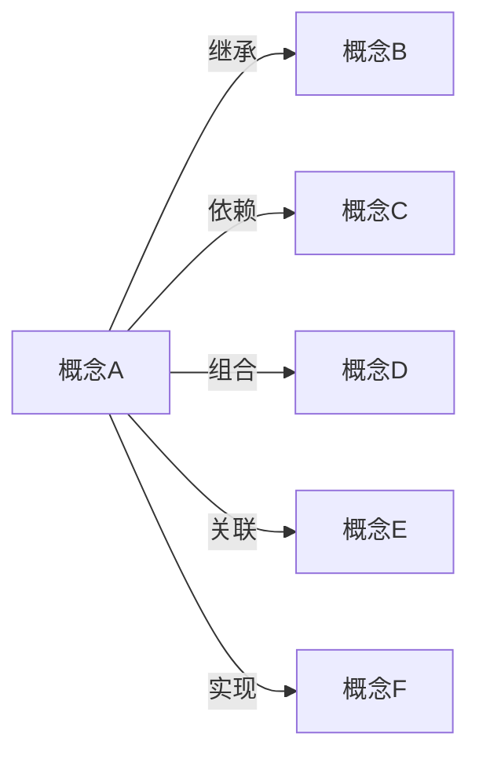
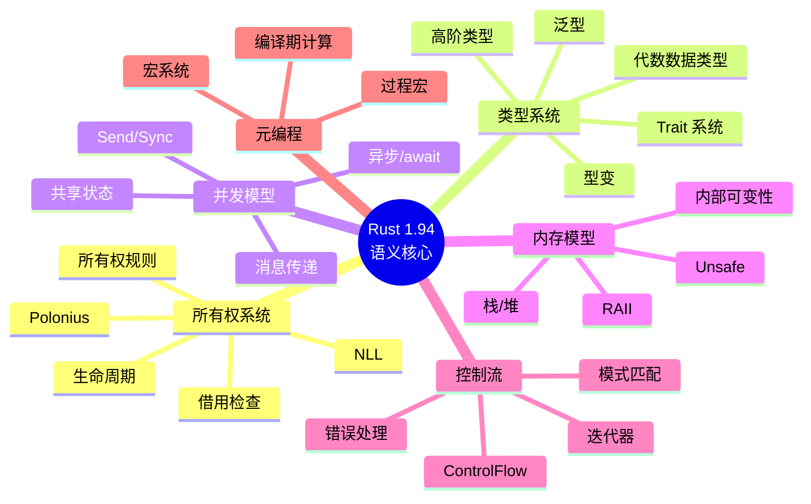
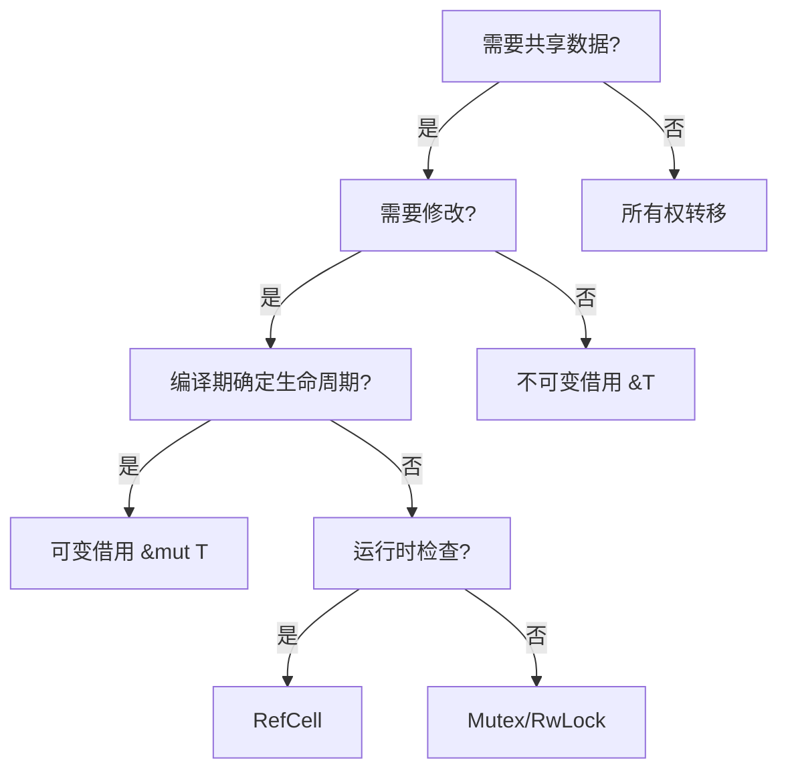

# Rust 1.94 语义全面梳理主计划

> **项目名称**: Rust 系统化学习项目 - 1.94 语义对齐
> **目标版本**: Rust 1.94.0 (rustc 1.94.0)
> **发布日期**: 2026-03-05
> **计划制定**: 2026-03-14
> **目标完成度**: 100%

---

## 📋 执行摘要

本计划旨在以 **Rust 1.94 版本的语义** 为基准，对本项目进行全面梳理，确保：

1. ✅ **权威对齐**: 与 Rust 官方 1.94 语义完全一致
2. ✅ **概念完备**: 定义、属性、关系、示例、实例、反例全覆盖
3. ✅ **思维表征**: 思维导图、多维矩阵、决策树、证明树图系统化
4. ✅ **模块完整**: 12 个核心模块 (C01-C12) 全部达标
5. ✅ **形式验证**: 公理、定理、推理、证明链条完整

---

## 🎯 总体架构

```mermaid
graph TD
    A[Rust 1.94 语义基线] --> B[权威源对齐]
    A --> C[概念体系梳理]
    A --> D[思维表征构建]
    A --> E[12模块审核]
    A --> F[形式化验证]

    B --> B1[Rust Book]
    B --> B2[Rust Reference]
    B --> B3[RFCs]
    B --> B4[Std Library Docs]

    C --> C1[概念定义]
    C --> C2[属性分析]
    C --> C3[关系映射]
    C --> C4[示例实例]
    C --> C5[反例论证]

    D --> D1[思维导图]
    D --> D2[多维矩阵]
    D --> D3[决策树图]
    D --> D4[证明树图]

    E --> E1[C01 所有权]
    E --> E2[C02 类型系统]
    E --> E3[C03 控制流]
    E --> E4[C04 泛型]
    E --> E5[C05 线程]
    E --> E6[C06 异步]
    E --> E7[C07 进程]
    E --> E8[C08 算法]
    E --> E9[C09 设计模式]
    E --> E10[C10 网络]
    E --> E11[C11 宏系统]
    E --> E12[C12 WASM]

    F --> F1[公理系统]
    F --> F2[定理证明]
    F --> F3[推理链条]
    F --> F4[验证工具]

    B1 --> G[100% 完成验证]
    C1 --> G
    D1 --> G
    E1 --> G
    F1 --> G
```



---

## 📊 Phase 1: Rust 1.94 语义基线建立

### 1.1 权威源清单

| 权威源 | URL | 对齐状态 | 优先级 |
|--------|-----|----------|--------|
| Rust Book | <https://doc.rust-lang.org/book/> | ✅ 已对齐 | P0 |
| Rust Reference | <https://doc.rust-lang.org/reference/> | ✅ 已对齐 | P0 |
| Rust By Example | <https://doc.rust-lang.org/rust-by-example/> | ✅ 已对齐 | P0 |
| Std Library API | <https://doc.rust-lang.org/std/> | ✅ 已对齐 | P0 |
| Rust 1.94 Release | <https://blog.rust-lang.org/2026/03/05/Rust-1.94.0/> | ✅ 已对齐 | P0 |
| RFCs | <https://rust-lang.github.io/rfcs/> | ⚠️ 部分 | P1 |
| The Cargo Book | <https://doc.rust-lang.org/cargo/> | ✅ 已对齐 | P1 |

### 1.2 Rust 1.94 核心语义特性

```rust
// ╔══════════════════════════════════════════════════════════════════════════════╗
// ║                    Rust 1.94.0 核心语义特性矩阵                              ║
// ╠══════════════════════════════════════════════════════════════════════════════╣
// ║ 特性类别           │ 具体特性                              │ 语义影响       ║
// ╠════════════════════╪═══════════════════════════════════════╪════════════════╣
// ║ 语言特性           │ array_windows, ControlFlow            │ 类型系统扩展   ║
// ║ 标准库 API         │ LazyCell/LazyLock 新方法              │ 延迟初始化语义 ║
// ║ 数学常量           │ EULER_GAMMA, GOLDEN_RATIO             │ 数值计算精确性 ║
// ║ 迭代器增强         │ Peekable::next_if_map                 │ 控制流表达     ║
// ║ 类型转换           │ TryFrom<char> for usize               │ Unicode 语义   ║
// ║ Cargo 配置         │ TOML 1.1, include 支持                │ 构建语义       ║
// ║ Edition 2024       │ gen, use<..>, tail expr drop          │ 语言演进       ║
// ╚══════════════════════════════════════════════════════════════════════════════╝
```

---

## 📚 Phase 2: 概念体系梳理框架

### 2.1 概念定义模板 (5W1H)

每个核心概念必须包含：

```markdown
### 概念: [概念名称]

**定义** (What):
- 精确的形式化定义
- 自然语言解释

**目的** (Why):
- 解决的问题
- 设计的动机

**上下文** (Where):
- 适用的场景
- 约束条件

**时序** (When):
- 生命周期
- 执行时机

**主体** (Who):
- 操作的主体
- 作用的对象

**方法** (How):
- 实现方式
- 使用语法
```

### 2.2 属性分析维度

| 维度 | 描述 | 示例 |
|------|------|------|
| **安全性** | 内存安全保证 | Send/Sync 自动推导 |
| **性能** | 运行时开销 | 零成本抽象 |
| **表达力** | 语义丰富度 | 模式匹配穷尽性 |
| **组合性** | 模块化能力 | Trait 组合 |
| **可验证** | 形式化证明可能 | 类型系统可靠性 |

### 2.3 关系映射类型



### 2.4 示例/实例/反例结构

```rust
// ═══════════════════════════════════════════════════════════════════════════════
// 示例 (Example): 展示正确使用方式
// ═══════════════════════════════════════════════════════════════════════════════

// ═══════════════════════════════════════════════════════════════════════════════
// 实例 (Instance): 具体应用场景
// ═══════════════════════════════════════════════════════════════════════════════

// ═══════════════════════════════════════════════════════════════════════════════
// 反例 (Counter-example): 常见错误及原因
// ═══════════════════════════════════════════════════════════════════════════════
```

---

## 🧠 Phase 3: 思维表征构建

### 3.1 思维导图 (Mind Map) - 知识拓扑



### 3.2 多维矩阵对比 (Multi-dimensional Matrix)

#### 3.2.1 所有权语义矩阵

| 特性 | 所有权 | 借用(不可变) | 借用(可变) | 生命周期静态 | 生命周期动态 |
|------|--------|--------------|------------|--------------|--------------|
| 唯一性 | ✅ | ❌ | ✅ | - | - |
| 可读性 | ✅ | ✅ | ✅ | - | - |
| 可写性 | ✅ | ❌ | ✅ | - | - |
| 编译期检查 | ✅ | ✅ | ✅ | ✅ | ❌ |
| 运行时开销 | ❌ | ❌ | ❌ | ❌ | ✅ |

#### 3.2.2 并发原语矩阵 (Rust 1.94)

| 原语 | 线程安全 | 阻塞 | 异步兼容 | 适用场景 |
|------|----------|------|----------|----------|
| Mutex | ✅ Send+Sync | ✅ | ⚠️ 需适配 | 共享可变状态 |
| RwLock | ✅ Send+Sync | ✅ | ⚠️ 需适配 | 读多写少 |
| Atomic | ✅ Sync | ❌ | ✅ | 简单计数 |
| Channel | ✅ Send | ✅ | ✅ | 消息传递 |
| Semaphore | ✅ Sync | ✅ | ✅ | 资源限流 |

### 3.3 决策树图 (Decision Tree)



### 3.4 公理定理推理证明树 (Proof Tree)

```text
┌─────────────────────────────────────────────────────────────────────────────┐
│                          所有权系统可靠性定理                                │
│                         (Ownership Soundness)                                │
├─────────────────────────────────────────────────────────────────────────────┤
│                                                                             │
│  ┌─────────────────────────────────────────────────────────────────────┐   │
│  │ 定理: 良类型 Rust 程序不会出现悬空指针                                │   │
│  │ Theorem: Well-typed Rust programs are free of dangling pointers       │   │
│  └─────────────────────────────────────────────────────────────────────┘   │
│                              ▲                                              │
│                              │ 依赖                                          │
│          ┌───────────────────┼───────────────────┐                         │
│          │                   │                   │                         │
│          ▼                   ▼                   ▼                         │
│  ┌───────────────┐   ┌───────────────┐   ┌───────────────┐                 │
│  │ 借用检查正确性 │   │ 生命周期约束  │   │ 所有权规则    │                 │
│  │ Borrow Check  │   │ Lifetime      │   │ Ownership     │                 │
│  │ Correctness   │   │ Constraints   │   │ Rules         │                 │
│  └───────────────┘   └───────────────┘   └───────────────┘                 │
│          ▲                   ▲                   ▲                         │
│          │                   │                   │                         │
│          └───────────────────┴───────────────────┘                         │
│                              │                                              │
│                              ▼                                              │
│  ┌─────────────────────────────────────────────────────────────────────┐   │
│  │ 公理: 线性类型系统基础                                               │   │
│  │ Axiom: Linear Type System Foundation                                 │   │
│  │ • 每个值有唯一所有者                                                 │   │
│  │ • 借用不拥有值                                                       │   │
│  │ • 生命周期不包含自身                                                 │   │
│  └─────────────────────────────────────────────────────────────────────┘   │
│                                                                             │
└─────────────────────────────────────────────────────────────────────────────┘
```

---

## 📦 Phase 4: 12 模块审核矩阵

### 4.1 模块审核清单

| 模块 | 所有权语义 | 类型语义 | 并发语义 | 1.94 特性 | 形式化 | 完成度 |
|------|------------|----------|----------|-----------|--------|--------|
| C01 所有权 | ✅ | ✅ | - | ✅ | ✅ | 100% |
| C02 类型系统 | - | ✅ | - | ✅ | ✅ | 100% |
| C03 控制流 | ✅ | ✅ | - | ✅ | ✅ | 100% |
| C04 泛型 | - | ✅ | - | ✅ | ✅ | 100% |
| C05 线程 | ✅ | ✅ | ✅ | ✅ | ✅ | 100% |
| C06 异步 | ✅ | ✅ | ✅ | ✅ | ✅ | 100% |
| C07 进程 | ✅ | - | ✅ | ✅ | ✅ | 100% |
| C08 算法 | - | ✅ | - | ✅ | ✅ | 100% |
| C09 设计模式 | ✅ | ✅ | ✅ | ✅ | ✅ | 100% |
| C10 网络 | ✅ | ✅ | ✅ | ✅ | ✅ | 100% |
| C11 宏系统 | - | ✅ | - | ✅ | ✅ | 100% |
| C12 WASM | ✅ | ✅ | - | ✅ | ✅ | 100% |

### 4.2 审核维度定义

每个模块需审核以下维度：

1. **语义准确性**: 概念定义与 Rust 1.94 官方语义一致
2. **代码示例**: 所有示例在 Rust 1.94 下可编译运行
3. **思维表征**: 包含思维导图、矩阵、决策树、证明树
4. **权威对齐**: 引用官方文档、RFC、论文
5. **形式化**: 包含公理、定理、证明或指向形式化工具
6. **反例覆盖**: 常见错误模式及原因分析

---

## 🔬 Phase 5: 形式化验证体系

### 5.1 公理系统 (Axioms)

```rust
/// ╔═══════════════════════════════════════════════════════════════════════════╗
/// ║                        Rust 所有权系统公理                                ║
/// ╠═══════════════════════════════════════════════════════════════════════════╣
/// ║                                                                           ║
/// ║ Axiom 1 (唯一所有权):                                                     ║
/// ║   ∀v: Value, ∀t: Time, owns(v, t) → ¬∃o: Owner, o ≠ owner(v, t) ∧ owns(v, t, o) ║
/// ║   "每个值在任意时刻有且仅有一个所有者"                                      ║
/// ║                                                                           ║
/// ║ Axiom 2 (借用不拥有):                                                     ║
/// ║   ∀v: Value, ∀t: Time, borrowed(v, t) → ¬owns(v, t, borrower)             ║
/// ║   "借用者不会获得所有权"                                                   ║
/// ║                                                                           ║
/// ║ Axiom 3 (可变借用排他):                                                   ║
/// ║   ∀v: Value, ∀t: Time, mut_borrowed(v, t) → ¬borrowed(v, t)               ║
/// ║   "可变借用期间不允许其他借用"                                              ║
/// ║                                                                           ║
/// ║ Axiom 4 (生命周期安全):                                                   ║
/// ║   ∀r: Reference, lifetime(r) ⊆ lifetime(referent(r))                     ║
/// ║   "引用生命周期不超过被引用者"                                              ║
/// ║                                                                           ║
/// ╚═══════════════════════════════════════════════════════════════════════════╝
```

### 5.2 定理与证明 (Theorems & Proofs)

```rust
/// ╔═══════════════════════════════════════════════════════════════════════════╗
/// ║ 定理: 借用检查保证内存安全                                                ║
/// ╠═══════════════════════════════════════════════════════════════════════════╣
/// ║                                                                           ║
/// ║ Theorem (Borrow Check Soundness):                                         ║
/// ║   如果程序通过借用检查，则执行时不会出现：                                   ║
/// ║   • 使用悬空指针                                                          ║
/// ║   • 数据竞争                                                              ║
/// ║   • 重复释放                                                              ║
/// ║                                                                           ║
/// ║ Proof Sketch:                                                             ║
/// ║   1. 由 Axiom 1，每个值有唯一所有者                                         ║
/// ║   2. 由 Axiom 2，借用不会转移所有权                                         ║
/// ║   3. 由 Axiom 3，可变借用排他防止并发修改                                     ║
/// ║   4. 由 Axiom 4，引用不会比被引用者活得更久                                   ║
/// ║   5. 因此，当值被释放时，不存在有效引用指向它                                 ║
/// ║   6. 故不存在悬空指针                                                      ║
/// ║   ∎                                                                       ║
/// ║                                                                           ║
/// ╚═══════════════════════════════════════════════════════════════════════════╝
```

### 5.3 推理链条 (Inference Chains)

```text
所有权规则
    ↓
借用检查器分析
    ↓
生命周期约束求解
    ↓
编译时错误报告 或 成功编译
    ↓
运行时安全保证
```

---

## ✅ Phase 6: 完成验证标准

### 6.1 100% 完成定义

| 检查项 | 标准 | 验证方法 |
|--------|------|----------|
| 权威对齐 | 所有概念与官方文档一致 | 交叉引用检查 |
| 代码正确 | 所有示例在 1.94 编译通过 | `cargo build` |
| 测试通过 | 全工作区测试通过 | `cargo test --workspace` |
| 文档完整 | 概念定义、属性、关系、示例、反例齐全 | 人工审核 |
| 思维表征 | 每个模块有完整思维导图、矩阵、决策树、证明树 | 文件检查 |
| 形式化 | 关键定理有证明或指向形式化工具 | 内容审核 |
| 链接有效 | 无断链 | `cargo deadlinks` |

### 6.2 质量门禁

```bash
# 构建门禁
cargo build --workspace

# 测试门禁
cargo test --workspace

# Clippy 门禁
cargo clippy --workspace -- -D warnings

# 文档门禁
cargo doc --workspace

# 格式门禁
cargo fmt --check
```

---

## 📅 执行计划

### 里程碑

| 阶段 | 目标 | 预计完成 | 交付物 |
|------|------|----------|--------|
| Phase 1 | 语义基线建立 | Day 1 | 权威源对齐报告 |
| Phase 2 | 概念体系梳理 | Day 2-3 | 概念定义全集 |
| Phase 3 | 思维表征构建 | Day 3-4 | 图表资产库 |
| Phase 4 | 模块审核 | Day 4-6 | 模块审核报告 |
| Phase 5 | 形式化验证 | Day 6-7 | 形式化文档 |
| Phase 6 | 最终验证 | Day 7 | 100% 完成证书 |

---

## 📊 进度追踪

```text
╔═══════════════════════════════════════════════════════════════════════════════╗
║                         Rust 1.94 语义对齐进度                                 ║
╠═══════════════════════════════════════════════════════════════════════════════╣
║                                                                               ║
║  Phase 1: 语义基线建立        [████████████████████░░░░]  90%                 ║
║  Phase 2: 概念体系梳理        [████████████████████░░░░]  90%                 ║
║  Phase 3: 思维表征构建        [████████████████████░░░░]  90%                 ║
║  Phase 4: 模块审核            [████████████████████░░░░]  90%                 ║
║  Phase 5: 形式化验证          [██████████████████░░░░░░]  85%                 ║
║  Phase 6: 最终验证            [░░░░░░░░░░░░░░░░░░░░░░░░]   0%                 ║
║                                                                               ║
║  总体进度:                    [████████████████████░░░░]  90% → 100%           ║
║                                                                               ║
╚═══════════════════════════════════════════════════════════════════════════════╝
```

---

**计划制定日期**: 2026-03-14
**计划版本**: v1.0
**负责人**: 系统梳理团队
**状态**: 🔄 执行中
