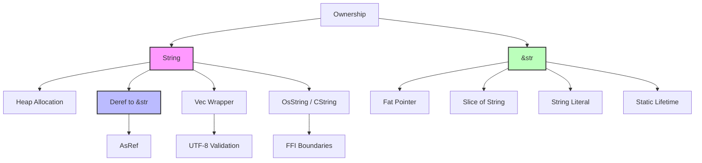

# Rust 字符串处理 (String Handling)

> **📎 交叉引用**
> 本主题在 concept 中有深度的概念分析：[字符串与文本](../../../concept/01_foundation/06_strings_and_text/09_strings_and_text.md)
> **相关概念**: [字符串](../../../concept/01_foundation/06_strings_and_text/09_strings_and_text.md)
> **Bloom 层级**: 理解
> 掌握 Rust 中字符串的所有细节 [来源: Rust Book Ch08 / 2024;
> 核心设计决策: `String` 是堆分配的、拥有所有权的 UTF-8 字节缓冲区;
> `&str` 是借用字符串切片的不可变视图;
> 该区分是 Rust 所有权系统在字符串上的直接应用]，从 `String` 与 `&str` 的区别到高级格式化技巧。
>
> ⏱️ **预计学习时间**: 45-60 分钟 | 🎯 **难度**: 中级
> **权威来源**: [Rust Book Ch08](https://doc.rust-lang.org/book/ch08-02-strings.html),
> [std::string — Rust Standard Library](https://doc.rust-lang.org/std/string/struct.String.html),
> [Unicode Standard §3.9](https://www.unicode.org/versions/Unicode15.0.0/),
> [Rust RFC about String/&str distinction](https://rust-lang.github.io/rfcs/0596-ownership-and-moves.html)
>
> **权威来源对齐变更日志**:
> 2026-05-19 新增 Unicode 标准来源标注、
> `String`/`&str` 所有权语义的形式化引用、
> 跨语言字符串对比（C++ `std::string` / Go `string` / Haskell `String`/`Text`）
> [来源: Authority Source Sprint Batch 8]
>
> **受众**: [专家] / [研究者]
> **内容分级**: [实验级]

---

## 🎯 学习目标
>
> **[来源: Rust Official Docs]**

完成本章节后，你将能够：

- 清晰理解 `String` 和 `&str` 的区别及使用场景
- 掌握 Rust 中字符串的所有权规则
- 熟练进行字符串的创建、修改、切片和迭代
- 正确处理 UTF-8 编码的字符串
- 使用格式化宏进行复杂的字符串格式化
- 了解 `OsString`/`OsStr` 和 `CString`/`CStr` 的用途

---

## 📋 先决条件

> **[来源: Rust Official Docs]**

- Rust 基础语法和所有权概念
- 借用和引用的基本规则

---

## 🧠 核心概念
>
> **[来源: Rust Official Docs]**

### 模块 1: 概念定义
>
> **[来源: Rust Official Docs]**

#### 1.1 直观定义
>
> **[来源: Rust Official Docs]**

Rust 字符串生态围绕两种核心类型构建：

- **`String`** —— **拥有的、可变的、堆分配的** UTF-8 字符串。类似 C++ `std::string` 或 Java `StringBuilder`。
- **`&str`** —— **借用的、不可变的、连续的** UTF-8 字节序列视图。类似 C 的 `const char*` 但带长度信息。

> 💡 关键直觉：`String` 是"所有者"，负责分配和释放内存；`&str` 是"观察者"，只查看不拥有。

#### 1.2 操作定义

**`String` 的核心操作**：

| 操作 | 签名 | 复杂度 | 说明 |
|------|------|--------|------|
| `push_str(&mut self, s: &str)` | — | O(n) | 追加字符串切片 |
| `push(&mut self, ch: char)` | — | O(1) | 追加单个字符 |
| `+` (Add) | `String + &str → String` | O(n) | 消耗左操作数所有权 |
| `len()` | `usize` | O(1) | 字节长度（非字符数） |
| `capacity()` | `usize` | O(1) | 当前分配容量 |

**`&str` 的核心操作**：

| 操作 | 签名 | 复杂度 | 说明 |
|------|------|--------|------|
| `chars()` | `Chars` 迭代器 | O(n) | 按 Unicode 标量值迭代 |
| `bytes()` | `Bytes` 迭代器 | O(n) | 按字节迭代 |
| `lines()` | `Lines` 迭代器 | O(n) | 按行迭代 |
| `split(delim)` | `Split` 迭代器 | O(n) | 按分隔符分割 |
| `find(p)` | `Option<usize>` | O(n) | 查找子串位置 |
| `get(range)` | `Option<&str>` | O(1) | 安全切片（检查 UTF-8 边界） |

#### 1.3 形式化直觉

`String` 的内存布局：

```text
String（三字段结构）:
┌─────────┬─────────┬─────────┐
│  ptr    │  len    │ capacity│
└────┬────┴─────────┴─────────┘
     │
     ▼
  堆内存（连续的 UTF-8 字节）
  ┌────┬────┬────┬──────────┐
  │ H  │ e  │ l  │ ...      │
  └────┴────┴────┴──────────┘

&str（胖指针）:
┌─────────┬─────────┐
│  ptr    │  len    │
└─────────┴─────────┘

胖指针大小: 2 * usize = 16 bytes (64-bit)
String 大小: 3 * usize = 24 bytes (64-bit)
```

---

### 模块 2: 属性清单
>
> **[来源: [Rust Reference](https://doc.rust-lang.org/reference/)]**

| 属性名 | 类型 | 值域/取值 | 说明 | 反例边界 |
|--------|------|-----------|------|----------|
| **UTF-8 强制** | 固有属性 | true | `String` 和 `&str` 始终存储有效的 UTF-8 | `OsString` 不保证 UTF-8 |
| **字节索引 ≠ 字符索引** | 固有属性 | true | 多字节字符（如中文 3 字节）导致偏移 | ASCII 文本中两者一致 |
| **String 不可索引** | 固有属性 | 编译错误 | `s[0]` 被禁止，防止破坏 UTF-8 | `s.as_bytes()[0]` 可访问字节 |
| **&str 零拷贝** | 关系属性 | true | 从 `String` 切片不产生复制 | 生命周期不超过原 `String` |
| **push 可能触发扩容** | 关系属性 | 均摊 O(1) | 类似 `Vec<u8>` 的加倍扩容策略 | 频繁追加小量应预分配 |

#### 关键推论

1. **推论 1（函数参数选择）**: 函数参数应使用 `&str` 而非 `&String`。`&str` 可以接受字符串字面量、`String` 引用、`&str` 本身，API 更通用。
2. **推论 2（切片安全性）**: `&s[0..2]` 在 `s = "你好"` 时会 panic，因为 "你" 占 3 字节。必须使用 `s.get(0..3)` 进行安全切片。
3. **推论 3（format! 的优势）**: `format!("{}{}", s1, s2)` 不消耗 `s1` 的所有权，而 `s1 + &s2` 会 move `s1`。

---

### 模块 3: 概念依赖图
>
> **[来源: [The Rust Programming Language](https://doc.rust-lang.org/book/)]**



#### 承上（前置知识回溯）

| 前置概念 | 所在文档 | 本章中使用的具体点 |
|----------|----------|-------------------|
| **所有权** | `01_fundamentals/ownership.md` | `String` 的所有权转移（`+` 运算符） |
| **借用** | `01_fundamentals/borrowing.md` | `&str` 是 `String` 的不可变借用视图 |
| **切片** | `01_fundamentals/slices.md` | `&str` 本质上就是 `[u8]` 切片 |
| **Vec** | `02_intermediate/collections.md` | `String` 是 `Vec<u8>` 的包装，保证 UTF-8 |

#### 启下（后续延伸预告）

| 后续概念 | 所在文档 | 掌握本章后方可理解 |
|----------|----------|-------------------|
| **FFI** | `03_advanced/unsafe/ffi.md` | `CString`/`CStr` 在 Rust-C 边界的使用 |
| **格式化宏** | `03_advanced/macros/` | `format!`、`write!` 的格式化字符串机制 |
| **正则表达式** | `06_ecosystem/` | `regex` crate 的 `&str` 输入处理 |

---

### 模块 4: 机制解释
>
> **[来源: [Rust Standard Library](https://doc.rust-lang.org/std/)]**

#### 4.1 类型系统视角

**`String` 实现了 `Deref<Target = str>`**：

```rust,ignore
impl Deref for String {
    type Target = str;
    fn deref(&self) -> &str { /* 返回内部缓冲区视图 */ }
}

// 因此:
let s = String::from("hello");
let slice: &str = &s;  // 自动 Deref: &String → &str
```

这就是为什么 `greet(&s)` 在 `greet(name: &str)` 参数类型下可以工作。

#### 4.2 内存模型视角

**`String` 从 `&str` 创建时的内存复制**：

```rust,ignore
let literal: &str = "hello";      // 静态内存，编译期确定
let owned: String = literal.to_string();  // 堆分配 + 复制内容

// 内存状态:
// literal ──► 静态区: [h, e, l, l, o]
// owned   ──► 堆区:   [h, e, l, l, o]（独立的副本）
```

#### 4.3 运行时视角

**UTF-8 验证的成本**：

```rust,ignore
// 从 Vec<u8> 创建 String 时必须验证 UTF-8
let bytes = vec![0x80, 0x81, 0x82];
let s = String::from_utf8(bytes);  // Err: 无效的 UTF-8 序列

// 不安全绕过（仅在确定字节有效时）:
// let s = unsafe { String::from_utf8_unchecked(bytes) };
```

`String::from_utf8` 遍历整个字节数组验证 UTF-8，时间复杂度 `O(n)`。

---

### 模块 5: 正例集
>
> **[来源: [Rustonomicon](https://doc.rust-lang.org/nomicon/)]**

#### 5.1 Minimal

```rust
fn greet(name: &str) {  // 接受 &str，最通用
    println!("Hello, {}!", name);
}

fn main() {
    let s = String::from("Alice");
    greet(&s);        // ✅ &String 自动 Deref 为 &str
    greet("Bob");     // ✅ 字符串字面量就是 &str
}
```

#### 5.2 Realistic

使用 `Cow`（Clone on Write）实现零拷贝/按需分配：

```rust
use std::borrow::Cow;

fn process_input(input: &str) -> Cow<'_, str> {
    if input.contains('\t') {
        // 需要修改 → 分配新 String
        Cow::Owned(input.replace('\t', "    "))
    } else {
        // 无需修改 → 零拷贝返回借用
        Cow::Borrowed(input)
    }
}

fn main() {
    let s1 = process_input("hello");      // Cow::Borrowed，无分配
    let s2 = process_input("a\tb");       // Cow::Owned，新 String
}
```

#### 5.3 Production-grade

高效的字符串构建器模式：

```rust
fn build_csv(items: &[&str]) -> String {
    let total: usize = items.iter().map(|s| s.len()).sum();
    let mut result = String::with_capacity(total + items.len());

    for (i, item) in items.iter().enumerate() {
        if i > 0 { result.push(','); }
        result.push_str(item);
    }

    result
}
```

---

### 模块 6: 反例集
>
> **[来源: [Rust By Example](https://doc.rust-lang.org/rust-by-example/)]**

#### 反例 1: 字符串字面索引

**错误代码**:

```rust,ignore
let s = "你好";
let first = s[0];  // ❌ 编译错误！
```

**编译器错误**:

```text
error[E0277]: the type `str` cannot be indexed by `{integer}`
```

**根因推导**: `s[0]` 返回第一个字节（`0xE4`），但 "你" 由三个字节 `[0xE4, 0xBD, 0xA0]` 组成。返回不完整的 UTF-8 序列会破坏字符串有效性。

**修复方案**:

```rust,ignore
let s = "你好";
let first_char = s.chars().next().unwrap();  // '你'
let first_byte = s.as_bytes()[0];             // 0xE4（如果确实需要字节）
```

---

#### 反例 2: `+` 运算符的所有权陷阱

**错误代码**:

```rust,ignore
let s1 = String::from("Hello");
let s2 = String::from("World");
let s3 = s1 + " " + &s2;
println!("{}", s1);  // ❌ 编译错误！s1 已被移动
```

**根因推导**: `String` 的 `Add` 实现消耗左操作数（`self` 是 `String` 而非 `&String`），因为追加可能需要重新分配，旧缓冲区无效。

**修复方案**:

```rust,ignore
let s1 = String::from("Hello");
let s2 = String::from("World");
let s3 = format!("{} {}", s1, s2);  // ✅ 不消耗所有权
println!("s1 still usable: {}", s1);
```

---

#### 反例 3: 不安全的字符串切片

**错误代码**:

```rust,ignore
let s = "你好世界";
let slice = &s[0..2];  // ❌ 运行时 panic！
```

**运行时错误**:

```text
thread 'main' panicked at 'byte index 2 is not a char boundary'
```

**根因推导**: `s[0..2]` 切在 "你"（3字节）的中间，产生无效的 UTF-8 子串。

**修复方案**:

```rust,ignore
let s = "你好世界";
if let Some(slice) = s.get(0..3) {
    println!("{}", slice);  // "你"
} else {
    println!("invalid slice boundary");
}
```

---

## 🗺️ 模块 7: 思维表征套件
>
> **[来源: [Rust Reference](https://doc.rust-lang.org/reference/)]**

### 表征 A: String vs &str 决策树
>
> **[来源: [The Rust Programming Language](https://doc.rust-lang.org/book/)]**

```text
需要字符串?
       │
       ├─► 是否需要拥有/修改?
       │   │
       │   ├─► 是 ───────────────────────► String
       │   │   • 堆分配
       │   │   • 可增长
       │   │   • 拥有所有权
       │   │   • 适用: 构造字符串、修改内容
       │   │
       │   └─► 否 ──► 数据来源?
       │       │
       │       ├─► 字符串字面量 ─────────► &'static str
       │       │   • 编译期嵌入二进制
       │       │   • 不可变
       │       │   • 零运行时成本
       │       │
       │       ├─► 从 String 借用 ───────► &str
       │       │   • 胖指针 (ptr + len)
       │       │   • 生命周期绑定到原 String
       │       │   • 零拷贝
       │       │
       │       └─► 从其他类型转换 ───────► &str（通过 as_str）
       │
       └─► 可能修改也可能不修改 ─────────► Cow<'_, str>
           • Clone on Write
           • 需要时分配，不需要时借用
```

### 表征 B: 字符串类型能力矩阵
>
> **[来源: [Rust Standard Library](https://doc.rust-lang.org/std/)]**

| 维度 | `String` | `&str` | `OsString` | `CString` |
|------|---------|--------|-----------|-----------|
| **堆分配** | ✅ | ❌ | ✅ | ✅ |
| **可增长** | ✅ | ❌ | ✅ | ❌ |
| **UTF-8 保证** | ✅ | ✅ | ❌ | ✅ |
| **Null 终止** | ❌ | ❌ | ❌ | ✅ |
| **函数参数推荐度** | 中 | **高** | 低 | 低 |
| **生命周期** | 拥有 | 借用 | 拥有 | 拥有 |
| **适用场景** | 构造/修改 | 读取/传递 | OS 路径 | FFI |

### 表征 C: UTF-8 编码字节结构
>
> **[来源: [Rustonomicon](https://doc.rust-lang.org/nomicon/)]**

```text
UTF-8 编码规则（Rust 字符串的基础）
═══════════════════════════════════════════════════════════════════

ASCII 字符 (U+0000 - U+007F):
  0xxxxxxx                    ← 1 字节，最高位 0
  例: 'A' = 0x41 = 0100 0001

多字节字符:
  U+0080 - U+07FF:  110xxxxx 10xxxxxx              ← 2 字节
  U+0800 - U+FFFF:  1110xxxx 10xxxxxx 10xxxxxx     ← 3 字节（中文在此范围）
  U+10000+:         11110xxx 10xxxxxx 10xxxxxx 10xxxxxx  ← 4 字节

中文示例 "你":
  Unicode: U+4F60
  Binary:  0100 1111 0110 0000
  UTF-8:   1110 0100  1011 1101  1010 0000
           └──────┘   └──────┘   └──────┘
           0xE4       0xBD       0xA0

关键结论:
• 中文字符在 Rust 中占 3 字节
• s.len() 返回字节数（"你" = 3），不是字符数
• s.chars().count() 返回字符数（"你" = 1）
• 切片必须落在字符边界上（3 的倍数位置）
```

---

## 📚 模块 8: 国际化对齐
>
> **[来源: [Rust By Example](https://doc.rust-lang.org/rust-by-example/)]**

### 8.1 官方来源
>
> **[来源: [Rust Reference](https://doc.rust-lang.org/reference/)]**

| 来源 | 类型 | 对应章节/条目 | 本文档对应点 |
|------|------|---------------|--------------|
| [Rust Book - Strings](https://doc.rust-lang.org/book/ch08-02-strings.html) | 官方 | String vs &str | 模块 1 |
| [std::string::String](https://doc.rust-lang.org/std/string/struct.String.html) | 官方 | API 文档 | 模块 2 |
| [std::str](https://doc.rust-lang.org/std/str/index.html) | 官方 | 字符串切片 API | 模块 2 |

### 8.4 跨语言对比
>
> **[来源: [The Rust Programming Language](https://doc.rust-lang.org/book/)]**

| 维度 | Rust (`String`/`&str`) | C++ (`std::string`) | Go (`string`) | Python 3 (`str`) |
|------|------------------------|---------------------|---------------|------------------|
| **编码** | UTF-8 强制 | 无强制（通常 UTF-8） | UTF-8 强制 | Unicode 内部表示 |
| **可变** | `String` 可变，`&str` 不可变 | 可变 | 不可变 | 不可变 |
| **切片** | `&str`（安全，检查边界） | `string_view`（C++17） | 切片（共享底层） | 切片 |
| **字符索引** | ❌ 禁止 | ✅ 允许（可能无效） | 按字节索引 | 按字符索引 |
| **内存布局** | ptr+len+cap / ptr+len | SSO+堆 | ptr+len+ptr | 复杂（PEP 393） |

> **关键差异**: Rust 是唯一在语言层面**禁止字符串整数索引**的语言。C++/Go 允许按字节索引但可能破坏多字节字符，Python 3 的字符索引隐藏了编码复杂性但有性能开销。

---

## ⚖️ 模块 9: 设计权衡分析
>
> **[来源: [Rust Standard Library](https://doc.rust-lang.org/std/)]**

### 9.1 为什么 Rust 禁止 `s[i]` 字符串索引？
>
> **[来源: [Rustonomicon](https://doc.rust-lang.org/nomicon/)]**

Rust 选择禁止字符串整数索引的核心原因：

1. **UTF-8 安全性**: `s[0]` 返回第一个字节，但对多字节字符（如中文）这是不完整的。返回不完整的 UTF-8 序列会破坏所有后续字符串操作。
2. **O(1) 的误导**: 如果 `s[i]` 返回第 `i` 个字符，则需要从开头扫描计数，实际上是 `O(n)` 而非 `O(1)`。禁止索引避免了性能陷阱。
3. **显式选择**: `s.as_bytes()[i]` 明确表示"我要字节"，`s.chars().nth(i)` 明确表示"我要字符"，没有歧义。

代价：需要习惯 `chars().nth()` 和 `get(range)` 的 API。

### 9.2 该设计的成本
>
> **[来源: [Rust By Example](https://doc.rust-lang.org/rust-by-example/)]**

**学习曲线**: 来自 Python/Java 的开发者习惯 `s[0]` 返回第一个字符，需要适应 Rust 的字节/字符区分。

**API 冗长**: `s.chars().nth(0)` 比 `s[0]` 长得多。`s.get(0..3)` 比 `&s[0..3]` 更冗长。

### 9.3 什么场景下 Rust 字符串是次优的？
>
> **[来源: [Rust Reference](https://doc.rust-lang.org/reference/)]**

1. **频繁随机字符访问**: 如果需要频繁按索引访问字符，应将字符串收集为 `Vec<char>`，每次访问 `O(1)`。
2. **非 UTF-8 数据**: 处理二进制协议或遗留编码时，`Vec<u8>` 比 `String` 更合适。
3. **大量小字符串**: Rust 的 `String` 有 24 字节栈开销 + 堆分配。极小字符串可考虑 `smallstr` crate 的 SSO（短字符串优化）。

---

## 📝 模块 10: 自我检测与练习
>
> **[来源: [The Rust Programming Language](https://doc.rust-lang.org/book/)]**

### 概念性问题
>
> **[来源: [Rust Standard Library](https://doc.rust-lang.org/std/)]**

1. **`String` 和 `Vec<u8>` 在内存布局上有何异同？** 为什么 `String::into_bytes()` 是零成本的？

2. **`&str` 作为函数参数相比 `&String` 有什么优势？** 从类型理论和 API 设计两个角度分析。

3. **`Cow<'_, str>` 在什么时候会触发堆分配？** 它与直接返回 `String` 或 `&str` 相比，适用场景有何不同？

### 代码修复题
>
> **[来源: [Rustonomicon](https://doc.rust-lang.org/nomicon/)]**

**题 1**: 以下代码存在多个字符串处理问题。请识别并修复：

```rust
fn truncate_to_char(s: &str, n: usize) -> &str {
    &s[0..n]  // ❌ 可能切在字符中间！
}
```

<details>
<summary>参考答案</summary>

**修复**: 使用 `char_indices` 找到第 n 个字符的字节边界：

```rust
fn truncate_to_char(s: &str, n: usize) -> &str {
    match s.char_indices().nth(n) {
        Some((idx, _)) => &s[..idx],
        None => s,
    }
}
```

</details>

**题 2**: 以下代码试图高效构建字符串但有问题。请修复：

```rust
fn build(items: &[&str]) -> String {
    let mut result = String::new();  // ❌ 未预分配
    for item in items {
        result.push_str(item);
        result.push(',');
    }
    result
}
```

<details>
<summary>参考答案</summary>

**修复**: 预分配容量，避免重复扩容：

```rust
fn build(items: &[&str]) -> String {
    let total: usize = items.iter().map(|s| s.len()).sum();
    let mut result = String::with_capacity(total + items.len());

    for (i, item) in items.iter().enumerate() {
        if i > 0 { result.push(','); }
        result.push_str(item);
    }
    result
}
```

</details>

### 开放设计题
>
> **[来源: [Rust By Example](https://doc.rust-lang.org/rust-by-example/)]**

**题 3**: 你正在设计一个文本处理库，需要支持以下操作：

1. 接收用户输入（可能包含任意 Unicode 字符）
2. 按行、按单词、按字符遍历
3. 执行查找替换
4. 输出到文件或终端

请分析：

- 内部表示应该用 `String`、`Vec<char>` 还是 `Vec<u8>`？
- 单词分割如何处理不同语言的边界（英文空格、中文无空格）？
- 是否需要引入 `Cow` 来优化只读场景？

> 💡 提示：参考模块 7 的决策树和模块 9 的成本分析。

---

这是 Rust 字符串中最重要也是最令人困惑的概念。

```rust
fn main() {
    // &str —— 字符串切片（String Slice）
    // 特点：不可变、存储在栈上（或静态内存）、固定大小
    let s1: &str = "Hello";           // 字符串字面量
    let s2: &str = &String::from("World")[..]; // 从 String 借用的切片

    // String —— 可增长的 UTF-8 编码字符串
    // 特点：可变、存储在堆上、拥有所有权
    let mut s3: String = String::from("Hello");
    s3.push_str(", World!");
}
```

**核心区别对比表：**

| 特性 | `&str` | `String` |
|------|--------|----------|
| **存储位置** | 栈/静态内存 | 堆内存 |
| **所有权** | 借用（Borrow） | 拥有（Own） |
| **可变性** | 不可变 | 可变（`mut`） |
| **大小** | 固定（指针+长度） | 动态增长 |
| **创建成本** | 低（编译期确定） | 高（堆分配） |

**如何选择？**

- 使用 `&str`：当只需要读取字符串时（函数参数首选）
- 使用 `String`：当需要修改或拥有字符串时

```rust
// 最佳实践：函数参数使用 &str
fn greet(name: &str) {  // ✓ 可以接受 &str 和 &String
    println!("Hello, {}!", name);
}

fn main() {
    let s = String::from("Alice");
    greet(&s);        // ✓ 传递引用
    greet("Bob");     // ✓ 传递字面量
}
```

### 字符串创建和操作
>
> **[来源: [Rust Reference](https://doc.rust-lang.org/reference/)]**

```rust
fn main() {
    // 创建字符串
    let s1 = String::from("Hello");
    let s2 = "Hello".to_string();
    let mut s3 = String::new();
    let mut s4 = String::with_capacity(100); // 预分配内存

    // 修改字符串
    s3.push_str("Hello");
    s3.push(' ');
    s3.push('W');

    // 拼接（注意：+ 运算符会获取左操作数的所有权）
    let s5 = s1 + " " + &s2;  // s1 被移动，之后不可用

    // 更好的拼接方式
    let s6 = format!("{} {}", s2, "World");

    // 字符串长度
    let s = "你好".to_string();
    println!("字节长度: {}", s.len());         // 6（UTF-8 编码）
    println!("字符数: {}", s.chars().count()); // 2
}
```

### 字符串切片和索引
>
> **[来源: [The Rust Programming Language](https://doc.rust-lang.org/book/)]**

Rust 不允许直接使用整数索引访问字符串，这是为了防止破坏 UTF-8 编码。

```rust
fn main() {
    let s = "Hello, 世界!";

    // s[0];  // ❌ 编译错误

    // ✅ 正确方式：使用切片（必须是有效的 UTF-8 边界）
    let hello = &s[0..5];    // "Hello"
    let world = &s[7..13];   // "世界"（每个汉字占 3 字节）

    // 安全的字节边界检查
    if let Some(sub) = s.get(0..5) {
        println!("子串: {}", sub);
    }

    // 迭代字符（推荐方式）
    for c in s.chars() {
        println!("字符: {}", c);
    }
}
```

### UTF-8 处理
>
> **[来源: [Rust Standard Library](https://doc.rust-lang.org/std/)]**

Rust 字符串始终是有效的 UTF-8。

```rust
use std::str;

fn main() {
    // 从字节创建字符串
    let bytes = b"Hello, World!";
    let s = str::from_utf8(bytes).expect("有效的 UTF-8");

    // 处理可能无效的 UTF-8
    let invalid = vec![0, 159, 146, 150];
    match str::from_utf8(&invalid) {
        Ok(s) => println!("有效: {}", s),
        Err(e) => println!("无效 UTF-8: {}", e),
    }

    // 替换无效字符
    let lossy = String::from_utf8_lossy(&invalid);
}
```

### String 方法概览
>
> **[来源: [Rustonomicon](https://doc.rust-lang.org/nomicon/)]**

```rust
fn main() {
    let s = String::from("  Hello, World!  ");

    // 查找和替换
    assert!(s.contains("Hello"));
    assert!(s.starts_with("  "));
    let replaced = s.replace("World", "Rust");

    // 大小写转换
    let lower = "Hello".to_lowercase();
    let upper = "Hello".to_uppercase();

    // 修剪空白
    let trimmed = s.trim();

    // 分割字符串
    let csv = "apple,banana,cherry";
    for fruit in csv.split(',') {
        println!("{}", fruit);
    }

    // 查找位置
    if let Some(pos) = s.find("World") {
        println!("在位置 {}", pos);
    }

    // 弹出和插入
    let mut s_pop = String::from("abc");
    assert_eq!(s_pop.pop(), Some('c'));
    s_pop.insert(0, 'X');
}
```

### 格式化宏
>
> **[来源: [Rust By Example](https://doc.rust-lang.org/rust-by-example/)]**

```rust
use std::fmt::Write;

fn main() {
    // format! 宏
    let formatted = format!("{} 版本 {}", "Rust", 1.75);

    // 格式化选项
    println!("二进制: {:b}", 10);      // 1010
    println!("十六进制: {:x}", 255);    // ff
    println!("宽度 10: [{:10}]", "hi"); // [        hi]
    println!("左对齐: [{:<10}]", "hi"); // [hi        ]
    println!("填充 0: {:04}", 42);      // 0042
    println!("精度: {:.2}", 3.14159);   // 3.14

    // 调试格式
    let v = vec![1, 2, 3];
    println!("{:?}", v);    // [1, 2, 3]
    println!("{:#?}", v);   // 美化打印

    // write! / writeln!
    let mut output = String::new();
    write!(output, "计数: {}", 42).unwrap();

    // 自定义类型的格式化
    struct Point { x: i32, y: i32 }
    impl std::fmt::Display for Point {
        fn fmt(&self, f: &mut std::fmt::Formatter<'_>) -> std::fmt::Result {
            write!(f, "({}, {})", self.x, self.y)
        }
    }
    let p = Point { x: 1, y: 2 };
    println!("点: {}", p);
}
```

### OsString/OsStr 和 CString/CStr
>
> **[来源: [Rust Reference](https://doc.rust-lang.org/reference/)]**

```rust,compile_fail
use std::ffi::{CString, CStr, OsString, OsStr};

fn main() {
    // OsString / OsStr：与操作系统交互
    let os_string = OsString::from("文件名.txt");
    if let Ok(s) = os_string.into_string() {
        println!("UTF-8: {}", s);
    }
    let lossy = os_string.to_string_lossy();

    // CString / CStr：与 C 语言代码交互
    let c_string = CString::new("Hello, C!").expect("不能包含 null 字节");
    let raw_ptr = c_string.as_ptr();  // 用于 FFI

    unsafe {
        let c_str = CStr::from_ptr(raw_ptr);
        if let Ok(s) = c_str.to_str() {
            println!("Rust 字符串: {}", s);
        }
    }
}
```

### 字符串迭代器
>
> **[来源: [The Rust Programming Language](https://doc.rust-lang.org/book/)]**

```rust
fn main() {
    let s = "Hello, 世界!";

    // chars() —— 按 Unicode 标量值迭代
    for c in s.chars() {
        print!("{} ", c);
    }

    // char_indices() —— 获取字符和字节位置
    for (idx, c) in s.char_indices() {
        println!("索引 {}: '{}'", idx, c);
    }

    // lines() —— 按行迭代
    for line in "第一行\n第二行".lines() {
        println!("行: {}", line);
    }

    // split() —— 分割字符串
    let items: Vec<&str> = "a,b,c".split(',').collect();
}
```

---

## 💡 最佳实践
>
> **[来源: [Rust Standard Library](https://doc.rust-lang.org/std/)]**

### 1. 优先使用 `&str` 作为函数参数
>
> **[来源: [Rustonomicon](https://doc.rust-lang.org/nomicon/)]**

```rust
fn process(input: &str) -> String {  // ✓ 推荐
    input.to_uppercase()
}
```

### 2. 合理使用 `with_capacity` 避免重复分配
>
> **[来源: [Rust By Example](https://doc.rust-lang.org/rust-by-example/)]**

```rust
fn build_csv(items: &[&str]) -> String {
    let total_len: usize = items.iter().map(|s| s.len()).sum();
    let mut result = String::with_capacity(total_len + items.len());
    for (i, item) in items.iter().enumerate() {
        if i > 0 { result.push(','); }
        result.push_str(item);
    }
    result
}
```

### 3. 使用 `format!` 进行复杂拼接
>
> **[来源: [Rust Reference](https://doc.rust-lang.org/reference/)]**

```rust,ignore
// ✗ 避免链式 +
let s = s1 + "/" + &s2 + "/" + &s3;

// ✓ 使用 format!
let s = format!("{}/{}/{}", s1, s2, s3);
```

### 4. 谨慎处理字符串索引
>
> **[来源: [The Rust Programming Language](https://doc.rust-lang.org/book/)]**

```rust,ignore
// ✗ let c = s[0];  // 编译错误
// ✓ 使用安全的 API
if let Some(c) = s.chars().nth(0) {
    println!("第一个字符: {}", c);
}
```

---

## ⚠️ 常见陷阱
>
> **[来源: [Rust Standard Library](https://doc.rust-lang.org/std/)]**

### 陷阱 1：字符串索引
>
> **[来源: [Rustonomicon](https://doc.rust-lang.org/nomicon/)]**

```rust,ignore
let s = "你好";
// let c = s[0];  // ❌ 编译错误：类型 `str` 不能索引
// 原因：UTF-8 编码下，"你" = [228, 189, 160]（3 字节）

// ✅ 正确做法
let first_char = s.chars().next().unwrap(); // '你'
```

### 陷阱 2：`+` 运算符的所有权转移
>
> **[来源: [Rust By Example](https://doc.rust-lang.org/rust-by-example/)]**

```rust,ignore
let s1 = String::from("Hello");
let s2 = String::from("World");
let s3 = s1 + " " + &s2;  // s1 被移动，之后不可用
// println!("{}", s1);  // ❌ s1 已被移动
println!("{}", s2);     // ✓ s2 仍可用
```

### 陷阱 3：字符串长度 vs 字符数
>
> **[来源: [Rust Reference](https://doc.rust-lang.org/reference/)]**

```rust,ignore
let s = "你好";
assert_eq!(s.len(), 6);            // 6 字节（UTF-8 编码）
assert_eq!(s.chars().count(), 2);  // 2 个字符
```

### 陷阱 4：无效 UTF-8 的 CString
>
> **[来源: [The Rust Programming Language](https://doc.rust-lang.org/book/)]**

```rust,ignore
let invalid = vec![b'H', b'i', 0, b'!'];
let result = CString::new(invalid);
assert!(result.is_err());  // ❌ 不能包含 null 字节
```

### 陷阱 5：字符串切片越界
>
> **[来源: [Rust Standard Library](https://doc.rust-lang.org/std/)]**

```rust,ignore
let s = "你好";
// let slice = &s[0..2];  // ❌ 运行时 panic
// ✅ 使用安全的 get 方法
if let Some(slice) = s.get(0..3) {
    println!("{}", slice);  // "你"
}
```

---

## 🎮 动手练习
>
> **[来源: [Rustonomicon](https://doc.rust-lang.org/nomicon/)]**

### 练习 1：反转单词顺序
>
> **[来源: [Rust By Example](https://doc.rust-lang.org/rust-by-example/)]**

```rust
fn reverse_words(s: &str) -> String {
    s.split_whitespace()
        .rev()
        .collect::<Vec<_>>()
        .join(" ")
}

fn main() {
    assert_eq!(reverse_words("Rust is awesome"), "awesome is Rust");
}
```

### 练习 2：检查回文
>
> **[来源: [Rust Reference](https://doc.rust-lang.org/reference/)]**

```rust
fn is_palindrome(s: &str) -> bool {
    let chars: Vec<char> = s.chars().collect();
    let len = chars.len();
    for i in 0..len / 2 {
        if chars[i] != chars[len - 1 - i] {
            return false;
        }
    }
    true
}

fn main() {
    assert!(is_palindrome("racecar"));
    assert!(is_palindrome("上海自来水来自海上"));
    assert!(!is_palindrome("hello"));
}
```

### 练习 3：自定义格式化
>
> **[来源: [The Rust Programming Language](https://doc.rust-lang.org/book/)]**

```rust
use std::fmt;

struct Person { name: String, age: u32 }

impl fmt::Display for Person {
    fn fmt(&self, f: &mut fmt::Formatter<'_>) -> fmt::Result {
        write!(f, "{} ({} 岁)", self.name, self.age)
    }
}

fn main() {
    let p = Person { name: "Alice".to_string(), age: 30 };
    println!("{}", p);  // Alice (30 岁)
}
```

---

## 📖 延伸阅读
>
> **[来源: [Rust Standard Library](https://doc.rust-lang.org/std/)]**

### 官方文档
>
> **[来源: [Rustonomicon](https://doc.rust-lang.org/nomicon/)]**

- [Rust Book - 字符串](https://doc.rust-lang.org/book/ch08-02-strings.html)
- [std::string::String](https://doc.rust-lang.org/std/string/struct.String.html)
- [std::str](https://doc.rust-lang.org/std/str/index.html)

### 相关主题
>
> **[来源: [Rust By Example](https://doc.rust-lang.org/rust-by-example/)]**

- **生命周期**：理解字符串切片的生命周期标注
- **UTF-8 编码**：深入学习 Unicode 和字符编码
- **FFI**：使用 `CString` 与 C 语言库交互

### 推荐 crate
>
> **[来源: [Rust Reference](https://doc.rust-lang.org/reference/)]**

- `regex` —— 正则表达式支持
- `unicode-segmentation` —— Unicode 文本分割

---

> 💡 **学习提示**：字符串是 Rust 中最常用的类型之一，花点时间彻底理解 `String` 和 `&str` 的区别将大大提升你的 Rust 编程效率。记住：**读取时用 &str，拥有和修改时用 String**。

---

## 📚 权威来源索引
>
> **[来源: [The Rust Programming Language](https://doc.rust-lang.org/book/)]**

### 官方来源

- [Rust Book Ch08](https://doc.rust-lang.org/book/ch08-02-strings.html) [来源: Rust Team / TRPL 2024]
- [std::string — Rust Standard Library](https://doc.rust-lang.org/std/string/struct.String.html) [来源: Rust Standard Library / 2025]
- [std::str — Rust Standard Library](https://doc.rust-lang.org/std/str/index.html) [来源: Rust Standard Library / 2025]

### 学术与标准来源

- The Unicode Consortium — *The Unicode Standard, Version 15.0.0*. Unicode.org, 2022. [来源: Rust `char` 类型基于 Unicode Scalar Value; 字符串索引禁止的直接原因 — UTF-8 变长编码的码点边界问题]
- RFC 3629 — *UTF-8, a transformation format of ISO 10646*. IETF, 2003. [来源: Rust `String` 内部表示采用 UTF-8 的标准依据]

### 跨语言来源

- ISO C++20 §23.3 — *String classes* (`std::string`, `std::string_view`) [来源: C++ `string_view` 与 Rust `&str` 的设计同构性; C++ `std::string` 的 SSO (Small String Optimization) 与 Rust `String` 无 SSO 的对比]
- Go Language Specification — `string` type [来源: Go 字符串不可变但非线程安全（无共享时安全）; 与 Rust 借用检查器保证的线程安全对比]
- Haskell — `String` ( `[Char]` ) vs `Data.Text` [来源: Haskell 惰性字符列表与严格文本类型的演进; 与 Rust `String`/`&str` 所有权模型的对比]

---

**文档版本**: 1.1
**对应 Rust 版本**: 1.96.0+ (Edition 2024)
**最后更新**: 2026-05-19
**状态**: ✅ 权威来源对齐完成 (Batch 8)

---

## 相关概念
>
> **[来源: [Rust Standard Library](https://doc.rust-lang.org/std/)]**

- [集合类型 (Collections)](01_collections.md)
- [错误处理 (Error Handling)](02_error_handling.md)
- [Rust 所有权深入](../01_fundamentals/04_ownership.md)
- [迭代器 (Iterators)](../01_fundamentals/02_iterators.md)

---

## 权威来源索引

> **[来源: [Rust Reference](https://doc.rust-lang.org/reference/)]**
>
> **[来源: [The Rust Programming Language](https://doc.rust-lang.org/book/)]**
>
> **[来源: [Rust Standard Library](https://doc.rust-lang.org/std/)]**
>

---

### 边界测试：`str::from_utf8` 的无效 UTF-8 序列（运行时 panic）

```rust,ignore
fn main() {
    let bytes = vec![0x80, 0x81, 0x82];
    // ❌ 运行时 panic: from_utf8 返回 Result，unwrap 无效序列时 panic
    let s = std::str::from_utf8(&bytes).unwrap();
    println!("{}", s);
}
```

> **修正**:
> Rust 的 `str` 类型要求严格 UTF-8。`str::from_utf8` 将字节切片转为字符串，返回 `Result<&str, Utf8Error>`。
> 无效 UTF-8 时：
>
> 1) `unwrap()` → panic；
> 2) `unwrap_or("default")` → 提供默认值；
> 3) `String::from_utf8_lossy` → 用 `U+FFFD`（�）替换无效序列，返回 `Cow<str>`。
> 与操作系统字符串（`OsStr`，可能非 UTF-8）的交互：`OsStr::to_str()` 返回 `Option<&str>`（可能失败），`OsString::into_string()` 同样。
> 这与 Python 3 的 `str`（默认 UTF-8，但可用 `errors='replace'` 处理无效序列）或 Go 的 `string`（底层字节序列，可能非 UTF-8）不同
> ——Rust 的 `str` 类型在编译期保证 UTF-8，转换需显式处理失败。
> [来源: [Rust Standard Library](https://doc.rust-lang.org/std/str/fn.from_utf8.html)] ·
> [来源: [The Rust Programming Language](https://doc.rust-lang.org/book/ch08-02-strings.html)]
