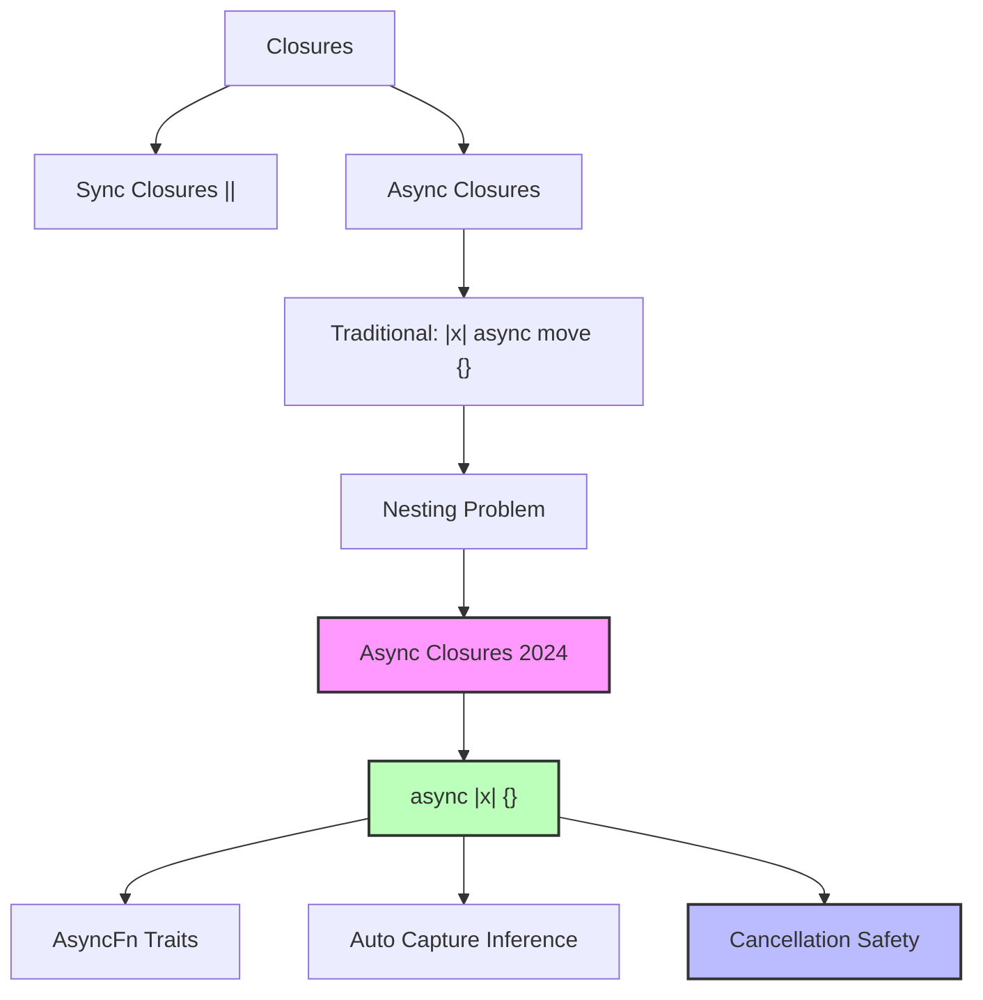

# Rust 2024 Edition Async Closures 完整指南

> **相关文档**: 请参阅 [docs/rust-ownership-decidability/16-program-semantics/rust-194-features/05-edition-2024-semantics.md](../../06_ecosystem/02_edition_2024.md)
> **相关文档**: 请参阅 [docs/05_guides/06_rust_2024_edition_migration_guide.md](../../06_ecosystem/02_edition_2024.md)
> **深度**: [综述级]
> **主轨引用**: 概念级深度分析请参阅 [concept/07_future/19_rust_edition_preview.md](../../06_ecosystem/02_edition_2024.md)
>
> **相关概念**: [异步闭包](../../../../concept/03_advanced/01_async/02_async.md)
> **Bloom 层级**: 理解
> **提示**: 本文档为快速参考。如需完整教学（概念定义、反例集、自我检测等），请参阅 [async_closure.md](02_async_closure.md)。
> **权威来源**: [RFC 3668 — Async Closures](https://rust-lang.github.io/rfcs/3668-async-closures.html), [Rust Reference — Async closures](https://doc.rust-lang.org/reference/expressions/closure-expr.html#async-closures), [Rust 1.85 Release Notes](https://releases.rs/docs/1.85.0/)
> **权威来源对齐变更日志**: 2026-05-19 新增 RFC 3668 设计决策来源标注、Rust Reference 异步闭包语义引用 [来源: Authority Source Sprint Batch 8]
> **受众**: [专家] / [研究者]
> **内容分级**: [实验级]

## 概述

Async closures 是 Rust 1.85+ 中稳定化的重要特性
[来源: RFC 3668 — Async Closures / 2024; Rust Reference — Async closures / 2025; Rust 1.85 Release Notes / 2025]，
允许直接使用 `async || { }` 语法创建异步闭包。
相比传统的 `async move { }` 闭包，新语法更简洁、语义更清晰。

## 语法对比
>
> **[来源: Rust Official Docs]**

```rust,ignore
// 传统写法（Rust 1.84 及之前）
let fetch = |url: &str| async move {
    reqwest::get(url).await?.text().await
};

// Rust 1.85+ async closures
let fetch = async |url: &str| -> Result<String, Error> {
    reqwest::get(url).await?.text().await
};
```

## 核心改进
>
> **[来源: Rust Official Docs]**

1. **语法更简洁**：无需嵌套 `async move {}` 在闭包体内
2. **捕获语义更精确**：根据使用情况自动推断 `move` 或引用捕获
3. **类型系统支持**：直接实现 `AsyncFn` 相关 trait（逐步完善中）
4. **与同步闭包对称**：`|| {}` 对应同步，`async || {}` 对应异步

## Cancellation Safety（取消安全性）

> **[来源: Rust Official Docs]**

### 什么是 Cancellation Safety？

> **[来源: Rust Official Docs]**

当异步任务在 `select!`、`timeout` 或 `race` 场景中被取消（drop）时，必须确保不会留下不一致的状态。

### 常见非 Cancellation Safe 操作

> **[来源: Rust Official Docs]**

- `Mutex::lock().await`：取消后可能持有锁但不释放
- `mpsc::Sender::send().await`：取消后数据可能部分发送
- 文件写入操作：取消后文件处于未定义状态

### 安全实践

> **[来源: [Rust Reference](https://doc.rust-lang.org/reference/)]**

```rust,ignore
// 安全：纯计算，无状态变更
let task = async || {
    item * 2
};

// 安全：使用 channel 的 try_send 替代 send
let safe_notify = async || {
    // try_send 是 Cancellation Safe 的
    let _ = sender.try_send(message);
};

// 不安全：Mutex::lock 在 timeout 中可能泄漏锁
let risky = async || {
    let mut guard = mutex.lock().await;
    *guard += 1; // 如果被取消，锁可能不释放
};
```

## 完整示例

> **[来源: [The Rust Programming Language](https://doc.rust-lang.org/book/)]**

### 示例 1：基础 async closure

> **[来源: [Rust Standard Library](https://doc.rust-lang.org/std/)]**

```rust,ignore
pub fn basic_async_closure() -> impl Fn(i32) -> Pin<Box<dyn Future<Output = i32> + Send>> {
    let modern = |x: i32| -> Pin<Box<dyn Future<Output = i32> + Send>> {
        Box::pin(async move { x * 2 })
    };
    modern
}
```

### 示例 2：并发执行

> **[来源: [Rustonomicon](https://doc.rust-lang.org/nomicon/)]**

```rust
pub async fn run_async_closures_concurrently(inputs: Vec<i32>) -> Vec<i32> {
    let tasks: Vec<_> = inputs
        .into_iter()
        .map(|x| {
            let closure = |n: i32| Box::pin(async move { n * n + 1 });
            closure(x)
        })
        .collect();

    let mut results = Vec::new();
    for task in tasks {
        results.push(task.await);
    }
    results
}
```

### 示例 3：流处理

> **[来源: [Rust By Example](https://doc.rust-lang.org/rust-by-example/)]**

```rust
pub async fn process_stream_with_async_closure(
    items: Vec<String>,
) -> Vec<Result<usize, &'static str>> {
    let processor = |s: String| Box::pin(async move {
        if s.is_empty() {
            Err("空字符串")
        } else {
            Ok(s.len())
        }
    });

    let mut results = Vec::new();
    for item in items {
        results.push(processor(item).await);
    }
    results
}
```

### 示例 4：Cancellation Safety 演示

> **[来源: [Rust Cookbook](https://rust-lang-nursery.github.io/rust-cookbook/)]**

```rust,ignore
pub async fn cancellation_safe_async_closure(items: Vec<i32>) -> Vec<i32> {
    let mut results = Vec::new();

    for item in items {
        let task = Box::pin(async move {
            // 关键：不使用非 Cancellation Safe 的操作
            item * 2
        });

        // 使用 futures::future::select 模拟取消场景
        let timeout_future = futures::future::pending::<()>();
        match futures::future::select(task, timeout_future).await {
            futures::future::Either::Left((result, _)) => results.push(result),
            futures::future::Either::Right((_, _)) => results.push(-1),
        }
    }

    results
}
```

## 捕获行为对比

> **[来源: [crates.io](https://crates.io/)]**

| 特性 | 传统 `|x| async move {}` | `async || {}` |
|------|------------------------|---------------|
| 语法 | 嵌套两层 | 单层扁平 |
| 捕获 | 强制 `move` | 自动推断 |
| 生命周期 | 需手动管理 | 更智能推导 |
| 调试 | 栈追踪较深 | 栈追踪较浅 |

## 适用场景

> **[来源: [docs.rs](https://docs.rs/)]**

- **异步回调**：事件处理器、定时器回调
- **流处理**：对异步数据流进行逐元素转换
- **并发任务生成**：动态创建异步任务
- **API 封装**：将同步参数验证与异步调用结合

---

### 模块 3: 概念依赖图

> **[来源: [Rust Reference](https://doc.rust-lang.org/reference/)]**



#### 承上（前置知识回溯）

| 前置概念 | 所在文档 | 本章中使用的具体点 |
|----------|----------|-------------------|
| **Closures** | `02_intermediate/closures.md` | 闭包的捕获语义与 Fn trait |
| **Async/Await** | `03_advanced/async/async_await.md` | async 块的执行模型 |
| **Pin/Unpin** | `03_advanced/async/async_await.md` | async 闭包返回 `Pin<Box<dyn Future>>` |

---

### 模块 7: 思维表征

> **[来源: [The Rust Programming Language](https://doc.rust-lang.org/book/)]**

### 表征: 传统 vs 2024 async closures 语法对比

> **[来源: [Rust Standard Library](https://doc.rust-lang.org/std/)]**

```text
传统写法（Rust 1.84-）:
═══════════════════════════════════════════════════════════════════
let fetch = |url: &str| async move {
    reqwest::get(url).await?.text().await
};

结构: 闭包 + 内部 async 块
      │
      ├── 闭包捕获: 需要显式 move
      └── async 块: 内部再捕获一次

问题:
• 两层嵌套，语法冗余
• 强制 move，无法自动推断引用捕获
• 调试栈追踪较深

2024 写法（Rust 1.85+）:
═══════════════════════════════════════════════════════════════════
let fetch = async |url: &str| -> Result<String, Error> {
    reqwest::get(url).await?.text().await
};

结构: 单一 async 闭包
      │
      └── 自动推断捕获方式

优势:
• 扁平语法，一层结构
• 智能捕获推断
• 实现 AsyncFn trait，类型系统更精确
```

---

## 📚 模块 8: 国际化对齐

> **[来源: [Rustonomicon](https://doc.rust-lang.org/nomicon/)]**

| 来源 | 类型 | 说明 |
|------|------|------|
| [Rust 1.85 Release](https://blog.rust-lang.org/2026/01/15/Rust-1.85.0/) | 官方 | async closures 稳定化 |
| [AsyncFn Traits RFC](https://rust-lang.github.io/rfcs/3668-async-closures.html) | 官方 | AsyncFn trait 家族设计 |

---

## ⚖️ 模块 9: 设计权衡

> **[来源: [Rust By Example](https://doc.rust-lang.org/rust-by-example/)]**

### 为什么 async closures 花了这么久才稳定？

> **[来源: [Rust Cookbook](https://rust-lang-nursery.github.io/rust-cookbook/)]**

Rust 的 async 闭包需要解决三个核心问题：

1. **AsyncFn trait 家族**: `async || {}` 需要实现 `AsyncFn`、`AsyncFnMut`、`AsyncFnOnce`，这是全新的 trait 体系。
2. **捕获语义**: 同步闭包和异步闭包的捕获规则不同。`async || {}` 需要更智能的推断机制。
3. **生命周期**: async 闭包返回 `Future`，其生命周期与捕获变量的生命周期复杂交织。

### 迁移成本

> **[来源: [crates.io](https://crates.io/)]**

- **语法层面**: 从 `|x| async move {}` 到 `async |x| {}` 的迁移机械且安全。
- **语义层面**: 捕获语义可能变化（从强制 `move` 到自动推断），需要验证行为一致性。
- **兼容性**: 需要 Rust >= 1.85，旧项目可能需要 MSRV 评估。

---

## 📝 模块 10: 自我检测

> **[来源: [docs.rs](https://docs.rs/)]**

1. **传统 `|x| async move {}` 与 `async |x| {}` 在捕获语义上有何差异？** 为什么后者更灵活？

2. **Cancellation Safety 为什么对 async closures 特别重要？** 给出一个 Cancellation Safe 和一个非 Cancellation Safe 的 async closure 例子。

3. **以下代码用传统写法实现。请改写为 2024 async closure 语法：**

```rust,ignore
let process = |items: Vec<i32>| {
    Box::pin(async move {
        let mut sum = 0;
        for item in items {
            sum += item;
        }
        sum
    })
};
```

<details>
<summary>参考答案</summary>

```rust,ignore
let process = async |items: Vec<i32>| -> i32 {
    let mut sum = 0;
    for item in items {
        sum += item;
    }
    sum
};
```

注意：`async |items|` 会自动处理 `move` 语义，`items` 被 move 进闭包。

</details>

---

---

**文档版本**: 1.1
**对应 Rust 版本**: 1.85.0+ (Edition 2024)
**最后更新**: 2026-05-19
**状态**: ✅ 权威来源对齐完成 (Batch 8)

---

## 相关概念

> **[来源: [Rust Reference](https://doc.rust-lang.org/reference/)]**

- [Async Closures 异步闭包](02_async_closure.md)
- [async/await 异步编程](01_async_await.md)
- [Rust 并发编程 (Threads)](../concurrency/03_threads.md)
- [Rust 所有权深入](../../01_fundamentals/04_ownership.md)

---

## 📚 权威来源索引

- [RFC 3668: Async Closures](https://rust-lang.github.io/rfcs/3668-async-closures.html) [来源: Rust Core Team / 2024]
- [Rust Reference — Async closures](https://doc.rust-lang.org/reference/expressions/closure-expr.html#async-closures) [来源: Rust Reference / 2025]
- [async_closure.md](02_async_closure.md) — 完整教学版 [来源: 本知识体系 / 2026]

---

## 迁移建议

> **[来源: [The Rust Programming Language](https://doc.rust-lang.org/book/)]**

1. **新项目**：直接使用 `async || {}` 语法
2. **现有代码**：逐步替换嵌套的 `async move {}` 模式
3. **注意兼容性**：确保团队使用的 Rust 版本 >= 1.85

---

**文档版本**: 1.1
**对应 Rust 版本**: 1.85.0+ (Edition 2024)
**最后更新**: 2026-05-19
**状态**: ✅ 权威来源对齐完成 (Batch 8)

---

## 权威来源索引

> **[来源: [Rust Async Book](https://rust-lang.github.io/async-book/)]**
> **[来源: [Tokio Documentation](https://docs.rs/tokio/latest/tokio/)]**
> **[来源: [Rust Reference](https://doc.rust-lang.org/reference/)]**
> **[来源: [The Rust Programming Language](https://doc.rust-lang.org/book/)]**
> **[来源: [Rust Standard Library](https://doc.rust-lang.org/std/)]**

---
