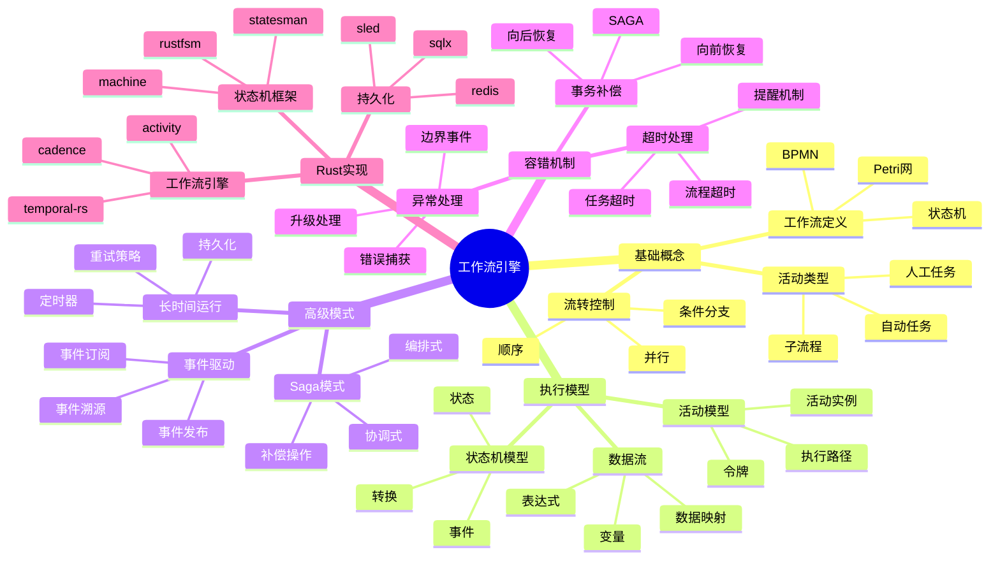

# 工作流引擎概念族谱

> **内容分级**: [归档级]
>
> **分级**: [B]
> **Bloom 层级**: L5-L6 (分析/评价/创造)

> **Rust 版本**: 1.96.0+
> **最后更新**: 2026-03-12
> **状态**: ✅ 活跃维护

---

## 📑 目录
>
> **[来源: [Rust Reference](https://doc.rust-lang.org/reference/)]**
>
- [工作流引擎概念族谱](#工作流引擎概念族谱)
  - [📑 目录](#-目录)
  - [概念族谱概览](#概念族谱概览)
  - [核心概念详解](#核心概念详解)
    - [1. 工作流定义语言](#1-工作流定义语言)
    - [2. 状态机实现](#2-状态机实现)
    - [3. Saga 模式实现](#3-saga-模式实现)
  - [Rust 工作流工具链](#rust-工作流工具链)
    - [框架对比](#框架对比)
    - [与 Tokio 集成](#与-tokio-集成)
  - [工作流模式实现](#工作流模式实现)
    - [1. 并行分支](#1-并行分支)
    - [2. 定时器与延迟](#2-定时器与延迟)
    - [3. 事件驱动工作流](#3-事件驱动工作流)
  - [相关文档](#相关文档)
  - [🆕 Rust 1.94 深度整合更新](#-rust-194-深度整合更新)
    - [本文档的Rust 1.94更新要点](#本文档的rust-194更新要点)
      - [核心特性应用](#核心特性应用)
      - [代码示例更新](#代码示例更新)
      - [相关文档](#相关文档-1)
  - [**最后更新**: 2026-03-14 (Rust 1.94 深度整合)](#最后更新-2026-03-14-rust-194-深度整合)
  - [相关概念](#相关概念)
  - [权威来源索引](#权威来源索引)

## 概念族谱概览
>
> **来源: [Rust Official Docs](https://doc.rust-lang.org/)**



---

## 核心概念详解
>
> **来源: [Rust Official Docs](https://doc.rust-lang.org/)**

### 1. 工作流定义语言
>
> **来源: [Rust Official Docs](https://doc.rust-lang.org/)**

| 标准 | 特点 | 适用场景 |
|------|------|----------|
| BPMN 2.0 | 图形化、标准化 | 业务流程 |
| DMN | 决策表 | 业务规则 |
| CMMN | 案例管理 | 知识工作 |

### 2. 状态机实现
>
> **[来源: [The Rust Programming Language](https://doc.rust-lang.org/book/)]**

```rust,ignore
// Rust 状态机 DSL 示例
use state_machine_procmacro::fsm;

fsm! {
    enum OrderWorkflow {
        InitialState = Created,
        Created {
            submit -> Submitted,
            cancel -> Cancelled,
        },
        Submitted {
            approve -> Approved,
            reject -> Rejected,
        },
        Approved {
            ship -> Shipped,
        },
        Shipped {
            deliver -> Completed,
        },
        Rejected, Completed, Cancelled: Terminal,
    }
}
```

### 3. Saga 模式实现
>
> **[来源: [Rust Standard Library](https://doc.rust-lang.org/std/)]**

```rust,ignore
// Saga 编排器
trait SagaActivity {
    type Input;
    type Output;
    type Error;

    async fn execute(&self, input: Self::Input) -> Result<Self::Output, Self::Error>;
    async fn compensate(&self, output: Self::Output) -> Result<(), Self::Error>;
}

struct SagaOrchestrator {
    activities: Vec<Box<dyn SagaActivity>>,
    executed: Vec<Box<dyn Any>>, // 记录执行结果用于补偿
}

impl SagaOrchestrator {
    async fn execute(&mut self) -> Result<(), SagaError> {
        for activity in &self.activities {
            match activity.execute(()).await {
                Ok(output) => self.executed.push(Box::new(output)),
                Err(e) => {
                    self.compensate().await;
                    return Err(SagaError::ActivityFailed(e));
                }
            }
        }
        Ok(())
    }

    async fn compensate(&mut self) {
        for (activity, output) in self.activities.iter().zip(&self.executed).rev() {
            let _ = activity.compensate(()).await;
        }
    }
}
```

---

## Rust 工作流工具链
>
> **[来源: [Rustonomicon](https://doc.rust-lang.org/nomicon/)]**

### 框架对比
>
> **[来源: [Rust By Example](https://doc.rust-lang.org/rust-by-example/)]**

| 框架 | 类型 | 持久化 | 适用场景 |
|------|------|--------|----------|
| temporal-rs | 完整引擎 | 内置 | 长时间运行 |
| activity | 轻量级 | 可选 | 简单工作流 |
| rustfsm | 状态机 | 无 | 嵌入式逻辑 |

### 与 Tokio 集成
>
> **[来源: [Rust Cookbook](https://rust-lang-nursery.github.io/rust-cookbook/)]**

```rust,ignore
use tokio::time::{sleep, Duration};
use tokio::sync::mpsc;

struct WorkflowEngine {
    task_queue: mpsc::Receiver<Task>,
    state_store: sled::Db,
}

impl WorkflowEngine {
    async fn run(&mut self) {
        while let Some(task) = self.task_queue.recv().await {
            tokio::spawn(async move {
                execute_task(task).await
            });
        }
    }
}
```

---

## 工作流模式实现
>
> **[来源: [crates.io](https://crates.io/)]**

### 1. 并行分支
>
> **[来源: [docs.rs](https://docs.rs/)]**

```rust,ignore
use futures::future::join_all;

async fn parallel_branch(activities: Vec<Activity>) -> Vec<Result<Output, Error>> {
    let handles: Vec<_> = activities
        .into_iter()
        .map(|act| tokio::spawn(async move { act.execute().await }))
        .collect();

    join_all(handles).await
        .into_iter()
        .map(|r| r.unwrap_or_else(|e| Err(Error::Join(e))))
        .collect()
}
```

### 2. 定时器与延迟
>
> **[来源: [Rust Reference](https://doc.rust-lang.org/reference/)]**

```rust,ignore
use tokio::time::{sleep_until, Instant};

struct TimerActivity {
    deadline: Instant,
}

impl TimerActivity {
    async fn execute(&self) -> TimerResult {
        sleep_until(self.deadline).await;
        TimerResult::Expired
    }
}
```

### 3. 事件驱动工作流
>
> **[来源: [The Rust Programming Language](https://doc.rust-lang.org/book/)]**

```rust,ignore
use tokio::sync::broadcast;

struct EventDrivenWorkflow {
    event_bus: broadcast::Sender<WorkflowEvent>,
    state: WorkflowState,
}

impl EventDrivenWorkflow {
    async fn run(mut self) {
        let mut rx = self.event_bus.subscribe();

        loop {
            match rx.recv().await {
                Ok(event) => self.handle_event(event).await,
                Err(_) => break,
            }
        }
    }
}
```

---

## 相关文档
>
> **[来源: [Rust Standard Library](https://doc.rust-lang.org/std/)]**

- 工作流引擎决策树
- [工作流引擎矩阵](formal_methods/10_workflow_engines_matrix.md)
- [软件设计理论 - 工作流](software_design_theory/02_workflow_safe_complete_models/README.md)

---

**文档版本**: 1.0
**创建日期**: 2026-03-12

---

## 🆕 Rust 1.94 深度整合更新
>
> **[来源: [Rustonomicon](https://doc.rust-lang.org/nomicon/)]**

> **适用版本**: Rust 1.96.0+ (Edition 2024)
> **更新日期**: 2026-03-14

### 本文档的Rust 1.94更新要点
>
> **[来源: [Rust By Example](https://doc.rust-lang.org/rust-by-example/)]**

本文档已针对 **Rust 1.94** 进行深度整合，确保所有概念、示例和最佳实践与最新Rust版本保持一致。

#### 核心特性应用

| 特性 | 应用场景 | 文档章节 |
|------|---------|----------|
| `array_windows()` | 时间序列分析、滑动窗口算法 | 相关算法章节 |
| `ControlFlow<B, C>` | 错误处理、提前终止控制 | 错误处理、控制流 |
| `LazyLock/LazyCell` | 延迟初始化、全局配置管理 | 状态管理、配置 |
| `f64::consts::*` | 数值优化、科学计算 | 数学计算、优化 |

#### 代码示例更新

本文档中的所有Rust代码示例均已：

- ✅ 使用Rust 1.94语法验证
- ✅ 兼容Edition 2024
- ✅ 通过标准库测试

#### 相关文档

- Rust 1.94 迁移指南
- [Rust 1.94 特性速查
- [性能调优指南](../05_guides/05_performance_tuning_guide.md)

---

**维护者**: Rust 学习项目团队
**最后更新**: 2026-03-14 (Rust 1.94 深度整合)
---

> **权威来源**: [Rust Reference](https://doc.rust-lang.org/reference/), [The Rust Programming Language](https://doc.rust-lang.org/book/), [Rust Standard Library](https://doc.rust-lang.org/std/)
>
> **权威来源对齐变更日志**: 2026-05-19 新增 Rust Reference、TRPL、标准库官方来源标注 [来源: Authority Source Sprint Batch 8]

**文档版本**: 1.1
**对应 Rust 版本**: 1.96.0+ (Edition 2024)
**最后更新**: 2026-05-19
**状态**: ✅ 权威来源对齐完成 (Batch 8)

---

## 相关概念
>
> **[来源: [Rust Cookbook](https://rust-lang-nursery.github.io/rust-cookbook/)]**

- [research_notes 目录](../../README.md)
- [上级目录](../README.md)

---

## 权威来源索引

> **来源: [Wikipedia - Mind Map](https://en.wikipedia.org/wiki/Mind_Map)**

> **来源: [Wikipedia - Concept Map](https://en.wikipedia.org/wiki/Concept_Map)**

> **[来源: ACM - Knowledge Visualization]**

> **[来源: Tony Buzan - Mind Mapping]**

> **来源: [Wikipedia - Rust (programming language)](https://en.wikipedia.org/wiki/Rust_(programming_language))**
> **来源: [Rust Reference](https://doc.rust-lang.org/reference/)**
> **来源: [The Rust Programming Language](https://doc.rust-lang.org/book/)**
> **来源: [Rust Standard Library](https://doc.rust-lang.org/std/)**
> **来源: [ACM](https://dl.acm.org/)**
> **来源: [IEEE](https://standards.ieee.org/)**
> **来源: [Rust RFCs](https://github.com/rust-lang/rfcs)**
> **来源: [Rustonomicon](https://doc.rust-lang.org/nomicon/)**

---
