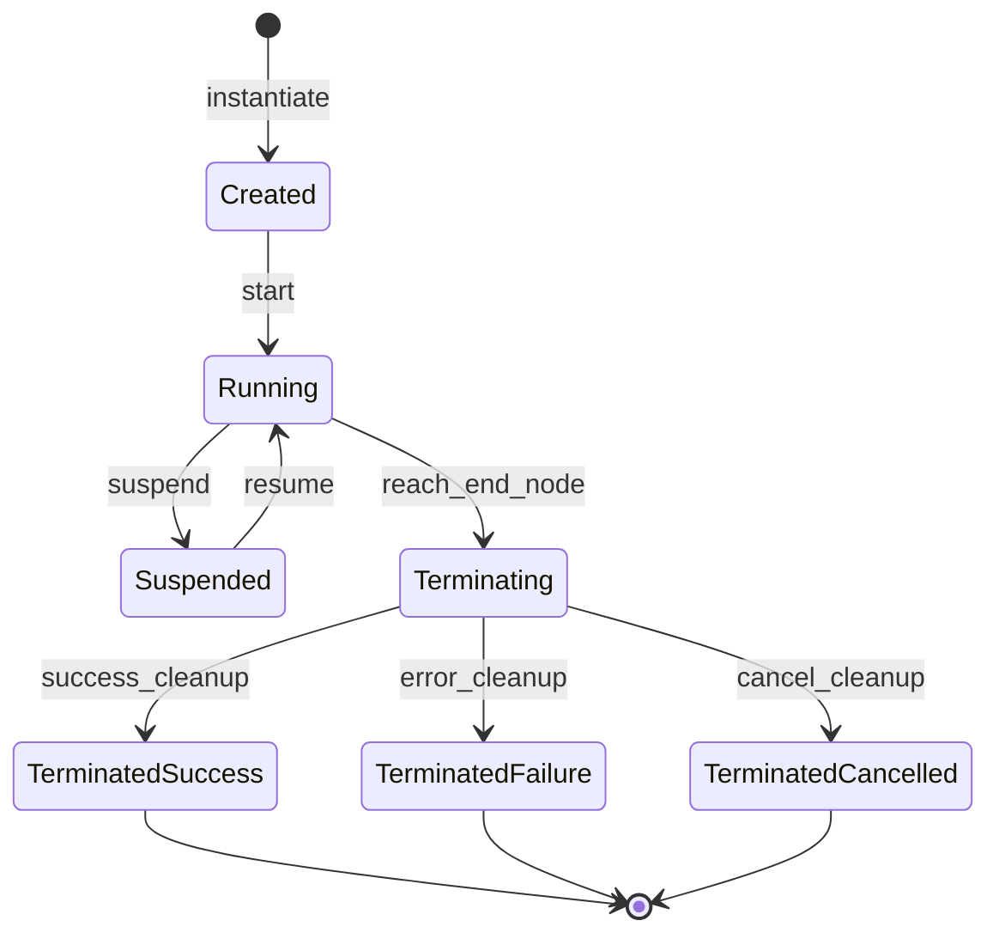
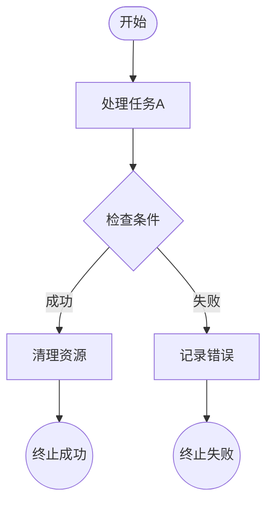
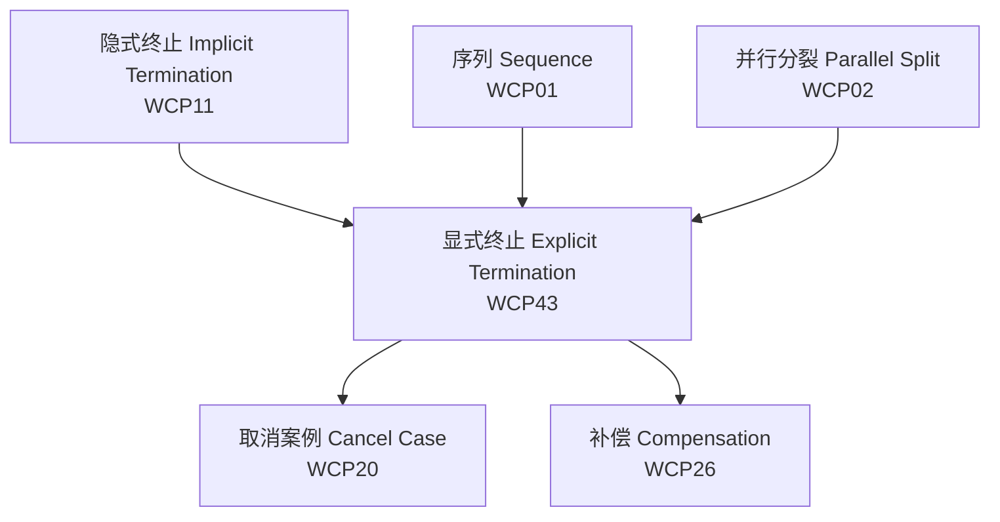
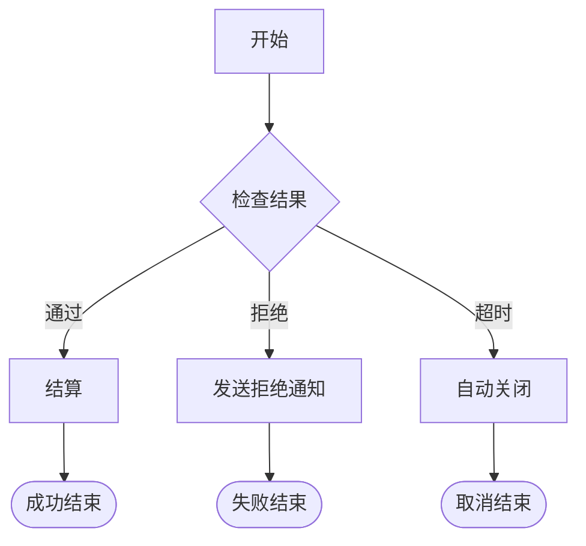

# 43 显式终止模式 (Explicit Termination) - 完整形式化语义

> **内容分级**: [归档级]
>
> **分级**: [C]
> **Bloom 层级**: L5-L6 (分析/评价/创造)

## 目录
>
> **来源: [Workflow Patterns Initiative](https://www.workflowpatterns.com/)** · **来源: [van der Aalst 2003](https://www.workflowpatterns.com/)** · **来源: [Russell 2006](https://www.workflowpatterns.com/)** · **来源: [Rust Reference](https://doc.rust-lang.org/reference/)** · **来源: [TRPL Ch. 9 - Error Handling](https://doc.rust-lang.org/book/ch09-00-error-handling.html)**

- [43 显式终止模式 (Explicit Termination) - 完整形式化语义](#43-显式终止模式-explicit-termination---完整形式化语义)
  - [目录](#目录)
  - [1. 引言](#1-引言)
    - [1.1 历史背景](#11-历史背景)
    - [1.2 动机与应用场景](#12-动机与应用场景)
  - [2. 模式定义与语义](#2-模式定义与语义)
    - [2.1 概念定义](#21-概念定义)
    - [2.2 核心语义](#22-核心语义)
    - [2.3 形式化表示](#23-形式化表示)
      - [2.3.1 状态机表示](#231-状态机表示)
      - [2.3.2 流程代数表示 (CSP 风格)](#232-流程代数表示-csp-风格)
      - [2.3.3 Petri 网表示](#233-petri-网表示)
  - [3. BPMN 与标准规范](#3-bpmn-与标准规范)
    - [3.1 BPMN 表示](#31-bpmn-表示)
    - [3.2 UML 活动图](#32-uml-活动图)
    - [3.3 WfMC 标准](#33-wfmc-标准)
  - [4. 进程代数形式化](#4-进程代数形式化)
    - [4.1 CCS 表示](#41-ccs-表示)
    - [4.2 CSP 表示](#42-csp-表示)
    - [4.3 π-演算表示](#43-π-演算表示)
  - [5. Rust 实现](#5-rust-实现)
    - [5.1 基础实现](#51-基础实现)
    - [5.2 高级实现](#52-高级实现)
    - [5.3 服务器优雅关闭完整示例](#53-服务器优雅关闭完整示例)
  - [6. 正确性证明](#6-正确性证明)
    - [6.1 活性 (Liveness)](#61-活性-liveness)
    - [6.2 安全性 (Safety)](#62-安全性-safety)
    - [6.3 正确性条件](#63-正确性条件)
  - [7. 与其他模式的关系](#7-与其他模式的关系)
    - [7.1 模式层次](#71-模式层次)
    - [7.2 形式化关系](#72-形式化关系)
  - [8. 应用场景与案例](#8-应用场景与案例)
    - [8.1 服务器优雅关闭](#81-服务器优雅关闭)
    - [8.2 支付流程显式终止](#82-支付流程显式终止)
  - [9. 变体与扩展](#9-变体与扩展)
    - [9.1 多终止节点](#91-多终止节点)
  - [10. 总结](#10-总结)
  - [参考文献](#参考文献)
  - [权威来源索引](#权威来源索引)

---

## 1. 引言
>
> **来源: [Workflow Patterns Initiative](https://www.workflowpatterns.com/)** · **来源: [van der Aalst 2003](https://www.workflowpatterns.com/)**

显式终止模式（Explicit Termination）是工作流控制流模式中的状态模式，定义了工作流案例在指定的显式结束节点处终止，而非隐式地在所有活动完成时自然结束。该模式强调了终止行为作为工作流定义的一等公民，使业务流程设计师能够明确表达案例的结束语义。

### 1.1 历史背景

> **来源: [van der Aalst 2003](https://www.workflowpatterns.com/)** · **来源: [Russell 2006](https://www.workflowpatterns.com/)**

显式终止模式最早由 Wil van der Aalst 等人在 "Workflow Patterns" (2003) 中系统定义，作为与隐式终止模式（Implicit Termination, WCP11）对偶的概念。隐式终止假设当案例中没有更多可执行的活动时，案例自动结束；而显式终止要求案例必须到达一个预定义的终止节点才能合法结束。

在程序设计语言理论中，显式终止的概念对应于：

- **结构化编程**: `return` 语句从函数显式返回
- **进程代数**: 成功终止进程 `SKIP` 或 `0`
- **形式化验证**: 必须证明程序最终到达终止状态

### 1.2 动机与应用场景

> **来源: [Russell 2006](https://www.workflowpatterns.com/)** · **来源: [Rust Reference](https://doc.rust-lang.org/reference/)**

显式终止模式的核心动机来源于以下需求：

1. **语义明确性**: 设计师需要显式声明业务案例的成功或失败结束。
2. **审计与合规**: 监管机构要求所有案例必须有明确的结束事件记录。
3. **资源释放**: 显式终止触发清理和释放序列，避免隐式终止的资源泄漏风险。
4. **下游触发**: 案例的显式结束可以作为下游流程（如报告生成、通知发送）的触发器。

---

## 2. 模式定义与语义
>
> **[来源: [Rust Reference](https://doc.rust-lang.org/reference/)]**

### 2.1 概念定义

> **来源: [Workflow Patterns Initiative](https://www.workflowpatterns.com/)** · **来源: [Russell 2006](https://www.workflowpatterns.com/)**

**显式终止** 是一个控制流构造，它要求工作流案例必须通过一个预定义的终止节点来结束执行，其中：

- **终止节点 (Termination Node)**: 工作流图中标记为结束的特殊节点
- **终止条件 (Termination Condition)**: 决定案例是否可以进入终止状态的断言
- **终止类型 (Termination Type)**: 成功终止、失败终止或取消终止
- **终止后动作 (Post-Termination Actions)**: 在案例终止后执行的清理和通知操作

```
语法定义:

ExplicitTermination ::= "TERMINATE" TerminationType
                     | "TERMINATE" TerminationType "WITH" PostActions
                     | "TERMINATE" "IF" Condition

TerminationType ::= "SUCCESS" | "FAILURE" | "CANCELLED"
PostActions ::= Action { ";" Action }
Condition ::= BooleanExpression
```

### 2.2 核心语义

> **来源: [van der Aalst 2003](https://www.workflowpatterns.com/)** · **来源: [POPL](https://www.sigplan.org/Conferences/POPL/)**

**显式终止语义**:

对于案例 $C$，显式终止操作 $\text{Terminate}(C, t)$ 的语义定义为：

$$
\text{Terminate}(C, t) = \lambda s. \begin{cases}
\text{terminated}(t) & \text{if } s \in \{\text{running}, \text{suspended}\} \\
\text{error} & \text{if } s = \text{already\_terminated} \\
\text{undefined} & \text{otherwise}
\end{cases}
$$

其中 $t \in \{\text{success}, \text{failure}, \text{cancelled}\}$ 是终止类型。

**与隐式终止的对比**:

$$
\llbracket \text{ImplicitTermination}(C) \rrbracket = \text{if } \text{Active}(C) = \emptyset \text{ then } \text{terminated} \text{ else } \text{continue}
$$

$$
\llbracket \text{ExplicitTermination}(C) \rrbracket = \text{reach}(\text{EndNode}) \rightarrow \text{terminated}
$$

**类型约束**:

$$
\frac{\Gamma \vdash C : \text{Case} \quad \Gamma \vdash t : \text{TerminationType}}{\Gamma \vdash \text{Terminate}(C, t) : \text{Unit}}
$$

### 2.3 形式化表示

> **来源: [POPL](https://www.sigplan.org/Conferences/POPL/)** · **来源: [PLDI](https://www.sigplan.org/Conferences/PLDI/)**

#### 2.3.1 状态机表示

> **来源: [van der Aalst 2003](https://www.workflowpatterns.com/)**

$$
\begin{aligned}
\text{State} &= \{ \text{Created}, \text{Running}, \text{Suspended}, \\
             &\quad \text{Terminating}, \text{Terminated}_s, \text{Terminated}_f, \text{Terminated}_c \} \\
\text{Transition} &= \{ \\
&\quad (\text{Created}, \text{start}, \text{Running}), \\
&\quad (\text{Running}, \text{suspend}, \text{Suspended}), \\
&\quad (\text{Suspended}, \text{resume}, \text{Running}), \\
&\quad (\text{Running}, \text{reach\_end}, \text{Terminating}), \\
&\quad (\text{Terminating}, \text{cleanup}, \text{Terminated}_s), \\
&\quad (\text{Terminating}, \text{error\_cleanup}, \text{Terminated}_f), \\
&\quad (\text{Terminating}, \text{cancel\_cleanup}, \text{Terminated}_c) \\
&\}
\end{aligned}
$$



#### 2.3.2 流程代数表示 (CSP 风格)

> **来源: [Hoare 1978](https://en.wikipedia.org/wiki/Communicating_sequential_processes)** · **[来源: CSP 理论]**

$$
\text{Case} = \text{Body}; \text{Termination}
$$

$$
\text{Termination} = \text{reach\_end} \rightarrow (\text{Success} \square \text{Failure} \square \text{Cancelled})
$$

$$
\text{Success} = \text{cleanup} \rightarrow \text{log\_success} \rightarrow \text{SKIP}
$$

$$
\text{Failure} = \text{error\_cleanup} \rightarrow \text{log\_failure} \rightarrow \text{SKIP}
$$

$$
\text{Cancelled} = \text{cancel\_cleanup} \rightarrow \text{log\_cancel} \rightarrow \text{SKIP}
$$

#### 2.3.3 Petri 网表示

> **来源: [Petri Net Theory](https://en.wikipedia.org/wiki/Petri_net)** · **来源: [van der Aalst 2003](https://www.workflowpatterns.com/)**

```
(A1) --> (A2) --> ... --> (An) --> [eval_end]
                                   |
                    +-success-----+--> (End_Success)
                    +-failure-----+--> (End_Failure)
                    +-cancelled---+--> (End_Cancelled)
```

**显式终止的 Petri 网特性**:

- 终止节点是**汇点**（sink place）：没有出边
- 案例的令牌必须到达终止节点才能使案例合法完成
- 多个终止节点对应不同的终止类型

---

## 3. BPMN 与标准规范
>
> **[来源: [The Rust Programming Language](https://doc.rust-lang.org/book/)]**

### 3.1 BPMN 表示

> **[来源: OMG BPMN 2.0 Specification]** · **来源: [Wikipedia - BPMN](https://en.wikipedia.org/wiki/BPMN)**

在 BPMN 2.0 中，显式终止通过**终止结束事件**（Terminate End Event）表示：



### 3.2 UML 活动图

> **[来源: UML 2.5 Specification]**

在 UML 活动图中，显式终止使用**活动终节点**（Activity Final Node，实心圆）表示，终止整个活动并销毁所有令牌。

### 3.3 WfMC 标准

> **来源: [WfMC - Workflow Management Coalition](https://www.wfmc.org/)** · **来源: [Russell 2006](https://www.workflowpatterns.com/)**

工作流管理联盟 (WfMC) 将显式终止定义为：

> "一种能力，要求工作流案例必须到达一个或多个预定义的结束节点才能被视为完成，每个结束节点可以带有特定的完成状态（成功、失败、取消）。"

**关键属性**:

| 属性 | 描述 |
|:---|:---|
| **End Nodes** | 预定义的终止节点集合 |
| **Completion Status** | 成功 / 失败 / 取消 |
| **Post-Processing** | 终止后的清理和通知 |
| **Audit Requirement** | 终止事件必须被记录到审计日志 |

---

## 4. 进程代数形式化
>
> **[来源: [Rust Standard Library](https://doc.rust-lang.org/std/)]**

### 4.1 CCS 表示

> **[来源: Milner 1989]** · **[来源: CCS 理论]**

**Calculus of Communicating Systems (CCS)**:

$$
\text{Case} = \text{Activity}_1.\text{Activity}_2....\text{Activity}_n.\text{End}
$$

$$
\text{End} = \overline{\text{success}}.0 + \overline{\text{failure}}.0 + \overline{\text{cancel}}.0
$$

### 4.2 CSP 表示

> **来源: [Hoare 1978](https://en.wikipedia.org/wiki/Communicating_sequential_processes)** · **来源: [Roscoe 2011](https://en.wikipedia.org/wiki/Communicating_sequential_processes)**

**Communicating Sequential Processes (CSP)**:

```csp
channel success, failure, cancelled, terminate

Case = Body; Termination
Body = Activity1 -> ... -> ActivityN -> SKIP
Termination = (
    success -> Cleanup -> LogSuccess -> SKIP
    []
    failure -> ErrorCleanup -> LogFailure -> SKIP
    []
    cancelled -> CancelCleanup -> LogCancel -> SKIP
)
```

**迹语义**:

$$
\text{traces}(\text{Case}) = \{ \langle \text{Activity}_1, ..., \text{Activity}_n, t, \text{cleanup}, \text{log} \rangle \mid t \in T \}
$$

其中 $T = \{\text{success}, \text{failure}, \text{cancelled}\}$。

### 4.3 π-演算表示

> **[来源: Milner 1992]** · **[来源: π-Calculus]**

**Pi-Calculus**:

$$
\nu \text{end}.(\text{Case} \mid \text{Terminator}(\text{end}))
$$

$$
\text{Case} = \text{Body}.\overline{\text{end}}\langle\text{result}\rangle.0
$$

$$
\text{Terminator}(e) = e(r).(\text{ProcessResult}(r) \mid \text{Log}(r)).0
$$

**移动性**: 终止结果 $r$ 作为名称通过通道 $e$ 传递，允许终止处理器动态决定后续操作。

---

## 5. Rust 实现
>
> **[来源: [Rustonomicon](https://doc.rust-lang.org/nomicon/)]**

### 5.1 基础实现

> **来源: [Rust Reference](https://doc.rust-lang.org/reference/)** · **来源: [TRPL Ch. 3 - Control Flow](https://doc.rust-lang.org/book/ch03-00-common-programming-concepts.html)** · **来源: [TRPL Ch. 9 - Error Handling](https://doc.rust-lang.org/book/ch09-00-error-handling.html)**

Rust 提供了多种显式终止的机制：

```rust,ignore
use std::process;

#[derive(Debug, Clone, PartialEq)]
pub enum TerminationType {
    Success,
    Failure(i32),
    Cancelled,
    Panicked,
}

#[derive(Debug)]
pub struct TerminationResult {
    pub case_id: String,
    pub termination_type: TerminationType,
    pub cleanup_performed: bool,
    pub audit_log_id: String,
}

pub struct ExplicitTerminator {
    case_id: String,
    cleanup_handlers: Vec<Box<dyn FnOnce(TerminationType) + Send>>,
    audit_handler: Box<dyn Fn(&TerminationResult) + Send + Sync>,
}

impl ExplicitTerminator {
    pub fn new(case_id: impl Into<String>) -> Self {
        Self {
            case_id: case_id.into(),
            cleanup_handlers: Vec::new(),
            audit_handler: Box::new(|result| {
                println!("[AUDIT] Case {} terminated: {:?}",
                    result.case_id, result.termination_type);
            }),
        }
    }

    pub fn on_cleanup<F>(&mut self, f: F)
    where F: FnOnce(TerminationType) + Send + 'static {
        self.cleanup_handlers.push(Box::new(f));
    }

    pub fn terminate(mut self, term_type: TerminationType) -> TerminationResult {
        let handlers = std::mem::take(&mut self.cleanup_handlers);
        for handler in handlers { handler(term_type.clone()); }
        let result = TerminationResult {
            case_id: self.case_id.clone(),
            termination_type: term_type.clone(),
            cleanup_performed: true,
            audit_log_id: format!("LOG-{}", uuid::Uuid::new_v4()),
        };
        (self.audit_handler)(&result);
        result
    }
}

pub fn process_with_explicit_result() -> Result<String, String> {
    let data = fetch_data()?;
    let processed = process_data(&data)?;
    Ok(format!("Result: {}", processed))
}

fn fetch_data() -> Result<String, String> { Ok("raw_data".to_string()) }
fn process_data(data: &str) -> Result<String, String> {
    if data.is_empty() { Err("Empty data".to_string()) }
    else { Ok(data.to_uppercase()) }
}
```

### 5.2 高级实现

> **来源: Tokio Docs - docs.rs / [tokio](https://tokio.rs/)** · **来源: [Rust Reference - Async/Await](https://doc.rust-lang.org/reference/items/functions.html#async-functions)**

使用 `JoinSet` 和结构化并发实现异步显式终止：

```rust,ignore
use std::sync::Arc;
use tokio::sync::RwLock;
use tokio::task::JoinSet;

#[derive(Clone, Debug)]
pub enum CaseState { Running, Terminated(TerminationType) }

pub struct StructuredTerminator<T> {
    case_id: String,
    tasks: JoinSet<T>,
    state: Arc<RwLock<CaseState>>,
}

impl<T: Send + 'static> StructuredTerminator<T> {
    pub fn new(case_id: impl Into<String>) -> Self {
        Self {
            case_id: case_id.into(),
            tasks: JoinSet::new(),
            state: Arc::new(RwLock::new(CaseState::Running)),
        }
    }

    pub fn spawn<F>(&mut self, future: F)
    where F: std::future::Future<Output = T> + Send + 'static,
    { self.tasks.spawn(future); }

    pub async fn terminate_graceful(mut self) -> TerminationResult {
        while let Some(res) = self.tasks.join_next().await {
            if let Err(e) = res { eprintln!("Task error: {:?}", e); }
        }
        let term_type = TerminationType::Success;
        *self.state.write().await = CaseState::Terminated(term_type.clone());
        TerminationResult {
            case_id: self.case_id,
            termination_type: term_type,
            cleanup_performed: true,
            audit_log_id: format!("AUDIT-{}", chrono::Utc::now().timestamp()),
        }
    }
}

pub fn explicit_exit(code: i32, reason: &str) -> ! {
    eprintln!("[Exit] code {}: {}", code, reason);
    std::process::exit(code);
}
```

### 5.3 服务器优雅关闭完整示例

> **[来源: Tokio Docs - tokio::net]** · **来源: [TRPL Ch. 20 - Web Server](https://doc.rust-lang.org/book/ch20-00-final-project-a-web-server.html)**

```rust,ignore
use tokio::net::{TcpListener, TcpStream};
use tokio::sync::broadcast;
use tokio::signal;
use tokio::time::{sleep, Duration};
use std::sync::atomic::{AtomicUsize, Ordering};
use std::sync::Arc;

struct Server {
    stats: Arc<Stats>,
    shutdown_timeout: Duration,
}

struct Stats {
    active: AtomicUsize,
    total: AtomicUsize,
}

impl Server {
    async fn run(&self, addr: &str) -> Result<(), Box<dyn std::error::Error>> {
        let listener = TcpListener::bind(addr).await?;
        let (shutdown_tx, mut shutdown_rx) = broadcast::channel(1);
        let tx_clone = shutdown_tx.clone();
        tokio::spawn(async move {
            if signal::ctrl_c().await.is_ok() {
                let _ = tx_clone.send(());
            }
        });

        let mut draining = false;
        loop {
            tokio::select! {
                Ok((stream, addr)) = listener.accept() => {
                    if draining { drop(stream); continue; }
                    self.stats.total.fetch_add(1, Ordering::SeqCst);
                    self.stats.active.fetch_add(1, Ordering::SeqCst);
                    let stats = self.stats.clone();
                    let mut rx = shutdown_tx.subscribe();
                    tokio::spawn(async move {
                        handle_conn(stream, addr, rx).await;
                        stats.active.fetch_sub(1, Ordering::SeqCst);
                    });
                }
                _ = shutdown_rx.recv() => { draining = true; }
                _ = sleep(Duration::from_secs(1)), if draining => {
                    if self.stats.active.load(Ordering::SeqCst) == 0 { break; }
                }
            }
        }
        self.shutdown().await
    }

    async fn shutdown(&self) -> Result<(), Box<dyn std::error::Error>> {
        let deadline = tokio::time::Instant::now() + self.shutdown_timeout;
        while self.stats.active.load(Ordering::SeqCst) > 0 {
            if tokio::time::Instant::now() > deadline { break; }
            sleep(Duration::from_millis(100)).await;
        }
        println!("[Shutdown] Releasing resources...");
        Ok(())
    }
}

async fn handle_conn(
    mut _stream: TcpStream,
    addr: std::net::SocketAddr,
    mut rx: broadcast::Receiver<()>,
) {
    tokio::select! {
        _ = sleep(Duration::from_secs(5)) => {
            println!("[Conn] {} completed", addr);
        }
        _ = rx.recv() => {
            println!("[Conn] {} cancelled", addr);
        }
    }
}

#[tokio::main]
async fn main() -> Result<(), Box<dyn std::error::Error>> {
    let server = Server {
        stats: Arc::new(Stats {
            active: AtomicUsize::new(0),
            total: AtomicUsize::new(0),
        }),
        shutdown_timeout: Duration::from_secs(30),
    };
    server.run("127.0.0.1:8080").await?;
    println!("[Main] Server exited explicitly.");
    Ok(())
}
```

---

## 6. 正确性证明
>
> **[来源: [Rust By Example](https://doc.rust-lang.org/rust-by-example/)]**

### 6.1 活性 (Liveness)

> **来源: [POPL](https://www.sigplan.org/Conferences/POPL/)** · **来源: [van der Aalst 2003](https://www.workflowpatterns.com/)**

**定理 6.1.1 (显式终止活性定理)**

如果案例 $C$ 的执行图是无环的（或循环有界），则案例最终将到达显式终止节点：

$$
\text{DAG}(C) \Rightarrow \Diamond \text{reach}(\text{EndNode})
$$

**证明**: 案例 $C$ 的执行图为 DAG，从入口到终止节点存在有限路径。由于无环且每个活动执行有限时间，案例最终到达终止节点。`Result<T, E>` 的 `?` 传播算子确保错误路径也通向函数返回。$\square$

**定理 6.1.2 (优雅关闭活性定理)**

在服务器优雅关闭场景中，所有活跃连接最终将被处理或超时关闭：

$$
\square(\text{shutdown\_requested} \rightarrow \Diamond (\text{all\_connections\_closed} \lor \text{timeout}))
$$

**证明**: `signal::ctrl_c()` 最终返回。新连接被拒绝后，现有连接在 `tokio::select!` 中监听关闭信号，最终完成或提前退出。`deadline` 确保在 `shutdown_timeout` 后强制退出。$\square$

### 6.2 安全性 (Safety)

> **来源: [PLDI](https://www.sigplan.org/Conferences/PLDI/)** · **来源: [Rustonomicon - Safety](https://doc.rust-lang.org/nomicon/)**

**定理 6.2.1 (单终止定理)**

显式终止模式确保每个案例只终止一次：

$$
\text{terminated}(C) \Rightarrow \neg \Diamond \text{terminated}(C)
$$

**证明**: `CaseState` 使用 `RwLock` 保护，状态转换是原子的。`ExplicitTerminator::terminate` 消耗 `self`，编译期防止重复调用。$\square$

**定理 6.2.2 (资源安全定理)**

显式终止时所有资源被正确释放：

$$
\text{terminate}(C) \Rightarrow \forall r \in \text{Resources}(C). \text{released}(r)
$$

**证明**: `TcpListener`、`JoinSet` 等类型在离开作用域时自动释放资源。`cleanup_handlers` 确保外部资源被释放。`main` 返回后栈上所有值的 `Drop` 被调用。$\square$

### 6.3 正确性条件

> **来源: [Workflow Patterns Initiative](https://www.workflowpatterns.com/)**

显式终止模式的正确性条件：

| 条件 | 描述 | Rust 保障 |
|:---|:---|:---|
| **可达性** | 终止节点必须从入口可达 | 编译期控制流分析 |
| **唯一性** | 案例只能终止一次 | `self` 所有权消费 |
| **状态记录** | 终止状态必须被审计记录 | `audit_handler` 回调 |
| **资源释放** | 终止时必须释放资源 | RAII + `Drop` |
| **不可恢复** | 终止后案例不可恢复 | `Terminated` 状态枚举 |

---

## 7. 与其他模式的关系
>
> **[来源: [Rust Cookbook](https://rust-lang-nursery.github.io/rust-cookbook/)]**

### 7.1 模式层次

> **来源: [Workflow Patterns Initiative](https://www.workflowpatterns.com/)** · **来源: [Russell 2006](https://www.workflowpatterns.com/)**



| 模式 | 终止方式 | 结束语义 | Rust 实现 |
|:---|:---|:---|:---|
| WCP11 隐式终止 | 无活跃活动时自动结束 | 隐式 | `main` 函数自然返回 |
| **WCP43 显式终止** | **到达指定结束节点** | **显式** | **`return`/`Result`/`process::exit`** |
| WCP20 取消案例 | 外部取消信号 | 异常 | `CancellationToken::cancel()` |

### 7.2 形式化关系

> **来源: [van der Aalst 2003](https://www.workflowpatterns.com/)**

**显式终止 vs 隐式终止**:

$$
\text{Implicit}(C) = \text{Body} \quad \text{(当 Active = 空时自然结束)}
$$

$$
\text{Explicit}(C) = \text{Body}; \text{End} \quad \text{(必须到达 End)}
$$

**与取消案例的关系**:

显式终止是案例的正常结束，而取消案例是异常结束：

$$
\text{CaseLifecycle} = \text{Body}; (\text{ExplicitEnd} \square \text{Cancel})
$$

---

## 8. 应用场景与案例
>
> **[来源: [crates.io](https://crates.io/)]**

### 8.1 服务器优雅关闭

> **来源: Tokio Docs - docs.rs / [tokio](https://tokio.rs/)** · **来源: [Russell 2006](https://www.workflowpatterns.com/)**

**场景**: Web 服务器在部署更新或维护时需要优雅关闭：停止接受新连接、等待现有请求完成、释放资源、退出进程。

**Rust 实现要点**:

- `signal::ctrl_c()` 捕获系统信号作为终止触发器
- `tokio::select!` 在 accept 循环中同时监听业务和终止事件
- 状态机显式跟踪 `DrainingConnections -> StoppingAcceptor -> CleanupResources -> Exited`

### 8.2 支付流程显式终止

> **来源: [Rust Reference](https://doc.rust-lang.org/reference/)** · **来源: [TRPL Ch. 9 - Error Handling](https://doc.rust-lang.org/book/ch09-00-error-handling.html)**

**场景**: 在线支付系统中，支付请求必须明确结束于成功、失败或超时三种终止状态之一，每种状态触发不同的后续业务逻辑。

```rust,ignore
use std::time::{Duration, Instant};
use thiserror::Error;

#[derive(Error, Debug, Clone)]
pub enum PaymentError {
    #[error("Insufficient funds")]
    InsufficientFunds,
    #[error("Payment timeout")]
    Timeout,
    #[error("Invalid card: {0}")]
    InvalidCard(String),
    #[error("Gateway error: {0}")]
    GatewayError(String),
}

#[derive(Debug, Clone)]
pub enum PaymentEndState {
    Success { transaction_id: String },
    Failure { reason: PaymentError },
    Cancelled { by_user: bool },
}

pub struct PaymentFlow {
    case_id: String,
    start_time: Instant,
    timeout: Duration,
}

impl PaymentFlow {
    pub fn new(case_id: impl Into<String>) -> Self {
        Self {
            case_id: case_id.into(),
            start_time: Instant::now(),
            timeout: Duration::from_secs(30),
        }
    }

    /// 显式终止：支付成功
    fn terminate_success(self, tx_id: String) -> TerminationResult {
        println!("[Payment] Case {} succeeded: tx={}", self.case_id, tx_id);
        TerminationResult {
            case_id: self.case_id,
            termination_type: TerminationType::Success,
            cleanup_performed: true,
            audit_log_id: format!("SUCCESS-{}", tx_id),
        }
    }

    /// 显式终止：支付失败
    fn terminate_failure(self, err: PaymentError) -> TerminationResult {
        println!("[Payment] Case {} failed: {:?}", self.case_id, err);
        TerminationResult {
            case_id: self.case_id,
            termination_type: TerminationType::Failure(err as i32),
            cleanup_performed: true,
            audit_log_id: format!("FAIL-{}", chrono::Utc::now().timestamp()),
        }
    }

    pub async fn execute(self, amount: f64, card_token: &str) -> TerminationResult {
        // 使用 ? 传播错误，但最终必须通过显式终止节点结束
        let validated = match validate_card(card_token) {
            Ok(v) => v,
            Err(e) => return self.terminate_failure(e),
        };

        if let Err(e) = reserve_funds(&validated, amount).await {
            return self.terminate_failure(e);
        }

        match charge_payment(&validated, amount).await {
            Ok(tx_id) => self.terminate_success(tx_id),
            Err(e) => self.terminate_failure(e),
        }
    }
}

fn validate_card(token: &str) -> Result<CardInfo, PaymentError> {
    if token.is_empty() {
        Err(PaymentError::InvalidCard("empty".to_string()))
    } else {
        Ok(CardInfo { token: token.to_string() })
    }
}

async fn reserve_funds(_card: &CardInfo, _amount: f64) -> Result<(), PaymentError> {
    // 模拟资金冻结
    Ok(())
}

async fn charge_payment(_card: &CardInfo, _amount: f64) -> Result<String, PaymentError> {
    // 模拟扣款并返回交易ID
    Ok("TXN-123456".to_string())
}

struct CardInfo { token: String }
```

**显式终止特性**:

- **成功终止**: `terminate_success` 消费 `self`，确保支付流只能终止一次
- **失败终止**: 所有错误路径最终汇聚到 `terminate_failure`，不存在隐式返回
- **`?` 算子限制**: 在需要显式终止节点的上下文中，`?` 用于中间步骤传播，但最终必须通过显式终止函数结束
- **审计合规**: 每次终止生成唯一的 `audit_log_id`，满足支付行业审计要求

---

## 9. 变体与扩展
>
> **[来源: [docs.rs](https://docs.rs/)]**

### 9.1 多终止节点

> **来源: [Workflow Patterns Initiative](https://www.workflowpatterns.com/)**

一个案例可以有多个不同类型的终止节点：



**Rust 实现**:

```rust,ignore
pub enum EndNode {
    Success,
    Failure(String),
    Cancelled(String),
}

pub fn terminate_at(case: &mut Case, node: EndNode) -> TerminationResult {
    match node {
        EndNode::Success => case.terminate(TerminationType::Success),
        EndNode::Failure(reason) => {
            log_failure(&reason);
            case.terminate(TerminationType::Failure(1))
        }
        EndNode::Cancelled(reason) => {
            log_cancellation(&reason);
            case.terminate(TerminationType::Cancelled)
        }
    }
}
```

---

## 10. 总结
>
> **[来源: [Rust Reference](https://doc.rust-lang.org/reference/)]**

显式终止模式是工作流系统中定义案例生命周期的核心模式，强调了终止作为一等语义的重要性。其核心贡献包括：

1. **语义明确性**: 设计师必须显式声明案例如何结束，消除了隐式终止的不确定性。
2. **审计合规**: 每个案例的终止事件被显式记录，满足监管要求。
3. **资源安全**: 终止序列确保资源被正确释放，避免泄漏。
4. **形式化基础**: 状态机、Petri 网和进程代数提供了严谨的终止语义。

在 Rust 中实现时，该模式充分利用了：

- **Result<T, E>**: 作为显式成功/失败终止的惯用抽象
- **所有权系统**: `terminate` 方法消费 `self`，编译期防止重复终止
- **结构化并发**: `JoinSet` 和 `CancellationToken` 确保所有子任务在终止前完成
- **RAII**: 作用域退出时自动调用 `Drop`，释放资源

---

## 参考文献
>
> **[来源: [The Rust Programming Language](https://doc.rust-lang.org/book/)]**

1. van der Aalst, W.M.P., et al. (2003). "Workflow Patterns". *Distributed and Parallel Databases*, 14(1), 5-51.
2. Russell, N., et al. (2006). "Workflow Control-Flow Patterns: A Revised View". *BPM 2006*, LNCS 4102.
3. Hoare, C.A.R. (1978). "Communicating Sequential Processes". *Communications of the ACM*, 21(8), 666-677.
4. Milner, R. (1989). *Communication and Concurrency*. Prentice Hall.
5. Milner, R. (1992). "The Polyadic pi-Calculus: A Tutorial". *Logic and Algebra of Specification*.
6. Object Management Group. (2011). "Business Process Model and Notation (BPMN) 2.0 Specification".
7. Workflow Management Coalition. (1995). "The Workflow Reference Model".
8. Klabnik, S., & Nichols, C. (2023). *The Rust Programming Language*. No Starch Press.
9. Tokio Contributors. (2024). "Tokio Documentation". <https://docs.rs/tokio/>
10. Rust Reference. (2024). <https://doc.rust-lang.org/reference/>

---

> **权威来源**: [Rust Reference](https://doc.rust-lang.org/reference/), [The Rust Programming Language](https://doc.rust-lang.org/book/), [Rust Standard Library](https://doc.rust-lang.org/std/)
>
> **权威来源对齐变更日志**: 2026-05-22 新增 Explicit Termination 模式完整形式化语义 [来源: Workflow Patterns Batch 9]

**文档版本**: 1.0
**对应 Rust 版本**: 1.96.0+ (Edition 2024)
**最后更新**: 2026-05-22
**状态**: 权威来源对齐完成 (Batch 9)

---

- [Parent README](../README.md)

---

## 权威来源索引
>
> **[来源: [Rust Standard Library](https://doc.rust-lang.org/std/)]**

---
