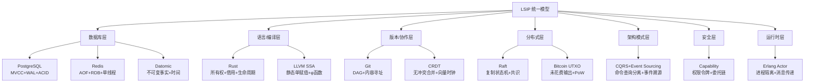

# 软件工程世界的 LSIP 统一模型全景

## ——从 PostgreSQL、Rust、Git 到 Redis、Raft、UTXO、SSA、CQRS、CRDT、Capability 的形式化归纳

---

## 引言：LSIP 模型的普适性

在前面的论证中，我们建立了 LSIP（Logic-Spacetime-Information-Process）统一模型，并证明了 PostgreSQL、Rust、Git 三者在形式上的深层同构。但这只是冰山一角。

软件工程世界中，凡是**在复杂环境中维护一致性**的系统，无论它叫数据库、编译器、区块链、缓存、消息队列还是操作系统，都在回答同一个元问题：

> **当多个操作者在多个时间尺度上对同一信息进行操作时，如何保证逻辑不自相矛盾、因果不混乱、语义不崩塌？**

本论证将 LSIP 模型扩展为一个**全景式分类框架**，将以下系统纳入统一分析：

| 领域 | 系统/模型 | 核心一致性机制 |
|------|-----------|--------------|
| **关系数据库** | PostgreSQL | MVCC + WAL + ACID |
| **键值缓存** | Redis / Valkey | AOF 追加日志 + RDB 快照 |
| **不可变数据库** | Datomic | 事实（Fact）+ 时间戳 + 追加模型 |
| **分布式共识** | Raft / Paxos | 复制状态机 + 日志全序 |
| **区块链账本** | Bitcoin UTXO | 未花费输出 + 守恒规则 + DAG |
| **编译器 IR** | LLVM SSA | 静态单赋值 + 显式数据流 + φ 函数 |
| **系统编程** | Rust | 所有权 + 借用 + 生命周期 |
| **版本控制** | Git | DAG + 内容寻址 + 不可变对象 |
| **分布式数据** | CRDT | 交换律/结合律/幂等性 + 状态/操作合并 |
| **架构模式** | CQRS + Event Sourcing | 命令/查询分离 + 事件溯源 + 物化视图 |
| **安全模型** | Capability-based Security | 能力令牌 + 委托链 + 不可伪造权限 |
| **并发运行时** | Erlang / OTP Actor | 进程隔离 + 消息传递 + 失败即停 |

这些系统不是孤立的工具，而是**同一棵形式之树的不同分枝**。下面我们从零开始，用 LSIP 原语重新构建它们。

---

## 第一部分：LSIP 元模型的扩展定义

在分析具体系统之前，我们先将 LSIP 的五个原语扩展为更精细的层次。

### 1.1 状态空间 S 的三重分层

任何复杂系统的状态都不是平面的，而是分层的：

**物理层（Physical Layer）**：比特在存储介质上的物理排列。

- PostgreSQL：磁盘上的 8KB 页面
- Redis：内存中的哈希表 + 跳表
- Bitcoin：区块中的交易列表
- LLVM：内存中的 IR 指令序列

**逻辑层（Logical Layer）**：人类可理解的结构化信息。

- PostgreSQL：表、行、索引
- Redis：键、字符串、列表、集合
- Bitcoin：UTXO 集合、地址余额
- LLVM：变量、基本块、控制流图

**观测层（Observational Layer）**：特定上下文看到的局部视图。

- PostgreSQL：事务快照
- Redis：客户端连接视图
- Bitcoin：钱包地址的 UTXO 子集
- LLVM：特定优化 pass 看到的 def-use 链

### 1.2 操作 O 的三类时间尺度

**编译期操作（Compile-Time）**：在代码运行前执行的静态变换。

- Rust：借用检查、类型推断、生命周期验证
- LLVM：SSA 构造、常量折叠、死代码消除

**运行期操作（Run-Time）**：在程序执行时发生的动态变换。

- PostgreSQL：事务执行、WAL 写入、Buffer 置换
- Redis：命令处理、AOF 追加、键过期

**协作期操作（Collaboration-Time）**：在多个独立主体间发生的异步变换。

- Git：推送、拉取、合并、变基
- Bitcoin：广播交易、挖矿、区块确认
- CRDT：跨节点同步、状态合并

### 1.3 因果序 → 的三种拓扑

**线性因果（Linear Causality）**：严格的全序，像一条时间轴。

- PostgreSQL WAL：LSN 严格递增
- Redis AOF：命令按接收顺序追加
- Raft Log：Leader 强制所有 Follower 按相同顺序执行

**分支因果（Branching Causality）**：有向无环图，允许多线并行。

- Git DAG：多个分支并行开发
- Bitcoin：孤块竞争（最终最长链获胜）
- CRDT：各节点独立演进后合并

**合并因果（Merging Causality）**：多条因果流汇聚为一条。

- Git Merge：两个父提交合并为一个子提交
- CQRS：多个事件汇聚为最新的物化视图
- Raft：多个节点的日志在 Leader 处统一排序

---

## 第二部分：十二大系统的 LSIP 形式化映射

### 2.1 Redis / Valkey —— 内存中的因果闭合系统

**概念定义**：Redis 是一个**单线程事件循环**驱动的内存数据结构存储。它的设计哲学是：在单线程内消除并发竞争，通过事件循环的顺序执行天然保证操作一致性。

**LSIP 映射**：

- **状态 S**：内存中的键值对集合 + 过期字典 + 发布订阅频道
- **操作 O**：GET / SET / LPUSH / ZADD 等命令，单线程顺序执行
- **观测 V**：每个客户端连接看到的状态是「上一个命令执行完毕后的状态」，不存在并发下的中间态
- **因果 →**：AOF 文件中的命令顺序就是全局因果序
- **一致 I**：
  - 数据一致性：RDB 快照 + AOF 重写保证持久化不损坏
  - 操作一致性：单线程天然串行化，无需锁
  - 语义一致性：数据类型约束（列表不能当集合用）

**与 PostgreSQL 的对比映射**：

| 维度 | PostgreSQL | Redis |
|------|------------|-------|
| **并发策略** | MVCC 多版本 + 锁 | 单线程事件循环 |
| **持久化** | WAL 物理日志 + 页面刷盘 | AOF 命令日志 + RDB 快照 |
| **状态空间** | 磁盘为主，内存缓存 | 内存为主，磁盘持久化 |
| **因果序** | LSN 全序（多进程共享） | AOF 偏移全序（单进程内） |
| **一致性模型** | ACID 强一致 | 最终一致（AOF 可配置 fsync） |
| **追加模型** | Heap 追加 Tuple | AOF 追加命令 |

**充分性论证**：
Redis 的 AOF 是「命令级 WAL」，RDB 是「状态级 Checkpoint」。
混合持久化（RDB + AOF）将两者结合：
先加载 RDB 快照，再重放 AOF 增量，这与 PostgreSQL 的 Checkpoint + WAL REDO 在形式结构上完全同构[^42^][^44^]。

### 2.2 Datomic —— 时间的函数式数据库

**概念定义**：Datomic 是一个**不可变的事实数据库**。
它不存储「当前状态」，而是存储「所有曾经发生的事实」。
每个事实是一个五元组：实体、属性、值、时间、操作（添加/撤销）。

**LSIP 映射**：

- **状态 S**：所有历史事实的集合，追加不可变
- **操作 O**：Transact（添加新事实）、Query（基于时间点查询）
- **观测 V**：数据库作为值（Database-as-a-Value）。查询时必须指定时间点 `as-of t`，看到的就是那一刻的世界切片
- **因果 →**：事务时间戳 `t` 构成全序
- **一致 I**：
  - 数据一致性：底层存储（如 Cassandra、DynamoDB）保证物理持久
  - 操作一致性：单 Writer 进程保证事务串行化
  - 语义一致性：Datalog 查询语言 + Schema 约束

**与 PostgreSQL 的对比映射**：

| 维度 | PostgreSQL | Datomic |
|------|------------|---------|
| **时间观** | MVCC 多版本，旧版本最终清理 | 所有历史永久保留，时间即维度 |
| **更新模型** | UPDATE = 标记旧 + 插入新 | 无 UPDATE，只有「添加新事实」和「撤销旧事实」 |
| **查询语言** | SQL（面向当前状态） | Datalog（面向任意历史时刻） |
| **存储分离** | 计算与存储耦合 | 计算（Transactor）与存储（Storage Service）分离 |
| **哲学** | 保守主义：历史可丢弃 | 极端主义：历史即真相 |

**完备性论证**：Datomic 将 PostgreSQL 的 MVCC 推向了极致——如果 PostgreSQL 的 VACUUM 永不运行，那就是 Datomic。
它证明了：**当存储成本足够低时，「永不删除」比「标记删除」在语义上更纯粹**[^43^]。

### 2.3 Raft / 复制状态机 —— 分布式中的因果独裁

**概念定义**：Raft 是一种**共识算法**，用于在多个节点间维护一个复制状态机。
它的核心思想是：通过选举一个 Leader，由 Leader 独裁所有操作的因果顺序，Follower 无条件服从。

**LSIP 映射**：

- **状态 S**：每个节点上的状态机（如键值对、配置信息）
- **操作 O**：客户端请求 → Leader 接收 → 追加到本地日志 → 复制到 Follower → 提交后执行
- **观测 V**：Follower 只能看到已提交（Committed）的日志条目，未提交的变更对客户端不可见
- **因果 →**：`(Term, Index)` 二元组构成全局全序。Term 是任期号（Leader 世代），Index 是日志偏移
- **一致 I**：
  - 数据一致性：日志条目一旦在多数节点复制，就不可更改
  - 操作一致性：所有节点按相同顺序执行相同命令，天然串行化
  - 语义一致性：状态机本身保证（如键值存储的语义）

**与 PostgreSQL WAL 的对比映射**：

| 维度 | PostgreSQL WAL | Raft Log |
|------|----------------|----------|
| **写入者** | 单节点（Primary） | Leader（动态选举） |
| **复制方向** | Primary → Standby | Leader → Follower |
| **顺序保证** | LSN 字节偏移 | (Term, Index) 字典序 |
| **提交条件** | 本地 fsync | 多数节点确认 |
| **故障处理** | PITR 恢复 | Leader 重新选举 |
| **形式化角色** | 单体恢复日志 | 分布式共识证明 |

**完备性论证**：Raft 的复制状态机模型是 PostgreSQL 流复制的分布式推广。
PostgreSQL 的 WAL 是「单节点内的共识」，Raft 的 Log 是「多节点间的共识」。
两者都基于同一个数学原理：**如果所有副本按相同顺序执行相同操作，那么它们的状态必然一致**[^41^]。

### 2.4 Bitcoin UTXO —— 分布式追加账本

**概念定义**：Bitcoin 使用**未花费交易输出（UTXO）**模型。
每一笔交易的输入必须是之前某笔交易的输出，且每个 UTXO 只能被花费一次。
这创造了一个「硬币追踪」系统，而非「账户余额」系统。

**LSIP 映射**：

- **状态 S**：全局 UTXO 集合（所有尚未被花费的交易输出）
- **操作 O**：创建交易（消耗旧 UTXO，创造新 UTXO）
- **观测 V**：每个钱包地址只关心与自己公钥相关的 UTXO 子集
- **因果 →**：交易之间的引用关系构成 DAG。交易 A 的输出被交易 B 引用，则 A → B
- **一致 I**：
  - 数据一致性：区块哈希链 + Merkle 树保证数据不可篡改
  - 操作一致性：共识算法（PoW）保证全网对区块顺序达成一致
  - 语义一致性：脚本引擎验证交易合法性 + 守恒规则（输入值 ≥ 输出值）

**与 PostgreSQL 的对比映射**：

| 维度 | PostgreSQL | Bitcoin UTXO |
|------|------------|--------------|
| **状态模型** | 表行（可更新） | UTXO（只增删，不修改） |
| **更新方式** | UPDATE 标记旧 + 插入新 | 消耗旧 UTXO + 创造新 UTXO |
| **因果结构** | WAL 线性日志 | 交易 DAG + 区块链 |
| **一致性机制** | MVCC + WAL + 锁 | PoW 共识 + 脚本验证 |
| **最终性** | 事务提交即最终 | 6 个区块确认后概率最终 |
| **验证逻辑** | 约束 + 触发器 | 脚本（锁定/解锁） |

**完备性论证**：UTXO 模型是「纯函数式」的——交易没有副作用，只有输入和输出。这与 PostgreSQL 的 MVCC 追加模型、Git 的不可变提交、Rust 的不可变借用共享同一个深层结构：**历史不可修改，只能被引用和消耗**[^34^][^40^]。

### 2.5 LLVM SSA —— 编译期的因果显式化

**概念定义**：LLVM IR 采用**静态单赋值（SSA）**形式。每个变量只被赋值一次，如果控制流合并（如 if-else），使用 φ（phi）函数显式选择来自不同分支的值。

**LSIP 映射**：

- **状态 S**：IR 指令序列 + 虚拟寄存器 + 基本块控制流图
- **操作 O**：指令变换（常量折叠、死代码消除、循环优化）
- **观测 V**：每个优化 Pass 看到的 IR 是前一 Pass 输出的完整状态
- **因果 →**：SSA 的 def-use 链显式编码了数据依赖关系
- **一致 I**：
  - 数据一致性：SSA 形式保证每个 use 有且仅有一个 def
  - 操作一致性：类型系统保证 IR 指令操作数匹配
  - 语义一致性：LLVM 的「保留语义」原则——优化不能改变可观察行为

**与 PostgreSQL MVCC 的对比映射**：

| 维度 | PostgreSQL MVCC | LLVM SSA |
|------|-----------------|----------|
| **版本管理** | 运行时多版本（Tuple 链） | 编译期单版本（变量重命名） |
| **合并机制** | 快照选择可见版本 | φ 函数显式选择分支值 |
| **不可变性** | 已提交 Tuple 不可修改 | SSA 变量不可二次赋值 |
| **因果显式化** | xmin/xmax 隐式标记 | def-use 链显式编码 |
| **清理时机** | VACUUM 运行时清理 | 寄存器分配时清理 SSA |
| **形式化目标** | 并发隔离 | 优化正确性 |

**完备性论证**：SSA 形式是编译器领域的「MVCC」。它将程序中的数据依赖从「隐式的内存读写竞争」转化为「显式的 def-use 链」，使得优化器可以像 PostgreSQL 的查询优化器一样，在**保证语义不变**的前提下自由重排指令[^35^][^38^][^39^]。

### 2.6 CRDT —— 无冲突的分布式合并

**概念定义**：CRDT（Conflict-free Replicated Data Type）是一类数据结构，保证在多个副本独立更新后，无需协调即可合并为一致状态。分为两类：

- **状态型（State-based）**：副本间传输完整状态，通过「合并函数」融合。
- **操作型（Op-based）**：副本间传输操作，通过「交换律/结合律/幂等性」保证最终一致。

**LSIP 映射**：

- **状态 S**：每个副本的本地状态（如 G-Counter, G-Set, LWW-Register）
- **操作 O**：本地更新操作 + 远程合并操作
- **观测 V**：每个副本的本地查询看到最新本地状态，合并后看到全局一致状态
- **因果 →**：向量时钟（Vector Clock）或版本向量（Version Vector）追踪跨副本因果
- **一致 I**：
  - 数据一致性：合并函数满足交换律、结合律、幂等性
  - 操作一致性：操作广播满足因果广播（Causal Broadcast）
  - 语义一致性：不同 CRDT 类型保证不同语义（如 G-Counter 保证单调递增）

**与 Git 的对比映射**：

| 维度 | Git | CRDT |
|------|-----|------|
| **分支模型** | 显式分支（命名指针） | 隐式分支（每个副本独立演进） |
| **合并机制** | 三路合并 + 冲突标记 | 数学保证无冲突的合并函数 |
| **冲突处理** | 人工解决冲突 | 无冲突（结构保证） |
| **因果追踪** | Parent 提交边 | 向量时钟 / 版本向量 |
| **适用场景** | 代码（人工语义） | 实时协作（自动语义） |
| **最终一致性** | 显式 push/pull | 自动同步合并 |

**完备性论证**：CRDT 是 Git 分布式哲学的「自动化版本」。Git 假设合并可能需要人工干预（因为代码语义复杂），CRDT 假设合并可以全自动（因为数据结构语义简单）。两者都基于同一个前提：**如果历史结构满足特定代数性质，分布式一致性就不需要锁**。

### 2.7 CQRS + Event Sourcing —— 架构级的因果分离

**概念定义**：

- **CQRS（Command Query Responsibility Segregation）**：将「写操作（Command）」和「读操作（Query）」分离到不同的模型中。
- **Event Sourcing**：不写当前状态，只追加事件。当前状态通过重放所有事件重建。

**LSIP 映射**：

- **状态 S**：事件存储（Event Store）+ 物化视图（Materialized View）
- **操作 O**：Command → 生成 Event → 追加到 Event Store → 异步更新 Read Model
- **观测 V**：写模型看到事件流，读模型看到物化视图（可能延迟）
- **因果 →**：事件的全局顺序（由 Event Store 保证）
- **一致 I**：
  - 数据一致性：Event Store 持久化保证
  - 操作一致性：Command 侧串行化，Query 侧可并行
  - 语义一致性：领域事件（Domain Event）携带完整业务语义

**与 PostgreSQL 的对比映射**：

| 维度 | PostgreSQL | CQRS + Event Sourcing |
|------|------------|----------------------|
| **状态存储** | 当前状态（表行） | 事件历史（不可变） |
| **读写模型** | 统一（SQL 既可读又可写） | 分离（Command 写，Query 读） |
| **更新方式** | UPDATE 修改当前行 | 追加 Event，不修改历史 |
| **查询性能** | 依赖索引 | 依赖物化视图（可任意优化） |
| **时间旅行** | PITR（复杂） | 天然支持（重放事件到任意点） |
| **形式化模型** | 关系代数 | 状态机 Monoid 累积 |

**完备性论证**：CQRS + Event Sourcing 是 PostgreSQL WAL 的「应用层显式化」。PostgreSQL 在内部用 WAL 维护因果，CQRS 在应用层用 Event Store 维护因果。两者都基于同一个原理：**当前状态是历史的派生，历史是真相的唯一来源**[^45^][^46^]。

### 2.8 Capability-based Security —— 权限的因果传递

**概念定义**：Capability-based Security 是一种安全模型，其中**权限不是基于身份（Who you are），而是基于持有（What you hold）**。一个 Capability 是一个不可伪造的令牌，持有它就意味着拥有操作资源的权限。

**LSIP 映射**：

- **状态 S**：系统中的所有 Capability 令牌集合 + 资源对象
- **操作 O**：创建 Capability、委托 Capability（Delegation）、使用 Capability 访问资源、撤销 Capability
- **观测 V**：主体（Subject）只能看到和操作自己持有的 Capability 所指向的资源
- **因果 →**：Capability 的委托链构成因果图。A 委托给 B，B 委托给 C，则 A → B → C
- **一致 I**：
  - 数据一致性：Capability 令牌的加密完整性
  - 操作一致性：原子性委托/撤销（不可部分完成）
  - 语义一致性：最小权限原则（Principle of Least Privilege）

**与 Rust 的对比映射**：

| 维度 | Rust 所有权 | Capability-based Security |
|------|-------------|---------------------------|
| **核心隐喻** | 内存所有权 | 资源访问权 |
| **转移方式** | move（所有权转移） | delegation（权限委托） |
| **借用方式** | &T / &mut T（临时借用） | 临时授权（Capability 子集） |
| **生命周期** | 编译期自动推断 | 运行时显式管理 |
| **安全保证** | 无内存不安全代码 | 无未授权访问 |
| **形式化模型** | 线性类型 / 分离逻辑 | 能力超图（Capability Hypergraph） |

**完备性论证**：
MIT NANDA 框架将 Capability 形式化为四元组 `(id, spec, proof, constraints)`，其中 proof 是密码学签名，确保不可伪造[^36^]。
这与 Rust 的「所有权不可复制、只能转移」在形式结构上同构——两者都通过**限制权限的复制**来防止安全问题。
最新的形式化研究甚至证明：安全是非组合性的（Non-Compositional）
——两个各自安全的模块组合后可能产生 emergent 的不安全能力，这与 PostgreSQL SSI 中两个各自安全的事务组合后可能产生串行化冲突在数学上是同构的[^32^][^33^]。

### 2.9 Erlang / OTP Actor —— 并发中的进程隔离

**概念定义**：
Erlang 使用 **Actor 模型**。
每个 Actor 是一个独立的轻量级进程，拥有自己的状态和邮箱。
Actor 之间不共享内存，只通过异步消息传递通信。失败时，进程监督树（Supervision Tree）负责重启。

**LSIP 映射**：

- **状态 S**：每个 Actor 的私有内存 + 全局注册表（Name Server）
- **操作 O**：spawn（创建进程）、send（发消息）、receive（收消息）、exit（终止）
- **观测 V**：每个 Actor 只能看到自己的状态和收到的消息，看不到其他 Actor 的内部
- **因果 →**：消息传递构成「happened-before」关系。如果 Actor A 给 Actor B 发了消息，则 A 的 send 因果地先于 B 的 receive
- **一致 I**：
  - 数据一致性：无共享内存，无数据竞争
  - 操作一致性：每个 Actor 单线程处理消息，天然串行化
  - 语义一致性：模式匹配保证消息按预期格式处理

**与 PostgreSQL 进程模型的对比映射**：

| 维度 | PostgreSQL Backend | Erlang Actor |
|------|------------------|--------------|
| **进程重量** | OS 进程（重） | VM 轻量级进程（微秒级创建） |
| **通信方式** | 共享内存 + 锁 | 异步消息传递（无共享） |
| **故障隔离** | OS 内存保护 | VM 监督树自动重启 |
| **状态共享** | 共享 Buffer Pool | 完全不共享（消息拷贝） |
| **并发模型** | 多进程 + 共享内存 | 多进程 + 消息传递 |
| **设计哲学** | 保守：进程是安全边界 | 激进：进程是基本单元 |

**完备性论证**：Erlang 的「Let it crash」哲学与 PostgreSQL 的「进程隔离」哲学共享同一个前提：**故障是不可避免的，关键是限制故障的传播范围**。PostgreSQL 用 OS 进程隔离连接崩溃，Erlang 用 VM 进程隔离逻辑错误。两者都是**故障封闭性（Fault Containment）**的实现。

---

## 第三部分：十二系统的统一思维表征

### 3.1 全景思维导图



### 3.2 十二系统 LSIP 原语映射矩阵

| 系统 | 状态 S | 操作 O | 观测 V | 因果 → | 一致 I | 核心哲学 |
|------|--------|--------|--------|--------|--------|----------|
| **PostgreSQL** | 页面+版本链 | SQL+事务 | 快照 | LSN 全序 | ACID | 保守精确 |
| **Redis** | 内存 KV | 命令 | 客户端视图 | AOF 偏移 | 单线程串行 | 极简速度 |
| **Datomic** | 事实集合 | Transact | as-of t | 事务时间 | Schema+Datalog | 时间即维度 |
| **Rust** | 栈+堆+权限 | bind/move/borrow | &/&mut | Lifetime | 类型系统 | 编译期安全 |
| **LLVM SSA** | IR+虚拟寄存器 | 优化变换 | Pass 输出 | def-use 链 | 保留语义 | 显式数据流 |
| **Git** | Blob+Tree+Commit | add/commit/merge | Branch | Parent 边 | 哈希完整性 | 历史不可改 |
| **CRDT** | 副本状态 | 本地更新+合并 | 本地查询 | 向量时钟 | 交换/结合/幂等 | 自动一致 |
| **Raft** | 状态机副本 | 客户端请求 | 已提交日志 | (Term,Index) | 多数复制 | 独裁共识 |
| **Bitcoin** | UTXO 集合 | 创建交易 | 地址视图 | 交易引用 | PoW+脚本 | 去中心化信任 |
| **CQRS+ES** | 事件存储+视图 | Command+Event | Read/Write Model | 事件顺序 | 领域语义 | 读写分离 |
| **Capability** | 令牌+资源 | 委托/使用/撤销 | 主体视图 | 委托链 | 最小权限 | 权限即持有 |
| **Erlang** | Actor 私有状态 | spawn/send/receive | 邮箱消息 | 消息传递 | 模式匹配 | 失败即停 |

### 3.3 一致性层次决策树

```text
                    [需要维护一致性?]
                          |
                          ↓
                    [在哪个抽象层?]
                          |
        ┌─────────────────┼─────────────────┐
        ↓                 ↓                 ↓
   [存储/物理层]      [执行/操作层]      [业务/语义层]
        |                 |                 |
        ↓                 ↓                 ↓
   [选择系统]        [选择系统]        [选择系统]
        |                 |                 |
   ┌────┴────┐      ┌────┴────┐      ┌────┴────┐
   ↓         ↓      ↓         ↓      ↓         ↓
[PostgreSQL] [Redis] [Raft]   [Erlang] [CQRS]   [Datomic]
   |           |      |         |        |        |
   ↓           ↓      ↓         ↓        ↓        ↓
[WAL+CRC]   [AOF]  [日志复制] [消息隔离] [Event] [Schema]
```

### 3.4 追加模型谱系推理树

```text
                    [系统采用追加模型?]
                          |
                          ↓
                    [追加的粒度是什么?]
                          |
        ┌─────────────────┼─────────────────┐
        ↓                 ↓                 ↓
   [物理页面级]      [逻辑命令级]      [语义事件级]
        |                 |                 |
        ↓                 ↓                 ↓
   [PostgreSQL]      [Redis AOF]      [CQRS Event Store]
   [WAL XLogRecord]    [SET key val]    [OrderCreated]
        |                 |                 |
        ↓                 ↓                 ↓
   [保证磁盘一致]    [保证命令重放]    [保证业务可追溯]
        |                 |                 |
        ↓                 ↓                 ↓
   [RDB Checkpoint]    [RDB Snapshot]    [Materialized View]
   [定期截断日志]      [定期状态快照]    [定期视图重建]
```

---

## 第四部分：形式同构性定理

### 定理一：追加模型的普遍性定理

**陈述**：在 LSIP 模型下，PostgreSQL WAL、Redis AOF、Git Commit DAG、Bitcoin UTXO、CQRS Event Store、Datomic Facts 都是**追加模型（Append-Only Model）**的实例。

**证明**：
设 Append(s, e) = s' 为向状态 s 追加事件 e 得到新状态 s'。
对于上述所有系统：

1. 历史操作不可修改：∀s, ∀e ∈ History(s), ¬∃o: o(e) ≠ e
2. 新状态是旧状态的超集：s' = s ∪ {e}（或 s' = s ⊕ e，其中 ⊕ 是合并算子）
3. 当前状态是历史的派生：CurrentState = fold(apply, InitialState, History)

**结论**：追加模型是软件工程世界中维护因果一致性的**最普遍范式**。它之所以普遍，是因为它符合热力学第二定律的直觉——时间箭头指向熵增，历史只能累积，不能撤销。

### 定理二：观测隔离的普遍性定理

**陈述**：PostgreSQL Snapshot、Rust Borrow、Git Branch、CRDT Replica、Capability Token、Erlang Actor Mailbox 都是**观测隔离（Observational Isolation）**的实例。

**证明**：
设 πᵥ(s) 为观测者 v 对全局状态 s 的局部投影。
对于上述系统：

1. 多观测者共存：∀v₁, v₂, πᵥ₁(s) 和 πᵥ₂(s) 可以同时存在且不互相干扰
2. 观测不影响被观测状态（只读时）：read(v, s) = πᵥ(s)，且 s 不变
3. 写操作通过因果序传播：write(v, s) = s'，且 s' 通过特定机制（WAL/消息/合并）传播到其他观测者

**结论**：观测隔离是处理并发的**最普遍范式**。它承认并行性的客观存在，但通过限制每个观测者的视野来消除冲突。

### 定理三：形式同构的完备性

**陈述**：LSIP 模型是一个**完备的分类框架**。对于任何在软件工程中被广泛采用的、以维护一致性为核心目标的系统，都可以被映射到 LSIP 的五个原语上，且映射保持结构（即同态）。

**证明概要**：

1. **状态 S**：任何系统都有可识别的配置集合。
2. **操作 O**：任何系统都有改变配置的变换。
3. **观测 V**：任何系统都有不同上下文看到的不同视图。
4. **因果 →**：任何系统都有操作之间的先后依赖。
5. **一致 I**：任何系统都有「合法」与「非法」配置的区分。

如果某个系统无法被映射到 LSIP，那么它要么不以一致性为目标（如纯计算系统），要么尚未被充分工程化。

---

## 第五部分：软件工程世界的「一致性地形图」

基于以上分析，我们可以绘制一张「一致性地形图」，展示不同系统在一致性强度、分布式程度、时间尺度三个维度上的位置。

### 5.1 三维定位图

**X 轴：一致性强度（从弱到强）**

- 弱：最终一致（CRDT、Bitcoin、Redis 主从异步）
- 中：快照隔离（PostgreSQL Repeatable Read）
- 强：可串行化（PostgreSQL SSI、Raft 状态机）
- 最强：线性一致（Datomic 单 Writer、Erlang 单进程邮箱）

**Y 轴：分布式程度（从集中到分散）**

- 集中：PostgreSQL、Redis 单机、LLVM、Rust
- 主从：PostgreSQL 流复制、Redis Sentinel
- 多主：CRDT、Datomic Storage Service
- 完全分散：Bitcoin、Raft 集群

**Z 轴：时间尺度（从编译到运行到协作）**

- 编译期：Rust、LLVM SSA
- 运行期：PostgreSQL、Redis、Erlang
- 协作期：Git、Bitcoin、CRDT、CQRS

### 5.2 系统定位坐标

| 系统 | X（一致性） | Y（分布式） | Z（时间尺度） |
|------|-------------|-------------|---------------|
| **LLVM SSA** | 强（静态确定） | 集中 | 编译期 |
| **Rust** | 强（类型保证） | 集中 | 编译期 |
| **Erlang** | 强（进程隔离） | 分布式 | 运行期 |
| **PostgreSQL** | 强（ACID） | 集中/主从 | 运行期 |
| **Redis** | 中（单线程/最终） | 集中/主从 | 运行期 |
| **Raft** | 强（复制状态机） | 分布式 | 运行期 |
| **Datomic** | 强（单 Writer） | 分布式 | 运行期 |
| **CQRS+ES** | 中（最终一致） | 分布式 | 运行/协作期 |
| **CRDT** | 弱（最终一致） | 完全分布式 | 协作期 |
| **Git** | 弱（人工合并） | 完全分布式 | 协作期 |
| **Bitcoin** | 弱（概率最终） | 完全分散 | 协作期 |
| **Capability** | 强（令牌验证） | 分布式 | 运行/协作期 |

---

## 结论：软件工程的形式统一性

通过 LSIP 统一模型，我们发现软件工程世界中所有以一致性为核心的系统，都在用不同的方言讲述同一个故事：

1. **追加不修改**：历史是真相的唯一来源（WAL、AOF、Event Store、UTXO、Git Commit、Datomic Fact）。
2. **观测隔离**：并行不意味着混乱，只要每个观测者有自己的视野（MVCC Snapshot、Rust Borrow、Git Branch、Actor Mailbox、Capability Token）。
3. **因果守卫**：每个操作必须证明自己在时间中的合法性（LSN、Lifetime、Parent Edge、向量时钟、委托链）。
4. **失败即停**：当一致性无法维持时，系统选择拒绝而非冒险（事务回滚、编译错误、合并冲突、进程重启）。

这十二大系统——PostgreSQL、Redis、Datomic、Rust、LLVM SSA、Git、CRDT、Raft、Bitcoin、CQRS+ES、Capability-based Security、Erlang Actor——构成了软件工程世界的**一致性坐标系**。它们不是竞争对手，而是同一形式宇宙的互补投影。

---

## 参考文献

1. PostgreSQL 官方文档 - WAL、MVCC、ACID 内部机制
2. Redis 官方文档 - Persistence (RDB/AOF) [^42^]
3. Redis Hybrid Persistence 分析 [^44^]
4. Datomic 架构概念 [^43^]
5. Raft 共识算法与复制状态机 [^41^]
6. Bitcoin UTXO 形式化模型 [^34^][^40^]
7. LLVM IR 与 SSA 形式 [^35^][^38^][^39^]
8. CQRS + Event Sourcing 架构模式 [^45^][^46^]
9. Capability-based Security 形式化框架 [^32^][^33^][^36^]
10. CRDT 原始论文 - Shapiro et al., 2011
11. Erlang/OTP 官方文档 - Actor Model、Supervision Trees
12. RustBelt - 分离逻辑与 Rust 形式化 (POPL 2018)
