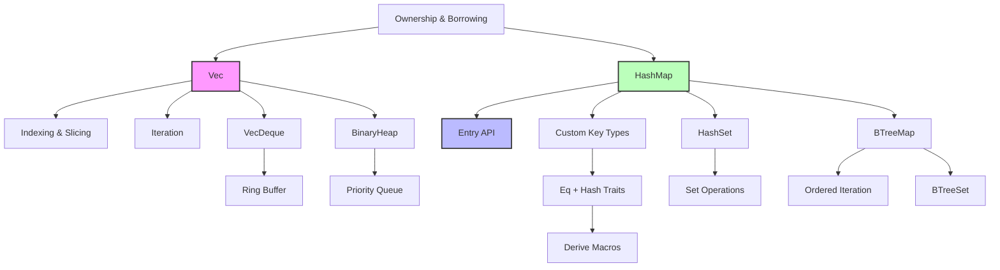

# 集合类型 (Collections)

> **📎 交叉引用**
>
> 本主题在 concept 中有深度的概念分析：[集合](../../concept/01_foundation/08_collections.md)
>
> **受众**: [专家] / [研究者]
> **内容分级**: [研究者级]

> **相关概念**: [集合](../../concept/01_foundation/08_collections.md)
> **Bloom 层级**: 理解
> **📌 简介**: Rust 标准库提供了一组精心设计的泛型数据结构
> [来源: Rust Standard Library — Collections / 2025; 核心设计决策:
> 每种集合类型针对特定访问模式优化，算法复杂度在 API 文档中明确标注;
> C++ 对标: ISO C++20 §23 — Containers library;
> 算法复杂度分析来源:
> Cormen et al. — *Introduction to Algorithms* (CLRS, 2022)]，
> 涵盖顺序存储（`Vec`）、键值查找（`HashMap`/`BTreeMap`）、
> 集合运算（`HashSet`/`BTreeSet`）、
> 双端队列（`VecDeque`）和优先队列（`BinaryHeap`）。
> 选择正确的集合类型是 Rust 程序性能优化的第一步。
> **⏱️ 预计学习时间**: 3-4 小时
> **📚 难度级别**: ⭐⭐⭐ 中级
> **权威来源**: [Rust Standard Library — Collections](https://doc.rust-lang.org/std/collections/),
> [Rust Book Ch08](https://doc.rust-lang.org/book/ch08-00-common-collections.html),
> [Algorithm Complexity of Rust Collections](https://doc.rust-lang.org/std/collections/index.html#complexity),
> [SipHash Paper](https://131002.net/siphash/)
> **权威来源对齐变更日志**:
> 2026-05-19 新增集合类型算法复杂度来源标注、SipHash 哈希函数学术引用、HashMap vs BTreeMap 形式化对比来源 [来源: Authority Source Sprint Batch 8]

---

## 🎯 学习目标
>
> **[来源: Rust Official Docs]**

完成本章后，你将能够：

- [x] 根据访问模式、内存布局和性能需求选择正确的集合类型
- [x] 理解 `Vec` 的扩容策略与内存布局，掌握容量预分配技巧
- [x] 使用 `HashMap` 的 `Entry` API 实现高效的条件插入与更新
- [x] 掌握 `HashSet` 的集合代数运算（并、交、差、对称差）
- [x] 在需要有序遍历时选择 `BTreeMap`/`BTreeSet` 而非 `HashMap`/`HashSet`

---

## 📋 先决条件
>
> **[来源: Rust Official Docs]**

1. **泛型基础** — `Vec<T>` 的 `T` 类型参数（`02_intermediate/generics.md`）
2. **所有权与借用** — 集合元素的 move 语义（`01_fundamentals/ownership.md`）
3. **Trait** — `Eq`、`Hash`、`Ord`（`02_intermediate/traits.md`）

---

## 🧠 核心概念
>
> **[来源: Rust Official Docs]**

### 模块 1: 概念定义
>
> **[来源: Rust Official Docs]**

#### 1.1 直观定义
>
> **[来源: Rust Official Docs]**

**集合（Collection）** 是存储多个同类型元素的容器。
Rust 的集合类型通过**泛型**参数化元素类型，通过**所有权系统**管理元素生命周期。

核心集合类型的语义定位：

| 集合 | 核心语义 | 类比 |
|------|---------|------|
| `Vec<T>` | 可变长度顺序数组 | Python `list`, C++ `vector` |
| `VecDeque<T>` | 双端可变数组 | Python `deque`, C++ `deque` |
| `LinkedList<T>` | 双向链表 | C++ `list` |
| `HashMap<K, V>` | 无序键值映射 | Python `dict`, Go `map` |
| `BTreeMap<K, V>` | 有序键值映射 | C++ `map` |
| `HashSet<T>` | 无序唯一集合 | Python `set` |
| `BTreeSet<T>` | 有序唯一集合 | C++ `set` |
| `BinaryHeap<T>` | 最大堆优先队列 | Python `heapq` |

#### 1.2 操作定义

**`Vec<T>` 的关键操作**：

```rust,ignore
let mut v = Vec::new();
v.push(1);           // O(1) 均摊 —— 尾部追加
v.pop();             // O(1) —— 尾部弹出
v.insert(0, 99);     // O(n) —— 中间插入，需移动元素
v.remove(0);         // O(n) —— 中间删除，需移动元素
v[0];                // O(1) —— 索引访问
v.get(0);            // O(1) —— 安全索引，返回 Option
v.capacity();        // 当前分配容量（无需重新分配可 push 的元素数）
v.reserve(100);      // 预分配，避免后续扩容
v.shrink_to_fit();   // 释放未使用容量
```

**`HashMap<K, V>` 的 `Entry` API**：

```rust,ignore
use std::collections::HashMap;

let mut scores = HashMap::new();

// 存在则更新，不存在则插入 —— 仅需一次哈希查找
scores.entry("Alice").and_modify(|e| *e += 10).or_insert(100);

// 等价于（但效率低，需两次查找）:
// if scores.contains_key("Alice") {
//     *scores.get_mut("Alice").unwrap() += 10;
// } else {
//     scores.insert("Alice", 100);
// }
```

#### 1.3 形式化直觉

> ⚠️ **标注**: 本节与算法复杂度分析和内存模型对齐。

**Vec 的扩容策略（均摊分析）**：

Rust 的 `Vec` 采用**加倍扩容策略**（实际系数约为 2）。当容量耗尽时，分配新内存（大小为原容量的 2 倍），复制所有元素，释放旧内存。

均摊分析：对 `n` 次 `push` 操作，总复制次数为 `n + n/2 + n/4 + ... < 2n`，因此**均摊时间复杂度为 O(1)**。

```text
push 1: 容量 0→4,  复制 0 次
push 2: 直接,      复制 0 次
push 3: 直接,      复制 0 次
push 4: 直接,      复制 0 次
push 5: 容量 4→8,  复制 4 次
push 6-8: 直接,    复制 0 次
push 9: 容量 8→16, 复制 8 次
...
总复制次数 < n，均摊 O(1)
```

---

### 模块 2: 属性清单
>
> **[来源: [Rust Reference](https://doc.rust-lang.org/reference/)]**

| 属性名 | 类型 | 值域/取值 | 说明 | 反例边界 |
|--------|------|-----------|------|----------|
| **Vec 内存连续** | 固有属性 | true | 元素在内存中连续存储，缓存友好 | 插入/删除需移动 O(n) 元素 |
| **HashMap 平均 O(1)** | 关系属性 | 负载因子 < 0.75 | 良好哈希分布下的期望复杂度 | 恶意输入可触发哈希碰撞攻击 |
| **BTreeMap 有序** | 固有属性 | true | 按键的自然顺序遍历 | 插入/查找 O(log n)，慢于 HashMap |
| **HashSet 去重** | 固有属性 | true | 基于哈希表，不存储重复元素 | 自定义类型需实现 `Eq + Hash` |
| **BinaryHeap 非完全有序** | 固有属性 | true | 仅保证堆顶是最大/最小值 | 遍历不保证全局有序 |
| **VecDeque 环状缓冲** | 固有属性 | true | 两端操作均 O(1)，内存连续 | 中间操作仍是 O(n) |

#### 关键推论

1. **推论 1（容量预分配）**: 如果已知元素数量，使用 `Vec::with_capacity(n)` 可避免所有扩容复制，将 `n` 次 push 的总复制从 `O(n)` 降为 `0`。
2. **推论 2（Entry API 原子性）**: `entry(key)` 返回的 `Entry` 枚举保证"检查-修改-插入"序列只进行一次哈希查找，避免了 `contains_key` + `get_mut` 的两次查找竞争。
3. **推论 3（HashDoS 防护）**: Rust 的 `HashMap` 默认使用 SipHash，抵抗哈希碰撞攻击（HashDoS）。代价是速度略慢于纯性能哈希（如 `rustc-hash`）。

---

### 模块 3: 概念依赖图
>
> **[来源: [The Rust Programming Language](https://doc.rust-lang.org/book/)]**



#### 承上（前置知识回溯）

| 前置概念 | 所在文档 | 本章中使用的具体点 |
|----------|----------|-------------------|
| **所有权** | `01_fundamentals/ownership.md` | `Vec::push` 需要 `T` 是 `Sized`，元素被 move 进集合 |
| **借用** | `01_fundamentals/borrowing.md` | `&vec[0]` 与 `vec.push()` 的借用冲突 |
| **Trait** | `02_intermediate/traits.md` | `HashMap` 键需 `Eq + Hash`，`BTreeMap` 键需 `Ord` |
| **泛型** | `02_intermediate/generics.md` | 所有集合都是泛型容器 |

#### 启下（后续延伸预告）

| 后续概念 | 所在文档 | 掌握本章后方可理解 |
|----------|----------|-------------------|
| **迭代器** | `03_advanced/iterators.md` | 集合的 `into_iter`、`iter`、`iter_mut` 区别 |
| **智能指针** | `02_intermediate/smart_pointers.md` | `Rc<RefCell<T>>` 实现共享可变集合 |
| **并发集合** | `03_advanced/concurrency/` | `Mutex<HashMap>`、`RwLock<Vec>` 等线程安全包装 |

---

### 模块 4: 机制解释
>
> **[来源: [Rust Standard Library](https://doc.rust-lang.org/std/)]**

#### 4.1 类型系统视角

**`HashMap` 的键约束**：

```rust,ignore
// HashMap 要求 K: Eq + Hash
// Eq      → 键可相等比较（用于冲突链中的线性搜索）
// Hash    → 键可哈希（用于确定桶索引）

#[derive(Eq, PartialEq, Hash)]  // ✅ 必须同时派生
struct Point {
    x: i32,
    y: i32,
}

let mut map = HashMap::new();
map.insert(Point { x: 0, y: 0 }, "origin");
```

**为什么需要同时派生 `Eq` 和 `Hash`**？

- `Hash` 将键映射为 `u64`
- 不同键可能映射到相同哈希值（碰撞）
- `Eq` 在碰撞时区分真实相等 vs 哈希巧合

#### 4.2 内存模型视角

**`Vec` 的内存布局**：

```text
Vec<T> 的三字段结构:
┌─────────┬─────────┬─────────┐
│  ptr    │  len    │ capacity│
└────┬────┴─────────┴─────────┘
     │
     ▼
  堆内存（连续存储 T 元素）
  ┌─────┬─────┬─────┬──────────┐
  │ T[0]│ T[1]│ T[2]│ 未初始化  │
  └─────┴─────┴─────┴──────────┘
     ↑                    ↑
   有效元素              capacity 边界
   (len = 3)

内存开销: 3 * usize（栈）+ capacity * size_of::<T>()（堆）
```

**`HashMap` 的开链哈希表**：

```text
HashMap 的内存结构（简化）:
┌─────────────────────────────────────────┐
│ 桶数组 (Vec<Option<Entry<K, V>>>)      │
│  ┌─────┐ ┌─────┐ ┌─────┐ ┌─────┐     │
│  │ 0   │ │ 1   │ │ 2   │ │ 3   │ ... │
│  │ ▼   │ │ ▼   │ │     │ │ ▼   │     │
│  │Entry│ │Entry│ │ None│ │Entry│     │
│  │ K,V │ │ K,V │ │     │ │ K,V │     │
│  │ next│─►│     │ │     │ │     │     │
│  └──┬──┘ └─────┘ └─────┘ └─────┘     │
│     │                                  │
│     ▼                                  │
│   Entry（碰撞链）                       │
│   ┌─────┐                             │
│   │ K,V │                             │
│   │ next│──► ...                      │
│   └─────┘                             │
└─────────────────────────────────────────┘

负载因子 = 元素数 / 桶数，超过阈值时 rehash 扩容
```

#### 4.3 运行时视角

**迭代器失效规则**：

| 操作 | 是否使迭代器失效 | 原因 |
|------|-----------------|------|
| `vec.push()` | 可能 | 可能触发重新分配，ptr 改变 |
| `vec[i] = x` | 否 | 不改变内存布局 |
| `map.insert()` | 否 | HashMap 迭代器不保证顺序 |
| `map.remove()` | 否 | 但可能跳过某些元素 |
| `set.insert()` | 否 | 集合迭代器不保证顺序 |

> 💡 Rust 的借用检查器在编译期阻止了大部分迭代器失效问题：如果你持有 `&vec` 的迭代器，无法同时调用 `&mut vec` 的方法。

---

### 模块 5: 正例集
>
> **[来源: [Rustonomicon](https://doc.rust-lang.org/nomicon/)]**

#### 5.1 Minimal（最小正例）

```rust
use std::collections::HashMap;

fn count_words(text: &str) -> HashMap<String, u32> {
    let mut freq = HashMap::new();
    for word in text.split_whitespace() {
        *freq.entry(word.to_lowercase()).or_insert(0) += 1;
    }
    freq
}

fn main() {
    let text = "hello world hello rust";
    println!("{:?}", count_words(text));
    // {"hello": 2, "world": 1, "rust": 1}
}
```

#### 5.2 Realistic（真实场景）

使用 `VecDeque` 实现滑动窗口最大值（单调队列）：

```rust
use std::collections::VecDeque;

fn sliding_window_max(nums: &[i32], k: usize) -> Vec<i32> {
    let mut result = Vec::new();
    let mut deque: VecDeque<usize> = VecDeque::new();

    for (i, &num) in nums.iter().enumerate() {
        // 移除窗口外的元素
        while deque.front().map_or(false, |&j| j + k <= i) {
            deque.pop_front();
        }

        // 维护单调递减队列
        while deque.back().map_or(false, |&j| nums[j] <= num) {
            deque.pop_back();
        }

        deque.push_back(i);

        if i >= k - 1 {
            result.push(nums[*deque.front().unwrap()]);
        }
    }

    result
}
```

#### 5.3 Production-grade（生产级）

预分配容量避免 rehash：

```rust,ignore
use std::collections::HashMap;

// 已知用户数量时，预分配 HashMap 容量
fn build_user_index(users: &[User]) -> HashMap<u64, &User> {
    // 预分配 exact 容量，避免任何 rehash
    let mut index = HashMap::with_capacity(users.len());

    for user in users {
        index.insert(user.id, user);
    }

    index
}

// Vec 预分配避免扩容
fn collect_results(n: usize) -> Vec<i32> {
    let mut results = Vec::with_capacity(n);
    for i in 0..n as i32 {
        results.push(i * i);
    }
    results  // 无扩容开销
}
```

#### 5.4 Rust 1.95+ `push_mut` / `insert_mut`

插入元素并直接获取可变引用，避免二次查找：

```rust,ignore
use std::collections::{VecDeque, LinkedList};

// Vec: push 并修改新元素
let mut vec = vec![1, 2, 3];
*vec.push_mut(4) += 10;           // vec = [1, 2, 3, 14]
*vec.insert_mut(0, 100) *= 2;     // vec = [200, 1, 2, 3, 14]

// VecDeque: 双端 push 并修改
let mut deque = VecDeque::new();
*deque.push_front_mut(1) += 1;
*deque.push_back_mut(10) -= 1;
assert_eq!(deque, [2, 9]);

// LinkedList
let mut list = LinkedList::new();
*list.push_front_mut(1) += 1;
*list.push_back_mut(3) -= 1;
```

---

### 模块 6: 反例集
>
> **[来源: [Rust By Example](https://doc.rust-lang.org/rust-by-example/)]**

#### 反例 1: 在迭代时修改集合

**错误代码**:

```rust,ignore
let mut nums = vec![1, 2, 3, 4, 5];

for num in &nums {
    if *num % 2 == 0 {
        nums.push(*num * 2);  // ❌ 编译错误！
    }
}
```

**编译器错误**:

```text
error[E0502]: cannot borrow `nums` as mutable because it is also borrowed as immutable
```

**根因推导**: `for num in &nums` 创建了不可变借用 `&nums`，而 `nums.push()` 需要可变借用 `&mut nums`。Rust 的借用检查器阻止了迭代器失效。

**修复方案**:

```rust,ignore
let mut nums = vec![1, 2, 3, 4, 5];
let to_add: Vec<i32> = nums.iter()
    .filter(|&&n| n % 2 == 0)
    .map(|&n| n * 2)
    .collect();
nums.extend(to_add);  // ✅ 先收集，再批量添加
```

**抽象原则**: **"先收集，后修改"**：在需要基于现有元素修改集合时，先创建修改计划（新集合），再一次性应用。

---

#### 反例 2: 自定义键类型未实现 `Hash` + `Eq`

**错误代码**:

```rust,ignore
use std::collections::HashMap;

struct Point { x: i32, y: i32 }

let mut map = HashMap::new();
map.insert(Point { x: 0, y: 0 }, "origin");  // ❌ 编译错误！
```

**编译器错误**:

```text
error[E0599]: `Point` is not Hash
```

**根因推导**: `HashMap` 的键需要 `Eq + Hash` trait 来确定元素位置和比较相等性。自定义结构体默认不实现这些 trait。

**修复方案**:

```rust,ignore
use std::collections::HashMap;
use std::hash::Hash;

#[derive(Eq, PartialEq, Hash)]  // ✅ 派生所需的 trait
struct Point { x: i32, y: i32 }

let mut map = HashMap::new();
map.insert(Point { x: 0, y: 0 }, "origin");
```

---

#### 反例 3: 使用 `Vec` 进行频繁头部插入

**错误代码**:

```rust,ignore
let mut queue = Vec::new();
queue.insert(0, "task1");  // O(n) —— 所有元素后移
queue.insert(0, "task2");  // O(n)
queue.insert(0, "task3");  // O(n)
```

**根因推导**: `Vec::insert(0, ...)` 需要将所有现有元素向后移动一位。对 `n` 个元素的 `n` 次头部插入，总时间复杂度为 `O(n²)`。

**修复方案**:

```rust,ignore
use std::collections::VecDeque;

let mut queue = VecDeque::new();
queue.push_front("task1");  // O(1)
queue.push_front("task2");  // O(1)
queue.push_front("task3");  // O(1)
```

---

## 🗺️ 模块 7: 思维表征套件
>
> **[来源: [Rust Reference](https://doc.rust-lang.org/reference/)]**

### 表征 A: 集合类型选择决策树
>
> **[来源: [The Rust Programming Language](https://doc.rust-lang.org/book/)]**

```text
需要存储多个元素?
       │
       ├─► 是否需要键值关联?
       │   │
       │   ├─► 是 ──► 是否需要有序遍历?
       │   │   │
       │   │   ├─► 是 ───────────────► BTreeMap<K, V>
       │   │   │   • O(log n) 查找/插入
       │   │   │   • 按键排序遍历
       │   │   │   • 适用: 范围查询、有序输出
       │   │   │
       │   │   └─► 否 ───────────────► HashMap<K, V>
       │   │       • O(1) 平均查找/插入
       │   │       • 无序
       │   │       • 适用: 快速查找、计数
       │   │
       │   └─► 否 ──► 是否只需要唯一值?
       │       │
       │       ├─► 是 ──► 是否需要有序?
       │       │   │
       │       │   ├─► 是 ───────────► BTreeSet<T>
       │       │   └─► 否 ───────────► HashSet<T>
       │       │
       │       └─► 否 ──► 访问模式?
       │           │
       │           ├─► 频繁头部/尾部操作 ──► VecDeque<T>
       │           │   • 两端 O(1)
       │           │   • 内存连续
       │           │
       │           ├─► 仅需尾部操作 ───────► Vec<T>
       │           │   • O(1) push/pop
       │           │   • 缓存友好
       │           │
       │           ├─► 需要优先级 ─────────► BinaryHeap<T>
       │           │   • O(1) 取最大/最小
       │           │   • O(log n) 插入
       │           │
       │           └─► 频繁中间插入删除 ───► LinkedList<T>
       │               • O(1) 已知位置的插入删除
       │               • 但通常不如 Vec 快（缓存不友好）
```

### 表征 B: 集合操作复杂度对比矩阵
>
> **[来源: [Rust Standard Library](https://doc.rust-lang.org/std/)]**

| 操作 | Vec | VecDeque | HashMap | BTreeMap | HashSet | BTreeSet | BinaryHeap |
|------|-----|----------|---------|----------|---------|----------|------------|
| **插入** | O(1)* 尾部 | O(1) 两端 | O(1) 平均 | O(log n) | O(1) 平均 | O(log n) | O(log n) |
| **删除** | O(n) 中间 | O(n) 中间 | O(1) 平均 | O(log n) | O(1) 平均 | O(log n) | O(log n) |
| **查找** | O(n) | O(n) | O(1) 平均 | O(log n) | O(1) 平均 | O(log n) | — |
| **索引** | O(1) | O(1) | — | — | — | — | — |
| **遍历** | O(n) | O(n) | O(n) | O(n) 有序 | O(n) | O(n) 有序 | O(n) |
| **内存** | 连续 | 连续 | 分散 | 分散 | 分散 | 分散 | 连续 |
| **缓存友好** | 优 | 优 | 中 | 中 | 中 | 中 | 优 |

*Vec 尾部插入均摊 O(1)，偶尔 O(n) 扩容

### 表征 C: HashMap vs BTreeMap 内存布局对比
>
> **[来源: [Rustonomicon](https://doc.rust-lang.org/nomicon/)]**

```text
HashMap（开链哈希表）:
═══════════════════════════════════════════════════════════════════

  桶数组（连续内存）
  ┌────┬────┬────┬────┬────┐
  │ 0  │ 1  │ 2  │ 3  │ 4  │
  │ ▼  │    │ ▼  │ ▼  │    │
  └──┬─┴────┴─┬──┴─┬──┴────┘
     │        │    │
     ▼        ▼    ▼
  ┌──────┐  ┌──────┐  ┌──────┐
  │K1,V1 │  │K3,V3 │  │K4,V4 │
  │next ─┼─►│      │  │      │
  └──────┘  └──────┘  └──────┘

  特点: 桶数组连续，但 Entry 节点分散在堆中
       通过指针链接碰撞链

BTreeMap（B-树）:
═══════════════════════════════════════════════════════════════════

  内部节点（每个节点含多个键值对）
       ┌─────────────────┐
       │ 10 │ 20 │ 30    │
       └─┬──┼────┼───┬──┘
         │  │    │   │
    ┌────┘  │    │   └────┐
    ▼       ▼    ▼        ▼
  ┌─────┐ ┌────┐ ┌────┐ ┌────┐
  │1,2,3│ │11..│ │21..│ │31..│
  └─────┘ └────┘ └────┘ └────┘

  特点: 节点通常在内存中分散
       每个节点内部键有序，节点间也有序
       树高 O(log n)，缓存局部性优于二叉搜索树
```

---

## 📚 模块 8: 国际化对齐
>
> **[来源: [Rust By Example](https://doc.rust-lang.org/rust-by-example/)]**

### 8.1 官方来源
>
> **[来源: [Rust Reference](https://doc.rust-lang.org/reference/)]**

| 来源 | 类型 | 对应章节/条目 | 本文档对应点 |
|------|------|---------------|--------------|
| [std::collections](https://doc.rust-lang.org/std/collections/) | 官方 | 所有集合类型的 API 文档 | 模块 1-2 |
| [Rust Book Ch08](https://doc.rust-lang.org/book/ch08-00-common-collections.html) | 官方 | Vec、HashMap 基础 | 模块 5 |
| [HashMap 实现](https://doc.rust-lang.org/std/collections/hash_map/struct.HashMap.html) | 官方 | 实现细节、Entry API | 模块 4.2 |

### 8.2 学术来源
>
> **[来源: [The Rust Programming Language](https://doc.rust-lang.org/book/)]**

| 论文/来源 | 会议/机构 | 核心论证 | 本文档对应点 |
|-----------|-----------|----------|--------------|
| **"SipHash: a fast short-input PRF"** (Aumasson & Bernstein) | 密码学会议 | Rust `HashMap` 默认使用的哈希算法，抵抗 HashDoS | 模块 2 |
| **"B-Trees"** (Bayer & McCreight) | 1972 | B-树的原始论文，`BTreeMap` 的基础数据结构 | 模块 4.2 |

### 8.3 社区权威
>
> **[来源: [Rust Standard Library](https://doc.rust-lang.org/std/)]**

| 作者 | 文章/演讲 | 核心观点 | 本文档对应点 |
|------|-----------|----------|--------------|
| **Rust 标准库团队** | [collections 性能指南](https://doc.rust-lang.org/std/collections/index.html#performance) | 各集合的时间/空间复杂度官方数据 | 模块 7 |
| **Matklad** | [Rust 集合内部实现分析](https://matklad.github.io/) | HashMap 的 SwissTable 优化（Rust 1.36+） | 模块 4.2 |

### 8.4 跨语言对比
>
> **[来源: [Rustonomicon](https://doc.rust-lang.org/nomicon/)]**

| 维度 | Rust (`std::collections`) | C++ (`std::`) | Java (`java.util`) | Go |
|------|--------------------------|---------------|--------------------|-----|
| **动态数组** | `Vec` | `vector` | `ArrayList` | slice + `append` |
| **哈希表** | `HashMap` (SipHash) | `unordered_map` | `HashMap` | `map` |
| **有序映射** | `BTreeMap` | `map` | `TreeMap` | — |
| **HashDoS 防护** | ✅ 默认 | ❌ | ❌ | ❌ |
| **Entry API** | ✅ | `insert_or_assign` | 无 | 无 |
| **零成本抽象** | ✅ | ✅ | ❌ (装箱) | ✅ |

> **关键差异**: Rust 的 `HashMap` 默认使用 SipHash 抵抗 HashDoS 攻击，而 C++/Java/Go 默认不防护。Rust 的 `Entry` API 提供了更优雅的"检查-修改-插入"组合操作。

---

## ⚖️ 模块 9: 设计权衡分析
>
> **[来源: [Rust By Example](https://doc.rust-lang.org/rust-by-example/)]**

### 9.1 为什么 Rust 的 `HashMap` 默认使用 SipHash？
>
> **[来源: [Rust Reference](https://doc.rust-lang.org/reference/)]**

SipHash 是一种密码学安全的伪随机函数，设计目标是抵抗**哈希碰撞攻击**（HashDoS）。攻击者可以构造大量哈希到同一桶的键，将 `O(1)` 的查找退化为 `O(n)`。

代价：SipHash 比 `FxHash`（rustc 内部使用）慢约 2-3 倍。如果确定输入可信（如编译器内部），可使用 `rustc-hash` crate 获得更高性能。

### 9.2 该设计的成本
>
> **[来源: [The Rust Programming Language](https://doc.rust-lang.org/book/)]**

**内存开销**: `HashMap` 需要预分配桶数组，通常有 20-50% 的未使用空间（为保持低负载因子）。`BTreeMap` 的节点也有内部碎片。

**自定义键的样板**: 使用自定义类型作为 `HashMap` 键需要派生或手动实现 `Eq + Hash + PartialEq`，增加了 boilerplate。

**无内置持久化集合**: Rust 标准库不提供持久化/不可变集合（如 Clojure 的 `PersistentVector`）。需要 `im` crate。

### 9.3 什么场景下标准库集合是次优的？
>
> **[来源: [Rust Standard Library](https://doc.rust-lang.org/std/)]**

1. **极高性能哈希**: 对可信数据，使用 `rustc-hash` 或 `ahash` 替代默认 SipHash。
2. **并发访问**: 标准库集合非线程安全。多线程场景使用 `dashmap`（并发 HashMap）或 `crossbeam` 的队列。
3. **有序范围查询**: `BTreeMap` 的 O(log n) 不如专用数据结构（如 `sled` B-tree、RocksDB）。
4. **小尺寸优化**: 当 `Vec` 通常只有 0-1 个元素时，`smallvec` crate 可避免堆分配。

---

## 📝 模块 10: 自我检测与练习
>
> **[来源: [Rustonomicon](https://doc.rust-lang.org/nomicon/)]**

### 概念性问题
>
> **[来源: [Rust By Example](https://doc.rust-lang.org/rust-by-example/)]**

1. **为什么 `Vec::insert(0, x)` 是 O(n)，而 `VecDeque::push_front(x)` 是 O(1)？** 两者的内存布局有何差异？

2. **`HashMap` 的 `Entry` API 相比 `contains_key` + `insert` 有何优势？** 在什么场景下这种优势最显著？

3. **什么时候应该选择 `BTreeMap` 而不是 `HashMap`？** 从时间复杂度、内存布局和迭代顺序三个维度分析。

### 代码修复题
>
> **[来源: [Rust Reference](https://doc.rust-lang.org/reference/)]**

**题 1**: 以下代码存在性能问题。请分析并优化：

```rust
fn process_items(items: &[String]) -> Vec<String> {
    let mut result = Vec::new();
    for item in items {
        if !result.contains(item) {  // ❌ 每次 O(n) 查找
            result.push(item.clone());
        }
    }
    result
}
```

<details>
<summary>参考答案</summary>

**问题**: `result.contains(item)` 是 `O(n)` 线性查找。对 `n` 个输入，总时间复杂度 `O(n²)`。

**修复**: 使用 `HashSet` 去重，将查找降为 `O(1)`：

```rust,ignore
use std::collections::HashSet;

fn process_items(items: &[String]) -> Vec<String> {
    let mut seen = HashSet::with_capacity(items.len());
    let mut result = Vec::new();

    for item in items {
        if seen.insert(item.clone()) {  // O(1)，返回 true 如果是新元素
            result.push(item.clone());
        }
    }
    result
}

// 更简洁的版本:
fn process_items(items: &[String]) -> Vec<String> {
    items.iter().cloned().collect::<HashSet<_>>().into_iter().collect()
}
```

</details>

**题 2**: 以下代码试图使用自定义类型作为 `HashMap` 键但失败。请修复：

```rust,ignore
use std::collections::HashMap;

struct User {
    id: u64,
    name: String,
}

fn build_index(users: Vec<User>) -> HashMap<User, Vec<String>> {
    let mut map = HashMap::new();
    for user in users {
        map.insert(user, vec!["active".to_string()]);
    }
    map
}
```

<details>
<summary>参考答案</summary>

**问题**: `User` 未实现 `Eq + Hash`，且通常不应将可变 `String` 作为键。

**修复**: 使用 `id` 作为键，或派生 `Eq + Hash`：

```rust,ignore
use std::collections::HashMap;
use std::hash::Hash;

#[derive(Eq, PartialEq, Hash)]
struct UserKey {
    id: u64,
}

fn build_index(users: Vec<User>) -> HashMap<UserKey, Vec<String>> {
    let mut map = HashMap::with_capacity(users.len());
    for user in users {
        map.insert(UserKey { id: user.id }, vec!["active".to_string()]);
    }
    map
}
```

</details>

### 开放设计题
>
> **[来源: [The Rust Programming Language](https://doc.rust-lang.org/book/)]**

**题 3**: 你正在实现一个实时日志分析系统，需要维护以下数据结构：

1. **最近 1000 条日志**：需要按时间顺序存储，支持尾部追加和头部丢弃
2. **IP 黑名单**：快速判断一个 IP 是否在黑名单中
3. **错误码计数器**：统计每种错误码的出现频率，并支持获取 Top-10
4. **用户会话**：按用户 ID 查找会话信息，支持范围查询（按最后活跃时间）

请为每个需求选择最合适的 Rust 集合类型，并说明理由。如果标准库集合不足，请推荐第三方 crate。

> 💡 提示：参考模块 7 的决策树和模块 7 的复杂度矩阵。

---

## 📖 延伸阅读
>
> **[来源: [Rust Standard Library](https://doc.rust-lang.org/std/)]**

- [Rust Standard Library - Collections](https://doc.rust-lang.org/std/collections/)
- [Rust Book - Common Collections](https://doc.rust-lang.org/book/ch08-00-common-collections.html)
- [Algorithm Complexity of Rust Collections](https://doc.rust-lang.org/std/collections/index.html#complexity)
- [SipHash Paper](https://131002.net/siphash/)

---

> 🎉 **恭喜你！** 你已经掌握了 Rust 标准库集合的核心特性。记住：集合选择是性能优化的第一步，`Vec` 不是万能的，`Entry` API 是 HashMap 的精髓。
>
> **下一步建议**: 在你的下一个项目中，有意识地根据访问模式选择集合类型。使用 `with_capacity` 预分配，使用 `Entry` API 减少查找次数，用 `HashSet` 替代 `Vec` 进行去重和成员检查。

---

**文档版本**: 2.1
**对应 Rust 版本**: 1.96.0+ (Edition 2024)
**最后更新**: 2026-05-19
**状态**: ✅ 权威来源对齐完成 (Batch 8)

---

## 📚 权威来源索引
>
> **[来源: [Rustonomicon](https://doc.rust-lang.org/nomicon/)]**

### 官方来源

- [Rust Standard Library — Collections](https://doc.rust-lang.org/std/collections/) [来源: Rust Standard Library / 2025]
- [Rust Book Ch08](https://doc.rust-lang.org/book/ch08-00-common-collections.html) [来源: Rust Team / TRPL 2024]
- [Algorithm Complexity of Rust Collections](https://doc.rust-lang.org/std/collections/index.html#complexity) [来源: Rust Standard Library / 2025]

### 学术来源

- Aumasson, J.P. & Bernstein, D.J. — *SipHash: a fast short-input PRF*. Proc. SHARCS 2012. [来源: Rust `HashMap` 默认哈希函数 SipHash-1-3 的密码学基础; 防 HashDoS 攻击的设计选择]
- Cormen, T.H., et al. — *Introduction to Algorithms* (4th Ed.). MIT Press, 2022. [来源: 算法复杂度分析的标准参考; `Vec` 均摊 O(1) 追加、`BTreeMap` O(log n) 查找的形式化基础]

### 跨语言来源

- ISO C++20 §23 — *Containers library* [来源: `std::vector`/`std::unordered_map`/`std::map` 与 Rust 集合的算法复杂度对比]
- Go — `map` (哈希表), `slice` (动态数组) [来源: Go 语言规范 — 内建集合类型的语法集成 vs Rust 标准库集合的泛型实现]

---

**文档版本**: 1.1
**对应 Rust 版本**: 1.96.0+ (Edition 2024)
**最后更新**: 2026-05-19
**状态**: ✅ 权威来源对齐完成 (Batch 8)

---

## 相关概念

> **[来源: [Rust By Example](https://doc.rust-lang.org/rust-by-example/)]**

- [错误处理 (Error Handling)](02_error_handling.md)
- [泛型 (Generics)](03_generics.md)
- [迭代器 (Iterators)](../01_fundamentals/02_iterators.md)
- [Trait 深入 (Traits)](06_traits.md)

---

## 权威来源索引

> **[来源: [Rust Reference](https://doc.rust-lang.org/reference/)]**
> **[来源: [The Rust Programming Language](https://doc.rust-lang.org/book/)]**
> **[来源: [Rust Standard Library](https://doc.rust-lang.org/std/)]**

---
