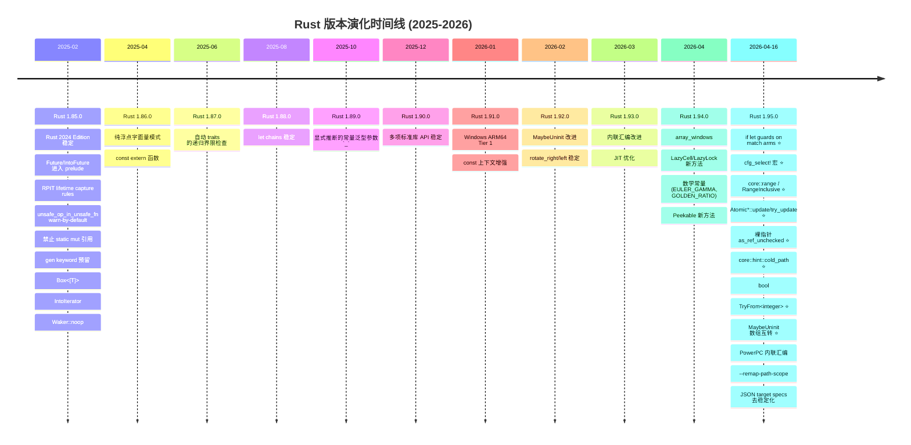
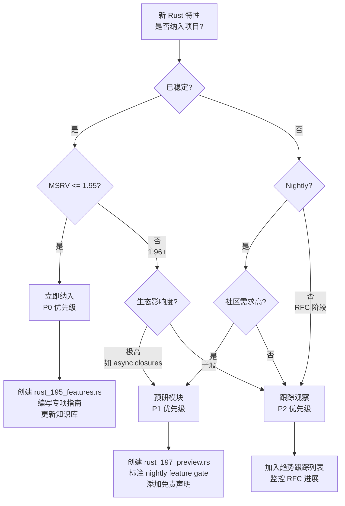
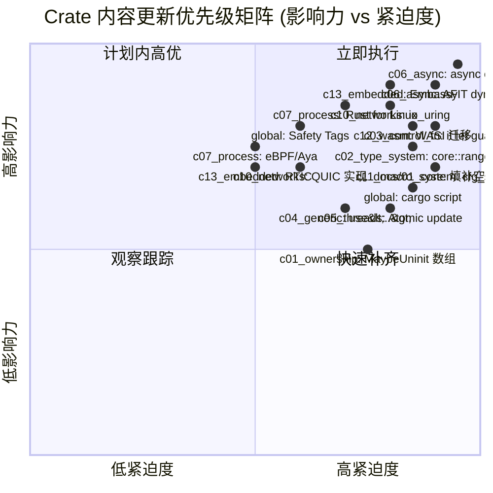
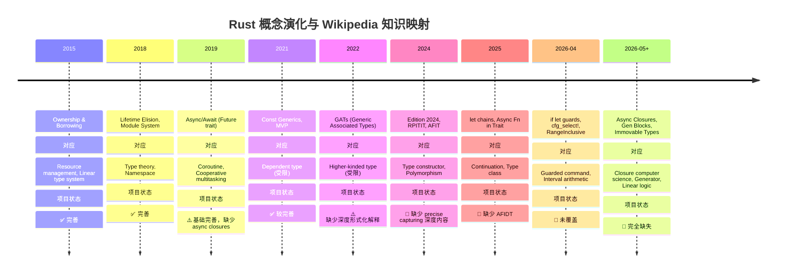
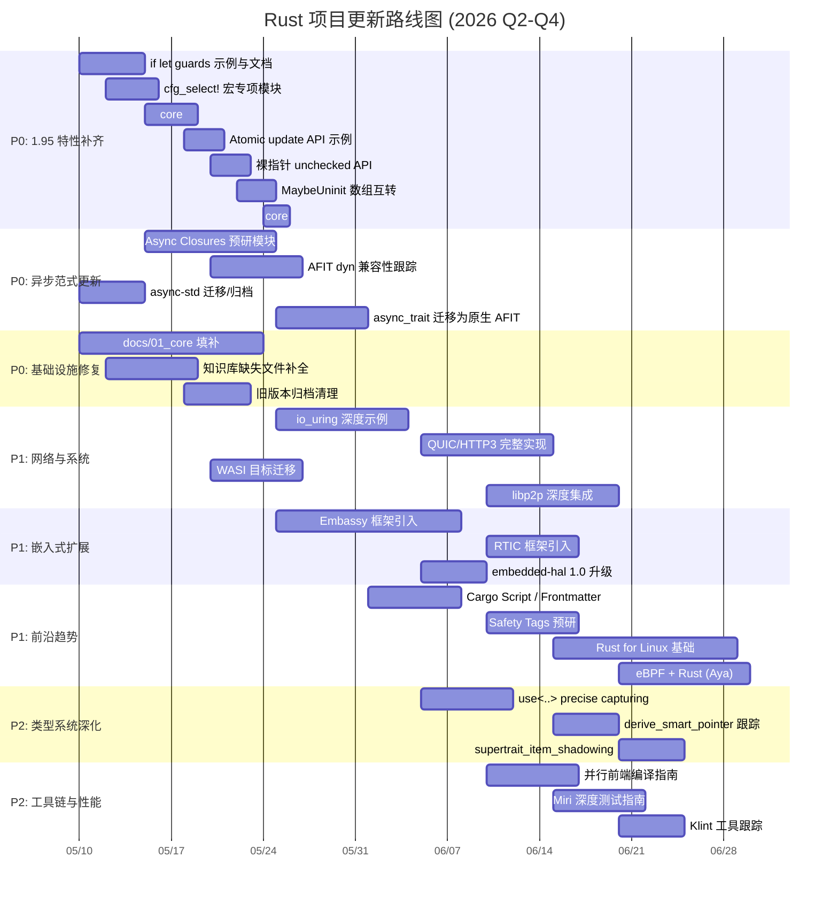

> **归档状态**: 📦 已归档
> **归档日期**: 2026-06-02
> **归档原因**: 历史审计报告归档
>
> ⚠️ 本文档为历史归档，内容可能已过时，请以项目最新活跃文档为准。
>
> ---
>
# Rust 1.95+ 演化趋势与项目对称差综合分析报告

> **分析日期**: 2026-05-07
> **Rust 稳定版**: 1.95.0 (2026-04-16)
> **Rust Beta**: 1.96.0 (2026-05-28 预计)
> **Rust Nightly**: 1.97.0 (2026-07-09 预计)
> **项目 Edition**: 2024
> **项目 MSRV**: 1.95.0
> **报告版本**: v1.0-draft

---

## 目录

- [Rust 1.95+ 演化趋势与项目对称差综合分析报告](#rust-195-演化趋势与项目对称差综合分析报告)
  - [目录](#目录)
  - [1. 执行摘要](#1-执行摘要)
    - [核心结论](#核心结论)
  - [2. Rust 版本演化时间线（2026年5月7日基准）](#2-rust-版本演化时间线2026年5月7日基准)
    - [2.1 已发布稳定版本关键特性](#21-已发布稳定版本关键特性)
    - [2.2 即将发布的关键特性（1.96.0 / 1.97.0 Nightly）](#22-即将发布的关键特性1960--1970-nightly)
  - [3. 项目现状审计](#3-项目现状审计)
    - [3.1 模块覆盖度矩阵](#31-模块覆盖度矩阵)
    - [3.2 文档与知识库审计](#32-文档与知识库审计)
  - [4. 对称差分析：项目 vs 生态前沿](#4-对称差分析项目-vs-生态前沿)
    - [4.1 对称差定义](#41-对称差定义)
    - [4.2 项目缺失内容（$A \\setminus B$）——按优先级排序](#42-项目缺失内容a-setminus-b按优先级排序)
      - [🔴 P0：关键语言特性（1.95.0 已稳定，必须补充）](#-p0关键语言特性1950-已稳定必须补充)
      - [🔴 P0：异步编程范式变革（1.96-1.97 预计稳定）](#-p0异步编程范式变革196-197-预计稳定)
      - [🟡 P1：并发与并行新特性](#-p1并发与并行新特性)
      - [🟡 P1：网络与 OS 编程](#-p1网络与-os-编程)
      - [🟡 P1：嵌入式与 no\_std](#-p1嵌入式与-no_std)
      - [🟢 P2：类型系统与设计模式](#-p2类型系统与设计模式)
      - [🟢 P2：工具链与开发者体验](#-p2工具链与开发者体验)
    - [4.3 项目冗余/过时内容（$B \\setminus A$）](#43-项目冗余过时内容b-setminus-a)
  - [5. 2026年趋势预测与论证](#5-2026年趋势预测与论证)
    - [5.1 语言演化趋势判断树](#51-语言演化趋势判断树)
    - [5.2 趋势论证矩阵](#52-趋势论证矩阵)
  - [6. 多维思维表征](#6-多维思维表征)
    - [6.1 特性成熟度决策树（是否纳入项目）](#61-特性成熟度决策树是否纳入项目)
    - [6.2 Crate 内容更新优先级矩阵](#62-crate-内容更新优先级矩阵)
    - [6.3 概念演化推理树：异步闭包](#63-概念演化推理树异步闭包)
  - [7. Wikipedia 概念对齐与属性关系](#7-wikipedia-概念对齐与属性关系)
    - [7.1 核心概念属性矩阵](#71-核心概念属性矩阵)
    - [7.2 概念演化时间线（Wikipedia 知识图谱视角）](#72-概念演化时间线wikipedia-知识图谱视角)
  - [8. 后续补充/修复/完善计划](#8-后续补充修复完善计划)
    - [8.1 执行路线图](#81-执行路线图)
    - [8.2 任务清单（可执行级）](#82-任务清单可执行级)
      - [🔴 第一阶段：1.95 特性全覆盖（2026-05-10 至 2026-05-25）](#-第一阶段195-特性全覆盖2026-05-10-至-2026-05-25)
      - [🔴 第二阶段：异步生态重构（2026-05-15 至 2026-06-05）](#-第二阶段异步生态重构2026-05-15-至-2026-06-05)
      - [🔴 第三阶段：基础设施修复（2026-05-10 至 2026-05-30）](#-第三阶段基础设施修复2026-05-10-至-2026-05-30)
      - [🟡 第四阶段：网络与系统深化（2026-05-25 至 2026-06-30）](#-第四阶段网络与系统深化2026-05-25-至-2026-06-30)
      - [🟡 第五阶段：嵌入式生态扩展（2026-05-25 至 2026-06-30）](#-第五阶段嵌入式生态扩展2026-05-25-至-2026-06-30)
      - [🟡 第六阶段：类型系统与工具链（2026-06-01 至 2026-06-30）](#-第六阶段类型系统与工具链2026-06-01-至-2026-06-30)
      - [🟢 第七阶段：长期跟踪与质量提升（持续）](#-第七阶段长期跟踪与质量提升持续)
  - [附录 A：Rust 1.95.0 完整 API 稳定清单（项目映射）](#附录-arust-1950-完整-api-稳定清单项目映射)
    - [A.1 标准库新稳定 API](#a1-标准库新稳定-api)
    - [A.2 const 上下文新稳定 API](#a2-const-上下文新稳定-api)
  - [附录 B：生态依赖版本审计建议](#附录-b生态依赖版本审计建议)

---

## 1. 执行摘要

本项目是一个覆盖 Rust 全栈知识的大型学习仓库（13+ crates，edition 2024，MSRV 1.95.0）。
截至 2026年5月7日，Rust 稳定版已演进至 **1.95.0**，Beta 通道为 **1.96.0**，Nightly 为 **1.97.0**。

### 核心结论

| 维度 | 状态 | 关键发现 |
|------|------|---------|
| **语言特性对齐** | ⚠️ 部分滞后 | 项目已升级到 1.95.0 MSRV，但大量 1.95 特性缺少专项示例和深度文档 |
| **异步生态** | ⚠️ 重大缺口 | 缺少 Async Closures (RFC 3668)、AFIT dyn 兼容、AsyncIterator 等前沿内容；async-std 已归档但项目仍保留其模块 |
| **并发/线程** | ⚠️ 中等缺口 | 缺少 `Atomic*::update`、`cfg_select!`、`thread::spawn` hook 等 1.95+ 特性 |
| **网络编程** | ⚠️ 中等缺口 | QUIC/io_uring 仅为占位；libp2p 依赖已添加但缺少深度集成示例；WASI 目标迁移未覆盖 |
| **嵌入式/Linux** | 🔴 显著缺口 | 缺少 Embassy/RTIC 框架、Rust for Linux 内核编程、eBPF+Rust、io_uring 深度实践 |
| **类型系统/设计模式** | ⚠️ 中等缺口 | 缺少 `use<..>` precise capturing、`derive_smart_pointer`、guard patterns 等 2024 edition 深层内容 |
| **工具链/生态** | ⚠️ 中等缺口 | 缺少 cargo script/frontmatter、Safety Tags、并行前端编译、Klint 等 2026 趋势性内容 |
| **文档完整性** | 🔴 显著缺口 | docs/01_core 完全为空；知识库自报完成度 55%；多个 README 引用不存在的文件 |

---

## 2. Rust 版本演化时间线（2026年5月7日基准）

### 2.1 已发布稳定版本关键特性



### 2.2 即将发布的关键特性（1.96.0 / 1.97.0 Nightly）

| 特性 | 预计版本 | 状态 | 项目影响度 |
|------|---------|------|-----------|
| **Async Closures** (RFC 3668) | 1.96-1.97 | FCP / 接近稳定 | 🔴 极高：改变异步闭包编写范式 |
| **Async fn in dyn trait** (AFIDT) | 1.97+ | Nightly 实验中 | 🔴 极高：使 async trait 支持动态分发 |
| **Cargo Script / Frontmatter** | 1.96 | FCP 已通过 | 🟡 高：改变脚本化 Rust 工作流程 |
| **`use<..>` precise capturing** | 已部分稳定 | 2024 Edition | 🟡 高：影响 RPIT 生命周期捕获 |
| **`supertrait_item_shadowing`** | 1.96 | FCP | 🟢 中：影响 trait 设计模式 |
| **`doc_cfg`** | 1.96+ | 等待稳定 | 🟢 中：影响文档生成 |
| **`VecDeque::truncate_front`** | 1.96 | FCP | 🟢 中：标准库 API 补充 |
| **`refcell_try_map`** | 1.97+ | 等待作者 | 🟢 中：RefCell 的 try_map |
| **Stack protector** | 1.97+ | 等待 review | 🟡 高：安全加固 |
| **Return type notation** (RFC 3654) | 1.97+ | 实验中 | 🟡 高：影响 async trait Send bound |
| **Thread spawn hook** (RFC 3642) | 1.97+ | 实验中 | 🟢 中：线程生命周期钩子 |
| **Gen blocks** (RFC 3513) | 1.98+ | Keyword 已预留 | 🟡 高：引入 generator 语义 |
| **Derive smart pointer** (RFC 3621) | 1.98+ | 等待实现 | 🟢 中：智能指针派生宏 |
| **Pattern types / Guard patterns** (RFC 3637) | 1.98+ | RFC 阶段 | 🟢 中：模式匹配增强 |
| **Arbitrary self types v2** (RFC 3519) | 1.98+ | 开发中 | 🟡 高：影响 Rust for Linux |
| **Immovable types / Pin 替代** | 1.99+ | 设计中 | 🔴 极高：可能取代 Pin |

---

## 3. 项目现状审计

### 3.1 模块覆盖度矩阵

| Crate | 主题 | 文件数 | 状态 | 最新版本追踪 |
|-------|------|--------|------|-------------|
| c01_ownership_borrow_scope | 所有权/借用/生命周期 | 中 | ✅ 较完善 | 1.94 |
| c02_type_system | 类型系统 | 多 | ✅ 较完善 | 1.94 |
| c03_control_fn | 控制流/函数 | 中 | ✅ 较完善 | 1.94 |
| c04_generic | 泛型/Trait | 中 | ⚠️ 部分 | 1.94 |
| c05_threads | 线程/并发 | 极多 | ⚠️ 部分 | 1.196 占位 |
| c06_async | 异步编程 | 极多 | ⚠️ 部分 | 1.196 占位 |
| c07_process | 进程/OS | 多 | ⚠️ 部分 | 1.194 |
| c08_algorithms | 算法 | 中 | ✅ 较完善 | 1.194 |
| c09_design_pattern | 设计模式 | 中 | ⚠️ 部分 | 1.194 |
| c10_networks | 网络编程 | 极多 | ⚠️ 部分 | 1.196 占位 |
| c11_macro_system | 宏系统 | 中 | ⚠️ 部分 | 1.194 |
| c12_wasm | WebAssembly | 少 | 🔴 薄弱 | 1.192 |
| c13_embedded | 嵌入式 | 中 | ⚠️ 部分 | 新增 bare-metal |
| common | 共享工具 | 少 | ✅ 完善 | 1.195 |

### 3.2 文档与知识库审计

| 区域 | 自报完成度 | 关键问题 |
|------|-----------|---------|
| `docs/01_core` | 0% | **完全为空** |
| `docs/02_reference` | 高 | 版本标注 1.95.0+，相对较新 |
| `docs/03_guides` | 中 | 缺少 1.95 特性专项指南 |
| `docs/04_research` | 中 | 形式化工程系统较完善 |
| `docs/05_guides` | 中 | 使用指南覆盖主要主题 |
| `docs/06_toolchain` | 中 | 缺少 cargo script、并行前端 |
| `knowledge/` | 72% | 02_intermediate/03_advanced 引用缺失文件 |
| `content/` | 55% | 场景单一（仅 Web），生产/学术覆盖不足 |
| `guides/` | 中 | 已更新至 1.95，但缺少前沿趋势分析 |

---

## 4. 对称差分析：项目 vs 生态前沿

### 4.1 对称差定义

> **对称差 (Symmetric Difference)**：集合论中，对称差 $A \Delta B = (A \setminus B) \cup (B \setminus A)$。在本报告中：
>
> - **$A$（项目缺失）**：Rust 生态已存在但本项目未覆盖的内容
> - **$B$（项目冗余/过时）**：本项目已包含但 Rust 生态已淘汰或变更的内容

### 4.2 项目缺失内容（$A \setminus B$）——按优先级排序

#### 🔴 P0：关键语言特性（1.95.0 已稳定，必须补充）

| 特性 | 影响 Crate | 缺失形式 | 生态状态 | 补充紧迫度 |
|------|-----------|---------|---------|-----------|
| `if let` guards on match arms | c03_control_fn, c05_threads, c06_async, c10_networks | 无专项示例，仅 rust_196_features.rs 有极简占位 | 1.95.0 稳定 | 🔴 极高 |
| `cfg_select!` 宏 | c11_macro_system, c13_embedded | **完全缺失** | 1.95.0 稳定 | 🔴 极高 |
| `core::range` / `RangeInclusive` / `RangeInclusiveIter` | c02_type_system, c08_algorithms | **完全缺失** | 1.95.0 稳定 (RFC 3550) | 🔴 极高 |
| `core::hint::cold_path` | c05_threads, c08_algorithms | **完全缺失** | 1.95.0 稳定 | 🟡 高 |
| 裸指针 `as_ref_unchecked` / `as_mut_unchecked` | c01_ownership, c13_embedded | **完全缺失** | 1.95.0 稳定 | 🟡 高 |
| `AtomicPtr::update` / `try_update` 等 | c05_threads | **完全缺失** | 1.95.0 稳定 | 🟡 高 |
| `bool: TryFrom<{integer}>` | c02_type_system | **完全缺失** | 1.95.0 稳定 | 🟢 中 |
| `MaybeUninit<[T; N]>` ↔ `[MaybeUninit<T>; N]` 互转 | c01_ownership, c05_threads | **完全缺失** | 1.95.0 稳定 | 🟡 高 |
| `Cell<[T; N]>` AsRef | c01_ownership | **完全缺失** | 1.95.0 稳定 | 🟢 中 |

#### 🔴 P0：异步编程范式变革（1.96-1.97 预计稳定）

| 特性 | 影响 Crate | 缺失形式 | 生态状态 | 补充紧迫度 |
|------|-----------|---------|---------|-----------|
| **Async Closures** (RFC 3668) | c06_async | **完全缺失** | 接近稳定 (FCP) | 🔴 极高 |
| **AsyncFn trait family** (`AsyncFn`/`AsyncFnMut`/`AsyncFnOnce`) | c06_async, c04_generic | **完全缺失** | Nightly (async_fn_traits) | 🔴 极高 |
| **Async fn in dyn trait** (AFIDT) | c06_async, c04_generic | **完全缺失** | Nightly (#133119) | 🔴 极高 |
| **Return type notation** (RTN) | c06_async, c04_generic | **完全缺失** | RFC 3654 | 🟡 高 |
| **`impl Future + Send` bound 表达** | c06_async | 缺少系统性讲解 | 1.75+ AFIT 痛点 | 🟡 高 |

#### 🟡 P1：并发与并行新特性

| 特性 | 影响 Crate | 缺失形式 | 生态状态 | 补充紧迫度 |
|------|-----------|---------|---------|-----------|
| `thread::spawn` hook (RFC 3642) | c05_threads | **完全缺失** | RFC 已接受 | 🟢 中 |
| `thread::scope` TLS 析构文档 | c05_threads | 缺少 TLS + scope 交互说明 | 1.95.0 文档更新 | 🟢 中 |
| `std::hint::cold_path` 并发优化 | c05_threads | **完全缺失** | 1.95.0 稳定 | 🟢 中 |

#### 🟡 P1：网络与 OS 编程

| 特性 | 影响 Crate | 缺失形式 | 生态状态 | 补充紧迫度 |
|------|-----------|---------|---------|-----------|
| **io_uring 深度实践** | c10_networks | 仅为 Linux feature 占位 | Linux 5.1+ 成熟 | 🔴 极高 |
| **QUIC/HTTP3 完整实现** | c10_networks | quinn 依赖仅为占位 | 生态成熟 (quinn/h3) | 🟡 高 |
| **libp2p 深度集成** | c10_networks | 依赖已添加但缺少示例 | 0.54.1 已集成 | 🟡 高 |
| **WASI 目标迁移** (wasm32-wasip1/p2) | c12_wasm | ✅ 已全量替换 wasm32-wasi | 1.84 已移除旧目标 | 🟢 已完成 |
| **Rust for Linux 内核编程** | c07_process, c13_embedded | **完全缺失** | 内核 6.1+ 实验 | 🔴 极高 |
| **eBPF + Rust** (Aya) | c07_process | **完全缺失** | 生态快速成熟 | 🟡 高 |
| **Windows ARM64 Tier 1** | c05_threads, c10_networks | 缺少平台特定优化说明 | 1.91.0 已 Tier 1 | 🟢 中 |

#### 🟡 P1：嵌入式与 no_std

| 特性 | 影响 Crate | 缺失形式 | 生态状态 | 补充紧迫度 |
|------|-----------|---------|---------|-----------|
| **Embassy 异步嵌入式框架** | c13_embedded, c06_async | **完全缺失** | stable Rust (MSRV 1.75) | 🔴 极高 |
| **RTIC 实时中断驱动并发** | c13_embedded | **完全缺失** | 1.0 已发布 | 🟡 高 |
| **esp-hal** | c13_embedded | **完全缺失** | 1.0.0-beta (2025-02) | 🟡 高 |
| **embedded-hal 1.0** | c13_embedded | 可能基于 0.2.x | 2024 年已稳定 | 🟡 高 |

#### 🟢 P2：类型系统与设计模式

| 特性 | 影响 Crate | 缺失形式 | 生态状态 | 补充紧迫度 |
|------|-----------|---------|---------|-----------|
| `use<..>` precise capturing (RFC 3617) | c02_type_system, c04_generic | 缺少深度教程 | 2024 Edition 已部分实现 | 🟡 高 |
| `derive_smart_pointer` (RFC 3621) | c04_generic, c09_design_pattern | **完全缺失** | RFC 已接受 | 🟢 中 |
| `supertrait_item_shadowing` | c04_generic | **完全缺失** | FCP 中 | 🟢 中 |
| Guard patterns (RFC 3637) | c03_control_fn | **完全缺失** | RFC 阶段 | 🟢 中 |
| Default field values (RFC 3681) | c02_type_system | **完全缺失** | 讨论中 | 🟢 低 |

#### 🟢 P2：工具链与开发者体验

| 特性 | 影响 Crate | 缺失形式 | 生态状态 | 补充紧迫度 |
|------|-----------|---------|---------|-----------|
| **Cargo Script / Frontmatter** | 全局 | **完全缺失** | FCP 已通过 (1.96) | 🟡 高 |
| **Safety Tags** (unsafe API 标注) | c01_ownership, c13_embedded | **完全缺失** | 2026 RFC 提交中 | 🟡 高 |
| **并行前端编译** (`-Z threads=N`) | docs/06_toolchain | 缺少深度指南 | Nightly 实验中 | 🟢 中 |
| **Miri 深度测试** | 全局 | 已有基础但缺少系统指南 | 持续演进 | 🟢 中 |
| **Klint** (Linux 内核 lint) | docs/06_toolchain | **完全缺失** | 2026 RFC 补丁 | 🟢 低 |

### 4.3 项目冗余/过时内容（$B \setminus A$）

| 内容 | 位置 | 问题 | 建议处理 |
|------|------|------|---------|
| **async-std 运行时示例** | c06_async/src/async_std/ | async-std 已于 **2025年3月停止维护** | 迁移至 Tokio/smoltcp 示例，添加弃用说明 |
| **旧 WASI 目标** | c12_wasm | `wasm32-wasi` 已于 **1.84.0 移除** | ✅ 已更新为 `wasm32-wasip1` / `wasm32-wasip2` |
| **`static mut` 引用示例** | 可能存在于 c05_threads, c13_embedded | 2024 Edition 已 **deny-by-default** | 审计并迁移至 `UnsafeCell` 或 `sync::atomic` |
| **旧版 `async_trait` 依赖** | c10_networks/src/protocol/async_traits.rs | Axum 0.8+ 已不需要；原生 AFIT 1.75+ 已稳定 | 更新为原生 async fn in trait，保留 `async_trait` 作为 dyn trait fallback |
| **Rust 1.90-1.92 归档文件** | crates/*/src/archive/ | 部分文件仍被引用；内容可能重复 | 清理重复，建立版本化归档策略 |
| **`unsafe_op_in_unsafe_fn` 旧代码** | 可能存在于多个 crates | 2024 Edition 默认 warn | 显式添加 `unsafe {}` 块 |

---

## 5. 2026年趋势预测与论证

### 5.1 语言演化趋势判断树

```mermaid
graph TD
    A[2026 Rust 语言演化] --> B[异步编程成熟化]
    A --> C[系统编程深化]
    A --> D[开发者体验优化]
    A --> E[安全加固]

    B --> B1[Async Closures 稳定<br/>1.96-1.97]
    B --> B2[AFIDT  nightly → 稳定<br/>1.97-1.98]
    B --> B3[Gen Blocks / Generators<br/>1.98-1.99]
    B --> B4[AsyncIterator 标准化<br/>1.97+]

    C --> C1[Rust for Linux 生产化<br/>内核 6.12+]
    C --> C2[Immovable Types / Pin 替代<br/>1.99+]
    C --> C3[Arbitrary Self Types v2<br/>1.98+]
    C --> C4[Field Projections<br/>1.99+]

    D --> D1[Cargo Script 稳定<br/>1.96]
    D --> D2[并行前端编译<br/>1.97+]
    D --> D3[Style Editions 独立<br/>已稳定]
    D --> D4[rustdoc --output-format=doctest<br/>1.97+]

    E --> E1[Safety Tags 生态<br/>2026 RFC]
    E --> E2[Orphan Rules 放松<br/>1.98+]
    E --> E3[Stack Protector<br/>1.97+]
    E --> E4[JSON Target Specs 重新设计<br/>1.97+]
```



### 5.2 趋势论证矩阵

| 趋势 | 证据链 | 置信度 | 对本项目影响 |
|------|--------|--------|-------------|
| Async Closures 2026年内稳定 | RFC 3668 已接受；实现已在 nightly；FCP 流程中 | **95%** | 需要重构大量异步闭包示例 |
| AFIDT (dyn async trait) 2026-2027 | 跟踪 issue #133119；设计文档完善；社区需求极高 | **80%** | 可移除 `async_trait` 宏的多数使用场景 |
| Rust for Linux 生产部署 | Debian 14 (Forky) 2027年夏将包含 Rust 工具链；Google/Meta 持续投入 | **90%** | 需要新增内核编程 crate 或章节 |
| Immovable Types 取代 Pin | 设计讨论活跃；Rust for Linux 强烈需求；但改动极大 | **60%** | 长期规划，短期关注 RFC 进展 |
| Cargo Script 改变入门路径 | Frontmatter 已通过 FCP；cargo script 在 FCP；Ed Page 主导 | **95%** | 需要新增脚本化 Rust 教程 |
| Safety Tags 成为事实标准 | RFC 已提交；Rust-for-Linux/Bevy 已表示兴趣；>50 commits, 170 comments | **70%** | 需要更新 unsafe 指南，添加 Safety Tags 示例 |
| Tokio 生态进一步集中 | async-std 已归档；smol 作为轻量替代；Axum 0.8+ 原生 async | **95%** | 清理 async-std 内容，强化 Tokio 深度 |
| Embassy 主导嵌入式异步 | 1400+ STM32 HALs；Nordic/RP 支持；stable Rust 运行 | **90%** | 需要大幅扩展 c13_embedded 异步内容 |
| 并行前端缩短编译时间 | `-Z threads=N` 持续改进；nightly 可用；计划稳定 | **85%** | 需要更新构建优化指南 |
| WASIp2 成为 WASM 服务端标准 | wasm32-wasi 已移除；WASIp1 Tier 2；WASIp2 Tier 3；组件模型推进 | **100%** | ✅ c12_wasm 目标体系已重构 |

---

## 6. 多维思维表征

### 6.1 特性成熟度决策树（是否纳入项目）



### 6.2 Crate 内容更新优先级矩阵



### 6.3 概念演化推理树：异步闭包

```mermaid
graph TD
    AC[Async Closures<br/>RFC 3668] --> AC1[问题域]
    AC --> AC2[解决方案]
    AC --> AC3[影响面]
    AC --> AC4[反例/限制]

    AC1 --> AC1a[旧范式: `\|x\| async move { ... }`<br/>返回 opaque Future 类型]
    AC1 --> AC1b[问题: 无法表达 borrow-from-capture 的 Future<br/>lifetime 推断失败]
    AC1 --> AC1c[问题: `Fn() -> impl Future` 不是真实 async closure<br/>Send bound 难以表达]

    AC2 --> AC2a[新 traits: `AsyncFn` / `AsyncFnMut` / `AsyncFnOnce`]
    AC2 --> AC2b[关联类型: `CallRefFuture`, `CallOnceFuture`]
    AC2 --> AC2c[语法糖: `async \|x\| { ... }`]
    AC2 --> AC2d[自动实现: 所有 `async fn` 和返回 Future 的函数]

    AC3 --> AC3a[迭代器适配器: `filter(async \|x\| ...)`<br/>`map(async \|x\| ...)`]
    AC3 --> AC3b[中间件模式: HTTP 处理链]
    AC3 --> AC3c[事件处理: GUI 回调、游戏脚本]
    AC3 --> AC3d[函数式异步: `for_each`/`filter` 接受 async closures]

    AC4 --> AC4a[**不兼容 dyn**: `AsyncFn` 不是 dyn-compatible]
    AC4 --> AC4b[返回类型非 `impl Future` 而是 opaque `AsyncFn` 关联类型]
    AC4 --> AC4c[与 `Fn() -> impl Future` 的互操作需要适配]
    AC4 --> AC4d[发送性约束: `AsyncFn() -> impl Future + Send` 表达复杂]
```

---

## 7. Wikipedia 概念对齐与属性关系

### 7.1 核心概念属性矩阵

| 概念 (Concept) | Wikipedia 定义 | Rust 1.95 属性 | 项目覆盖状态 | 关系/示例 | 反例 |
|---------------|---------------|---------------|-------------|----------|------|
| **Ownership** | 资源唯一所有者，离开作用域时释放 | `Drop`, move semantics, borrow checker | ✅ 完善 | `String` 赋值后原变量失效 | `Rc<T>` 打破唯一性（共享所有权） |
| **Borrowing** | 临时不可变/可变引用，不转移所有权 | `&T`, `&mut T`, lifetime `'a` | ✅ 完善 | 函数参数传递引用 | 悬垂指针（编译期拒绝） |
| **Lifetime** | 引用有效的代码区域 | 隐式/显式 `'a`，lifetime elision | ✅ 完善 | `&'a str` | `static` 与局部生命周期混淆 |
| **Async/Await** | 协作式多任务语法糖 | `Future`, `Pin`, `.await`, executor | ⚠️ 缺少 async closures | `tokio::spawn` | 阻塞操作在 async 中（`std::sync::Mutex`） |
| **Dyn Compatibility** | Trait 对象可构造性 | vtable 生成规则，RPIT 限制 | 🔴 未覆盖 AFIDT | `dyn Iterator` | `dyn Trait` where `Trait` has `async fn` |
| **Memory Safety** | 无 UAF/双重释放/缓冲区溢出 | Ownership + Borrowing + Lifetimes | ✅ 完善 | Vec 索引边界检查 | `unsafe` 块中的裸指针操作 |
| **Zero-Cost Abstraction** | 高级特性不引入运行时开销 | 迭代器、泛型、async 状态机 | ✅ 较完善 | `map/filter` 链优化为循环 | `Box<dyn Future>` 有分配开销 |
| **Macro** | 语法扩展元编程 | `macro_rules!`, proc macro | ⚠️ 缺少声明式属性/派生宏 | `vec![]` | 过度使用宏导致编译时间膨胀 |
| **Inline Assembly** | 直接嵌入机器指令 | `asm!`, `naked_asm!`, `global_asm!` | ⚠️ 仅基础覆盖 | `asm!("nop")` | 非对齐内存访问导致 UB |
| **Conditional Compilation** | 根据条件编译不同代码 | `cfg!`, `#[cfg]`, `cfg_select!` (1.95) | 🔴 缺少 `cfg_select!` | `#[cfg(target_os = "linux")]` | `cfg_select!` 替代嵌套 `cfg` |
| **Pattern Matching** | 解构数据并绑定变量 | `match`, `if let`, `while let`, guards (1.95) | ⚠️ 缺少 guards | `if let Some(x) = opt` | `if let` guards 前的冗长嵌套 |
| **Range Type** | 表示区间/范围的数学概念 | `core::ops::Range`, `core::range::RangeInclusive` (1.95) | 🔴 未覆盖新类型 | `0..10` | 旧 `RangeInclusive` 为结构体非模块 |
| **Smart Pointer** | 行为类似指针但附加元数据 | `Box`, `Rc`, `Arc`, `Pin` | ⚠️ 缺少 derive_smart_pointer | `Box::new(5)` | 循环引用导致内存泄漏（`Weak` 解决） |
| **Coroutine/Generator** | 可暂停/恢复的计算 | `Future`（异步），预留 `gen` keyword | ⚠️ 仅 Future | `async fn` 状态机 | `gen {}` blocks 尚未稳定 |
| **Type State** | 将状态编码到类型中 | 泛型 + `PhantomData` | ✅ c13_embedded 有示例 | `Spi<Initialized>` vs `Spi<Uninitialized>` | 运行时状态检查（冗余且易错） |
| **No-std** | 不使用标准库的运行环境 | `core`, `alloc`, `#[no_std]` | ⚠️ 基础覆盖 | 嵌入式固件 | 误用 `std` 类型导致编译失败 |
| **Formal Verification** | 数学上证明程序正确性 | Miri, Kani, Prusti, TLA+ | ⚠️ 提及但缺少教程 | Miri 检测数据竞争 | 仅靠单元测试覆盖并发状态空间 |

### 7.2 概念演化时间线（Wikipedia 知识图谱视角）



---

## 8. 后续补充/修复/完善计划

### 8.1 执行路线图



### 8.2 任务清单（可执行级）

#### 🔴 第一阶段：1.95 特性全覆盖（2026-05-10 至 2026-05-25）

- [ ] **T1.1** `c03_control_fn/src/rust_195_features.rs`: 创建 `if let` guards 完整示例集（线程优先级解析、异步任务评估、网络状态机、错误处理扁平化）
- [ ] **T1.2** `c11_macro_system/src/rust_195_features.rs`: 创建 `cfg_select!` 宏使用示例（跨平台特性选择、条件编译优化、替代冗长 `cfg` 嵌套）
- [ ] **T1.3** `c02_type_system/src/rust_195_features.rs`: 创建 `core::range` / `RangeInclusive` / `RangeInclusiveIter` 专题（区间算法、迭代器适配、与旧 Range 的对比迁移）
- [ ] **T1.4** `c05_threads/src/rust_195_features.rs`: 创建 `Atomic*::update` / `try_update` 示例（无锁计数器、CAS 循环简化、并发状态机）
- [ ] **T1.5** `c13_embedded/src/rust_195_features.rs`: 创建裸指针 `as_ref_unchecked` / `as_mut_unchecked` 示例（MMIO 寄存器访问、性能关键路径、与 `addr_of!` 对比）
- [ ] **T1.6** `c01_ownership_borrow_scope/src/rust_195_features.rs`: 创建 `MaybeUninit<[T; N]>` ↔ `[MaybeUninit<T>; N]` 互转示例（安全数组初始化、并发缓冲区、与 `array::map` 对比）
- [ ] **T1.7** `c05_threads/src/rust_195_features.rs`: 创建 `core::hint::cold_path` 示例（错误路径优化、panic 分支提示、与 `unlikely` 对比）
- [ ] **T1.8** `c02_type_system/src/rust_195_features.rs`: 创建 `bool: TryFrom<{integer}>` 示例（配置解析、协议解码、与 `!= 0` 惯用法对比）
- [ ] **T1.9** `c05_threads/src/rust_195_features.rs`: 创建 `thread::scope` TLS 析构函数交互文档和示例
- [ ] **T1.10** 更新所有 crate 的 `lib.rs` 文档头：确认 Rust 版本标注为 1.95.0

#### 🔴 第二阶段：异步生态重构（2026-05-15 至 2026-06-05）

- [ ] **T2.1** `c06_async/src/async_closures_preview.rs`: 创建 Async Closures 预研模块（`AsyncFn` trait family、`async || {}` 语法、与旧闭包对比、中间件模式、迭代器适配）
- [ ] **T2.2** `c06_async/src/afit_dyn_tracking.rs`: 创建 AFIDT 跟踪模块（`#![feature(async_fn_in_dyn_trait)]`、workaround 对比、`async_trait` crate 的演进）
- [ ] **T2.3** `c06_async/src/async_std/`: 添加 **弃用说明**，将示例迁移到 Tokio 等价实现，或移至 `archive/async_std_deprecated/`
- [ ] **T2.4** `c10_networks/src/protocol/async_traits.rs`: 将 `#[async_trait]` 使用迁移为原生 `async fn in trait`，保留 `async_trait` 作为 `dyn Trait` fallback 的注释说明
- [ ] **T2.5** `c06_async/docs/ASYNC_CLOSURES_GUIDE.md`: 撰写 Async Closures 深度指南（概念定义、属性关系、Wikipedia 映射、示例/反例、决策树）
- [ ] **T2.6** `c06_async/src/rust_195_features.rs`: 创建 `if let` guards 在异步流处理中的应用示例

#### 🔴 第三阶段：基础设施修复（2026-05-10 至 2026-05-30）

- [ ] **T3.1** `docs/01_core/`: 填补完全空白的核心概念文档（所有权、借用、生命周期、类型系统基础）
- [ ] **T3.2** 修复 `knowledge/02_intermediate/` 和 `knowledge/03_advanced/` README 中引用的缺失文件
- [ ] **T3.3** 建立归档策略：将 `crates/*/src/archive/rust_190_features.rs` 等旧文件统一迁移到 `archive/2025/` 并保留只读入口
- [ ] **T3.4** 全局审计 `static mut` 使用：搜索并迁移所有 `static mut` 引用到 `UnsafeCell` 或原子类型（2024 Edition 兼容性）
- [ ] **T3.5** 全局审计 `unsafe_op_in_unsafe_fn`：在 `unsafe fn` 中显式包裹 `unsafe {}` 块

#### 🟡 第四阶段：网络与系统深化（2026-05-25 至 2026-06-30）

- [ ] **T4.1** `c10_networks/src/io_uring_demo.rs`: 从占位实现升级为完整示例（基于 `io-uring` crate，文件 I/O、网络 I/O、与 epoll 性能对比）
- [ ] **T4.2** `c10_networks/src/http3_quic.rs`: 实现完整 QUIC 客户端/服务器示例（基于 `quinn` + `rustls`，0-RTT、连接迁移、多流复用）
- [ ] **T4.3** `c12_wasm/`: 更新 WASM 目标体系（`wasm32-wasip1` / `wasm32-wasip2`，组件模型，`wasm-bindgen` 新维护者实践）
- [ ] **T4.4** `c10_networks/src/p2p/`: 实现 libp2p 完整示例（节点发现、DHT、PubSub、NAT 穿透）
- [ ] **T4.5** `c07_process/src/rust_for_linux_preview.rs`: 创建 Rust for Linux 预研模块（no_std 内核编程、kernel crate、模块示例、与 C 绑定）
- [ ] **T4.6** `c07_process/src/ebpf_aya.rs`: 创建 eBPF + Rust (Aya) 示例（XDP、tracepoint、BPF map）

#### 🟡 第五阶段：嵌入式生态扩展（2026-05-25 至 2026-06-30）

- [ ] **T5.1** `c13_embedded/src/embassy_framework.rs`: 引入 Embassy 异步嵌入式框架（async/await on bare metal、executor、HAL 抽象）
- [ ] **T5.2** `c13_embedded/src/rtic_framework.rs`: 引入 RTIC 框架（实时中断驱动并发、资源模型、任务调度）
- [ ] **T5.3** `c13_embedded/Cargo.toml`: 升级 embedded-hal 到 1.0，添加 esp-hal 依赖
- [ ] **T5.4** `c13_embedded/docs/EMBEDDED_ASYNC_GUIDE.md`: 撰写异步嵌入式编程指南（Embassy vs RTIC vs 裸机轮询）

#### 🟡 第六阶段：类型系统与工具链（2026-06-01 至 2026-06-30）

- [ ] **T6.1** `c02_type_system/src/precise_capturing_guide.rs`: 创建 `use<..>` precise capturing 深度指南（RPIT lifetime capture、迁移策略、与 2021 edition 对比）
- [ ] **T6.2** `docs/06_toolchain/cargo_script_guide.md`: 创建 Cargo Script / Frontmatter 指南（单文件脚本、shebang、依赖声明、与 Python 脚本对比）
- [ ] **T6.3** `docs/05_guides/SAFETY_TAGS_GUIDE.md`: 创建 Safety Tags 预研指南（unsafe API 标注、Safety Tags RFC 概念、Clippy 扩展、标准库实践）
- [ ] **T6.4** `docs/06_toolchain/parallel_frontend.md`: 创建并行前端编译指南（`-Z threads=N`、编译时间优化、与 `sccache` 协同）
- [ ] **T6.5** `c04_generic/src/derive_smart_pointer_tracking.rs`: 跟踪 `derive_smart_pointer` (RFC 3621) 进展，创建概念验证模块

#### 🟢 第七阶段：长期跟踪与质量提升（持续）

- [ ] **T7.1** 建立 **Rust 特性跟踪看板**：每月更新一次稳定版/nightly 特性矩阵
- [ ] **T7.2** 建立 **对称差自动化审计脚本**：扫描 crates 中缺失的 `#[stable(since = "1.9x.0")]` API
- [ ] **T7.3** 完善 `content/scenarios/`：添加非 Web 场景（物联网、区块链、游戏、AI 推理）
- [ ] **T7.4** 完善 `content/production/`：添加 CI/CD、监控、可观测性、混沌工程内容
- [ ] **T7.5** 更新 `guides/AI_ASSISTED_RUST_PROGRAMMING_GUIDE_2025.md` 至 2026 版本，添加 1.95+ 特性的 AI 辅助提示词模板

---

## 附录 A：Rust 1.95.0 完整 API 稳定清单（项目映射）

### A.1 标准库新稳定 API

| API | 模块 | 项目覆盖 | 建议位置 |
|-----|------|---------|---------|
| `MaybeUninit<[T; N]>: From<[MaybeUninit<T>; N]>` | `core::mem` | ❌ 缺失 | `c01_ownership/src/rust_195_features.rs` |
| `MaybeUninit<[T; N]>: AsRef<[MaybeUninit<T>; N]>` | `core::mem` | ❌ 缺失 | `c01_ownership/src/rust_195_features.rs` |
| `MaybeUninit<[T; N]>: AsRef<[MaybeUninit<T>]>` | `core::mem` | ❌ 缺失 | `c01_ownership/src/rust_195_features.rs` |
| `MaybeUninit<[T; N]>: AsMut<[MaybeUninit<T>; N]>` | `core::mem` | ❌ 缺失 | `c01_ownership/src/rust_195_features.rs` |
| `MaybeUninit<[T; N]>: AsMut<[MaybeUninit<T>]>` | `core::mem` | ❌ 缺失 | `c01_ownership/src/rust_195_features.rs` |
| `[MaybeUninit<T>; N]: From<MaybeUninit<[T; N]>>` | `core::mem` | ❌ 缺失 | `c01_ownership/src/rust_195_features.rs` |
| `Cell<[T; N]>: AsRef<[Cell<T>; N]>` | `core::cell` | ❌ 缺失 | `c01_ownership/src/rust_195_features.rs` |
| `Cell<[T; N]>: AsRef<[Cell<T>]>` | `core::cell` | ❌ 缺失 | `c01_ownership/src/rust_195_features.rs` |
| `Cell<[T]>: AsRef<[Cell<T>]>` | `core::cell` | ❌ 缺失 | `c01_ownership/src/rust_195_features.rs` |
| `bool: TryFrom<{integer}>` | `core::convert` | ❌ 缺失 | `c02_type_system/src/rust_195_features.rs` |
| `AtomicPtr::update` | `core::sync::atomic` | ❌ 缺失 | `c05_threads/src/rust_195_features.rs` |
| `AtomicPtr::try_update` | `core::sync::atomic` | ❌ 缺失 | `c05_threads/src/rust_195_features.rs` |
| `AtomicBool::update` | `core::sync::atomic` | ❌ 缺失 | `c05_threads/src/rust_195_features.rs` |
| `AtomicBool::try_update` | `core::sync::atomic` | ❌ 缺失 | `c05_threads/src/rust_195_features.rs` |
| `AtomicIn::update` | `core::sync::atomic` | ❌ 缺失 | `c05_threads/src/rust_195_features.rs` |
| `AtomicIn::try_update` | `core::sync::atomic` | ❌ 缺失 | `c05_threads/src/rust_195_features.rs` |
| `AtomicUn::update` | `core::sync::atomic` | ❌ 缺失 | `c05_threads/src/rust_195_features.rs` |
| `AtomicUn::try_update` | `core::sync::atomic` | ❌ 缺失 | `c05_threads/src/rust_195_features.rs` |
| `cfg_select!` | `core::macros` | ❌ 缺失 | `c11_macro_system/src/rust_195_features.rs` |
| `core::range::RangeInclusive` | `core::range` | ❌ 缺失 | `c02_type_system/src/rust_195_features.rs` |
| `core::range::RangeInclusiveIter` | `core::range` | ❌ 缺失 | `c02_type_system/src/rust_195_features.rs` |
| `core::hint::cold_path` | `core::hint` | ❌ 缺失 | `c05_threads/src/rust_195_features.rs` |
| `<*const T>::as_ref_unchecked` | `core::ptr` | ❌ 缺失 | `c13_embedded/src/rust_195_features.rs` |
| `<*mut T>::as_ref_unchecked` | `core::ptr` | ❌ 缺失 | `c13_embedded/src/rust_195_features.rs` |
| `<*mut T>::as_mut_unchecked` | `core::ptr` | ❌ 缺失 | `c13_embedded/src/rust_195_features.rs` |

### A.2 const 上下文新稳定 API

| API | 模块 | 项目覆盖 | 建议位置 |
|-----|------|---------|---------|
| `fmt::from_fn` (const) | `core::fmt` | ❌ 缺失 | `c02_type_system/src/rust_195_features.rs` |
| `ControlFlow::is_break` (const) | `core::ops` | ❌ 缺失 | `c03_control_fn/src/rust_195_features.rs` |
| `ControlFlow::is_continue` (const) | `core::ops` | ❌ 缺失 | `c03_control_fn/src/rust_195_features.rs` |

---

## 附录 B：生态依赖版本审计建议

基于 `Cargo.toml` 工作区依赖分析：

| 依赖 | 当前版本 | 最新可用 | 建议 | 阻塞原因 |
|------|---------|---------|------|---------|
| `libp2p` | 0.54.1 | 0.56+ | 跟踪升级 | hickory-resolver 0.26 API 变更 |
| `hickory-resolver` | 0.25.2 | 0.26.0 | 适配后升级 | c10_networks DNS 模块需重写 |
| `sea-orm` | 2.0.0-rc.18 | 2.0.0 stable | 等待正式版 |  SeaORM 尚未发布 stable |
| `bincode` | =2.0.1 | 3.0.0 | 谨慎评估 | 3.0.0 API 不兼容 |
| `backoff` | 0.4.0 | - | **替换** | RUSTSEC-2025-0012 unmaintained |
| `burn` / `burn-ndarray` | 禁用 | 0.10+ | 评估兼容性 | 与 tch 版本冲突 |
| `rustls` | 0.23.40 | 0.24+ | 跟踪 | ring 特性废弃，需迁移 aws-lc-rs |
| `clap` | 4.5.61 | 4.6.x | 锁定 | tokio-console/criterion 传递依赖锁定 |
| `nom` | 8.0.0 | 8.0.0 | ✅ 已最新 | - |
| `rand` | 0.10.1 | 0.10.1 | ✅ 已最新 | - |
| `sha2` | 0.11.0 | 0.11.0 | ✅ 已最新 | - |

---

> **免责声明**: 本报告中关于 Rust 未来版本（1.96.0+）的预测基于 2026年5月7日可公开获取的 RFC、跟踪 issue、FCP 状态和官方博客信息。实际稳定化时间表可能因技术或流程原因调整。建议每月复核一次。
