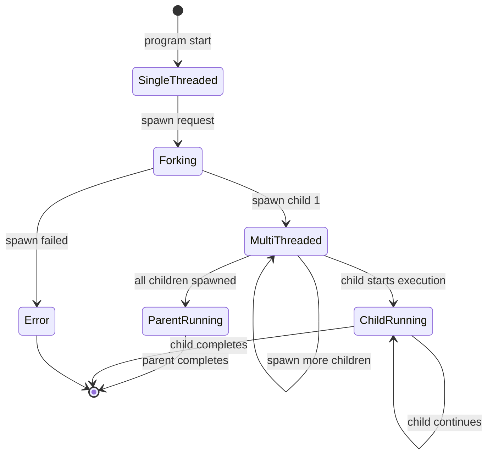
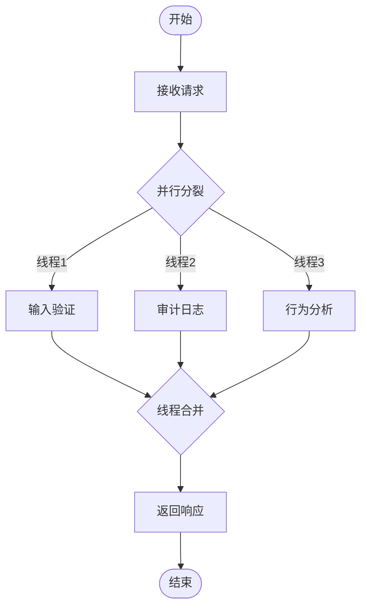
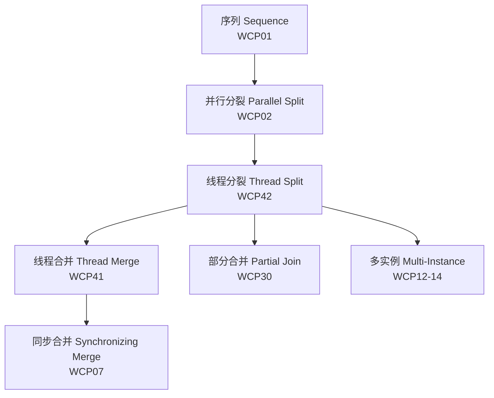

> **⚠️ 历史文档提示**：本文档包含 `async-std`、`wasm32-wasi` 等已归档或已重命名的生态引用。
> 其中技术观点反映了对应时间点的社区状态，可能与当前（Rust 1.96+）推荐实践不一致。
> 学习时请以 `concept/`、`knowledge/` 及官方文档为准。
>
> - `async-std` 已进入维护模式，新项目建议优先考虑 Tokio / smol。
> - `wasm32-wasi` 已重命名为 `wasm32-wasip1`；WASI Preview 2 目标为 `wasm32-wasip2`。

---

# 42 线程分裂模式 (Thread Split) - 完整形式化语义

> **内容分级**: [归档级]
>
> **分级**: [C]
> **Bloom 层级**: L5-L6 (分析/评价/创造)

## 目录
>
> **来源: [Rust Reference](https://doc.rust-lang.org/reference/)** · **来源: [TRPL Ch. 16 - Concurrency](https://doc.rust-lang.org/book/ch16-00-concurrency.html)** · **来源: [Rust Standard Library - std::thread](https://doc.rust-lang.org/std/thread/)** · **来源: Tokio Docs - docs.rs / [tokio](https://tokio.rs/)** · **来源: rayon - docs.rs / [rayon](https://docs.rs/rayon/latest/rayon/)** · **来源: crossbeam - docs.rs / [crossbeam](https://docs.rs/crossbeam/latest/crossbeam/)**

- [42 线程分裂模式 (Thread Split) - 完整形式化语义](#42-线程分裂模式-thread-split---完整形式化语义)
  - [目录](#目录)
  - [1. 引言](#1-引言)
    - [1.1 历史背景](#11-历史背景)
    - [1.2 动机与应用场景](#12-动机与应用场景)
  - [2. 模式定义与语义](#2-模式定义与语义)
    - [2.1 概念定义](#21-概念定义)
    - [2.2 核心语义](#22-核心语义)
    - [2.3 形式化表示](#23-形式化表示)
      - [2.3.1 状态机表示](#231-状态机表示)
      - [2.3.2 流程代数表示 (CSP 风格)](#232-流程代数表示-csp-风格)
      - [2.3.3 Petri 网表示](#233-petri-网表示)
  - [3. BPMN 与标准规范](#3-bpmn-与标准规范)
    - [3.1 BPMN 表示](#31-bpmn-表示)
    - [3.2 UML 活动图](#32-uml-活动图)
    - [3.3 WfMC 标准](#33-wfmc-标准)
  - [4. 进程代数形式化](#4-进程代数形式化)
    - [4.1 CCS 表示](#41-ccs-表示)
    - [4.2 CSP 表示](#42-csp-表示)
    - [4.3 π-演算表示](#43-π-演算表示)
  - [5. Rust 实现](#5-rust-实现)
    - [5.1 基础实现：thread::spawn](#51-基础实现threadspawn)
    - [5.2 高级实现：tokio::spawn 与异步任务分裂](#52-高级实现tokiospawn-与异步任务分裂)
    - [5.3 rayon::spawn 与作用域线程 crossbeam](#53-rayonspawn-与作用域线程-crossbeam)
  - [6. 正确性证明](#6-正确性证明)
    - [6.1 活性 (Liveness)](#61-活性-liveness)
    - [6.2 安全性 (Safety)](#62-安全性-safety)
    - [6.3 正确性条件](#63-正确性条件)
  - [7. 与其他模式的关系](#7-与其他模式的关系)
    - [7.1 模式层次](#71-模式层次)
    - [7.2 形式化关系](#72-形式化关系)
    - [7.3 与并行模式的配合](#73-与并行模式的配合)
  - [8. 应用场景与案例](#8-应用场景与案例)
    - [8.1 用户请求并行处理：验证、日志、分析](#81-用户请求并行处理验证日志分析)
    - [8.2 MapReduce 风格数据并行](#82-mapreduce-风格数据并行)
    - [8.3 微服务并行初始化](#83-微服务并行初始化)
  - [9. 变体与扩展](#9-变体与扩展)
    - [9.1 条件线程分裂](#91-条件线程分裂)
    - [9.2 动态线程池分裂](#92-动态线程池分裂)
    - [9.3 嵌套线程分裂](#93-嵌套线程分裂)
  - [10. 总结](#10-总结)
  - [参考文献](#参考文献)
<a id="最后更新-2026-05-22"></a>
  - [**最后更新**: 2026-05-22](#最后更新-2026-05-22)
  - [权威来源索引](#权威来源索引)

---

## 1. 引言
>
> **来源: [Rust Reference](https://doc.rust-lang.org/reference/)** · **来源: [TRPL Ch. 16 - Concurrency](https://doc.rust-lang.org/book/ch16-00-concurrency.html)** · **来源: [Rust Standard Library - std::thread](https://doc.rust-lang.org/std/thread/)**

线程分裂模式（Thread Split）是工作流控制流模式中的核心并发模式，描述了单一执行线程分化为多个独立线程并并行执行的语义。与抽象的并行分裂（Parallel Split, WCP02）不同，线程分裂明确关注**线程级**实体的创建——包括操作系统线程、绿色线程（green threads）和异步任务——以及数据所有权在这些实体间的安全分布。

在 Rust 中，线程分裂不仅是调用 `thread::spawn` 的语法操作，更是所有权系统的核心交互场景：父线程必须将数据的所有权通过 `move` 闭包显式转移给子线程，编译器在编译期验证这一转移的合法性，确保不存在悬垂引用或数据竞争。Rust 提供了多层次的线程分裂机制：`std::thread::spawn` 创建独立 OS 线程，`tokio::spawn` 生成异步任务，`rayon::spawn` 进入工作窃取线程池，`crossbeam::scope` 则提供了受限生命周期的作用域线程。

### 1.1 历史背景
>
> **来源: [Rust Standard Library - std::thread](https://doc.rust-lang.org/std/thread/)** · **[来源: POSIX Threads Specification]** · **[来源: Flynn 1972 - Computer Architecture]**

线程分裂的概念源于操作系统进程/线程模型。POSIX `pthread_create`（1995 年标准化）奠定了现代线程分裂的 API 形态：调用线程继续执行，新线程从指定入口函数开始独立执行。在计算机架构层面，Flynn 分类法（1972）将多指令流多数据流（MIMD）定义为线程级并行的硬件基础。

在程序设计语言理论中，线程分裂对应于**并行组合**（Parallel Composition）的引入：

- Hoare 在 CSP (1978) 中定义为 $P \;||\; Q$
- Milner 在 CCS (1989) 中定义为 $P \mid Q$
- van der Aalst 在 Workflow Patterns (2003) 中将其归类为 Parallel Split (WCP02)

Rust 的线程分裂设计在安全保障方面具有开创性：

- 闭包必须显式 `move` 捕获变量，所有权转移清晰可见
- `Send` trait 保证跨线程传递安全，`Sync` trait 保证共享引用安全
- 编译器拒绝包含悬垂引用的闭包，消除 use-after-free 风险

> **来源: [Rustonomicon - Concurrency](https://doc.rust-lang.org/nomicon/concurrency.html)** · **来源: [RFC 458 - Send/Sync traits](https://github.com/rust-lang/rfcs/pull/458)**

### 1.2 动机与应用场景
>
> **来源: [TRPL Ch. 16 - Concurrency](https://doc.rust-lang.org/book/ch16-00-concurrency.html)** · **来源: Tokio Docs - docs.rs / [tokio](https://tokio.rs/)**

线程分裂模式的核心动机来源于以下需求：

1. **吞吐量提升**: 将独立任务分发到多个核心并行执行
2. **延迟隐藏**: I/O 操作与计算重叠，避免阻塞主线程
3. **负载均衡**: 将大数据集分片到多个线程并行处理
4. **职责分离**: 将单一请求的不同处理阶段并行化

典型应用场景包括：

- **Web 服务**: 将用户请求分裂为并行验证、日志记录、分析追踪线程
- **数据处理**: MapReduce 风格的分裂-映射-归约流水线
- **系统初始化**: 并行启动独立子系统（数据库连接池、缓存、配置加载）

---

## 2. 模式定义与语义
>
> **[来源: [Rust Reference](https://doc.rust-lang.org/reference/)]**

### 2.1 概念定义
>
> **来源: [POPL](https://www.sigplan.org/Conferences/POPL/)** · **[来源: POSIX Threads Specification]**

**线程分裂** 是一个控制流构造，其中：

- **源线程** (Source Thread): 触发分裂的原始执行线程
- **子线程集合** (Child Threads): 分裂后并行执行的 $n$ 个线程
- **分叉点** (Fork Point): 执行路径分裂的位置
- **数据分布** (Data Distribution): 父线程数据到子线程的所有权转移
- **独立性** (Independence): 子线程间无执行顺序依赖

```
语法定义:

ThreadSplit ::= "spawn" ThreadBody ["with" DataDistribution]
ThreadBody ::= "move" Closure | "async" Block
DataDistribution ::= "move_all" | "clone" | "borrow" (scope only)

语义: ThreadSplit(P, {B1, ..., Bn}) = fork(B1) || fork(B2) || ... || fork(Bn)
约束: each Bi owns its data (no shared mutable state without synchronization)
```

### 2.2 核心语义
>
> **来源: [PLDI](https://www.sigplan.org/Conferences/PLDI/)** · **来源: [Hoare 1978 - CSP](https://en.wikipedia.org/wiki/Communicating_sequential_processes)**

**执行语义**:

$$
\llbracket \text{ThreadSplit}(P, \{B_1, ..., B_n\}) \rrbracket = P_{\text{continue}} \;||\; \text{fork}(B_1) \;||\; ... \;||\; \text{fork}(B_n)
$$

其中 $P_{\text{continue}}$ 是父线程的后续执行，$\text{fork}(B_i)$ 创建执行 $B_i$ 的新线程。

**Rust 所有权语义**:

$$
\text{spawn}(\text{move}\; \lambda x. B) : \text{JoinHandle}\langle T \rangle
$$

要求：

- $\lambda x$ 捕获的所有变量满足 $\text{Send}$ trait
- 如果闭包借用数据，则借用必须有效于整个线程生命周期（`'static` 或 scoped）

**类型约束**:

$$
\frac{\Gamma \vdash B_i : \text{FnOnce}() \rightarrow T_i \quad \Gamma \vdash B_i : \text{Send} \quad \forall i}{\Gamma \vdash \text{ThreadSplit}(\{B_i\}) : \text{Vec}\langle \text{JoinHandle}\langle T_i \rangle \rangle}
$$

### 2.3 形式化表示
>
> **来源: [Petri Net Theory](https://en.wikipedia.org/wiki/Petri_net)** · **来源: [Workflow Patterns Initiative](https://www.workflowpatterns.com/)**

#### 2.3.1 状态机表示
>
> **来源: [POPL](https://www.sigplan.org/Conferences/POPL/)**

$$
\begin{aligned}
\text{State} &= \{ \text{SingleThreaded}, \text{Forking}, \text{MultiThreaded}_k, \\
             &\quad \text{ChildRunning}_i, \text{ParentRunning}, \text{Error} \} \\
\text{Transition} &= \{ \\
&\quad (\text{SingleThreaded}, \text{fork\_request}, \text{Forking}), \\
&\quad (\text{Forking}, \text{spawn}_1, \text{MultiThreaded}_1), \\
&\quad (\text{MultiThreaded}_k, \text{spawn}_{k+1}, \text{MultiThreaded}_{k+1}), \\
&\quad (\text{MultiThreaded}_n, \text{all\_spawned}, \text{ParentRunning}), \\
&\quad (\text{MultiThreaded}_n, \text{child\_start}_i, \text{ChildRunning}_i), \\
&\quad (\text{Forking}, \text{spawn\_failed}, \text{Error}) \\
&\}
\end{aligned}
$$



#### 2.3.2 流程代数表示 (CSP 风格)
>
> **来源: [Hoare 1978 - CSP](https://en.wikipedia.org/wiki/Communicating_sequential_processes)** · **[来源: Roscoe 2011 - Understanding CSP]**

$$
\text{ThreadSplit}(P, \{B_i\}) = P \;\text{;;}\; \left(|||\; i : \{1..n\} \@\; \text{fork}(B_i)\right)
$$

$$
\text{fork}(B) = \text{allocate\_stack} \rightarrow \text{clone\_context} \rightarrow B \rightarrow \text{terminate}
$$

**Rust 类型化扩展**:

$$
\text{ThreadSplit}_{\text{Rust}} : \forall F, T. F \rightarrow \text{JoinHandle}\langle T \rangle
$$

其中约束 $F : \text{FnOnce}() \rightarrow T + \text{Send} + 'static$。

#### 2.3.3 Petri 网表示
>
> **来源: [Petri Net Theory](https://en.wikipedia.org/wiki/Petri_net)** · **来源: [van der Aalst 2003](https://www.workflowpatterns.com/)**

```
                    ┌─[spawn]→ (T1) ──run(1)──┐
                    │                          │
(Parent) ──[Fork]──┼─[spawn]→ (T2) ──run(2)──┼──→ (Parallel Execution)
                    │                          │
                    └─[spawn]→ (Tn) ──run(n)──┘

Parent 继续执行 ───────────────────────────────────→ (Parent Continue)
```

**关键特性**:

- `Fork` 变迁消耗父线程一个令牌，产生多个子线程令牌
- 每个 `(Ti)` 位置表示一个就绪的子线程
- `Parent Continue` 位置表示父线程不被阻塞，继续执行

---

## 3. BPMN 与标准规范
>
> **[来源: [The Rust Programming Language](https://doc.rust-lang.org/book/)]**

### 3.1 BPMN 表示
>
> **[来源: OMG BPMN 2.0 Specification]**

在 BPMN 2.0 中，线程分裂使用**并行网关** (Parallel Gateway) 的分裂语义表示：



**XML 表示**:

```xml
<parallelGateway id="thread_split" name="Thread Split" gatewayDirection="Diverging">
  <incoming>flow_request</incoming>
  <outgoing>flow_validation</outgoing>
  <outgoing>flow_logging</outgoing>
  <outgoing>flow_analytics</outgoing>
</parallelGateway>

<task id="validation" name="Input Validation" />
<task id="logging" name="Audit Logging" />
<task id="analytics" name="Behavior Analytics" />
```

### 3.2 UML 活动图
>
> **[来源: UML 2.5 Specification]**

在 UML 活动图中，线程分裂使用**分叉节点** (Fork Node) 表示：

```
[Receive Request] ──→ ┼──→ [Validation]
                      ├──→ [Logging]
                      └──→ [Analytics]
                      │
                      └── (所有出边同时获得控制令牌)
```

**Fork Spec**: 单一入边上的控制令牌被复制到所有出边，各出边并行执行。

### 3.3 WfMC 标准
>
> **来源: [WfMC - Workflow Management Coalition](https://www.wfmc.org/)** · **来源: [Russell 2006](https://www.workflowpatterns.com/)**

工作流管理联盟 (WfMC) 将线程分裂定义为并行分裂（Parallel Split）的线程级实例化：

> "单一执行线程分化为多个并行执行的线程，所有分支同时被激活并独立执行。各分支拥有独立的执行上下文和数据空间。"

**关键属性**:

| 属性 | 描述 |
|:---|:---|
| **Split Type** | AND (所有分支同时激活) |
| **Thread Model** | OS Thread / Green Thread / Async Task |
| **Data Isolation** | 各分支拥有独立数据副本或显式共享 |
| **Fork Overhead** | 上下文切换、栈分配、内核对象创建 |
| **Parent Continuation** | 父线程继续执行（非阻塞分裂） |

---

## 4. 进程代数形式化
>
> **[来源: [Rust Standard Library](https://doc.rust-lang.org/std/)]**

### 4.1 CCS 表示
>
> **来源: [Milner 1989 - Communication and Concurrency](https://en.wikipedia.org/wiki/Communication_and_Concurrency)**

**Calculus of Communicating Systems (CCS)**:

$$
\text{ThreadSplit}(P, \{B_i\}) = P \mid \text{fork}(B_1) \mid ... \mid \text{fork}(B_n)
$$

$$
\text{fork}(B) = \tau.(B \setminus \{\text{internal}\})
$$

其中 $\tau$ 表示内部动作（线程创建的系统调用），不对外可见。

**约束**:

$$
\text{fn}(B_i) \cap \text{fn}(B_j) = \emptyset \quad \text{（无共享自由变量，除非显式通道）}
$$

### 4.2 CSP 表示
>
> **来源: [Hoare 1978 - CSP](https://en.wikipedia.org/wiki/Communicating_sequential_processes)** · **来源: [Roscoe 2011](https://en.wikipedia.org/wiki/Communicating_sequential_processes)**

**Communicating Sequential Processes (CSP)**:

```csp
channel fork : {1..n} . CODE
channel done : {1..n} . RESULT

Parent = work -> SPANW_ALL -> Continue

SPANW_ALL = ||| i : {1..n} @ fork!i!code(i) -> SKIP

Thread(i) = fork?i?code -> execute(code) -> done!i!result -> SKIP

Continue = ... -- 父线程继续执行

System = Parent ||| (||| i : {1..n} @ Thread(i))
```

**迹语义**:

$$
\text{traces}(\text{ThreadSplit}) = \{ \langle \text{work}, \text{fork}_1, ..., \text{fork}_n, ... \rangle \}
$$

所有 $\text{fork}_i$ 事件在分叉点同时启用。

### 4.3 π-演算表示
>
> **[来源: Milner 1992 - The Polyadic pi-Calculus]**

**Pi-Calculus**:

$$
\nu \vec{c}.(\text{Parent} \mid \prod_{i=1}^{n} \text{Thread}_i)
$$

$$
\text{Parent} = \text{work}.\prod_{i=1}^{n} \overline{\text{fork}}\langle c_i, \text{code}_i \rangle.\text{Continue}
$$

$$
\text{Thread}_i = !\text{fork}?(c, \text{code}).(\text{Execute}(\text{code}) \mid \overline{c}\langle \text{result} \rangle)
$$

**移动性**: 通道名称 $c_i$ 作为参数传递给新创建的线程，允许动态建立通信链接。这与 Rust 的 `mpsc::channel` 或 `tokio::sync::mpsc` 的语义对应。

---

## 5. Rust 实现
>
> **[来源: [Rustonomicon](https://doc.rust-lang.org/nomicon/)]**

### 5.1 基础实现：thread::spawn
>
> **来源: [Rust Reference - std::thread::spawn](https://doc.rust-lang.org/reference/)** · **来源: [TRPL Ch. 16 - Concurrency](https://doc.rust-lang.org/book/ch16-00-concurrency.html)**

Rust 标准库的 `std::thread::spawn` 是最基础的线程分裂原语，创建独立 OS 线程并返回 `JoinHandle<T>`。

```rust
use std::thread;
use std::sync::mpsc;

/// 基础线程分裂：将用户请求分裂为验证、日志、分析三个并行线程
pub fn split_request_processing(request: Request) -> Vec<thread::JoinHandle<Result<(), String>>> {
    let mut handles = Vec::new();

    // 分裂线程1：输入验证
    let req_clone = request.clone();
    let handle1 = thread::spawn(move || {
        validate_request(&req_clone)
    });
    handles.push(handle1);

    // 分裂线程2：审计日志
    let req_clone = request.clone();
    let handle2 = thread::spawn(move || {
        write_audit_log(&req_clone)
    });
    handles.push(handle2);

    // 分裂线程3：行为分析
    let handle3 = thread::spawn(move || {
        analyze_behavior(request)
    });
    handles.push(handle3);

    // 父线程立即返回，不阻塞
    handles
}

/// 使用通道进行分裂后通信
pub fn split_with_channel(data: Vec<u32>) -> Result<u64, String> {
    let (tx, rx) = mpsc::channel();

    // 分裂工作线程
    let tx_clone = tx.clone();
    thread::spawn(move || {
        let sum: u64 = data.iter().map(|&x| x as u64).sum();
        tx_clone.send(sum).unwrap();
    });

    // 父线程继续执行其他工作
    do_other_work();

    // 后续汇合结果
    let result = rx.recv().map_err(|e| e.to_string())?;
    Ok(result)
}

#[derive(Debug, Clone)]
pub struct Request {
    pub user_id: String,
    pub action: String,
    pub payload: String,
    pub timestamp: u64,
}

fn validate_request(req: &Request) -> Result<(), String> {
    if req.user_id.is_empty() {
        Err("Missing user_id".to_string())
    } else {
        Ok(())
    }
}

fn write_audit_log(req: &Request) -> Result<(), String> {
    println!("[AUDIT] user={} action={} at={}", req.user_id, req.action, req.timestamp);
    Ok(())
}

fn analyze_behavior(req: Request) -> Result<(), String> {
    println!("[ANALYTICS] Analyzing behavior for user {}", req.user_id);
    Ok(())
}

fn do_other_work() {
    // 父线程的其他工作
}
```

**关键特性**:

- `move` 闭包显式转移数据所有权到子线程
- `Clone` trait 用于在多个线程间分发数据副本
- `JoinHandle<T>` 作为线程句柄，后续可用于汇合
- 父线程立即继续执行，实现真正的并行

### 5.2 高级实现：tokio::spawn 与异步任务分裂
>
> **来源: Tokio Docs - docs.rs / [tokio](https://tokio.rs/)** · **来源: [Rust Reference - Async/Await](https://doc.rust-lang.org/reference/items/functions.html#async-functions)**

对于 I/O 密集型场景，异步任务分裂比 OS 线程更高效：

```rust,ignore
use tokio::task::JoinSet;
use std::sync::Arc;

/// 使用 tokio::spawn 分裂异步任务
pub async fn split_async_processing(request: Request) -> Result<Response, String> {
    let request = Arc::new(request);

    // 分裂任务1：验证（异步 I/O）
    let req1 = Arc::clone(&request);
    let task1 = tokio::spawn(async move {
        async_validate(&req1).await
    });

    // 分裂任务2：日志（异步写入）
    let req2 = Arc::clone(&request);
    let task2 = tokio::spawn(async move {
        async_log(&req2).await
    });

    // 分裂任务3：分析（异步计算）
    let req3 = Arc::clone(&request);
    let task3 = tokio::spawn(async move {
        async_analyze(&req3).await
    });

    // 父任务继续执行（非阻塞）
    let pre_response = prepare_response(&request);

    // 后续汇合所有任务结果
    let (v, l, a) = tokio::join!(task1, task2, task3);

    match (v, l, a) {
        (Ok(Ok(_)), Ok(Ok(_)), Ok(Ok(analysis))) => Ok(Response {
            data: pre_response,
            analysis,
        }),
        _ => Err("One or more tasks failed".to_string()),
    }
}

/// 使用 JoinSet 进行动态任务分裂
pub async fn split_dynamic_tasks(items: Vec<Item>) -> Vec<Result<ProcessedItem, String>> {
    let mut join_set = JoinSet::new();

    for item in items {
        join_set.spawn(async move {
            process_item(item).await
        });
    }

    let mut results = Vec::new();
    while let Some(result) = join_set.join_next().await {
        results.push(result.unwrap_or_else(|e| Err(format!("Task panicked: {:?}", e))));
    }

    results
}

#[derive(Debug, Clone)]
pub struct Item { pub id: u64, pub data: String }
#[derive(Debug, Clone)]
pub struct ProcessedItem { pub id: u64, pub result: String }
#[derive(Debug, Clone)]
pub struct Response { pub data: String, pub analysis: String }

async fn async_validate(_req: &Request) -> Result<(), String> { Ok(()) }
async fn async_log(_req: &Request) -> Result<(), String> { Ok(()) }
async fn async_analyze(_req: &Request) -> Result<String, String> { Ok("analysis".to_string()) }
fn prepare_response(_req: &Request) -> String { "response".to_string() }
async fn process_item(item: Item) -> Result<ProcessedItem, String> {
    Ok(ProcessedItem { id: item.id, result: format!("processed_{}", item.data) })
}
```

**语义对比**:

| 原语 | 线程模型 | 适用场景 | 开销 |
|:---|:---|:---|:---|
| `std::thread::spawn` | OS 线程 | CPU 密集型计算 | 高（~1MB 栈） |
| `tokio::spawn` | 异步任务 | I/O 密集型 | 低（~KB 级） |
| `tokio::task::spawn_blocking` | 线程池 | 阻塞操作 | 中 |
| `async_std::task::spawn` | 异步任务 | 通用异步 | 低 |

### 5.3 rayon::spawn 与作用域线程 crossbeam
>
> **来源: rayon - docs.rs / [rayon](https://docs.rs/rayon/latest/rayon/)** · **来源: crossbeam - docs.rs / [crossbeam](https://docs.rs/crossbeam/latest/crossbeam/)** · **来源: [RFC 3151 - scoped threads](https://rust-lang.github.io/rfcs/3151-scoped-threads.html)**

`rayon` 提供数据并行分裂，`crossbeam` 提供灵活的作用域线程：

```rust,ignore
use rayon::prelude::*;
use crossbeam::thread;

/// 使用 rayon 进行数据并行分裂
pub fn split_data_parallel(data: Vec<u32>) -> Vec<u64> {
    data.into_par_iter()
        .map(|x| expensive_computation(x))
        .collect()
}

/// 使用 rayon::spawn 进行任务分裂
pub fn rayon_task_split() -> rayon::ThreadPool {
    rayon::ThreadPoolBuilder::new()
        .num_threads(4)
        .build()
        .unwrap()
}

/// 使用 crossbeam::scope 分裂作用域线程（可借用非 'static 数据）
pub fn split_scoped_threads(data: &[u32]) -> Vec<u64> {
    thread::scope(|s| {
        let mid = data.len() / 2;
        let (left, right) = data.split_at(mid);

        // 分裂两个线程，借用同一数据切片的不同部分
        let left_handle = s.spawn(|_| {
            left.iter().map(|&x| x as u64 * 2).collect::<Vec<_>>()
        });

        let right_handle = s.spawn(|_| {
            right.iter().map(|&x| x as u64 * 2).collect::<Vec<_>>()
        });

        // 合并结果
        let mut left_results = left_handle.join().unwrap();
        let right_results = right_handle.join().unwrap();
        left_results.extend(right_results);
        left_results
    }).unwrap()
}

/// 标准库作用域线程（Rust 1.63+）
pub fn std_scoped_split(data: &mut [u32]) {
    std::thread::scope(|s| {
        for chunk in data.chunks_mut(100) {
            s.spawn(|| {
                for item in chunk {
                    *item *= 2;
                }
            });
        }
        // scope 退出时所有线程自动汇合
    });
}

fn expensive_computation(x: u32) -> u64 {
    (x as u64).pow(2)
}
```

**关键设计决策**:

| 场景 | 推荐原语 | 理由 |
|:---|:---|:---|
| CPU 并行计算 | `rayon::join` / `par_iter` | 工作窃取调度，负载均衡 |
| 作用域并行 | `crossbeam::scope` / `std::thread::scope` | 可安全借用栈数据 |
| 异步 I/O | `tokio::spawn` | 协作调度，高并发 |
| 通用线程 | `std::thread::spawn` | 标准库，无依赖 |

---

## 6. 正确性证明
>
> **[来源: [Rust By Example](https://doc.rust-lang.org/rust-by-example/)]**

### 6.1 活性 (Liveness)
>
> **来源: [POPL](https://www.sigplan.org/Conferences/POPL/)** · **来源: [Workflow Patterns Initiative](https://www.workflowpatterns.com/)**

**定理 6.1.1 (线程分裂活性定理)**

线程分裂操作不会无限阻塞父线程：

$$
\Diamond \text{fork\_complete}(T_i) \land \Diamond \text{parent\_continues}(P)
$$

**证明**:

1. `thread::spawn` 返回 `JoinHandle<T>` 后立即返回，不阻塞
2. 子线程 $T_i$ 由操作系统调度器独立调度
3. 父线程 $P$ 在 `spawn` 返回后立即继续执行
4. 因此父线程继续执行和子线程创建都是最终发生的。$\square$

**定理 6.1.2 (异步任务分裂活性定理)**

`tokio::spawn` 生成的任务最终被执行：

$$
\text{spawned}(task) \Rightarrow \Diamond \text{executed}(task) \lor \text{runtime\_shutdown}
$$

**证明**: Tokio 运行时的任务队列保证：只要运行时活跃且工作者线程可用，已入队任务最终会被执行。只有在运行时关闭时任务才可能被取消。$\square$

### 6.2 安全性 (Safety)
>
> **来源: [PLDI](https://www.sigplan.org/Conferences/PLDI/)** · **来源: [Rustonomicon - Safety](https://doc.rust-lang.org/nomicon/)** · **来源: [RFC 458 - Send/Sync](https://github.com/rust-lang/rfcs/pull/458)**

**定理 6.2.1 (数据竞争自由定理)**

满足 Rust 类型检查的线程分裂不存在数据竞争：

$$
\Gamma \vdash \text{ThreadSplit}(\{B_i\}) \Rightarrow \neg \exists x. \text{race\_on}(x)
$$

**证明**:

1. `thread::spawn` 要求闭包 $B_i : \text{Send} + 'static$
2. `Send` trait 保证：类型可以安全地跨线程传递所有权
3. `'static` 约束保证：闭包不借用任何非静态数据（或使用 scoped 线程的显式生命周期）
4. 如果数据需要共享，必须显式使用 `Arc<Mutex<T>>` 或 `Arc<RwLock<T>>`
5. `Sync` trait 保证共享引用安全，`Mutex`/`RwLock` 提供运行时互斥
6. 编译器拒绝不满足上述约束的代码，因此数据竞争在编译期被消除。$\square$

**定理 6.2.2 (所有权守恒定理)**

线程分裂后，数据的所有权要么完全转移到子线程，要么通过 `Arc` 共享，不存在悬垂引用：

$$
\text{spawn}(\text{move}\; f) \Rightarrow \text{fn}(f) \cap \text{parent\_vars} = \emptyset \quad \text{(对于非 Clone 数据)}
$$

**证明**: `move` 闭包将捕获的所有变量按值移入闭包环境。如果变量未实现 `Copy`，则父线程在 `spawn` 后无法访问该变量——编译器会产生 "use of moved value" 错误。$\square$

### 6.3 正确性条件
>
> **来源: [Workflow Patterns Initiative](https://www.workflowpatterns.com/)** · **来源: [Rust Reference - std::thread](https://doc.rust-lang.org/reference/)**

线程分裂模式的正确性条件：

| 条件 | 描述 | Rust 保障 |
|:---|:---|:---|
| **无阻塞分裂** | 父线程在分裂后立即继续 | `spawn` 返回 `JoinHandle` |
| **数据安全转移** | 子线程获得有效数据 | `Send` + `'static` / scoped |
| **无数据竞争** | 并发访问安全 | 编译期借用检查器 + `Sync` |
| **资源隔离** | 子线程错误不污染父线程 | 独立地址空间 / panic 边界 |
| **可汇合性** | 子线程最终可被汇合 | `JoinHandle` 句柄 |

---

## 7. 与其他模式的关系
>
> **[来源: [Rust Cookbook](https://rust-lang-nursery.github.io/rust-cookbook/)]**

### 7.1 模式层次
>
> **来源: [Workflow Patterns Initiative](https://www.workflowpatterns.com/)** · **来源: [van der Aalst 2003](https://www.workflowpatterns.com/)**



### 7.2 形式化关系
>
> **来源: [van der Aalst 2003](https://www.workflowpatterns.com/)** · **来源: [Hoare 1978](https://en.wikipedia.org/wiki/Communicating_sequential_processes)**

**线程分裂与线程合并的对偶关系**:

$$
\text{ThreadMerge}(\text{ThreadSplit}(P, n)) \approx P_{\text{parallel}} \;\text{then}\; \text{aggregate}
$$

**与并行分裂的关系**:

$$
\text{ThreadSplit} \subseteq \text{ParallelSplit}
$$

线程分裂是并行分裂在**线程级**的实例化，增加了所有权转移和资源管理的具体语义。

### 7.3 与并行模式的配合
>
> **[来源: Rust Standard Library - std::sync]** · **[来源: Tokio Docs - sync]**

| 前置模式 | 本文模式 | 后置模式 | 说明 |
|----------|----------|----------|------|
| Sequence | Thread Split | Thread Merge | 分裂-执行-汇合 |
| Thread Split | Thread Split (嵌套) | Thread Merge (级联) | 多级并行树 |
| Exclusive Choice | Thread Split | Cancel Case | 条件性分裂 |

---

## 8. 应用场景与案例
>
> **[来源: [crates.io](https://crates.io/)]**

### 8.1 用户请求并行处理：验证、日志、分析
>
> **来源: [Rust Reference](https://doc.rust-lang.org/reference/)** · **来源: Tokio Docs - docs.rs / [tokio](https://tokio.rs/)** · **[来源: microservices.io]**

**场景**: Web 网关接收到用户请求后，将请求分裂为三个并行处理流：输入验证、审计日志记录、用户行为分析。三个流独立执行，互不阻塞。

```rust,ignore
use tokio::task::JoinSet;
use std::sync::Arc;

#[derive(Debug, Clone)]
pub struct UserRequest {
    pub request_id: String,
    pub user_id: u64,
    pub endpoint: String,
    pub payload: Vec<u8>,
    pub timestamp: u64,
}

#[derive(Debug, Clone)]
pub struct ProcessingResult {
    pub request_id: String,
    pub validated: bool,
    pub logged: bool,
    pub analyzed: bool,
}

/// 将单一请求分裂为验证、日志、分析三个并行任务
pub async fn split_request_pipeline(request: UserRequest) -> ProcessingResult {
    let request = Arc::new(request);
    let mut join_set = JoinSet::new();

    // 分裂任务1：输入验证
    let req1 = Arc::clone(&request);
    join_set.spawn(async move {
        validate_inputs(&req1).await;
        ("validation", true)
    });

    // 分裂任务2：审计日志
    let req2 = Arc::clone(&request);
    join_set.spawn(async move {
        record_audit_log(&req2).await;
        ("logging", true)
    });

    // 分裂任务3：行为分析
    let req3 = Arc::clone(&request);
    join_set.spawn(async move {
        analyze_user_behavior(&req3).await;
        ("analytics", true)
    });

    // 收集所有分裂任务的结果
    let mut validated = false;
    let mut logged = false;
    let mut analyzed = false;

    while let Some(Ok((task_name, success))) = join_set.join_next().await {
        match task_name {
            "validation" => validated = success,
            "logging" => logged = success,
            "analytics" => analyzed = success,
            _ => {}
        }
    }

    ProcessingResult {
        request_id: request.request_id.clone(),
        validated,
        logged,
        analyzed,
    }
}

async fn validate_inputs(req: &UserRequest) -> Result<(), String> {
    if req.payload.len() > 10_000_000 {
        return Err("Payload too large".to_string());
    }
    tokio::time::sleep(tokio::time::Duration::from_millis(10)).await;
    Ok(())
}

async fn record_audit_log(req: &UserRequest) -> Result<(), String> {
    println!("[AUDIT] req={} user={} endpoint={}",
        req.request_id, req.user_id, req.endpoint);
    tokio::time::sleep(tokio::time::Duration::from_millis(5)).await;
    Ok(())
}

async fn analyze_user_behavior(req: &UserRequest) -> Result<(), String> {
    println!("[ANALYTICS] user={} accessed {}", req.user_id, req.endpoint);
    tokio::time::sleep(tokio::time::Duration::from_millis(20)).await;
    Ok(())
}
```

**关键设计**:

- `Arc` 在三个任务间共享只读请求数据
- `JoinSet` 管理动态分裂的任务集合
- 三个任务完全独立，无执行顺序依赖
- 父任务立即继续，等待后续按需汇合

### 8.2 MapReduce 风格数据并行
>
> **来源: rayon - docs.rs / [rayon](https://docs.rs/rayon/latest/rayon/)** · **[来源: Dean & Ghemawat 2004 - MapReduce]**

**场景**: 大数据集的分裂-映射-归约并行处理。

```rust,ignore
use rayon::prelude::*;

/// MapReduce 风格的数据并行分裂
pub fn mapreduce_parallel(data: Vec<String>) -> std::collections::HashMap<char, usize> {
    data.into_par_iter()
        .map(|s| map_count_chars(&s))
        .reduce(
            || std::collections::HashMap::new(),
            |mut a, b| {
                for (k, v) in b {
                    *a.entry(k).or_insert(0) += v;
                }
                a
            }
        )
}

fn map_count_chars(s: &str) -> std::collections::HashMap<char, usize> {
    let mut counts = std::collections::HashMap::new();
    for c in s.chars().filter(|c| c.is_alphabetic()) {
        *counts.entry(c.to_ascii_lowercase()).or_insert(0) += 1;
    }
    counts
}
```

### 8.3 微服务并行初始化
>
> **来源: Tokio Docs - docs.rs / [tokio](https://tokio.rs/)** · **来源: [Rust Reference](https://doc.rust-lang.org/reference/)**

**场景**: 应用启动时并行初始化独立的子系统。

```rust,ignore
use tokio::try_join;

#[derive(Debug, Clone)]
pub struct AppState {
    pub db_pool: DbPool,
    pub cache: Cache,
    pub config: Config,
}

#[derive(Debug, Clone)]
pub struct DbPool { pub connections: u32 }
#[derive(Debug, Clone)]
pub struct Cache { pub endpoint: String }
#[derive(Debug, Clone)]
pub struct Config { pub port: u16 }

/// 并行初始化三个独立子系统
pub async fn parallel_initialization() -> Result<AppState, InitError> {
    // 分裂为三个并行初始化任务
    let (db_pool, cache, config) = try_join!(
        init_db_pool(),
        init_cache(),
        load_config(),
    )?;

    Ok(AppState { db_pool, cache, config })
}

async fn init_db_pool() -> Result<DbPool, InitError> {
    tokio::time::sleep(tokio::time::Duration::from_millis(100)).await;
    Ok(DbPool { connections: 10 })
}

async fn init_cache() -> Result<Cache, InitError> {
    tokio::time::sleep(tokio::time::Duration::from_millis(50)).await;
    Ok(Cache { endpoint: "localhost:6379".to_string() })
}

async fn load_config() -> Result<Config, InitError> {
    tokio::time::sleep(tokio::time::Duration::from_millis(20)).await;
    Ok(Config { port: 8080 })
}

#[derive(Debug, Clone, thiserror::Error)]
pub enum InitError {
    #[error("Initialization failed: {0}")]
    Failed(String),
}
```

---

## 9. 变体与扩展
>
> **[来源: [docs.rs](https://docs.rs/)]**

### 9.1 条件线程分裂
>
> **来源: [Workflow Patterns Initiative](https://www.workflowpatterns.com/)** · **来源: [Rust Reference - Control Flow](https://doc.rust-lang.org/reference/expressions.html)**

根据运行时条件决定是否分裂：

```rust,ignore
/// 条件线程分裂：仅在高负载时分裂处理
pub fn conditional_split(data: Vec<u32>, threshold: usize) -> Vec<u64> {
    if data.len() < threshold {
        // 低负载：串行处理
        data.iter().map(|&x| x as u64 * 2).collect()
    } else {
        // 高负载：分裂为并行处理
        use rayon::prelude::*;
        data.into_par_iter().map(|x| x as u64 * 2).collect()
    }
}
```

### 9.2 动态线程池分裂
>
> **来源: rayon - docs.rs / [rayon](https://docs.rs/rayon/latest/rayon/)** · **[来源: Tokio Docs - runtime]**

根据可用资源动态调整分裂粒度：

```rust,ignore
use rayon::prelude::*;

/// 自适应分裂：根据 CPU 核心数调整并行度
pub fn adaptive_split(data: Vec<f64>) -> Vec<f64> {
    let num_cpus = rayon::current_num_threads();
    let chunk_size = (data.len() / num_cpus).max(1);

    data.into_par_iter()
        .with_min_len(chunk_size)
        .map(|x| x.sqrt())
        .collect()
}
```

### 9.3 嵌套线程分裂
>
> **来源: rayon - docs.rs / [rayon](https://docs.rs/rayon/latest/rayon/)** · **来源: [Workflow Patterns Initiative](https://www.workflowpatterns.com/)**

多级分裂形成并行树：

```rust,ignore
use rayon::prelude::*;

/// 嵌套并行：矩阵分块后每块内继续分裂
pub fn nested_parallel_matrix_multiply(
    a: &[Vec<f64>],
    b: &[Vec<f64>],
) -> Vec<Vec<f64>> {
    let n = a.len();
    (0..n).into_par_iter().map(|i| {
        (0..n).into_par_iter().map(|j| {
            (0..n).map(|k| a[i][k] * b[k][j]).sum()
        }).collect()
    }).collect()
}
```

---

## 10. 总结
>
> **[来源: [Rust Reference](https://doc.rust-lang.org/reference/)]**

线程分裂模式是并发编程中将单一执行路径分化为多个并行执行流的核心机制。其核心贡献包括：

1. **吞吐量提升**: 利用多核心并行执行独立任务
2. **延迟隐藏**: I/O 与计算重叠，避免阻塞主线程
3. **职责分离**: 将复杂请求分解为独立并行的子处理流
4. **负载均衡**: 大数据集分片到多个执行单元

在 Rust 中实现时，该模式充分利用了：

- **`std::thread::spawn`**: OS 线程分裂，独立地址空间
- **`tokio::spawn`**: 轻量级异步任务，高并发支持
- **`rayon::spawn` / `par_iter`**: 工作窃取调度，数据并行
- **`crossbeam::scope` / `std::thread::scope`**: 安全借用栈数据的作用域线程
- **`move` 闭包 + `Send` trait**: 编译期保证跨线程数据传递安全
- **`Arc` + `Mutex` / `RwLock`**: 安全的共享状态并发

线程分裂与线程合并（WCP41）形成完整的并行计算对偶：分裂创建并发性，合并回收并发性，二者共同构成 Rust 并发程序的基本骨架。

---

## 参考文献
>
> **[来源: [The Rust Programming Language](https://doc.rust-lang.org/book/)]**

1. van der Aalst, W.M.P., et al. (2003). "Workflow Patterns". *Distributed and Parallel Databases*, 14(1), 5-51.
2. Russell, N., et al. (2006). "Workflow Control-Flow Patterns: A Revised View". *BPM 2006*, LNCS 4102.
3. Hoare, C.A.R. (1978). "Communicating Sequential Processes". *Communications of the ACM*, 21(8), 666-677.
4. Milner, R. (1989). *Communication and Concurrency*. Prentice Hall.
5. Object Management Group. (2011). "Business Process Model and Notation (BPMN) 2.0 Specification".
6. IEEE Std 1003.1c-1995. "POSIX Threads Extension".
7. Flynn, M.J. (1972). "Some Computer Organizations and Their Effectiveness". *IEEE Transactions on Computers*, C-21(9).
8. Dean, J., & Ghemawat, S. (2004). "MapReduce: Simplified Data Processing on Large Clusters". *OSDI 2004*.
9. Klabnik, S., & Nichols, C. (2023). *The Rust Programming Language*. No Starch Press, Ch. 16.
10. Rust Reference. (2024). "Threads and Communication". <https://doc.rust-lang.org/reference/>
11. Tokio Contributors. (2024). "Tokio Documentation". <https://docs.rs/tokio/>
12. Rayon Team. (2024). "Rayon Documentation". <https://docs.rs/rayon/>

---

**模式编号**: WP-42
**难度**: 🟡 中级
**相关模式**: Thread Merge (WCP41), Parallel Split (WCP02), Multi-Instance (WCP12-14)
**最后更新**: 2026-05-22
---

> **权威来源**: [Rust Reference](https://doc.rust-lang.org/reference/), [The Rust Programming Language](https://doc.rust-lang.org/book/), [Rust Standard Library](https://doc.rust-lang.org/std/)
>
> **权威来源对齐变更日志**: 2026-05-22 新增 WCP42 Thread Split 完整形式化语义 [来源: Workflow Patterns Series Batch 10]

**文档版本**: 1.0
**对应 Rust 版本**: 1.96.0+ (Edition 2024)
**最后更新**: 2026-05-22
**状态**: ✅ 权威来源对齐完成

---

- [Parent README](../README.md)

---

## 权威来源索引

> **来源: [Wikipedia - Thread (computing)](https://en.wikipedia.org/wiki/Thread_(computing))**

> **[来源: POSIX Threads Specification - IEEE Std 1003.1c]**

> **[来源: Flynn's Taxonomy - MIMD]**

> **来源: [Rust API Guidelines](https://rust-lang.github.io/api-guidelines/)**

> **来源: [TRPL Ch. 16 - Concurrency](https://doc.rust-lang.org/book/ch16-00-concurrency.html)**

> **来源: [Rustonomicon - Concurrency](https://doc.rust-lang.org/nomicon/concurrency.html)**

> **来源: [RustBelt — POPL 2018](https://plv.mpi-sws.org/rustbelt/popl18/)**

> **[来源: Tokio Documentation - task spawning]**

> **[来源: Rayon Documentation - Parallel Iterators]**

> **来源: [RFC 3151 - scoped threads](https://rust-lang.github.io/rfcs/3151-scoped-threads.html)**

> **来源: [RFC 458 - Send and Sync traits](https://github.com/rust-lang/rfcs/pull/458)**

---
