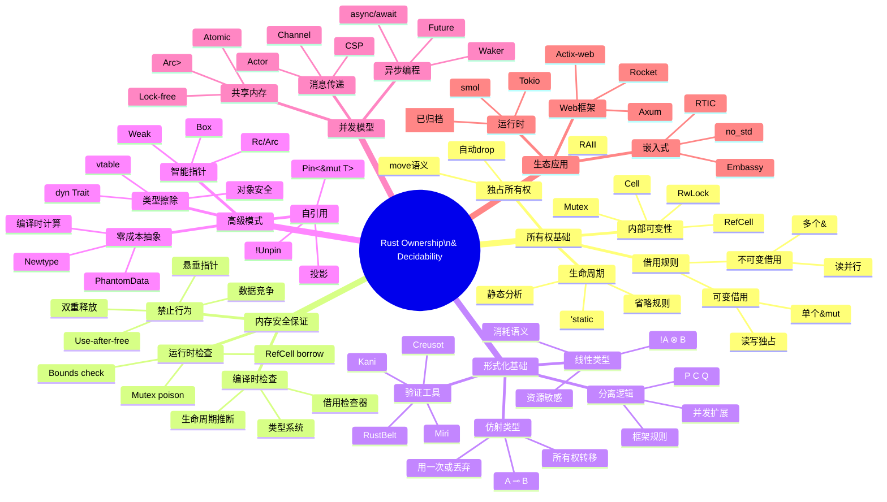

> **⚠️ 历史文档提示**：本文档包含 `async-std`、`wasm32-wasi` 等已归档或已重命名的生态引用。
> 其中技术观点反映了对应时间点的社区状态，可能与当前（Rust 1.96+）推荐实践不一致。
> 学习时请以 `concept/`、`knowledge/` 及官方文档为准。
>
> - `async-std` 已进入维护模式，新项目建议优先考虑 Tokio / smol。
> - `wasm32-wasi` 已重命名为 `wasm32-wasip1`；WASI Preview 2 目标为 `wasm32-wasip2`。

---

# Rust所有权系统 - 思维导图

> **内容分级**: [归档级]
>
> **分级**: [C]
> **Bloom 层级**: L5-L6 (分析/评价/创造)

## 📑 目录

> **[来源: [Rust Reference](https://doc.rust-lang.org/reference/)]**

- [Rust所有权系统 - 思维导图](.#rust所有权系统---思维导图)
  - [📑 目录](.#-目录)
  - [Mermaid思维导图](.#mermaid思维导图)
  - [文本思维导图](.#文本思维导图)
  - [核心关系图](.#核心关系图)
  - [概念依赖关系](.#概念依赖关系)
<a id="更新日期-2026-03-05"></a>
  - [**更新日期**: 2026-03-05](.#更新日期-2026-03-05)
  - [相关概念](.#相关概念)
  - [权威来源索引](.#权威来源索引)

## Mermaid思维导图

> **来源: [Rust Reference](https://doc.rust-lang.org/reference/)** · **来源: [Wikipedia - Rust (programming language)](https://en.wikipedia.org/wiki/Rust_(programming_language))** · **来源: [Rustonomicon](https://doc.rust-lang.org/nomicon/)** · **来源: [The Rust Programming Language](https://doc.rust-lang.org/book/)** · **来源: [Rust RFCs](https://github.com/rust-lang/rfcs)** · **来源: [Rust Standard Library](https://doc.rust-lang.org/std/)**



---

## 文本思维导图
>
> **来源: [Rust Reference](https://doc.rust-lang.org/reference/)** · **来源: [Wikipedia - Rust (programming language)](https://en.wikipedia.org/wiki/Rust_(programming_language))** · **来源: [Rustonomicon](https://doc.rust-lang.org/nomicon/)** · **来源: [The Rust Programming Language](https://doc.rust-lang.org/book/)** · **来源: [Rust RFCs](https://github.com/rust-lang/rfcs)** · **来源: [Rust Standard Library](https://doc.rust-lang.org/std/)**

```text
                            Rust所有权与可判定性
                                    │
            ┌───────────┬───────────┼───────────┬───────────┐
            │           │           │           │           │
        所有权基础    内存安全      形式化      高级模式     生态应用
            │           │           │           │           │
      ┌─────┼─────┐     │       ┌───┼───┐       │       ┌───┼───┐
      │     │     │     │       │   │   │       │       │   │   │
    独占   借用   生命   编译    线性  分离  验证   智能   并发  嵌入  Web
    所有权  规则   周期   检查    类型  逻辑  工具   指针   模型  式   框架
```

---

## 核心关系图
>
> **来源: [Rust Reference](https://doc.rust-lang.org/reference/)** · **来源: [Wikipedia - Rust (programming language)](https://en.wikipedia.org/wiki/Rust_(programming_language))** · **来源: [Rustonomicon](https://doc.rust-lang.org/nomicon/)** · **来源: [The Rust Programming Language](https://doc.rust-lang.org/book/)** · **来源: [Rust RFCs](https://github.com/rust-lang/rfcs)** · **来源: [Rust Standard Library](https://doc.rust-lang.org/std/)**

```text
┌─────────────────────────────────────────────────────────────────┐
│                    Rust 所有权系统                               │
├─────────────────────────────────────────────────────────────────┤
│                                                                  │
│   ┌───────────┐    ┌───────────┐    ┌───────────┐               │
│   │  所有权    │───▶│   借用    │───▶│  生命周期  │               │
│   │ Ownership │    │ Borrowing │    │ Lifetimes │               │
│   └───────────┘    └───────────┘    └───────────┘               │
│         │                │                │                      │
│         ▼                ▼                ▼                      │
│   ┌───────────────────────────────────────────┐                 │
│   │          内存安全 (编译时保证)              │                 │
│   │  ✓ 无数据竞争    ✓ 无悬垂指针              │                 │
│   │  ✓ 无UAF        ✓ 无双重释放              │                 │
│   └───────────────────────────────────────────┘                 │
│                              │                                   │
│                              ▼                                   │
│   ┌───────────────────────────────────────────┐                 │
│   │          形式化基础                        │                 │
│   │  仿射类型 ⊸    线性逻辑 ⊗    分离逻辑      │                 │
│   └───────────────────────────────────────────┘                 │
│                              │                                   │
│                              ▼                                   │
│   ┌───────────────────────────────────────────┐                 │
│   │          高级模式                          │                 │
│   │  智能指针  自引用  类型擦除  零成本抽象    │                 │
│   └───────────────────────────────────────────┘                 │
│                                                                  │
└─────────────────────────────────────────────────────────────────┘
```

---

## 概念依赖关系
>
> **[来源: [The Rust Programming Language](https://doc.rust-lang.org/book/)]**

```text
基础层:
    ┌─────────────────────────────────────┐
    │  变量绑定、作用域、Drop trait        │
    └─────────────────────────────────────┘
              ↓
核心层:
    ┌─────────────────────────────────────┐
    │  所有权转移、借用、生命周期           │
    │  Send/Sync trait                     │
    └─────────────────────────────────────┘
              ↓
模式层:
    ┌─────────────────────────────────────┐
    │  RAII、智能指针、内部可变性           │
    │  类型状态、自引用                     │
    └─────────────────────────────────────┘
              ↓
应用层:
    ┌─────────────────────────────────────┐
    │  并发模型、异步编程、嵌入式           │
    │  Web框架、分布式系统                  │
    └─────────────────────────────────────┘
```

---

**维护者**: Rust Analysis Team
**更新日期**: 2026-03-05
---

> **权威来源**: [Rust Reference](https://doc.rust-lang.org/reference/), [The Rust Programming Language](https://doc.rust-lang.org/book/), [Rust Standard Library](https://doc.rust-lang.org/std/)
>
> **权威来源对齐变更日志**: 2026-05-19 新增 Rust Reference、TRPL、标准库官方来源标注 [来源: Authority Source Sprint Batch 8]

**文档版本**: 1.1
**对应 Rust 版本**: 1.96.0+ (Edition 2024)
**最后更新**: 2026-05-19
**状态**: ✅ 权威来源对齐完成 (Batch 8)

---

- Parent README

---

## 相关概念
>
> **[来源: [Rust Standard Library](https://doc.rust-lang.org/std/)]**

- 上级目录

---

## 权威来源索引

> **来源: [Wikipedia - Memory Safety](https://en.wikipedia.org/wiki/Memory_Safety)**

> **来源: [TRPL Ch. 4 - Ownership](https://doc.rust-lang.org/book/ch04-01-what-is-ownership.html)**

> **来源: [Rustonomicon - Ownership](https://doc.rust-lang.org/nomicon/ownership.html)**

> **来源: [RustBelt — POPL 2018](https://plv.mpi-sws.org/rustbelt/popl18/)**

---
