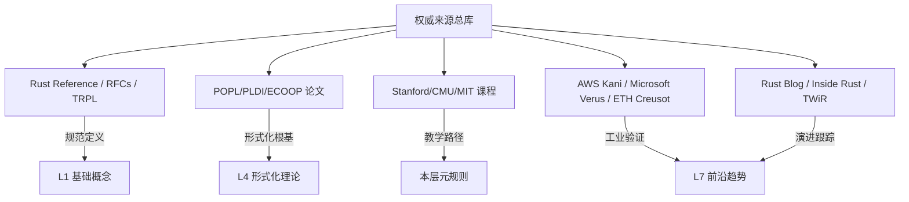

> **归档声明**: 本文件前部为 Rust 概念知识体系 **L0 元信息层索引**。原 PostgreSQL 18+ 形式化分析内容已折叠至文件尾部 `§[PostgreSQL 18+ 形式化分析归档]`。
> 与 Rust 相关的跨系统对比内容已提取至 [`05_comparative/04_safety_boundaries.md`](05_comparative/04_safety_boundaries.md) §10。
>
> **状态**: v1.1（2026-05-13 重构索引）

---

# L0 元信息层索引（Meta Layer Index）

> **定位**: 本层为 Rust 概念知识体系的**元信息层**，存放权威来源、方法论、知识来源关系、全局索引等基础设施。所有 L1-L7 文件必须遵循本层定义的元规则。
> **Bloom 层级**: —（元结构，不适用）
> **功能**: 为上层概念提供**可溯源、可审计、可演进**的基础设施
> **[来源: Wikipedia - Knowledge Organization]** · **[来源: Anderson & Krathwohl 2001 - A Taxonomy for Learning]** · **[来源: Rust Reference]**

---

## 一、L0 层核心文件速查

| 文件 | 主题 | 核心功能 | 状态 |
|:---|:---|:---|:---|
| [`00_meta/sources.md`](00_meta/sources.md) | 权威来源清单 | 五级来源体系（规范/学术/教学/工业/社区）+ 知识来源关系图谱 | ✅ v1.1 |
| [`00_meta/methodology.md`](00_meta/methodology.md) | 方法论 | 六种思维表征规范、内容质量门禁、协作流程 | ✅ v1.1 |
| [`00_meta/concept_index.md`](00_meta/concept_index.md) | 全局概念索引 | 倒排索引、SSO 单一来源规范、Bloom 层级排序、交叉概念审计 | ✅ v1.1 |
| [`00_meta/inter_layer_map.md`](00_meta/inter_layer_map.md) | 跨层依赖图 | L0-L7 层间语义链接 + 严格依赖路径 | ✅ v1.0 |
| [`00_meta/semantic_space.md`](00_meta/semantic_space.md) | 表征空间 | 能/不能/等价表达三维分析 + 跨语言表征对比 | ✅ v1.0 |
| [`00_meta/audit_checklist.md`](00_meta/audit_checklist.md) | 审计清单 | 概念一致性检查清单 + 月度审计机制 | ✅ v1.0 |
| [`00_meta/learning_guide.md`](00_meta/learning_guide.md) | 学习指南 | 不同背景读者的路径推荐 | ✅ v1.0 |
| [`00_meta/quick_reference.md`](00_meta/quick_reference.md) | 速查手册 | 核心概念一页纸速查 | ✅ v1.0 |

---

## 二、L0 输出的元规则（约束 L1-L7）

```text
L0 元规则
    │
    ├──→ 来源规范 ──────→ 所有概念文件必须标注权威来源（一级优先）
    ├──→ 表征规范 ──────→ 每文件 ≥2 种思维表征方式
    ├──→ 结构规范 ──────→ 定理一致性矩阵 + 反命题树 + 认知路径
    ├──→ 命名规范 ──────→ NN_english_name.md
    ├──→ SSO 规范 ──────→ 交叉概念必须有单一主定义文件
    └──→ 演进规范 ──────→ 版本特性跟踪 + 变更日志
```

---

## 三、快速入口指南

| 读者类型 | 推荐起点 | 路径 |
|:---|:---|:---|
| **Rust 初学者** | [`01_foundation/README.md`](01_foundation/README.md) | L1 → L2 → L3 |
| **系统工程师** | [`05_comparative/01_rust_vs_cpp.md`](05_comparative/01_rust_vs_cpp.md) | L5 → L6 → L3 |
| **形式化研究者** | [`04_formal/README.md`](04_formal/README.md) | L4 → L1 → L7 |
| **语言设计者** | [`07_future/03_evolution.md`](07_future/03_evolution.md) | L7 → L4 → L5 |
| **技术选型者** | [`05_comparative/README.md`](05_comparative/README.md) | L5 → L6 → L7 |

---

## 四、知识来源关系图谱（简化版）



---

## 五、变更日志

| 版本 | 日期 | 变更 |
|:---|:---|:---|
| v1.0 | 2026-05-12 | 初始创建，PostgreSQL 长文直接存放 |
| v1.1 | 2026-05-13 | 重构前部为 Rust L0 索引，PostgreSQL 内容折叠至尾部 |

---
---

> **权威来源**: [Rust Reference](https://doc.rust-lang.org/reference/), [The Rust Programming Language](https://doc.rust-lang.org/book/), [Rustonomicon](https://doc.rust-lang.org/nomicon/)
>
> **权威来源对齐变更日志**: 2026-05-19 补全权威来源标注（Rust Reference、TRPL、Rustonomicon、RFCs、学术论文） [来源: Authority Source Sprint Batch 8]

**文档版本**: 1.1
**对应 Rust 版本**: 1.95.0+ (Edition 2024)
**最后更新**: 2026-05-19
**状态**: ✅ 权威来源对齐完成 (Batch 8)
