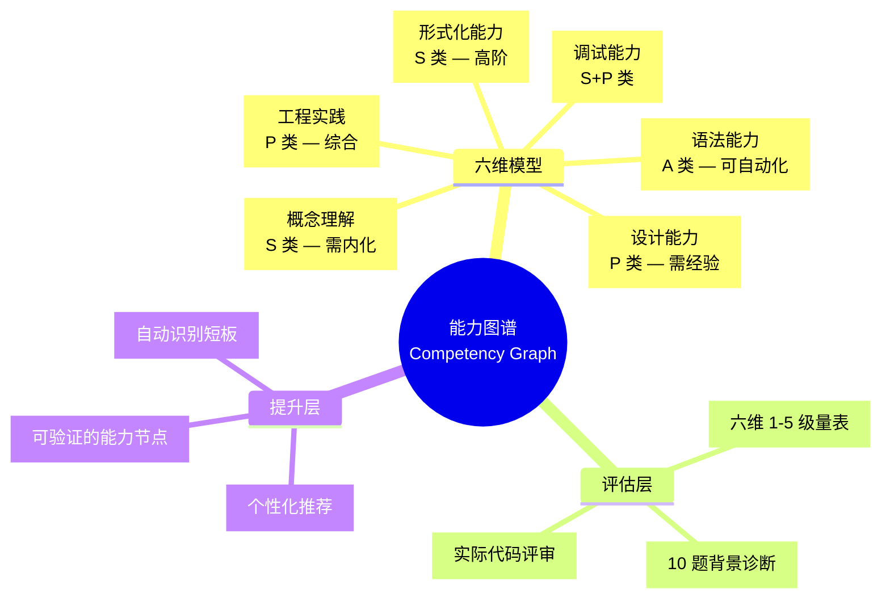
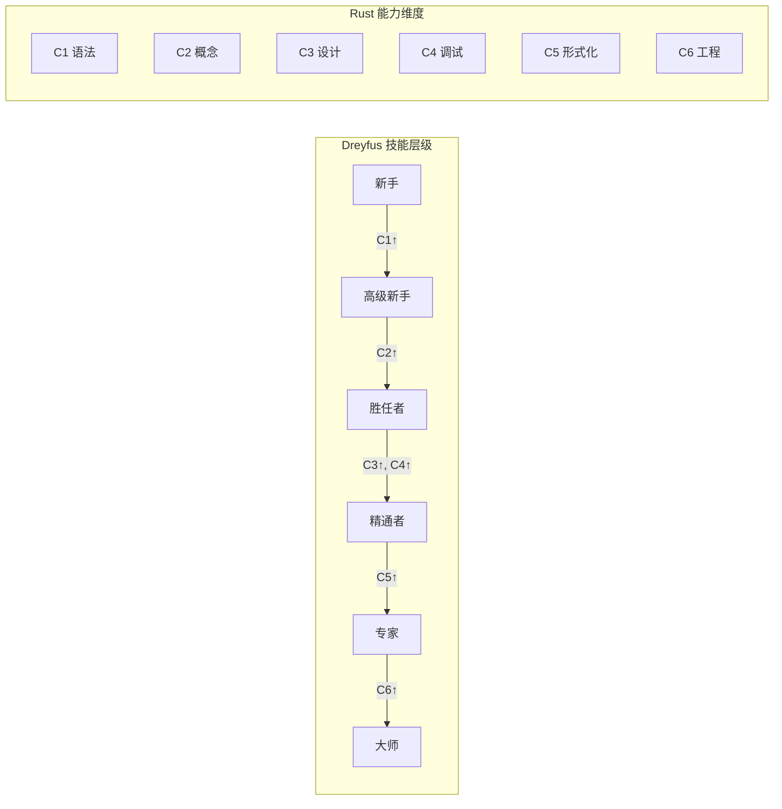

# Rust 知识体系能力图谱（Competency Graph）
>
> **EN**: Competency Graph
> **Summary**: Competency Graph. Core Rust concept.
> **受众**: [进阶]
> **Rust 版本**: 1.97.0+ (Edition 2024)
> **Bloom 层级**: 元（Meta）
> **权威来源**: 本文件为 `concept/` 权威页。
> **定位**: 本文件建立 `concept/` 知识体系的**能力评估与提升框架**，定义 Rust 编程能力的六维雷达模型，提供自评工具、薄弱点诊断和个性化训练路径推荐。与 `problem_graph.md`（"遇到什么问题"）和 `cognitive_dimension_matrix.md`（"认知类型是什么"）形成三角互补。
> **对齐来源**: [ACM 能力图谱框架] · [Bloom 修订版 2001 — 认知过程维度] · [Dreyfus 技能获取模型] · [Microsoft RustTraining — 能力评估]
> **定理链**: N/A — 描述性/综述性/导航性文档，不涉及形式化定理链
>
> **来源**: [TRPL](https://doc.rust-lang.org/book/title-page.html) · [Rust Reference](https://doc.rust-lang.org/reference/introduction.html)
> **关联文件**: [学习指南 `learning_guide.md`](../04_navigation/learning_guide.md) · [双维认知矩阵 `cognitive_dimension_matrix.md`](cognitive_dimension_matrix.md)
---

> **来源**: [ACM — *Competency Graph for Programming Education*]
>
> **来源**: [Bloom et al. (2001) — *Taxonomy of Educational Objectives*]
> **来源**: [Dreyfus, S.E. — *The Five-Stage Model of Adult Skill Acquisition*. Bulletin of Science, Technology & Society, 2004]
> **来源**: [Microsoft RustTraining — 能力评估与认证体系]

## 📑 目录

- [Rust 知识体系能力图谱（Competency Graph）](#rust-知识体系能力图谱competency-graph)
  - [📑 目录](#-目录)
  - [〇、能力图谱认知全景](#〇能力图谱认知全景)
  - [一、六维能力模型](#一六维能力模型)
    - [六维能力矩阵](#六维能力矩阵)
  - [二、Dreyfus 技能层级映射](#二dreyfus-技能层级映射)
  - [三、自评工具](#三自评工具)
    - [3.1 六维自评量表](#31-六维自评量表)
      - [C1 — 语法能力](#c1--语法能力)
      - [C2 — 概念理解](#c2--概念理解)
      - [C3 — 设计能力](#c3--设计能力)
      - [C4 — 调试能力](#c4--调试能力)
      - [C5 — 形式化能力](#c5--形式化能力)
      - [C6 — 工程实践](#c6--工程实践)
    - [3.2 快速自评问卷](#32-快速自评问卷)
  - [四、薄弱点诊断与训练路径](#四薄弱点诊断与训练路径)
    - [薄弱点 → 训练路径映射](#薄弱点--训练路径映射)
  - [五、背景定制能力路径](#五背景定制能力路径)
    - [路径 A：C++ 背景](#路径-ac-背景)
    - [路径 B：Haskell 背景](#路径-bhaskell-背景)
    - [路径 C：完全新手](#路径-c完全新手)
  - [六、能力图谱与 A/S/P 标记的整合](#六能力图谱与-asp-标记的整合)
  - [七、来源与可信度](#七来源与可信度)
  - [认知路径](#认知路径)
    - [核心推理链](#核心推理链)
    - [反命题与边界](#反命题与边界)
  - [嵌入式测验（Embedded Quiz）](#嵌入式测验embedded-quiz)
    - [测验 1：本文档《Rust 知识体系能力图谱（Competency Graph）》在 Rust 知识体系中属于哪一层级的元数据？（理解层）](#测验-1本文档rust-知识体系能力图谱competency-graph在-rust-知识体系中属于哪一层级的元数据理解层)
    - [测验 2：《Rust 知识体系能力图谱（Competency Graph）》的主要用途是什么？（理解层）](#测验-2rust-知识体系能力图谱competency-graph的主要用途是什么理解层)
    - [测验 3：元数据层文档能否替代 L1-L7 的核心概念学习？（理解层）](#测验-3元数据层文档能否替代-l1-l7-的核心概念学习理解层)

---

## 〇、能力图谱认知全景



> **认知功能**: 能力图谱将抽象的"Rust 能力"分解为**六个可测量、可提升的维度**，并与 A/S/P 标记对齐（语法=A、概念=S、设计=P 等）。学习者可以通过自评定位当前位置，获得针对性的训练推荐，而非盲目跟随线性教程。[💡 原创分析](methodology.md)

---

## 一、六维能力模型

| 维度 | 定义 | A/S/P | 可自动化 | 典型表现 |
|:---|:---|:---:|:---:|:---|
| **C1 — 语法能力** (Syntax Proficiency) | 掌握 Rust 语法、关键字、标准库 API | A | 🟢 高 | 无需查阅文档即可写出符合语法的代码；熟悉常用 trait 的方法签名 |
| **C2 — 概念理解** (Conceptual Understanding) | 建立所有权、借用、生命周期等核心心智模型 | S | 🟡 中 | 能解释编译器错误的原因；能在脑中模拟借用检查过程 |
| **C3 — 设计能力** (Design Capability) | 设计类型安全的 API、选择合适的抽象 | P | 🔴 低 | 能设计零成本抽象；能在泛型和动态分发间做出合理权衡 |
| **C4 — 调试能力** (Debugging Skill) | 定位、诊断和修复编译错误及运行时问题 | S+P | 🟡 低 | 能快速定位 lifetime 错误根因；会使用 Miri 检测 UB |
| **C5 — 形式化能力** (Formal Reasoning) | 理解类型论、分离逻辑等形式化基础 | S | 🟡 中 | 能阅读 RustBelt 论文；能用 Iris 规约 unsafe 代码 |
| **C6 — 工程实践** (Engineering Practice) | 测试、CI/CD、文档、团队协作、生态选型 | P | 🔴 低 | 能设计完整的测试策略；能评估 crate 的安全性和可维护性 |

### 六维能力矩阵

```markdown
| 能力维度 | L1 基础 | L2 进阶 | L3 高级 | L4 专家 | L5 大师 |
|:---|:---:|:---:|:---:|:---:|:---:|
| C1 语法能力 | 变量、类型、控制流 | 泛型、Trait、宏 | unsafe 语法、FFI | 编译器插件、proc_macro | 语言设计参与 |
| C2 概念理解 | 所有权直觉 | 生命周期推理 | Pin/async 模型 | 形式化语义 | 类型系统设计 |
| C3 设计能力 | 函数设计 | API 设计 | 系统架构 | 语言生态设计 | 范式定义 |
| C4 调试能力 | 读编译错误 | 修复 lifetime | Miri/TSan 使用 | 编译器 bug 诊断 | 工具链开发 |
| C5 形式化能力 | 了解类型安全 | 理解 Curry-Howard | 阅读 RustBelt | Iris 证明 | 新逻辑系统 |
| C6 工程实践 | cargo 基础 | 测试策略 | CI/CD 安全 | 开源治理 | 标准制定 |
```

---

## 二、Dreyfus 技能层级映射

Dreyfus 模型将技能获取分为五个阶段，映射到 Rust 能力的六维模型：

| Dreyfus 阶段 | 特征 | Rust 六维表现 | 推荐学习策略 |
|:---:|:---|:---|:---|
| **新手** (Novice) | 依赖规则，无情境判断 | C1 低，其余极低 | 跟随教程，记忆语法规则 |
| **高级新手** (Advanced Beginner) | 开始识别情境因素 | C1 中，C2 低 | 做练习，理解编译错误 |
| **胜任者** (Competent) | 能设定目标、制定计划 | C1 高，C2 中，C3 低 | 独立完成项目，设计 API |
| **精通者** (Proficient) | 直觉与分析结合，全局把握 | C2 高，C3 中，C4 中 | 阅读标准库源码，参与开源 |
| **专家** (Expert) | 凭直觉行动，把握本质 | C3 高，C4 高，C5 中 | 设计框架，形式化验证 |
| **大师** (Master) | 超越规则，创造新范式 | C5 高，C6 高 | 语言设计，标准制定 |



---

## 三、自评工具

### 3.1 六维自评量表

> **使用说明**: 为每个维度选择最符合当前水平的描述（1-5 级）。记录日期，定期复测追踪进步。

#### C1 — 语法能力

| 等级 | 描述 |
|:---:|:---|
| 1 | 需要频繁查阅文档才能写出基本语法 |
| 2 | 能独立完成基础语法，但对泛型/生命周期语法不熟悉 |
| 3 | 能熟练使用大部分语法特性，偶尔查阅高级特性 |
| 4 | 精通全部语法，包括 unsafe 和宏系统 |
| 5 | 能设计新的语法扩展（proc_macro / 编译器插件） |

#### C2 — 概念理解

| 等级 | 描述 |
|:---:|:---|
| 1 | 对所有权和借用只有模糊直觉 |
| 2 | 能理解简单的编译器错误，但复杂 lifetime 错误需要求助 |
| 3 | 能在脑中模拟借用检查，预测代码是否通过编译 |
| 4 | 理解 Pin、async 状态机、NLL/Polonius 差异 |
| 5 | 能向他人清晰解释 Rust 安全保证的数学基础 |

#### C3 — 设计能力

| 等级 | 描述 |
|:---:|:---|
| 1 | 只能写简单的顺序程序 |
| 2 | 能设计基本的函数和结构体接口 |
| 3 | 能设计类型安全的 API，合理使用泛型和 Trait |
| 4 | 能在零成本和抽象间做权衡，设计可扩展架构 |
| 5 | 能设计语言级抽象（如 Effect System 预研） |

#### C4 — 调试能力

| 等级 | 描述 |
|:---:|:---|
| 1 | 面对编译错误只能尝试随机修改 |
| 2 | 能根据错误信息定位到大致位置 |
| 3 | 能系统性地分析 lifetime 错误根因 |
| 4 | 会使用 Miri、TSan、valgrind 检测隐藏 bug |
| 5 | 能诊断编译器本身的 soundness bug |

#### C5 — 形式化能力

| 等级 | 描述 |
|:---:|:---|
| 1 | 不知道类型论是什么 |
| 2 | 了解 Curry-Howard 对应的基本概念 |
| 3 | 能理解 RustBelt 论文的主要结论 |
| 4 | 能用分离逻辑手动验证小规模 unsafe 代码 |
| 5 | 能使用 Iris 或 Kani 做机器可检查的验证 |

#### C6 — 工程实践

| 等级 | 描述 |
|:---:|:---|
| 1 | 只会 `cargo build` 和 `cargo run` |
| 2 | 能写单元测试，使用 clippy |
| 3 | 有完整的测试策略（单元/集成/文档/模糊测试） |
| 4 | 能评估 unsafe 依赖的可审计性，设计 CI 安全门禁 |
| 5 | 能制定团队 Rust 编码标准，参与生态治理 |

### 3.2 快速自评问卷

> **10 题快速诊断**，每题选择 A/B/C/D，统计各维度得分。

| 题号 | 问题 | C1 语法 | C2 概念 | C3 设计 | C4 调试 | C5 形式化 | C6 工程 |
|:---:|:---|:---:|:---:|:---:|:---:|:---:|:---:|
| Q1 | 你能不看文档写出 `Result<T, E>` 的错误传播吗？ | ● | | | | | |
| Q2 | 你能解释为什么 `&mut T` 不能与 `&T` 共存吗？ | | ● | | | | |
| Q3 | 你会为一个新模块选择 `dyn Trait` 还是泛型？依据是什么？ | | | ● | | | |
| Q4 | 遇到 "does not live long enough" 错误，你的第一反应是？ | | | | ● | | |
| Q5 | 你知道 `Send` 和 `Sync` 的形式化定义吗？ | | | | | ● | |
| Q6 | 你的项目有 `miri` 测试在 CI 中运行吗？ | | | | | | ● |
| Q7 | 你能手写 `macro_rules!` 实现简单的 DSL 吗？ | ● | | | | | |
| Q8 | 你能画出 `async fn` 被编译后的状态机结构吗？ | | ● | | | | |
| Q9 | 你会为 unsafe 代码编写 SAFETY 注释吗？ | | | ● | ● | | |
| Q10 | 你阅读过 RustBelt 或 Oxide 论文吗？ | | | | | ● | |

**评分规则**: 每题选 A=3分 / B=2分 / C=1分 / D=0分。各维度满分 6 分（2 题 × 3 分）。

---

## 四、薄弱点诊断与训练路径

### 薄弱点 → 训练路径映射

```mermaid
graph LR
    subgraph Diagnosis[薄弱点诊断]
        D1[C1 语法弱]
        D2[C2 概念弱]
        D3[C3 设计弱]
        D4[C4 调试弱]
        D5[C5 形式化弱]
        D6[C6 工程弱]
    end

    subgraph Training[训练路径推荐]
        T1[rustlings + API 速查表]
        T2[反例分析 + Mermaid 可视化]
        T3[设计模式实践 + 代码评审]
        T4[Miri 练习 + 编译器错误专题]
        T5[RustBelt](https://plv.mpi-sws.org/rustbelt/)
        T6[开源贡献 + CI 设计]
    end

    D1 --> T1
    D2 --> T2
    D3 --> T3
    D4 --> T4
    D5 --> T5
    D6 --> T6
```

| 薄弱维度 | 诊断信号 | 推荐训练 | 验证里程碑 |
|:---:|:---|:---|:---|
| **C1 语法** | 频繁查文档；写不出泛型约束 | `rustlings` 全通关 + 标准库源码阅读 | 独立完成 100 行无编译错误的程序 |
| **C2 概念** | 面对编译错误无从下手；不理解为什么 | 反例分析（`concept_definition_decision_forest.md`）+ 向他人解释 | 能预测给定代码是否通过编译 |
| **C3 设计** | API 设计混乱；过度/不足抽象 | 设计模式实践（`06_ecosystem/02_patterns.md`）+ 代码评审 | 设计的 API 被他人无文档使用 |
| **C4 调试** | 修复一个 bug 需要多次尝试 | Miri 专题练习 + `concept/03_advanced/02_unsafe/03_unsafe.md` 反例 | 能用 Miri 定位一个隐藏 UB |
| **C5 形式化** | 对 unsafe 安全性只有直觉 | RustBelt 论文精读 + Kani 验证实验 | 为一个 unsafe 函数写出 SAFETY 规约 |
| **C6 工程** | 无测试 / 无 CI / 随意依赖 | 开源项目贡献 + `cargo audit` / `cargo geiger` | 项目通过 `cargo audit` 无高危警告 |

---

## 五、背景定制能力路径

### 路径 A：C++ 背景

| 当前能力 | 薄弱点 | 快速提升策略 |
|:---|:---|:---|
| C1 语法：中 | 生命周期标注、Trait 系统 | 对比 C++ 模板与 Rust 泛型的差异 |
| C2 概念：低 | 所有权替代智能指针直觉 | 刻意练习 Move 语义（C++ 是复制默认） |
| C3 设计：中 | 零成本抽象的设计模式 | 学习 Enum 替代继承、Trait 替代虚函数 |
| C4 调试：中 | 借用检查错误诊断 | 建立 "AXM 规则" 心智模型 |
| C5 形式化：低 | 无形式化背景 | 从分离逻辑直观理解开始，暂缓 Iris |
| C6 工程：高 | Rust 生态工具链 | 学习 Cargo 工作区、crate 发布流程 |

### 路径 B：Haskell 背景

| 当前能力 | 薄弱点 | 快速提升策略 |
|:---|:---|:---|
| C1 语法：中 | 所有权语法、可变绑定 | 理解 `let mut` 与 Haskell 不可变的冲突 |
| C2 概念：中 | 所有权对纯度模型的影响 | 从线性类型角度理解所有权 |
| C3 设计：高 | 差异不大 | 重点学习 Rust 的 OOP 替代模式 |
| C4 调试：中 | 编译错误风格不同 | 适应 Rust 的"所有权导向"错误信息 |
| C5 形式化：高 | 差异不大 | 直接阅读 RustBelt，利用类型论基础 |
| C6 工程：中 | 构建系统差异 | 学习 Cargo 替代 cabal/stack |

### 路径 C：完全新手

| 阶段 | 目标维度 | 重点内容 | 时间建议 |
|:---:|:---:|:---|:---:|
| 1 | C1 ↑ | 变量、类型、函数、控制流 | 1-2 周 |
| 2 | C2 ↑ | 所有权、借用、生命周期（核心心智模型） | 3-4 周 |
| 3 | C1+C3 ↑ | 泛型、Trait、错误处理、设计模式 | 2-3 周 |
| 4 | C4 ↑ | 编译错误诊断、调试工具 | 1-2 周 |
| 5 | C3+C6 ↑ | 项目实战、测试、CI | 持续 |
| 6 | C5 ↑ | 形式化方法（可选进阶） | 按需 |

---

## 六、能力图谱与 A/S/P 标记的整合

```markdown
能力维度 → A/S/P 映射:
  C1 语法能力  →  A（Application）— 可自动化，可通过练习快速达到高水平
  C2 概念理解  →  S（Structure）— 需内化，是 Rust 学习的核心瓶颈
  C3 设计能力  →  P（Procedure）— 需经验，只能通过实际项目积累
  C4 调试能力  →  S+P — 概念分析 + 策略决策的混合
  C5 形式化能力 → S — 高阶概念结构
  C6 工程实践  →  P — 综合程序性决策
```

> **战略建议**: 在 AI 辅助编程时代，学习者应将**80% 的认知资源投入 S 和 P 类能力**（C2、C3、C4、C6），将 C1（语法）外包给 AI 工具。这与 `asp_marking_guide.md` 的"A 外包、S 内化、P 主导"原则一致。[💡 原创分析](methodology.md)

---

## 七、来源与可信度

| 层级 | 来源 | 在本文件中的作用 |
|:---|:---|:---|
| **一级** | Bloom, B.S. et al. (2001). *Taxonomy of Educational Objectives* (Revised). | 认知过程维度 — 能力评估的理论基础 |
| **一级** | Dreyfus, S.E. (2004). "The Five-Stage Model of Adult Skill Acquisition". | 技能获取五阶段 — 能力进阶的路径模型 |
| **二级** | ACM — *Competency Graph for Programming Education* (2024). | 能力图谱框架 — 六维模型的教育应用 |
| **二级** | Microsoft RustTraining. github.com/microsoft/RustTraining. | 工业级能力评估和认证体系参考 |
| **三级** | rustlings / exercism / codewars | 语法能力训练的工具来源 |

---

**变更日志**:

- v1.0 (2026-05-23): 初始版本 — 六维能力模型 + Dreyfus 映射 + 自评量表 + 薄弱点训练路径 + 背景定制路径 [权威来源对齐 Wave 5](../02_sources/international_authority_index.md)

---

> **相关文件**: [A/S/P 标记规范](../03_audit/asp_marking_guide.md) · [双维认知矩阵](cognitive_dimension_matrix.md) · [问题图谱](../04_navigation/problem_graph.md) · [学习指南](../04_navigation/learning_guide.md)

## 认知路径

> **认知路径**: 本文件作为 Rust 分层知识体系的 **Rust 知识体系能力图谱（Competency Graph）** 元层导航节点，连接概念定义、学习路径与质量评估框架。

### 核心推理链

| 定理 | 前提 | 结论 | 置信度 |
|:---|:---|:---|:---|
| Competency Graph 结构化定义 ⟹ 学习者认知锚点可建立 | 本文件定义了元层结构 | 支持上层概念定位 | 高 |

> **过渡**: 利用本文件的导航结构，读者可以从当前位置快速跃迁到任意概念层级，实现非线性学习。
> **过渡**: Rust 知识体系能力图谱（Competency Graph） 的维护需要与概念内容同步更新，确保元数据与实际知识体系的一致性。
> **过渡**: 将 Rust 知识体系能力图谱（Competency Graph） 作为学习起点或复习锚点，有助于建立全局视野，避免陷入局部细节而忽视整体架构。

### 反命题与边界

> **反命题**: "元层文档可以替代具体概念学习" —— 错误。Rust 知识体系能力图谱（Competency Graph） 提供的是导航与评估框架，不能替代对核心概念（L1-L5）的深入理解与实践。
> **内容分级**: [综述级]

## 嵌入式测验（Embedded Quiz）

### 测验 1：本文档《Rust 知识体系能力图谱（Competency Graph）》在 Rust 知识体系中属于哪一层级的元数据？（理解层）

**题目**: 本文档《Rust 知识体系能力图谱（Competency Graph）》在 Rust 知识体系中属于哪一层级的元数据？

<details>
<summary>✅ 答案与解析</summary>

属于 00_meta 元数据层，为整个知识体系提供导航、评估、审计和结构化的支持框架，辅助学习者定位和理解核心概念。
</details>

---

### 测验 2：《Rust 知识体系能力图谱（Competency Graph）》的主要用途是什么？（理解层）

**题目**: 《Rust 知识体系能力图谱（Competency Graph）》的主要用途是什么？

<details>
<summary>✅ 答案与解析</summary>

作为知识体系的支撑文档，提供学习路径导航、概念关系映射、质量评估标准或审计检查清单，帮助学习者和维护者高效使用知识库。
</details>

---

### 测验 3：元数据层文档能否替代 L1-L7 的核心概念学习？（理解层）

**题目**: 元数据层文档能否替代 L1-L7 的核心概念学习？

<details>
<summary>✅ 答案与解析</summary>

不能。元数据层提供导航和评估框架，但不能替代对核心概念（所有权、类型系统、并发等）的深入理解与实践。
</details>
