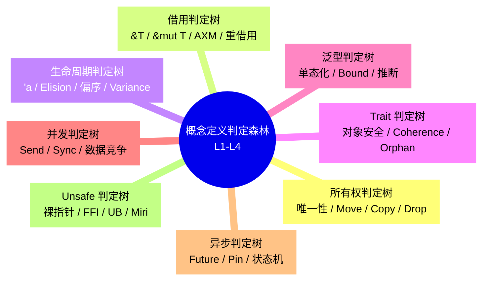
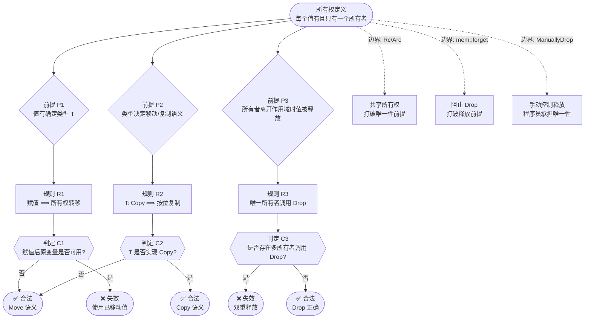
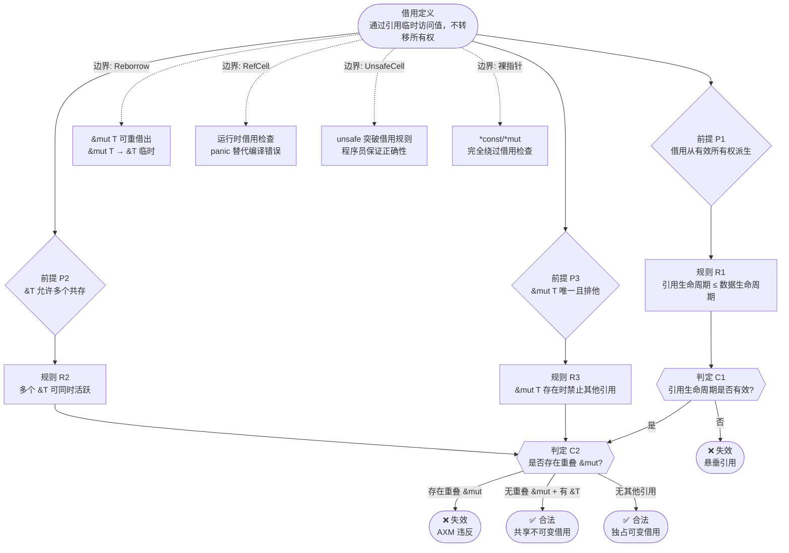
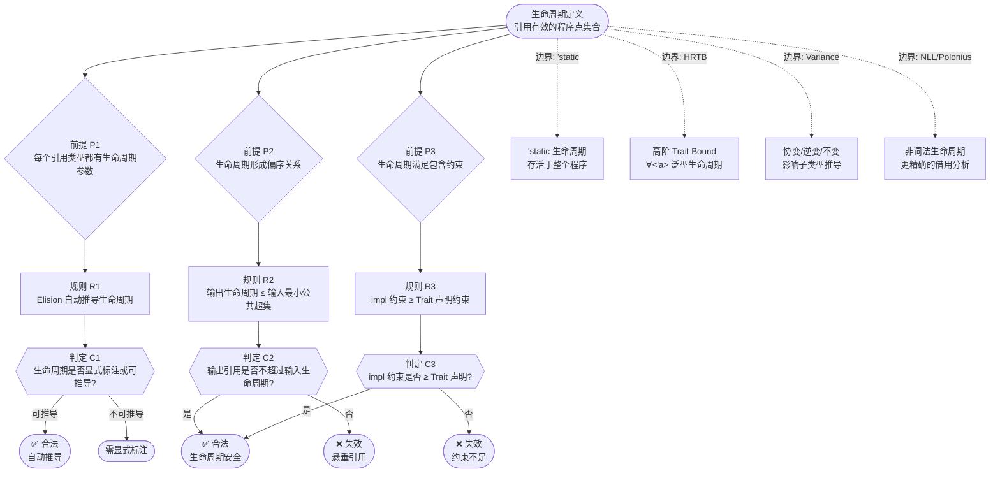
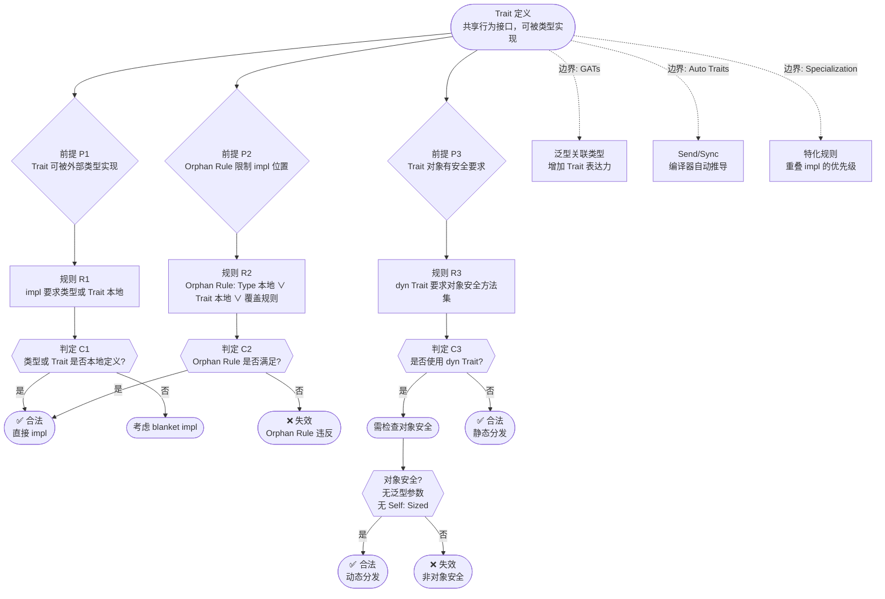
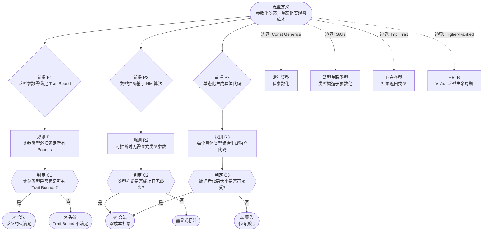
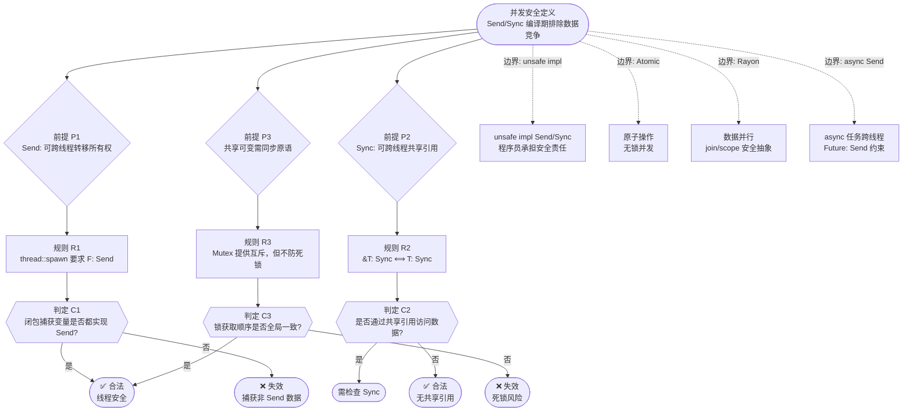
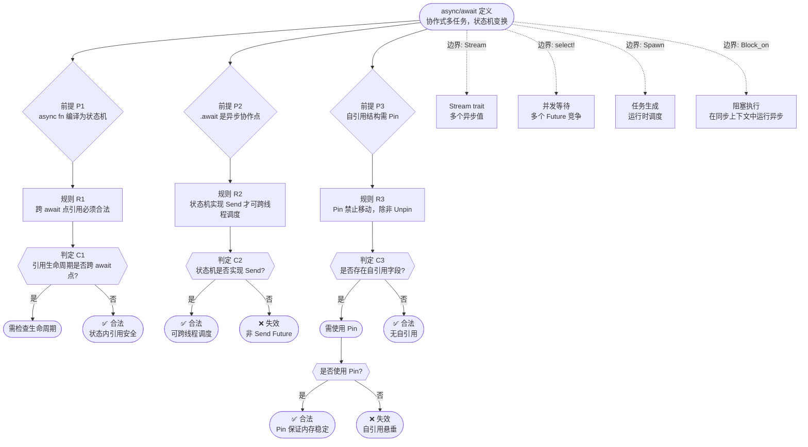
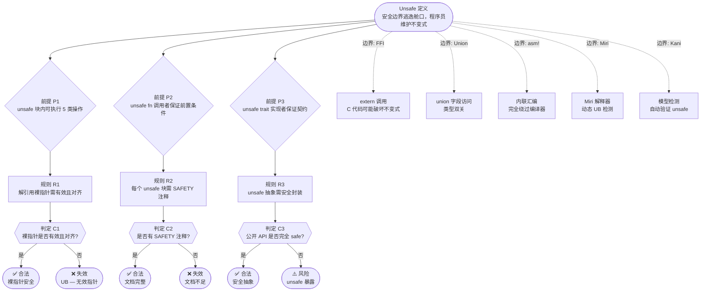
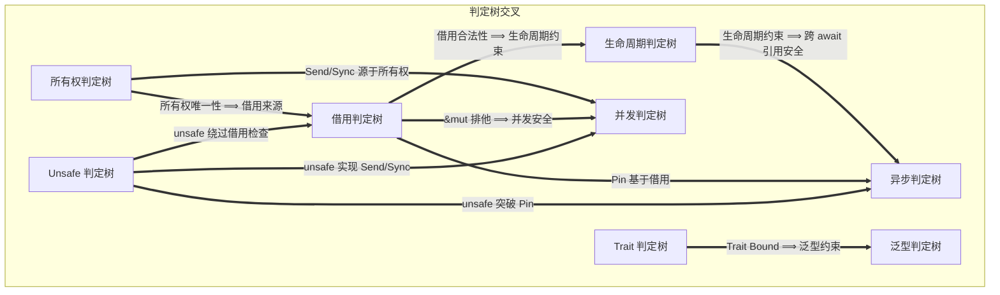

# Rust 知识体系概念定义判定森林（Concept Definition Decision Forest）
>
> **EN**: Concept Definition Decision Forest
> **Summary**: Concept Definition Decision Forest. Core Rust concept.
> **Rust 版本**: 1.97.0+ (Edition 2024)
> **受众**: [专家]
> **Bloom 层级**: Meta
> **权威来源**: 本文件为 `concept/` 权威页。
> **定位**: 本文件为 L1-L4 核心概念建立从**定义**出发的完整判定链：**前提假设 → 推理规则 → 判定条件 → 边界 → 失效模式**。与 `theorem_inference_forest.md`（从 L4 公理出发的定理链）形成互补：后者回答「安全保证从哪来」，本文件回答「编译器/开发者如何逐步判定代码是否合法」。
> **对齐来源**: [Gentzen 自然演绎系统] · [Novak & Cañas (2008) 概念地图理论] · [Torchiano et al. (2018) 边界分析] · [Rust Reference 类型判断规则](https://doc.rust-lang.org/reference/introduction.html) · [RustBelt](https://plv.mpi-sws.org/rustbelt/)
> **符号约定**: `⊢` 推导 / `⟹` 蕴含 / `⇐` 依赖 / `⊘` 反例 / `≡` 等价 / `∧` 与 / `∨` 或
>
> **来源**: [TRPL](https://doc.rust-lang.org/book/title-page.html) · [Rust Reference](https://doc.rust-lang.org/reference/introduction.html)
---

> **来源**: [Gentzen, G. — *Untersuchungen über das logische Schließen*. 1935; 自然演绎系统]
>
> **来源**: [Novak, J.D. & Cañas, A.J. — *The Theory Underlying Concept Maps*. Technical Report, Florida Institute for Human and Machine Cognition, 2008]
> **来源**: [Torchiano et al. (2018) — 软件工程知识库边界分析研究]
> **来源**: [Rust Reference — 类型系统判断规则](https://doc.rust-lang.org/reference/introduction.html)
> **来源**: [RustBelt](https://plv.mpi-sws.org/rustbelt/)

## 📑 目录

- [Rust 知识体系概念定义判定森林（Concept Definition Decision Forest）](#rust-知识体系概念定义判定森林concept-definition-decision-forest)
  - [📑 目录](#-目录)
  - [〇、判定森林认知全景](#〇判定森林认知全景)
  - [一、判定树格式规范](#一判定树格式规范)
  - [二、所有权判定树](#二所有权判定树)
    - [2.1 判定链](#21-判定链)
    - [2.2 Mermaid 可视化](#22-mermaid-可视化)
    - [2.3 失效条件矩阵](#23-失效条件矩阵)
  - [三、借用判定树](#三借用判定树)
    - [3.1 判定链](#31-判定链)
    - [3.2 Mermaid 可视化](#32-mermaid-可视化)
    - [3.3 失效条件矩阵](#33-失效条件矩阵)
  - [四、生命周期判定树](#四生命周期判定树)
    - [4.1 判定链](#41-判定链)
    - [4.2 Mermaid 可视化](#42-mermaid-可视化)
    - [4.3 失效条件矩阵](#43-失效条件矩阵)
  - [五、Trait 判定树](#五trait-判定树)
    - [5.1 判定链](#51-判定链)
    - [5.2 Mermaid 可视化](#52-mermaid-可视化)
    - [5.3 失效条件矩阵](#53-失效条件矩阵)
  - [六、泛型判定树](#六泛型判定树)
    - [6.1 判定链](#61-判定链)
    - [6.2 Mermaid 可视化](#62-mermaid-可视化)
    - [6.3 失效条件矩阵](#63-失效条件矩阵)
  - [七、并发判定树](#七并发判定树)
    - [7.1 判定链](#71-判定链)
    - [7.2 Mermaid 可视化](#72-mermaid-可视化)
    - [7.3 失效条件矩阵](#73-失效条件矩阵)
  - [八、异步判定树](#八异步判定树)
    - [8.1 判定链](#81-判定链)
    - [8.2 Mermaid 可视化](#82-mermaid-可视化)
    - [8.3 失效条件矩阵](#83-失效条件矩阵)
  - [九、Unsafe 判定树](#九unsafe-判定树)
    - [9.1 判定链](#91-判定链)
    - [9.2 Mermaid 可视化](#92-mermaid-可视化)
    - [9.3 失效条件矩阵](#93-失效条件矩阵)
  - [十、判定森林交叉一致性](#十判定森林交叉一致性)
  - [十一、与定理推理森林的对照](#十一与定理推理森林的对照)
  - [十二、来源与可信度](#十二来源与可信度)
  - [认知路径](#认知路径)
    - [核心推理链](#核心推理链)
    - [反命题与边界](#反命题与边界)
  - [嵌入式测验（Embedded Quiz）](#嵌入式测验embedded-quiz)
    - [测验 1：本文档《Rust 知识体系概念定义判定森林（Concept Definition Decision Forest）》在 Rust 知识体系中属于哪一层级的元数据？（理解层）](#测验-1本文档rust-知识体系概念定义判定森林concept-definition-decision-forest在-rust-知识体系中属于哪一层级的元数据理解层)
    - [测验 2：《Rust 知识体系概念定义判定森林（Concept Definition Decision Forest）》的主要用途是什么？（理解层）](#测验-2rust-知识体系概念定义判定森林concept-definition-decision-forest的主要用途是什么理解层)
    - [测验 3：元数据层文档能否替代 L1-L7 的核心概念学习？（理解层）](#测验-3元数据层文档能否替代-l1-l7-的核心概念学习理解层)

---

## 〇、判定森林认知全景



> **认知功能**: 本 mindmap 提供八棵判定树的**鸟瞰视图**。
> 每棵树的根是**概念定义**，叶节点是**判定结果**（合法 / 失效）。
> 与 `theorem_inference_forest.md` 的关键区别：
> 后者从 L4 **公理**出发（"仿射逻辑 ⟹ 所有权唯一性"），本文件从 L1 **概念定义**出发（"给定代码片段，逐步判定其所有权是否合法"）。
> 前者是"理论保证从哪来"，后者是"工程实践怎么判"。[💡 原创分析](methodology.md)

---

## 一、判定树格式规范

每棵判定树包含四个层次：

```text
┌─────────────────────────────────────────────────────────────┐
│  概念定义（Definition）                                       │
│  「某个 Rust 核心概念的精确工程定义」                          │
├─────────────────────────────────────────────────────────────┤
│  前提假设（Premises）                                         │
│  「判定开始前必须成立的条件」                                  │
├─────────────────────────────────────────────────────────────┤
│  推理规则（Inference Rules）                                  │
│  「从前提推导判定条件的规则」                                  │
├─────────────────────────────────────────────────────────────┤
│  判定条件（Decision Conditions）                              │
│  「可检查的具体条件，产生 ✅ 合法 / ❌ 失效」                  │
├─────────────────────────────────────────────────────────────┤
│  边界条件（Boundary Conditions）                              │
│  「规则适用的边界，超出边界需特殊处理」                        │
├─────────────────────────────────────────────────────────────┤
│  失效模式（Failure Modes）                                    │
│  「判定为 ❌ 时的具体错误类型和修复方向」                      │
└─────────────────────────────────────────────────────────────┘
```

**可视化规范**（Mermaid）：

- 定义节点：圆角矩形 `([定义])`
- 前提节点：菱形 `{前提}`
- 规则节点：矩形 `[规则]`
- 判定节点：六边形 `{{判定}}`
- 合法叶节点：绿色圆角矩形 `([✅ 合法])`
- 失效叶节点：红色圆角矩形 `([❌ 失效])`
- 边界节点：虚线框 `-.->`

---

## 二、所有权判定树

### 2.1 判定链

```text
┌─────────────────────────────────────────────────────────────┐
│ 概念定义                                                    │
│ 「每个值在任意时刻有且只有一个所有者」                        │
│   来源: [Rust Reference §4.1; RustBelt T-001](https://doc.rust-lang.org/reference/introduction.html)               │
└─────────────────────────────────────────────────────────────┘
                              │
        ┌─────────────────────┼─────────────────────┐
        ▼                     ▼                     ▼
┌───────────────┐   ┌───────────────┐   ┌───────────────┐
│ 前提 P1       │   │ 前提 P2       │   │ 前提 P3       │
│ 值有确定类型 T │   │ 类型 T 决定    │   │ 所有者离开     │
│               │   │ 移动/复制语义   │   │ 作用域时值     │
│               │   │               │   │ 被释放(Drop)   │
└───────┬───────┘   └───────┬───────┘   └───────┬───────┘
        │                   │                   │
        ▼                   ▼                   ▼
┌───────────────┐   ┌───────────────┐   ┌───────────────┐
│ 规则 R1       │   │ 规则 R2       │   │ 规则 R3       │
│ 赋值语句       │   │ T: Copy ⟹    │   │ Drop::drop()   │
│ x = y         │   │ 按位复制，    │   │ 由唯一所有者    │
│ ⟹ y 的所有权  │   │ 原变量仍可用   │   │ 调用且仅一次   │
│ 转移给 x      │   │               │   │               │
└───────┬───────┘   └───────┬───────┘   └───────┬───────┘
        │                   │                   │
        ▼                   ▼                   ▼
┌───────────────┐   ┌───────────────┐   ┌───────────────┐
│ 判定 C1       │   │ 判定 C2       │   │ 判定 C3       │
│ 赋值后 y 是否  │   │ T 是否实现    │   │ 是否存在多个   │
│ 仍可用？       │   │ Copy trait？  │   │ 所有者调用     │
│               │   │               │   │ Drop？         │
└───────┬───────┘   └───────┬───────┘   └───────┬───────┘
   是 / 否              是 / 否              是 / 否
    │    │                │    │                │    │
    ▼    ▼                ▼    ▼                ▼    ▼
┌────┐┌────┐         ┌────┐┌────┐         ┌────┐┌────┐
│✅  ││❌  │         │✅  ││✅  │         │❌  ││✅  │
│合法││失效│         │合法││合法│         │失效││合法│
│    ││使用│         │复制││移动│         │双重││    │
│    ││已移│         │语义││语义│         │释放││    │
│    ││动值│         │    ││    │         │    ││    │
└────┘└────┘         └────┘└────┘         └────┘└────┘
```

### 2.2 Mermaid 可视化



> **认知功能**: 本图将所有权判定的**逐步推理过程**可视化。从定义出发，经过三个独立的前提-规则-判定链，最终到达合法或失效的叶节点。边界条件（虚线）表示"什么情况下定义的前提被打破"——这是理解 Rust 安全边界的关键。[💡 原创分析](methodology.md)

### 2.3 失效条件矩阵

| 失效模式 | 判定条件 | 错误信息（典型） | 修复方向 | 安全影响 |
|:---|:---|:---|:---|:---:|
| **使用已移动值** (Use After Move) | C1 = "赋值后原变量仍被访问" | "use of moved value" | 实现 `Clone` / 使用引用 / 重新设计所有权 | 编译期阻止 |
| **双重释放** (Double Free) | C3 = "多个所有者同时调用 Drop" | 编译期阻止（不可达） | 编译器保证不可达 | 编译期阻止 |
| **UAF（通过 unsafe）** | 绕过 C1-C3 | 无编译错误 | Miri 检测 / 代码审查 | 🔴 运行时 UB |
| **内存泄漏（通过 Rc）** | 边界 B1: 循环引用 | 无编译错误 | 使用 `Weak` / 重新设计 | 🟡 非 UB |
| **内存泄漏（通过 forget）** | 边界 B2: 阻止 Drop | 无编译错误 | 避免 `mem::forget` / 使用 `ManuallyDrop` | 🟡 非 UB |

---

## 三、借用判定树

### 3.1 判定链

```text
┌─────────────────────────────────────────────────────────────┐
│ 概念定义                                                    │
│ 「借用是通过引用 (&T / &mut T) 临时访问值，不转移所有权」      │
│   来源: [Rust Reference §4.2; RustBelt Borrow Prop](https://doc.rust-lang.org/reference/introduction.html)         │
└─────────────────────────────────────────────────────────────┘
                              │
        ┌─────────────────────┼─────────────────────┐
        ▼                     ▼                     ▼
┌───────────────┐   ┌───────────────┐   ┌───────────────┐
│ 前提 P1       │   │ 前提 P2       │   │ 前提 P3       │
│ 借用必须从有效 │   │ &T 允许多个    │   │ &mut T 要求    │
│ 所有权派生     │   │ 不可变引用共存 │   │ 唯一且排他    │
└───────┬───────┘   └───────┬───────┘   └───────┬───────┘
        │                   │                   │
        ▼                   ▼                   ▼
┌───────────────┐   ┌───────────────┐   ┌───────────────┐
│ 规则 R1       │   │ 规则 R2       │   │ 规则 R3       │
│ 引用的生命     │   │ 多个 &T 可    │   │ 存在 &mut T   │
│ 周期必须 ≤    │   │ 同时活跃       │   │ 时，不允许    │
│ 被引用数据     │   │               │   │ 任何其他引用   │
└───────┬───────┘   └───────┬───────┘   └───────┬───────┘
        │                   │                   │
        ▼                   ▼                   ▼
┌───────────────┐   ┌───────────────┐   ┌───────────────┐
│ 判定 C1       │   │ 判定 C2       │   │ 判定 C3       │
│ 引用生命周期   │   │ 是否存在重叠   │   │ 是否存在重叠   │
│ 是否有效？     │   │ 的 &T 作用域？ │   │ 的 &mut？      │
│               │   │               │   │               │
└───────┬───────┘   └───────┬───────┘   └───────┬───────┘
   是 / 否              是 / 否              是 / 否
    │    │                │    │                │    │
    ▼    ▼                ▼    ▼                ▼    ▼
┌────┐┌────┐         ┌────┐┌────┐         ┌────┐┌────┐
│✅  ││❌  │         │✅  ││✅  │         │❌  ││✅  │
│合法││失效│         │合法││合法│         │失效││合法│
│    ││悬垂│         │共享│    │         │AXM ││    │
│    ││引用│         │借用│    │         │违反││    │
└────┘└────┘         └────┘└────┘         └────┘└────┘
```

### 3.2 Mermaid 可视化



> **认知功能**: 本图展示借用判定的**核心矛盾**：Rust 同时允许"多个读者"（`&T`）和"一个写者"（`&mut T`），但禁止"读写并发"。判定 C2 是借用检查器的核心——检查引用作用域是否重叠。边界条件展示了从编译期保证（Safe Rust）到运行时检查（RefCell）再到完全绕过（裸指针）的完整光谱。[💡 原创分析](methodology.md)

### 3.3 失效条件矩阵

| 失效模式 | 判定条件 | 错误信息（典型） | 修复方向 | 安全影响 |
|:---|:---|:---|:---|:---:|
| **悬垂引用** | C1 = "引用生命周期 > 数据生命周期" | "does not live long enough" | 延长数据生命周期 / 缩短引用生命周期 / 使用 `Rc` | 编译期阻止 |
| **AXM 违反** | C2 = "存在重叠的 &mut 或 &mut+&" | "cannot borrow as mutable more than once" / "cannot borrow as mutable because it is also borrowed as immutable" | 缩小作用域 / 使用内部可变性 / 重构数据结构 | 编译期阻止 |
| **运行时 panic（RefCell）** | 边界 B2: 运行时检查发现冲突 | "already borrowed" / "already mutably borrowed" | 避免运行时借用冲突 / 改用编译期检查 | 🟡 运行时 panic |
| **数据竞争（unsafe）** | 边界 B3/B4: 绕过编译期检查 | 无编译错误 | Miri 检测 / 仔细的安全论证 | 🔴 运行时 UB |

---

## 四、生命周期判定树

### 4.1 判定链

```text
┌─────────────────────────────────────────────────────────────┐
│ 概念定义                                                    │
│ 「生命周期是引用有效的程序点集合，编译期构造，不进入机器码」   │
│   来源: [Rust Reference §10.3; Tofte-Talpin 区域类型](https://doc.rust-lang.org/reference/introduction.html)       │
└─────────────────────────────────────────────────────────────┘
                              │
        ┌─────────────────────┼─────────────────────┐
        ▼                     ▼                     ▼
┌───────────────┐   ┌───────────────┐   ┌───────────────┐
│ 前提 P1       │   │ 前提 P2       │   │ 前提 P3       │
│ 每个引用类型   │   │ 生命周期形成   │   │ 生命周期满足  │
│ 都有生命周期   │   │ 偏序关系       │   │ 包含约束      │
│ 参数          │   │ 'a: 'b ⟹      │   │ 'a ⊇ 'b      │
│               │   │ 'a 包含 'b     │   │               │
└───────┬───────┘   └───────┬───────┘   └───────┬───────┘
        │                   │                   │
        ▼                   ▼                   ▼
┌───────────────┐   ┌───────────────┐   ┌───────────────┐
│ 规则 R1       │   │ 规则 R2       │   │ 规则 R3       │
│ Elision 三条   │   │ 函数签名中    │   │ 实现中的      │
│ 规则自动推导   │   │ 输出生命周期  │   │ 生命周期约束  │
│ 生命周期参数   │   │ = 输入生命周期│   │ 必须满足      │
│               │   │ 的最小公共    │   │  Trait 声明   │
│               │   │ 超集          │   │               │
└───────┬───────┘   └───────┬───────┘   └───────┬───────┘
        │                   │                   │
        ▼                   ▼                   ▼
┌───────────────┐   ┌───────────────┐   ┌───────────────┐
│ 判定 C1       │   │ 判定 C2       │   │ 判定 C3       │
│ 生命周期是否   │   │ 输出引用是否  │   │ impl 中的约束 │
│ 显式标注或     │   │ 不超过输入    │   │ 是否至少与    │
│ 可推导？       │   │ 引用的生命周期│   │ Trait 声明    │
│               │   │ 范围？        │   │ 一样严格？    │
└───────┬───────┘   └───────┬───────┘   └───────┬───────┘
   是 / 否              是 / 否              是 / 否
    │    │                │    │                │    │
    ▼    ▼                ▼    ▼                ▼    ▼
┌────┐┌────┐         ┌────┐┌────┐         ┌────┐┌────┐
│✅  ││需  │         │✅  ││❌  │         │✅  ││❌  │
│合法││标注│         │合法││失效│         │合法││失效│
│    ││    │         │    ││悬垂│         │    ││约束│
│    ││    │         │    ││引用│         │    ││不足│
└────┘└────┘         └────┘└────┘         └────┘└────┘
```

### 4.2 Mermaid 可视化



> **认知功能**: 生命周期判定树的核心洞察是：**生命周期不是"时间"，而是"作用域的包含关系"**。判定 C2（输出 ≤ 输入）本质上是偏序关系的可满足性检查——这正是 Tofte-Talpin 区域类型的核心算法。边界条件展示了从简单省略（Elision）到高阶泛型（HRTB）的复杂度光谱。[💡 原创分析](methodology.md)

### 4.3 失效条件矩阵

| 失效模式 | 判定条件 | 错误信息（典型） | 修复方向 | 安全影响 |
|:---|:---|:---|:---|:---:|
| **悬垂引用** | C2 = "输出引用超过输入范围" | "does not live long enough" | 显式标注 / 调整返回类型 / 使用 `Rc` | 编译期阻止 |
| **约束不足** | C3 = "impl 约束 < Trait 声明" | "lifetime mismatch in implementation" | 增加 impl 中的生命周期约束 | 编译期阻止 |
| **标注过度** | 需显式标注但未标注 | "cannot infer an appropriate lifetime" | 显式写出生命周期参数 | 编译期阻止（非安全） |
| **NLL 边界** | 边界 B4: Polonius 更精确 | NLL 拒绝但 Polonius 接受 | 升级到新版编译器 / 重构代码 | 编译期阻止 |
| **Variance 误用** | 边界 B3: 逆变位置使用协变 | 隐式类型错误 | 理解 PhantomData / 显式标注 | 编译期阻止 |

---

## 五、Trait 判定树

### 5.1 判定链

```text
┌─────────────────────────────────────────────────────────────┐
│ 概念定义                                                    │
│ 「Trait 是定义共享行为的接口，可被类型实现，可被泛型约束」     │
│   来源: [Rust Reference §8.18; Haskell Typeclass 对应](https://doc.rust-lang.org/reference/introduction.html)      │
└─────────────────────────────────────────────────────────────┘
                              │
        ┌─────────────────────┼─────────────────────┐
        ▼                     ▼                     ▼
┌───────────────┐   ┌───────────────┐   ┌───────────────┐
│ 前提 P1       │   │ 前提 P2       │   │ 前提 P3       │
│ Trait 可被     │   │ Orphan Rule   │   │ Trait 对象    │
│ 外部类型实现   │   │ 限制 impl 位置│   │ 安全要求      │
│               │   │ 防止一致性破坏│   │ 方法有确定性  │
└───────┬───────┘   └───────┬───────┘   └───────┬───────┘
        │                   │                   │
        ▼                   ▼                   ▼
┌───────────────┐   ┌───────────────┐   ┌───────────────┐
│ 规则 R1       │   │ 规则 R2       │   │ 规则 R3       │
│ impl Trait    │   │ impl 必须满足 │   │ dyn Trait     │
│ for Type 需要 │   │ 以下之一:     │   │ 要求方法:     │
│ 类型在本 crate│   │ (1) Type 本地 │   │ (1) 无泛型参数│
│ 或 Trait 本地 │   │ (2) Trait 本地│   │ (2) 无 Self: Sized│
│               │   │ (3) 有覆盖规则│   │ (3) 关联类型可推断│
└───────┬───────┘   └───────┬───────┘   └───────┬───────┘
        │                   │                   │
        ▼                   ▼                   ▼
┌───────────────┐   ┌───────────────┐   ┌───────────────┐
│ 判定 C1       │   │ 判定 C2       │   │ 判定 C3       │
│ 类型或 Trait   │   │ Orphan Rule   │   │ 是否使用      │
│ 是否本地定义?  │   │ 是否满足?     │   │ dyn Trait?    │
└───────┬───────┘   └───────┬───────┘   └───────┬───────┘
   是 / 否              是 / 否              是 / 否
    │    │                │    │                │    │
    ▼    ▼                ▼    ▼                ▼    ▼
┌────┐┌────┐         ┌────┐┌────┐         ┌────┐┌────┐
│✅  ││需  │         │✅  ││❌  │         │需  ││✅  │
│合法││考虑│         │合法││失效│         │检查││合法│
│    ││blanket│      │    ││孤儿 │         │对象││静态│
│    ││impl │        │    ││规则 │         │安全││分发│
└────┘└────┘         └────┘└────┘         └────┘└────┘
```

### 5.2 Mermaid 可视化



### 5.3 失效条件矩阵

| 失效模式 | 判定条件 | 错误信息（典型） | 修复方向 | 安全影响 |
|:---|:---|:---|:---|:---:|
| **Orphan Rule 违反** | C2 = "impl 不满足孤儿规则" | "orphan rules check failed" | 新建类型包装 / 使用 newtype 模式 | 编译期阻止 |
| **非对象安全** | C4 = "方法违反对象安全" | "the trait cannot be made into an object" | 移除 `Self: Sized` 约束 / 拆分 Trait | 编译期阻止 |
| **Coherence 冲突** | 多个重叠 impl | "conflicting implementations" | 使用特化 / 重新设计 Trait 层次 | 编译期阻止 |
| **关联类型推断失败** | 边界 B1: GATs 约束不足 | "cannot normalize associated type" | 增加 GATs 约束 / 简化关联类型 | 编译期阻止 |

---

## 六、泛型判定树

### 6.1 判定链

```text
┌─────────────────────────────────────────────────────────────┐
│ 概念定义                                                    │
│ 「泛型是参数化多态，允许函数/类型/Trait 对多种类型工作，      │
│   编译器通过单态化生成具体代码」                              │
│   来源: [Rust Reference §6.11; System F ∀T.λx:T](https://doc.rust-lang.org/reference/introduction.html)            │
└─────────────────────────────────────────────────────────────┘
                              │
        ┌─────────────────────┼─────────────────────┐
        ▼                     ▼                     ▼
┌───────────────┐   ┌───────────────┐   ┌───────────────┐
│ 前提 P1       │   │ 前提 P2       │   │ 前提 P3       │
│ 泛型参数必须   │   │ 类型推断基于  │   │ 单态化生成    │
│ 满足 Trait     │   │ HM 算法       │   │ 具体代码      │
│ Bound 约束     │   │ 约束统一化    │   │ 无运行时开销  │
└───────┬───────┘   └───────┬───────┘   └───────┬───────┘
        │                   │                   │
        ▼                   ▼                   ▼
┌───────────────┐   ┌───────────────┐   ┌───────────────┐
│ 规则 R1       │   │ 规则 R2       │   │ 规则 R3       │
│ 调用泛型函数   │   │ 若类型可推断  │   │ 每个具体类型  │
│ 时，实参类型   │   │ 则无需显式    │   │ 组合生成独立  │
│ 必须满足所有   │   │ 写出类型参数   │   │ 的 monomorph  │
│ Trait Bounds   │   │               │   │               │
└───────┬───────┘   └───────┬───────┘   └───────┬───────┘
        │                   │                   │
        ▼                   ▼                   ▼
┌───────────────┐   ┌───────────────┐   ┌───────────────┐
│ 判定 C1       │   │ 判定 C2       │   │ 判定 C3       │
│ 实参类型是否   │   │ 类型推断是否  │   │ 编译后代码    │
│ 满足所有       │   │ 成功且无歧义? │   │ 大小是否在    │
│ Trait Bounds?  │   │               │   │ 可接受范围?   │
└───────┬───────┘   └───────┬───────┘   └───────┬───────┘
   是 / 否              是 / 否              是 / 否
    │    │                │    │                │    │
    ▼    ▼                ▼    ▼                ▼    ▼
┌────┐┌────┐         ┌────┐┌────┐         ┌────┐┌────┐
│✅  ││❌  │         │✅  ││需  │         │✅  ││⚠️  │
│合法││失效│         │合法││显式│         │合法││代码│
│    ││约束│         │    ││标注│         │    ││膨胀│
│    ││不足│         │    ││    │         │    ││    │
└────┘└────┘         └────┘└────┘         └────┘└────┘
```

### 6.2 Mermaid 可视化



### 6.3 失效条件矩阵

| 失效模式 | 判定条件 | 错误信息（典型） | 修复方向 | 安全影响 |
|:---|:---|:---|:---|:---:|
| **Trait Bound 不满足** | C1 = "实参类型缺少所需 Trait" | "the trait bound is not satisfied" | 为类型实现 Trait / 调整 Bound / 使用不同类型 | 编译期阻止 |
| **类型推断歧义** | C2 = "多个类型满足约束" | "cannot infer the type of ..." | 显式标注类型 / 增加更多约束 | 编译期阻止（非安全） |
| **代码膨胀** | C3 = "单态化后代码过大" | 无编译错误，二进制膨胀 | 使用 `&dyn Trait` 替代泛型 / 重构公共代码 | 🟡 工程问题 |
| **递归单态化溢出** | 边界 B1: Const Generics 递归 | "overflow evaluating the requirement" | 增加归纳边界 / 简化类型递归 | 编译期阻止 |

---

## 七、并发判定树

### 7.1 判定链

```text
┌─────────────────────────────────────────────────────────────┐
│ 概念定义                                                    │
│ 「Rust 通过类型系统（Send/Sync）在编译期排除数据竞争，        │
│   实现 fearless concurrency」                                │
│   来源: [Rust Reference §13; RustBelt Thread Safety](https://doc.rust-lang.org/reference/introduction.html)        │
└─────────────────────────────────────────────────────────────┘
                              │
        ┌─────────────────────┼─────────────────────┐
        ▼                     ▼                     ▼
┌───────────────┐   ┌───────────────┐   ┌───────────────┐
│ 前提 P1       │   │ 前提 P2       │   │ 前提 P3       │
│ Send: 类型可   │   │ Sync: 类型可   │   │ 共享可变状态   │
│ 安全跨线程转移 │   │ 安全跨线程共享 │   │ 需通过 Mutex/ │
│ 所有权        │   │ 引用          │   │ RwLock/Atomic │
└───────┬───────┘   └───────┬───────┘   └───────┬───────┘
        │                   │                   │
        ▼                   ▼                   ▼
┌───────────────┐   ┌───────────────┐   ┌───────────────┐
│ 规则 R1       │   │ 规则 R2       │   │ 规则 R3       │
│ thread::spawn │   │ &T: Sync ⟺    │   │ Mutex<T> 提供 │
│ 要求 F: Send   │   │ T: Sync       │   │ 互斥，但程序员 │
│               │   │               │   │ 需避免死锁    │
└───────┬───────┘   └───────┬───────┘   └───────┬───────┘
        │                   │                   │
        ▼                   ▼                   ▼
┌───────────────┐   ┌───────────────┐   ┌───────────────┐
│ 判定 C1       │   │ 判定 C2       │   │ 判定 C3       │
│ 闭包捕获的变量 │   │ 是否通过共享   │   │ 锁的获取顺序   │
│ 是否都实现     │   │ 引用访问数据? │   │ 是否全局一致? │
│ Send?          │   │               │   │               │
└───────┬───────┘   └───────┬───────┘   └───────┬───────┘
   是 / 否              是 / 否              是 / 否
    │    │                │    │                │    │
    ▼    ▼                ▼    ▼                ▼    ▼
┌────┐┌────┐         ┌────┐┌────┐         ┌────┐┌────┐
│✅  ││❌  │         │需  ││✅  │         │✅  ││❌  │
│合法││失效│         │检查││安全│         │合法││失效│
│    ││捕获│         │Sync││    │         │    ││死锁│
│    ││非Send│       │    ││    │         │    ││风险│
└────┘└────┘         └────┘└────┘         └────┘└────┘
```

### 7.2 Mermaid 可视化



### 7.3 失效条件矩阵

| 失效模式 | 判定条件 | 错误信息（典型） | 修复方向 | 安全影响 |
|:---|:---|:---|:---|:---:|
| **非 Send 捕获** | C1 = "闭包捕获非 Send 数据" | "cannot be sent between threads safely" | 使用 `Arc` / `channel` / 重新设计数据所有权 | 编译期阻止 |
| **非 Sync 共享** | C3 子判定 = "共享非 Sync 数据" | "cannot be shared between threads safely" | 使用 `Mutex` / `RwLock` / 限制为单线程访问 | 编译期阻止 |
| **死锁** | C3 = "锁顺序不一致" | 无编译错误 | 全局锁顺序 / 使用 `try_lock` / 死锁检测工具 | 🔴 运行时阻塞 |
| **unsafe Send/Sync 错误** | 边界 B1: 错误的 unsafe impl | 无编译错误 | Miri 检测 / 形式化验证 / 严格代码审查 | 🔴 运行时数据竞争 |
| **活锁/饥饿** | 边界 B2: 原子操作设计不当 | 无编译错误 | 使用公平锁 / backoff 策略 / 算法重设计 | 🟡 运行时性能 |

---

## 八、异步判定树

### 8.1 判定链

```text
┌─────────────────────────────────────────────────────────────┐
│ 概念定义                                                    │
│ 「async/await 是协作式多任务的语法糖，编译器将 async fn      │
│   变换为实现了 Future trait 的状态机」                        │
│   来源: [Rust Reference Ch 17; Tokio 文档](https://doc.rust-lang.org/reference/introduction.html)                  │
└─────────────────────────────────────────────────────────────┘
                              │
        ┌─────────────────────┼─────────────────────┐
        ▼                     ▼                     ▼
┌───────────────┐   ┌───────────────┐   ┌───────────────┐
│ 前提 P1       │   │ 前提 P2       │   │ 前提 P3       │
│ async fn 被    │   │ .await 是     │   │ 自引用结构    │
│ 编译为状态机   │   │ 异步协作点    │   │ 需 Pin 保证   │
│               │   │ 可能让出执行权 │   │ 内存稳定      │
└───────┬───────┘   └───────┬───────┘   └───────┬───────┘
        │                   │                   │
        ▼                   ▼                   ▼
┌───────────────┐   ┌───────────────┐   ┌───────────────┐
│ 规则 R1       │   │ 规则 R2       │   │ 规则 R3       │
│ 跨 await 点   │   │ 在 .await 点  │   │ Pin<&mut T>   │
│ 持有的引用必须 │   │ 编译器插入     │   │ 禁止移动 T    │
│ 是合法的       │   │ 状态保存/恢复  │   │ 除非 T: Unpin │
└───────┬───────┘   └───────┬───────┘   └───────┬───────┘
        │                   │                   │
        ▼                   ▼                   ▼
┌───────────────┐   ┌───────────────┐   ┌───────────────┐
│ 判定 C1       │   │ 判定 C2       │   │ 判定 C3       │
│ 引用的生命     │   │ 状态机是否     │   │ 是否存在      │
│ 周期是否跨     │   │ 实现 Send?    │   │ 自引用字段?   │
│ await 点?     │   │               │   │               │
└───────┬───────┘   └───────┬───────┘   └───────┬───────┘
   是 / 否              是 / 否              是 / 否
    │    │                │    │                │    │
    ▼    ▼                ▼    ▼                ▼    ▼
┌────┐┌────┐         ┌────┐┌────┐         ┌────┐┌────┐
│需  ││✅  │         │✅  ││❌  │         │需  ││✅  │
│检查││合法│         │合法││失效│         │Pin ││合法│
│生命││    │         │跨线程││非Send│       │    ││    │
│周期││    │         │调度 ││    │         │    ││    │
└────┘└────┘         └────┘└────┘         └────┘└────┘
```

### 8.2 Mermaid 可视化



### 8.3 失效条件矩阵

| 失效模式 | 判定条件 | 错误信息（典型） | 修复方向 | 安全影响 |
|:---|:---|:---|:---|:---:|
| **跨 await 悬垂引用** | C1 = "引用生命周期跨 await" | "cannot infer an appropriate lifetime" / "does not live long enough" | 将数据移入 Future / 使用 `Arc` / 避免跨 await 借用 | 编译期阻止 |
| **非 Send Future** | C2 = "Future 不实现 Send" | "future cannot be sent between threads safely" | 确保捕获变量都 Send / 使用单线程运行时 | 编译期阻止 |
| **自引用未 Pin** | C4 = "存在自引用但未 Pin" | 编译期可能不报错，运行时 UB | 使用 `pin!` / `Box::pin` | 🔴 运行时 UB |
| **死锁（async）** | 边界 B2/B3: 循环等待 | 无编译错误 | 避免在 async 中阻塞 / 使用 `tokio::select!` | 🔴 运行时阻塞 |
| **运行时 panic（Pin）** | 边界: Pin 契约违反 | 运行时 panic | 遵守 Pin 投影规则 | 🟡 运行时 panic |

---

## 九、Unsafe 判定树

### 9.1 判定链

```text
┌─────────────────────────────────────────────────────────────┐
│ 概念定义                                                    │
│ 「unsafe 是 Rust 的安全边界逃逸舱口，标记程序员手动维护       │
│   编译器不再验证的不变式」                                   │
│   来源: [Rust Reference §16; Rustonomicon §1](https://doc.rust-lang.org/reference/introduction.html)               │
└─────────────────────────────────────────────────────────────┘
                              │
        ┌─────────────────────┼─────────────────────┐
        ▼                     ▼                     ▼
┌───────────────┐   ┌───────────────┐   ┌───────────────┐
│ 前提 P1       │   │ 前提 P2       │   │ 前提 P3       │
│ unsafe 块内    │   │ unsafe fn     │   │ unsafe trait  │
│ 可执行 5 类    │   │ 的调用者必须  │   │ 的实现者必须  │
│  unsafe 操作   │   │ 保证前置条件  │   │ 保证安全契约  │
└───────┬───────┘   └───────┬───────┘   └───────┬───────┘
        │                   │                   │
        ▼                   ▼                   ▼
┌───────────────┐   ┌───────────────┐   ┌───────────────┐
│ 规则 R1       │   │ 规则 R2       │   │ 规则 R3       │
│ 解引用裸指针   │   │ 每个 unsafe   │   │ unsafe 抽象   │
│ *ptr 需保证    │   │ 块必须有       │   │ 的公开 API    │
│ ptr 有效且对齐 │   │ SAFETY 注释   │   │ 必须安全封装   │
└───────┬───────┘   └───────┬───────┘   └───────┬───────┘
        │                   │                   │
        ▼                   ▼                   ▼
┌───────────────┐   ┌───────────────┐   ┌───────────────┐
│ 判定 C1       │   │ 判定 C2       │   │ 判定 C3       │
│ 裸指针是否     │   │ 是否有 SAFETY │   │ 公开 API 是否  │
│ 有效且对齐?    │   │ 注释说明      │   │ 完全 safe?    │
│               │   │ 为什么安全?   │   │               │
└───────┬───────┘   └───────┬───────┘   └───────┬───────┘
   是 / 否              是 / 否              是 / 否
    │    │                │    │                │    │
    ▼    ▼                ▼    ▼                ▼    ▼
┌────┐┌────┐         ┌────┐┌────┐         ┌────┐┌────┐
│✅  ││❌  │         │✅  ││❌  │         │✅  ││⚠️  │
│合法││失效│         │合法││失效│         │合法││风险│
│    ││UB  │         │    ││文档│         │封装││暴露│
│    ││    │         │    ││不足│         │良好││unsafe│
└────┘└────┘         └────┘└────┘         └────┘└────┘
```

### 9.2 Mermaid 可视化



> **认知功能**: Unsafe 判定树的核心洞察：**unsafe 不是"无规则"，而是"规则由程序员手动执行而非编译器自动执行"**。判定 C2（SAFETY 注释）和 C3（安全封装）是工程实践中的关键——它们将不可验证的 unsafe 内部转化为可审计的安全接口。[💡 原创分析](methodology.md)

### 9.3 失效条件矩阵

| 失效模式 | 判定条件 | 检测方式 | 修复方向 | 安全影响 |
|:---|:---|:---|:---|:---:|
| **无效指针解引用** | C1 = "指针未对齐/已释放/悬空" | Miri / ASan / 运行时崩溃 | 确保指针来源合法 / 使用引用替代 | 🔴 UB |
| **数据竞争** | 边界 B1: FFI 引入 | Miri / TSan / 运行时异常 | 同步 FFI 访问 / 使用线程安全封装 | 🔴 UB |
| **类型双关 (Union)** | 边界 B2: 读取错误变体 | Miri / 运行时未定义行为 | 使用 `MaybeUninit` / 显式标签 | 🔴 UB |
| **违反 Pin 契约** | 边界: Pin 投影错误 | Miri / 运行时 panic | 遵守 `Pin::map_unchecked` 规则 | 🔴 UB |
| **文档不足** | C2 = "缺少 SAFETY 注释" | 代码审查 / `cargo geiger` | 补充 SAFETY 注释 | 🟡 可维护性 |
| **安全封装泄漏** | C3 = "公开 API 暴露 unsafe" | 代码审查 / API 审计 | 将 unsafe 限制在内部模块 | 🟡 可维护性 |

---

## 十、判定森林交叉一致性

八棵判定树并非独立——它们在多个节点上相互约束：



> **关键洞察**: Unsafe 判定树是"交叉点之王"——它同时影响借用、生命周期、并发和异步判定树的边界。这意味着：unsafe 代码的 bug 往往不是局部问题，而是**系统性安全保证的破坏**。[💡 原创分析](methodology.md)

---

## 十一、与定理推理森林的对照

| 维度 | 定理推理森林 (`theorem_inference_forest.md`) | 概念定义判定森林 (本文件) |
|:---|:---|:---|
| **起点** | L4 形式化公理（仿射逻辑、分离逻辑、System F） | L1-L3 工程概念定义（所有权、借用、生命周期） |
| **方向** | 自下而上：公理 → 引理 → 定理 → 推论 | 自上而下：定义 → 前提 → 规则 → 判定 |
| **回答的问题** | "Rust 的安全保证从哪来？" | "编译器/开发者如何判定代码是否合法？" |
| **失效条件** | 数学上的 soundness bug | 工程上的编译错误 / 运行时 UB |
| **目标读者** | 形式化方法研究者 / 编译器开发者 | Rust 学习者 / 工程师 / 代码审查者 |
| **可视化** | 层级化的公理-定理依赖图 | 决策树（前提-规则-条件-结果） |
| **关系** | **互补**: 定理森林证明"为什么安全"，判定森林展示"怎么判安全" | **互补**: 判定森林实践"怎么判"，定理森林保证"判得对" |

> **使用建议**: 学习新概念时，先在**本文件**中找到对应判定树，理解编译器如何逐步检查代码；然后到 `theorem_inference_forest.md` 中追溯该判定的数学根基。这种"实践→理论"的双向路径是深度理解的标志。[💡 原创分析](methodology.md)

---

## 十二、来源与可信度

| 层级 | 来源 | 在本文件中的作用 |
|:---|:---|:---|
| **一级** | [Rust Reference](https://doc.rust-lang.org/reference/introduction.html) | 所有权、借用、生命周期、Trait、泛型、Unsafe 的定义和规则 |
| **一级** | RustBelt (Jung et al., POPL 2018) | 所有权谓词、借用命题、线程安全形式化的数学基础 |
| **一级** | The Rustonomicon | Unsafe 操作的具体边界和契约 |
| **二级** | Gentzen, G. (1935). *Untersuchungen über das logische Schließen*. | 自然演绎系统 — 判定树的逻辑结构基础 |
| **二级** | Novak & Cañas (2008). *The Theory Underlying Concept Maps*. | 概念地图理论 — 概念间关系的认知科学基础 |
| **二级** | Torchiano et al. (2018). 软件工程知识库边界分析. | 边界分析方法 — 失效条件和边界条件的识别 |
| **三级** | Tofte & Talpin (1994). *Region-Based Memory Management*. | 生命周期 = 区域类型的形式化基础 |
| **三级** | Tokio 文档 / Without Boats 博客 | async/await 的实现细节和状态机变换 |

---

**变更日志**:

- v1.0 (2026-05-23): 初始版本 — 八棵核心判定树（所有权/借用/生命周期/Trait/泛型/并发/异步/Unsafe）+ Mermaid 可视化 + 失效条件矩阵 + 交叉一致性图 + 与定理森林对照 [权威来源对齐 Wave 2](../02_sources/international_authority_index.md)

---

> **相关文件**: [定理推理森林](theorem_inference_forest.md) · [失效分析树集](fault_tree_analysis_collection.md) · [边界扩展树](boundary_extension_tree.md) · [知识图谱本体](../knowledge_topology/kg_ontology_v2.md)

## 认知路径

> **认知路径**: 本文件作为 Rust 分层知识体系的 **Rust 知识体系概念定义判定森林（Concept Definition Decision Forest）** 元层导航节点，连接概念定义、学习路径与质量评估框架。

### 核心推理链

| 定理 | 前提 | 结论 | 置信度 |
|:---|:---|:---|:---|
| Concept Definition Decision Forest 结构化定义 ⟹ 学习者认知锚点可建立 | 本文件定义了元层结构 | 支持上层概念定位 | 高 |

> **过渡**: 利用本文件的导航结构，读者可以从当前位置快速跃迁到任意概念层级，实现非线性学习。
> **过渡**: Rust 知识体系概念定义判定森林（Concept Definition Decision Forest） 的维护需要与概念内容同步更新，确保元数据与实际知识体系的一致性。
> **过渡**: 将 Rust 知识体系概念定义判定森林（Concept Definition Decision Forest） 作为学习起点或复习锚点，有助于建立全局视野，避免陷入局部细节而忽视整体架构。

### 反命题与边界

> **反命题**: "元层文档可以替代具体概念学习" —— 错误。Rust 知识体系概念定义判定森林（Concept Definition Decision Forest） 提供的是导航与评估框架，不能替代对核心概念（L1-L5）的深入理解与实践。
> **内容分级**: [综述级]

## 嵌入式测验（Embedded Quiz）

### 测验 1：本文档《Rust 知识体系概念定义判定森林（Concept Definition Decision Forest）》在 Rust 知识体系中属于哪一层级的元数据？（理解层）

**题目**: 本文档《Rust 知识体系概念定义判定森林（Concept Definition Decision Forest）》在 Rust 知识体系中属于哪一层级的元数据？

<details>
<summary>✅ 答案与解析</summary>

属于 00_meta 元数据层，为整个知识体系提供导航、评估、审计和结构化的支持框架，辅助学习者定位和理解核心概念。
</details>

---

### 测验 2：《Rust 知识体系概念定义判定森林（Concept Definition Decision Forest）》的主要用途是什么？（理解层）

**题目**: 《Rust 知识体系概念定义判定森林（Concept Definition Decision Forest）》的主要用途是什么？

<details>
<summary>✅ 答案与解析</summary>

作为知识体系的支撑文档，提供学习路径导航、概念关系映射、质量评估标准或审计检查清单，帮助学习者和维护者高效使用知识库。
</details>

---

### 测验 3：元数据层文档能否替代 L1-L7 的核心概念学习？（理解层）

**题目**: 元数据层文档能否替代 L1-L7 的核心概念学习？

<details>
<summary>✅ 答案与解析</summary>

不能。元数据层提供导航和评估框架，但不能替代对核心概念（所有权、类型系统、并发等）的深入理解与实践。
</details>
