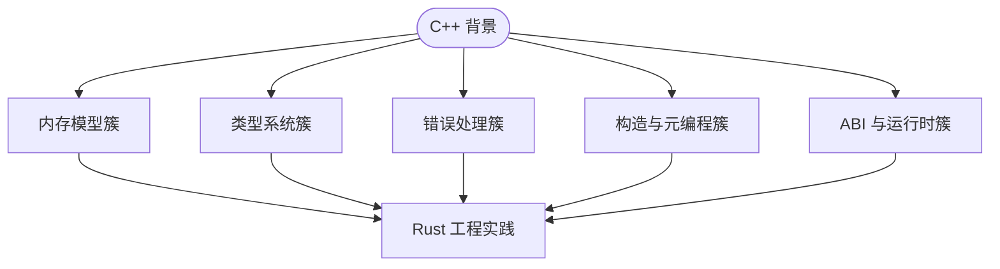
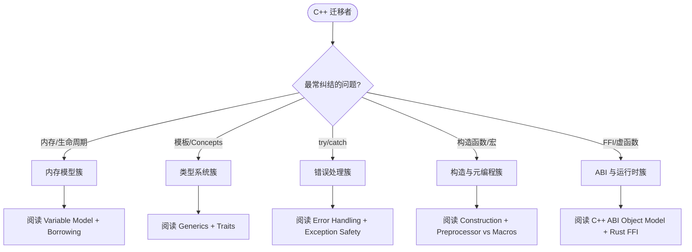

# C/C++ → Rust 工程层对比路线图
>
> **EN**: C/C++ to Rust Engineering Comparison Roadmap
> **Summary**: A unified roadmap and index for all C/C++ engineering-level comparison files, with topic clusters, migration paths, idiomatic code comparisons, and decision trees for C++ programmers moving to Rust.
> **Rust 版本**: 1.97.0+ (Edition 2024)
>
> **受众**: [进阶]
> **权威来源**: 本文件为 `concept/` 权威页。
> **层级**: L2-L5 跨层导航
> **A/S/P 标记**: C+S — Comparison + Structure
> **双维定位**: C×Ana / C×Eva
> **前置概念**: [Rust vs C++](../../05_comparative/01_systems_languages/01_rust_vs_cpp.md) · [Variable Model](../../01_foundation/03_values_and_references/03_variable_model.md)
> **后置概念**: [Pattern Semantic Space Index](pattern_semantic_space_index.md) · [C++ ABI Object Model](../../05_comparative/01_systems_languages/02_cpp_abi_object_model.md)
> **主要来源**:
> [Rust Reference](https://doc.rust-lang.org/reference/introduction.html) ·
> [TRPL](https://doc.rust-lang.org/book/title-page.html) ·
> [Brown University CRP Phrasebook](https://cel.cs.brown.edu/crp/) ·
> [Rust Foundation Interop Initiative](https://github.com/rustfoundation/interop-initiative)
---

> **Bloom 层级**: L2-L5

## 📑 目录

- [C/C++ → Rust 工程层对比路线图](#cc--rust-工程层对比路线图)
  - [📑 目录](#-目录)
  - [一、核心命题](#一核心命题)
  - [二、主题簇地图](#二主题簇地图)
    - [2.1 内存模型簇](#21-内存模型簇)
    - [2.2 类型系统簇](#22-类型系统簇)
    - [2.3 错误处理簇](#23-错误处理簇)
    - [2.4 构造与元编程簇](#24-构造与元编程簇)
    - [2.5 ABI 与运行时簇](#25-abi-与运行时簇)
  - [三、代码对比示例](#三代码对比示例)
    - [错误处理](#错误处理)
    - [泛型约束](#泛型约束)
  - [四、推荐学习路径](#四推荐学习路径)
    - [路径 A：C++ 系统程序员快速迁移](#路径-ac-系统程序员快速迁移)
    - [路径 B：按问题域切入](#路径-b按问题域切入)
  - [五、主题簇选择决策树](#五主题簇选择决策树)
  - [六、与 Phase B 计划的衔接](#六与-phase-b-计划的衔接)
  - [七、L1 / L2 / L3 总结](#七l1--l2--l3-总结)
  - [八、延伸阅读](#八延伸阅读)
  - [国际权威参考 / International Authority References（P0 官方 · P1 学术 · P2 生态）](#国际权威参考--international-authority-referencesp0-官方--p1-学术--p2-生态)

## 一、核心命题

> **C++ 程序员学习 Rust 的最大障碍不是语法，而是"同一工程问题在两门语言中的本体论差异"。
> 本路线图将 C/C++ → Rust 的对比内容组织为五个主题簇：内存模型、类型系统、错误处理、构造与元编程、ABI 与运行时，
> 帮助学习者按自己的知识缺口定位文件，而不是按文件编号顺序阅读。**



## 二、主题簇地图

本节给出 C++ → Rust 迁移学习的主题簇（topic cluster）地图，按「概念对应强度」分三环：

- **内环（直接对应）**：move 语义（C++ `&&` ⟷ Rust 默认 move）、RAII（析构 ⟷ `Drop`）、模板（模板 ⟷ 泛型 + trait 约束）、智能指针（`unique_ptr` ⟷ `Box`，`shared_ptr` ⟷ `Arc`）——这些簇的学习是「映射已会知识」；
- **中环（部分对应）**：const 正确性 ⟷ 借用规则（`&T` ≈ `const&` 但更强）、异常 ⟷ `Result`（机制不同，设计哲学同源）、虚函数 ⟷ `dyn Trait`/泛型分派——需要「重新学习边界」；
- **外环（无对应）**：借用检查器（C++ 无对应机制）、生命周期标注、`unsafe` 的契约纪律、Cargo 工程模型——全新概念，C++ 经验在此可能**误导**（如「引用就是指针」）。

地图用法：自评各簇的掌握度——内环快速过、中环重点辨析、外环从零学，避免「C++ 直觉」在外环的负迁移。

### 2.1 内存模型簇

| C++ 概念 | Rust 对应 | 文件 |
|:---|:---|:---|
| 所有权 / 智能指针 | 所有权系统 / `Box`/`Rc`/`Arc` | [Rust vs C++ §7](../../05_comparative/01_systems_languages/01_rust_vs_cpp.md) · [Ownership](../../01_foundation/01_ownership_borrow_lifetime/01_ownership.md) |
| 借用 / 引用 | `&T` / `&mut T` / 生命周期 | [Borrowing](../../01_foundation/01_ownership_borrow_lifetime/02_borrowing.md) · [Lifetimes](../../01_foundation/01_ownership_borrow_lifetime/03_lifetimes.md) |
| Move 语义 | 所有权转移 / `Copy` / `Clone` | [Rust vs C++ §7.3](../../05_comparative/01_systems_languages/01_rust_vs_cpp.md) · [Variable Model](../../01_foundation/03_values_and_references/03_variable_model.md) |
| RAII / 析构函数 | `Drop` trait | [Variable Model](../../01_foundation/03_values_and_references/03_variable_model.md) |
| 值类别（lvalue/xvalue/prvalue） | place / value expression | [Variable Model](../../01_foundation/03_values_and_references/03_variable_model.md) |

### 2.2 类型系统簇

| C++ 概念 | Rust 对应 | 文件 |
|:---|:---|:---|
| 模板 / 泛型 | Generics / Trait Bounds | [Generics](../../02_intermediate/01_generics/01_generics.md) · [Traits](../../02_intermediate/00_traits/01_traits.md) |
| SFINAE / `enable_if` | Trait Bounds / `where` | [Traits §5.8](../../02_intermediate/00_traits/01_traits.md) |
| C++20 Concepts | Trait + Bound | [Traits §5.8.5](../../02_intermediate/00_traits/01_traits.md) |
| 模板特化 / 偏特化 | Orphan Rule / Specialization | [Traits §5.8.3](../../02_intermediate/00_traits/01_traits.md) · [Advanced Traits](../../02_intermediate/00_traits/04_advanced_traits.md) |
| 运算符重载 | `std::ops` trait | [Type System](../../01_foundation/02_type_system/01_type_system.md) · [Surface Features](../../05_comparative/00_paradigms/03_cpp_rust_surface_features.md) |

### 2.3 错误处理簇

| C++ 概念 | Rust 对应 | 文件 |
|:---|:---|:---|
| 异常 / `try` / `catch` | `Result<T, E>` / `?` | [Error Handling](../../02_intermediate/03_error_handling/01_error_handling.md) |
| 异常安全保证 | 类型系统 + `Result` | [Exception Safety](../../02_intermediate/03_error_handling/04_exception_safety_rust_cpp.md) |
| `std::expected` (C++23) | `Result<T, E>` | [Exception Safety §6](../../02_intermediate/03_error_handling/04_exception_safety_rust_cpp.md) |
| `noexcept` | `panic` / abort | [Exception Safety §5](../../02_intermediate/03_error_handling/04_exception_safety_rust_cpp.md) |

### 2.4 构造与元编程簇

| C++ 概念 | Rust 对应 | 文件 |
|:---|:---|:---|
| 构造函数 / 初始化列表 | 结构体字面量 / `new` 约定 | [Construction](../../02_intermediate/00_traits/05_construction_and_initialization.md) |
| 默认构造 / `constexpr` | `Default` / `const fn` | [Construction](../../02_intermediate/00_traits/05_construction_and_initialization.md) |
| 三/五/零法则 | `Copy` / `Clone` / `Drop` | [Construction §5](../../02_intermediate/00_traits/05_construction_and_initialization.md) |
| 预处理器 / `#define` | `macro_rules!` / `#[cfg]` | [Preprocessor vs Macros](../../02_intermediate/06_macros_and_metaprogramming/05_c_preprocessor_vs_rust_macros.md) |
| 模板元编程 / `constexpr` | `const fn` / 类型级状态机 | [Traits §5.8.4](../../02_intermediate/00_traits/01_traits.md) |

### 2.5 ABI 与运行时簇

| C++ 概念 | Rust 对应 | 文件 |
|:---|:---|:---|
| ABI / 对象布局 | `repr(C)` / 默认 ABI | [C++ ABI Object Model](../../05_comparative/01_systems_languages/02_cpp_abi_object_model.md) |
| vtable / 虚函数 | `dyn Trait` 胖指针 | [C++ ABI Object Model](../../05_comparative/01_systems_languages/02_cpp_abi_object_model.md) |
| RTTI / `dynamic_cast` | `Any` / `TypeId` | [RTTI](../../02_intermediate/04_types_and_conversions/05_rtti_and_dynamic_typing.md) |
| `friend` | 模块可见性 | [Friend vs Module Privacy](../../02_intermediate/05_modules_and_visibility/02_friend_vs_module_privacy.md) |
| FFI / `extern "C"` | `extern "C"` / `unsafe` | [Rust FFI](../../03_advanced/04_ffi/01_rust_ffi.md) |

## 三、代码对比示例

本节聚焦「代码对比示例」，覆盖错误处理 与 泛型约束。论述顺序由定义到边界：先明确「代码对比示例」在「C/C++ → Rust 工程层对比路线图」中的确切含义与适用范围，再给出可核验的例证或数据，最后标注它与相邻主题的分界线。读完后应能用一句话复述「代码对比示例」的判定标准，并指出它在全页论证链中的位置。

### 错误处理

**C++**

```cpp
auto result = may_throw();
try {
    process(result.value());
} catch (const std::exception& e) {
    log(e.what());
}
```

**Rust**

```rust,ignore
let result = may_fail();
match result {
    Ok(v) => process(v),
    Err(e) => log(&e.to_string()),
}
// 或更简洁
process(may_fail()?);
```

### 泛型约束

**C++**

```cpp
template <typename T>
auto add(T a, T b) -> decltype(a + b) { return a + b; }
```

**Rust**

```rust
use std::ops::Add;

fn add<T: Add<Output = T>>(a: T, b: T) -> T { a + b }
```

## 四、推荐学习路径

本节给出 C++ 背景工程师的 6 周学习路径，按主题簇排序：

- **周 1-2：内环映射（建立信心）**：move/RAII/智能指针的对应学习——目标是「第一周就能写出惯用 Rust」；陷阱：过度使用 `.clone()`（对应 C++ 的拷贝习惯）需在第 2 周末纠正；
- **周 3-4：外环攻坚（核心壁垒）**：借用检查器与生命周期——每天「编译错误日记」（记录 E0502/E0106 实例与修复），两周内建立「借用直觉」；配套 `&str` vs `String` 的存储模型精读；
- **周 5：中环辨析（设计能力）**：错误处理工程化（`Result` 分层 vs 异常哲学的对照）、多态选择（`dyn` vs 泛型的判定）；
- **周 6：工程整合**：Cargo workspace、测试、一个「C++ 项目重写」练习——验收标准是「重写版无 `unsafe`、无 clone 滥用、错误处理分层」。

路径原则：外环概念不提前学（无前置会挫败），内环概念不重复学（已会的不浪费时间）。

### 路径 A：C++ 系统程序员快速迁移

```text
Rust vs C++（总体本体论）
    ↓
Variable Model（理解所有权 = 存储模型 + 线性约束）
    ↓
Construction（结构体字面量替代构造函数）
    ↓
Exception Safety（Result 替代异常）
    ↓
C++ ABI Object Model（FFI 必备）
    ↓
RTTI / Friend / Preprocessor（逐个主题扫尾）
```

### 路径 B：按问题域切入

| 你来自 C++ 的哪个领域 | 起点 | 延伸阅读 |
|:---|:---|:---|
| 底层系统 / 嵌入式 | [C++ ABI Object Model](../../05_comparative/01_systems_languages/02_cpp_abi_object_model.md) | [Rust FFI](../../03_advanced/04_ffi/01_rust_ffi.md) |
| 游戏 / 高性能计算 | [Variable Model](../../01_foundation/03_values_and_references/03_variable_model.md) | [Move 语义](../../05_comparative/01_systems_languages/01_rust_vs_cpp.md) |
| 企业后端 | [Exception Safety](../../02_intermediate/03_error_handling/04_exception_safety_rust_cpp.md) | [Error Handling](../../02_intermediate/03_error_handling/01_error_handling.md) |
| 编译器 / 元编程 | [Preprocessor vs Macros](../../02_intermediate/06_macros_and_metaprogramming/05_c_preprocessor_vs_rust_macros.md) | [Macros](../../03_advanced/03_proc_macros/01_macros.md) |

## 五、主题簇选择决策树



## 六、与 Phase B 计划的衔接

本路线图属于 **Phase B（C/C++ 工程层对比）** 的导航层。审计报告 [SEMANTIC_SPACE_CRITICAL_AUDIT_2026_05_24.md](../../../archive/08_quality_audits/08_reports_by_time/2026_07/SEMANTIC_SPACE_CRITICAL_AUDIT_2026_05_24.md)（归档只读） 指出的 Phase B 缺口包括：

- ABI 与对象模型 ✅ [C++ ABI Object Model](../../05_comparative/01_systems_languages/02_cpp_abi_object_model.md)
- Move 语义系统对比 ✅ [Rust vs C++ §7.3](../../05_comparative/01_systems_languages/01_rust_vs_cpp.md)
- 异常安全深度 ✅ [Exception Safety](../../02_intermediate/03_error_handling/04_exception_safety_rust_cpp.md)
- SFINAE / 模板元编程 ✅ [Traits §5.8](../../02_intermediate/00_traits/01_traits.md)
- 构造/初始化/运算符/RTTI/友元 ✅ [Surface Features](../../05_comparative/00_paradigms/03_cpp_rust_surface_features.md) + 专门文件
- 预处理器 vs 宏 ✅ [Preprocessor vs Macros](../../02_intermediate/06_macros_and_metaprogramming/05_c_preprocessor_vs_rust_macros.md)

## 七、L1 / L2 / L3 总结

| 层级 | 要点 |
|:---|:---|
| **L1** | C++ 与 Rust 在内存、类型、错误、构造、ABI 五个维度上都有可映射的对应概念。 |
| **L2** | Rust 通过类型系统、trait、模块可见性替代了 C++ 的构造函数、异常、friend、SFINAE 等语言内建机制。 |
| **L3** | 迁移的核心不是"找等价语法"，而是理解 Rust 如何通过去语法化和显式约束，把 C++ 中的隐式规则和特权语法转化为可静态检查的结构。 |

## 八、延伸阅读

- [Rust Foundation Interop Initiative](https://github.com/rustfoundation/interop-initiative)
- [Brown University C++↔Rust Phrasebook](https://cel.cs.brown.edu/crp/)
- [simplifycpp.org — C++ vs Rust](https://simplifycpp.org/books/cpp/CPP_Rust.pdf)
- [Tangram Vision — C++ Rust Generics](https://www.tangramvision.com/blog/c-rust-generics-and-specialization)
- [Pattern Semantic Space Index](pattern_semantic_space_index.md)

---

> **Checklist**: 已建立 C/C++ → Rust 工程层对比的主题簇地图 / 提供学习路径 / 衔接 Phase B 审计计划。

---

## 国际权威参考 / International Authority References（P0 官方 · P1 学术 · P2 生态）

> 依据 `AGENTS.md` §2「对齐网络国际化权威内容」补充：仅追加已验证可达的权威链接，不改动正文事实。
> **内容分级**: [综述级]

- **P1 学术/形式化**: [Oxide: The Essence of Rust (arXiv:1903.00982)](https://arxiv.org/abs/1903.00982)
