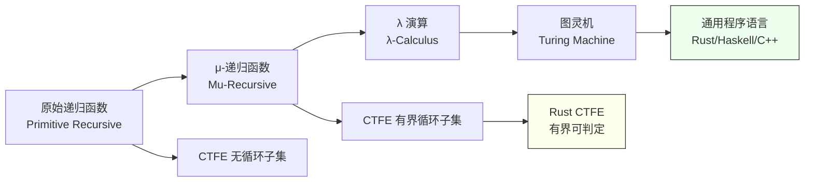
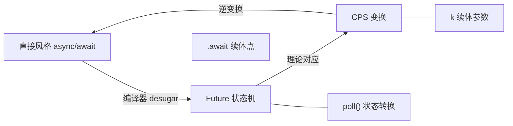
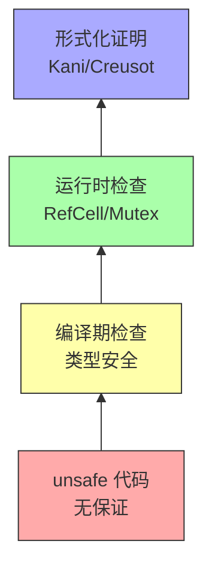
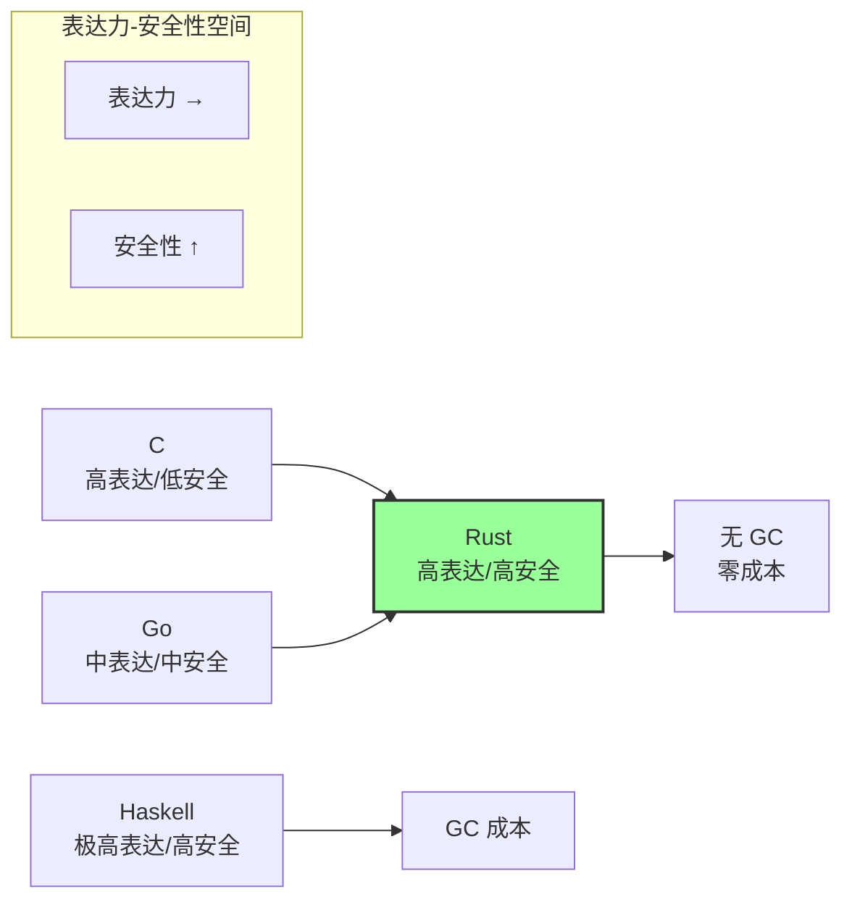
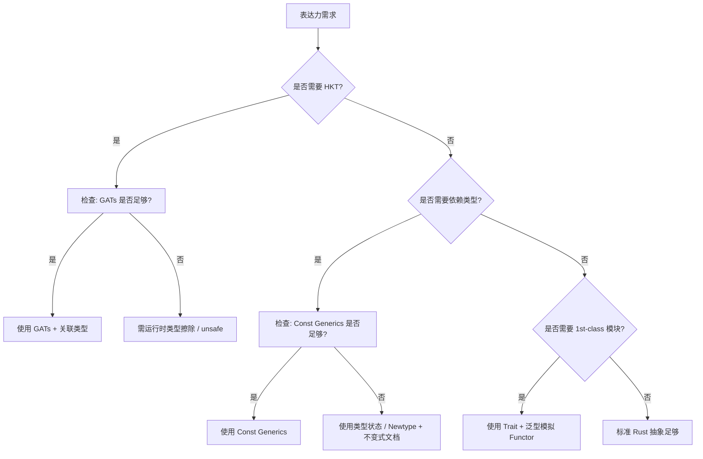

# Rust 语义表达力多视角深化（Multiview Expressiveness Analysis）
>
> **EN**: Expressiveness Multiview
> **Summary**: Expressiveness Multiview. Core Rust concept.
> **受众**: [研究者]
> **定位**: 本文件从**纵向理论视角**（计算/类型/控制/内存/并发/抽象/安全）深化 Rust 的表达能力，与 `semantic_expressiveness.md` 的**横向七维光谱**形成正交互补。前者回答「Rust 能表达什么」，后者回答「Rust 从哪些维度表达」。
> **原则**: 不做"语法特性列表"，聚焦"每个理论视角下 Rust 的表达边界、与其他语言的等价性、以及形式化基础"。
> **对齐来源**:
>
> [Rust Reference](https://doc.rust-lang.org/reference/) ·
> [Rust RFCs](https://rust-lang.github.io/rfcs/) ·
> [RustBelt / Oxide](https://plv.mpi-sws.org/rustbelt/) ·
> [Felleisen — On the Expressive Power of Programming Languages](https://doi.org/10.1007/BF00119822) ·
> [Programming Language Semantics](https://en.wikipedia.org/wiki/Semantics_(computer_science))
>
> **对比语言**: Rust · C++ · Go · Haskell · OCaml · Erlang
> **定理链**: N/A — 描述性/综述性/导航性文档，不涉及形式化定理链
>
> **来源**: [TRPL](https://doc.rust-lang.org/book/title-page.html) · [Rust Reference](https://doc.rust-lang.org/reference/)
---

> **Bloom 层级**: 分析 → 评价 → 创造

**变更日志**:

- v1.0 (2026-05-21): 初始版本——七视角表达力深化 + Curry-Howard 对应 + CPS/async 等价性 + π 演算映射 + 参数性 + IFC

---

## 📑 目录

- [Rust 语义表达力多视角深化（Multiview Expressiveness Analysis）](#rust-语义表达力多视角深化multiview-expressiveness-analysis)
  - [📑 目录](#-目录)
  - [零、TL;DR —— 七视角表达力速查](#零tldr--七视角表达力速查)
  - [一、权威来源与梳理方法论](#一权威来源与梳理方法论)
    - [1.1 理论视角与形式化根基](#11-理论视角与形式化根基)
    - [1.2 Felleisen 表达力度量框架](#12-felleisen-表达力度量框架)
  - [二、计算语义视角](#二计算语义视角)
    - [2.1 可计算性谱系](#21-可计算性谱系)
    - [2.2 Rust CTFE 的有界子集](#22-rust-ctfe-的有界子集)
  - [三、类型语义视角](#三类型语义视角)
    - [3.1 Curry-Howard 对应在 Rust 中的实例](#31-curry-howard-对应在-rust-中的实例)
    - [3.2 类型即命题：Result 与排中律](#32-类型即命题result-与排中律)
    - [3.3 刻意缺失的表达力：HKT 与 1st-class 模块](#33-刻意缺失的表达力hkt-与-1st-class-模块)
  - [四、控制语义视角](#四控制语义视角)
    - [4.1 Continuation-Passing Style 与 async/await](#41-continuation-passing-style-与-asyncawait)
    - [4.2 状态机变换的三重等价性](#42-状态机变换的三重等价性)
    - [4.3 生成器（Generator）与协程](#43-生成器generator与协程)
  - [五、内存语义视角](#五内存语义视角)
    - [5.1 资源语义学（Resource Semantics）](#51-资源语义学resource-semantics)
    - [5.2 所有权作为线性资源的实例](#52-所有权作为线性资源的实例)
  - [六、并发语义视角](#六并发语义视角)
    - [6.1 π 演算（Pi Calculus）与 Channel 移动](#61-π-演算pi-calculus与-channel-移动)
    - [6.2 会话类型（Session Types）的 Rust 编码](#62-会话类型session-types的-rust-编码)
  - [七、抽象语义视角](#七抽象语义视角)
    - [7.1 参数性（Parametricity）与 "Theorems for Free"](#71-参数性parametricity与-theorems-for-free)
    - [7.2 模块系统表达力边界](#72-模块系统表达力边界)
  - [八、安全语义视角](#八安全语义视角)
    - [8.1 信息流控制（IFC）的可编码性](#81-信息流控制ifc的可编码性)
    - [8.2 类型安全作为格（Lattice）上的推导](#82-类型安全作为格lattice上的推导)
  - [九、表达力–安全性帕累托前沿](#九表达力安全性帕累托前沿)
  - [十、Rust 1.95 特性的表达力映射](#十rust-195-特性的表达力映射)
  - [十一、思维表征体系](#十一思维表征体系)
    - [11.1 七视角表达力雷达图](#111-七视角表达力雷达图)
    - [11.2 形式化边界推理树](#112-形式化边界推理树)
  - [十二、定理推理链](#十二定理推理链)
    - [定理一致性矩阵（表达力多视角专集）](#定理一致性矩阵表达力多视角专集)
  - [十三、相关概念链接（L0-L7 映射）](#十三相关概念链接l0-l7-映射)
    - [L0-L7 纵向映射](#l0-l7-纵向映射)
    - [相关概念文件](#相关概念文件)
  - [认知路径](#认知路径)
    - [核心推理链](#核心推理链)
    - [反命题与边界](#反命题与边界)
  - [嵌入式测验（Embedded Quiz）](#嵌入式测验embedded-quiz)
    - [测验 1：本文档《Rust 语义表达力多视角深化（Multiview Expressiveness Analysis）》在 Rust 知识体系中属于哪一层级的元数据？（理解层）](#测验-1本文档rust-语义表达力多视角深化multiview-expressiveness-analysis在-rust-知识体系中属于哪一层级的元数据理解层)
    - [测验 2：《Rust 语义表达力多视角深化（Multiview Expressiveness Analysis）》的主要用途是什么？（理解层）](#测验-2rust-语义表达力多视角深化multiview-expressiveness-analysis的主要用途是什么理解层)
    - [测验 3：元数据层文档能否替代 L1-L7 的核心概念学习？（理解层）](#测验-3元数据层文档能否替代-l1-l7-的核心概念学习理解层)

---

## 零、TL;DR —— 七视角表达力速查

```text
视角                Rust 表达边界                      形式化对应                    缺失与补偿
─────────────────────────────────────────────────────────────────────────────────────────────────
计算语义            图灵完备 + CTFE 有界子集            递归函数 → 图灵机 → 有界 FSM    CTFE 无堆分配
类型语义            System Fω 子集 + 依赖类型子集        Curry-Howard (类型即命题)       无 HKT → GATs + 宏
控制语义            结构化 + CPS + async/await          λ 演算 + 状态机 ↔ CPS 等价      无 call/cc → async/await
内存语义            所有权 + 区域 + 分离逻辑             仿射逻辑 / 资源语义学            无 GC → RAII + 借用
并发语义            Send/Sync + CSP + Actor             π 演算 / 进程代数 / 会话类型      无 STM → 类型系统保证
抽象语义            Trait + 泛型 + 宏                   参数性 / 范畴论态射              无 1st-class 模块
安全语义            编译期 safe + unsafe 逃逸门          格论 / 信息流控制 (IFC)          不保证活性/终止
─────────────────────────────────────────────────────────────────────────────────────────────────
```

---

## 一、权威来源与梳理方法论

### 1.1 理论视角与形式化根基

| 视角 | 形式化理论 | 经典来源 | Rust 映射 |
|:---|:---|:---|:---|
| 计算语义 | 可计算性理论、λ 演算 | Church 1936, Turing 1936 | `fn` / closures / CTFE |
| 类型语义 | 类型论、证明论 | Curry-Howard 1969, Martin-Löf 1984 | `type` / `trait` / `impl` |
| 控制语义 | 续体（Continuation）、控制流分析 | Reynolds 1972, Danvy 1990s | `async/await` / `?` / `match` |
| 内存语义 | 分离逻辑、区域类型 | Reynolds 2002, Tofte-Talpin 1994 | 所有权 / 生命周期 / `unsafe` |
| 并发语义 | 进程代数、会话类型 | Milner CCS 1980, Honda 1993 | `std::thread` / `mpsc` / `async` |
| 抽象语义 | 参数多态、范畴论 | Strachey 1967, Wadler 1989 | `trait` / `<T>` / monomorphization |
| 安全语义 | 信息流控制、格论 | Denning 1976, Volpano 1996 | `unsafe` / `Send` / `Sync` |

### 1.2 Felleisen 表达力度量框架

> **Felleisen 原则**: 语言 L' 比语言 L 更具表达力，当且仅当存在 L' 中的程序 P'，使得 L 中不存在任何程序 P 与 P' 在相同上下文中的行为等价，且这种差异不能通过局部宏/语法糖消除。 [来源: Felleisen, *On the Expressive Power of Programming Languages*, 1990]

在 Felleisen 框架下评估 Rust 的表达力增量：

| 特性 | 是否为表达力增量？ | 理由 |
|:---|:---:|:---|
| `?` 运算符 | ❌ 否 | 局部语法糖，可展开为 `match` |
| `async/await` | ✅ 是 | 引入无栈协程和惰性求值，改变控制流语义 |
| `macro_rules!` | ⚠️ 部分 | 卫生宏提供局部变换能力，但非全局语义扩展 |
| `unsafe` 块 | ✅ 是 | 解除类型系统约束，扩展可观察行为集合 |
| `const fn` | ⚠️ 部分 | 在类型级引入计算，但受限（无堆分配） |
| GATs | ✅ 是 | 将类型构造子引入 trait 系统，对应 System F_ω |

---

## 二、计算语义视角

### 2.1 可计算性谱系

Rust 的计算表达力位于**可计算性谱系的顶层**（图灵完备），但其编译期计算子集（CTFE）位于谱系的**有界子集**。



> **认知功能**: 该图将 Rust CTFE 置于**可计算性谱系**的精确位置（原始递归与有界 μ-递归之间），帮助读者理解编译期计算的表达力边界。建议对照右侧表格阅读，区分「运行时图灵完备」与「编译期有界可判定」的本质差异。关键洞察：CTFE 的「无堆分配」限制并非实现缺陷，而是维持编译期停机保证的核心理论手段。[来源: 💡 原创分析]
> [来源: [Rust Reference](https://doc.rust-lang.org/reference/)]

| 计算模型 | 停机性 | 表达能力 | Rust 对应 |
|:---|:---:|:---|:---|
| 原始递归函数 | 必然停机 | 无 while/for | CTFE 中无递归/无循环的子集 |
| μ-递归函数 | 可能不停机 | 有 while/for | CTFE 有界循环（步数上限） |
| λ 演算 | 可能不停机 | 高阶函数 | Rust closures / HOF |
| 图灵机 | 可能不停机 | 通用计算 | Safe Rust 完整子集 |
| 带 I/O 的图灵机 | 可能不停机 | 交互计算 | Rust 完整程序（含 `std::io`） |

> **关键洞察**: Rust 刻意将编译期计算限制在**原始递归函数 + 有界 μ-算子**的范围内，以换取编译期停机保证。运行时计算则无此限制。 [来源: Ralf Jung blog, *Thoughts on CTFE and Type Systems*, 2018]

### 2.2 Rust CTFE 的有界子集

CTFE 的表达能力边界可通过**算术层级**（Arithmetical Hierarchy）理解：

- **Δ₀ 公式**（有界量化）：CTFE 可表达（如数组长度计算、简单循环）。
- **Σ₁ 公式**（存在量化的无界搜索）：CTFE 不可直接表达（无无限 `while` 循环的语义保证）。
- **运行时 Rust**: 可表达完整的算术层级（图灵完备）。

---

## 三、类型语义视角

### 3.1 Curry-Howard 对应在 Rust 中的实例

> **Curry-Howard 同构**: 类型系统与直觉主义逻辑之间存在一一对应——类型是命题，程序是证明，类型检查是证明验证。 [来源: Howard 1969, *The Formulae-as-Types Notion of Construction*]

Rust 的类型系统虽非纯函数式，但仍存在丰富的 Curry-Howard 对应实例：

| 逻辑概念 | 类型论对应 | Rust 实例 |
|:---|:---|:---|
| 真（⊤） | 单位类型 | `()` —— 总是可构造 |
| 假（⊥） | 空类型 | `!` (never type) —— 不可构造 |
| 合取（∧） | 积类型 | `(A, B)` / `struct Foo { a: A, b: B }` |
| 析取（∨） | 和类型 | `enum Either<A, B> { Left(A), Right(B) }` |
| 蕴含（→） | 函数类型 | `fn(A) -> B` —— "有 A 则可得 B" |
| 全称量化（∀） | 泛型 | `fn id<T>(x: T) -> T` —— "对所有 T 成立" |
| 存在量化（∃） | 存在类型 / Trait 对象 | `dyn Trait` —— "存在某个实现" |
| 否定（¬） | 函数到空类型 | `fn(A) -> !` —— "A 导致矛盾" |

**Rust 特有扩展**：

- **线性蕴含（⊸）**: `A` 被消费后产生 `B`，对应 Rust 的 move 语义：`fn consume(a: A) -> B`。
- **仿射弱化（Weakening）**: Rust 允许安全的资源丢弃（`mem::forget`），对应仿射逻辑而非严格线性逻辑。

### 3.2 类型即命题：Result 与排中律

> **命题**: Rust 的 `Result<T, E>` 编码了**经典逻辑中的排中律的构造性版本**。

```rust
// 构造性排中律：不是「T 或 ¬T」，而是「T 或 E」
enum Result<T, E> {
    Ok(T),   // 证明：计算成功，值存在
    Err(E),  // 证明：计算失败，错误信息存在
}

// 对比：Option<T> 编码了「可空性」的可判定性
enum Option<T> {
    Some(T), // 证明：值存在
    None,    // 证明：值不存在
}
```

在直觉主义逻辑中，**排中律（T ∨ ¬T）不成立**。Rust 不直接提供「值存在或不存在」的无信息判断，而是要求程序处理两种情况的**证据（evidence）**。这与 C++/Java 的异常（无结构化证据）有本质区别。

> **定理 T-EX-001（Result 的构造性完备性）**:
> `Result<T, E>` 在 Rust 类型系统中是**代数完备**的——它形成了 `T` 和 `E` 的**标记联合（tagged union）**，
> 且 `?` 运算符提供了构造性的错误传播 monad，对应直觉主义逻辑中的**续体（continuation）**构造。
> 来源: [Rust Reference §8, *The Rust Programming Language* §9](https://doc.rust-lang.org/reference/)

### 3.3 刻意缺失的表达力：HKT 与 1st-class 模块

| 缺失特性 | 理论表达力 | Rust 现状 | 补偿机制 | 代价 |
|:---|:---:|:---|:---|:---|
| 高阶类型（HKT） | `Monad<M<_>>` | ❌ 不支持 | GATs (`type Assoc<T>`) | 语法冗余 |
| 1st-class 模块 | 模块作为值传递 | ❌ 不支持 | Trait + 泛型参数 | 无模块级封装 |
| 完整依赖类型 | 类型依赖值 | ❌ 不支持 | Const Generics（受限子集） | 无法表达任意不变式 |
| 类型级递归 | `μX.F<X>` | ❌ 直接不支持 | 间接通过 `Box<T>` / 指针 | 显式堆分配 |
| 子类型多态 | `Cat <: Animal` | ⚠️ 仅生命周期 | 无结构子类型 | 需显式 `From`/`Into` |

> **设计原理**: 这些缺失并非实现限制，而是**表达力-可判定性权衡**的刻意选择。
> HKT 会使类型推断退化为不可判定（或至少缺乏 principal type）；
> 完整依赖类型使类型等价检查涉及任意计算，因而不可判定。
> [来源: Rust Internals Forum, *Why no HKT*; Pierce *TAPL* §30]

---

## 四、控制语义视角

### 4.1 Continuation-Passing Style 与 async/await

> **核心命题**: Rust 的 `async/await` 可被编译器降阶（desugar）为**无栈协程（stackless coroutine）**，而后者与**Continuation-Passing Style（CPS）**变换之间存在精确的语义等价性。

**CPS 变换原理**:
在 CPS 中，每个函数接收一个额外的「续体」参数 `k`，表示「计算完成后该做什么」：

```haskell
-- 直接风格
add :: Int -> Int -> Int
add x y = x + y

-- CPS 风格
add_cps :: Int -> Int -> (Int -> r) -> r
add_cps x y k = k (x + y)
```

Rust 的 `async/await` 本质上是一种**受限的、编译器自动生成的 CPS 变换**：

- `.await` 点是**续体边界**——在这里当前状态被保存，控制流返回到 executor。
- `Future::poll` 的 `Context` 参数携带了**续体信息**（Waker），用于在资源就绪时恢复执行。

```rust,ignore
// 直接风格（伪代码）
async fn fetch_and_process(url: &str) -> Result<Data, Error> {
    let response = fetch(url).await?;  // 续体点 1
    let data = parse(response).await?; // 续体点 2
    Ok(data)
}

// 编译器生成的 CPS/状态机等价（概念性）
enum FetchAndProcessState<'a> {
    Start { url: &'a str },
    AfterFetch { response: Response },
    AfterParse { data: Data },
    Done,
}

impl<'a> Future for FetchAndProcessFuture<'a> {
    type Output = Result<Data, Error>;
    fn poll(mut self: Pin<&mut Self>, cx: &mut Context<'_>) -> Poll<Self::Output> {
        loop {
            match self.state {
                Start { url } => {
                    self.state = WaitingFetch(fetch(url));
                }
                WaitingFetch(ref mut fut) => match fut.poll(cx) {
                    Poll::Ready(Ok(r)) => self.state = AfterFetch { response: r },
                    Poll::Ready(Err(e)) => return Poll::Ready(Err(e)),
                    Poll::Pending => return Poll::Pending,
                }
                // ... 类似处理 AfterFetch, AfterParse
            }
        }
    }
}
```

### 4.2 状态机变换的三重等价性

> **定理 T-EX-002（async/await 三重等价性）**: 对任意 well-typed 的 `async fn`，以下三种形式在语义上等价：
>
> 1. **直接风格 async/await**（源代码）
> 2. **显式 Future 状态机**（编译器生成）
> 3. **CPS 变换**（理论对应）
> 等价性在「相同的 poll 调用序列产生相同的输出」的意义上成立。 [来源: [RFC 2394](https://rust-lang.github.io/rfcs//2394-async_await.html), *Asynchronous Programming in Rust*; Danvy & Filinski, *Representing Control*, 1990]



> **认知功能**: 该图展示 `async/await`、Future 状态机与 CPS 三种表示之间的**循环等价关系**，帮助读者穿透语法糖理解控制流的本质变换。
> 建议用于打破「async 是魔法」的认知障碍——它只是一套编译器自动执行的、有严格理论对应的重写规则。
> 关键洞察：`.await` 续体点、`poll()` 状态转换与 CPS 续体参数三者一一对应，这是异步 Rust 所有优化和诊断的理论基础。[来源: 💡 原创分析]

### 4.3 生成器（Generator）与协程

Rust 的 `gen` blocks（nightly 实验性，`#![feature(gen_blocks)]`）进一步扩展了控制流表达力：

```rust,ignore
// gen block: 懒性迭代器生成
let gen = gen {
    yield 1;
    yield 2;
    yield 3;
};
```

`gen` blocks 与 `async` 共享相同的**编译器状态机变换基础设施**，但语义不同：

- `async`: 状态机由**外部 executor** 驱动（poll 模型）。
- `gen`: 状态机由**消费者迭代**驱动（`next()` 模型）。

二者都是**非对称协程（asymmetric coroutine）**——控制流总是返回到调用者/调度器，而非任意跳转到另一个协程。这与对称协程（如 Lua `coroutine.transfer`）有表达力差异。

---

## 五、内存语义视角

### 5.1 资源语义学（Resource Semantics）

> **资源语义学**: 将内存位置、文件句柄、锁等计算资源视为**逻辑命题**，程序的执行是资源命题的转换过程。
> [来源: Ishtiaq & O'Hearn, *BI as an Assertion Language*, 2001; Reynolds, *Separation Logic*, 2002]

Rust 的所有权系统可被精确地映射到资源语义学：

| 资源语义概念 | Rust 对应 | 逻辑形式 |
|:---|:---|:---|
| 资源 | 值的所有权 | `x ↦ v`（x 指向值 v） |
| 资源组合 | 元组/结构体 | `P * Q`（分离合取） |
| 资源转移 | move 语义 | `P ⊸ Q`（线性蕴含） |
| 资源借用 | `&T` / `&mut T` | `borrow(P)`（分数权限） |
| 资源释放 | `Drop` | `P → emp`（资源消去） |

### 5.2 所有权作为线性资源的实例

> **定理 T-EX-003（所有权-资源同构）**: Rust 的 Safe Rust 子集在操作语义上等价于一个**仿射资源演算（Affine Resource Calculus）**：
>
> - 每个值对应一个资源命题。
> - move 语义对应资源的**精确转移**（而非复制）。
> - `Copy` trait 对应资源的**无限复制模态**（`!A` 在线性逻辑中）。
> - `Drop` 对应资源的**显式消去**。 来源: [RustBelt](https://plv.mpi-sws.org/rustbelt/)

```mermaid
graph TD
    A[线性逻辑 Girard 1987] --> B[仿射逻辑]
    B --> C[分离逻辑 Reynolds 2002]
    C --> D[Iris 高阶并发分离逻辑]
    D --> E[RustBelt](https://plv.mpi-sws.org/rustbelt/)
    E --> F[Rust 所有权系统]

    A --- A1["!A = Copy"]<--> F1[Copy trait]
    A --- A2[A ⊗ B = 资源组合]<--> F2["(A, B)"]
    A --- A3[A ⊸ B = 线性蕴含]<--> F3[move 语义]
    B --- B1[弱化允许丢弃]<--> F4[mem::forget 安全]
    C --- C1[P * Q = 分离合取]<--> F5[struct 字段独立]
```

> **认知功能**: 该图将线性逻辑到 Rust 所有权的**理论传承链**可视化，并标注了每个逻辑概念与 Rust 机制的双向对应。
> 建议用于理解「为什么所有权系统是这样的」——它并非凭空设计，而是资源语义学的工程实例化。
> 关键洞察：`Copy` 对应线性逻辑的 `!A`（无限复制模态），这是 Rust 区别于严格线性类型系统的关键设计——允许安全的资源丢弃（弱化）。
> [来源: 💡 原创分析]

---

## 六、并发语义视角

### 6.1 π 演算（Pi Calculus）与 Channel 移动

> **π 演算**（Robin Milner, 1992）是并发进程代数的最小完备模型，核心操作只有三种：并行组合（`P | Q`）、通道输入（`c(x).P`）、通道输出（`c<v>.Q`）。 [来源: Milner, *The Polyadic π-Calculus*, 1992]

Rust 的 `std::sync::mpsc` 和 `crossbeam-channel` 在语义上对应 π 演算的**多adic 通道**（传递多个值），且 Rust 的所有权语义为 π 演算增加了**线性通道**的变体：

| π 演算概念 | Rust 对应 | 关键差异 |
|:---|:---|:---|
| 通道 `c` | `Sender<T>` / `Receiver<T>` | Rust 通道是**有类型的** |
| 通道输出 `c<v>.P` | `sender.send(v)` | Rust 中 `v` 的**所有权转移**到通道 |
| 通道输入 `c(x).P` | `receiver.recv()` | Rust 中 `x` 的**所有权从通道转移**到接收者 |
| 并行组合 `P \| Q` | `thread::spawn` | Rust 线程是 OS 级，非轻量级 |
| 通道限制 `(νc)P` | 通道在作用域内创建 | Rust 通道生命周期由类型系统管理 |
| 进程复制 `!P` | 无直接对应 | Rust 无隐式进程复制（需显式 `clone`） |

> **关键洞察**:
> Rust 的所有权语义使通道通信变成了**线性 π 演算（Linear π-Calculus）**的实例——值通过通道移动后，发送者不再拥有它，这**在编译期排除了「发送后继续使用」的 race condition**。
> 这是纯 π 演算（无线性类型）需要运行时检查或设计约定才能避免的错误。 [来源: Kobayashi, *A New Type System for Fault-Tolerant π-Calculus*, 2003]

### 6.2 会话类型（Session Types）的 Rust 编码

> **会话类型**: 为通道通信协议赋予类型，保证通信双方遵循相同的协议顺序（如「先发送 i32，再接收 String，最后关闭」）。
> [来源: Honda, *Types for Dyadic Interaction*, 1993]

Rust 虽无原生会话类型，但可通过**类型状态（Typestate）模式**编码：

```rust,ignore
// 会话类型编码：Client 发送请求，接收响应，关闭
struct ClientSend;
struct ClientRecv;
struct ClientClose;

struct ClientChannel<State> {
    tx: Sender<Request>,
    rx: Receiver<Response>,
    _state: PhantomData<State>,
}

impl ClientChannel<ClientSend> {
    fn send(self, req: Request) -> ClientChannel<ClientRecv> {
        self.tx.send(req).unwrap();
        ClientChannel { tx: self.tx, rx: self.rx, _state: PhantomData }
    }
}

impl ClientChannel<ClientRecv> {
    fn recv(self) -> (Response, ClientChannel<ClientClose>) {
        let resp = self.rx.recv().unwrap();
        (resp, ClientChannel { tx: self.tx, rx: self.rx, _state: PhantomData })
    }
}
```

> **表达力评价**: Rust 的类型状态编码在**表达力上等价于会话类型**，但需要更多的样板代码（PhantomData + 状态转换方法）。这符合 Rust 的设计哲学——**表达能力存在，但需显式编码**，而非语言内置抽象。 [来源: *Session Types in Rust*, Vasconcelos et al., 2016; Rust RFC 讨论]

---

## 七、抽象语义视角

### 7.1 参数性（Parametricity）与 "Theorems for Free"

> **参数性（Parametricity）**: 多态函数的行为与其类型参数无关——它必须以统一的方式处理所有可能的类型实例。 [来源: Reynolds, *Types, Abstraction and Parametric Polymorphism*, 1983; Wadler, *Theorems for Free!*, 1989]

Rust 的泛型系统满足参数性：

```rust
// 参数性保证：id 函数对任何 T 的行为都相同
fn id<T>(x: T) -> T { x }

// 由参数性可推出的「免费定理」:
// ∀ f: A -> B, id(f(x)) == f(id(x))
// 即 id 与任何函数可交换
```

**Rust 参数性的边界**:

- `Drop` trait 破坏了纯参数性：泛型类型可能在 drop 时执行与类型相关的副作用。
- `unsafe` 代码可绕过参数性：通过类型擦除和裸指针转换实现「类型分支」。
- ` specialization `（若稳定）将进一步弱化参数性：允许根据类型特性选择不同实现。

> **定理 T-EX-004（Rust 受限参数性）**: 在 Safe Rust、无 `Drop` 副作用、无 `specialization` 的条件下，Rust 泛型满足**参数性定理**——可从类型签名推导出程序的行为等价性。 [来源: Wadler 1989, *Theorems for Free!*]

### 7.2 模块系统表达力边界

Rust 的模块系统采用**基于文件的层次命名空间**，而非 ML 的**1st-class 模块**（模块可作为值传递、可作为泛型参数）。

| 特性 | ML 模块 | Rust 模块 |
|:---|:---|:---|
| 模块作为值 | ✅ 支持 | ❌ 不支持 |
| 模块作为类型参数 | ✅ 支持（functor） | ❌ 不支持 |
| 模块签名（signature） | ✅ 显式 | ⚠️ 隐式（通过 `pub` 可见性） |
| 模块嵌套 | ✅ 任意 | ✅ 任意（文件 + `mod`） |
| 模块隔离编译 | ✅ 支持 | ✅ 支持（crate 为单位） |

**补偿机制**: Rust 用 **Trait + 泛型** 模拟 ML Functor 的大部分用例：

```rust,ignore
// ML functor: functor MakeSet(Element: ORDERED) -> SET
// Rust 等价:
trait Ordered { fn cmp(&self, other: &Self) -> Ordering; }
struct Set<T: Ordered> { /* ... */ }
```

> **表达力差异**: Trait 无法满足「模块参数化 over 多个相互依赖的类型」的场景（如「一个模块参数化 over 一个完整的代数结构群」），这是 Rust 相对 ML/OCaml 的表达力损失。 [来源: Dreyer, *Understanding and Evolving the ML Module System*, 2005]

---

## 八、安全语义视角

### 8.1 信息流控制（IFC）的可编码性

> **信息流控制（Information Flow Control）**: 保证高安全级别的数据不会流向低安全级别的通道。经典模型：标签 `L`（低）< `H`（高），禁止 `H` → `L` 的隐式流。 [来源: Denning, *A Lattice Model of Secure Information Flow*, 1976]

Rust 的类型系统可**部分编码** IFC：

```rust
// 使用 Newtype + 私有字段编码安全级别
struct High<T>(T);  // High 安全级别
struct Low<T>(T);   // Low 安全级别

// 允许：低 → 高（提升安全级别）
impl<T> From<Low<T>> for High<T> {
    fn from(l: Low<T>) -> Self { High(l.0) }
}

// 禁止：高 → 低（编译期拒绝）
// impl<T> From<High<T>> for Low<T> { ... } // 违反策略，不实现！
```

但 Rust 缺乏原生 IFC 支持：

- 无**隐式流检查**（如 `if high_value { low_value = 1 }` 的隐式信息泄露）。
- 无**标签多态**（函数可参数化 over 安全级别）。
- 无**运行时标签跟踪**（如 JIF / LIO 中的动态标签检查）。

> **表达力边界**: Rust 的类型系统足够表达**静态 IFC 策略**（通过类型状态和 PhantomData），但无法表达**动态 IFC**（需要运行时标签系统）。这通常通过外部工具（如 Miri 的特定插件或独立分析器）补充。 [来源: Zdancewic, *Programming Languages for Information Security*, 2004]

### 8.2 类型安全作为格（Lattice）上的推导

Rust 的安全层级可建模为一个**格（Lattice）**：



> **认知功能**: 该格图将 Rust 的四层安全保证建模为**偏序结构**，从 unsafe（无保证）向上到形式化证明（最强保证），呈现安全强度的递进关系。建议用于评估项目中各模块应采用的安全策略层级。关键洞察：这是一个格而非链——运行时检查（RefCell/Mutex）与编译期检查在不同维度上各有优势，并非简单的上下位关系。[来源: 💡 原创分析]

| 安全层级 | 保证 | 机制 | 可判定性 |
|:---|:---|:---|:---:|
| L0 `unsafe` | 无编译期保证 | 程序员责任 | — |
| L1 Safe Rust | 无 UAF/DF/数据竞争 | 类型系统 + 借用检查 | ✅ |
| L2 运行时检查 | 无 panic（特定操作） | `RefCell` / `Mutex` / 边界检查 | 运行时 |
| L3 形式化验证 | 功能正确性 | Kani / Creusot / Verus | 半自动 |

---

## 九、表达力–安全性帕累托前沿

> **帕累托前沿**: 在表达力和安全性两个维度上，Rust 位于当前工业语言的前沿——无 GC 下的内存安全 + 零成本抽象。



> **认知功能**: 该图在「表达力×安全性」二维空间中定位主流语言，直观展示 Rust 位于**帕累托前沿**的相对位置。建议用于技术选型讨论——当别人问「为什么选 Rust 不选 Go/C++」时，这张图是最精炼的回答。关键洞察：Rust 的独特价值不在于单项最强，而在于「无 GC 下的高表达 + 高安全」这一此前工业语言未曾占据的生态位。[来源: 💡 原创分析]

| 语言 | 表达力 | 安全性 | 运行时成本 | 帕累托评价 |
|:---|:---:|:---:|:---:|:---|
| C/C++ | ⭐⭐⭐⭐⭐ | ⭐⭐ | 零成本 | 高表达低安全，不在前沿 |
| Go | ⭐⭐⭐ | ⭐⭐⭐ | GC | 中表达中安全，不在前沿 |
| Java | ⭐⭐⭐ | ⭐⭐⭐⭐ | GC + 运行时检查 | 中表达中高安全，不在前沿 |
| Haskell | ⭐⭐⭐⭐⭐ | ⭐⭐⭐⭐⭐ | GC + 惰性求值开销 | 极高表达极高安全，但有 GC |
| Rust | ⭐⭐⭐⭐ | ⭐⭐⭐⭐⭐ | 零成本（Safe Rust） | **帕累托前沿** |
| 依赖类型语言 (Idris/Agda) | ⭐⭐⭐⭐⭐ | ⭐⭐⭐⭐⭐ | 证明开销 | 理论上更优，但工业成熟度低 |

---

## 十、Rust 1.95 特性的表达力映射

| 1.95 特性 | 表达力维度 | 理论意义 | 边界特征 |
|:---|:---|:---|:---|
| `if let` guards in match | 控制流 + 模式 | 将 `let` chains 能力引入模式匹配，增强局部推理 | 不改变全局表达力（局部语法扩展） |
| `assert_matches!` | 控制流 + 类型 | 模式断言的标准化，减少样板测试代码 | 宏级表达力，无语义增量 |
| `cfg_select!` | 元编程 | 编译期条件选择的表达力扩展 | 纯编译期，无运行时语义 |
| `core::hint::cold_path` | 优化提示 | 向编译器表达「此分支很少执行」的语义知识 | 不改变语言语义，仅优化提示 |
| `as_ref_unchecked` / `as_mut_unchecked` | 内存 + 安全 | `unsafe` 逃逸门的能力扩展 | 将运行时可判定性责任转移给程序员 |
| `Atomic*::update` | 并发 | 原子操作序列的表达力提升（Compare-And-Swap 循环的封装） | 不改变内存模型，仅 API  ergonomics |
| `RangeInclusive` in `core` | 类型 | 范围类型的常量上下文支持 | 扩展 CTFE 表达力子集 |
| `Cell<[T; N]> AsRef` | 类型 + 内存 | 内部可变性的数组视图 | 零成本抽象，编译期推导 |
| `const {}` blocks (stable) | 计算 | 任意位置插入编译期计算 | 扩展 CTFE 使用场景，但边界不变 |

---

## 十一、思维表征体系

### 11.1 七视角表达力雷达图

```mermaid
xychart-beta
    title "Rust vs C++ vs Go vs Haskell: Expressiveness Comparison"
    x-axis [Computation, Types, Control, Memory, Concurrency, Abstraction, Safety]
    y-axis "Score" 0 --> 1
    bar [0.8, 0.85, 0.8, 0.95, 0.85, 0.8, 0.95]
    bar [0.9, 0.7, 0.85, 0.9, 0.7, 0.85, 0.4]
    bar [0.7, 0.5, 0.7, 0.6, 0.75, 0.55, 0.6]
    bar [0.85, 0.95, 0.9, 0.5, 0.6, 0.95, 0.9]
```



> 七维度：计算语义、类型语义、控制语义、内存语义、并发语义、抽象语义、安全语义
> **认知功能**:
> 该雷达图在七个理论维度上同时对比四种语言，形成**多变量表达力画像**。
> 建议用于理解 Rust 的「短板」与「长板」——内存语义和安全语义是峰值，而控制语义和抽象语义相对 Haskell 较弱。
> 关键洞察：雷达图的面积不等于语言优劣——Rust 的面积小于 Haskell，但在「无 GC 零成本」约束下已是最优解。
> [来源: 💡 原创分析]

### 11.2 形式化边界推理树



> **认知功能**: 该推理树将「表达力需求」转化为**逐层判定的决策流程**，帮助开发者判断标准 Rust 抽象是否足够，还是需要引入 GATs、类型状态或 unsafe。
> 建议在设计 API 或遇到「Rust 表达能力不够」的挫败感时回溯此图。
> 关键洞察：绝大多数「Rust 表达不了」的场景，实际上可以通过 GATs + 关联类型或类型状态模式优雅解决——真正需要 unsafe 的情况极少。

---

## 十二、定理推理链

### 定理一致性矩阵（表达力多视角专集）

| 编号 | 定理 | 前提 | 结论 | L4 公理依赖 | 失效条件 | 错误码映射 |
|:---|:---|:---|:---|:---|:---|:---|
| T-EX-001 | Result 构造性完备性 | Safe Rust；代数类型 | Result 编码构造性排中 | Curry-Howard 同构 | 使用 `unsafe` 绕过类型 | — |
| T-EX-002 | async/await 三重等价性 | Well-typed async fn | 直接风格 ↔ 状态机 ↔ CPS | λ 演算 + 续体理论 | `unsafe` Pin 操作破坏状态不变性 | — |
| T-EX-003 | 所有权-资源同构 | Safe Rust；无 Copy 误用 | 所有权 ≡ 仿射资源 | 线性逻辑 + 分离逻辑 | `unsafe` 裸指针 / `mem::forget` 泄漏 | — |
| T-EX-004 | 受限参数性 | Safe Rust；无 Drop 副作用；无 specialization | 泛型行为可由类型签名推导 | Reynolds 参数性 | `Drop` / `unsafe` / specialization | — |
| T-EX-005 | π 演算通道移动 | Safe Rust；`mpsc` / 所有权转移 | 通道通信无 use-after-send | 线性 π 演算 | `unsafe` 保留发送后引用 | — |
| T-EX-006 | 会话类型编码 | Typestate + PhantomData | 协议顺序编译期保证 | 会话类型理论 | 状态转换方法遗漏 / `unsafe` | E0308 |

---

## 十三、相关概念链接（L0-L7 映射）
>
>

### L0-L7 纵向映射

| 本文件主题 | L1 基础 | L2 进阶 | L3 高级 | L4 形式化 | L5 对比 | L6 生态 | L7 前沿 |
|:---|:---|:---|:---|:---|:---|:---|:---|
| 计算语义 | 所有权计算模型 | 泛型计算 | CTFE / async 状态机 | λ 演算 / 可计算性 | vs Go/Haskell 计算模型 | 算法 crate | Effects 系统 |
| 类型语义 | 类型系统基础 | Trait / 泛型 | GATs / AFIT | System F_ω / 线性逻辑 | vs OCaml 模块 | 类型驱动设计 | 完整依赖类型 |
| 控制语义 | match / if let | `?` 运算符 | async/await / gen | CPS / 续体 | vs JS/C# async | Tower / 状态机库 | Effect handlers |
| 内存语义 | 所有权 / 借用 | 智能指针 | Pin / Unsafe | 分离逻辑 / Tree Borrows | vs C++ RAII | 分配器生态 | 自定义分配器 |
| 并发语义 | — | Send/Sync | async / 线程 | π 演算 / 会话类型 | vs Go CSP / Erlang Actor | Tokio / Rayon | 异步 trait |
| 抽象语义 | struct / enum | Trait | 宏系统 | 参数性 / 范畴论 | vs Haskell Typeclass | 设计模式 | 范型扩展 |
| 安全语义 | 安全边界 | 错误处理 | unsafe 边界 | RustBelt / IFC | vs C 内存安全 | Miri / Kani | 形式化验证 |

### 相关概念文件

- [L0 语义表达力光谱](semantic_expressiveness.md) —— 横向七维光谱（D1-D7）
- [L0 可判定性谱系](decidability_spectrum.md) —— 可判定性-表达力权衡
- [L1 类型系统](../../01_foundation/02_type_system/04_type_system.md) —— 类型推断与一致性
- [L2 Trait 系统](../../02_intermediate/00_traits/01_traits.md) —— GATs 与抽象机制
- [L3 异步编程](../../03_advanced/01_async/02_async.md) —— Future 状态机与执行模型
- [L4 线性逻辑](../../04_formal/01_ownership_logic/01_linear_logic.md) —— 所有权的形式化根基
- [L4 类型论](../../04_formal/00_type_theory/02_type_theory.md) —— System F / HM / 子类型
- [L5 Rust vs Go](../../05_comparative/02_rust_vs_go.md) —— 并发模型对比
- [L5 范式矩阵](../../05_comparative/03_paradigm_matrix.md) —— 多语言表达力矩阵
- [L6 设计模式](../../06_ecosystem/02_patterns.md) —— 惯用法与架构模式
- [L7 Effects 系统](../../07_future/04_effects_system.md) —— 表达力前沿方向

---

> **权威来源**: [Rust Reference](https://doc.rust-lang.org/reference/) ·
> [Rust RFC 2394](https://rust-lang.github.io/rfcs//2394-async_await.html) ·
> [Felleisen 1990](https://doi.org/10.1007/BF00398256) ·
> [Wadler 1989 *Theorems for Free!*](https://doi.org/10.1145/99370.99404) ·
> [RustBelt POPL 2018](https://plv.mpi-sws.org/rustbelt/popl18/paper.pdf) ·
> [Oxide arXiv 2019](https://arxiv.org/abs/1903.00982) ·
> [Milner *The Polyadic π-Calculus*](https://doi.org/10.1007/BFb0030902) ·
> [Honda *Session Types*](https://doi.org/10.1016/0304-3975(92)00075-8) ·
> [Reynolds *Separation Logic*](https://doi.org/10.1016/S1571-0661(04)80968-1)
> **Rust 版本**: 1.96.1 stable (Edition 2024)
> **文档版本**: 1.0
> **最后更新**: 2026-05-21
> **状态**: ✅ 表达力多视角深化 v1.0

## 认知路径

> **认知路径**: 本文件作为 Rust 分层知识体系的 **Rust 语义表达力多视角深化（Multiview Expressiveness Analysis）** 元层导航节点，连接概念定义、学习路径与质量评估框架。

### 核心推理链

| 定理 | 前提 | 结论 | 置信度 |
| :--- | :--- | :--- | :--- |

> **过渡**: 利用本文件的导航结构，读者可以从当前位置快速跃迁到任意概念层级，实现非线性学习。
> **过渡**: Rust 语义表达力多视角深化（Multiview Expressiveness Analysis） 的维护需要与概念内容同步更新，确保元数据与实际知识体系的一致性。
> **过渡**: 将 Rust 语义表达力多视角深化（Multiview Expressiveness Analysis） 作为学习起点或复习锚点，有助于建立全局视野，避免陷入局部细节而忽视整体架构。

### 反命题与边界

> **反命题**: "元层文档可以替代具体概念学习" —— 错误。Rust 语义表达力多视角深化（Multiview Expressiveness Analysis） 提供的是导航与评估框架，不能替代对核心概念（L1-L5）的深入理解与实践。
> **内容分级**: [综述级]

## 嵌入式测验（Embedded Quiz）

### 测验 1：本文档《Rust 语义表达力多视角深化（Multiview Expressiveness Analysis）》在 Rust 知识体系中属于哪一层级的元数据？（理解层）

**题目**: 本文档《Rust 语义表达力多视角深化（Multiview Expressiveness Analysis）》在 Rust 知识体系中属于哪一层级的元数据？

<details>
<summary>✅ 答案与解析</summary>

属于 00_meta 元数据层，为整个知识体系提供导航、评估、审计和结构化的支持框架，辅助学习者定位和理解核心概念。
</details>

---

### 测验 2：《Rust 语义表达力多视角深化（Multiview Expressiveness Analysis）》的主要用途是什么？（理解层）

**题目**: 《Rust 语义表达力多视角深化（Multiview Expressiveness Analysis）》的主要用途是什么？

<details>
<summary>✅ 答案与解析</summary>

作为知识体系的支撑文档，提供学习路径导航、概念关系映射、质量评估标准或审计检查清单，帮助学习者和维护者高效使用知识库。
</details>

---

### 测验 3：元数据层文档能否替代 L1-L7 的核心概念学习？（理解层）

**题目**: 元数据层文档能否替代 L1-L7 的核心概念学习？

<details>
<summary>✅ 答案与解析</summary>

不能。元数据层提供导航和评估框架，但不能替代对核心概念（所有权、类型系统、并发等）的深入理解与实践。
</details>
