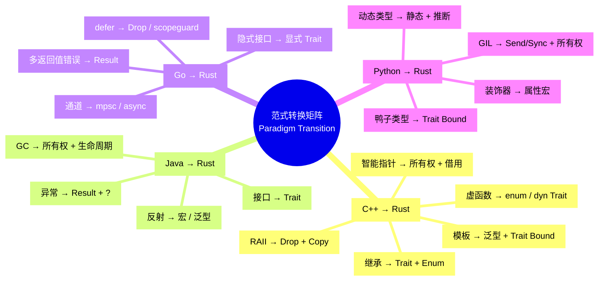
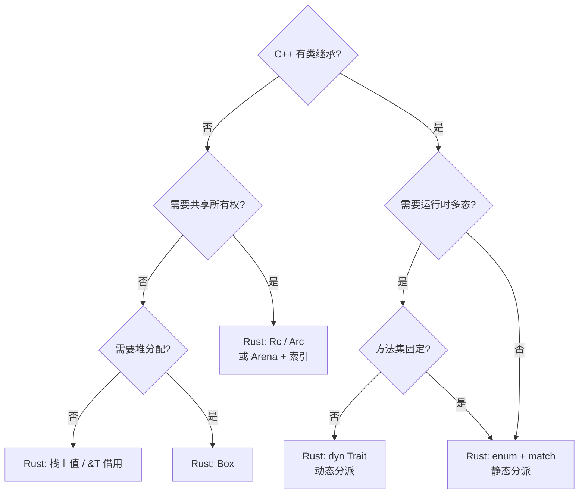
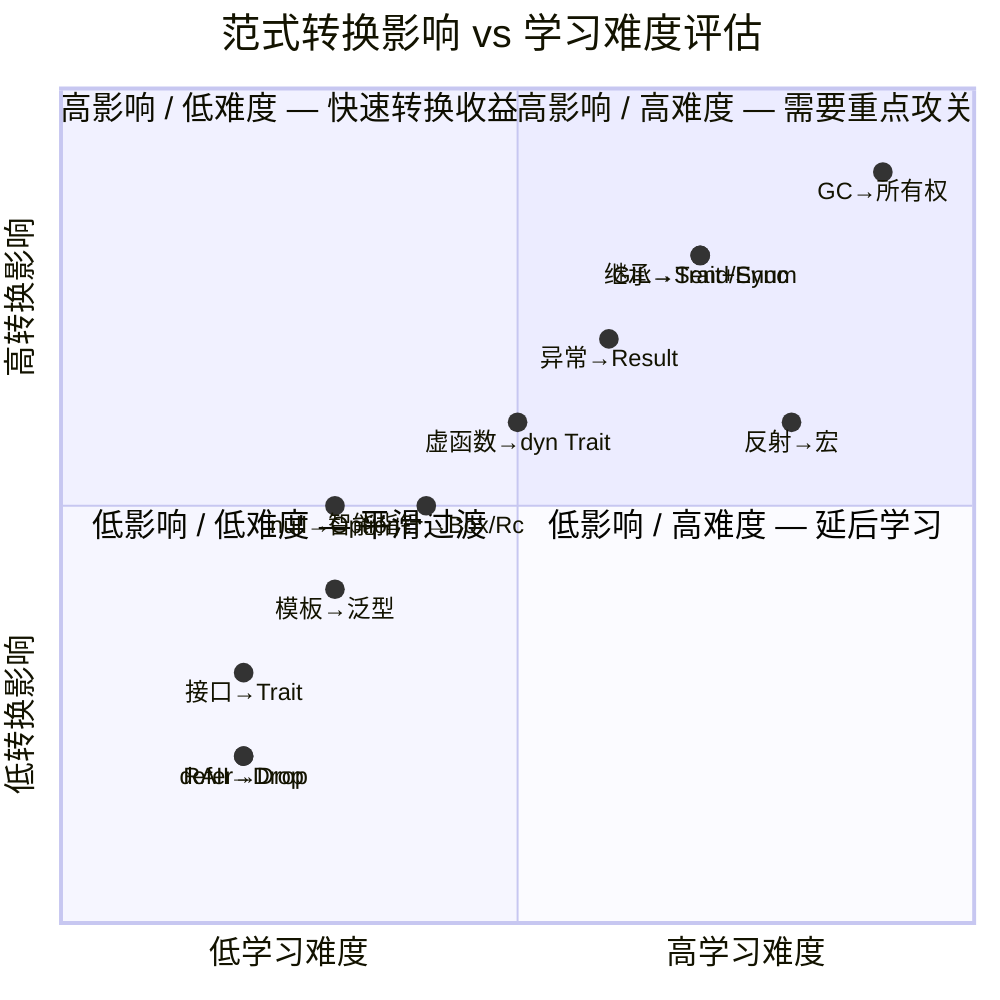

# Rust 范式转换模式矩阵（Paradigm Transition Matrix）
>
> **EN**: Paradigm Transition Matrix
> **Summary**: Paradigm Transition Matrix. Core Rust concept.
>
> **Rust 版本**: 1.97.0+ (Edition 2024)
>
> **受众**: [进阶]
> **Bloom 层级**: 分析 → 评价
> **权威来源**: 本文件为 `concept/` 权威页。
> **定位**: 本文件系统化梳理从其他编程语言（主要是 C++）迁移到 Rust 时的**范式转换模式**，以矩阵形式呈现"源语言模式 → Rust 模式 → 转换影响 → 学习难点"。与 `05_comparative/` 的对比文件（如 `01_rust_vs_cpp.md`）形成互补：后者是"逐项对比"，本文件是"转换模式矩阵"。
> **对齐来源**: [Microsoft RustTraining — C++→Rust 案例研究] · [Google — Rust in Chromium] · [Linux Kernel — Rust 引入报告] · [Ferrous Systems — Rust Migration Guide]
> **定理链**: N/A — 描述性/综述性/导航性文档，不涉及形式化定理链
>
> **来源**: [TRPL](https://doc.rust-lang.org/book/title-page.html) · [Rust Reference](https://doc.rust-lang.org/reference/introduction.html)
---

> **来源**: [Microsoft RustTraining — github.com/microsoft/RustTraining · C++ Case Studies]
>
> **来源**: [Google — *Rust in Chromium* 技术报告]
> **来源**: [Linux Kernel — *Rust for Linux* 文档]
> **来源**: [Ferrous Systems — *Rust Migration Guide*]

## 📑 目录

- [Rust 范式转换模式矩阵（Paradigm Transition Matrix）](#rust-范式转换模式矩阵paradigm-transition-matrix)
  - [📑 目录](#-目录)
  - [〇、范式转换认知全景](#〇范式转换认知全景)
  - [一、C++ → Rust 转换矩阵](#一c--rust-转换矩阵)
    - [1.1 核心转换模式](#11-核心转换模式)
    - [1.2 转换决策树](#12-转换决策树)
  - [二、Java → Rust 转换矩阵](#二java--rust-转换矩阵)
  - [三、Go → Rust 转换矩阵](#三go--rust-转换矩阵)
  - [四、Python → Rust 转换矩阵](#四python--rust-转换矩阵)
  - [五、转换影响评估模型](#五转换影响评估模型)
  - [六、学习难点与认知陷阱](#六学习难点与认知陷阱)
    - [6.1 通用认知陷阱](#61-通用认知陷阱)
    - [6.2 背景特定难点](#62-背景特定难点)
  - [七、来源与可信度](#七来源与可信度)
  - [认知路径](#认知路径)
    - [核心推理链](#核心推理链)
    - [反命题与边界](#反命题与边界)
  - [嵌入式测验（Embedded Quiz）](#嵌入式测验embedded-quiz)
    - [测验 1：本文档《Rust 范式转换模式矩阵（Paradigm Transition Matrix）》在 Rust 知识体系中属于哪一层级的元数据？（理解层）](#测验-1本文档rust-范式转换模式矩阵paradigm-transition-matrix在-rust-知识体系中属于哪一层级的元数据理解层)
    - [测验 2：《Rust 范式转换模式矩阵（Paradigm Transition Matrix）》的主要用途是什么？（理解层）](#测验-2rust-范式转换模式矩阵paradigm-transition-matrix的主要用途是什么理解层)
    - [测验 3：元数据层文档能否替代 L1-L7 的核心概念学习？（理解层）](#测验-3元数据层文档能否替代-l1-l7-的核心概念学习理解层)

---

## 〇、范式转换认知全景

> **认知功能**:
>
> 范式转换矩阵帮助有特定语言背景的开发者**快速定位"我在旧语言中熟悉的模式，在 Rust 中对应什么"**。
> 它不是语法对照表，而是**设计模式层面的映射**——关注"为什么 Rust 选择了不同的抽象"而非"Rust 的语法是什么"。
> [💡 原创分析](methodology.md)

---

## 一、C++ → Rust 转换矩阵

### 1.1 核心转换模式

| C++ 模式 | Rust 模式 | 转换影响 | 学习难点 | 权威来源 |
|:---|:---|:---:|:---|:---|
| **类继承层次** + `virtual` | `enum` + `match` 或 `dyn Trait` | 高 — 消除 vtable 开销，静态分派默认 | 习惯 OOP 思维；何时用 enum 何时用 Trait | Microsoft RustTraining Ch 16 |
| `shared_ptr<T>` 树 | `Arena` + 索引 或 `Rc<T>` | 高 — 消除循环引用风险 | 理解所有权转移；重新设计数据结构 | RustTraining C++ Case Study 2 |
| `unique_ptr<T>` / 原始指针 | `Box<T>` / `&T` / `&mut T` | 中 — 编译期保证替代运行时检查 | 生命周期标注；借用规则限制 | Rust Reference §4 |
| `template<typename T>` | `fn foo<T: Bound>(x: T)` | 低 — 概念相似，语法简洁 | Trait Bound 替代 SFINAE | Rust Reference §6.11 |
| 虚函数多态 | `dyn Trait` 或 `enum` 分派 | 中 — 静态分派默认，动态分派显式 | 对象安全规则；性能权衡 | Rust Reference §8.18 |
| `std::optional<T>` | `Option<T>` | 低 — 直接对应 | 无显著难点 | Rust Standard Library |
| `std::expected<T, E>` (C++23) | `Result<T, E>` | 低 — 直接对应，`?` 语法更优雅 | 错误类型设计 | Rust Reference §9 |
| `const` / `constexpr` | `const` / `const fn` | 中 — CTFE 能力差异 | CTFE 限制（无堆分配） | Rust Reference §11 |
| `std::thread` + `mutex` | `std::thread` + `Mutex<T>` | 低 — API 相似，但类型系统保证安全 | Send/Sync 自动推导 | Rust Reference §13 |
| `new` / `delete` | 隐式（所有权系统） | 高 — 完全消除手动内存管理 | 理解 Drop 和 RAII 扩展 | Rustonomicon §1 |
| `friend` | 模块系统 `pub(crate)` | 中 — 显式可见性替代隐式信任 | 模块和可见性规则 | Rust Reference §7 |
| `operator overloading` | `Trait` 实现（`Add`, `Deref` 等） | 低 — 更规范，限制更多 | Orphan Rule | Rust Reference §10.1 |
| `move constructor` | 默认 Move（非 Copy 类型） | 中 — 非显式，按位移动后原变量失效 | 理解 Copy vs Move | Rust Reference §4.1 |
| `copy constructor` | `Clone` trait + `Copy` marker | 低 — 显式区分 Clone 和 Copy | 何时实现 Copy | Rust Reference §11.2 |

### 1.2 转换决策树

---

## 二、Java → Rust 转换矩阵

| Java 模式 | Rust 模式 | 转换影响 | 学习难点 | 权威来源 |
|:---|:---|:---:|:---|:---|
| `class` + `extends` | `struct` + `impl` + Trait | 高 — 无继承，组合替代 | 重新设计类型层次 | TRPL Ch 5, 10 |
| `interface` | `trait` | 低 — 概念直接对应 | 对象安全；Orphan Rule | Rust Reference §8.18 |
| `null` | `Option<T>` | 高 — 消除 NPE | 处处处理 None | Rust Reference §11.3 |
| `throws Exception` | `Result<T, E>` | 高 — 显式错误传播 | `?` 运算符；错误类型设计 | TRPL Ch 9 |
| GC 自动回收 | 所有权 + 借用 + 生命周期 | **极高** — 完全改变心智模型 | 所有权唯一性；借用规则；生命周期 | TRPL Ch 4, 10 |
| `synchronized` | `Mutex<T>` / `RwLock<T>` | 中 — 类型封装替代关键字 | Send/Sync；锁粒度 | Rust Reference §13 |
| `Stream<T>` | `Iterator<Item = T>` | 低 — 概念相似 | 惰性求值；消费性迭代器 | Rust Standard Library |
| `Optional<T>` | `Option<T>` | 低 — 直接对应 | 模式匹配语法 | Rust Reference §11.3 |
| 反射 (`Reflection`) | 宏 / 泛型 / 代码生成 | 高 — 无运行时反射 | `macro_rules!` / `proc_macro` | Rust Reference §3 |
| `final` | 默认不可变；`mut` 显式可变 | 中 — 不可变默认 | 习惯 `let mut` | Rust Reference §4.2 |

---

## 三、Go → Rust 转换矩阵

| Go 模式 | Rust 模式 | 转换影响 | 学习难点 | 权威来源 |
|:---|:---|:---:|:---|:---|
| `interface{}`（隐式实现） | `trait`（显式实现） | 中 — 显式约束更严格 | 为现有类型实现 Trait | Rust Reference §8.18 |
| `goroutine` + `channel` | `std::thread` + `mpsc` / `tokio` | 低 — API 相似，但类型安全 | Send/Sync 约束 | Rust Reference §13 |
| `defer` | `Drop` / `scopeguard` crate | 低 — RAII 更强大 | 实现 `Drop` trait | Rust Reference §11.4 |
| 多返回值错误 | `Result<T, E>` | 低 — `Result` 更结构化 | `?` 运算符 | TRPL Ch 9 |
| `map[K]V` | `HashMap<K, V>` | 低 — 直接对应 | `Hash` + `Eq` trait | Rust Standard Library |
| `slice` | `&[T]` / `Vec<T>` | 低 — 直接对应 | 生命周期标注 | Rust Reference §4.2 |
| `struct` 嵌入 | 组合（无嵌入） | 中 — 显式委托替代隐式嵌入 | 代码重复 vs 显式转发 | TRPL Ch 5 |
| `go test` | `cargo test` | 低 — 测试框架相似 | 属性宏 (`#[test]`) | TRPL Ch 11 |
| `go fmt` | `rustfmt` | 低 — 直接对应 | 配置选项 | Rust Style Guide |
| 无泛型（Go 1.18 前） | `<T: Bound>` | 高 — 若从旧 Go 迁移 | Trait Bound | Rust Reference §6.11 |

---

## 四、Python → Rust 转换矩阵

| Python 模式 | Rust 模式 | 转换影响 | 学习难点 | 权威来源 |
|:---|:---|:---:|:---|:---|
| 动态类型 (`x = 1; x = "a"`) | 静态类型 + 推断 | **极高** — 类型系统约束 | 类型标注；泛型 | Rust Reference §10 |
| 鸭子类型 | `trait` + `impl` | 高 — 显式接口约束 | 为不同类型实现统一 Trait | Rust Reference §8 |
| `None` | `Option<T>` | 高 — 消除 null | 模式匹配处理 None | Rust Reference §11.3 |
| 异常 (`try/except`) | `Result<T, E>` + `panic` | 高 — 显式错误处理 | `?` 运算符；错误转换 | TRPL Ch 9 |
| GIL（全局解释器锁） | 所有权 + Send/Sync | 高 — 编译期并发安全 | 所有权与线程交互 | Rust Reference §13 |
| 装饰器 (`@decorator`) | 属性宏 / 过程宏 | 中 — 宏更强大但更复杂 | `proc_macro` API | Rust Reference §3 |
| 列表推导式 | 迭代器链 (`map/filter/collect`) | 低 — 功能相似 | 惰性求值 | Rust Standard Library |
| `with` 语句 | `Drop` / RAII | 低 — 更自动化 | 实现 `Drop` | Rust Reference §11.4 |
| `ctypes` / `cffi` | FFI (`extern "C"`) | 中 — 相似但更安全 | 类型映射；SAFETY 注释 | Rust Reference §16 |
| `PyO3` 互操作 | `pyo3` crate | 低 — Python ↔ Rust 双向绑定 | GIL 管理；类型转换 | PyO3 文档 |

---

## 五、转换影响评估模型

> **认知功能**: 四象限图帮助迁移项目**优先级排序**：
>
> - **第一象限**（高影响/高难度）：GC→所有权、继承→Trait+Enum — 需要最多的培训和重构投入
> - **第二象限**（高影响/低难度）：异常→Result — 收益大且相对容易，应优先转换
> - **第三象限**（低影响/低难度）：RAII→Drop、defer→Drop — 几乎无缝过渡
> - **第四象限**（低影响/高难度）：反射→宏 — 除非必要，可延后或寻找替代方案
> [💡 原创分析](methodology.md)

---

## 六、学习难点与认知陷阱

### 6.1 通用认知陷阱

| 陷阱 | 描述 | 来源语言 | 纠正方法 |
|:---|:---|:---:|:---|
| **"Rust 有 GC，只是隐藏了"** | 误认为所有权是编译期 GC | Java/Python/Go | 理解所有权 = 线性逻辑，非 GC |
| **"&T 就是 C 的指针"** | 忽视借用检查器的约束 | C/C++ | 理解 &T 附带生命周期契约 |
| **"Copy 类型太慢，应该用引用"** | 过度优化，忽视零成本抽象 | C++ | 信任编译器，measure 后再优化 |
| **"unsafe 就是 C"** | 忽视 unsafe 仍需维护不变式 | C/C++ | 学习 SAFETY 注释规范 |
| **"Trait = Java 接口"** | 忽视 Trait 的对象安全限制 | Java | 理解 Orphan Rule 和对象安全 |
| **"Result 太啰嗦，用 unwrap"** | 将 Rust 写成带类型的脚本 | Python/JS | 建立错误即值的心智模型 |
| **"生命周期是垃圾"** | 遇到 lifetime 错误就逃避 | 所有背景 | 从区域类型角度理解生命周期 |

### 6.2 背景特定难点

| 背景 | 最大难点 | 原因 | 建议突破口 |
|:---|:---|:---|:---|
| **C++** | 所有权 vs 智能指针直觉冲突 | C++ 允许共享所有权（shared_ptr） | 从 `unique_ptr` 类比开始，理解 Move 语义 |
| **Java** | GC → 所有权 | 从未手动管理内存 | 从 `Box<T>` 和 RAII 开始，建立资源即值直觉 |
| **Go** | 显式 Trait 实现 | 习惯隐式接口 | 理解 Trait 是"能力声明"而非"类型标记" |
| **Python** | 静态类型约束 | 动态类型自由惯了 | 将类型视为"编译期测试"而非"束缚" |
| **Haskell** | 可变性的引入 | 习惯纯函数和惰性求值 | 从 `&mut T` 的独占性理解可变性安全 |
| **JavaScript** | 同步/异步模型差异 | JS 的异步更松散 | 理解 Rust async = 状态机 + Pin |

---

## 七、来源与可信度

| 层级 | 来源 | 在本文件中的作用 |
|:---|:---|:---|
| **一级** | Microsoft RustTraining — C++→Rust Case Studies | C++ 转换模式的工业级数据和经验 |
| **一级** | Google — *Rust in Chromium* 技术报告 | 大规模 C++ 代码库迁移的实战经验 |
| **二级** | Linux Kernel — *Rust for Linux* | 系统编程领域的 C→Rust 转换 |
| **二级** | Ferrous Systems — *Rust Migration Guide* | 企业级迁移方法论和培训体系 |
| **三级** | PyO3 文档 / Rust for Pythonistas | Python ↔ Rust 互操作的具体模式 |
| **三级** | Rust 学习者社区调研 (2024) | 认知陷阱和学习难点的实证数据 |

---

**变更日志**:

- v1.0 (2026-05-23): 初始版本 — C++/Java/Go/Python → Rust 四大转换矩阵 + 四象限影响评估 + 认知陷阱分析 + 背景定制学习建议 [权威来源对齐 Wave 6](../02_sources/international_authority_index.md)

---

> **相关文件**: [Rust vs C++](../../05_comparative/01_systems_languages/01_rust_vs_cpp.md) · [Rust vs Go](../../05_comparative/01_systems_languages/02_rust_vs_go.md) · [范式矩阵](../../05_comparative/00_paradigms/03_paradigm_matrix.md) · [学习指南](../04_navigation/learning_guide.md)

## 认知路径

> **认知路径**: 本文件作为 Rust 分层知识体系的 **Rust 范式转换模式矩阵（Paradigm Transition Matrix）** 元层导航节点，连接概念定义、学习路径与质量评估框架。

### 核心推理链

| 定理 | 前提 | 结论 | 置信度 |
|:---|:---|:---|:---|
| Paradigm Transition Matrix 结构化定义 ⟹ 学习者认知锚点可建立 | 本文件定义了元层结构 | 支持上层概念定位 | 高 |

> **过渡**: 利用本文件的导航结构，读者可以从当前位置快速跃迁到任意概念层级，实现非线性学习。
> **过渡**: Rust 范式转换模式矩阵（Paradigm Transition Matrix） 的维护需要与概念内容同步更新，确保元数据与实际知识体系的一致性。
> **过渡**: 将 Rust 范式转换模式矩阵（Paradigm Transition Matrix） 作为学习起点或复习锚点，有助于建立全局视野，避免陷入局部细节而忽视整体架构。

### 反命题与边界

> **反命题**: "元层文档可以替代具体概念学习" —— 错误。Rust 范式转换模式矩阵（Paradigm Transition Matrix） 提供的是导航与评估框架，不能替代对核心概念（L1-L5）的深入理解与实践。
> **内容分级**: [综述级]

## 嵌入式测验（Embedded Quiz）

### 测验 1：本文档《Rust 范式转换模式矩阵（Paradigm Transition Matrix）》在 Rust 知识体系中属于哪一层级的元数据？（理解层）

**题目**: 本文档《Rust 范式转换模式矩阵（Paradigm Transition Matrix）》在 Rust 知识体系中属于哪一层级的元数据？

✅ 答案与解析

属于 00_meta 元数据层，为整个知识体系提供导航、评估、审计和结构化的支持框架，辅助学习者定位和理解核心概念。

---

### 测验 2：《Rust 范式转换模式矩阵（Paradigm Transition Matrix）》的主要用途是什么？（理解层）

**题目**: 《Rust 范式转换模式矩阵（Paradigm Transition Matrix）》的主要用途是什么？

✅ 答案与解析

作为知识体系的支撑文档，提供学习路径导航、概念关系映射、质量评估标准或审计检查清单，帮助学习者和维护者高效使用知识库。

---

### 测验 3：元数据层文档能否替代 L1-L7 的核心概念学习？（理解层）

**题目**: 元数据层文档能否替代 L1-L7 的核心概念学习？

✅ 答案与解析

不能。元数据层提供导航和评估框架，但不能替代对核心概念（所有权、类型系统、并发等）的深入理解与实践。

