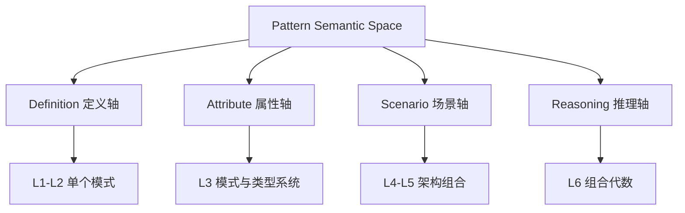
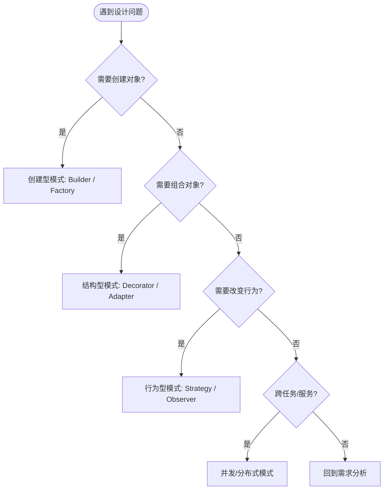

# 模式语义空间索引：设计模式在概念体系中的坐标
>
> **EN**: Pattern Semantic Space Index
> **Summary**: A unified index and learning path for all design-pattern-related concepts across the concept hierarchy, with semantic axes, GoF-to-Rust mapping, and scenario-based decision trees.
> **Rust 版本**: 1.97.0+ (Edition 2024)
>
> **受众**: [进阶]
> **权威来源**: 本文件为 `concept/` 权威页。
> **层级**: L2-L6 跨层导航
> **A/S/P 标记**: S+A — Structure + Application
> **双维定位**: C×Ana / C×Eva
> **前置概念**: [Patterns](../../06_ecosystem/03_design_patterns/01_patterns.md) · [Type System](../../01_foundation/02_type_system/01_type_system.md)
> **后置概念**:
> [Pattern Composition Algebra](../../06_ecosystem/03_design_patterns/16_pattern_composition_algebra.md) ·
> [Algorithm-Pattern Semantic Bridge](semantic_bridge_algorithms_patterns.md)
> **主要来源**:
> [GoF — Design Patterns](https://en.wikipedia.org/wiki/Design_Patterns) ·
> [POSA](https://en.wikipedia.org/wiki/Pattern-Oriented_Software_Architecture) ·
> [Rust Design Patterns](https://rust-unofficial.github.io/patterns/)
---

> **Bloom 层级**: L2-L5

## 📑 目录

- [模式语义空间索引：设计模式在概念体系中的坐标](#模式语义空间索引设计模式在概念体系中的坐标)
  - [📑 目录](#-目录)
  - [一、核心命题](#一核心命题)
  - [二、模式文件语义坐标系](#二模式文件语义坐标系)
    - [2.1 横向：问题域维度](#21-横向问题域维度)
    - [2.2 纵向：抽象层级维度](#22-纵向抽象层级维度)
    - [2.3 认知目标维度](#23-认知目标维度)
  - [三、GoF 模式到 Rust 的映射](#三gof-模式到-rust-的映射)
  - [四、推荐学习路径](#四推荐学习路径)
    - [路径 A：从单个模式到组合代数](#路径-a从单个模式到组合代数)
    - [路径 B：按问题域切入](#路径-b按问题域切入)
  - [五、模式选择决策树](#五模式选择决策树)
  - [六、组合代数主文件说明](#六组合代数主文件说明)
  - [七、与 Phase C 表征空间坐标系的衔接](#七与-phase-c-表征空间坐标系的衔接)
  - [八、L1 / L2 / L3 总结](#八l1--l2--l3-总结)
  - [九、延伸阅读](#九延伸阅读)
  - [国际权威参考 / International Authority References（P0 官方 · P1 学术 · P2 生态）](#国际权威参考--international-authority-referencesp0-官方--p1-学术--p2-生态)

## 一、核心命题

> **设计模式不是 23 个孤立代码模板的集合，而是分布在概念空间中不同坐标点上的结构化知识。
> 本索引提供一张"模式地图"，帮助学习者在以下维度上定位每个模式文件：抽象层级（L1-L6）、问题域（并发/分布式/架构/算法）、认知目标（理解/分析/评价/创造）、以及与其他概念的语义关联。**



## 二、模式文件语义坐标系

本节聚焦「模式文件语义坐标系」，覆盖横向：问题域维度、纵向：抽象层级维度与认知目标维度。论述顺序由定义到边界：先明确「模式文件语义坐标系」在「模式语义空间索引：设计模式在概念体系中的坐标」中的确切含义与适用范围，再给出可核验的例证或数据，最后标注它与相邻主题的分界线。读完后应能用一句话复述「模式文件语义坐标系」的判定标准，并指出它在全页论证链中的位置。

### 2.1 横向：问题域维度

| 问题域 | 代表文件 | 核心模式族 |
|:---|:---|:---|
| **通用基础** | [Patterns](../../06_ecosystem/03_design_patterns/01_patterns.md) | GoF  creational / structural / behavioral 模式全集 |
| **算法-模式桥接** | [Algorithm-Pattern Semantic Bridge](semantic_bridge_algorithms_patterns.md) | 算法策略 ↔ 设计模式的映射关系 |
| **并发与并行** | [Concurrency Patterns](../../03_advanced/00_concurrency/03_concurrency_patterns.md) | Actor、CSP、Fork-Join、Pipeline、Work Stealing |
| **分布式系统** | [Parallel Distributed Pattern Spectrum](../../03_advanced/00_concurrency/08_parallel_distributed_pattern_spectrum.md) | Circuit Breaker、Bulkhead、Retry、Saga、Leader Election |
| **架构风格** | [Architecture Patterns](../../06_ecosystem/03_design_patterns/08_architecture_patterns.md) | Layered、Hexagonal、Microkernel、Event-Driven |
| **微服务** | [Microservice Patterns](../../06_ecosystem/03_design_patterns/05_microservice_patterns.md) | API Gateway、Service Discovery、CQRS、Event Sourcing |
| **事件驱动** | [Event Driven Architecture](../../06_ecosystem/03_design_patterns/06_event_driven_architecture.md) | Pub/Sub、Event Bus、Stream Processing |
| **数据与状态** | [CQRS and Event Sourcing](../../06_ecosystem/03_design_patterns/07_cqrs_event_sourcing.md) | Command-Query Separation、Event Store、Projection |
| **响应式系统** | [Reactive Programming](../../06_ecosystem/04_web_and_networking/09_reactive_programming.md) | Observer、Backpressure、Fan-out/Fan-in |
| **工作流** | [Workflow Theory](../../06_ecosystem/03_design_patterns/17_workflow_theory.md) | State Machine、Saga、Activity、Compensation |
| **API 设计** | [API Design Patterns](../../06_ecosystem/03_design_patterns/18_api_design_patterns.md) | Builder、Typestate、Extension Trait、Error API |
| **系统可组合性** | [System Composability](../../06_ecosystem/03_design_patterns/04_system_composability.md) | Composability、Isolation、Monoid、Plugin |

### 2.2 纵向：抽象层级维度

| 层级 | 文件 | 关注点 |
|:---|:---|:---|
| **L1-L2 基础** | [Patterns](../../06_ecosystem/03_design_patterns/01_patterns.md) | 单个模式的动机、结构、Rust 实现 |
| **L3 进阶** | [Concurrency Patterns](../../03_advanced/00_concurrency/03_concurrency_patterns.md) · [Type Erasure](../../03_advanced/06_low_level_patterns/03_type_erasure.md) | 模式与所有权、生命周期、类型系统的交互 |
| **L4-L5 架构** | [Architecture Patterns](../../06_ecosystem/03_design_patterns/08_architecture_patterns.md) · [Microservice Patterns](../../06_ecosystem/03_design_patterns/05_microservice_patterns.md) | 模式在系统架构中的组合与权衡 |
| **L6 生态系统** | [Pattern Composition Algebra](../../06_ecosystem/03_design_patterns/16_pattern_composition_algebra.md) | 模式之间的代数关系、冲突检测、组合选择 |

### 2.3 认知目标维度

| 目标 | 文件 | 任务示例 |
|:---|:---|:---|
| **理解（Understand）** | [Patterns](../../06_ecosystem/03_design_patterns/01_patterns.md) | 解释 Strategy 与 Template Method 的区别 |
| **分析（Analyze）** | [Algorithm-Pattern Semantic Bridge](semantic_bridge_algorithms_patterns.md) | 分析为什么某个算法适合用 Strategy 表达 |
| **评价（Evaluate）** | [Pattern Composition Algebra](../../06_ecosystem/03_design_patterns/16_pattern_composition_algebra.md) | 判断 Observer + Factory + Typestate 是否适合当前问题 |
| **创造（Create）** | [System Composability](../../06_ecosystem/03_design_patterns/04_system_composability.md) | 设计一个新的模式组合以解决领域问题 |

## 三、GoF 模式到 Rust 的映射

| GoF 模式 | Rust 惯用法 | 关键机制 |
|:---|:---|:---|
| Singleton | `lazy_static!` / `once_cell` / `std::sync::OnceLock` | 全局初始化而非全局可变状态 |
| Factory | 关联函数 `fn new(...)` + `Default` trait | 结构体字面量 + trait |
| Builder | 消费式 Builder / Typestate Builder | 所有权转移 + 泛型状态 |
| Strategy | Trait object / 泛型 + trait bound | 多态分发 |
| Observer | `tokio::sync::broadcast` / 自定义回调 | 通道与生命周期 |
| Decorator | Wrapper struct + `Deref` / trait 组合 | 零成本抽象 |
| Iterator | `Iterator` trait | 惰性计算 + 组合子 |

## 四、推荐学习路径

本节聚焦「推荐学习路径」，覆盖路径 A：从单个模式到组合代数 与 路径 B：按问题域切入。论述顺序由定义到边界：先明确「推荐学习路径」在「模式语义空间索引：设计模式在概念体系中的坐标」中的确切含义与适用范围，再给出可核验的例证或数据，最后标注它与相邻主题的分界线。读完后应能用一句话复述「推荐学习路径」的判定标准，并指出它在全页论证链中的位置。

### 路径 A：从单个模式到组合代数

```text
Patterns (L2)
    ↓
Concurrency Patterns (L3)
    ↓
Algorithm-Pattern Semantic Bridge (L3)
    ↓
Architecture Patterns / Microservice Patterns (L4-L5)
    ↓
Pattern Composition Algebra (L6)
```

### 路径 B：按问题域切入

| 你面临的问题 | 起点 | 延伸阅读 |
|:---|:---|:---|
| 如何选择正确的并发模型 | [Concurrency Patterns](../../03_advanced/00_concurrency/03_concurrency_patterns.md) | [Parallel Distributed Pattern Spectrum](../../03_advanced/00_concurrency/08_parallel_distributed_pattern_spectrum.md) |
| 如何设计可扩展的 API | [API Design Patterns](../../06_ecosystem/03_design_patterns/18_api_design_patterns.md) | [System Composability](../../06_ecosystem/03_design_patterns/04_system_composability.md) |
| 如何构建事件驱动系统 | [Event Driven Architecture](../../06_ecosystem/03_design_patterns/06_event_driven_architecture.md) | [Reactive Programming](../../06_ecosystem/04_web_and_networking/09_reactive_programming.md) |
| 如何处理分布式失败 | [Parallel Distributed Pattern Spectrum](../../03_advanced/00_concurrency/08_parallel_distributed_pattern_spectrum.md) | [CQRS and Event Sourcing](../../06_ecosystem/03_design_patterns/07_cqrs_event_sourcing.md) |

## 五、模式选择决策树



## 六、组合代数主文件说明

[Pattern Composition Algebra](../../06_ecosystem/03_design_patterns/16_pattern_composition_algebra.md) 是模式语义空间的核心枢纽文件，它定义了：

- **四种组合原语**：`⊗`（并行）、`∘`（串行）、`⊕`（选择）、`→`（精炼）
- **模式冲突矩阵**：哪些模式在结构上互斥或需要小心组合
- **形式化决策函数**：根据问题特征向量推荐模式组合
- **Rust 特定组合**：如 Typestate + Builder、RAII + Scopeguard

> 学习完单个模式后，应回到此文件建立模式之间的结构化关联。

## 七、与 Phase C 表征空间坐标系的衔接

本索引属于 **Phase C（表征空间坐标系）** 的导航层，目标是将分散的模式知识锚定到统一坐标系中：

- **C×Ana**：分析模式的结构特征与适用条件。
- **C×Eva**：评价不同模式组合的正确性、一致性与工程代价。
- **P×Ana**：从问题特征出发，推导合适的模式选择。

## 八、L1 / L2 / L3 总结

| 层级 | 要点 |
|:---|:---|
| **L1** | Rust 中的设计模式实现方式与 GoF 经典描述有差异（如 Singleton 被全局状态替代）。 |
| **L2** | 模式可以按问题域、抽象层级、认知目标三个维度分类。 |
| **L3** | 模式不是孤立存在的；通过组合代数可以理解模式之间的结构化关联、冲突与选择策略。 |

## 九、延伸阅读

- [Rust Design Patterns](https://rust-unofficial.github.io/patterns/)
- [GoF — Design Patterns: Elements of Reusable Object-Oriented Software]
- [POSA — Pattern-Oriented Software Architecture]
- [Pattern Composition Algebra](../../06_ecosystem/03_design_patterns/16_pattern_composition_algebra.md)
- [Algorithm-Pattern Semantic Bridge](semantic_bridge_algorithms_patterns.md)
- [Type System](../../01_foundation/02_type_system/01_type_system.md)

---

> **Checklist**: 已建立模式文件语义坐标系 / 提供学习路径 / 明确组合代数主文件 / 衔接 Phase C 表征空间。

---

## 国际权威参考 / International Authority References（P0 官方 · P1 学术 · P2 生态）

> 依据 `AGENTS.md` §2「对齐网络国际化权威内容」补充：仅追加已验证可达的权威链接，不改动正文事实。
> **内容分级**: [综述级]

- **P0 官方**: [Rust Reference — Patterns（官方语言规范）](https://doc.rust-lang.org/reference/patterns.html)
- **P1 学术/形式化**: [Hogan et al.: Knowledge Graphs (ACM Comput. Surv. 2021)](https://dl.acm.org/doi/10.1145/3447772)
