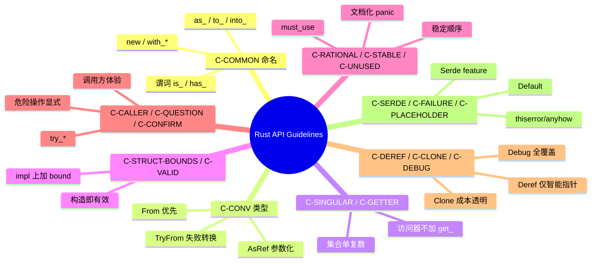

> **内容分级**: [专家级]
> **本节关键术语**: API 设计 · Rust API Guidelines · 命名规范 · 转换 trait · 错误处理 — [完整对照表](../01_terminology/01_terminology_glossary.md)

# Rust API Guidelines 权威指南

> **EN**: Rust API Guidelines Canonical Guide
> **Summary**: A systematic, example-driven guide to the Rust API Guidelines naming conventions, type conventions, predictability, flexibility, and debugging contracts, with idiomatic examples and counter-examples for each guideline.
>
> **Rust 版本**: 1.97.0+ (Edition 2024)
> **受众**: [进阶]
> **Bloom 层级**: L3-L5
> **权威来源**: 本文件为 `concept/` 权威页。
> **定位**: 本页是 Rust API Guidelines 在 `concept/` 中的**唯一权威解释页**，系统讲解 C-COMMON、C-CONV、C-SINGULAR、C-GETTER、C-STRUCT-BOUNDS、C-VALID、C-RATIONAL、C-STABLE、C-UNUSED、C-CALLER、C-QUESTION、C-CONFIRM、C-DEREF、C-CLONE、C-DEBUG、C-SERDE、C-FAILURE、C-PLACEHOLDER、C-INTERMEDIATE、C-ENTITY、C-METHOD 等核心约定，并给出 Rust 示例与反例。
>
> **前置概念**: [Type System](../../01_foundation/02_type_system/01_type_system.md) · [Traits](../../02_intermediate/00_traits/01_traits.md) · [Error Handling](../../02_intermediate/03_error_handling/01_error_handling.md) · [Iterator Idioms](../../01_foundation/05_collections/03_iterator_idioms.md)
> **后置概念**: [Idioms Spectrum](../../06_ecosystem/03_design_patterns/02_idioms_spectrum.md) · [Algorithm Engineering Practice](../../06_ecosystem/11_domain_applications/08_algorithm_engineering_practice.md)

---

> **来源**:
> [Rust API Guidelines](https://rust-lang.github.io/api-guidelines/) ·
> [The Rust Programming Language](https://doc.rust-lang.org/book/title-page.html) ·
> [Rust Design Patterns](https://rust-unofficial.github.io/patterns/) ·
> [Effective Rust](https://www.effective-rust.com/) ·
> [Rust for Rustaceans](https://rust-for-rustaceans.com/)

---

## 📑 目录

- [Rust API Guidelines 权威指南](#rust-api-guidelines-权威指南)
  - [📑 目录](#-目录)
  - [一、指南全景与认知地图](#一指南全景与认知地图)
  - [二、C-COMMON：常见 Rust 命名约定](#二c-common常见-rust-命名约定)
    - [2.1 构造器 `new` 与 `with_*`](#21-构造器-new-与-with_)
    - [2.2 转换方法 `as_*`、`to_*`、`into_*`](#22-转换方法-as_to_into_)
    - [2.3 访问器与修改器](#23-访问器与修改器)
    - [2.4 谓词方法](#24-谓词方法)
  - [三、C-CONV：类型与 trait 约定](#三c-conv类型与-trait-约定)
    - [3.1 实现 `From` 而非同时实现 `Into`](#31-实现-from-而非同时实现-into)
    - [3.2 可失败转换用 `TryFrom` / `TryInto`](#32-可失败转换用-tryfrom--tryinto)
    - [3.3 借用参数化用 `AsRef` / `Borrow`](#33-借用参数化用-asref--borrow)
  - [四、C-SINGULAR / C-GETTER：集合与访问器命名](#四c-singular--c-getter集合与访问器命名)
    - [4.1 集合方法：单数访问用 `get`，批量返回用复数](#41-集合方法单数访问用-get批量返回用复数)
    - [4.2 访问器命名](#42-访问器命名)
  - [五、C-STRUCT-BOUNDS / C-VALID：泛型边界与有效性](#五c-struct-bounds--c-valid泛型边界与有效性)
    - [5.1 结构体泛型边界（C-STRUCT-BOUNDS）](#51-结构体泛型边界c-struct-bounds)
    - [5.2 构造即有效（C-VALID）](#52-构造即有效c-valid)
  - [六、C-RATIONAL / C-STABLE / C-UNUSED：设计意图与稳定性](#六c-rational--c-stable--c-unused设计意图与稳定性)
    - [6.1 合理性与不变量（C-RATIONAL）](#61-合理性与不变量c-rational)
    - [6.2 稳定性（C-STABLE）](#62-稳定性c-stable)
    - [6.3 未使用值（C-UNUSED）](#63-未使用值c-unused)
  - [七、C-CALLER / C-QUESTION / C-CONFIRM：调用方体验](#七c-caller--c-question--c-confirm调用方体验)
    - [7.1 调用方优先（C-CALLER）](#71-调用方优先c-caller)
    - [7.2 疑问方法（C-QUESTION）](#72-疑问方法c-question)
    - [7.3 确认性操作（C-CONFIRM）](#73-确认性操作c-confirm)
  - [八、C-DEREF / C-CLONE / C-DEBUG：智能指针与可调试性](#八c-deref--c-clone--c-debug智能指针与可调试性)
    - [8.1 谨慎使用 Deref（C-DEREF）](#81-谨慎使用-derefc-deref)
    - [8.2 Clone 成本透明（C-CLONE）](#82-clone-成本透明c-clone)
    - [8.3 实现 Debug（C-DEBUG）](#83-实现-debugc-debug)
  - [九、C-SERDE / C-FAILURE / C-PLACEHOLDER：序列化与错误](#九c-serde--c-failure--c-placeholder序列化与错误)
    - [9.1 Serde 支持（C-SERDE）](#91-serde-支持c-serde)
    - [9.2 失败模式（C-FAILURE）](#92-失败模式c-failure)
    - [9.3 Placeholder 与默认值（C-PLACEHOLDER）](#93-placeholder-与默认值c-placeholder)
  - [十、C-INTERMEDIATE / C-ENTITY / C-METHOD：中间表示与实体 API](#十c-intermediate--c-entity--c-method中间表示与实体-api)
    - [10.1 中间表示（C-INTERMEDIATE）](#101-中间表示c-intermediate)
    - [10.2 实体类型（C-ENTITY）](#102-实体类型c-entity)
    - [10.3 方法设计（C-METHOD）](#103-方法设计c-method)
  - [十一、反例与陷阱汇总](#十一反例与陷阱汇总)
  - [十二、边界测试](#十二边界测试)
    - [12.1 边界测试：`From` 与 `Into` 的 blanket impl 冲突](#121-边界测试from-与-into-的-blanket-impl-冲突)
    - [12.2 边界测试：违反孤儿规则](#122-边界测试违反孤儿规则)
    - [12.3 边界测试：`Deref` 反模式](#123-边界测试deref-反模式)
  - [十三、思维导图](#十三思维导图)
  - [十四、国际权威参考](#十四国际权威参考)
  - [十五、官方 Checklist C- 指南映射](#十五官方-checklist-c--指南映射)
    - [15.1 Naming（命名）](#151-naming命名)
      - [C-CASE：符合 RFC 430 的大小写约定](#c-case符合-rfc-430-的大小写约定)
      - [C-CONV：`as_` / `to_` / `into_` 转换约定](#c-convas_--to_--into_-转换约定)
      - [C-GETTER：访问器不加 `get_`](#c-getter访问器不加-get_)
      - [C-ITER：集合产生迭代器的方法用 `iter` / `iter_mut` / `into_iter`](#c-iter集合产生迭代器的方法用-iter--iter_mut--into_iter)
      - [C-ITER-TY：迭代器类型名与方法对应](#c-iter-ty迭代器类型名与方法对应)
      - [C-FEATURE：feature 名不含占位词](#c-featurefeature-名不含占位词)
      - [C-WORD-ORDER：命名词序一致](#c-word-order命名词序一致)
    - [15.2 Interoperability（互操作性）](#152-interoperability互操作性)
      - [C-COMMON-TRAITS：积极实现常见 trait](#c-common-traits积极实现常见-trait)
      - [C-CONV-TRAITS：转换使用标准 trait `From` / `AsRef`](#c-conv-traits转换使用标准-trait-from--asref)
      - [C-COLLECT：集合实现 `FromIterator` 和 `Extend`](#c-collect集合实现-fromiterator-和-extend)
      - [C-SERDE：数据结构提供 Serde 支持（feature gate）](#c-serde数据结构提供-serde-支持feature-gate)
      - [C-SEND-SYNC：类型尽可能实现 `Send` / `Sync`](#c-send-sync类型尽可能实现-send--sync)
      - [C-GOOD-ERR：错误类型有意义且行为良好](#c-good-err错误类型有意义且行为良好)
      - [C-NUM-FMT：数值类型提供进制格式化](#c-num-fmt数值类型提供进制格式化)
      - [C-RW-VALUE：泛型读写函数按值接收](#c-rw-value泛型读写函数按值接收)
    - [15.3 Macros（宏）](#153-macros宏)
      - [C-EVOCATIVE：宏输入语法应暗示输出](#c-evocative宏输入语法应暗示输出)
      - [C-MACRO-ATTR：宏与属性组合良好](#c-macro-attr宏与属性组合良好)
      - [C-ANYWHERE：item 宏可出现在允许 item 的任何位置](#c-anywhereitem-宏可出现在允许-item-的任何位置)
      - [C-MACRO-VIS：item 宏支持可见性说明符](#c-macro-visitem-宏支持可见性说明符)
      - [C-MACRO-TY：类型片段灵活](#c-macro-ty类型片段灵活)
    - [15.4 Documentation（文档）](#154-documentation文档)
      - [C-CRATE-DOC：crate 级文档详尽且含示例](#c-crate-doccrate-级文档详尽且含示例)
      - [C-EXAMPLE：所有公共项都有 rustdoc 示例](#c-example所有公共项都有-rustdoc-示例)
      - [C-QUESTION-MARK：示例使用 `?` 而非 `unwrap`](#c-question-mark示例使用--而非-unwrap)
      - [C-FAILURE：文档说明错误、panic 与安全条件](#c-failure文档说明错误panic-与安全条件)
      - [C-LINK：文档中包含相关链接](#c-link文档中包含相关链接)
      - [C-METADATA：`Cargo.toml` 包含常见元数据](#c-metadatacargotoml-包含常见元数据)
      - [C-RELNOTES：Release notes 记录重大变更](#c-relnotesrelease-notes-记录重大变更)
      - [C-HIDDEN：rustdoc 不展示无益的实现细节](#c-hiddenrustdoc-不展示无益的实现细节)
    - [15.5 Predictability（可预测性）](#155-predictability可预测性)
      - [C-SMART-PTR：智能指针不添加固有方法](#c-smart-ptr智能指针不添加固有方法)
      - [C-CONV-SPECIFIC：转换放在最具体的类型上](#c-conv-specific转换放在最具体的类型上)
      - [C-METHOD：有明显接收器的函数应为方法](#c-method有明显接收器的函数应为方法)
      - [C-NO-OUT：不使用输出参数](#c-no-out不使用输出参数)
      - [C-OVERLOAD：运算符重载不令人惊讶](#c-overload运算符重载不令人惊讶)
      - [C-DEREF：仅智能指针实现 `Deref` / `DerefMut`](#c-deref仅智能指针实现-deref--derefmut)
      - [C-CTOR：构造器是静态固有方法](#c-ctor构造器是静态固有方法)
    - [15.6 Flexibility（灵活性）](#156-flexibility灵活性)
      - [C-INTERMEDIATE：暴露中间结果避免重复工作](#c-intermediate暴露中间结果避免重复工作)
      - [C-CALLER-CONTROL：调用方决定何时复制/放置数据](#c-caller-control调用方决定何时复制放置数据)
      - [C-GENERIC：用泛型减少对参数的先验假设](#c-generic用泛型减少对参数的先验假设)
      - [C-OBJECT：可能作为 trait object 使用的 trait 应为对象安全](#c-object可能作为-trait-object-使用的-trait-应为对象安全)
    - [15.7 Type safety（类型安全）](#157-type-safety类型安全)
      - [C-NEWTYPE：newtype 提供静态区分](#c-newtypenewtype-提供静态区分)
      - [C-CUSTOM-TYPE：用类型而非 `bool` / `Option` 传达语义](#c-custom-type用类型而非-bool--option-传达语义)
      - [C-BITFLAG：标志位集合用 `bitflags`](#c-bitflag标志位集合用-bitflags)
      - [C-BUILDER：复杂值使用 builder](#c-builder复杂值使用-builder)
    - [15.8 Dependability（可靠性）](#158-dependability可靠性)
      - [C-VALIDATE：函数验证参数](#c-validate函数验证参数)
      - [C-DTOR-FAIL：析构函数不失败](#c-dtor-fail析构函数不失败)
      - [C-DTOR-BLOCK：可能阻塞的析构提供替代方法](#c-dtor-block可能阻塞的析构提供替代方法)
    - [15.9 Debuggability（可调试性）](#159-debuggability可调试性)
      - [C-DEBUG：所有公共类型实现 `Debug`](#c-debug所有公共类型实现-debug)
      - [C-DEBUG-NONEMPTY：`Debug` 表示非空](#c-debug-nonemptydebug-表示非空)
    - [15.10 Future proofing（未来兼容性）](#1510-future-proofing未来兼容性)
      - [C-SEALED：密封 trait 防止下游实现](#c-sealed密封-trait-防止下游实现)
      - [C-STRUCT-PRIVATE：结构体字段私有](#c-struct-private结构体字段私有)
      - [C-NEWTYPE-HIDE：newtype 封装实现细节](#c-newtype-hidenewtype-封装实现细节)
      - [C-STRUCT-BOUNDS：数据结构不重复派生 trait bound](#c-struct-bounds数据结构不重复派生-trait-bound)
      - [C-STABLE：稳定 crate 的公共依赖应稳定](#c-stable稳定-crate-的公共依赖应稳定)
      - [C-PERMISSIVE：crate 及其依赖使用宽松许可证](#c-permissivecrate-及其依赖使用宽松许可证)

---

## 一、指南全景与认知地图

Rust API Guidelines（rust-lang.github.io/api-guidelines）是 Rust 生态的**公共 API 设计宪法**。它把社区长期形成的最佳实践编码为可检查的命名、类型、trait 与文档约定。掌握这些约定是写出"像 Rust"的库的第一步，也是库 API 获得广泛采用的关键。

本页将这些约定重新组织为五条认知线：

1. **命名（Naming）**：C-COMMON、C-CONV、C-SINGULAR、C-GETTER、C-METHOD。
2. **类型与 trait（Types & Traits）**：C-STRUCT-BOUNDS、C-DEREF、C-CLONE、C-VALID。
3. **调用方体验（Caller Experience）**：C-CALLER、C-QUESTION、C-CONFIRM、C-UNUSED。
4. **可靠性与可调试性（Reliability & Debuggability）**：C-RATIONAL、C-STABLE、C-DEBUG、C-FAILURE。
5. **生态集成（Ecosystem Integration）**：C-SERDE、C-PLACEHOLDER、C-INTERMEDIATE、C-ENTITY。

> **核心原则**：库的公共 API 是**对外承诺**。每个公开项的名字、trait 实现、panic 条件、错误类型都是承诺的一部分，变更承诺即可能破坏下游代码。
>
> **编号说明**：本页使用的 `C-COMMON`、`C-CONV`、`C-SINGULAR` 等编号是为便于结构化教学而重新组织的**教学编号**，并非 [Rust API Guidelines 官方 Checklist](https://rust-lang.github.io/api-guidelines/checklist.html) 中的原始编号（官方编号如 `C-CASE`、`C-CONV`、`C-GETTER`、`C-COMMON-TRAITS` 等）。如需核对官方条目，请直接参考 [Rust API Guidelines — Checklist](https://rust-lang.github.io/api-guidelines/checklist.html) 与 [Naming](https://rust-lang.github.io/api-guidelines/naming.html)。

---

## 二、C-COMMON：常见 Rust 命名约定

C-COMMON 覆盖 Rust API 中最基础的命名规则。一致的命名让调用方仅凭函数名就能推断语义与副作用。

### 2.1 构造器 `new` 与 `with_*`

惯用：无参或主要参数的构造器叫 `new`；需要额外配置参数的构造器用 `with_*`。

```rust
pub struct Config {
    timeout: Duration,
}

impl Config {
    /// 默认构造
    pub fn new() -> Self {
        Self { timeout: Duration::from_secs(30) }
    }

    /// 带超时参数的构造
    pub fn with_timeout(timeout: Duration) -> Self {
        Self { timeout }
    }
}
```

反例：把无参构造器叫 `create` 或 `default_config`（违反约定，调用方会疑惑）。

### 2.2 转换方法 `as_*`、`to_*`、`into_*`

- `as_*`：廉价借用转换，返回引用或 cheap view（`as_slice`、`as_str`）。
- `to_*`：可能分配或做非平凡计算，返回独立新值（`to_string`、`to_vec`）。
- `into_*`：消费 `self`，返回另一种拥有的类型（`into_raw`、`into_boxed_slice`）。

```rust
let s = String::from("hello");
let slice: &str = s.as_str();    // as_：借用
let upper: String = s.to_uppercase(); // to_：新分配
let bytes: Vec<u8> = s.into_bytes();  // into_：消费 self
```

反例：消费 `self` 的方法叫 `to_*`，或 `as_*` 返回拥有的值。

### 2.3 访问器与修改器

惯用：访问器不加 `get_` 前缀，修改器用 `set_*`。

```rust
impl Rectangle {
    pub fn width(&self) -> u32 { self.width }
    pub fn set_width(&mut self, width: u32) { self.width = width; }
}
```

反例：`get_width(&self)`（冗余，Rust 约定省略 `get_`）。

### 2.4 谓词方法

惯用：返回 `bool` 的方法用 `is_*`、`has_*`、`can_*`。

```rust
impl Rectangle {
    pub fn is_empty(&self) -> bool { self.width == 0 || self.height == 0 }
    pub fn has_area(&self) -> bool { self.width > 0 && self.height > 0 }
}
```

---

## 三、C-CONV：类型与 trait 约定

C-CONV 要求类型转换、错误处理、集合接口遵循标准 trait 与命名。

### 3.1 实现 `From` 而非同时实现 `Into`

`Into<U> for T` 已由 `From<T> for U` 的 blanket impl 自动提供。手写 `Into` 会冲突。

```rust
pub struct Port(u16);

impl From<u16> for Port {
    fn from(p: u16) -> Self { Port(p) }
}

fn connect(port: impl Into<Port>) {
    let Port(p) = port.into();
    let _ = p;
}
```

反例：

```rust,compile_fail
pub struct Port(u16);

impl From<u16> for Port { fn from(p: u16) -> Self { Port(p) } }

// ❌ 错误：与 blanket impl 冲突
impl Into<Port> for u16 { fn into(self) -> Port { Port(self) } }
```

### 3.2 可失败转换用 `TryFrom` / `TryInto`

```rust
use std::convert::TryInto;

let x: i32 = 1000;
let y: Result<u8, _> = x.try_into(); // Err(TryFromIntError)
```

### 3.3 借用参数化用 `AsRef` / `Borrow`

API 接受 `impl AsRef<str>` 或 `impl AsRef<[T]>` 以最大化调用灵活性。

```rust
pub fn greet(name: impl AsRef<str>) {
    println!("Hello, {}!", name.as_ref());
}
```

---

## 四、C-SINGULAR / C-GETTER：集合与访问器命名

### 4.1 集合方法：单数访问用 `get`，批量返回用复数

惯用：`get(key)` 返回单个元素；返回集合时用 `values()`、`keys()`、`entries()` 等复数形式。

```rust
use std::collections::HashMap;

let mut map = HashMap::new();
map.insert("a", 1);
map.insert("b", 2);

let single = map.get("a");        // Option<&i32>
let values: Vec<&i32> = map.values().collect(); // 复数
```

反例：`get_values()` 返回单个值，或 `value()` 返回迭代器。

### 4.2 访问器命名

C-GETTER 强调：简单字段访问不应加 `get_` 前缀。

```rust
pub struct Point { x: f64, y: f64 }

impl Point {
    pub fn x(&self) -> f64 { self.x } // ✅
    pub fn y(&self) -> f64 { self.y } // ✅
}
```

反例：`pub fn get_x(&self) -> f64`（C 风格，不符合 Rust 社区习惯）。

---

## 五、C-STRUCT-BOUNDS / C-VALID：泛型边界与有效性

### 5.1 结构体泛型边界（C-STRUCT-BOUNDS）

惯用：在结构体定义上写 trait bound 仅当该 bound 是类型**固有属性**（如 `T: Clone` 且所有方法都依赖它）。否则把 bound 放到 impl block 上，避免过度约束调用方。

```rust
// ✅ 仅在 impl 上加 bound，结构体定义保持通用
pub struct Container<T> { value: T }

impl<T: Clone> Container<T> {
    pub fn duplicate(&self) -> Self {
        Self { value: self.value.clone() }
    }
}

// Container<NotClone> 仍可存在，只要不用 duplicate
```

反例：

```rust
// ❌ 过度约束：即使不使用 Clone 的方法，T 也必须是 Clone
pub struct Container<T: Clone> { value: T }
```

### 5.2 构造即有效（C-VALID）

构造器应保证对象处于有效状态；若需要两步初始化，使用 builder 或 typestate。

```rust
pub struct Email(String);

impl Email {
    /// 构造即验证，无效输入返回 Err
    pub fn parse(s: &str) -> Result<Self, &'static str> {
        if s.contains('@') {
            Ok(Self(s.to_string()))
        } else {
            Err("invalid email")
        }
    }
}
```

反例：提供 `pub fn new_unchecked` 却不标注 `unsafe`，导致调用方可能构造无效值。

---

## 六、C-RATIONAL / C-STABLE / C-UNUSED：设计意图与稳定性

### 6.1 合理性与不变量（C-RATIONAL）

API 行为应可被调用方理性预测。文档必须说明 panic 条件、错误语义、边界。

```rust
/// 返回切片前 `n` 个元素。
///
/// # Panics
/// Panics if `n > slice.len()`.
pub fn take_n<T>(slice: &[T], n: usize) -> &[T] {
    if n > slice.len() {
        panic!("n exceeds slice length");
    }
    &slice[..n]
}
```

### 6.2 稳定性（C-STABLE）

公共 API 的排序、迭代顺序、错误消息等若无文档保证，不应被调用方依赖。需要稳定顺序时显式文档化。

```rust
/// 按键的升序返回条目。
///
/// 迭代顺序是稳定的、公开保证的语义。
pub fn sorted_entries(&self) -> impl Iterator<Item = (&str, &i32)> { /* ... */ }
```

### 6.3 未使用值（C-UNUSED）

返回 `Result`、`Option`、`Iterator` 或重要副作用结果的方法应标记 `#[must_use]`。

```rust
#[must_use]
pub fn read_config(path: &str) -> Result<Config, io::Error> { /* ... */ }
```

反例：返回 `Result` 的方法未标 `#[must_use]`，调用方可能静默丢弃错误。

---

## 七、C-CALLER / C-QUESTION / C-CONFIRM：调用方体验

### 7.1 调用方优先（C-CALLER）

API 应让调用方写更少的类型标注、犯更少的错误。优先使用 `impl Trait`、默认参数、builder。

```rust
// ✅ 调用方无需 turbofish
pub fn connect(addr: impl ToSocketAddrs) -> io::Result<TcpStream> { /* ... */ }
```

### 7.2 疑问方法（C-QUESTION）

返回 `Option` 或 `Result` 且语义为"尝试做某事"的方法可用 `try_*` 前缀。

```rust
impl Stack {
    pub fn pop(&mut self) -> Option<i32> { /* ... */ }
    pub fn try_reserve(&mut self, additional: usize) -> Result<(), TryReserveError> { /* ... */ }
}
```

### 7.3 确认性操作（C-CONFIRM）

危险或不可逆操作应要求显式确认，例如消费 `self`、返回 `Result`、使用 `remove`/`delete` 等明确命名。

```rust
struct Database;
type DbError = ();

impl Database {
    /// 删除数据库；不可逆。
    pub fn drop(self) -> Result<(), DbError> { Ok(()) }
}
```

---

## 八、C-DEREF / C-CLONE / C-DEBUG：智能指针与可调试性

### 8.1 谨慎使用 Deref（C-DEREF）

`Deref` 只应用于智能指针或透明包装器，不应用于"模拟继承"。

```rust
use std::ops::Deref;

// ✅ 智能指针透明解引用
pub struct SmartBuffer<T> { data: Vec<T> }

impl<T> Deref for SmartBuffer<T> {
    type Target = [T];
    fn deref(&self) -> &[T] { &self.data }
}
```

反例：

```rust,compile_fail
pub struct Car { engine: Engine }

// ❌ 错误：Car 不是 Engine 的智能指针
impl std::ops::Deref for Car {
    type Target = Engine;
    fn deref(&self) -> &Engine { &self.engine }
}
```

### 8.2 Clone 成本透明（C-CLONE）

若类型实现 `Clone` 成本较高，文档应提示；优先用 `Copy` 或共享所有权 `Arc` 减少隐式拷贝。

```rust
#[derive(Clone)]
pub struct LargeBuffer { data: Vec<u8> }

// 文档提示：Clone 会复制整个 buffer
```

### 8.3 实现 Debug（C-DEBUG）

几乎所有公共类型都应实现 `Debug`，这是 Rust 错误处理与日志生态的基础。

```rust
use std::time::Duration;

#[derive(Debug)]
pub struct Config { timeout: Duration }
```

---

## 九、C-SERDE / C-FAILURE / C-PLACEHOLDER：序列化与错误

### 9.1 Serde 支持（C-SERDE）

配置、消息、持久化类型应提供 `Serialize` / `Deserialize` 支持，通常用 feature gate。

```rust
#[cfg(feature = "serde")]
use serde::{Deserialize, Serialize};

#[cfg_attr(feature = "serde", derive(Serialize, Deserialize))]
pub struct Config { timeout: u64 }
```

### 9.2 失败模式（C-FAILURE）

错误应可恢复、可区分、可链式追踪。库用 `thiserror`，应用用 `anyhow`。

```rust
use thiserror::Error;

#[derive(Debug, Error)]
pub enum ConfigError {
    #[error("io error: {0}")]
    Io(#[from] std::io::Error),
    #[error("invalid format")]
    InvalidFormat,
}
```

### 9.3 Placeholder 与默认值（C-PLACEHOLDER）

提供 `Default` 实现，并在文档中说明默认值。

```rust
impl Default for Config {
    fn default() -> Self {
        Self { timeout: 30 }
    }
}
```

---

## 十、C-INTERMEDIATE / C-ENTITY / C-METHOD：中间表示与实体 API

### 10.1 中间表示（C-INTERMEDIATE）

复杂转换应提供可检查、可复用的中间类型，而非一次性函数。

```rust
pub struct ParsedUrl { scheme: String, host: String, path: String }

impl ParsedUrl {
    pub fn parse(s: &str) -> Result<Self, UrlError> { /* ... */ }
    pub fn scheme(&self) -> &str { &self.scheme }
}
```

### 10.2 实体类型（C-ENTITY）

领域实体应封装不变量，暴露语义化方法而非裸字段。

```rust
pub struct UserId(u64);

impl UserId {
    pub fn new(raw: u64) -> Self { Self(raw) }
    pub fn as_u64(&self) -> u64 { self.0 }
}
```

### 10.3 方法设计（C-METHOD）

方法命名应反映动作与对象的关系：`len`、`is_empty`、`contains`、`insert`、`remove` 等是社区标准。

---

## 十一、反例与陷阱汇总

| 指南 | 反例 | 修正 |
|:---|:---|:---|
| C-COMMON | `get_width(&self)` | `width(&self)` |
| C-CONV | 手写 `Into` | 只实现 `From` |
| C-SINGULAR | `get_values()` 返回单个值 | `value()` / `values()` |
| C-STRUCT-BOUNDS | `struct Foo<T: Clone>` | `impl<T: Clone> Foo<T>` |
| C-VALID | 无验证的构造器 | `parse` / builder |
| C-UNUSED | 未标 `#[must_use]` 的 `Result` | 加 `#[must_use]` |
| C-DEREF | `Car` 代理 `Engine` | 显式方法 `engine()` |
| C-DEBUG | 公共类型未实现 `Debug` | `#[derive(Debug)]` |
| C-FAILURE | 返回 `String` 错误 | 定义 `thiserror` 枚举 |

---

## 十二、边界测试

### 12.1 边界测试：`From` 与 `Into` 的 blanket impl 冲突

```rust,compile_fail
pub struct Port(u16);

impl From<u16> for Port { fn from(p: u16) -> Self { Port(p) } }

// ❌ E0119：与标准库 blanket impl 冲突
impl Into<Port> for u16 { fn into(self) -> Port { Port(self) } }
```

> **修正**: 只实现 `From`，`Into` 会自动获得。来源: [std::convert](https://doc.rust-lang.org/std/convert/index.html)

### 12.2 边界测试：违反孤儿规则

```rust,compile_fail
impl From<String> for Vec<u8> {
    fn from(s: String) -> Vec<u8> { s.into_bytes() }
}
```

> **修正**: 用 newtype：`struct MyBytes(Vec<u8>); impl From<String> for MyBytes { ... }`。来源: [Rust Reference — Orphan Rules](https://doc.rust-lang.org/reference/items/implementations.html#orphan-rules)

### 12.3 边界测试：`Deref` 反模式

```rust,ignore
// ❌ 反模式：用 Deref 模拟继承；编译通过，但违反 API Guidelines C-DEREF
struct Engine;
struct Car { engine: Engine }

impl std::ops::Deref for Car {
    type Target = Engine;
    fn deref(&self) -> &Engine { &self.engine }
}
```

> **修正**: `Car` 不是 `Engine` 的智能指针；应提供 `fn engine(&self) -> &Engine`。来源: [Rust API Guidelines — C-DEREF](https://rust-lang.github.io/api-guidelines/predictability.html#c-deref)

---

## 十三、思维导图



> **认知功能**: 本 mindmap 把 API Guidelines 组织为"命名 → 类型 → 调用方 → 可靠性 → 生态"五层，便于按设计阶段检索。来源: [Rust API Guidelines](https://rust-lang.github.io/api-guidelines/)

---

## 十四、国际权威参考

- **P0 官方**: [Rust API Guidelines](https://rust-lang.github.io/api-guidelines/)
- **P1 生态**: [Rust Design Patterns](https://rust-unofficial.github.io/patterns/)
- **P1 书籍**: [Effective Rust](https://www.effective-rust.com/)
- **P1 书籍**: [Rust for Rustaceans](https://rust-for-rustaceans.com/)
- **P0 官方**: [The Rust Programming Language](https://doc.rust-lang.org/book/title-page.html)
- **P0 官方**: [Rust Reference](https://doc.rust-lang.org/reference/introduction.html)

---

---

## 十五、官方 Checklist C- 指南映射

[Rust API Guidelines Checklist](https://rust-lang.github.io/api-guidelines/checklist.html) 使用 `C-XXXX` 编号列出 50 余条官方约定。本节把每条官方指南映射到**一个可编译的地道示例**和**一个对应的反例**，与前面各章的教学编号形成互补。所有示例默认使用 Rust 1.97.0 / Edition 2024。

### 15.1 Naming（命名）

#### C-CASE：符合 RFC 430 的大小写约定

```rust
// ✅ 正例
pub struct HttpClient;
pub const MAX_RETRIES: u32 = 3;
pub fn fetch_data() {}
```

```rust
// ❌ 反例
pub struct httpClient;
pub const maxRetries: u32 = 3;
pub fn FetchData() {}
```

#### C-CONV：`as_` / `to_` / `into_` 转换约定

```rust
// ✅ 正例
let s = String::from("hello");
let view: &str = s.as_str();          // as_：廉价借用
let upper: String = s.to_uppercase(); // to_：新分配
let bytes: Vec<u8> = s.into_bytes();  // into_：消费 self
```

```rust,ignore
// ❌ 反例
impl String {
    // 消费 self 的方法不应叫 to_
    pub fn to_bytes(self) -> Vec<u8> { self.into_bytes() }
}
```

#### C-GETTER：访问器不加 `get_`

```rust
// ✅ 正例
pub struct Point { x: f64, y: f64 }
impl Point {
    pub fn x(&self) -> f64 { self.x }
}
```

```rust
// ❌ 反例
struct Point { x: f64, y: f64 }
impl Point {
    pub fn get_x(&self) -> f64 { self.x }
}
```

#### C-ITER：集合产生迭代器的方法用 `iter` / `iter_mut` / `into_iter`

```rust
// ✅ 正例
pub struct Buffer(Vec<u8>);
impl Buffer {
    pub fn iter(&self) -> impl Iterator<Item = &u8> { self.0.iter() }
    pub fn iter_mut(&mut self) -> impl Iterator<Item = &mut u8> { self.0.iter_mut() }
    pub fn into_iter(self) -> impl Iterator<Item = u8> { self.0.into_iter() }
}
```

```rust
// ❌ 反例
struct Buffer(Vec<u8>);
impl Buffer {
    pub fn all_items(&self) -> impl Iterator<Item = &u8> { self.0.iter() }
    pub fn mutable_items(&mut self) -> impl Iterator<Item = &mut u8> { self.0.iter_mut() }
}
```

#### C-ITER-TY：迭代器类型名与方法对应

```rust
// ✅ 正例
pub struct Iter<'a> { inner: std::slice::Iter<'a, u8> }
pub struct IterMut<'a> { inner: std::slice::IterMut<'a, u8> }
pub struct IntoIter { inner: std::vec::IntoIter<u8> }
```

```rust
// ❌ 反例
pub struct BufferIterator<'a> { inner: std::slice::Iter<'a, u8> }
pub struct MutableBufferIterator<'a> { inner: std::slice::IterMut<'a, u8> }
```

#### C-FEATURE：feature 名不含占位词

```toml
# ✅ 正例
[features]
serde = ["dep:serde"]
async = ["dep:tokio"]
```

```toml
# ❌ 反例
[features]
stuff = []
extra = []
utils = []
```

#### C-WORD-ORDER：命名词序一致

```rust
// ✅ 正例：动词/形容词在前，名词在后
struct Foo<T>(T);
impl<T: Clone> Foo<T> {
    pub fn get_owned(&self) -> T { self.0.clone() }
    pub fn get_mut(&mut self) -> &mut T { &mut self.0 }
    pub fn owned_clone(&self) -> Self { Self(self.0.clone()) }
}
```

```rust
// ❌ 反例：词序混乱
struct Foo<T>(T);
impl<T: Clone> Foo<T> {
    pub fn owned_get(&self) -> T { self.0.clone() }
    pub fn mut_get(&mut self) -> &mut T { &mut self.0 }
    pub fn clone_owned(&self) -> Self { Self(self.0.clone()) }
}
```

---

### 15.2 Interoperability（互操作性）

#### C-COMMON-TRAITS：积极实现常见 trait

```rust
// ✅ 正例
#[derive(Debug, Clone, Copy, PartialEq, Eq, PartialOrd, Ord, Hash, Default)]
pub struct UserId(u64);
```

```rust
// ❌ 反例
pub struct UserId(u64); // 无法 Debug、Clone、Hash，难以放入集合或打印
```

#### C-CONV-TRAITS：转换使用标准 trait `From` / `AsRef`

```rust
// ✅ 正例
pub struct Port(u16);
impl From<u16> for Port {
    fn from(p: u16) -> Self { Port(p) }
}
```

```rust
// ❌ 反例
pub struct Port(u16);
impl Port {
    pub fn from_u16(p: u16) -> Self { Port(p) } // 自定义转换方法，破坏生态互操作
}
```

#### C-COLLECT：集合实现 `FromIterator` 和 `Extend`

```rust
// ✅ 正例
use std::iter::{Extend, FromIterator};

#[derive(Default)]
pub struct Buffer(Vec<u8>);

impl FromIterator<u8> for Buffer {
    fn from_iter<I: IntoIterator<Item = u8>>(iter: I) -> Self {
        Self(iter.into_iter().collect())
    }
}

impl Extend<u8> for Buffer {
    fn extend<I: IntoIterator<Item = u8>>(&mut self, iter: I) {
        self.0.extend(iter);
    }
}
```

```rust
// ❌ 反例
struct Buffer(Vec<u8>);
impl Buffer {
    pub fn add_many(&mut self, items: &[u8]) {
        self.0.extend_from_slice(items);
    }
}
```

#### C-SERDE：数据结构提供 Serde 支持（feature gate）

```rust,ignore
// ✅ 正例
#[cfg(feature = "serde")]
use serde::{Deserialize, Serialize};

#[cfg_attr(feature = "serde", derive(Serialize, Deserialize))]
pub struct Config { timeout: u64 }
```

```rust
// ❌ 反例：手动把结构体序列化为 JSON 字符串，重复劳动且易错
impl Config {
    pub fn to_json(&self) -> String {
        format!("{{\"timeout\":{}}}", self.timeout)
    }
}
struct Config { timeout: u64 }
```

#### C-SEND-SYNC：类型尽可能实现 `Send` / `Sync`

```rust
// ✅ 正例
#[derive(Clone)]
pub struct Config { name: String, port: u16 } // 自动 Send + Sync
```

```rust
// ❌ 反例：公共类型包含裸指针但不标注 Send/Sync，导致无法跨线程
pub struct Handle(*mut ());
// 无法：let h: Arc<Handle> = ...; std::thread::spawn(move || { drop(h); });
```

#### C-GOOD-ERR：错误类型有意义且行为良好

```rust
// ✅ 正例
use std::fmt;

#[derive(Debug)]
pub enum ConfigError {
    Io(std::io::Error),
    InvalidFormat,
}

impl fmt::Display for ConfigError {
    fn fmt(&self, f: &mut fmt::Formatter<'_>) -> fmt::Result {
        match self {
            ConfigError::Io(e) => write!(f, "I/O error: {e}"),
            ConfigError::InvalidFormat => write!(f, "invalid config format"),
        }
    }
}

impl std::error::Error for ConfigError {}
```

```rust
// ❌ 反例
pub fn load_config() -> Result<Config, String> {
    Err("something went wrong".into()) // 调用方无法区分错误类型
}
struct Config;
```

#### C-NUM-FMT：数值类型提供进制格式化

```rust
// ✅ 正例
use std::fmt;

pub struct Port(u16);

impl fmt::Binary for Port {
    fn fmt(&self, f: &mut fmt::Formatter<'_>) -> fmt::Result {
        write!(f, "{:b}", self.0)
    }
}
```

```rust
// ❌ 反例
pub struct Port(u16);
// 调用方无法 println!("{:b}", port)
```

#### C-RW-VALUE：泛型读写函数按值接收

```rust
// ✅ 正例
use std::io::{Read, Write};

pub fn copy_all<R: Read, W: Write>(mut reader: R, mut writer: W) -> std::io::Result<()> {
    std::io::copy(&mut reader, &mut writer)?;
    Ok(())
}
```

```rust
// ❌ 反例：强制调用方传入 &mut，限制灵活性
use std::io::{Read, Write};

pub fn copy_all<R: Read, W: Write>(reader: &mut R, writer: &mut W) -> std::io::Result<()> {
    std::io::copy(reader, writer)?;
    Ok(())
}
```

---

### 15.3 Macros（宏）

#### C-EVOCATIVE：宏输入语法应暗示输出

```rust
// ✅ 正例
macro_rules! vec_str {
    ($($x:expr),* $(,)?) => {
        vec![$($x.to_string()),*]
    };
}

fn main() {
    let v = vec_str!["a", "b"]; // 看起来像 vec![...]
    assert_eq!(v, vec!["a".to_string(), "b".to_string()]);
}
```

```rust
// ❌ 反例：宏名与输出无关
macro_rules! magic {
    ($($x:expr),*) => { vec![$($x),*] };
}
```

#### C-MACRO-ATTR：宏与属性组合良好

```rust
// ✅ 正例：宏展开后可附带 derive
macro_rules! define_unit {
    ($name:ident) => {
        #[derive(Debug, Clone, Copy, PartialEq, Eq)]
        pub struct $name;
    };
}

define_unit!(Empty);
```

```rust
// ❌ 反例：宏展开后属性位置错误，导致编译失败
macro_rules! broken {
    ($name:ident) => {
        pub struct $name;
        #[derive(Debug)]
    };
}
```

#### C-ANYWHERE：item 宏可出现在允许 item 的任何位置

```rust
// ✅ 正例
macro_rules! unit_type {
    ($name:ident) => { struct $name; };
}

unit_type!(Alpha);           // 模块级
mod inner {
    unit_type!(Beta);        // 子模块级
}
```

```rust
// ❌ 反例：item 宏只能在表达式位置使用
macro_rules! expr_only {
    ($e:expr) => { $e };
}
// expr_only!(struct Bad;); // 错误
```

#### C-MACRO-VIS：item 宏支持可见性说明符

```rust
// ✅ 正例
macro_rules! unit {
    ($vis:vis $name:ident) => { $vis struct $name; };
}

unit!(pub PublicUnit);
unit!(pub(crate) CrateUnit);
```

```rust
// ❌ 反例：宏总是生成 pub，调用方无法控制可见性
macro_rules! always_pub {
    ($name:ident) => { pub struct $name; };
}
```

#### C-MACRO-TY：类型片段灵活

```rust
// ✅ 正例
macro_rules! alias {
    ($name:ident = $T:ty) => { type $name = $T; };
}

alias!(IntPair = (i32, i32));
alias!(ByteSlice = &'static [u8]);
```

```rust
// ❌ 反例：只能接受 ident，无法接受泛型、引用、元组等类型
macro_rules! bad_alias {
    ($name:ident = $T:ident) => { type $name = $T; };
}
```

---

### 15.4 Documentation（文档）

#### C-CRATE-DOC：crate 级文档详尽且含示例

```rust,ignore
// ✅ 正例
//! 一个高性能 HTTP 客户端。
//!
//! # 示例
//!
//! ```
//! # use my_crate::Client;
//! let client = Client::new();
//! ```
```

```rust,ignore
// ❌ 反例
//! my crate
```

#### C-EXAMPLE：所有公共项都有 rustdoc 示例

```rust,ignore
// ✅ 正例
/// 返回两数之和。
///
/// # Examples
///
/// ```
/// assert_eq!(my_crate::add(2, 3), 5);
/// ```
pub fn add(a: i32, b: i32) -> i32 { a + b }
```

```rust,ignore
// ❌ 反例
/// 返回两数之和。
pub fn add(a: i32, b: i32) -> i32 { a + b }
```

#### C-QUESTION-MARK：示例使用 `?` 而非 `unwrap`

```rust,ignore
// ✅ 正例（doc test 中通常配合返回 Result 的 fn main）
/// ```
/// # fn main() -> std::io::Result<()> {
/// let s = std::fs::read_to_string("Cargo.toml")?;
/// # Ok(())
/// # }
/// ```
pub fn doc() {}
```

```rust
// ❌ 反例
/// ```
/// let s = std::fs::read_to_string("Cargo.toml").unwrap();
/// ```
pub fn doc() {}
```

#### C-FAILURE：文档说明错误、panic 与安全条件

```rust
// ✅ 正例
/// 取切片前 `n` 个元素。
///
/// # Panics
/// 若 `n > slice.len()` 则 panic。
pub fn take_n<T>(slice: &[T], n: usize) -> &[T] {
    &slice[..n]
}
```

```rust
// ❌ 反例
/// 取切片前 n 个元素。（未说明 panic 条件）
pub fn take_n<T>(slice: &[T], n: usize) -> &[T] {
    &slice[..n]
}
```

#### C-LINK：文档中包含相关链接

```rust
// ✅ 正例
/// 类似 [`Vec::push`]，但失败时返回错误。
///
/// [`Vec::push`]: https://doc.rust-lang.org/std/vec/struct.Vec.html#method.push
pub fn try_push() {}
```

```rust
// ❌ 反例
/// 类似 Vec::push，但失败时返回错误。
pub fn try_push() {}
```

#### C-METADATA：`Cargo.toml` 包含常见元数据

```toml
# ✅ 正例
[package]
name = "my-crate"
version = "0.1.0"
edition = "2024"
authors = ["Team <team@example.com>"]
description = "A safe HTTP client"
license = "MIT OR Apache-2.0"
repository = "https://github.com/org/my-crate"
```

```toml
# ❌ 反例
[package]
name = "my-crate"
version = "0.1.0"
# 缺少 license / description / repository
```

#### C-RELNOTES：Release notes 记录重大变更

> ✅ 正例：每次 minor/major 版本发布维护 `CHANGELOG.md`，列出 Added / Changed / Deprecated / Removed / Fixed / Security。
> ❌ 反例：版本号升级但没有任何 release note，下游无法判断兼容性。

#### C-HIDDEN：rustdoc 不展示无益的实现细节

```rust
// ✅ 正例
#[doc(hidden)]
pub mod __internal { /* 仅内部使用 */ }
```

```rust
// ❌ 反例
pub mod __private_impl_details { /* 出现在公共文档中，干扰用户 */ }
```

---

### 15.5 Predictability（可预测性）

#### C-SMART-PTR：智能指针不添加固有方法

```rust
// ✅ 正例
pub struct SmartBuffer<T>(Vec<T>);
impl<T> std::ops::Deref for SmartBuffer<T> {
    type Target = [T];
    fn deref(&self) -> &[T] { &self.0 }
}
// 额外方法通过 Target [T] 透明提供，或显式在 SmartBuffer 上提供语义清晰的方法
```

```rust
// ❌ 反例
pub struct SmartBuffer<T>(Vec<T>);
impl<T> SmartBuffer<T> {
    // 这些方法应属于 [T] 或 Vec<T>，放在包装器上令人困惑
    pub fn binary_search(&self, x: &T) -> Result<usize, usize> where T: Ord { self.0.binary_search(x) }
}
```

#### C-CONV-SPECIFIC：转换放在最具体的类型上

```rust
// ✅ 正例：从更具体的 IPv4 地址转换到通用 SocketAddr
pub struct Ipv4Addr([u8; 4]);
pub enum SocketAddr { V4(Ipv4Addr) }
impl From<Ipv4Addr> for SocketAddr {
    fn from(a: Ipv4Addr) -> Self { SocketAddr::V4(a) }
}
```

```rust
// ❌ 反例：把通用类型转换为更具体类型，违背方向
impl From<SocketAddr> for Ipv4Addr {
    fn from(_: SocketAddr) -> Self { unimplemented!() }
}
struct Ipv4Addr([u8; 4]);
enum SocketAddr { V4(Ipv4Addr) }
```

#### C-METHOD：有明显接收器的函数应为方法

```rust
// ✅ 正例
pub struct Buffer(Vec<u8>);
impl Buffer {
    pub fn len(&self) -> usize { self.0.len() }
}
```

```rust
// ❌ 反例
pub struct Buffer(Vec<u8>);
pub fn buffer_len(b: &Buffer) -> usize { b.0.len() }
```

#### C-NO-OUT：不使用输出参数

```rust
// ✅ 正例
pub fn parse_u32(s: &str) -> Option<u32> {
    s.parse().ok()
}
```

```rust
// ❌ 反例
pub fn parse_u32(s: &str, out: &mut u32) -> bool {
    match s.parse() {
        Ok(v) => { *out = v; true }
        Err(_) => false,
    }
}
```

#### C-OVERLOAD：运算符重载不令人惊讶

```rust
// ✅ 正例
use std::ops::Add;

pub struct Point { x: i32, y: i32 }
impl Add for Point {
    type Output = Self;
    fn add(self, other: Self) -> Self { Point { x: self.x + other.x, y: self.y + other.y } }
}
```

```rust
// ❌ 反例
use std::ops::Add;

pub struct Point { x: i32, y: i32 }
impl Add for Point {
    type Output = Self;
    fn add(self, _other: Self) -> Self { Point { x: self.x + 1, y: self.y + 1 } } // 不是向量加法！
}
```

#### C-DEREF：仅智能指针实现 `Deref` / `DerefMut`

```rust
// ❌ 反例：用 Deref 模拟继承（能编译，但违背 API 设计意图）
use std::ops::Deref;
struct Engine;
impl Engine { fn start(&self) {} }
struct Car { engine: Engine }
impl Deref for Car {
    type Target = Engine;
    fn deref(&self) -> &Engine { &self.engine }
}
fn main() { Car { engine: Engine }.start(); }
```

> 修正：提供显式 `fn engine(&self) -> &Engine`。见 [边界测试 12.3](#123-边界测试deref-反模式)。
> 说明：`Deref` 多态允许上面的调用通过编译；此处标注为反例是因为用 `Deref` 模拟继承会隐藏领域语义，并非编译错误。

#### C-CTOR：构造器是静态固有方法

```rust
// ✅ 正例
pub struct Config { timeout: u64 }
impl Config {
    pub fn new() -> Self { Self { timeout: 30 } }
    pub fn with_timeout(timeout: u64) -> Self { Self { timeout } }
}
```

```rust
// ❌ 反例
pub struct Config { timeout: u64 }
pub fn create_config(timeout: u64) -> Config { Config { timeout } } // 不符合约定
```

---

### 15.6 Flexibility（灵活性）

#### C-INTERMEDIATE：暴露中间结果避免重复工作

```rust
// ✅ 正例
pub struct ParsedUrl { scheme: String, host: String }
impl ParsedUrl {
    pub fn parse(s: &str) -> Result<Self, &'static str> { Ok(Self { scheme: "https".into(), host: "x.com".into() }) }
    pub fn host(&self) -> &str { &self.host }
}
```

```rust
// ❌ 反例
pub fn get_host(s: &str) -> String {
    ParsedUrl::parse(s).unwrap().host // 调用方无法复用解析结果
}
struct ParsedUrl { scheme: String, host: String }
impl ParsedUrl { fn parse(_: &str) -> Result<Self, &'static str> { unimplemented!() } }
```

#### C-CALLER-CONTROL：调用方决定何时复制/放置数据

```rust
// ✅ 正例：接受借用，调用方决定是否 to_string
pub fn greet(name: &str) -> String { format!("Hello, {name}") }
```

```rust
// ❌ 反例：强制调用方克隆
pub fn greet(name: String) -> String { format!("Hello, {name}") }
```

#### C-GENERIC：用泛型减少对参数的先验假设

```rust
// ✅ 正例
pub fn contains(haystack: impl AsRef<[u8]>, needle: impl AsRef<[u8]>) -> bool {
    haystack.as_ref().windows(needle.as_ref().len()).any(|w| w == needle.as_ref())
}
```

```rust
// ❌ 反例
pub fn contains(haystack: &Vec<u8>, needle: &Vec<u8>) -> bool {
    haystack.windows(needle.len()).any(|w| w == needle.as_slice())
}
```

#### C-OBJECT：可能作为 trait object 使用的 trait 应为对象安全

```rust
// ✅ 正例
trait Animal {
    fn speak(&self);
}
fn use_animal(a: &dyn Animal) { a.speak(); }
```

```rust
// ❌ 反例：含泛型方法的 trait 无法用作 dyn Trait
trait Animal {
    fn speak<T>(&self, x: T);
}
// fn use_animal(a: &dyn Animal) {} // 编译错误
```

---

### 15.7 Type safety（类型安全）

#### C-NEWTYPE：newtype 提供静态区分

```rust
// ✅ 正例
pub struct UserId(u64);
pub struct OrderId(u64);

fn find_user(id: UserId) {}
fn find_order(id: OrderId) {}
```

```rust
// ❌ 反例
pub fn find_user(id: u64) {}
pub fn find_order(id: u64) {}
// find_order(user_id); // 类型系统无法阻止
```

#### C-CUSTOM-TYPE：用类型而非 `bool` / `Option` 传达语义

```rust
// ✅ 正例
#[derive(Clone, Copy)]
pub enum OverwriteMode { Skip, Replace, Backup }
pub fn write_file(path: &str, data: &[u8], mode: OverwriteMode) {}
```

```rust
// ❌ 反例
pub fn write_file(path: &str, data: &[u8], overwrite: bool) {}
// write_file("x", b"", true); // true 的含义不清楚
```

#### C-BITFLAG：标志位集合用 `bitflags`

```rust,ignore
// ✅ 正例
use bitflags::bitflags;

bitflags! {
    #[derive(Clone, Copy, Debug, PartialEq, Eq)]
    pub struct OpenFlags: u32 {
        const READ = 0b0001;
        const WRITE = 0b0010;
        const CREATE = 0b0100;
    }
}
```

```rust
// ❌ 反例：用普通 enum 表示可组合标志
#[derive(Clone, Copy)]
pub enum OpenFlag { Read, Write, Create }
// 无法表达 Read | Write 组合
```

#### C-BUILDER：复杂值使用 builder

```rust
// ✅ 正例
pub struct Request { url: String, timeout: u64, retries: u32 }

pub struct RequestBuilder { url: Option<String>, timeout: u64, retries: u32 }

impl RequestBuilder {
    pub fn new() -> Self { Self { url: None, timeout: 30, retries: 3 } }
    pub fn url(mut self, url: impl Into<String>) -> Self { self.url = Some(url.into()); self }
    pub fn build(self) -> Result<Request, &'static str> {
        let url = self.url.ok_or("url required")?;
        Ok(Request { url, timeout: self.timeout, retries: self.retries })
    }
}
```

```rust
// ❌ 反例：10+ 参数构造函数
pub struct Request { url: String, timeout: u64, retries: u32 }
impl Request {
    pub fn new(url: String, timeout: u64, retries: u32) -> Self { Self { url, timeout, retries } }
}
```

---

### 15.8 Dependability（可靠性）

#### C-VALIDATE：函数验证参数

```rust
// ✅ 正例
pub fn take_n<T>(slice: &[T], n: usize) -> Option<&[T]> {
    if n > slice.len() { return None; }
    Some(&slice[..n])
}
```

```rust
// ❌ 反例
pub fn take_n<T>(slice: &[T], n: usize) -> &[T] {
    &slice[..n] // 可能 panic
}
```

#### C-DTOR-FAIL：析构函数不失败

```rust
// ✅ 正例
use std::sync::Mutex;
struct Logger(Mutex<Vec<String>>);
impl Drop for Logger {
    fn drop(&mut self) {
        // 仅做 best-effort 清理，不 panic
        let _guard = self.0.lock();
    }
}
fn main() {
    let _logger = Logger(Mutex::new(Vec::new()));
}
```

```rust
// ❌ 反例
struct Logger;
impl Drop for Logger {
    fn drop(&mut self) {
        panic!("flush failed"); // panic-in-drop 极其危险
    }
}
```

#### C-DTOR-BLOCK：可能阻塞的析构提供替代方法

```rust
// ✅ 正例：提供显式 close，Drop 仅兜底
pub struct DbConnection;
impl DbConnection {
    pub fn close(self) -> std::io::Result<()> { Ok(()) }
}
impl Drop for DbConnection {
    fn drop(&mut self) {
        // best-effort，不阻塞过久
    }
}
```

```rust
// ❌ 反例：Drop 中执行同步网络 flush，可能阻塞数秒
struct DbConnection;
impl Drop for DbConnection {
    fn drop(&mut self) {
        // 同步 flush 网络请求
    }
}
```

---

### 15.9 Debuggability（可调试性）

#### C-DEBUG：所有公共类型实现 `Debug`

```rust
// ✅ 正例
#[derive(Debug)]
pub struct Config { timeout: u64 }
```

```rust
// ❌ 反例
pub struct Config { timeout: u64 }
// 无法 {:?} 打印，日志和错误处理生态受阻
```

#### C-DEBUG-NONEMPTY：`Debug` 表示非空

```rust
// ✅ 正例
use std::fmt;

pub struct Token([u8; 0]);
impl fmt::Debug for Token {
    fn fmt(&self, f: &mut fmt::Formatter<'_>) -> fmt::Result {
        f.debug_struct("Token").finish()
    }
}
```

```rust
// ❌ 反例
use std::fmt;
pub struct Token;
impl fmt::Debug for Token {
    fn fmt(&self, f: &mut fmt::Formatter<'_>) -> fmt::Result {
        write!(f, "") // 空表示无法区分类型
    }
}
```

---

### 15.10 Future proofing（未来兼容性）

#### C-SEALED：密封 trait 防止下游实现

```rust
// ✅ 正例
mod sealed { pub trait Sealed {} }

pub trait Animal: sealed::Sealed {
    fn speak(&self);
}

pub struct Dog;
impl sealed::Sealed for Dog {}
impl Animal for Dog { fn speak(&self) {} }
```

```rust
// ❌ 反例：用户可实现你的 trait，导致新增关联方法即成破坏变更
pub trait Animal {
    fn speak(&self);
}
```

#### C-STRUCT-PRIVATE：结构体字段私有

```rust
// ✅ 正例
pub struct Config { timeout: u64 }
impl Config {
    pub fn new() -> Self { Self { timeout: 30 } }
    pub fn timeout(&self) -> u64 { self.timeout }
}
```

```rust
// ❌ 反例
pub struct Config { pub timeout: u64 } // 字段暴露后无法修改内部表示
```

#### C-NEWTYPE-HIDE：newtype 封装实现细节

```rust
// ✅ 正例
pub struct Token(Vec<u8>);
impl Token {
    pub fn new() -> Self { Self(Vec::new()) }
}
```

```rust
// ❌ 反例
pub type Token = Vec<u8>; // 下游可直接依赖 Vec 的全部 API
```

#### C-STRUCT-BOUNDS：数据结构不重复派生 trait bound

```rust
// ✅ 正例：bound 放在 impl block
pub struct Container<T> { value: T }
impl<T: Clone> Container<T> {
    pub fn duplicate(&self) -> Self { Self { value: self.value.clone() } }
}
```

```rust
// ❌ 反例
pub struct Container<T: Clone> { value: T } // 即使不使用 Clone 的方法也受约束
```

#### C-STABLE：稳定 crate 的公共依赖应稳定

> ✅ 正例：1.0+ crate 依赖 `serde = "1.0"`、`tokio = "1"`。
> ❌ 反例：1.0 crate 公共依赖 `foo = "0.0.3"` 等 0.x 不稳定 crate，导致下游被迫接受版本波动。

#### C-PERMISSIVE：crate 及其依赖使用宽松许可证

> ✅ 正例：`license = "MIT OR Apache-2.0"`。
> ❌ 反例：使用 GPL/SSPL 等 copyleft 许可证，限制商业闭源下游采用。

---

> **权威来源**: [Rust API Guidelines](https://rust-lang.github.io/api-guidelines/)
> **状态**: ✅ 概念文件创建完成
> **最后更新**: 2026-07-31
