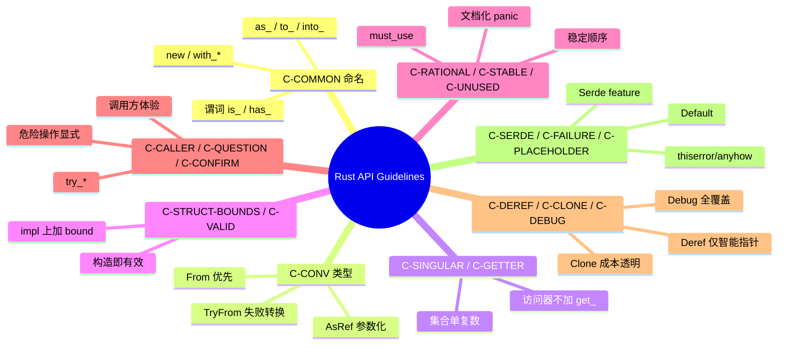

> **内容分级**: [专家级]
> **本节关键术语**: API 设计 · Rust API Guidelines · 命名规范 · 转换 trait · 错误处理 — [完整对照表](../01_terminology/01_terminology_glossary.md)

# Rust API Guidelines 权威指南

> **EN**: Rust API Guidelines Canonical Guide
> **Summary**: A systematic, example-driven guide to the Rust API Guidelines naming conventions, type conventions, predictability, flexibility, and debugging contracts, with idiomatic examples and counter-examples for each guideline.
>
> **Rust 版本**: 1.97.0+ (Edition 2024)
> **受众**: [进阶]
> **Bloom 层级**: L3-L5
> **权威来源**: 本文件为 `concept/` 权威页。
> **定位**: 本页是 Rust API Guidelines 在 `concept/` 中的**唯一权威解释页**，系统讲解 C-COMMON、C-CONV、C-SINGULAR、C-GETTER、C-STRUCT-BOUNDS、C-VALID、C-RATIONAL、C-STABLE、C-UNUSED、C-CALLER、C-QUESTION、C-CONFIRM、C-DEREF、C-CLONE、C-DEBUG、C-SERDE、C-FAILURE、C-PLACEHOLDER、C-INTERMEDIATE、C-ENTITY、C-METHOD 等核心约定，并给出 Rust 示例与反例。
>
> **前置概念**: [Type System](../../01_foundation/02_type_system/01_type_system.md) · [Traits](../../02_intermediate/00_traits/01_traits.md) · [Error Handling](../../02_intermediate/03_error_handling/01_error_handling.md) · [Iterator Idioms](../../01_foundation/05_collections/03_iterator_idioms.md)
> **后置概念**: [Idioms Spectrum](../../06_ecosystem/03_design_patterns/02_idioms_spectrum.md) · [Algorithm Engineering Practice](../../06_ecosystem/11_domain_applications/08_algorithm_engineering_practice.md)

---

> **来源**:
> [Rust API Guidelines](https://rust-lang.github.io/api-guidelines/) ·
> [The Rust Programming Language](https://doc.rust-lang.org/book/title-page.html) ·
> [Rust Design Patterns](https://rust-unofficial.github.io/patterns/) ·
> [Effective Rust](https://www.effective-rust.com/) ·
> [Rust for Rustaceans](https://rust-for-rustaceans.com/)

---

## 📑 目录

- [Rust API Guidelines 权威指南](#rust-api-guidelines-权威指南)
  - [📑 目录](#-目录)
  - [一、指南全景与认知地图](#一指南全景与认知地图)
  - [二、C-COMMON：常见 Rust 命名约定](#二c-common常见-rust-命名约定)
    - [2.1 构造器 `new` 与 `with_*`](#21-构造器-new-与-with_)
    - [2.2 转换方法 `as_*`、`to_*`、`into_*`](#22-转换方法-as_to_into_)
    - [2.3 访问器与修改器](#23-访问器与修改器)
    - [2.4 谓词方法](#24-谓词方法)
  - [三、C-CONV：类型与 trait 约定](#三c-conv类型与-trait-约定)
    - [3.1 实现 `From` 而非同时实现 `Into`](#31-实现-from-而非同时实现-into)
    - [3.2 可失败转换用 `TryFrom` / `TryInto`](#32-可失败转换用-tryfrom--tryinto)
    - [3.3 借用参数化用 `AsRef` / `Borrow`](#33-借用参数化用-asref--borrow)
  - [四、C-SINGULAR / C-GETTER：集合与访问器命名](#四c-singular--c-getter集合与访问器命名)
    - [4.1 集合方法：单数访问用 `get`，批量返回用复数](#41-集合方法单数访问用-get批量返回用复数)
    - [4.2 访问器命名](#42-访问器命名)
  - [五、C-STRUCT-BOUNDS / C-VALID：泛型边界与有效性](#五c-struct-bounds--c-valid泛型边界与有效性)
    - [5.1 结构体泛型边界（C-STRUCT-BOUNDS）](#51-结构体泛型边界c-struct-bounds)
    - [5.2 构造即有效（C-VALID）](#52-构造即有效c-valid)
  - [六、C-RATIONAL / C-STABLE / C-UNUSED：设计意图与稳定性](#六c-rational--c-stable--c-unused设计意图与稳定性)
    - [6.1 合理性与不变量（C-RATIONAL）](#61-合理性与不变量c-rational)
    - [6.2 稳定性（C-STABLE）](#62-稳定性c-stable)
    - [6.3 未使用值（C-UNUSED）](#63-未使用值c-unused)
  - [七、C-CALLER / C-QUESTION / C-CONFIRM：调用方体验](#七c-caller--c-question--c-confirm调用方体验)
    - [7.1 调用方优先（C-CALLER）](#71-调用方优先c-caller)
    - [7.2 疑问方法（C-QUESTION）](#72-疑问方法c-question)
    - [7.3 确认性操作（C-CONFIRM）](#73-确认性操作c-confirm)
  - [八、C-DEREF / C-CLONE / C-DEBUG：智能指针与可调试性](#八c-deref--c-clone--c-debug智能指针与可调试性)
    - [8.1 谨慎使用 Deref（C-DEREF）](#81-谨慎使用-derefc-deref)
    - [8.2 Clone 成本透明（C-CLONE）](#82-clone-成本透明c-clone)
    - [8.3 实现 Debug（C-DEBUG）](#83-实现-debugc-debug)
  - [九、C-SERDE / C-FAILURE / C-PLACEHOLDER：序列化与错误](#九c-serde--c-failure--c-placeholder序列化与错误)
    - [9.1 Serde 支持（C-SERDE）](#91-serde-支持c-serde)
    - [9.2 失败模式（C-FAILURE）](#92-失败模式c-failure)
    - [9.3 Placeholder 与默认值（C-PLACEHOLDER）](#93-placeholder-与默认值c-placeholder)
  - [十、C-INTERMEDIATE / C-ENTITY / C-METHOD：中间表示与实体 API](#十c-intermediate--c-entity--c-method中间表示与实体-api)
    - [10.1 中间表示（C-INTERMEDIATE）](#101-中间表示c-intermediate)
    - [10.2 实体类型（C-ENTITY）](#102-实体类型c-entity)
    - [10.3 方法设计（C-METHOD）](#103-方法设计c-method)
  - [十一、反例与陷阱汇总](#十一反例与陷阱汇总)
  - [十二、边界测试](#十二边界测试)
    - [12.1 边界测试：`From` 与 `Into` 的 blanket impl 冲突](#121-边界测试from-与-into-的-blanket-impl-冲突)
    - [12.2 边界测试：违反孤儿规则](#122-边界测试违反孤儿规则)
    - [12.3 边界测试：`Deref` 反模式](#123-边界测试deref-反模式)
  - [十三、思维导图](#十三思维导图)
  - [十四、国际权威参考](#十四国际权威参考)

---

## 一、指南全景与认知地图

Rust API Guidelines（rust-lang.github.io/api-guidelines）是 Rust 生态的**公共 API 设计宪法**。它把社区长期形成的最佳实践编码为可检查的命名、类型、trait 与文档约定。掌握这些约定是写出"像 Rust"的库的第一步，也是库 API 获得广泛采用的关键。

本页将这些约定重新组织为五条认知线：

1. **命名（Naming）**：C-COMMON、C-CONV、C-SINGULAR、C-GETTER、C-METHOD。
2. **类型与 trait（Types & Traits）**：C-STRUCT-BOUNDS、C-DEREF、C-CLONE、C-VALID。
3. **调用方体验（Caller Experience）**：C-CALLER、C-QUESTION、C-CONFIRM、C-UNUSED。
4. **可靠性与可调试性（Reliability & Debuggability）**：C-RATIONAL、C-STABLE、C-DEBUG、C-FAILURE。
5. **生态集成（Ecosystem Integration）**：C-SERDE、C-PLACEHOLDER、C-INTERMEDIATE、C-ENTITY。

> **核心原则**：库的公共 API 是**对外承诺**。每个公开项的名字、trait 实现、panic 条件、错误类型都是承诺的一部分，变更承诺即可能破坏下游代码。
>
> **编号说明**：本页使用的 `C-COMMON`、`C-CONV`、`C-SINGULAR` 等编号是为便于结构化教学而重新组织的**教学编号**，并非 [Rust API Guidelines 官方 Checklist](https://rust-lang.github.io/api-guidelines/checklist.html) 中的原始编号（官方编号如 `C-CASE`、`C-CONV`、`C-GETTER`、`C-COMMON-TRAITS` 等）。如需核对官方条目，请直接参考 [Rust API Guidelines — Checklist](https://rust-lang.github.io/api-guidelines/checklist.html) 与 [Naming](https://rust-lang.github.io/api-guidelines/naming.html)。

---

## 二、C-COMMON：常见 Rust 命名约定

C-COMMON 覆盖 Rust API 中最基础的命名规则。一致的命名让调用方仅凭函数名就能推断语义与副作用。

### 2.1 构造器 `new` 与 `with_*`

惯用：无参或主要参数的构造器叫 `new`；需要额外配置参数的构造器用 `with_*`。

```rust
pub struct Config {
    timeout: Duration,
}

impl Config {
    /// 默认构造
    pub fn new() -> Self {
        Self { timeout: Duration::from_secs(30) }
    }

    /// 带超时参数的构造
    pub fn with_timeout(timeout: Duration) -> Self {
        Self { timeout }
    }
}
```

反例：把无参构造器叫 `create` 或 `default_config`（违反约定，调用方会疑惑）。

### 2.2 转换方法 `as_*`、`to_*`、`into_*`

- `as_*`：廉价借用转换，返回引用或 cheap view（`as_slice`、`as_str`）。
- `to_*`：可能分配或做非平凡计算，返回独立新值（`to_string`、`to_vec`）。
- `into_*`：消费 `self`，返回另一种拥有的类型（`into_raw`、`into_boxed_slice`）。

```rust
let s = String::from("hello");
let slice: &str = s.as_str();    // as_：借用
let upper: String = s.to_uppercase(); // to_：新分配
let bytes: Vec<u8> = s.into_bytes();  // into_：消费 self
```

反例：消费 `self` 的方法叫 `to_*`，或 `as_*` 返回拥有的值。

### 2.3 访问器与修改器

惯用：访问器不加 `get_` 前缀，修改器用 `set_*`。

```rust
impl Rectangle {
    pub fn width(&self) -> u32 { self.width }
    pub fn set_width(&mut self, width: u32) { self.width = width; }
}
```

反例：`get_width(&self)`（冗余，Rust 约定省略 `get_`）。

### 2.4 谓词方法

惯用：返回 `bool` 的方法用 `is_*`、`has_*`、`can_*`。

```rust
impl Rectangle {
    pub fn is_empty(&self) -> bool { self.width == 0 || self.height == 0 }
    pub fn has_area(&self) -> bool { self.width > 0 && self.height > 0 }
}
```

---

## 三、C-CONV：类型与 trait 约定

C-CONV 要求类型转换、错误处理、集合接口遵循标准 trait 与命名。

### 3.1 实现 `From` 而非同时实现 `Into`

`Into<U> for T` 已由 `From<T> for U` 的 blanket impl 自动提供。手写 `Into` 会冲突。

```rust
pub struct Port(u16);

impl From<u16> for Port {
    fn from(p: u16) -> Self { Port(p) }
}

fn connect(port: impl Into<Port>) {
    let Port(p) = port.into();
    let _ = p;
}
```

反例：

```rust,compile_fail
pub struct Port(u16);

impl From<u16> for Port { fn from(p: u16) -> Self { Port(p) } }

// ❌ 错误：与 blanket impl 冲突
impl Into<Port> for u16 { fn into(self) -> Port { Port(self) } }
```

### 3.2 可失败转换用 `TryFrom` / `TryInto`

```rust
use std::convert::TryInto;

let x: i32 = 1000;
let y: Result<u8, _> = x.try_into(); // Err(TryFromIntError)
```

### 3.3 借用参数化用 `AsRef` / `Borrow`

API 接受 `impl AsRef<str>` 或 `impl AsRef<[T]>` 以最大化调用灵活性。

```rust
pub fn greet(name: impl AsRef<str>) {
    println!("Hello, {}!", name.as_ref());
}
```

---

## 四、C-SINGULAR / C-GETTER：集合与访问器命名

### 4.1 集合方法：单数访问用 `get`，批量返回用复数

惯用：`get(key)` 返回单个元素；返回集合时用 `values()`、`keys()`、`entries()` 等复数形式。

```rust
use std::collections::HashMap;

let mut map = HashMap::new();
map.insert("a", 1);
map.insert("b", 2);

let single = map.get("a");        // Option<&i32>
let values: Vec<&i32> = map.values().collect(); // 复数
```

反例：`get_values()` 返回单个值，或 `value()` 返回迭代器。

### 4.2 访问器命名

C-GETTER 强调：简单字段访问不应加 `get_` 前缀。

```rust
pub struct Point { x: f64, y: f64 }

impl Point {
    pub fn x(&self) -> f64 { self.x } // ✅
    pub fn y(&self) -> f64 { self.y } // ✅
}
```

反例：`pub fn get_x(&self) -> f64`（C 风格，不符合 Rust 社区习惯）。

---

## 五、C-STRUCT-BOUNDS / C-VALID：泛型边界与有效性

### 5.1 结构体泛型边界（C-STRUCT-BOUNDS）

惯用：在结构体定义上写 trait bound 仅当该 bound 是类型**固有属性**（如 `T: Clone` 且所有方法都依赖它）。否则把 bound 放到 impl block 上，避免过度约束调用方。

```rust
// ✅ 仅在 impl 上加 bound，结构体定义保持通用
pub struct Container<T> { value: T }

impl<T: Clone> Container<T> {
    pub fn duplicate(&self) -> Self {
        Self { value: self.value.clone() }
    }
}

// Container<NotClone> 仍可存在，只要不用 duplicate
```

反例：

```rust
// ❌ 过度约束：即使不使用 Clone 的方法，T 也必须是 Clone
pub struct Container<T: Clone> { value: T }
```

### 5.2 构造即有效（C-VALID）

构造器应保证对象处于有效状态；若需要两步初始化，使用 builder 或 typestate。

```rust
pub struct Email(String);

impl Email {
    /// 构造即验证，无效输入返回 Err
    pub fn parse(s: &str) -> Result<Self, &'static str> {
        if s.contains('@') {
            Ok(Self(s.to_string()))
        } else {
            Err("invalid email")
        }
    }
}
```

反例：提供 `pub fn new_unchecked` 却不标注 `unsafe`，导致调用方可能构造无效值。

---

## 六、C-RATIONAL / C-STABLE / C-UNUSED：设计意图与稳定性

### 6.1 合理性与不变量（C-RATIONAL）

API 行为应可被调用方理性预测。文档必须说明 panic 条件、错误语义、边界。

```rust
/// 返回切片前 `n` 个元素。
///
/// # Panics
/// Panics if `n > slice.len()`.
pub fn take_n<T>(slice: &[T], n: usize) -> &[T] {
    if n > slice.len() {
        panic!("n exceeds slice length");
    }
    &slice[..n]
}
```

### 6.2 稳定性（C-STABLE）

公共 API 的排序、迭代顺序、错误消息等若无文档保证，不应被调用方依赖。需要稳定顺序时显式文档化。

```rust
/// 按键的升序返回条目。
///
/// 迭代顺序是稳定的、公开保证的语义。
pub fn sorted_entries(&self) -> impl Iterator<Item = (&str, &i32)> { /* ... */ }
```

### 6.3 未使用值（C-UNUSED）

返回 `Result`、`Option`、`Iterator` 或重要副作用结果的方法应标记 `#[must_use]`。

```rust
#[must_use]
pub fn read_config(path: &str) -> Result<Config, io::Error> { /* ... */ }
```

反例：返回 `Result` 的方法未标 `#[must_use]`，调用方可能静默丢弃错误。

---

## 七、C-CALLER / C-QUESTION / C-CONFIRM：调用方体验

### 7.1 调用方优先（C-CALLER）

API 应让调用方写更少的类型标注、犯更少的错误。优先使用 `impl Trait`、默认参数、builder。

```rust
// ✅ 调用方无需 turbofish
pub fn connect(addr: impl ToSocketAddrs) -> io::Result<TcpStream> { /* ... */ }
```

### 7.2 疑问方法（C-QUESTION）

返回 `Option` 或 `Result` 且语义为"尝试做某事"的方法可用 `try_*` 前缀。

```rust
impl Stack {
    pub fn pop(&mut self) -> Option<i32> { /* ... */ }
    pub fn try_reserve(&mut self, additional: usize) -> Result<(), TryReserveError> { /* ... */ }
}
```

### 7.3 确认性操作（C-CONFIRM）

危险或不可逆操作应要求显式确认，例如消费 `self`、返回 `Result`、使用 `remove`/`delete` 等明确命名。

```rust
struct Database;
type DbError = ();

impl Database {
    /// 删除数据库；不可逆。
    pub fn drop(self) -> Result<(), DbError> { Ok(()) }
}
```

---

## 八、C-DEREF / C-CLONE / C-DEBUG：智能指针与可调试性

### 8.1 谨慎使用 Deref（C-DEREF）

`Deref` 只应用于智能指针或透明包装器，不应用于"模拟继承"。

```rust
use std::ops::Deref;

// ✅ 智能指针透明解引用
pub struct SmartBuffer<T> { data: Vec<T> }

impl<T> Deref for SmartBuffer<T> {
    type Target = [T];
    fn deref(&self) -> &[T] { &self.data }
}
```

反例：

```rust,compile_fail
pub struct Car { engine: Engine }

// ❌ 错误：Car 不是 Engine 的智能指针
impl std::ops::Deref for Car {
    type Target = Engine;
    fn deref(&self) -> &Engine { &self.engine }
}
```

### 8.2 Clone 成本透明（C-CLONE）

若类型实现 `Clone` 成本较高，文档应提示；优先用 `Copy` 或共享所有权 `Arc` 减少隐式拷贝。

```rust
#[derive(Clone)]
pub struct LargeBuffer { data: Vec<u8> }

// 文档提示：Clone 会复制整个 buffer
```

### 8.3 实现 Debug（C-DEBUG）

几乎所有公共类型都应实现 `Debug`，这是 Rust 错误处理与日志生态的基础。

```rust
use std::time::Duration;

#[derive(Debug)]
pub struct Config { timeout: Duration }
```

---

## 九、C-SERDE / C-FAILURE / C-PLACEHOLDER：序列化与错误

### 9.1 Serde 支持（C-SERDE）

配置、消息、持久化类型应提供 `Serialize` / `Deserialize` 支持，通常用 feature gate。

```rust
#[cfg(feature = "serde")]
use serde::{Deserialize, Serialize};

#[cfg_attr(feature = "serde", derive(Serialize, Deserialize))]
pub struct Config { timeout: u64 }
```

### 9.2 失败模式（C-FAILURE）

错误应可恢复、可区分、可链式追踪。库用 `thiserror`，应用用 `anyhow`。

```rust
use thiserror::Error;

#[derive(Debug, Error)]
pub enum ConfigError {
    #[error("io error: {0}")]
    Io(#[from] std::io::Error),
    #[error("invalid format")]
    InvalidFormat,
}
```

### 9.3 Placeholder 与默认值（C-PLACEHOLDER）

提供 `Default` 实现，并在文档中说明默认值。

```rust
impl Default for Config {
    fn default() -> Self {
        Self { timeout: 30 }
    }
}
```

---

## 十、C-INTERMEDIATE / C-ENTITY / C-METHOD：中间表示与实体 API

### 10.1 中间表示（C-INTERMEDIATE）

复杂转换应提供可检查、可复用的中间类型，而非一次性函数。

```rust
pub struct ParsedUrl { scheme: String, host: String, path: String }

impl ParsedUrl {
    pub fn parse(s: &str) -> Result<Self, UrlError> { /* ... */ }
    pub fn scheme(&self) -> &str { &self.scheme }
}
```

### 10.2 实体类型（C-ENTITY）

领域实体应封装不变量，暴露语义化方法而非裸字段。

```rust
pub struct UserId(u64);

impl UserId {
    pub fn new(raw: u64) -> Self { Self(raw) }
    pub fn as_u64(&self) -> u64 { self.0 }
}
```

### 10.3 方法设计（C-METHOD）

方法命名应反映动作与对象的关系：`len`、`is_empty`、`contains`、`insert`、`remove` 等是社区标准。

---

## 十一、反例与陷阱汇总

| 指南 | 反例 | 修正 |
|:---|:---|:---|
| C-COMMON | `get_width(&self)` | `width(&self)` |
| C-CONV | 手写 `Into` | 只实现 `From` |
| C-SINGULAR | `get_values()` 返回单个值 | `value()` / `values()` |
| C-STRUCT-BOUNDS | `struct Foo<T: Clone>` | `impl<T: Clone> Foo<T>` |
| C-VALID | 无验证的构造器 | `parse` / builder |
| C-UNUSED | 未标 `#[must_use]` 的 `Result` | 加 `#[must_use]` |
| C-DEREF | `Car` 代理 `Engine` | 显式方法 `engine()` |
| C-DEBUG | 公共类型未实现 `Debug` | `#[derive(Debug)]` |
| C-FAILURE | 返回 `String` 错误 | 定义 `thiserror` 枚举 |

---

## 十二、边界测试

### 12.1 边界测试：`From` 与 `Into` 的 blanket impl 冲突

```rust,compile_fail
pub struct Port(u16);

impl From<u16> for Port { fn from(p: u16) -> Self { Port(p) } }

// ❌ E0119：与标准库 blanket impl 冲突
impl Into<Port> for u16 { fn into(self) -> Port { Port(self) } }
```

> **修正**: 只实现 `From`，`Into` 会自动获得。来源: [std::convert](https://doc.rust-lang.org/std/convert/index.html)

### 12.2 边界测试：违反孤儿规则

```rust,compile_fail
impl From<String> for Vec<u8> {
    fn from(s: String) -> Vec<u8> { s.into_bytes() }
}
```

> **修正**: 用 newtype：`struct MyBytes(Vec<u8>); impl From<String> for MyBytes { ... }`。来源: [Rust Reference — Orphan Rules](https://doc.rust-lang.org/reference/items/implementations.html#orphan-rules)

### 12.3 边界测试：`Deref` 反模式

```rust,ignore
// ❌ 反模式：用 Deref 模拟继承；编译通过，但违反 API Guidelines C-DEREF
struct Engine;
struct Car { engine: Engine }

impl std::ops::Deref for Car {
    type Target = Engine;
    fn deref(&self) -> &Engine { &self.engine }
}
```

> **修正**: `Car` 不是 `Engine` 的智能指针；应提供 `fn engine(&self) -> &Engine`。来源: [Rust API Guidelines — C-DEREF](https://rust-lang.github.io/api-guidelines/predictability.html#c-deref)

---

## 十三、思维导图



> **认知功能**: 本 mindmap 把 API Guidelines 组织为"命名 → 类型 → 调用方 → 可靠性 → 生态"五层，便于按设计阶段检索。来源: [Rust API Guidelines](https://rust-lang.github.io/api-guidelines/)

---

## 十四、国际权威参考

- **P0 官方**: [Rust API Guidelines](https://rust-lang.github.io/api-guidelines/)
- **P1 生态**: [Rust Design Patterns](https://rust-unofficial.github.io/patterns/)
- **P1 书籍**: [Effective Rust](https://www.effective-rust.com/)
- **P1 书籍**: [Rust for Rustaceans](https://rust-for-rustaceans.com/)
- **P0 官方**: [The Rust Programming Language](https://doc.rust-lang.org/book/title-page.html)
- **P0 官方**: [Rust Reference](https://doc.rust-lang.org/reference/introduction.html)

---

> **权威来源**: [Rust API Guidelines](https://rust-lang.github.io/api-guidelines/)
> **状态**: ✅ 概念文件创建完成
> **最后更新**: 2026-07-30
