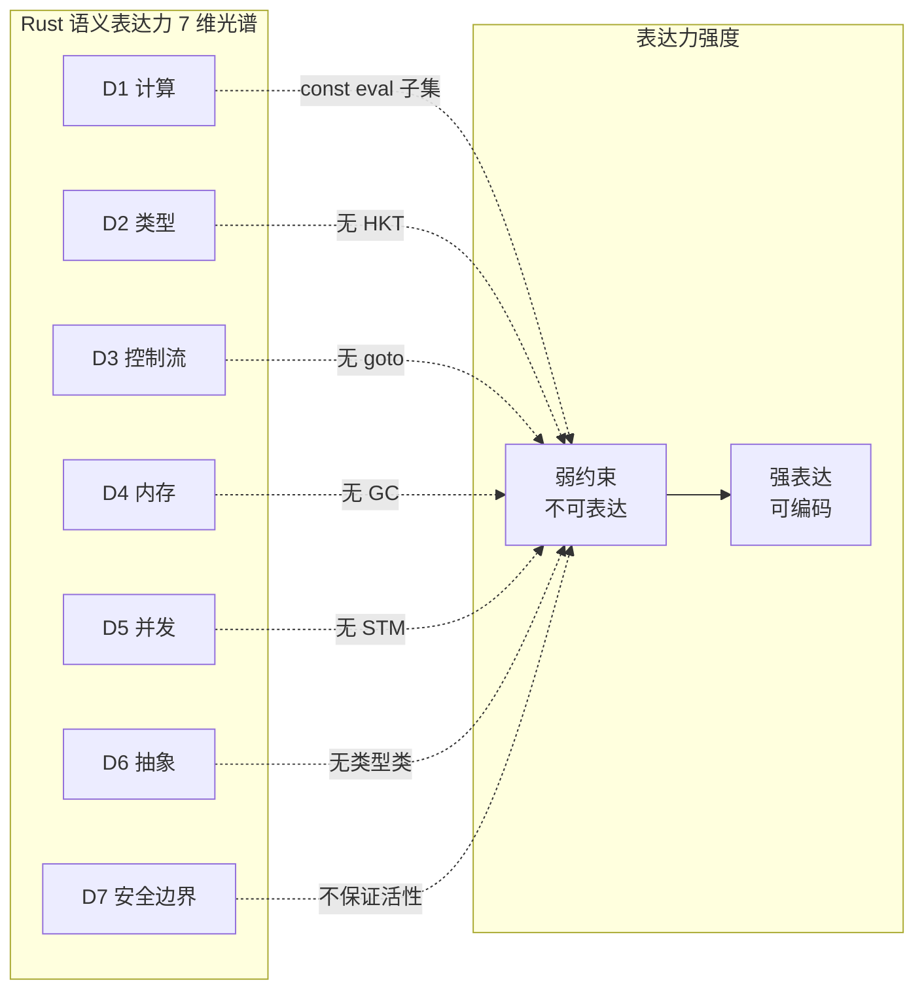
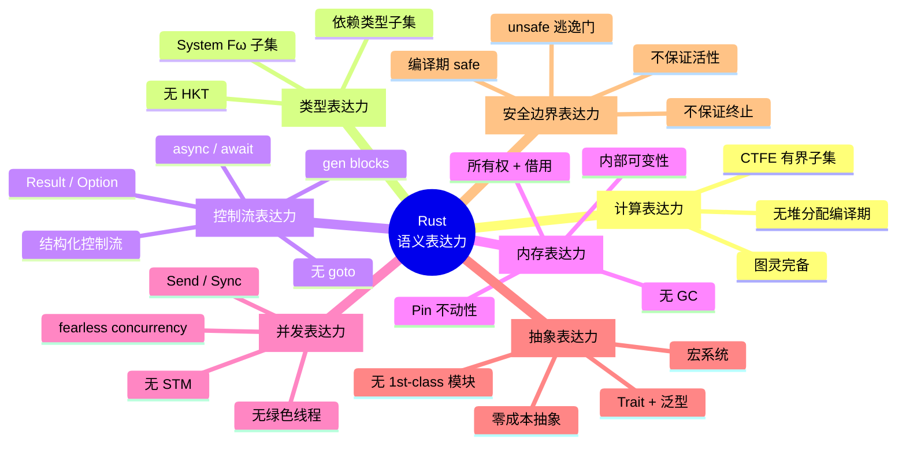

# Rust Semantic Expressiveness: A Panoramic Survey（Rust 语义表达力全景梳理）
>
> **EN**: Semantic Expressiveness
> **Summary**: A panoramic survey of Rust's semantic expressiveness across seven dimensions, contrasting computational, type-level, ownership, effect, concurrency, meta-programming, and interoperability boundaries with C++, Go, and Haskell.
>
> **Rust 版本**: 1.97.0+ (Edition 2024)
> **受众**: [研究者]
> **权威来源**: 本文件为 `concept/` 权威页。
> **定位**: 本文件从**横向语义维度**梳理 Rust 语言的表达能力光谱，与 L0-L7 纵向概念体系形成正交互补。
> **原则**: 不做"语法手册"，聚焦"Rust 能表达什么、不能表达什么、为什么选择这样的边界"。
> **对齐来源**: [Rust Reference](https://doc.rust-lang.org/reference/introduction.html) · [Rust RFCs](https://rust-lang.github.io/rfcs/index.html) · [Rust Internals Forum] · [RustBelt / Oxide](https://plv.mpi-sws.org/rustbelt/) · [KRust]
> **对比语言**: Rust · C++ · Go · Haskell
> **定理链**: N/A — 描述性/综述性/导航性文档，不涉及形式化定理链
>
> **来源**: [TRPL](https://doc.rust-lang.org/book/title-page.html) · [Rust Reference](https://doc.rust-lang.org/reference/introduction.html)
---

> **Bloom 层级**: L4-L6

**变更日志**:

- v1.0 (2026-05-13): 初始版本——7 维度框架 + D1-D3 完整填充 + 四语言对比矩阵

---

## 📑 目录

- [Rust Semantic Expressiveness: A Panoramic Survey（Rust 语义表达力全景梳理）](#rust-semantic-expressiveness-a-panoramic-surveyrust-语义表达力全景梳理)
  - [📑 目录](#-目录)
  - [零、TL;DR —— Rust 语义表达力速查](#零tldr--rust-语义表达力速查)
  - [一、权威来源与梳理方法论](#一权威来源与梳理方法论)
    - [1.1 来源分级](#11-来源分级)
    - [1.2 与 Rust Reference 的章节映射](#12-与-rust-reference-的章节映射)
  - [二、维度总览：7 维表达力光谱](#二维度总览7-维表达力光谱)
    - [2.1 光谱图](#21-光谱图)
    - [2.2 评估指标](#22-评估指标)
  - [三、D1 计算表达力（Computational Expressiveness）](#三d1-计算表达力computational-expressiveness)
    - [3.1 核心问题](#31-核心问题)
    - [3.2 表达力光谱](#32-表达力光谱)
    - [3.3 编译期计算边界](#33-编译期计算边界)
    - [3.4 与四语言对比](#34-与四语言对比)
    - [3.5 形式化边界](#35-形式化边界)
    - [3.6 映射到 L0-L7](#36-映射到-l0-l7)
  - [四、D2 类型表达力（Type Expressiveness）](#四d2-类型表达力type-expressiveness)
    - [4.1 核心问题](#41-核心问题)
    - [4.2 表达力光谱](#42-表达力光谱)
    - [4.3 类型系统特征矩阵](#43-类型系统特征矩阵)
    - [4.4 刻意缺失的类型特性](#44-刻意缺失的类型特性)
    - [4.5 与四语言对比](#45-与四语言对比)
    - [4.6 形式化边界：从 System F 到 Rust](#46-形式化边界从-system-f-到-rust)
    - [4.7 映射到 L0-L7](#47-映射到-l0-l7)
  - [五、D3 控制流表达力（Control Flow Expressiveness）](#五d3-控制流表达力control-flow-expressiveness)
    - [5.1 核心问题](#51-核心问题)
    - [5.2 表达力光谱](#52-表达力光谱)
    - [5.3 控制流机制矩阵](#53-控制流机制矩阵)
    - [5.4 刻意缺失的控制流特性](#54-刻意缺失的控制流特性)
    - [5.5 与四语言对比](#55-与四语言对比)
    - [5.6 形式化边界：Continuation 与状态机](#56-形式化边界continuation-与状态机)
    - [5.7 映射到 L0-L7](#57-映射到-l0-l7)
  - [六、D4 内存与资源表达力（Memory \& Resource Expressiveness）](#六d4-内存与资源表达力memory--resource-expressiveness)
    - [6.1 核心问题](#61-核心问题)
    - [6.2 表达力光谱](#62-表达力光谱)
    - [6.3 内存管理机制矩阵](#63-内存管理机制矩阵)
    - [6.4 内存模型的形式化分层](#64-内存模型的形式化分层)
    - [6.5 与四语言对比](#65-与四语言对比)
    - [6.6 形式化边界：从线性逻辑到 Rust](#66-形式化边界从线性逻辑到-rust)
    - [6.7 映射到 L0-L7](#67-映射到-l0-l7)
  - [七、D5 并发与并行表达力（Concurrency \& Parallelism Expressiveness）](#七d5-并发与并行表达力concurrency--parallelism-expressiveness)
    - [7.1 核心问题](#71-核心问题)
    - [7.2 表达力光谱](#72-表达力光谱)
    - [7.3 并发原语矩阵](#73-并发原语矩阵)
    - [7.4 Send/Sync：并发安全的类型系统编码](#74-sendsync并发安全的类型系统编码)
    - [7.5 与四语言对比](#75-与四语言对比)
    - [7.6 形式化边界：并发分离逻辑](#76-形式化边界并发分离逻辑)
    - [7.7 映射到 L0-L7](#77-映射到-l0-l7)
  - [八、D6 抽象与组合表达力（Abstraction \& Composition Expressiveness）](#八d6-抽象与组合表达力abstraction--composition-expressiveness)
    - [8.1 核心问题](#81-核心问题)
    - [8.2 表达力光谱](#82-表达力光谱)
    - [8.3 抽象机制矩阵](#83-抽象机制矩阵)
    - [8.4 元编程表达力：宏系统](#84-元编程表达力宏系统)
    - [8.5 形式化边界：参数性（Parametricity）](#85-形式化边界参数性parametricity)
    - [8.6 映射到 L0-L7](#86-映射到-l0-l7)
  - [九、D7 安全边界表达力（Safety Boundary Expressiveness）](#九d7-安全边界表达力safety-boundary-expressiveness)
    - [9.1 核心问题](#91-核心问题)
    - [9.2 安全保证光谱](#92-安全保证光谱)
    - [9.3 安全保证矩阵](#93-安全保证矩阵)
    - [9.4 未定义行为（UB）分类](#94-未定义行为ub分类)
    - [9.5 形式化验证的边界](#95-形式化验证的边界)
    - [9.6 与四语言对比](#96-与四语言对比)
    - [9.7 映射到 L0-L7](#97-映射到-l0-l7)
  - [十、跨维度对比矩阵](#十跨维度对比矩阵)
    - [10.1 Rust vs C++ vs Go vs Haskell：七维雷达图](#101-rust-vs-c-vs-go-vs-haskell七维雷达图)
    - [10.2 表达力-安全性帕累托前沿](#102-表达力-安全性帕累托前沿)
    - [10.3 "Rust 刻意不做"清单](#103-rust-刻意不做清单)
  - [十一、演进路线图（与 L7 前沿对齐）](#十一演进路线图与-l7-前沿对齐)
    - [11.1 各维度演进趋势](#111-各维度演进趋势)
    - [11.2 表达力扩展的边界约束](#112-表达力扩展的边界约束)
  - [十二、相关概念链接（L0-L7 映射）](#十二相关概念链接l0-l7-映射)
  - [附录：七维表达力光谱 Mindmap](#附录七维表达力光谱-mindmap)
  - [相关概念](#相关概念)
  - [认知路径](#认知路径)
    - [核心推理链](#核心推理链)
    - [反命题与边界](#反命题与边界)
  - [嵌入式测验（Embedded Quiz）](#嵌入式测验embedded-quiz)
    - [测验 1：本文档《Rust Semantic Expressiveness: A Panoramic Survey（Rust 语义表达力全景梳理）》在 Rust 知识体系中属于哪一层级的元数据？（理解层）](#测验-1本文档rust-semantic-expressiveness-a-panoramic-surveyrust-语义表达力全景梳理在-rust-知识体系中属于哪一层级的元数据理解层)
    - [测验 2：《Rust Semantic Expressiveness: A Panoramic Survey（Rust 语义表达力全景梳理）》的主要用途是什么？（理解层）](#测验-2rust-semantic-expressiveness-a-panoramic-surveyrust-语义表达力全景梳理的主要用途是什么理解层)
    - [测验 3：元数据层文档能否替代 L1-L7 的核心概念学习？（理解层）](#测验-3元数据层文档能否替代-l1-l7-的核心概念学习理解层)

## 零、TL;DR —— Rust 语义表达力速查

```text
维度                Rust 定位                          边界特征
─────────────────────────────────────────────────────────────────────────────
D1 计算            图灵完备 + 常量求值子集              编译期无堆分配；停机问题不可判定
D2 类型            System Fω 子集 + 依赖类型子集        无 HKT；无完整依赖类型；无类型级递归
D3 控制流          结构化 + Result + async + gen        无 goto；无 checked exceptions；单协程模型
D4 内存            所有权 + 借用 + 内部可变性           无 GC；无运行时借用检查；Pin 限制移动
D5 并发            Send/Sync + Mutex + async/rayon      无绿色线程；无 STM；无 Actor 运行时
D6 抽象            Trait + 泛型 + 宏 + 零成本           无类型类；无结构化类型；无 first-class 模块
D7 安全            编译期 safe + unsafe 逃逸门          不保证活性/终止/功能正确
```

**核心结论**: Rust 的语义设计遵循**"有纪律的表达力"**原则——在系统编程需要的维度上接近 C++ 的表达力，在类型安全维度上接近 Haskell 的保证，在简洁性维度上接受 Go 的约束，但**拒绝在三者之间做简单折中**，而是通过所有权系统重新定义了安全与表达力的帕累托前沿。

---

## 一、权威来源与梳理方法论

「权威来源与梳理方法论」部分包含来源分级 与 与 Rust Reference 的章节映射 两条主线，本节依次说明。

### 1.1 来源分级

| 层级 | 来源 | 作用 |
|:---|:---|:---|
| **一级** | [Rust Reference](https://doc.rust-lang.org/reference/introduction.html) | 语法和语义定义的**最权威来源**。本文件的 7 个维度直接映射到 Reference 的 20 章结构 |
| **一级** | [Rust RFCs](https://rust-lang.github.io/rfcs/index.html) | 设计决策记录，回答"为什么 Rust 选择这样的语义边界" |
| **二级** | [Rust Internals Forum](https://internals.rust-lang.org) | Niko Matsakis、Ralf Jung、without.boats 等核心开发者的语义讨论 |
| **二级** | RustBelt (Jung et al., POPL 2018) · Oxide (Weiss et al.) · KRust | 形式化可执行语义，界定表达力的数学边界 |
| **三级** | TRPL · Rustonomicon · The Rust Performance Book | 工程直觉与形式语义的桥梁 |

### 1.2 与 Rust Reference 的章节映射

```text
Rust Reference 20 章          →   本文件 7 维度
─────────────────────────────────────────────────
Ch.2 Lexical structure            →  D1 (计算常量求值的词法边界)
Ch.3 Macros                       →  D6 (元编程与抽象)
Ch.6 Items (函数/类型/trait/impl) →  D2 (类型) + D6 (抽象)
Ch.8 Statements & Expressions     →  D1 (计算) + D3 (控制流)
Ch.9 Patterns                     →  D3 (控制流分支)
Ch.10 Type system                 →  D2 (类型表达力核心)
Ch.11 Special types & traits      →  D2 (类型) + D4 (内存)
Ch.12 Names (作用域/可见性)        →  D6 (抽象组合)
Ch.13 Memory model                →  D4 (内存) + D5 (并发)
Ch.16 Unsafety                    →  D7 (安全边界)
Ch.17 Constant Evaluation         →  D1 (计算子集)
Ch.18 ABI                         →  D6 (FFI 与外部交互)
Ch.19 The Rust runtime            →  D5 (并发运行时)
```

> **关键洞察**: Rust Reference 的章节结构本身就是语义空间的最权威划分。本文件不是 Reference 的重复，而是将 Reference 的**纵向章节**重组为**横向表达力光谱**，并引入"边界分析"和"跨语言对比"两个 Reference 不包含的维度。

---

## 二、维度总览：7 维表达力光谱
>

### 2.1 光谱图



> **认知功能**: 此图以**双域映射**呈现 Rust 七维表达力的空间结构——左域定位各语义维度，右域统一标定表达力强度。建议在深入单维分析前 30 秒速览此图，建立"能力-边界"锚点。关键洞察：所有维度均指向同一弱极，印证 Rust 的缺失不是功能遗漏，而是"有纪律的表达力"的系统性设计。 [💡 原创分析](methodology.md)
> [Wikipedia — Programming Language](https://en.wikipedia.org/wiki/Programming_Language)

### 2.2 评估指标

每个维度按以下指标评估：

| 指标 | 含义 | 评估方法 |
|:---|:---|:---|
| **表达范围** | 该维度能编码的语义空间大小 | 与 Turing-complete / System F 等理论极限比较 |
| **保证强度** | 编译器能在该维度提供的静态保证 | soundness / completeness / parametricity |
| **零成本度** | 抽象是否带来运行时开销 | 单态化 / vtable / 动态检查 的占比 |
| **学习曲线** | 掌握该维度所需的概念负担 | Bloom 层级 + 认知路径步数 |
| **形式化成熟度** | 是否有机械验证的安全证明 | RustBelt / Iris / Kani 覆盖度 |

---

## 三、D1 计算表达力（Computational Expressiveness）
>

### 3.1 核心问题

Rust 能计算什么？常量求值的边界在哪？编译期计算与运行时计算的界限如何划分？

### 3.2 表达力光谱

```text
编译期计算子集（const eval）          运行时计算（Turing-complete）
─────────────────────────────────────────────────────────────────────
常量表达式: 1 + 2                      任意算法: 图灵完备
  ↓                                       ↓
const fn: 纯函数求值                   副作用: I/O、网络、文件
  ↓                                       ↓
const generics: 值→类型                动态分发: dyn Trait
  ↓                                       ↓
inline const: 块级常量                 递归/循环（无界）
  ↓                                       ↓
const trait impl (~const): 泛型常量     unsafe: 底层操作
  ↓                                       ↓
[边界] 编译期无堆分配                  [边界] 停机问题不可判定
```

### 3.3 编译期计算边界

Rust 的常量求值器（const evaluator）是 MIR 解释器的一个子集，**deliberately restricted**：

| 特性 | 编译期可用？ | 运行时可用？ | 设计理由 |
|:---|:---:|:---:|:---|
| 整数/布尔/字符运算 | ✅ | ✅ | 基础计算，无副作用 |
| `match` / `if` | ✅ | ✅ | 结构化控制流 |
| `loop` / `while` | ✅ | ✅ | [RFC 2344](https://rust-lang.github.io/rfcs//2344-const-looping.html) 允许循环常量求值 |
| `const fn` 调用 | ✅ | ✅ | 纯函数组合 |
| 堆分配 (`Box`, `Vec`) | ❌ | ✅ | 编译期无运行时内存管理器 |
| 浮点运算 (`f32`/`f64`) | ⚠️ 有限 | ✅ | IEEE 754 在交叉编译时不稳定 |
| `unsafe` 块 | ❌ | ✅ | 编译期无法验证 unsafe 语义 |
| Trait 动态分发 (`dyn`) | ❌ | ✅ | vtable 是运行时构造 |
| 递归类型构造 | ⚠️ 受限 | ✅ | 防止编译期无限展开 |

> **来源**: [Rust Reference: Constant Evaluation](https://doc.rust-lang.org/reference/introduction.html) · [RFC 2344: const_loop](https://github.com/rust-lang/rfcs/pull/2344) · [Rust Internals: const eval limitations]

### 3.4 与四语言对比

| 维度 | Rust | C++ | Go | Haskell |
|:---|:---|:---|:---|:---|
| **编译期计算** | `const fn` + `const` generics + `inline const` | `constexpr` (C++11) + `consteval` (C++20) + 模板元编程 | `const` 仅限常量表达式 | 任意纯函数（编译期/运行期无区分） |
| **图灵完备元编程** | ❌ 无（模板元编程被拒绝） | ✅ 模板元编程是图灵完备 | ❌ 无 | ✅ 类型级编程（Type Families） |
| **常量求值保证** | 编译期求值失败 = 编译错误 | `constexpr` 函数可能回退到运行时 | 常量表达式编译期求值 | 纯函数自动编译期求值（GHC） |
| **零成本抽象** | 单态化，`const` 无运行时开销 | 模板实例化，`constexpr` 内联 | 无泛型常量，无此问题 | 类型擦除/字典传递有运行时开销 |

> **关键洞察**: Rust 的编译期计算是**Haskell 的受限子集**（Haskell 不区分编译期/运行期纯函数），但**比 C++ constexpr 更保守**（无模板元编程的图灵完备性）。这是刻意的——Rust 团队认为模板元编程的图灵完备性带来了不可维护的代码，而 `const fn` 提供了足够的表达能力且保持可读性。

### 3.5 形式化边界

```text
定理（常量求值的可判定性）:
  Rust 的常量求值器在 safe 子集内是**可靠终止的**
    ↓
  但：包含循环的 const fn 可能因停机问题而编译超时
    ↓
  实践中：rustc 设置常量求值步数上限（默认 1_000_000 步）
    ↓
  超限 → 编译错误（非运行时错误）
```

> **来源**: [Rust Reference: Constant Evaluation — Query cycles](https://doc.rust-lang.org/reference/introduction.html) · [Rust Internals: const eval step limit]

### 3.6 映射到 L0-L7

| 本维度内容 | 对应 L0-L7 文件 | 对应章节 |
|:---|:---|:---|
| `const fn` 语义 | [](../../01_foundation/01_ownership_borrow_lifetime/01_ownership.md) | §3 所有权规则 |
| `const` generics | [](../../02_intermediate/01_generics/01_generics.md) | §5.7 Const Generics |
| `inline const` | [](../../07_future/00_version_tracking/01_rust_version_tracking.md) | §2.2 inline const blocks |
| 常量求值形式化 | [](../../04_formal/00_type_theory/01_type_theory.md) | §10.1b Const Generics 形式化演进 |
| `~const Trait` | [](../../02_intermediate/00_traits/01_traits.md) | §4.4 Const Trait / `~const` |

---

## 四、D2 类型表达力（Type Expressiveness）
>

### 4.1 核心问题

Rust 类型系统能编码什么不变式？它能表达哪些其他语言用不同类型系统机制表达的概念？它的边界在哪里？

### 4.2 表达力光谱

```text
简单类型 ──→ 参数多态 ──→ 存在类型 ──→ 高阶类型 ──→ 依赖类型
  i32         <T>          impl Trait      *缺失*       const N: usize
  bool        Vec<T>       dyn Trait                  Array<T, N>
  struct      fn<T>(T)     trait bounds
```

**Rust 的定位**: 参数多态 + 存在类型（受限）+ 依赖类型子集（`const` generics）+ **无**高阶类型。

### 4.3 类型系统特征矩阵

| 类型系统特性 | Rust 表达 | 形式化对应 | 零成本？ | 局限性 |
|:---|:---|:---|:---:|:---|
| **参数多态** | `fn<T>(x: T)` | System F `∀α.τ` | ✅ 单态化 | 代码膨胀 |
| **存在类型（隐藏）** | `impl Trait` | ∃α.τ | ✅ 静态分发 | 返回位置限制（RPIT） |
| **存在类型（动态）** | `dyn Trait` | ∃α.τ + vtable | ❌ vtable 间接 | 对象安全约束 |
| **关联类型** | `trait { type Assoc; }` | 类型族（Type Families） | ✅ 单态化 | 无高阶关联类型 |
| **GATs** | `trait { type Assoc<T>; }` | 高阶类型族（受限） | ✅ 单态化 | 生命周期 GAT 复杂 |
| **生命周期参数** | `&'a T` | 区域类型（Tofte-Talpin） | ✅ 编译期擦除 | HRTB 不可判定片段 |
| **常量参数** | `<const N: usize>` | 依赖类型子集 | ✅ 单态化 | 仅限原始类型常量 |
| **子类型** | `'a: 'b`（生命周期） | 结构子类型 | ✅ 无运行时 | 仅生命周期；无数据子类型 |
| **递归类型** | `enum List { Cons(T, Box<List>) }` | μα.τ | ⚠️ 需 `Box` 解除 | 无无限大小类型 |

> **来源**: [Rust Reference: Types](https://doc.rust-lang.org/reference/introduction.html) · [Pierce 2002 TAPL Ch.23-24] · [RFC 1210: impl Trait](https://doc.rust-lang.org/reference/types/impl-trait.html) · [RFC 1598: GATs](https://github.com/rust-lang/rfcs/pull/1598)

### 4.4 刻意缺失的类型特性

| 特性 | 为什么缺失 | 替代方案 | 形式化影响 |
|:---|:---|:---|:---|
| **高阶类型（HKT）** | 类型推断复杂度爆炸；实现成本极高 | GATs 提供受限替代 | System Fω 的受限子集 |
| **完整依赖类型** | 类型检查可能不可判定；与单态化冲突 | `const` generics 提供工程子集 | λΠ 的受限形式 |
| **类型级递归** | 无终止保证；类型推断不收敛 | 无直接替代 | 不可判定性边界 |
| **结构化类型** | Rust 选择名义类型（nominal）以保证 coherence | 元组/匿名 struct（实验性） | 子类型关系更复杂 |
| **类型类（Haskell-style）** | Trait 是名义的、基于 orphan rules 的 | Trait + impl 组合 | 无全局实例推导 |

> **来源**: [Rust Internals: HKT; why Rust doesn't have them] · [Type Theory Research: System Fω complexity] · [RFC 1210 coherence rules](https://doc.rust-lang.org/reference/items/implementations.html#coherence)

### 4.5 与四语言对比

| 维度 | Rust | C++ | Go | Haskell |
|:---|:---|:---|:---|:---|
| **参数多态** | ✅ 泛型 + Trait bound | ✅ 模板 + `concept` (C++20) | ❌ 无（`interface{}` 动态） | ✅ 类型类 + 多参数类型类 |
| **存在类型** | ✅ `impl`/`dyn` Trait | ⚠️ 概念存在但无直接语法 | ❌ 无 | ✅ `exists` / GADT |
| **高阶类型** | ❌ 无 | ❌ 无 | ❌ 无 | ✅ `Functor` / `Monad` |
| **依赖类型** | ⚠️ `const` generics 子集 | ❌ 无（模板非真正依赖类型） | ❌ 无 | ⚠️ GADT + 类型族（受限） |
| **子类型** | ⚠️ 仅生命周期 | ✅ 多重继承 + 隐式转换 | ❌ 无（structural interface） | ❌ 无（参数多态替代） |
| **类型推断** | ✅ HM 扩展（局部） | ⚠️ `auto` / `decltype`（受限） | ⚠️ 简单推断 | ✅ HM（全局、完备） |

> **关键洞察**: Rust 的类型系统是 **"C++ 的表达能力 + Haskell 的保证强度 - 两者的复杂性"** 的刻意裁剪。它拒绝 HKT 和完整依赖类型以降低编译器复杂度，但通过 GATs 和 `const` generics 保留了最有用的子集。

### 4.6 形式化边界：从 System F 到 Rust

```text
System F (λ2):        ∀α.τ          → Rust: fn<T>(x: T) → T
System Fω:            Λα:*→*.τ     → Rust: ❌ 无 HKT

Rust 扩展:
  + 生命周期参数:     ∀'a.τ         → 区域类型约束
  + Trait bound:      ∀T: Trait.τ   → 约束多态（λc）
  + 常量参数:         ∀n:usize.τ    → 依赖类型子集
  + 关联类型:         type Assoc    → 类型族（Fω 受限）

Rust 削减:
  - 无高阶类型构造器
  - 无类型级递归
  - 无完整依赖类型
  - 无隐式子类型（仅生命周期）
```

> **来源**: [Pierce 2002 TAPL Ch.23-29] · [RustBelt](https://plv.mpi-sws.org/rustbelt/) · [Oxide: Ownership and Borrowing in Rust]

### 4.7 映射到 L0-L7

| 本维度内容 | 对应 L0-L7 文件 | 对应章节 |
|:---|:---|:---|
| 参数多态 / System F | [](../../04_formal/00_type_theory/01_type_theory.md) | §2.2 参数多态 |
| 存在类型 `impl`/`dyn` | [](../../02_intermediate/01_generics/01_generics.md) | §6 存在类型 |
| GATs | [](../../02_intermediate/00_traits/01_traits.md) | §7 GATs |
| 生命周期 / 区域类型 | [](../../01_foundation/01_ownership_borrow_lifetime/03_lifetimes.md) | 全文 |
| `const` generics | [](../../02_intermediate/01_generics/01_generics.md) | §5.7 Const Generics |
| 类型推断 / HM | [](../../04_formal/00_type_theory/01_type_theory.md) | §2.3 类型推断 |
| 类型一致性 / coherence | [](../../02_intermediate/00_traits/01_traits.md) | §6 Orphan Rules |

---

## 五、D3 控制流表达力（Control Flow Expressiveness）
>

### 5.1 核心问题

Rust 如何表达计算的控制结构？从结构化控制到异常处理到异步到生成器，控制流的表达能力如何分层？

### 5.2 表达力光谱

```text
结构化控制 ──→ 错误传播 ──→ 异常 ──→ 异步 ──→ 生成器
  if/loop      Result/?     panic      async      gen
  match        Option/?     catch      await      yield
                              unwinding
```

### 5.3 控制流机制矩阵

| 机制 | 语法 | 语义 | 零成本？ | 与类型系统关系 |
|:---|:---|:---|:---:|:---|
| **结构化分支** | `if` / `match` | 表达式有值，穷尽性检查 | ✅ | `match` 穷尽性 = 类型安全 |
| **循环** | `loop` / `while` / `for` | `loop` 可返回类型值 | ✅ | `break` 携带值 = 类型一致 |
| **错误传播** | `Result<T, E>` + `?` | 显式错误路径，无隐式跳转 | ✅ | `Try` trait 抽象 |
| **不可恢复错误** | `panic!` | 栈展开或立即中止 | ⚠️ 展开有成本 | 无类型关联 |
| **异步** | `async` / `.await` | 状态机挂起/恢复 | ✅ 编译为状态机 | `Future` trait + `Pin` |
| **生成器** | `gen` / `yield` | 同步协程，产生迭代器 | ✅ 编译为状态机 | `Iterator` trait |
| **函数返回** | `return` / 尾表达式 | 表达式块有值 | ✅ | 返回类型检查 |
| **闭包** | `\|x\| x + 1` | 捕获环境，匿名函数 | ✅ 单态化 | `Fn`/`FnMut`/`FnOnce` |

> **来源**: [Rust Reference: Expressions](https://doc.rust-lang.org/reference/introduction.html) · [RFC 243: trait-based exception handling](https://rust-lang.github.io/rfcs/0243-trait-based-exception-handling.html) · [RFC 3668: AsyncFn](https://github.com/rust-lang/rfcs/pull/3668)

### 5.4 刻意缺失的控制流特性

| 特性 | 为什么缺失 | 替代方案 | 形式化影响 |
|:---|:---|:---|:---|
| **`goto`** | 破坏结构化编程；与所有权/借用冲突 | 循环 + `break` + `match` | 控制流图可简化 |
| **Checked exceptions** | 增加类型签名噪音；效果污染问题 | `Result<T, E>` + `?` | 错误是类型的一部分 |
| **多重返回 / yield from** | 复杂度；与 `Pin` 语义冲突 | 手动组合 `Stream` | Continuation 受限 |
| **Call/cc（一流续体）** | 与栈分配和所有权模型不兼容 | `async`/`await` 提供受限续体 | 非局部控制转移 = 内存不安全 |
| **Green threads / M:N** | 运行时负担；与 FFI 冲突（RFC 230） | OS 线程 + `async` 协作式 | 零成本抽象的坚持 |

> **来源**: [Rust Internals: why no goto] · [RFC 230: remove green threads](https://github.com/rust-lang/rfcs/pull/230) · [without.boats blog: async/await design]

### 5.5 与四语言对比

| 维度 | Rust | C++ | Go | Haskell |
|:---|:---|:---|:---|:---|
| **结构化控制** | ✅ 表达式块有值 | ✅ 语句导向（C++17 `if` init） | ✅ 简单 | ✅ `case` / `do` 语法 |
| **错误处理** | ✅ `Result` + `?` | ⚠️ 异常（隐式、非类型安全） | ⚠️ 多返回值 `error` | ✅ `Either` + `do` notation |
| **异步** | ✅ `async`/`await` + `Future` | ⚠️ C++20 coroutines（复杂） | ✅ goroutine（内置调度） | ✅ `IO` monad / `async` 库 |
| **生成器/协程** | 🚧 `gen` blocks（实验） | ⚠️ C++20 coroutines | ❌ 无 | ✅ 列表推导 / `yield` |
| **闭包** | ✅ 环境捕获 + 所有权转移 | ✅ lambda（C++11） | ✅ 闭包 | ✅ lambda / 部分应用 |
| **模式匹配** | ✅ 穷尽性检查 | ⚠️ `std::visit`（C++17，弱） | ❌ 无（`switch` 无穷尽） | ✅ 代数类型 + 穷尽性 |

> **关键洞察**: Rust 的控制流设计遵循 **"显式优于隐式"** 原则。`Result` 替代异常使错误路径可见；`async` 替代 green threads 使调度点（`.await`）显式；`match` 替代 `switch` 使穷尽性可检查。这不是表达能力上的限制，而是**可维护性和可验证性**上的增强。

### 5.6 形式化边界：Continuation 与状态机

```text
异步控制流的形式化:
  async fn foo() -> T
    ⟹ 编译器生成状态机 S，状态 = {Suspended(点1), Suspended(点2), ..., Ready(T)}
    ⟹ .await 点 = 状态迁移函数
    ⟹ Pin<&mut Self> 保证状态机不被移动

定理（async 零成本）:
  async fn 的运行时开销 = 等价手写状态机
    ↓
  无额外分配（默认）
  无调度器开销（仅在 .await 点让出）
```

> **来源**: [without.boats blog: Zero-cost async] · [Rust Reference: Async blocks](https://doc.rust-lang.org/reference/introduction.html) · [RustBelt](https://plv.mpi-sws.org/rustbelt/)

### 5.7 映射到 L0-L7

| 本维度内容 | 对应 L0-L7 文件 | 对应章节 |
|:---|:---|:---|
| `match` 穷尽性 | [](../../01_foundation/02_type_system/01_type_system.md) | §4 模式匹配 |
| `Result` / `?` | [](../../02_intermediate/03_error_handling/01_error_handling.md) | 全文 |
| `panic` / `catch_unwind` | [](../../02_intermediate/03_error_handling/01_error_handling.md) | §5 panic |
| `async` / `await` | [](../../03_advanced/01_async/01_async.md) | 全文 |
| `gen` blocks | [](../../03_advanced/01_async/01_async.md) | §13 gen blocks |
| 闭包捕获语义 | [](../../02_intermediate/00_traits/01_traits.md) | §4 闭包与 `Fn` 家族 |
| 状态机形式化 | [](../../04_formal/01_ownership_logic/02_ownership_formal.md) | §9.5 Pin LTL 形式化 |

---

## 六、D4 内存与资源表达力（Memory & Resource Expressiveness）
>

### 6.1 核心问题

Rust 如何表达内存布局、生命周期、所有权转移和内部可变性？它与 C++ 的手动管理、Go 的 GC、Haskell 的惰性求值在内存语义上有何根本差异？

### 6.2 表达力光谱

```text
静态内存 ──→ 栈分配 ──→ 堆分配 ──→ 借用 ──→ 内部可变性 ──→ 裸指针
  常量        局部变量      Box<T>      &T/&mut T   RefCell/Mutex   *const/*mut
               (RAII)        Vec<T>                    UnsafeCell
```

### 6.3 内存管理机制矩阵

| 机制 | 语法 | 所有权语义 | 释放时机 | 零成本？ | 形式化对应 |
|:---|:---|:---|:---|:---:|:---|
| **栈变量** | `let x = 5;` | 作用域拥有 | 作用域结束 | ✅ | 线性逻辑 ⊗ |
| **堆分配（唯一）** | `Box::new(v)` | `Box` 拥有 | `Box` drop | ✅ | 独占 points-to `l ↦ v` |
| **堆分配（共享）** | `Rc::new(v)` | 引用计数 | 计数归零 | ❌ 计数开销 | 持久资源 `□(l ↦ v)` |
| **堆分配（线程共享）** | `Arc::new(v)` | 原子引用计数 | 计数归零 | ❌ 原子开销 | 并发资源不变量 |
| **共享借用** | `&T` | 不可变共享 | 借用结束 | ✅ | 分数权限 `0<π<1` |
| **可变借用** | `&mut T` | 独占可变 | 借用结束 | ✅ | 独占权限 `π=1` |
| **内部可变性** | `Cell<T>` | 值语义内部变 | — | ✅ | 内存位置单所有者 |
| **内部可变性（借用）** | `RefCell<T>` | 运行时借用检查 | — | ❌ 运行时 flag | 运行时分离逻辑 |
| **内部可变性（并发）** | `Mutex<T>` | 锁保护 | — | ❌ 锁开销 | 并发分离逻辑 |
| **裸指针** | `*const T` | 无所有权 | 手动管理 | ✅ | 无形式化保证 |
| **Pin（不动性）** | `Pin<P<T>>` | 地址不变 | 直到 drop | ✅ | LTL `□addr_stable` |

> **来源**: [Rust Reference: Memory model](https://doc.rust-lang.org/reference/introduction.html) · [Rustonomicon: Ownership](https://doc.rust-lang.org/nomicon/index.html) · [RustBelt](https://plv.mpi-sws.org/rustbelt/)

### 6.4 内存模型的形式化分层

```text
Rust 内存模型三层:

L1: 编译期抽象（borrow checker）
  └── 所有权、生命周期、借用规则
  └── 形式化: Oxide / Calculus of Ownership and Resources

L2: 运行时别名模型（Miri）
  └── Stacked Borrows / Tree Borrows
  └── 形式化: 操作语义（operational semantics）

L3: 机器内存模型（LLVM）
  └── C11-style memory model（acquire/release/seq_cst）
  └── 形式化: 并发内存模型（weakestmo / RC11）

关键保证: L1 ⟹ L2 ⟹ L3，安全 Rust 代码在三层模型中行为一致
```

> **来源**: [Rust Reference: Memory model](https://doc.rust-lang.org/reference/introduction.html) · [Jung et al. POPL 2019 — Stacked Borrows] · [Pichon-Pharabod & Dreyer — Tree Borrows]

### 6.5 与四语言对比

| 维度 | Rust | C++ | Go | Haskell |
|:---|:---|:---|:---|:---|
| **栈分配** | ✅ RAII + 确定性 drop | ✅ RAII / 作用域 | ✅ 自动（GC 管理逃逸） | ⚠️ 惰性求值 + thunk 分配 |
| **堆分配（唯一）** | ✅ `Box<T>`（编译期保证） | ⚠️ `unique_ptr`（运行时） | ❌ 无（GC 统一管理） | ❌ 无（GC / 引用计数） |
| **堆分配（共享）** | ✅ `Rc`/`Arc`（显式计数） | ⚠️ `shared_ptr`（运行时） | ❌ GC 自动 | ⚠️ GC 自动 |
| **借用** | ✅ `&T`/`&mut T`（编译期） | ❌ 原始引用（无检查） | ❌ 无（仅指针） | ❌ 无（纯函数隔离） |
| **内部可变性** | ✅ `Cell`/`RefCell`/`Mutex` | ⚠️ `mutable` / `const_cast` | ⚠️ 通道 / `sync` 包 | ⚠️ `IORef` / `MVar` |
| **裸指针** | ✅ `unsafe` 块内可用 | ✅ 随处可用 | ⚠️ `unsafe` 包 | ❌ 无（FFI 边界） |
| **Pin/不动性** | ✅ `Pin<P<T>>` | ❌ 无直接对应 | ❌ 无 | ❌ 无（纯函数无地址概念） |
| **自定义布局** | ✅ `repr(C)` / `repr(packed)` | ✅ `alignas` / `packed` | ⚠️ `unsafe` 包 | ❌ 无（运行时决定） |

> **关键洞察**: Rust 的内存表达力是 **"C++ 的控制 + Haskell 的安全保证 - 两者的运行时开销"**。`Box`/`Rc`/`Arc` 在 Rust 中是显式的库类型，在 C++ 中也是，但 Rust 的编译期借用检查使 **"共享 XOR 可变"** 成为类型系统的定理而非编码约定。Go 和 Haskell 通过 GC 消除了内存管理的表达需求，但也消除了对内存布局的精确控制。

### 6.6 形式化边界：从线性逻辑到 Rust

```text
线性逻辑          Rust 类型系统
─────────────────────────────────────
A ⊗ B            (T, U) —— 元组，两个资源同时拥有
A ⅋ B            无直接对应（并发组合）
A ⊸ B            fn(T) -> U —— 消耗 T 产生 U
!A               Copy trait —— 允许复制（weakening）
1                () —— 单位类型
0                ! —— never type（不可达）

关键映射:
  线性性: 所有权 = 资源不可复制（默认）
  仿射性: Move 语义 = 资源可消耗但不可复制
  分数权限: &T = 共享读取（π < 1），&mut T = 独占写入（π = 1）
```

> **来源**: [Girard 1987 — Linear Logic] · [04_formal/01_linear_logic.md] · [RustBelt](https://plv.mpi-sws.org/rustbelt/)

### 6.7 映射到 L0-L7

| 本维度内容 | 对应 L0-L7 文件 | 对应章节 |
|:---|:---|:---|
| 所有权与 Move | [](../../01_foundation/01_ownership_borrow_lifetime/01_ownership.md) | 全文 |
| 借用与生命周期 | [](../../01_foundation/01_ownership_borrow_lifetime/02_borrowing.md) | 全文 |
| 内部可变性 | [](../../02_intermediate/02_memory_management/01_memory_management.md) | §4 智能指针 |
| `Pin` 不动性 | [](../../03_advanced/01_async/01_async.md) | §3.2 Pin 形式化 |
| 别名模型 | [](../../04_formal/01_ownership_logic/02_ownership_formal.md) | §11 SB/TB |
| 线性逻辑映射 | [](../../04_formal/01_ownership_logic/01_linear_logic.md) | 全文 |
| 并发内存模型 | [](../../03_advanced/00_concurrency/01_concurrency.md) | §2 happens-before |

---

## 七、D5 并发与并行表达力（Concurrency & Parallelism Expressiveness）
>

### 7.1 核心问题

Rust 如何表达并发和并行？从共享状态到消息传递到数据并行，Rust 的并发模型覆盖了哪些范式、排除了哪些范式？

### 7.2 表达力光谱

```text
共享状态并发 ──→ 消息传递 ──→ 数据并行 ──→ 异步任务
  Mutex/Arc       Channel        rayon          async/await
  RwLock          mpsc           par_iter       tokio::spawn
  AtomicUsize
```

### 7.3 并发原语矩阵

| 原语 | 同步模型 | 类型安全保证 | 运行时成本 | 适用场景 |
|:---|:---|:---|:---|:---|
| **`Mutex<T>`** | 互斥锁 | `T: Send` 保证跨线程安全 | 锁竞争开销 | 共享可变状态 |
| **`RwLock<T>`** | 读写锁 | `T: Send + Sync` | 读者协调开销 | 多读少写 |
| **`AtomicUsize`** | 无锁原子操作 | `Ordering` 参数 | 内存屏障成本 | 计数器、标志 |
| **`Channel (mpsc)`** | 消息队列 | `T: Send` | 内存拷贝/移动 | 任务解耦 |
| **`Arc<T>`** | 原子引用计数 | `T: Send + Sync` | 原子递增开销 | 共享所有权 |
| **`rayon::join`** | Fork-join 并行 | 闭包 `Send` | 线程池调度 | 数据并行 |
| **`tokio::spawn`** | 协作式多任务 | `Future: Send` | 状态机调度 | I/O 密集型并发 |
| **`std::thread`** | OS 线程 | 闭包 `Send` | 1.7μs 上下文切换 | CPU 密集型并行 |

> **来源**: [Rust Reference: Send and Sync](https://doc.rust-lang.org/reference/introduction.html) · [RustBelt](https://plv.mpi-sws.org/rustbelt/) · [Rayon Documentation] · [Tokio Documentation](https://tokio.rs/)

### 7.4 Send/Sync：并发安全的类型系统编码

Rust 的并发安全不是运行时检查，而是**类型系统的定理**：

```rust,ignore
// 编译器自动推导（auto trait）
unsafe impl Send for MyType {}   // MyType 可跨线程转移所有权
unsafe impl Sync for MyType {}   // MyType 可跨线程共享引用（&MyType: Send）

// 定理: Send + Sync 的正确实现 ⟹ 无数据竞争
// RustBelt 在 Iris 中机械证明了该定理
```

| 类型 | `Send` | `Sync` | 原因 |
|:---|:---:|:---:|:---|
| `i32` | ✅ | ✅ | 值类型，复制安全 |
| `String` | ✅ | ✅ | 堆数据唯一拥有 |
| `Rc<T>` | ❌ | ❌ | 非原子引用计数 |
| `Arc<T>` | ✅（若 `T: Send`） | ✅（若 `T: Sync`） | 原子引用计数 |
| `RefCell<T>` | ✅（若 `T: Send`） | ❌ | 运行时借用检查非线程安全 |
| `Mutex<T>` | ✅（若 `T: Send`） | ✅（若 `T: Send`） | 锁保护内部可变性 |
| `*const T` | ✅（若 `T: Sync`） | ✅（若 `T: Sync`） | 裸指针无自动实现 |

> **来源**: [Rust Reference: Auto traits](https://doc.rust-lang.org/reference/introduction.html) · [RustBelt](https://plv.mpi-sws.org/rustbelt/)

### 7.5 与四语言对比

| 维度 | Rust | C++ | Go | Haskell |
|:---|:---|:---|:---|:---|
| **线程模型** | 1:1 OS 线程 | 1:1 OS 线程 | M:N goroutine（运行时调度） | 1:1 OS 线程 / green threads |
| **共享状态安全** | ✅ 编译期（Send/Sync） | ❌ 手动（mutex + 约定） | ⚠️ 通道为主（`chan`） | ⚠️ `MVar` / `TVar`（STM） |
| **数据并行** | ✅ rayon（零成本） | ⚠️ OpenMP / TBB（库） | ❌ 无内置 | ⚠️ `par` 库 |
| **异步 I/O** | ✅ async/await + 运行时 | ⚠️ C++20 coroutines（复杂） | ✅ goroutine + 调度器 | ✅ `async` 库 |
| **无锁编程** | ✅ `Atomic*` + `Ordering` | ⚠️ `std::atomic`（弱类型） | ❌ 无 | ⚠️ `atomic-primops` |
| **死锁检测** | ❌ 无（不保证活性） | ❌ 无 | ❌ 无 | ❌ 无 |
| **STM** | ❌ 无 | ❌ 无 | ❌ 无 | ✅ `STM` monad |

> **关键洞察**: Rust 的并发模型是 **"C++ 的底层控制 + Haskell 的类型安全保证 - 运行调度器"**。Go 通过 goroutine 隐藏了并发复杂性，但也隐藏了性能特征；Rust 要求程序员显式选择线程/通道/async，但通过类型系统保证这些选择的安全性。STM 的缺失是刻意的——Rust 团队认为 STM 的乐观冲突检测在高竞争场景下性能不可预测。

### 7.6 形式化边界：并发分离逻辑

```text
定理（RustBelt 并发安全）:
  ∀P. P 在 safe Rust 中编译通过 ∧ P 仅使用标准库并发原语
    ⇒ P 无数据竞争

证明基础设施:
  - Iris 高阶并发分离逻辑（L1 逻辑层）
  - 资源不变量建模 Mutex/Arc（L2 语义层）
  - 原子操作语义对齐 C11 memory model（L3 机器层）

未覆盖边界:
  - 死锁（活性未保证）
  - 活锁 / 饥饿
  - 自定义同步原语（需人工 Iris 协议验证）
```

> **来源**: [RustBelt](https://plv.mpi-sws.org/rustbelt/) · [O'Hearn 2007 — Separation Logic] · [Iris Project: iris-project.org]

### 7.7 映射到 L0-L7

| 本维度内容 | 对应 L0-L7 文件 | 对应章节 |
|:---|:---|:---|
| `Send`/`Sync` 语义 | [](../../03_advanced/00_concurrency/01_concurrency.md) | §2 Send/Sync |
| `Mutex`/`Arc` 形式化 | [](../../04_formal/02_separation_logic/01_rustbelt.md) | §3 CSL |
| 原子操作 / `Ordering` | [](../../03_advanced/00_concurrency/01_concurrency.md) | §3.2 原子操作 |
| `rayon` 数据并行 | [](../../06_ecosystem/02_core_crates/01_core_crates.md) | §4 rayon |
| `tokio` 异步运行时 | [](../../03_advanced/01_async/01_async.md) | §3 调度模型 |
| 并发安全定理 | [](../../04_formal/02_separation_logic/01_rustbelt.md) | §2.1 定理矩阵 T1 |

---

## 八、D6 抽象与组合表达力（Abstraction & Composition Expressiveness）
>

### 8.1 核心问题

Rust 如何组合代码、隐藏实现细节、创建可复用抽象？从函数到模块到 trait 到宏，抽象机制的表达能力如何分层？

### 8.2 表达力光谱

```text
函数 ──→ 模块 ──→ Trait ──→ 泛型 ──→ 宏 ──→ 过程宏 ──→ FFI
  fn      mod      trait     <T>      macro!    #[derive]   extern
```

### 8.3 抽象机制矩阵

| 机制 | 组合方式 | 信息隐藏 | 零成本？ | 元编程能力 |
|:---|:---|:---|:---:|:---|
| **函数** | 调用/组合 | 签名可见，体隐藏 | ✅ | 无 |
| **模块** | `use` / `pub` | 可见性控制 | ✅ | 无 |
| **Trait** | `impl` / bound | 接口与实现分离 | ✅ | 无 |
| **泛型** | 单态化实例化 | 实现代码生成 | ✅ | 编译期特化 |
| **宏 (`macro_rules!`)** | 语法扩展 | 代码生成（hygienic） | ✅ | 模式匹配生成 |
| **过程宏** | 编译器插件 | AST → AST 变换 | ✅ | 任意 Rust 代码生成 |
| **FFI (`extern`)** | C ABI 调用 | 类型映射 | ⚠️ 调用开销 | 外部世界交互 |
| **Type Alias** | 语义等价 | 实现细节暴露 | ✅ | 无 |
| **Newtype** | 包装 + Deref | 完全隐藏内部 | ✅ | 无 |

> **来源**: [Rust Reference: Macros](https://doc.rust-lang.org/reference/introduction.html) · [Rust Reference: Items](https://doc.rust-lang.org/reference/introduction.html) · [RFC 1584: macros 2.0](https://rust-lang.github.io/rfcs/1584-macros.html)

### 8.4 元编程表达力：宏系统

Rust 的宏系统分为两层：

```text
声明宏 (macro_rules!):
  ├── 基于模式匹配的语法扩展
  ├── Hygienic（卫生宏）— 避免变量名冲突
  ├── 无类型检查 — 展开后才检查
  └── 例: vec![1, 2, 3], println!("{}", x)

过程宏 (Procedural Macros):
  ├── 函数式宏: my_macro!(tokens) → tokens
  ├── Derive 宏: #[derive(Debug)] → impl Debug
  ├── 属性宏: #[my_attr] → 代码变换
  ├── 完整 AST 访问 — 可分析/变换任意语法
  └── 例: serde::Deserialize, tokio::main
```

| 维度 | Rust | C++ | Go | Haskell |
|:---|:---|:---|:---|:---|
| **声明宏** | ✅ `macro_rules!`（hygienic） | ⚠️ 预处理器（无卫生） | ❌ 无 | ❌ 无（Template Haskell 是过程式） |
| **过程宏 / 编译器插件** | ✅ 完整 AST 访问 | ❌ 无标准机制（clang plugin） | ❌ 无 | ✅ Template Haskell |
| **泛型特化** | ⚠️ 最小化特化（未稳定） | ✅ 模板特化 + SFINAE | ❌ 无 | ✅ 实例选择（type classes） |
| **模块化** | ✅ crates + modules + visibility | ⚠️ 头文件 + 命名空间 | ✅ 包 + 模块 | ✅ 模块 + 类型类 |
| **FFI** | ✅ `extern` + `bindgen` | ✅ `extern "C"` | ✅ `cgo`（有开销） | ✅ FFI（GHC） |
| **编译期反射** | ⚠️ 有限（`Any` trait） | ✅ RTTI / 模板元编程 | ❌ 无 | ❌ 无（运行时类型信息弱） |

> **关键洞察**: Rust 的抽象设计遵循 **"零成本抽象的坚持"**。C++ 模板提供了更强的编译期计算能力（图灵完备），但代价是编译时间爆炸和错误信息不可读；Rust 的宏系统故意限制在"语法扩展"层面，将复杂元编程留给过程宏（有完整编译器支持）。Go 在抽象表达力上做了最大程度的简化，这降低了学习曲线，但也限制了代码复用模式。

### 8.5 形式化边界：参数性（Parametricity）

```text
定理（Wadler 1989 — Theorems for Free）:
  在 System F 中，多态函数的行为完全由类型决定
    ↓
  Rust 泛型近似满足参数性：
    fn id<T>(x: T) -> T 必须返回其参数（不能构造新 T）
    ↓
  但 `T: Default` 等 trait bound 破坏了纯参数性
    ↓
  `unsafe` 和 `extern` 进一步削弱了保证
```

> **来源**: [Wadler 1989 — Theorems for Free] · [Rust Reference: Generic parameters](https://doc.rust-lang.org/reference/introduction.html) · [RFC 1210: coherence](https://github.com/rust-lang/rfcs/pull/1210)

### 8.6 映射到 L0-L7

| 本维度内容 | 对应 L0-L7 文件 | 对应章节 |
|:---|:---|:---|
| 模块与可见性 | [](../../01_foundation/02_type_system/01_type_system.md) | §2.1 模块系统 |
| Trait 与泛型 | [](../../02_intermediate/00_traits/01_traits.md) | 全文 |
| 宏系统 | [](../../03_advanced/03_proc_macros/01_macros.md) | 全文 |
| FFI | [](../../03_advanced/02_unsafe/01_unsafe.md) | §4 FFI |
| 参数性 | [](../../04_formal/00_type_theory/01_type_theory.md) | §5.1 参数性 |
| 零成本抽象 | [](../../05_comparative/01_systems_languages/01_rust_vs_cpp.md) | §8 零成本抽象 |

---

## 九、D7 安全边界表达力（Safety Boundary Expressiveness）
>

### 9.1 核心问题

Rust 的安全保证覆盖什么？不覆盖什么？`unsafe` 逃逸门的精确边界在哪里？形式化验证能证明什么、不能证明什么？

### 9.2 安全保证光谱

```text
safe Rust ──→ unsafe 块 ──→ FFI ──→ 外部世界
  编译期保证      人工保证       外部保证      无保证
  │              │            │           │
  ▼              ▼            ▼           ▼
无 UAF/DF      裸指针操作     C 代码       硬件/网络
无数据竞争     内联汇编       系统调用    用户输入
类型安全       自定义布局     其他语言    物理世界
```

### 9.3 安全保证矩阵

| 保证 | safe Rust | `unsafe` 块 | FFI | 形式化验证 |
|:---|:---:|:---:|:---:|:---:|
| **无 use-after-free** | ✅ 编译器 | ⚠️ 人工 | ❌ 无 | ✅ RustBelt / Miri |
| **无 double-free** | ✅ 编译器 | ⚠️ 人工 | ❌ 无 | ✅ RustBelt / Miri |
| **无数据竞争** | ✅ 编译器 | ⚠️ 人工 | ❌ 无 | ✅ RustBelt / Kani |
| **类型安全** | ✅ 编译器 | ⚠️ 人工 | ❌ 无 | ✅ RustBelt |
| **无空指针解引用** | ✅ 编译器 | ⚠️ 人工 | ❌ 无 | ⚠️ 部分（Kani） |
| **功能正确性** | ❌ 不保证 | ❌ 不保证 | ❌ 不保证 | ⚠️ 需规格（Verus/Creusot） |
| **无死锁** | ❌ 不保证 | ❌ 不保证 | ❌ 不保证 | ❌ 不保证 |
| **终止性** | ❌ 不保证 | ❌ 不保证 | ❌ 不保证 | ❌ 不保证 |
| **无副作用** | ❌ 不保证 | ❌ 不保证 | ❌ 不保证 | ❌ 不保证 |

> **来源**: [Rust Reference: Unsafety](https://doc.rust-lang.org/reference/introduction.html) · [Rustonomicon: What Unsafe Can Do](https://doc.rust-lang.org/nomicon/index.html) · [RustBelt](https://plv.mpi-sws.org/rustbelt/)

### 9.4 未定义行为（UB）分类

Rust 的 UB 是 safe Rust **不可能触发**的行为，但 `unsafe` 代码可能触发：

| UB 类别 | 示例 | safe Rust 能否触发？ | Miri 能否检测？ |
|:---|:---|:---:|:---:|
| **内存访问违规** | 悬垂指针解引用、越界访问 | ❌ | ✅ |
| **类型违规** | 无效枚举值、错误 `transmute` | ❌ | ✅ |
| **别名违规** | `&mut` 重叠活跃 | ❌ | ✅ (TB/SB) |
| **并发违规** | 数据竞争 | ❌ | ✅ |
| **未初始化读取** | 读取 `MaybeUninit` 前 | ❌ | ✅ |
| **调用约定违规** | FFI 类型不匹配 | ❌ | ⚠️ 有限 |
| **内联汇编违规** | 错误约束 | ❌ | ❌ |

> **来源**: [Rust Reference: Behavior considered undefined](https://doc.rust-lang.org/reference/behavior-considered-undefined.html) · [Miri Book: UB detection] · [Unsafe Code Guidelines]

### 9.5 形式化验证的边界

```text
RustBelt 证明范围:
  ✅ Safe Rust 子集: 无 UAF + 无 DF + 无数据竞争 + 类型安全
  ❌ Unsafe 代码: 需人工 Iris 协议验证
  ❌ 死锁 / 活性: 不可判定
  ❌ 功能正确性: 需外部规格（超出语言语义）
  ❌ FFI: 外部代码不遵循 λRust 语义

工具链光谱:
  Miri ──→ Kani ──→ Verus ──→ RustBelt
  动态    有界符号   演绎验证    定理证明
  找反例   穷举路径    功能正确    完整数学
```

> **来源**: [RustBelt](https://plv.mpi-sws.org/rustbelt/) · [Kani Documentation] · [Verus Documentation]

### 9.6 与四语言对比

| 维度 | Rust | C++ | Go | Haskell |
|:---|:---|:---|:---|:---|
| **safe 子集保证** | ✅ 内存安全 + 线程安全 | ❌ 无 safe 子集 | ⚠️ GC 保证内存安全 | ✅ 类型安全 + 纯度 |
| **unsafe 逃逸门** | ✅ `unsafe` 关键字标记 | ❌ 全部 unsafe（无边界） | ⚠️ `unsafe` 包 | ⚠️ `unsafePerformIO` |
| **UB 定义** | ✅ 明确列出 | ⚠️ 部分定义（C++20 开始） | ⚠️ 运行时 panic | ✅ 纯函数无副作用 |
| **形式化验证** | ✅ RustBelt + 工具链 | ⚠️ 研究级（VCC 等） | ❌ 无 | ⚠️ 研究级（HSFL 等） |
| **活性保证** | ❌ 无 | ❌ 无 | ❌ 无 | ❌ 无 |
| **功能正确性** | ⚠️ 需外部工具 | ⚠️ 需外部工具 | ❌ 无 | ⚠️ 需外部工具 |

> **关键洞察**: Rust 的安全边界是**工程上最优的帕累托点**——它提供了比 C++ 强得多的编译期保证，同时保留了比 Haskell/Go 更底层的控制能力。`unsafe` 不是设计的失败，而是**刻意的逃生舱**——它使 Rust 能够自举（标准库大量 unsafe 实现 safe 接口），同时让安全责任显式化。

### 9.7 映射到 L0-L7

| 本维度内容 | 对应 L0-L7 文件 | 对应章节 |
|:---|:---|:---|
| `unsafe` 语义 | [](../../03_advanced/02_unsafe/01_unsafe.md) | 全文 |
| UB 分类 | [](../../03_advanced/02_unsafe/01_unsafe.md) | §5 UB 分类 |
| Miri 检测边界 | [](../../03_advanced/02_unsafe/01_unsafe.md) | §7.2 Miri |
| RustBelt 安全定理 | [](../../04_formal/02_separation_logic/01_rustbelt.md) | §2.1 定理矩阵 |
| 验证工具链 | [](../../04_formal/04_model_checking/01_verification_toolchain.md) | 全文 |
| 安全边界对比 | [](../../05_comparative/03_domain_comparisons/01_safety_boundaries.md) | §2.3 定理矩阵 |

---

## 十、跨维度对比矩阵
>
>

### 10.1 Rust vs C++ vs Go vs Haskell：七维雷达图

```text
                    计算表达力
                       5
                       │
    安全边界 4 ────────┼──────── 6 类型表达力
            ╲          │          ╱
             ╲    3    │    7    ╱
              ╲   D3   │   D2   ╱
               ╲ 控制流 │  类型 ╱
                ╲      │      ╱
                 ╲  2  │  8  ╱
                  ╲ D4 │ D5 ╱
                   ╲内存│并发╱
                    ╲  │  ╱
                     ╲1│9╱
                      ╲│╱
                       0
                    抽象表达力

数值含义（相对表达力 / 保证强度）:
  Rust:    计算=4 类型=6 控制流=5 内存=9 并发=7 抽象=7 安全=8  → 高内存控制 + 高安全
  C++:     计算=5 类型=7 控制流=6 内存=9 并发=6 抽象=8 安全=3  → 高表达 + 低安全保证
  Go:      计算=3 类型=3 控制流=4 内存=4 并发=6 抽象=4 安全=5  → 中等均衡，低复杂度
  Haskell: 计算=5 类型=9 控制流=6 内存=3 并发=5 抽象=8 安全=7  → 高类型 + 低内存控制
```

### 10.2 表达力-安全性帕累托前沿

```text
安全性 ↑
   │
 8 │                    ★ Rust
   │                 ╱
 7 │      ★ Haskell ╱
   │            ╱
 6 │         ╱
   │      ╱
 5 │   ★ Go
   │
 4 │
   │
 3 │★ C++
   └──────────────────────────────→ 表达力/控制力
> [来源: [TRPL](https://doc.rust-lang.org/book/title-page.html)]
     3   4   5   6   7   8   9
```

> **核心结论**: Rust 位于表达力-安全性的**帕累托前沿**上——在相同表达力级别下比 C++ 更安全，在相同安全级别下比 Haskell 更具底层控制力。Go 选择了"低复杂度"路径，牺牲了表达力上限。这不是优劣判断，而是**设计目标的差异**。

### 10.3 "Rust 刻意不做"清单

| 特性 | 为什么不做 | 替代方案 | 设计哲学 |
|:---|:---|:---|:---|
| GC | 运行时不可预测；与零成本抽象冲突 | 所有权 + RAII | 确定性资源管理 |
| 绿色线程 | 运行时负担；FFI 困难（RFC 230） | OS 线程 + async | 无运行时依赖 |
| 异常 | 隐式控制流；效果污染 | `Result<T, E>` + `?` | 显式优于隐式 |
| HKT | 编译器复杂度；类型推断不可控 | GATs（受限替代） | 复杂度的保守主义 |
| 完整依赖类型 | 类型检查不可判定；编译时间爆炸 | `const` generics 子集 | 可判定性优先 |
| STM | 性能不可预测；与底层控制冲突 | `Mutex` + `Atomic` | 可预测性优先 |
| 隐式子类型 | 与 coherence 冲突；隐式转换危险 | 显式 `From`/`Into` | 显式优于隐式 |
| `goto` | 破坏结构化；与借用冲突 | 循环 + `match` + `?` | 结构化编程 |

---

## 十一、演进路线图（与 L7 前沿对齐）

本节从各维度演进趋势 与 表达力扩展的边界约束 两个层面剖析「演进路线图（与 L7 前沿对齐）」。

### 11.1 各维度演进趋势

| 维度 | 当前状态 | 近期演进（1-2 年） | 远期方向（3-5 年） |
|:---|:---|:---|:---|
| **D1 计算** | `const fn` + `const` generics + `inline const` | `~const Trait` / `[const]` 稳定 | 编译期求值器扩展？ |
| **D2 类型** | GATs + `const` generics + `impl Trait` | TAIT（Type Alias Impl Trait） | 特化（Specialization） |
| **D3 控制流** | `async` + `gen`（实验） | `gen` blocks 稳定 | 统一 Effects 系统 |
| **D4 内存** | Tree Borrows 默认 | `&raw` 操作符推广 | 更精确的别名模型？ |
| **D5 并发** | `Send`/`Sync` + `async` | async fn in traits 完善 | 结构化并发（structured concurrency） |
| **D6 抽象** | 宏 1.0 + 过程宏 | 宏 2.0（hygiene 改进） | 编译期反射？ |
| **D7 安全** | Miri + Kani + Verus | Safety Tags（RFC） | AI 辅助验证？ |

### 11.2 表达力扩展的边界约束

Rust 的任何语义扩展必须满足以下约束（由语言设计哲学决定）：

```text
新增表达力特性必须通过以下检查:
  ✅ 向后兼容性（Edition 系统）
  ✅ 不破坏现有 Safe Rust 的安全保证
  ✅ 编译期可判定（或有限不可判定片段）
  ✅ 零成本抽象路径存在
  ✅ 社区共识（RFC 流程）

失败的例子:
  ❌ 绿色线程: 不满足零成本 + FFI 兼容
  ❌ HKT: 不满足编译期可判定 + 实现复杂度
  ❌ 完整依赖类型: 不满足可判定性
  ❌ GC: 不满足零成本 + 确定性
```

---

## 十二、相关概念链接（L0-L7 映射）

| 本文件维度 | L0-L7 映射文件 | 核心章节 | 关系类型 |
|:---|:---|:---|:---:|
| D1 计算表达力 | [](../../01_foundation/01_ownership_borrow_lifetime/01_ownership.md) | §3 所有权规则 | `==>` 计算在所有权框架内执行 |
| D1 计算表达力 | [](../../02_intermediate/01_generics/01_generics.md) | §5.7 Const Generics | `==>` 常量参数扩展计算到类型级 |
| D1 计算表达力 | [](../../04_formal/00_type_theory/01_type_theory.md) | §10.1b Const Generics 演进 | `==>` 形式化对应依赖类型子集 |
| D2 类型表达力 | [](../../01_foundation/01_ownership_borrow_lifetime/03_lifetimes.md) | 全文 | `==>` 区域类型是类型系统核心 |
| D2 类型表达力 | [](../../02_intermediate/00_traits/01_traits.md) | §7 GATs | `==>` GATs 扩展类型表达力 |
| D2 类型表达力 | [](../../04_formal/00_type_theory/01_type_theory.md) | §2.2 参数多态 | `==>` 形式化类型论根基 |
| D3 控制流表达力 | [](../../02_intermediate/03_error_handling/01_error_handling.md) | 全文 | `==>` Result/? 是控制流核心 |
| D3 控制流表达力 | [](../../03_advanced/01_async/01_async.md) | 全文 | `==>` async 是控制流扩展 |
| D3 控制流表达力 | [](../../03_advanced/01_async/01_async.md) | §13 gen blocks | `==>` gen 是控制流对偶 |
| D4 内存表达力 | [](../../01_foundation/01_ownership_borrow_lifetime/01_ownership.md) | 全文 | `==>` 所有权是内存语义根基 |
| D4 内存表达力 | [](../../01_foundation/01_ownership_borrow_lifetime/02_borrowing.md) | 全文 | `==>` 借用是内存访问控制 |
| D4 内存表达力 | [](../../04_formal/01_ownership_logic/02_ownership_formal.md) | §11 SB/TB | `==>` 别名模型形式化 |
| D5 并发表达力 | [](../../03_advanced/00_concurrency/01_concurrency.md) | 全文 | `==>` Send/Sync 是并发类型安全 |
| D5 并发表达力 | [](../../04_formal/02_separation_logic/01_rustbelt.md) | §3 CSL | `==>` 并发分离逻辑形式化 |
| D6 抽象表达力 | [](../../02_intermediate/00_traits/01_traits.md) | 全文 | `==>` Trait 是抽象核心 |
| D6 抽象表达力 | [](../../03_advanced/03_proc_macros/01_macros.md) | 全文 | `==>` 宏是元编程扩展 |
| D7 安全边界 | [](../../03_advanced/02_unsafe/01_unsafe.md) | 全文 | `==>` unsafe 是安全边界定义 |
| D7 安全边界 | [](../../04_formal/02_separation_logic/01_rustbelt.md) | §2 定理矩阵 | `==>` RustBelt 证明安全边界 |
| D7 安全边界 | [](../../04_formal/04_model_checking/01_verification_toolchain.md) | 全文 | `==>` 工具链扩展安全边界 |
| 跨维度对比 | [](../../05_comparative/01_systems_languages/01_rust_vs_cpp.md) | 全文 | `==>` 对比分析支撑 |
| 演进趋势 | [](../../07_future/04_research_and_experimental/03_evolution.md) | 全文 | `==>` 语言演进方向 |
| 演进趋势 | [](../../07_future/03_preview_features/01_effects_system.md) | 全文 | `==>` Effects 系统扩展控制流 |

---

> **最终结论**: Rust 的语义表达力不是"最大化"，而是"有纪律的"——在系统编程需要的每个维度上提供足够的表达能力，同时通过类型系统、所有权和编译期检查将表达力的滥用限制在安全的边界内。理解这些边界不是限制，而是**工程能力的精确校准**。

## 附录：七维表达力光谱 Mindmap



> **认知功能**: 此 mindmap 是七维表达力光谱的**放射式紧凑视图**。
> 与正文中逐项展开的矩阵和雷达图形成互补——mindmap 适合「快速回顾」场景，读者可在 10 秒内扫视全部七个维度及其核心边界特征，建立整体认知锚点。
> 关键认知：每个维度都同时标注了「Rust 能做到什么」和「Rust 刻意不做什么」，这种「能力 + 边界」的双面标注是 Rust 设计哲学的缩影
> ——不是追求表达力的最大化，而是追求「有纪律的表达力」。
> [💡 原创分析](methodology.md)
> **思维表征说明**: 此 `mindmap` 是七维光谱的**放射式紧凑视图**——与正文中逐项展开的矩阵和雷达图形成互补。
> mindmap 适合「快速回顾」场景：读者可在 10 秒内扫视全部七个维度及其核心边界特征，建立整体认知锚点，然后根据需要深入对应章节。
> [Tony Buzan, *The Mind Map Book*; 双编码理论 — Paivio 1986](https://www.tonybuzan.com/)

---

## 相关概念

- [Rust vs C++ 对比](../../05_comparative/01_systems_languages/01_rust_vs_cpp.md) — 四语言对比矩阵详情
- [L4 形式化验证](../../04_formal/02_separation_logic/01_rustbelt.md) — RustBelt 与 Oxide 语义
- [知识体系方法论](methodology.md) — 思维表征规范与决策树模板

---

> **权威来源**: [Rust Reference](https://doc.rust-lang.org/reference/introduction.html), [The Rust Programming Language](https://doc.rust-lang.org/book/title-page.html), [Rustonomicon](https://doc.rust-lang.org/nomicon/index.html)
>
> **权威来源对齐变更日志**: 2026-05-19 补全权威来源标注（Rust Reference、TRPL、Rustonomicon、RFCs、学术论文） [Authority Source Sprint Batch 8](../02_sources/05_international_authority_index.md)

**文档版本**: 1.1
**最后更新**: 2026-05-19
**状态**: ✅ 权威来源对齐完成 (Batch 8)

> [来源: [Rust Benchmarking with Criterion](https://bheisler.github.io/criterion.rs/book/)]
> [来源: [Rust Fuzz Book](https://rust-fuzz.github.io/book/)]

## 认知路径

> **认知路径**: 本文件作为 Rust 分层知识体系的 **Rust Semantic Expressiveness: A Panoramic Survey（Rust 语义表达力全景梳理）** 元层导航节点，连接概念定义、学习路径与质量评估框架。

### 核心推理链

| 定理 | 前提 | 结论 | 置信度 |
|:---|:---|:---|:---|
| Semantic Expressiveness 结构化定义 ⟹ 学习者认知锚点可建立 | 本文件定义了元层结构 | 支持上层概念定位 | 高 |

> **过渡**: 利用本文件的导航结构，读者可以从当前位置快速跃迁到任意概念层级，实现非线性学习。
> **过渡**: Rust Semantic Expressiveness: A Panoramic Survey（Rust 语义表达力全景梳理） 的维护需要与概念内容同步更新，确保元数据与实际知识体系的一致性。
> **过渡**: 将 Rust Semantic Expressiveness: A Panoramic Survey（Rust 语义表达力全景梳理） 作为学习起点或复习锚点，有助于建立全局视野，避免陷入局部细节而忽视整体架构。

### 反命题与边界

> **反命题**: "元层文档可以替代具体概念学习" —— 错误。Rust Semantic Expressiveness: A Panoramic Survey（Rust 语义表达力全景梳理） 提供的是导航与评估框架，不能替代对核心概念（L1-L5）的深入理解与实践。
> **内容分级**: [综述级]

## 嵌入式测验（Embedded Quiz）

本节围绕「嵌入式测验（Embedded Quiz）」展开，依次讨论测验 1：本文档《Rust Semantic Expressivene…、测验 2：《Rust Semantic Expressiveness:…与测验 3：元数据层文档能否替代 L1-L7 的核心概念学习？（理解层）。

### 测验 1：本文档《Rust Semantic Expressiveness: A Panoramic Survey（Rust 语义表达力全景梳理）》在 Rust 知识体系中属于哪一层级的元数据？（理解层）

**题目**: 本文档《Rust Semantic Expressiveness: A Panoramic Survey（Rust 语义表达力全景梳理）》在 Rust 知识体系中属于哪一层级的元数据？

<details>
<summary>✅ 答案与解析</summary>

属于 00_meta 元数据层，为整个知识体系提供导航、评估、审计和结构化的支持框架，辅助学习者定位和理解核心概念。
</details>

---

### 测验 2：《Rust Semantic Expressiveness: A Panoramic Survey（Rust 语义表达力全景梳理）》的主要用途是什么？（理解层）

**题目**: 《Rust Semantic Expressiveness: A Panoramic Survey（Rust 语义表达力全景梳理）》的主要用途是什么？

<details>
<summary>✅ 答案与解析</summary>

作为知识体系的支撑文档，提供学习路径导航、概念关系映射、质量评估标准或审计检查清单，帮助学习者和维护者高效使用知识库。
</details>

---

### 测验 3：元数据层文档能否替代 L1-L7 的核心概念学习？（理解层）

**题目**: 元数据层文档能否替代 L1-L7 的核心概念学习？

<details>
<summary>✅ 答案与解析</summary>

不能。元数据层提供导航和评估框架，但不能替代对核心概念（所有权、类型系统、并发等）的深入理解与实践。
</details>
