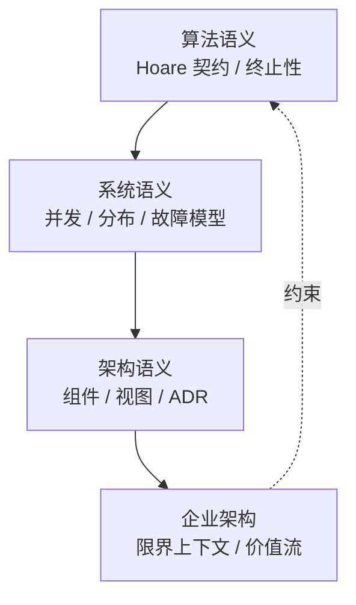

> **内容分级**: [综述级]

# 语义模型推理方法论

> **EN**: Semantic Model Reasoning Methodology
> **Summary**: Methodology unifying six thinking representations — definition, attribute matrix, example, counterexample, scenario, and theorem chain — for analyzing and teaching Rust semantic models.
> **Rust 版本**: 1.97.0+ (Edition 2024)
> **受众**: [研究者 / 进阶]
> **权威来源**: 本文件为 `concept/` 权威页。
> **层级**: L0-L7
> **A/S/P 标记**: **S** — Structure
> **双维定位**: C×Ana — 为语义模型页提供统一的思维表征与推理规范
> **前置概念**:
> [Semantic Space](semantic_space.md) ·
> [Knowledge Mindmap](knowledge_mindmap.md) ·
> [Semantic Layer Alignment Index](semantic_layer_alignment_index.md)
> **后置概念**:
> [Type Theory](../../04_formal/00_type_theory/01_type_theory.md) ·
> [Actor Model Semantics](../../04_formal/09_system_semantics/01_actor_model_semantics.md) ·
> [Expressiveness of Concurrent Models](../../04_formal/12_concurrency_models/02_expressiveness_of_concurrent_models.md)
> **主要来源**:
> [Bloom 1956, *Taxonomy of Educational Objectives*](https://en.wikipedia.org/wiki/Bloom%27s_taxonomy) ·
> [Wadler 1989, *Theorems for Free!*](https://doi.org/10.1007/3-540-50945-2_6) ·
> [Pierce 2002, *Types and Programming Languages*](https://www.cis.upenn.edu/~bcpierce/tapl/)

---

> **Bloom 层级**: L1-L7
**变更日志**:

- v1.0 (2026-07-30): 初始版本——建立语义模型六要素推理方法论

---

## 一、六要素推理框架

每个 Rust 语义模型权威页应尽可能包含以下六要素，形成从**直觉**到**形式化**再到**工程判断**的完整认知链：

```text
定义 (Definition)
  ↓ 结构化
属性矩阵 (Attribute Matrix)
  ↓ 具化
示例 (Example)
  ↓ 边界
反例 (Counterexample)
  ↓ 迁移
领域场景 (Domain Scenario)
  ↓ 形式化
定理链 / 决策树 (Theorem Chain / Decision Tree)
```

| 要素 | 功能 | 典型读者问题 | 表征形式 |
|---|---|---|---|
| **定义** | 锚定概念边界 | "这是什么？" | 一句话定义 + 权威来源引用 |
| **属性矩阵** | 多维度比较 | "它和同类概念有何异同？" | Markdown 表格 |
| **示例** | 展示正确用法 | "正确的代码长什么样？" | `rust` 代码块 |
| **反例** | 揭示常见误解 | "什么情况下会错？" | `compile_fail,E0xxx` 或文本反例 |
| **领域场景** | 映射到工程决策 | "我在实际项目中怎么用？" | 案例叙述 + 代码片段 |
| **定理链/决策树** | 支持可判定推理 | "如何一步步推导或排查？" | 表格 / Mermaid flowchart / YAML 决策树 |

---

## 二、正向推理：概念 → 代码

正向推理回答"我知道一个概念，如何写出正确代码"。

### 2.1 示例：从 `Send`/`Sync` 到线程边界判断

1. **定义**：`Send` 表示类型可以跨线程移动；`Sync` 表示类型可以跨线程共享引用。
2. **属性矩阵**：

   | 类型 | `Send` | `Sync` | 说明 |
   |---|:---:|:---:|:---|
   | `i32` | ✅ | ✅ | 纯值类型 |
   | `Rc<T>` | ❌ | ❌ | 非原子引用计数 |
   | `Arc<T>` | ✅ | ❌（默认） | 原子引用计数，但 `T` 须 `Send + Sync` 才 `Sync` |
   | `Mutex<T>` | ✅（若 `T: Send`） | ✅（若 `T: Send`） | 提供内部可变性 + 互斥 |

3. **示例**：`Arc<Mutex<i32>>` 可安全跨线程共享。
4. **反例**：`Rc<i32>` 跨线程编译失败（`E0277`）。
5. **领域场景**：计数器共享选 `Arc<Mutex<T>>`，只读共享选 `Arc<T>`。
6. **决策树**：`J-CONC-01` / `DF-CONC-06` 已覆盖 `E0277`。

---

## 三、反向推理：错误 → 根因

反向推理回答"我看到一个编译/运行错误，如何定位语义根因"。

### 3.1 示例：`E0502` 借用冲突

```rust,compile_fail,E0502
fn main() {
    let mut v = vec![1, 2, 3];
    let first = &v[0];
    v.push(4); // ERROR: cannot borrow `v` as mutable because it is also borrowed as immutable
    println!("{}", first);
}
```

**反向推理链**：

```text
E0502
  ├─ 是否同时存在可变借用与不可变借用？
  │    ├─ 是 → 检查 NLL：不可变借用是否在后序代码中仍被使用
  │    │         ├─ 是 → 重构：先完成读操作再写，或用作用域隔离
  │    │         └─ 否 → 调整代码顺序即可
  │    └─ 否 → 检查是否为不同变量（可能是同名遮蔽）
  └─ 是否跨 await/闭包持有引用？ → 考虑 Arc<Mutex<T>> 或 channel
```

---

## 四、跨层推理：算法 → 系统 → 架构 → 企业

语义模型不是孤立存在的；工程判断需要在多个抽象层之间迁移。



**推理规则**：

- 下层为上层提供**可实现性保证**（如 borrow checker 保证无数据竞争）。
- 上层为下层提供**需求约束**（如 bounded context 决定 crate 边界）。
- 跨层迁移时必须显式声明**观察集**（observable set），否则会出现"形式等价但工程不等价"的误判。

---

## 五、表征方法使用规范

### 5.1 Mindmap

- 用于展示概念层级与关联。
- 应控制在 3–4 层深度，避免信息过载。
- 每个叶子节点尽量是名词或短语，避免长句。

### 5.2 属性矩阵

- 行：被比较的概念/实现；列：比较维度。
- 维度应是**可判定**的（如是/否、数值、语义保证强弱）。
- 必须在表后给出"判定依据"，避免让读者自己猜测。

### 5.3 示例与反例

- **示例**应使用 `rust` 或 `rust,ignore`（若有外部依赖）。
- **反例**优先使用 `rust,compile_fail,E0xxx`，确保错误码确实被 rustc 触发。
- 若主题为非代码概念，可使用文本反例，但必须包含"误解 → 后果 → 正确边界"三段结构。

### 5.4 领域场景

- 每个场景应包含：背景、目标、可选方案、决策、结果/反事实。
- 优先使用 Rust 生态真实工具（tokio、crossbeam、axum 等）。

### 5.5 定理链

- L4+ 形式化页应包含定理链表格。
- 每条定理应标明：编号、命题、前提、结论、来源。
- 定理之间尽量形成 `⟹` 推理链。

### 5.6 决策树

- 决策树 YAML 文件位于 `concept/00_meta/knowledge_topology/`。
- 每个节点应映射到 rustc 错误码或具体工程判断。
- 叶子节点必须给出可执行建议（代码、命令、或进一步阅读的链接）。

---

## 六、反例设计模式

### 6.1 类型一："过度泛化"反例

**误解**："Rust 的 ownership 完全消除了数据竞争。"

**反例**：`unsafe` 块中仍可手动制造数据竞争。

```rust,compile_fail
// 实际为 unsafe，无法 compile_fail 直接演示，
// 但可通过 Miri 检测：两个裸指针同时写同一块内存
```

**正确边界**：Ownership 在 **safe Rust** 子集内消除数据竞争；`unsafe` 需要额外审计。

### 6.2 类型二："混淆层次"反例

**误解**："Actor 与 π 演算表达能力相同，可以互换。"

**反例**：Actor 的故障隔离与公平性在 π 演算编码中无法保持。

**正确边界**：编码只在限定观察集下保持等价；工程选型必须纳入故障模型与分布位置。

### 6.3 类型三："忽略前提"反例

**误解**："参数性保证 `fn id<T>(x: T) -> T` 一定返回 `x`。"

**反例**：若函数含 `panic`、`unsafe` 或全局状态，参数性定理 relax。

---

## 七、认知路径

1. **L1-L2**：通过定义 + 示例建立直觉。
2. **L3-L4**：通过属性矩阵 + 反例 + 定理链理解边界。
3. **L5-L6**：通过领域场景 + 决策树迁移到工程实践。
4. **L7**：通过跨层推理 + 国际来源审计跟踪前沿变化。

---

## International Authority References（国际权威来源）

- [Bloom 1956, *Taxonomy of Educational Objectives*](https://en.wikipedia.org/wiki/Bloom%27s_taxonomy) — 认知层级
- [Wadler 1989, *Theorems for Free!*](https://doi.org/10.1007/3-540-50945-2_6) — 参数性与类型推导行为
- [Pierce 2002, *Types and Programming Languages*](https://www.cis.upenn.edu/~bcpierce/tapl/) — 类型系统形式化
- [Rust Reference](https://doc.rust-lang.org/reference/) — Rust 语义权威来源
- [Rustonomicon](https://doc.rust-lang.org/nomicon/) — unsafe Rust 边界

---

## 🧭 思维导图（Mindmap）

```mermaid
mindmap
  root((语义模型推理方法论))
    六要素
      定义
      属性矩阵
      示例
      反例
      领域场景
      定理链/决策树
    推理方向
      正向：概念 → 代码
      反向：错误 → 根因
      跨层：算法 → 系统 → 架构 → 企业
    表征规范
      Mindmap 层级
      矩阵可判定
      反例三段式
      场景五要素
      定理链编号
    反例模式
      过度泛化
      混淆层次
      忽略前提
```

---

> **版本信息**: v1.0 · 2026-07-30 · 对齐 Rust 1.97.1+ (Edition 2024)
