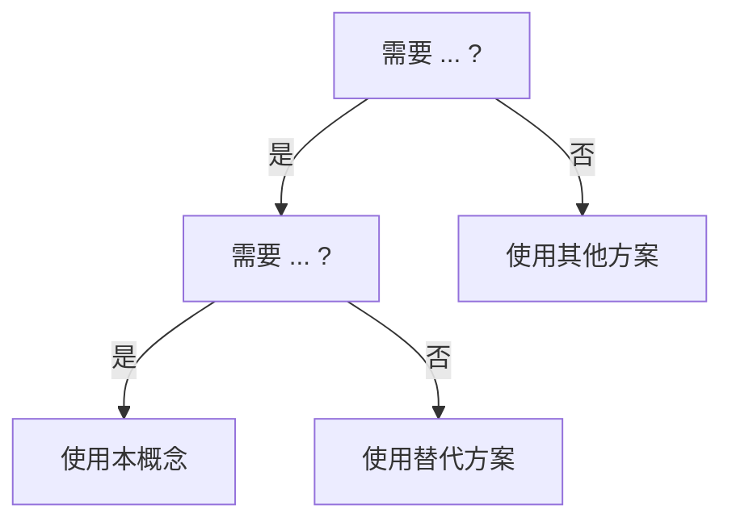

# Concept 文件双语模板 v2（Bilingual Template v2）

> **EN**: Bilingual Concept Template v2
> **Summary**: Standardized bilingual template for `concept/` files with anti-examples, backward reasoning, decision trees, and authority source alignment.
>
> **主要来源**: [The Rust Reference](https://doc.rust-lang.org/reference/introduction.html) · [The Rust Programming Language](https://doc.rust-lang.org/book/title-page.html) · [Rust By Example](https://doc.rust-lang.org/rust-by-example/index.html) · [Rustonomicon](https://doc.rust-lang.org/nomicon/index.html) · [RFCs](https://rust-lang.github.io/rfcs/index.html)
>
> **适用范围**: `concept/` 目录下所有 L1-L7 概念文件
> **版本**: 2.0
> **状态**: ✅ 活跃

> > **权威来源**: 本文件为 `concept/` 权威页。
---

## 一、文件头模板（必填）

每个 `concept/` 文件必须在正文前包含以下标准化头部：

```markdown
# {中文标题（English Title）}
>
> **EN**: {English Title}
> **Summary**: {50-100 words English summary}
>
> **受众**: [初学者 | 进阶 | 研究者]
> **层级（模板占位）**: {L0-L7} {基础/进阶/高级/形式化/对比/生态/未来}概念
> **Bloom 层级**: L1-L6
> **A/S/P 标记**: {A | S | P | A+S | S+P | ...}
> **双维定位**: {知识维度 × Bloom 层级}
> **前置概念**: `{Concept EN}` (`{relative_path}.md`) · ...
> **后置概念**: `{Concept EN}` (`{relative_path}.md`) · ...
>
> **主要来源**: [The Rust Reference — 章节](.) ·
> [The Rust Programming Language — 章节](.) ·
> [Rust By Example — 章节](.) ·
> [Rustonomicon — 章节](.) ·
> [RFC XXXX](.) ·
> [Unsafe Code Guidelines — 章节](.)
>
> **Rust 版本**: 1.97.0+ (Edition 2024)
---
```

### 字段说明

| 字段 | 必填 | 长度/格式 | 说明 |
|:---|:---:|:---|:---|
| `EN` | ✅ | 1-5 个英文词 | 概念的官方英文名称，与术语表严格一致 |
| `Summary` | ✅ | 50-100 词 | 英文摘要，用于搜索引擎和国际社区发现 |
| `受众` | ✅ | 单选 | 初学者 / 进阶 / 研究者 |
| `层级` | ✅ | `L0`-`L7` | 认知层级 |
| `Bloom 层级` | ✅ | 连续两级 | 如 `理解 → 应用` |
| `A/S/P 标记` | ✅ | 组合 | Application / Structure / Procedure |
| `双维定位` | ✅ | `C×Und` 等 | 知识维度 × Bloom 层级 |
| `前置概念` | ✅ | 链接列表 | 学习本概念前必须掌握的概念 |
| `后置概念` | ✅ | 链接列表 | 学习本概念后可直接延伸的概念 |
| `主要来源` | ✅ | ≥3 个权威来源 | Rust Reference / TRPL / RBE / Rustonomicon / RFCs / Unsafe Code Guidelines |
| `Rust 版本` | ✅ | 版本号 | 内容对齐的稳定 Rust 版本 |

---

## 二、正文结构模板

```markdown
## 一、权威定义（Definition）

> 用一句话概括本概念在 Rust 知识体系中的核心地位。
>
> [来源: [The Rust Reference — ...](.)]

### 1.1 形式化定义

> 精确、无歧义的定义。可包含类型规则、EBNF、或形式化片段。
>
> ```text
> Γ ⊢ e : T
> ```

### 1.2 直觉解释

> 用类比或图示帮助初学者建立直觉。

## 二、概念属性矩阵

| 属性 | 说明 | Rust 表达 | 权威来源 |
|:---|:---|:---|:---|
| ... | ... | ... | ... |

## 三、技术细节与示例

```rust
// 最小可运行示例
fn main() {}
```

> **关键洞察**: ...
> [来源: [Rust Reference — ...](.)]

## 四、示例与反例

### 4.1 正确示例

```rust
fn ok_example() {}
```

### 4.2 反例（Anti-patterns）

```rust,compile_fail
fn bad_example() {}
```

> **错误诊断**: `error[E0XXX]: ...`
> **修正**: ...
> **反推**: 若出现此编译错误 ⟸ 应检查 ...

## 五、反命题与边界分析

### 5.1 反命题树

> **反命题 1**: "..." ⟹ 不成立。...
> **反命题 2**: "..." ⟹ 不成立。...
> **反命题 3**: "..." ⟹ 不成立。...

### 5.2 边界极限

| 边界 | 现状 | 理论极限 | 工程意义 |
|:---|:---|:---|:---|
| ... | ... | ... | ... |

## 六、边界测试

### 6.1 边界测试：...（编译错误）

```rust,compile_fail
```

### 6.2 边界测试：...（运行时行为）

```rust
// 注意：此代码用于展示 UB 或边界行为，不要直接运行
```

## 七、判断推理与决策树

### 7.1 何时使用本概念？



### 7.2 与其他概念的辨析

| 场景 | 推荐选择 | 不推荐 | 理由 |
|:---|:---|:---|:---|
| ... | ... | ... | ... |

## 八、逆向推理链（Backward Reasoning）

> **从编译错误/运行时症状反推定理链**:
>
> ```text
> 顶层症状 ⟸ 中间机制 ⟸ 底层概念 ⟸ 根本原因
> ```
>
> **诊断映射**:
>
> - `error[E0XXX]` → ... 违反 → 检查 ...
> - `error[E0YYY]` → ... 违反 → 检查 ...
> - 运行时 panic/UB → ... 违反 → 检查 ...

## 九、形式化片段（可选，L1-L3 可轻量，L4 可深入）

> **typing rule / operational semantics**:
>
> ```text
> ...
> ```
>
> [来源: [RustBelt](.) | [Tree Borrows](.) | [Stacked Borrows](.)]

## 十、跨语言对比（L5 必填，L1-L3 可选）

| 维度 | Rust | C++ | Go | Java |
|:---|:---|:---|:---|:---|
| ... | ... | ... | ... | ... |

## 十一、来源与延伸阅读

- [The Rust Reference — ...](.)
- [The Rust Programming Language — ...](.)
- [Rust By Example — ...](.)
- [Rustonomicon — ...](.)
- [RFC XXXX — ...](.)
- [Unsafe Code Guidelines — ...](.)

## 十二、嵌入式测验（Embedded Quiz）

### 测验 1：...（理解层）

**题目**: ...

<details>
<summary>✅ 答案与解析</summary>

答案内容。
</details>

## 十三、认知路径

> **认知路径**: 本节从 "..." 的核心问题出发，依次建立直观理解、形式化模型与工程实践之间的联系。
>
> 1. **问题识别**: ...
> 2. **概念建立**: ...
> 3. **机制推理**: ...
> 4. **边界辨析**: ...
> 5. **迁移应用**: ...

---

> **权威来源**: [The Rust Reference](https://doc.rust-lang.org/reference/introduction.html), [The Rust Programming Language](https://doc.rust-lang.org/book/title-page.html), [Rust By Example](https://doc.rust-lang.org/rust-by-example/index.html), [Rustonomicon](https://doc.rust-lang.org/nomicon/index.html)
> **权威来源对齐变更日志**: YYYY-MM-DD 创建 [...](https://doc.rust-lang.org/)
> **状态**: ✅ 权威来源对齐完成

---

## 三、术语标注规范

正文中首次出现核心术语时使用双语标注：

```markdown
所有权（Ownership）是 Rust 的核心机制。
借用（Borrowing）与生命周期（Lifetimes）共同保证内存安全。
```

对于已收录在术语表中的术语，优先使用 `concept/00_meta/terminology_glossary.md` 和 `data/i18n_terminology.yaml` 中的英文对照。

---

## 四、反例 / 边界 / 反推 / 决策树规范

### 4.1 反例代码块标记

| 标记 | 用途 |
|:---|:---|
| `rust` | 可编译、可运行的正确示例 |
| `rust,compile_fail` | 展示应失败的代码 |
| `rust,ignore` | 展示不可运行或需外部依赖的代码 |
| `rust,no_run` | 可编译但不应运行的代码 |

### 4.2 反推链格式

```markdown
> **反向推理**: 如果 ... 出现 ... ⟸ 应首先检查 ...。
> **定理链反推**: `顶层症状 ⟸ 中间机制 ⟸ 底层概念 ⟸ 根本原因`
```

### 4.3 决策树格式

统一使用 Mermaid `graph TD`，每个节点以问题或结论命名，边标注判断条件。

### 4.4 权威来源行内标注

每个关键论断后应紧跟来源标注：

```markdown
> [来源: [The Rust Reference — Type Coercions](https://doc.rust-lang.org/reference/type-coercions.html)]
```

原创分析使用：

```markdown
> [💡 原创分析](../00_framework/methodology.md)
```

---

## 五、国际化质量检查清单

提交前请确认：

- [ ] 文件头包含 `EN` 和 `Summary`
- [ ] `EN` 名称与 `concept/00_meta/terminology_glossary.md` 一致
- [ ] `Summary` 为 50-100 词英文
- [ ] 前置/后置概念使用相对路径链接
- [ ] 正文中核心术语首次出现时附带英文
- [ ] 包含 ≥3 个权威来源
- [ ] 包含至少 2 个反例（`rust,compile_fail`）
- [ ] 包含逆向推理链
- [ ] 包含决策树或辨析表
- [ ] 代码示例可编译（如适用）
- [ ] 运行 `python scripts/add_bilingual_annotations.py --check-only` 通过
- [ ] 运行 `python scripts/kb_auditor.py` 无新增死链

---

## 六、脚本集成

```bash
# 双语标注检查
python scripts/add_bilingual_annotations.py --check-only

# KB 质量审计
python scripts/kb_auditor.py

# SUMMARY 一致性校验
python scripts/validate_summary.py

# 内容去重检测
python scripts/detect_content_overlap.py
```

---

**维护者**: Rust 学习项目团队
**最后更新**: 2026-07-04
**状态**: ✅ 活跃模板
