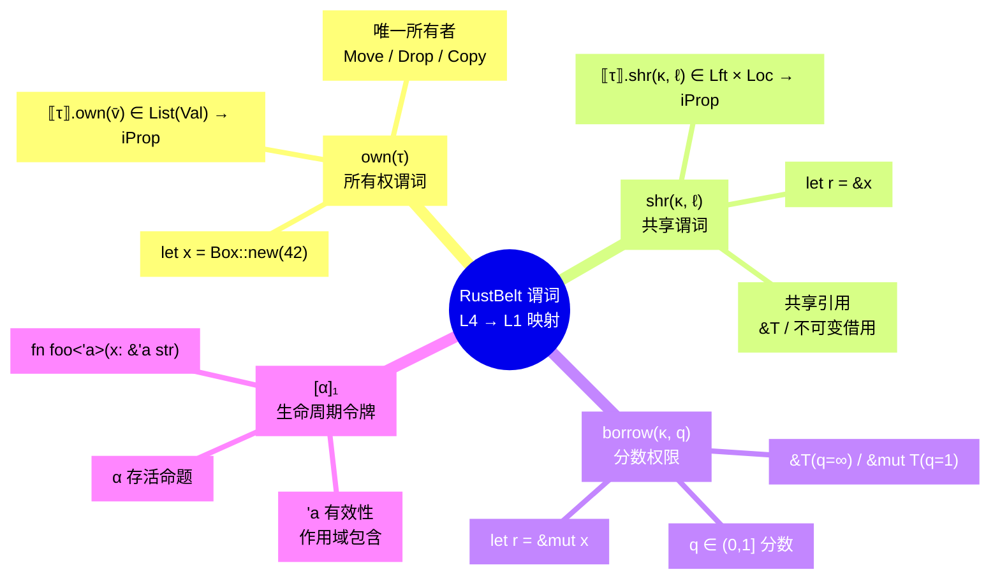
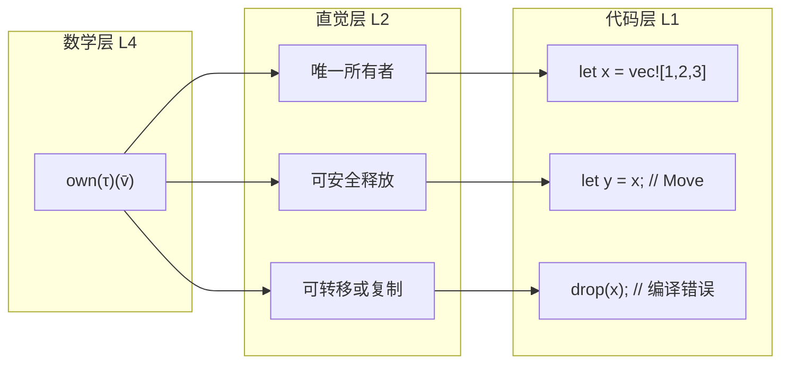
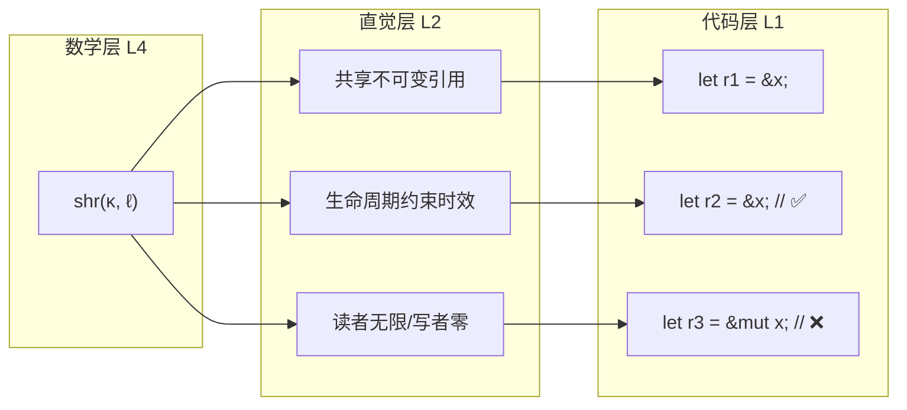
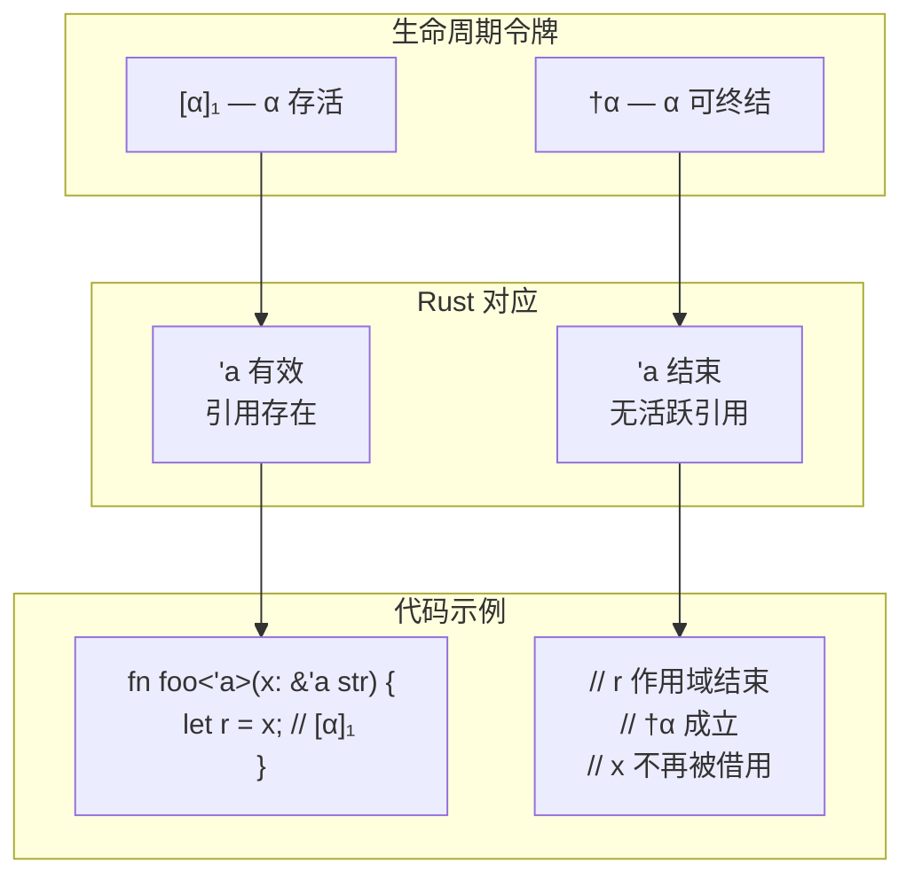
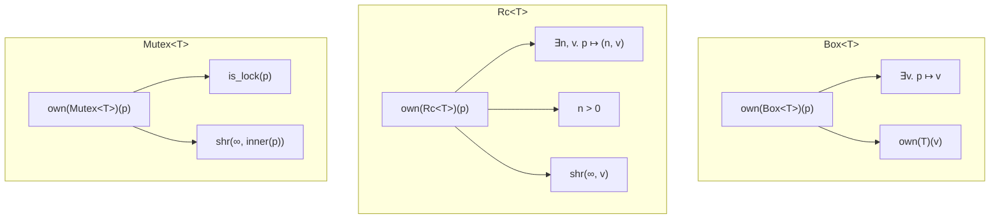
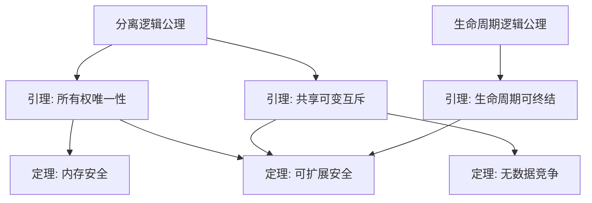

# RustBelt 谓词映射图（RustBelt Predicate Map）
>
> **EN**: RustBelt
> **Summary**: RustBelt — A visual map from RustBelt's own and shr predicates to L1-L3 engineering concepts, bridging symbols and code intuition.
>
> **Rust 版本**: 1.97.0+ (Edition 2024)
> **受众**: [研究者]
> **Bloom 层级**: L4-L5
> **权威来源**: 本文件为 `concept/` 权威页。
> **定位**: 本文件将 RustBelt（Jung et al., POPL 2018）中的核心形式化谓词——**所有权谓词 `own(τ)`** 和 **共享谓词 `shr(κ, ℓ)`**——可视化映射到 Rust 的 L1-L3 工程概念，建立"数学符号 ↔ 代码直觉"的双向桥梁。
> **对齐来源**: [RustBelt](https://plv.mpi-sws.org/rustbelt/) · [Iris 分离逻辑教程] · [O'Hearn — Separation Logic] · [Rust Reference — Memory Model](https://doc.rust-lang.org/reference/introduction.html)
> **定理链**: N/A — 描述性/综述性/导航性文档，不涉及形式化定理链
>
> **来源**: [TRPL](https://doc.rust-lang.org/book/title-page.html) · [Rust Reference](https://doc.rust-lang.org/reference/introduction.html)
---
> **来源**: [Jung, R. et al. — *RustBelt: Securing the Foundations of the Rust Programming Language*. POPL 2018]
>
> **来源**: [Iris 教程 — https://iris-project.org/]
> **来源**: [O'Hearn, P.W. — *Separation Logic*. Communications of the ACM, 2019]
> **来源**: [Rust Reference — Memory Model](https://doc.rust-lang.org/reference/introduction.html)

## 📑 目录

- [RustBelt 谓词映射图（RustBelt Predicate Map）](#rustbelt-谓词映射图rustbelt-predicate-map)
  - [📑 目录](#-目录)
  - [〇、谓词映射认知全景](#〇谓词映射认知全景)
  - [一、RustBelt 核心谓词定义](#一rustbelt-核心谓词定义)
  - [二、所有权谓词 own(τ) 映射](#二所有权谓词-ownτ-映射)
    - [2.1 数学定义](#21-数学定义)
    - [2.2 到 Rust 的映射](#22-到-rust-的映射)
    - [2.3 谓词状态转换](#23-谓词状态转换)
  - [三、共享谓词 shr(κ, ℓ) 映射](#三共享谓词-shrκ-ℓ-映射)
    - [3.1 数学定义](#31-数学定义)
    - [3.2 到 Rust 的映射](#32-到-rust-的映射)
    - [3.3 谓词状态转换](#33-谓词状态转换)
  - [四、生命周期令牌 \[α\]₁ 映射](#四生命周期令牌-α-映射)
    - [4.1 数学定义](#41-数学定义)
    - [4.2 到 Rust 的映射](#42-到-rust-的映射)
    - [4.3 生命周期与借用的组合](#43-生命周期与借用的组合)
  - [五、谓词组合与 Rust 代码对应](#五谓词组合与-rust-代码对应)
    - [5.1 标准库组件的谓词规范](#51-标准库组件的谓词规范)
    - [5.2 谓词组合可视化](#52-谓词组合可视化)
  - [六、从谓词到定理的推导链](#六从谓词到定理的推导链)
  - [七、与概念判定森林的对照](#七与概念判定森林的对照)
  - [八、来源与可信度](#八来源与可信度)
  - [认知路径](#认知路径)
    - [核心推理链](#核心推理链)
    - [反命题与边界](#反命题与边界)
  - [嵌入式测验（Embedded Quiz）](#嵌入式测验embedded-quiz)
    - [测验 1：本文档《RustBelt 谓词映射图（RustBelt Predicate Map）》在 Rust 知识体系中属于哪一层级的元数据？（理解层）](#测验-1本文档rustbelt-谓词映射图rustbelt-predicate-map在-rust-知识体系中属于哪一层级的元数据理解层)
    - [测验 2：《RustBelt 谓词映射图（RustBelt Predicate Map）》的主要用途是什么？（理解层）](#测验-2rustbelt-谓词映射图rustbelt-predicate-map的主要用途是什么理解层)
    - [测验 3：元数据层文档能否替代 L1-L7 的核心概念学习？（理解层）](#测验-3元数据层文档能否替代-l1-l7-的核心概念学习理解层)

---

## 〇、谓词映射认知全景



> **认知功能**: 本 mindmap 将抽象的 Iris 分离逻辑谓词压缩为**四层结构**：数学定义（L4）→ 形式化含义 → Rust 映射（L1-L3）→ 代码示例。这种"自上而下"的映射帮助学习者在"看到 `own(τ)` 符号"时，能立即联想到"Rust 中的所有权唯一性"。[💡 原创分析](../00_framework/methodology.md)

---

## 一、RustBelt 核心谓词定义

RustBelt 在 Iris 高阶并发分离逻辑中定义了三个核心谓词族，用于解释 Rust 类型系统的语义：

| 谓词 | 类型签名 | 直觉含义 |
|:---|:---|:---|
| **`τ.own(v̄)`** | `List(Val) → iProp` | 值 `v̄` 拥有类型 `τ` 的**独占所有权** |
| **`τ.shr(κ, ℓ)`** | `Lft × Loc → iProp` | 在生命周期 `κ` 内，位置 `ℓ` 持有类型 `τ` 的**共享引用** |
| **`[κ]₁`** | `iProp` | 生命周期 `κ` **仍然存活**（未被终结） |
| **`†κ`** | `iProp` | 生命周期 `κ` **可以被终结**（无活跃引用） |

> **关键洞察**: `own` 和 `shr` 不是 Rust 编译器的内部机制，而是**数学模型**——它们解释了为什么 Rust 的代码是安全的。编译器通过语法检查确保程序满足这些谓词的约束，而 RustBelt 证明了：满足约束的程序在数学上不可能触发 UB。[💡 原创分析](../00_framework/methodology.md)

---

## 二、所有权谓词 own(τ) 映射

「所有权谓词 own(τ) 映射」涉及数学定义、到 Rust 的映射与谓词状态转换，本节逐一说明其要点。

### 2.1 数学定义

```text
own(τ)(v̄) ≜ 值 v̄ 唯一归属于当前线程，
            且 v̄ 满足类型 τ 的所有不变式
```

### 2.2 到 Rust 的映射



### 2.3 谓词状态转换

| 操作 | 谓词变换 | Rust 代码 | 含义 |
|:---|:---|:---|:---|
| **创建** | `⊤ ⟹ own(τ)(v̄)` | `let x = Box::new(42);` | 获得新值的所有权 |
| **Move** | `own(τ)(v̄) ∗ own(τ)(v̄)` 不成立 | `let y = x;` | 所有权转移，原变量失效 |
| **Copy** | `own(τ)(v̄) ⟹ own(τ)(v̄) ∗ own(τ)(v̄)`（若 τ: Copy） | `let y = x;`（x: i32） | 所有权复制，两者皆有效 |
| **Drop** | `own(τ)(v̄) ⟹ ⊤` | 作用域结束 | 释放资源，谓词消失 |
| **共享** | `own(τ)(v̄) ⟹ own(τ)(v̄) ∗ shr(κ, ℓ)` | `let r = &x;` | 保留所有权，创建共享引用 |

---

## 三、共享谓词 shr(κ, ℓ) 映射

「共享谓词 shr(κ, ℓ) 映射」涉及数学定义、到 Rust 的映射与谓词状态转换，本节逐一说明其要点。

### 3.1 数学定义

```text
shr(κ, ℓ) ≜ 在生命周期 κ 存活期间，
            位置 ℓ 的内容可被无限多个读者共享访问，
            但不可被修改
```

### 3.2 到 Rust 的映射



### 3.3 谓词状态转换

| 操作 | 谓词变换 | Rust 代码 | 含义 |
| :--- | :--- | :--- | :--- |
| **创建共享** | `own(τ)(v̄) ⟹ own(τ)(v̄) ∗ shr(κ, ℓ)` | `let r = &x;` | 从所有权创建共享引用 |
| **复制共享** | `shr(κ, ℓ) ⟹ shr(κ, ℓ) ∗ shr(κ, ℓ)` | `let r2 = r1;` | 共享引用可复制（Reborrow） |
| **终结共享** | `shr(κ, ℓ) ∗ †κ ⟹ ⊤` | `r` 作用域结束 | 生命周期结束，共享谓词消失 |
| **升级为可变** | `shr(κ, ℓ) ∗ [κ]₁` 不蕴含可变 | 编译器拒绝 | 共享不可直接升级 |

---

## 四、生命周期令牌 [α]₁ 映射

本节将「生命周期令牌 [α]₁ 映射」分解为若干主题：数学定义、到 Rust 的映射与生命周期与借用的组合。

### 4.1 数学定义

```text
[α]₁ ≜ 生命周期 α 仍然存活（存在至少一个活跃的引用或借用）
†α  ≜ 生命周期 α 可以被终结（无活跃引用）
[α]₁ ⟹ †α  ≜ 当 α 的所有引用都结束时，α 可被终结
```

### 4.2 到 Rust 的映射



### 4.3 生命周期与借用的组合

```text
借用的完整谓词表示:
  let r: &'a T = &x;

  变换前: own(T)(x)
  变换后: own(T)(x) ∗ shr('a, addr(x)) ∗ ['a]₁

  当 'a 结束时:
    shr('a, addr(x)) ∗ ['a]₁ ∗ †'a  ⟹  own(T)(x)
    （共享谓词消失，所有权归还）
```

---

## 五、谓词组合与 Rust 代码对应

本节从标准库组件的谓词规范 与 谓词组合可视化 两个层面剖析「谓词组合与 Rust 代码对应」。

### 5.1 标准库组件的谓词规范

| 标准库类型 | 谓词规范 | Rust 代码 |
|:---|:---|:---|
| **`Box<T>`** | `own(Box<T>)(p) ≜ ∃v. p ↦ v ∗ own(T)(v)` | `let b = Box::new(42);` |
| **`Rc<T>`** | `own(Rc<T>)(p) ≜ ∃n, v. p ↦ (n, v) ∗ n > 0 ∗ shr(∞, v)` | `let r = Rc::new(42);` |
| **`RefCell<T>`** | `own(RefCell<T>)(p) ≜ ∃v. p ↦ v ∗ own(T)(v)` | `let c = RefCell::new(42);` |
| **`Mutex<T>`** | `own(Mutex<T>)(p) ≜ is_lock(p) ∗ shr(∞, inner(p))` | `let m = Mutex::new(42);` |
| **`Cell<T>`** | `own(Cell<T>)(p) ≜ ∃v. p ↦ v`（T: Copy） | `let c = Cell::new(42);` |

### 5.2 谓词组合可视化



> **认知功能**: 标准库的谓词规范揭示了**为什么这些类型是安全的**：`Box` 保证唯一所有权，`Rc` 允许多个所有者但共享只读访问（`shr(∞, v)`），`Mutex` 在共享引用下提供互斥。这些规范是 RustBelt 验证标准库安全性的数学基础。[💡 原创分析](../00_framework/methodology.md)

---

## 六、从谓词到定理的推导链

```text
公理层:
  A1: 分离逻辑的资源分解规则
  A2: 生命周期逻辑的区域包含偏序

引理层:
  L1: own(τ)(v̄) ∗ own(τ)(v̄) ⟹ ⊥  （所有权唯一性）
  L2: shr(κ, ℓ) ∗ &mut(κ', ℓ) ⟹ ⊥  （共享与可变互斥）
  L3: [α]₁ ∗ †α ⟹ ⊤  （生命周期可终结）

定理层:
  T1 (内存安全): well-typed Safe Rust ⟹ 无 UAF
  T2 (无数据竞争): well-typed Safe Rust ⟹ 无数据竞争
  T3 (可扩展安全): unsafe 库满足谓词规范 ⟹ 整体程序安全
```



---

## 七、与概念判定森林的对照

| 维度 | 概念判定森林 | RustBelt 谓词映射（本文件） |
|:---|:---|:---|
| **抽象层级** | L1-L3（工程概念） | L4（形式化理论） |
| **起点** | "给定代码，如何判定是否合法？" | "给定类型，其语义解释是什么？" |
| **工具** | 判定树（前提→规则→判定） | 谓词逻辑（命题→推理→定理） |
| **输出** | 合法 / 失效 / 边界条件 | own/shr 谓词状态 / 资源分解 |
| **关系** | **互补**: 判定森林从工程角度"判安全"，谓词映射从数学角度"证安全" | **互补**: 谓词映射提供判定森林中规则的数学根基 |

> **双向桥梁**: `concept_definition_decision_forest.md` 中的"借用判定树"判定 C2（AXM 违反）对应于本文件的 `shr(κ, ℓ) ∗ &mut(κ', ℓ) ⟹ ⊥` 引理。前者是工程判定流程，后者是数学证明基础。[💡 原创分析](../00_framework/methodology.md)

---

## 八、来源与可信度

| 层级 | 来源 | 在本文件中的作用 |
|:---|:---|:---|
| **一级** | Jung et al. (POPL 2018) — *RustBelt* | own/shr 谓词的原始定义和语义解释 |
| **一级** | Iris Project — iris-project.org | 高阶并发分离逻辑的教程和形式化基础 |
| **一级** | Rust Reference — Memory Model | Rust 内存模型的官方定义 |
| **二级** | O'Hearn, P.W. (2019) — *Separation Logic* | 分离逻辑的直观解释和工程应用 |
| **二级** | Tofte & Talpin (1994) — *Region-Based Memory Management* | 生命周期 = 区域类型的形式化基础 |
| **三级** | RustBelt GhostCell 论文 | 标准库组件（Cell/RefCell/Mutex）的谓词规范 |

---

**变更日志**:

- v1.0 (2026-05-23): 初始版本 — own/shr/生命周期令牌三大谓词定义 + L4→L1 映射可视化 + 标准库谓词规范 + 定理推导链 + 与判定森林对照 [权威来源对齐 Wave 6](05_international_authority_index.md)

---

> **相关文件**: [RustBelt](../../04_formal/02_separation_logic/01_rustbelt.md) · [所有权形式化](../../04_formal/01_ownership_logic/02_ownership_formal.md) · [定理推理森林](../00_framework/theorem_inference_forest.md) · [概念判定森林](../00_framework/concept_definition_decision_forest.md)

## 认知路径

> **认知路径**: 本文件作为 Rust 分层知识体系的 **RustBelt 谓词映射图（RustBelt Predicate Map）** 元层导航节点，连接概念定义、学习路径与质量评估框架。

### 核心推理链

| 定理 | 前提 | 结论 | 置信度 |
|:---|:---|:---|:---|
| Rustbelt Predicate Map 结构化定义 ⟹ 学习者认知锚点可建立 | 本文件定义了元层结构 | 支持上层概念定位 | 高 |

> **过渡**: 利用本文件的导航结构，读者可以从当前位置快速跃迁到任意概念层级，实现非线性学习。
> **过渡**: RustBelt 谓词映射图（RustBelt Predicate Map） 的维护需要与概念内容同步更新，确保元数据与实际知识体系的一致性。
> **过渡**: 将 RustBelt 谓词映射图（RustBelt Predicate Map） 作为学习起点或复习锚点，有助于建立全局视野，避免陷入局部细节而忽视整体架构。

### 反命题与边界

> **反命题**: "元层文档可以替代具体概念学习" —— 错误。RustBelt 谓词映射图（RustBelt Predicate Map） 提供的是导航与评估框架，不能替代对核心概念（L1-L5）的深入理解与实践。
> **内容分级**: [综述级]

## 嵌入式测验（Embedded Quiz）

理解「嵌入式测验（Embedded Quiz）」需要把握测验 1：本文档《RustBelt 谓词映射图（RustBelt Pr…、测验 2：《RustBelt 谓词映射图（RustBelt Predi…与测验 3：元数据层文档能否替代 L1-L7 的核心概念学习？（理解层），本节依次展开。

### 测验 1：本文档《RustBelt 谓词映射图（RustBelt Predicate Map）》在 Rust 知识体系中属于哪一层级的元数据？（理解层）

**题目**: 本文档《RustBelt 谓词映射图（RustBelt Predicate Map）》在 Rust 知识体系中属于哪一层级的元数据？

<details>
<summary>✅ 答案与解析</summary>

属于 00_meta 元数据层，为整个知识体系提供导航、评估、审计和结构化的支持框架，辅助学习者定位和理解核心概念。
</details>

---

### 测验 2：《RustBelt 谓词映射图（RustBelt Predicate Map）》的主要用途是什么？（理解层）

**题目**: 《RustBelt 谓词映射图（RustBelt Predicate Map）》的主要用途是什么？

<details>
<summary>✅ 答案与解析</summary>

作为知识体系的支撑文档，提供学习路径导航、概念关系映射、质量评估标准或审计检查清单，帮助学习者和维护者高效使用知识库。
</details>

---

### 测验 3：元数据层文档能否替代 L1-L7 的核心概念学习？（理解层）

**题目**: 元数据层文档能否替代 L1-L7 的核心概念学习？

<details>
<summary>✅ 答案与解析</summary>

不能。元数据层提供导航和评估框架，但不能替代对核心概念（所有权、类型系统、并发等）的深入理解与实践。
</details>
