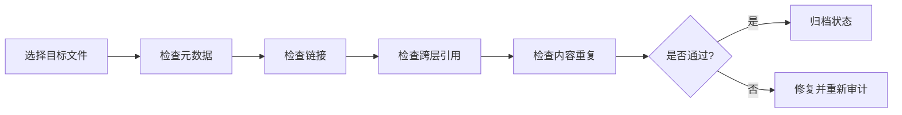

# Concept Audit Guide（概念审计指南）

>
> **EN**: Concept Audit Guide
> **Summary**: Concept Audit Guide. Core Rust concept.
> **Rust 版本**: 1.97.0+ (Edition 2024)
> **受众**: [专家]
> **Bloom 层级**: 应用 → 评价
> **A/S/P 标记**: **P** — Procedure
> **双维定位**: P×Eva — 评价概念文件质量
> **定理链**: N/A — 描述性/综述性/导航性文档，不涉及形式化定理链
>
> **来源**:
> [TRPL](https://doc.rust-lang.org/book/title-page.html) ·
> [Rust Reference](https://doc.rust-lang.org/reference/introduction.html)
>

## 相关概念文件

- [概念索引](../../README.md) — 知识体系总览
- [Bloom 分类法](../00_framework/03_bloom_taxonomy.md) — 认知层级标准
- [交叉引用矩阵](../04_navigation/05_cross_reference_matrix.md) — 概念关联映射
- [学习指南](../04_navigation/learning_guide.md) — 分层学习路径
- [语义空间坐标系](../00_framework/semantic_space.md) — 概念三维定位

## 审计流程

## 审计维度

| 维度 | 检查项 | 工具/方法 |
|:---|:---|:---|
| 元数据 | EN、Summary、受众、内容分级、Bloom、A/S/P | 人工 + `kb_auditor.py` |
| 链接 | 内部相对链接有效、外部链接可访问 | `kb_auditor.py --link-check` |
| 跨层引用 | Ln 文件引用 L(n-1) | `kb_auditor.py` |
| 内容重复 | 与 knowledge/docs 重复 | `detect_content_overlap.py` |
| 权威性 | 非 concept 文件是否过度展开 | 人工对照 `AGENTS.md` |
| 表征完整性 | 是否含示例/表格/决策树 | `kb_auditor.py` 统计代码块/Mermaid |

## 认知路径

> **认知路径**: 本文件作为 Rust 分层知识体系的 **Concept Audit Guide（概念审计指南）** 元层导航节点，连接概念定义、学习路径与质量评估框架。

### 核心推理链

| 定理 | 前提 | 结论 | 置信度 |
|:---|:---|:---|:---|
| 08 Concept Audit Guide 结构化定义 ⟹ 学习者认知锚点可建立 | 本文件定义了元层结构 | 支持上层概念定位 | 高 |

> **过渡**: 利用本文件的导航结构，读者可以从当前位置快速跃迁到任意概念层级，实现非线性学习。
> **过渡**: Concept Audit Guide（概念审计指南） 的维护需要与概念内容同步更新，确保元数据与实际知识体系的一致性。
> **过渡**: 将 Concept Audit Guide（概念审计指南） 作为学习起点或复习锚点，有助于建立全局视野，避免陷入局部细节而忽视整体架构。

### 反命题与边界

> **反命题**: "元层文档可以替代具体概念学习" —— 错误。Concept Audit Guide（概念审计指南） 提供的是导航与评估框架，不能替代对核心概念（L1-L5）的深入理解与实践。
> **内容分级**: [综述级]

## 嵌入式测验（Embedded Quiz）

### 测验 1：本文档《Concept Audit Guide（概念审计指南）》在 Rust 知识体系中属于哪一层级的元数据？（理解层）

**题目**: 本文档《Concept Audit Guide（概念审计指南）》在 Rust 知识体系中属于哪一层级的元数据？

✅ 答案与解析

属于 00_meta 元数据层，为整个知识体系提供导航、评估、审计和结构化的支持框架，辅助学习者定位和理解核心概念。

---

### 测验 2：《Concept Audit Guide（概念审计指南）》的主要用途是什么？（理解层）

**题目**: 《Concept Audit Guide（概念审计指南）》的主要用途是什么？

✅ 答案与解析

作为知识体系的支撑文档，提供学习路径导航、概念关系映射、质量评估标准或审计检查清单，帮助学习者和维护者高效使用知识库。

---

### 测验 3：元数据层文档能否替代 L1-L7 的核心概念学习？（理解层）

**题目**: 元数据层文档能否替代 L1-L7 的核心概念学习？

✅ 答案与解析

不能。元数据层提供导航和评估框架，但不能替代对核心概念（所有权、类型系统、并发等）的深入理解与实践。

