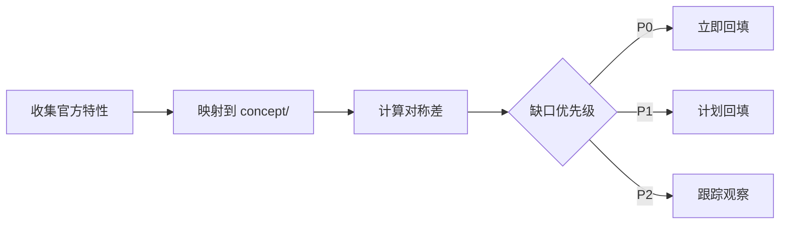

# Rust 语言特性盘点方法论

> **EN**: Rust Language Feature Inventory Methodology
> **Summary**: 用于周期性盘点 Rust 语言特性覆盖度、识别 concept/ 缺口并制定回填计划的对称差分析方法。

> **Rust 版本**: 1.97.0+ (Edition 2024)
> **Bloom 层级**: L3-L5
> **权威来源**: 本文件为 `concept/` 权威页。
> **A/S/P 标记**: **P** — Procedure
> **来源**: [releases.rs](https://releases.rs/) · [Rust Project Goals](https://rust-lang.github.io/rust-project-goals/) · [RFC Book](https://rust-lang.github.io/rfcs/)

---

## 一、方法概述

语言特性盘点采用**集合论对称差分析**：

- 集合 A：官方发布/RFC/Project Goals 中已出现或即将出现的 Rust 语言特性
- 集合 B：`concept/` 知识体系当前已覆盖的概念与特性
- A \\ B = concept/ 缺口（需回填）
- B \\ A = 冗余或过时内容（需归档/更新）

## 二、盘点流程

## 三、优先级定义

| 优先级 | 含义 | 处理策略 |
|:---|:---|:---|
| P0 | 已稳定且改变基础心智模型 | 必须在 concept/ 有权威页 |
| P1 | 系统/网络/工具链重要特性 | 补齐或链接到专题页 |
| P2 | 前沿/nightly/嵌入式特性 | 在 version tracking 页跟踪 |

## 四、相关概念

- [Rust 版本追踪](../../07_future/00_version_tracking/01_rust_version_tracking.md)
- [概念审计指南](01_concept_audit_guide.md)
- [方法论：思维表征与知识结构规范](../00_framework/methodology.md)
