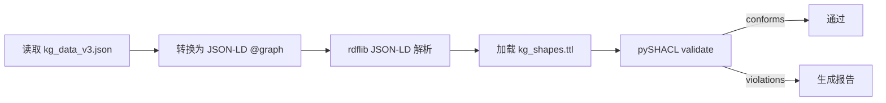

# KG SHACL 引擎验证

> **EN**: KG SHACL Engine Validation
> **Summary**: Describes how the knowledge graph is validated against W3C SHACL shapes using pySHACL, and how to interpret violation reports.
> **Rust 版本**: 1.97.0+ (Edition 2024)
> **Bloom 层级**: L0
> **权威来源**: 本文件为 `concept/` 权威页。
> **受众**: [维护者]
> **A/S/P 标记**: **P** — Procedure
> **内容分级**: [综述级]

---

## 一、验证目标

`concept/00_meta/kg_data_v3.json` 是 Rust 分层概念知识图谱的 JSON-LD 数据文件。
`concept/00_meta/kg_shapes.ttl` 定义了 W3C SHACL 形状，用于约束图中节点与关系的合法性。

本页说明如何使用真实 SHACL 引擎（pySHACL）对 KG 执行机器验证，并解读验证报告。

## 二、运行方式

在项目根目录下，使用 `tools/kg_shacl/.venv` 虚拟环境运行：

```bash
python tools/kg_shacl/validate_kg_shacl.py
```

可选参数：

| 参数 | 说明 |
|:---|:---|
| `--kg PATH` | 指定 KG JSON 文件路径 |
| `--shapes PATH` | 指定 SHACL shapes TTL 文件路径 |
| `--date YYYY-MM-DD` | 报告日期戳 |

## 三、验证流程



引擎调用：

```python
pyshacl.validate(
    data_graph,
    shacl_graph=shapes_graph,
    inference="rdfs",
    abort_on_first=False,
)
```

- `inference="rdfs"`：启用 RDFS 推理，使类层级与属性定义生效。
- `abort_on_first=False`：收集全部 violation，而非遇到第一条就停止。

## 四、输出报告

脚本生成两份报告：

- `reports/KG_SHACL_ENGINE_VALIDATION_<date>.md`：人可读报告
- `reports/KG_SHACL_ENGINE_VALIDATION_<date>.json`：机器可读报告

### 报告字段

| 字段 | 含义 |
|:---|:---|
| `conforms` | 是否通过 SHACL 验证 |
| `violations_total` | violation 总数 |
| `violations` | 每条 violation 的 severity、focus node、result path、message |
| `triples` | 加载后的 RDF 三元组数量 |
| `entities` | KG 实体数量 |
| `relations` | KG 关系数量 |

### Violation 解读

每条 violation 包含：

- **Severity**：通常为 `sh:Violation`；SHACL 亦支持 `sh:Warning` 与 `sh:Info`。
- **Focus Node**：违反约束的节点 IRI。
- **Result Path**：违反约束的属性路径。
- **Result Message**：引擎生成的可读说明。
- **Source Constraint Component**：触发失败的 SHACL 组件（如 `MinCountConstraintComponent`）。

## 五、退出码

| 退出码 | 含义 |
|:---:|:---|
| 0 | 通过，无 violation |
| 1 | 存在 violation |
| 2 | 输入文件缺失或不可读 |

## 六、相关文件

- [KG 数据 `kg_data_v3.json`](../../kg_data_v3.json)
- [SHACL 形状 `kg_shapes.ttl`](../../kg_shapes.ttl)
- [验证脚本 `tools/kg_shacl/validate_kg_shacl.py`](../../../../tools/kg_shacl/validate_kg_shacl.py)
- [KG SHACL 子集校验（语义质量门 P3-4）](../../../../scripts/check_kg_shapes.py)

## 七、权威来源

> **P0 官方**: [TRPL](https://doc.rust-lang.org/book/title-page.html) · [Rust Reference](https://doc.rust-lang.org/reference/introduction.html)
> **P1 标准/形式化**: [W3C SHACL Specification](https://www.w3.org/TR/shacl/) · [SHACL Advanced Features](https://www.w3.org/TR/shacl-af/)
> **P2 生态/工具**: [pySHACL 文档](https://github.com/RDFLib/pySHACL) · [RDFLib](https://github.com/RDFLib/rdflib)
