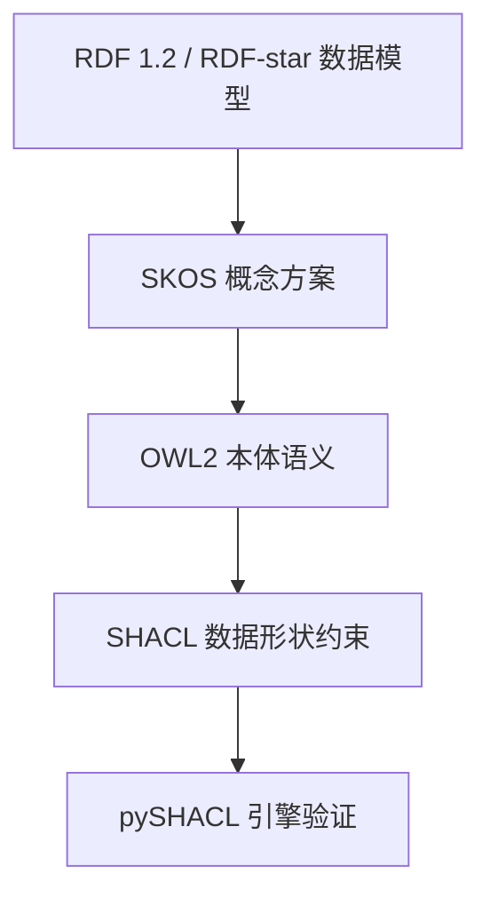
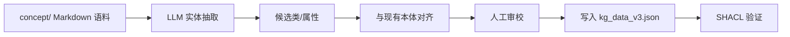

# 知识图谱设计：W3C SHACL/OWL 对齐与本体工程方法

> **EN**: Knowledge Graph Design: W3C SHACL/OWL Alignment and Ontology Engineering Methods
> **Summary**: Design principles and engineering workflows for building maintainable Rust knowledge graphs aligned with W3C SHACL, OWL2, SKOS, and RDF-star, including class/property modeling, shape constraints, provenance, and evaluation gates.
>
> **Rust 版本**: 1.97.0+ (Edition 2024)
> **Bloom 层级**: L0 / Meta
> **受众**: [研究者] / [维护者]
> **内容分级**: [研究者级]
> **A/S/P 标记**: **S** — Semantic engineering / **P** — Procedure
> **权威来源**: 本文件为 `concept/` 权威页。
> **前置概念**: [`concept/00_meta/knowledge_topology/kg_ontology_v2.md`](../knowledge_topology/kg_ontology_v2.md)、[`concept/00_meta/03_audit/09_kg_shacl_engine_validation.md`](../03_audit/09_kg_shacl_engine_validation.md)、[`concept/00_meta/02_sources/01_authority_source_map.md`](../02_sources/01_authority_source_map.md)
> **后置概念**: [`concept/00_meta/05_ai_semantic_engineering/02_llm_rag_for_rust.md`](02_llm_rag_for_rust.md)、[`tools/kg_rag/semantic_alignment_pipeline.py`](../../../tools/kg_rag/semantic_alignment_pipeline.py)
> **对齐来源**: [W3C SHACL] · [W3C OWL2] · [W3C SKOS] · [W3C RDF-star] · [ISO 704:2022]

---

## 〇、认知路径

本页将本体工程从"写一堆三元组"提升为**可设计、可验证、可演进**的学科化实践。阅读路径：

1. 先理解 KG 设计目标与 W3C 四层标准栈；
2. 掌握类/属性/形状三层建模方法；
3. 通过 Rust 知识库实例看懂 `dependsOn` / `entails` / `mutexWith` 等语义谓词如何被约束；
4. 最后把设计接入质量门，确保新增概念不破坏图谱语义。

---

## 一、为什么需要 KG 设计方法

一个未经设计的知识图谱会迅速退化为"高级标签云"：

| 反模式 | 症状 | 设计对策 |
|---|---|---|
| 通用关系泛滥 | 所有边都是 `relatedTo` | 引入 OWL2 对象属性 + SHACL 约束 |
| 来源不可解释 | 三元组不知从哪来 | RDF-star 注解 + `ex:source` / `ex:evidence` |
| 多语言缺失 | 只有中文或只有英文标签 | SKOS `prefLabel` / `definition` 多语言方案 |
| 层级断裂 | `Class` 与 `Instance` 混用 | 显式 `rdf:type` / `rdfs:subClassOf` 声明 |
| 演化不可追踪 | 改一个谓词导致下游全部失效 | 版本化 shapes + CI 质量门 |

Rust 概念知识库的 KG 必须同时服务三种消费者：

- **人**：通过 [`kg_browser`](../../../tools/kg_browser/README.md) 浏览概念关系；
- **LLM**：通过 [`llm_semantic_retriever.py`](../../../tools/kg_rag/llm_semantic_retriever.py) 做语义检索；
- **机器**：通过 `scripts/check_kg_shapes.py --strict` 与 `scripts/check_kg_relation_precision.py --strict` 验证。

因此 KG 设计不是可选装饰，而是知识库的可验证基座。

---

## 二、W3C 四层标准栈

本知识库 KG 显式对齐以下四层 W3C/ISO 标准：



| 层 | 标准 | 在 Rust KG 中的职责 | 典型元素 |
|---|---|---|---|
| 数据模型 | RDF 1.2 / RDF-star | 表达三元组及三元组注解 | `ex:Concept rdfs:subClassOf skos:Concept` |
| 概念方案 | SKOS | 多语言标签与概念层级 | `skos:prefLabel`, `skos:broader` |
| 本体语义 | OWL2 | 类、属性、等价/互斥/传递 | `owl:ObjectProperty`, `owl:TransitiveProperty` |
| 形状约束 | SHACL | 机器可执行的合法性规则 | `sh:NodeShape`, `sh:PropertyShape` |

> **设计原则**：每一层只解决它该解决的问题，不要指望 SHACL 表达全部 OWL 推理，也不要用 SKOS 表达精确逻辑。

---

## 三、概念建模三层法

### 3.1 类层：什么是一种什么

以 Rust `Trait` 为例：

```turtle
@prefix ex: <https://rust-lang-knowledge-graph.org/> .
@prefix rdfs: <http://www.w3.org/2000/01/rdf-schema#> .
@prefix skos: <http://www.w3.org/2004/02/skos/core#> .
@prefix owl: <http://www.w3.org/2002/07/owl#> .

ex:RustConcept a owl:Class ;
    rdfs:label "Rust Concept"@en, "Rust 概念"@zh ;
    rdfs:subClassOf skos:Concept .

ex:Trait a owl:Class ;
    rdfs:label "Trait"@en, "Trait"@zh ;
    rdfs:subClassOf ex:RustConcept .

ex:Generic a owl:Class ;
    rdfs:subClassOf ex:RustConcept .
```

### 3.2 属性层：如何关联

Rust KG 核心对象属性及其 OWL 特征：

| 谓词 | OWL 特征 | 语义 | 示例 |
|---|---|---|---|
| `ex:dependsOn` | `TransitiveProperty` | 概念依赖 | `Iterator` `dependsOn` `Lifetime` |
| `ex:entails` | `TransitiveProperty` | 逻辑蕴含 | `Send + Sync` `entails` thread-safety |
| `ex:mutexWith` | `SymmetricProperty` | 互斥 | `&mut T` `mutexWith` 别名规则破坏 |
| `ex:refines` | `TransitiveProperty` | 细化 | `async fn` `refines` `Future` |
| `ex:equivalentTo` | `SymmetricProperty`, `TransitiveProperty` | 等价 | `Box<T>` move ≡ `T` move（语义上） |
| `ex:counterExample` | 非传递 | 反例 | `unsafe` misuse 是 `unsafe` 正确用法的反例 |

### 3.3 形状层：哪些实例合法

`kg_shapes.ttl` 中一个最小节点形状：

```turtle
ex:ConceptShape a sh:NodeShape ;
    sh:targetClass ex:Concept ;
    sh:property [
        sh:path skos:prefLabel ;
        sh:minCount 1 ;
        sh:uniqueLang true ;
    ] ;
    sh:property [
        sh:path ex:bloomLevel ;
        sh:datatype xsd:string ;
        sh:in ( "L0" "L1" "L2" "L3" "L4" "L5" "L6" "L7" ) ;
    ] ;
    sh:closed false .
```

> **关键设计决策**：`sh:closed false` —— 允许新增属性，便于演化；但每个属性通过独立 `sh:PropertyShape` 约束取值类型与基数。

---

## 四、SHACL 设计模式

### 4.1 节点形状 vs 属性形状

- **节点形状（NodeShape）**：描述一个类的整体约束，如必须有哪些属性。
- **属性形状（PropertyShape）**：描述单个属性的约束，如基数、类型、取值范围。

```turtle
ex:RelationPrecisionShape a sh:NodeShape ;
    sh:targetClass ex:Relation ;
    sh:message "KG 关系必须使用具体语义谓词，禁止通用 ex:RelationAnnotation" ;
    sh:property [
        sh:path rdf:predicate ;
        sh:not [ sh:hasValue ex:RelationAnnotation ] ;
    ] .
```

该形状直接对应 [`scripts/check_kg_relation_precision.py`](../../../scripts/check_kg_relation_precision.py) 的阻断规则：核心 50 实体周边 generic ratio 必须为 0%。

### 4.2 RDF-star 来源注解

当一条关系来自 LLM 生成或人工审校时，用 RDF-star 保留证据：

```turtle
<< ex:AsyncAwait ex:dependsOn ex:Future >> ex:confidence "0.94"^^xsd:float ;
                                          ex:source "concept/03_advanced/01_async/01_async_await.md" ;
                                          ex:method "manual-curation" .
```

设计收益：

- 可追溯：知道关系从哪来；
- 可评估：低置信度关系可触发人工复核；
- 可过滤：RAG 检索时只召回高置信度/人工审校的边。

---

## 五、LLM-based Ontology Engineering

### 5.1 从非结构化文本到候选本体

典型半自动工作流：



LLM 适合做的：

- 抽取实体与关系候选；
- 生成多语言 `skos:definition`；
- 识别潜在等价/互斥关系。

LLM 不适合做的（必须人工/规则兜底）：

- 判定权威来源；
- 决定 canonical 归属；
- 保证形式化正确性（如传递闭包）。

### 5.2 语义漂移检测

新增概念页后，运行：

```bash
python scripts/generate_kg_v3.py
python scripts/apply_kg_semantic_predicates.py --all-batches --apply
python scripts/check_kg_relation_precision.py --strict
python tools/kg_shacl/validate_kg_shacl.py
```

如果 LLM 生成了新的通用 `ex:relatedTo` 边，`check_kg_relation_precision.py` 会报错；`compress_kg_relatedto.py` 则按目录/层级启发式将其压缩为 `dependsOn` / `hasPart` / `partOf` 等具体谓词。

---

## 六、Rust KG 设计实例

### 6.1 设计问题：如何表达 "Trait Object Safety"

候选方案对比：

| 方案 | 表示 | 问题 |
|---|---|---|
| A | `ex:TraitObjectSafety a ex:Concept` | 把属性当类，层级混乱 |
| B | `ex:Trait ex:hasProperty ex:TraitObjectSafety` | 属性无类型，无法约束 |
| C | `ex:TraitObjectSafety a owl:Class ; rdfs:subClassOf ex:Trait` | 清晰，可继承约束 |

最终采用方案 C，并在 SHACL 中约束：

```turtle
ex:TraitObjectSafetyShape a sh:NodeShape ;
    sh:targetClass ex:TraitObjectSafety ;
    sh:property [
        sh:path ex:requires ;
        sh:minCount 1 ;
        sh:class ex:MethodSignature ;
    ] .
```

### 6.2 代码示例：用 Python 验证一个概念节点

```python
# ignore
import json
from pyshacl import validate

kg = json.load(open("concept/00_meta/kg_data_v3.json"))
shapes = open("concept/00_meta/kg_shapes.ttl").read()

conforms, report_graph, report_text = validate(
    kg,
    shacl_graph=shapes,
    data_graph_format="json-ld",
    shacl_graph_format="turtle",
    inference="rdfs",
)
print("conforms:", conforms)
```

> 该块标注 `ignore`，因为 `pyshacl` 只在 `tools/kg_shacl/.venv` 中安装，不属于 workspace 依赖。

---

## 七、反例与边界

### 7.1 反例：用 OWL 表达所有业务规则

OWL 推理强大但不可预测。例如将 `ex:dependsOn` 设为 `TransitiveProperty` 后，推理机会自动推出多跳依赖；若不加 `sh:closed` 或 `sh:maxCount`，可能产生意料外的隐式三元组。Rust KG 的做法是：**OWL 声明语义，SHACL 执行约束**。

### 7.2 反例：SHACL 形状过紧

```turtle
# 不好的设计
ex:ConceptShape sh:closed true .
```

这会导致任何新增元数据（如 `ex:aiGeneratedBy`）都触发 violation。Rust KG 使用 `sh:closed false` 并配合可选属性形状，保持演化空间。

### 7.3 边界：KG 不能替代 rustc

KG 表达的是**概念关系**，不是**类型系统判定**。例如 KG 可以说 `unsafe` `dependsOn` `raw pointer`，但无法证明某段 `unsafe` 代码是否触发 UB。形式化证明仍由 RustBelt / Miri 等工具负责。

---

## 八、质量门集成

KG 设计变更必须通过以下门：

| 门 | 命令 | 关注点 |
|---|---|---|
| 形状验证 | `python scripts/check_kg_shapes.py --strict` | K1–K6 无阻断 violation |
| 谓词精度 | `python scripts/check_kg_relation_precision.py --strict` | 核心 50 实体 generic ratio = 0% |
| SHACL 引擎 | `python tools/kg_shacl/validate_kg_shacl.py` | pySHACL conforms=true |
| 命名规范 | `python scripts/check_naming_convention.py --strict` | N2 同号冲突为 0 |
| 元数据一致 | `python scripts/check_metadata_consistency.py --strict` | 来源/版本/nightly 标注一致 |

---

## 九、相关概念与工具

- [`concept/00_meta/knowledge_topology/kg_ontology_v2.md`](../knowledge_topology/kg_ontology_v2.md) — KG 本体规范 v2（RDF-star/SKOS/SHACL）
- [`concept/00_meta/03_audit/09_kg_shacl_engine_validation.md`](../03_audit/09_kg_shacl_engine_validation.md) — SHACL 引擎验证指南
- [`concept/00_meta/02_sources/01_authority_source_map.md`](../02_sources/01_authority_source_map.md) — 权威来源映射
- [`concept/00_meta/05_ai_semantic_engineering/02_llm_rag_for_rust.md`](02_llm_rag_for_rust.md) — LLM RAG 与语义对齐
- [`tools/kg_rag/semantic_alignment_pipeline.py`](../../../tools/kg_rag/semantic_alignment_pipeline.py) — 语义对齐流水线（P8-7 新增）
- [`tools/kg_shacl/validate_kg_shacl.py`](../../../tools/kg_shacl/validate_kg_shacl.py) — SHACL 验证脚本

---

## 十、版本与演进

| 日期 | 变更 |
|---|---|
| 2026-08-04 | P8-7 新增本权威页，定位 KG 设计方法学，区分于 `kg_ontology_v2.md` 的规范描述 |
