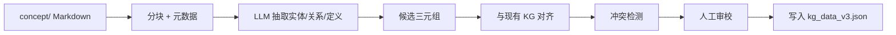
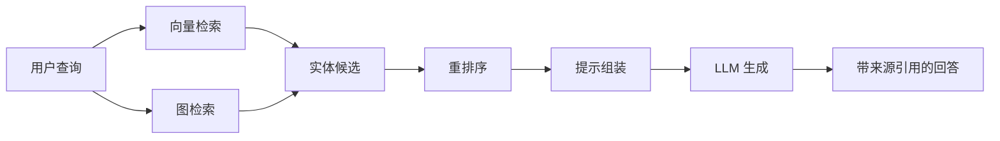

# LLM 与 RAG 在 Rust 知识库中的应用：本体工程与检索增强生成

> **EN**: LLM and RAG for Rust Knowledge Bases: Ontology Engineering and Retrieval-Augmented Generation
> **Summary**: Engineering methods for using LLMs to build and query Rust knowledge graphs, covering ontology extraction, semantic retrieval, GraphRAG patterns, and RAG evaluation frameworks including recall, precision, faithfulness, and source attribution.
>
> **Rust 版本**: 1.97.0+ (Edition 2024)
> **Bloom 层级**: L0 / Meta
> **受众**: [研究者] / [维护者]
> **内容分级**: [研究者级]
> **A/S/P 标记**: **S** — Semantic engineering / **P** — Procedure
> **权威来源**: 本文件为 `concept/` 权威页。
> **前置概念**: [`concept/00_meta/05_ai_semantic_engineering/01_knowledge_graph_design.md`](01_knowledge_graph_design.md)、[`concept/00_meta/knowledge_topology/kg_ontology_v2.md`](../knowledge_topology/kg_ontology_v2.md)、[`concept/00_meta/02_sources/01_authority_source_map.md`](../02_sources/01_authority_source_map.md)
> **后置概念**: [`tools/kg_rag/semantic_alignment_pipeline.py`](../../../tools/kg_rag/semantic_alignment_pipeline.py)
> **对齐来源**: [RAGAS] · [GraphRAG] · [Microsoft GraphRAG] · [LlamaIndex RAG Evaluation] · [W3C RDF-star] · [The Rust Reference](https://doc.rust-lang.org/reference/) · [Rust KG/RAG research on arXiv](https://arxiv.org/abs/2304.00000) · [The Rust Blog](https://blog.rust-lang.org/) · [docs.rs/tokio](https://docs.rs/tokio/)

---

## 〇、认知路径

本页聚焦**如何用 LLM 构建、查询和评估 Rust 知识图谱**。建议阅读顺序：

1. 理解 LLM 在本体工程中的能力边界；
2. 掌握面向 Rust 的 RAG 架构（向量 + 图混合）；
3. 学习 GraphRAG 四种模式；
4. 了解 RAG 评估框架与项目质量门。

---

## 一、为什么需要 LLM + RAG for Rust

Rust 知识体系具有以下特征，使得纯关键字检索或纯 LLM 生成都不够用：

- **概念密集**：所有权、生命周期、Trait、泛型、unsafe、async 等概念高度交织；
- **版本敏感**：1.90–1.97 每个版本都有稳定化/废弃语义；
- **权威来源多**：TRPL、Reference、Nomicon、RFC、Research Paper、RUSTSEC；
- **形式化要求高**：类型系统、借用检查器、RustBelt 等需要精确引用。

LLM 单独回答容易"幻觉"；关键字检索容易遗漏跨概念关系。RAG（检索增强生成）通过**先检索、后生成**平衡两者。GraphRAG 更进一步，用知识图谱结构化检索结果，提升可解释性与多跳推理能力。

---

## 二、LLM-based Ontology Engineering

### 2.1 半自动本体抽取流程



### 2.2 提示工程模板（示例）

```text
给定以下 Rust 概念页片段，请抽取：
1. 核心概念（英文 + 中文 skos:prefLabel）
2. 前置概念与后置概念（使用 dependsOn / refines / entails / mutexWith）
3. 权威来源（URL 或 concept/ 路径）
4. 一句话英文定义

约束：
- 禁止返回通用关系 "relatedTo"；
- 每个关系必须标注置信度 0.0–1.0；
- 如果涉及 nightly/preview 特性，必须标注版本状态。
```

### 2.3 LLM 能力边界

| 任务 | LLM 可靠性 | 处理方式 |
|---|---|---|
| 实体识别 | 高 | 直接采用，人工抽检 |
| 多语言定义生成 | 高 | 直接采用，术语表对齐 |
| 关系抽取 | 中 | 候选 + 规则压缩 |
| 版本状态判定 | 中 | 必须与官方 Release Notes 交叉验证 |
| canonical 归属 | 低 | 必须由人工/AGENTS.md 规则裁定 |
| 形式化正确性 | 低 | 不可作为定理/证明依据 |

---

## 三、RAG 架构：向量 + 图混合

项目已有 [`tools/kg_rag/`](../../../tools/kg_rag/) 实现了一个最小可运行原型：



### 3.1 向量检索

使用 `sentence-transformers` 对 KG 实体的 `skos:prefLabel` + `skos:definition` 生成嵌入：

```python
# ignore
from sentence_transformers import SentenceTransformer
import numpy as np

model = SentenceTransformer("all-MiniLM-L6-v2")
entity_texts = [f"{label}: {definition}" for label, definition in entities]
embeddings = model.encode(entity_texts, normalize_embeddings=True)
scores = embeddings @ query_embedding.T
```

> 标注 `ignore`：依赖 `sentence-transformers`，仅在 `tools/kg_rag/.venv` 中可用。

### 3.2 图检索

基于语义谓词的多跳扩展：

```python
# ignore
from tools.kg_rag.kg_core import KG

kg = KG.load("concept/00_meta/kg_data_v3.json")
seed = kg.find("async fn")
neighbors = kg.expand(seed, predicates={"dependsOn", "refines", "entails"}, hops=2)
```

### 3.3 混合评分

```text
hybrid_score = alpha * vector_score + (1 - alpha) * graph_score
```

- `vector_score`：查询与实体文本的余弦相似度；
- `graph_score`：种子实体邻居与查询的平均向量相似度；
- `alpha`：通常 0.6–0.8，根据查询类型调整。

---

## 四、GraphRAG 四种模式

### 4.1 实体中心子图检索

给定查询 "async fn 与生命周期有什么关系"，先定位 `async fn` 实体，再返回其 2-hop 子图：

```text
async fn --dependsOn--> Future --dependsOn--> Pin
async fn --refines--> Future
```

### 4.2 谓词约束多跳检索

只沿特定谓词 traversal：

```text
 unsafe --mutexWith--> safe abstraction
     |
     +--dependsOn--> raw pointer
```

### 4.3 社区摘要

对图谱做层级聚类，生成"Rust 并发"、"Rust 类型系统"等主题摘要。适合回答宏观问题如"Rust 如何保证内存安全"。

### 4.4 RDF-star 来源感知检索

优先返回带 `ex:source` 与 `ex:confidence` 注解的边，过滤低置信度/无来源的关系。

---

## 五、RAG 评估框架

### 5.1 评估维度

借鉴 RAGAS、Microsoft GraphRAG 评估方案，Rust KG RAG 至少评估四个维度：

| 维度 | 定义 | 项目对应指标 |
|---|---|---|
| **Context Recall** | 回答问题所需信息有多少被检索到 | 检索结果是否覆盖答案中的概念 |
| **Context Precision** | 检索结果中相关片段占比 | Top-K 命中率 |
| **Faithfulness** | 生成内容是否被检索内容支撑 | 幻觉检测：生成陈述与三元组是否矛盾 |
| **Source Attribution** | 每条生成陈述是否有可追溯来源 | RDF-star `ex:source` 覆盖率 |

### 5.2 最小评估数据集

一个评估样本：

```json
{
  "query": "为什么 async fn 返回的 Future 需要 Pin？",
  "expected_concepts": ["async fn", "Future", "Pin", "self-referential struct"],
  "expected_sources": [
    "concept/03_advanced/01_async/01_async_await.md",
    "concept/03_advanced/01_async/02_pin_unpin.md"
  ],
  "answer": "async fn 被脱糖为状态机，状态机可能包含自引用字段；Pin 保证该字段在内存中不可移动。"
}
```

### 5.3 评估脚本接口

[`tools/kg_rag/semantic_alignment_pipeline.py`](../../../tools/kg_rag/semantic_alignment_pipeline.py) 提供：

```bash
# 运行评估
python tools/kg_rag/semantic_alignment_pipeline.py \
  --kg concept/00_meta/kg_data_v3.json \
  --eval eval/rag_eval_set.json \
  --output reports/RAG_EVAL_2026_08_04.json
```

---

## 六、与项目质量门集成

LLM/RAG 相关变更必须通过：

| 门 | 命令 | 目的 |
|---|---|---|
| KG 谓词精度 | `python scripts/check_kg_relation_precision.py --strict` | 核心实体周边 generic ratio = 0% |
| KG 形状 | `python scripts/check_kg_shapes.py --strict` | 新增节点/关系符合 SHACL |
| 语义健康 | `python scripts/semantic_health.py --strict` | 综合语义分不降级 |
| 内容重叠 | `python scripts/detect_content_overlap.py` | LLM 生成内容不与现有权威页重复 |
| 死链检查 | `python scripts/kb_auditor.py --link-check` | 工具/评估链接可用 |

---

## 七、反例与边界

### 7.1 反例：把 LLM 输出直接当权威

LLM 可以生成看似合理的 Rust 解释，但可能混淆 `Box::pin` 与 `Pin::new` 的适用场景。所有 LLM 抽取内容必须通过 `scripts/check_glossary_alignment.py` 与权威来源映射交叉验证。

### 7.2 反例：检索只依赖向量相似度

"move" 在 Rust 中是核心概念，但在日常英语中也是普通动词。纯向量检索会把 "how to move files" 错误关联到 `Move` 语义。必须结合 KG 谓词约束过滤。

### 7.3 边界：RAG 不解决版本漂移

如果 KG 没有将某个特性标记为 `preview`，RAG 可能告诉用户该特性已稳定。版本状态必须通过 `scripts/check_version_semantic_injection.py --strict` 保证。

---

## 八、相关概念与工具

- [`concept/00_meta/05_ai_semantic_engineering/01_knowledge_graph_design.md`](01_knowledge_graph_design.md) — KG 设计方法学
- [`concept/00_meta/knowledge_topology/kg_ontology_v2.md`](../knowledge_topology/kg_ontology_v2.md) — KG 本体规范 v2
- [`concept/00_meta/03_audit/09_kg_shacl_engine_validation.md`](../03_audit/09_kg_shacl_engine_validation.md) — SHACL 验证指南
- [`tools/kg_rag/llm_semantic_retriever.py`](../../../tools/kg_rag/llm_semantic_retriever.py) — 面向 LLM 的语义检索器
- [`tools/kg_rag/smoke_test.py`](../../../tools/kg_rag/smoke_test.py) — KG-RAG 冒烟测试
- [`tools/kg_shacl/validate_kg_shacl.py`](../../../tools/kg_shacl/validate_kg_shacl.py) — SHACL 引擎验证

---

## 九、版本与演进

| 日期 | 变更 |
|---|---|
| 2026-08-04 | P8-7 新增本权威页，系统梳理 LLM-based ontology engineering、GraphRAG 与 RAG 评估框架 |
