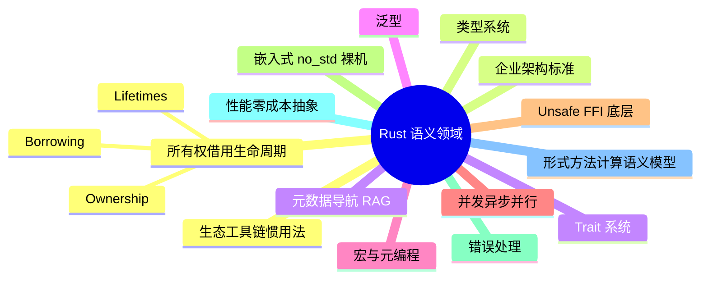

# 语义领域与国际权威来源对齐矩阵

**EN**: Semantic Domain and International Authority Alignment Matrix
**Summary**: A living L0 map that classifies every `concept/` page into a semantic domain, measures its alignment with international authority source categories, and exposes coverage gaps for P10 and beyond.

> **Rust 版本**: 1.97.1+ (Edition 2024)
> **Bloom 层级**: L0
> **权威来源**: 本文件为 `concept/` 权威页。
> **来源**: 由 `scripts/semantic_domain_inventory.py` 根据 `concept/**/*.md` 自动生成并人工复核。

---

## 1. 矩阵方法论

1. **领域划分**：将 `concept/` 每个页面按路径与标题关键词归入 14 个语义领域（见下表）。
2. **来源对齐**：扫描页面中的 Markdown 链接与 URL，命中 8 类国际权威来源：官方文档、形式化/验证工具、嵌入式/安全关键、工业生态库、设计模式/性能/惯用法、学术论文、标准/企业架构、社区博客/演讲。
3. **思维表征度量**：统计每个领域页面的 mindmap 覆盖率、代码块覆盖率、反例节覆盖率、决策树覆盖率。
4. **预期主题对比**：将页面与 P10 预期清单（no_std/嵌入式、惯用法/模式/架构、计算语义模型、RAG 生产化）做关键字匹配，输出缺口。
5. **滚动更新**：P10-7 每季度复跑脚本，必要时手动调整分类规则与预期清单。

---

## 2. 语义领域 - 国际权威来源矩阵

> **数据快照**: 2026-08-04 | 总页数: 824 | 工具: `scripts/semantic_domain_inventory.py`

| 语义领域 | 页数 | mindmap% | 代码块% | 反例% | 决策树% | 对齐来源类别数 | 预期覆盖% | 主要来源类别 |
|---|---:|---:|---:|---:|---:|---:|---:|---|
| 所有权 / 借用 / 生命周期 | 8 | 100% | 100% | 75% | 50% | 6 | 100.0% | 学术论文, 社区博客 / 演讲, 形式化 / 验证工具, 官方文档, 工业生态库, 设计模式 / 性能 / 惯用法 |
| 类型系统 | 36 | 100% | 97% | 53% | 56% | 8 | 100.0% | 学术论文, 嵌入式 / 安全关键, 形式化 / 验证工具, 官方文档, 设计模式 / 性能 / 惯用法, 标准 / 企业架构, 社区博客 / 演讲, 工业生态库 |
| Trait 系统 | 9 | 100% | 100% | 56% | 44% | 7 | 100.0% | 学术论文, 嵌入式 / 安全关键, 形式化 / 验证工具, 工业生态库, 官方文档, 标准 / 企业架构, 社区博客 / 演讲 |
| 泛型 | 4 | 100% | 100% | 100% | 25% | 5 | 100.0% | 学术论文, 设计模式 / 性能 / 惯用法, 形式化 / 验证工具, 官方文档, 工业生态库 |
| 宏与元编程 | 19 | 95% | 89% | 58% | 32% | 7 | 100.0% | 学术论文, 工业生态库, 官方文档, 标准 / 企业架构, 社区博客 / 演讲, 设计模式 / 性能 / 惯用法, 形式化 / 验证工具 |
| 并发 / 异步 / 并行 | 30 | 100% | 100% | 57% | 33% | 8 | 100.0% | 学术论文, 设计模式 / 性能 / 惯用法, 工业生态库, 官方文档, 形式化 / 验证工具, 嵌入式 / 安全关键, 标准 / 企业架构, 社区博客 / 演讲 |
| Unsafe / FFI / 底层 | 30 | 97% | 93% | 87% | 33% | 8 | 100.0% | 学术论文, 嵌入式 / 安全关键, 形式化 / 验证工具, 工业生态库, 官方文档, 社区博客 / 演讲, 标准 / 企业架构, 设计模式 / 性能 / 惯用法 |
| 嵌入式 / no_std / 裸机 | 58 | 97% | 97% | 84% | 59% | 8 | 100.0% | 学术论文, 设计模式 / 性能 / 惯用法, 嵌入式 / 安全关键, 官方文档, 标准 / 企业架构, 形式化 / 验证工具, 工业生态库, 社区博客 / 演讲 |
| 错误处理 | 8 | 100% | 100% | 62% | 38% | 5 | 100.0% | 学术论文, 形式化 / 验证工具, 工业生态库, 官方文档, 设计模式 / 性能 / 惯用法 |
| 性能 / 零成本抽象 | 28 | 96% | 96% | 82% | 82% | 7 | 100.0% | 设计模式 / 性能 / 惯用法, 形式化 / 验证工具, 工业生态库, 官方文档, 学术论文, 社区博客 / 演讲, 标准 / 企业架构 |
| 形式方法 / 计算语义模型 | 145 | 94% | 90% | 72% | 31% | 8 | 100.0% | 学术论文, 设计模式 / 性能 / 惯用法, 工业生态库, 官方文档, 形式化 / 验证工具, 社区博客 / 演讲, 嵌入式 / 安全关键, 标准 / 企业架构 |
| 生态 / 工具链 / 惯用法 | 212 | 95% | 88% | 75% | 47% | 8 | 100.0% | 形式化 / 验证工具, 官方文档, 学术论文, 工业生态库, 设计模式 / 性能 / 惯用法, 标准 / 企业架构, 社区博客 / 演讲, 嵌入式 / 安全关键 |
| 企业架构 / 标准 | 18 | 89% | 78% | 83% | 61% | 8 | 100.0% | 学术论文, 工业生态库, 官方文档, 标准 / 企业架构, 形式化 / 验证工具, 设计模式 / 性能 / 惯用法, 社区博客 / 演讲, 嵌入式 / 安全关键 |
| 元数据 / 导航 / RAG | 219 | 58% | 59% | 35% | 35% | 8 | 0.0% | 学术论文, 形式化 / 验证工具, 官方文档, 嵌入式 / 安全关键, 工业生态库, 社区博客 / 演讲, 设计模式 / 性能 / 惯用法, 标准 / 企业架构 |

---

## 3. 语义领域全景图



---

## 4. P10 主要缺口与骨架页

完整缺口分析见 [`reports/P10_SEMANTIC_DOMAIN_GAP_ANALYSIS_2026_08.md`](../../../reports/P10_SEMANTIC_DOMAIN_GAP_ANALYSIS_2026_08.md)。

### 4.1 剩余缺口（RAG 生产化工件）

| 缺口主题 | 所属领域 | 优先级 | 建议目标 |
|---|---|---|---|
| Golden query set ≥200 | 元数据 / 导航 / RAG | P2 | `tools/kg_rag/golden_query_set_v1.json` |
| Embedding fine-tuning pipeline | 元数据 / 导航 / RAG | P2 | `tools/kg_rag/fine_tune_embedding.py` |
| Reranker / hybrid search | 元数据 / 导航 / RAG | P2 | `tools/kg_rag/hybrid_search.py` |

### 4.2 已存在但需补全的骨架页

- `concept/05_comparative/05_idioms_patterns_architecture/01_idioms/05_typestate.md`
- `concept/05_comparative/05_idioms_patterns_architecture/01_idioms/06_raii_cleanup.md`
- `concept/05_comparative/05_idioms_patterns_architecture/01_idioms/07_builder.md`
- `concept/05_comparative/05_idioms_patterns_architecture/01_idioms/08_defer.md`
- `concept/05_comparative/05_idioms_patterns_architecture/04_architecture/04_actor.md`
- `concept/05_comparative/05_idioms_patterns_architecture/04_architecture/05_plugin_system.md`
- `concept/05_comparative/05_idioms_patterns_architecture/04_architecture/06_event_bus.md`

---

## 5. 示例与反例

### 5.1 良好对齐的域：所有权 / 借用 / 生命周期

- **定义**：该域把 Rust 最核心的资源管理语义集中为单一权威解释。
- **证据**：8 个页面 100% 含 mindmap、100% 含代码块、75% 含反例节，对齐官方文档、学术论文、形式化工具、社区博客 6 类来源。
- **代表页**：
  - [`concept/01_foundation/01_ownership_borrow_lifetime/01_ownership.md`](../../01_foundation/01_ownership_borrow_lifetime/01_ownership.md)
  - [`concept/01_foundation/01_ownership_borrow_lifetime/03_lifetimes.md`](../../01_foundation/01_ownership_borrow_lifetime/03_lifetimes.md)

### 5.2 存在缺口的域：RAG 生产化

- **现状**：`concept/` 侧已有 RAG 评估元页，但 golden query set、embedding 微调流水线、reranker/hybrid search 等生产化工件仍停留在目标阶段，未落地为 `tools/kg_rag/` 中的可运行脚本/数据集。
- **反例**：若把 RAG 评估仅写成概念说明而不提供可复现的 `fine_tune_embedding.py` 与 `golden_query_set_v1.json`，则无法达到 P10-5 的 `concept_recall@5 ≥ 0.50` 目标。
- **正确做法**：在 `tools/kg_rag/` 实现工具并保留概念元页链接，形成“概念 ↔ 工具”双向可追溯。

---

## 6. 决策树：何时新建 `concept/` 页

| 问题 | 如果为“是” | 如果为“否” |
|---|---|---|
| 1. 该主题是否已在 `concept/` 中有英文标题/中文标题高度一致的权威页？ | 更新原页，不要新建 | 继续下一步 |
| 2. 是否属于外部权威来源的“示例级/实现细节”？ | 放入 `crates/` / `examples/` / `exercises/`，`concept/` 仅链接 | 继续下一步 |
| 3. 是否属于跨语言对比或 Rust 特有解决方案？ | 归入 `concept/05_comparative/` 并链接到对应核心域 | 继续下一步 |
| 4. 是否属于工具/流水线/数据集（如 RAG golden query）？ | 放入 `tools/` 或 `reports/`，`concept/` 保留元页链接 | 继续下一步 |
| 5. 是否已有同主题摘要/重定向 stub？ | 将 stub 扩展为权威页，并同步更新索引 | 在对应语义领域目录新建权威页 |
| 6. 新建后是否补 mindmap + 反例 + 国际来源链接？ | 通过质量门 | 补充后再合并 |

---

## 7. 相关页面

- [`concept/00_meta/02_sources/06_external_authority_topic_index.md`](../02_sources/06_external_authority_topic_index.md) — 外部权威来源主题索引
- [`concept/00_meta/02_sources/04_topic_authority_alignment_map.md`](../02_sources/04_topic_authority_alignment_map.md) — 主题-权威来源对齐图谱
- [`concept/00_meta/02_sources/05_international_authority_index.md`](../02_sources/05_international_authority_index.md) — 国际化权威来源索引
- [`concept/00_meta/05_ai_semantic_engineering/03_rag_evaluation_for_rust_kg.md`](03_rag_evaluation_for_rust_kg.md) — Rust KG 的 RAG 评估
- [`reports/P10_SEMANTIC_DOMAIN_GAP_ANALYSIS_2026_08.md`](../../../reports/P10_SEMANTIC_DOMAIN_GAP_ANALYSIS_2026_08.md) — P10 语义领域缺口完整分析报告

---

## 8. 维护命令

```bash
# 重新生成本矩阵与 JSON 盘点
python scripts/semantic_domain_inventory.py

# 查看 JSON 盘点
cat tmp/semantic_domain_inventory.json

# 查看矩阵 Markdown
cat tmp/semantic_domain_matrix.md
```
