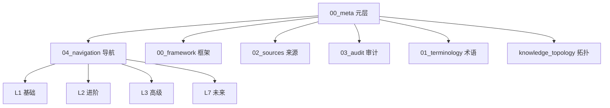
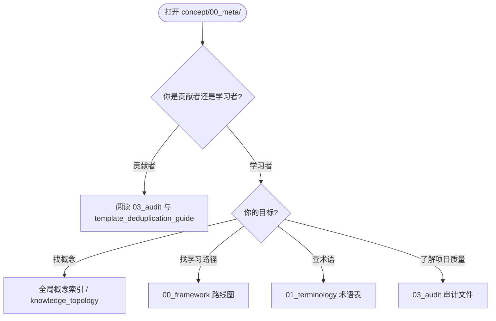
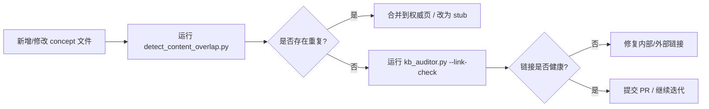

# Concept 元层
>
> **EN**: Concept Meta Layer
> **Summary**: Overview and entry point for the concept documentation structure: navigation, metadata, audit, and governance layers that connect L0-L7 canonical concept pages.
> **受众**: [初学者]
> **内容分级**: [综述级]
> **权威来源**: 本文件为 `concept/` 权威页。
> **定理链**: N/A — 描述性/综述性/导航性文档，不涉及形式化定理链
> **来源**: [TRPL](https://doc.rust-lang.org/book/title-page.html) · [Rust Reference](https://doc.rust-lang.org/reference/introduction.html)

---

## 元层定位

`concept/00_meta/` 是 Rust 分层概念知识体系的**元信息层（L0）**。它不替代任何具体概念文件，而是提供：

- **导航索引**：帮助学习者在 L1-L7 之间快速跳转。
- **元数据标准**：定义受众、Bloom 层级、A/S/P 标记、内容分级等标签。
- **质量治理**：审计指南、去同质化模板、缺口追踪等。
- **来源对齐**：权威来源映射、术语表、双语模板。

## 子目录职责

| 子目录 | 职责 | 代表文件 |
|:---|:---|:---|
| `00_framework/` | 学习框架与语义坐标系 | [Bloom 分类法](00_framework/bloom_taxonomy.md) · [模式语义空间索引](00_framework/pattern_semantic_space_index.md) |
| `01_terminology/` | 术语表与双语模板 | [术语表](01_terminology/01_terminology_glossary.md) · [双语模板](01_terminology/03_bilingual_template.md) |
| `02_sources/` | 权威来源映射 | [权威来源映射表](02_sources/01_authority_source_map.md) |
| `03_audit/` | 质量审计与治理 | [Concept Audit Guide](03_audit/01_concept_audit_guide.md) · [分级体系](03_audit/06_grading_system.md) · [模板去同质化](03_audit/05_template_deduplication_guide.md) |
| `04_navigation/` | 索引与交叉引用 | [全局概念索引](04_navigation/03_concept_index.md) · [交叉引用矩阵](04_navigation/01_cross_reference_matrix.md) |
| `knowledge_topology/` | 知识体系拓扑图谱集（无序号专题系列，见下） | [拓扑图谱集 README](knowledge_topology/README.md) |
| `07_placeholders/` | SUMMARY.md 导航占位文件 | 待创建主题的导航入口 |

## 编号说明

`concept/00_meta/` 采用以下编号策略（AGENTS.md §4.0）：

- `00_`–`05_` 为常规编号子目录。
- `06_trpl_3rd_ed_mapping.md` 原与 `01_terminology/` 同号，已迁移到空号 `06_`，避免重复。
- `07_placeholders/` 由未编号目录重命名而来，保持目录内连续序号。
- `knowledge_topology/` 是**大型无序号专题系列目录**，内部已按 `01_`–`10_` 编号，并附 [README 索引](knowledge_topology/README.md)；按 AGENTS.md §4.0-4 保留为无序号系列目录，不再额外赋予顶层序号。
- `00_framework/` 同样为注册的无序号专题系列目录，其文件保持无序号以兼容系列约定。

## 核心索引文件

- [全局概念索引](04_navigation/03_concept_index.md) — 按字母顺序索引所有概念
- [知识体系拓扑图谱集](knowledge_topology/README.md) — 概念定义、属性关系、场景决策树、层间/层内映射、权威来源对齐
- [交叉引用矩阵](04_navigation/01_cross_reference_matrix.md) — 概念间依赖关系
- [权威来源映射表](02_sources/01_authority_source_map.md) — 概念与权威来源对照
- [语义桥：算法、设计模式与工作流模式的统一谱系](00_framework/semantic_bridge_algorithms_patterns.md) — 算法 ↔ 模式语义关联
- [模式语义空间索引](00_framework/pattern_semantic_space_index.md) — 设计模式在概念体系中的坐标
- [C/C++ → Rust 工程层对比路线图](00_framework/cpp_rust_engineering_roadmap.md) — C++ 迁移者的主题簇地图
- [通用 PL 基座路线图](00_framework/pl_foundations_roadmap.md) — 通用 PL 机制与 Rust 的对应关系
- [基础知识缺口补全总索引](04_navigation/13_foundations_gap_closure_index.md) — Phase A/B/C 补全状态追踪

## 读者导航决策树

## 元数据标准速查

每个 `concept/` 文件头部建议携带以下元数据：

| 字段 | 说明 | 示例 |
|:---|:---|:---|
| **EN** | 英文标题 | `Cargo build-std` |
| **Summary** | 英文摘要（1-2 句） | `A guide to ...` |
| **受众** | `[初学者]` / `[进阶]` / `[专家]` / `[研究者]` | `[进阶]` |
| **内容分级** | `[综述级]` / `[实验级]` / `[专家级]` / `[研究者级]` | `[综述级]` |
| **Bloom 层级** | 认知目标 | `理解 → 应用` |
| **A/S/P 标记** | 概念类型 | `A` / `S` / `P` / 组合 |
| **前置/后置概念** | 相邻权威页链接 | `[所有权](../...)` |

## 治理工作流

## 嵌入式测验（Embedded Quiz）

理解「嵌入式测验（Embedded Quiz）」需要把握测验 1：《Concept 元层》在本知识体系中扮演什么角色？（理解层）、测验 2：使用本索引文件时，最有效的学习策略是什么？（理解层）与测验 3：索引文档能否替代具体概念文件的学习？（理解层），本节依次展开。

### 测验 1：《Concept 元层》在本知识体系中扮演什么角色？（理解层）

**题目**: 《Concept 元层》在本知识体系中扮演什么角色？

✅ 答案与解析

作为导航和索引文档，帮助学习者快速定位内容、理解知识结构关系，是进入各层内容的入口和路线图。

---

### 测验 2：使用本索引文件时，最有效的学习策略是什么？（理解层）

**题目**: 使用本索引文件时，最有效的学习策略是什么？

✅ 答案与解析

先浏览整体结构建立全局视野，然后根据自身水平选择对应层级，遇到模糊概念时利用交叉引用跳转复习。

---

### 测验 3：索引文档能否替代具体概念文件的学习？（理解层）

**题目**: 索引文档能否替代具体概念文件的学习？

✅ 答案与解析

不能。索引提供的是结构框架和导航，深入理解需要通过阅读具体概念文件、完成测验和实践练习来实现。

---

## 最新状态与变更

| 日期 | 变更 |
|:---|:---|
| 2026-07 | 完成 Q3 薄页补全，元层文件全部通过 `kb_auditor.py --link-check` |
| 2026-06 | 引入 A/S/P 三维标记与内容分级体系 |
| 2026-05 | 建立 `knowledge_topology/` 10 个 atlas 文件 |

> **来源**: [TRPL](https://doc.rust-lang.org/book/title-page.html) · [Rust Reference](https://doc.rust-lang.org/reference/introduction.html)

---

## 相关概念

- [对应测验](05_quizzes/01_quiz_meta_framework.md) — 元层框架与知识体系架构（L0–L7 分层、Bloom 映射、A/S/P 标记、canonical 规则）
