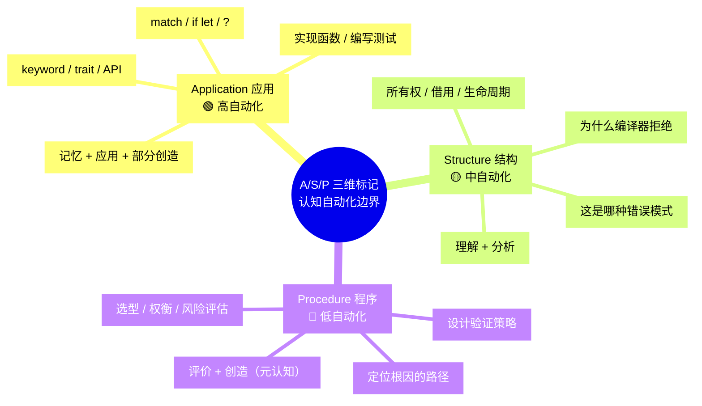
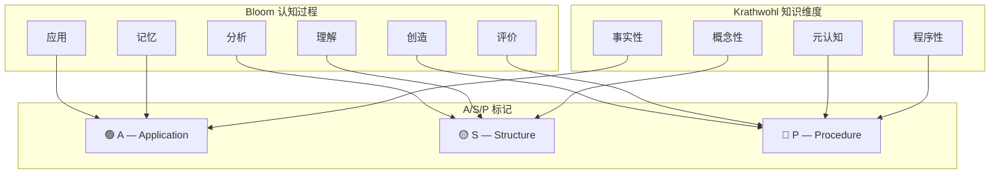
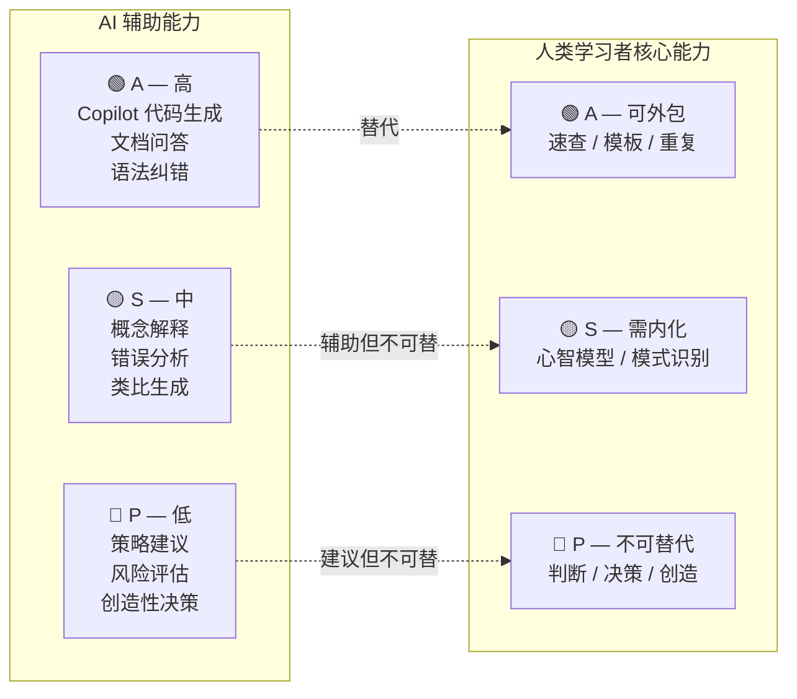

> **生态状态提示**：
>
> 本文档提及 `async-std` 与/或 `wasm32-wasi`。
> 请注意：
>
> - `async-std` 项目已进入维护模式，2024 年后不再活跃开发；新项目建议优先评估 **Tokio** 或 **smol**。
> - `wasm32-wasi` 旧目标名已重命名为 **`wasm32-wasip1`**；WASI Preview 2 对应目标为 **`wasm32-wasip2`**。
>
> **来源**:
> [TRPL](https://doc.rust-lang.org/book/title-page.html) ·
> [Rust Reference](https://doc.rust-lang.org/reference/)
>
---

# Rust 知识体系 A/S/P 三维认知标记规范
>
> **EN**: Asp Marking Guide
> **Summary**: Asp Marking Guide. Core Rust concept.
> **受众**: [专家]
> **Rust 版本**: 1.96.1+ (Edition 2024)
> **Bloom 层级**: 元（Meta）
> **定位**: 本文件定义 `concept/` 知识体系中的 **A(应用) / S(结构) / P(程序)** 三维认知标记规范，作为现有 Bloom 层级标注的补充维度。A/S/P 标记连接 **Krathwohl 知识维度** 与 **Bloom 认知过程维度**，将抽象的双维矩阵压缩为可操作的标签系统。
> **对齐来源**: [Microsoft RustTraining] · [arxiv 2604.06331v1] · [Krathwohl 2002] · [Bloom 修订版 2001]
> **使用方式**: 每个概念文件的头部标注增加 A/S/P 字段；`concept_index.md` 增加 A/S/P 索引列。
> **定理链**: N/A — 描述性/综述性/导航性文档，不涉及形式化定理链
---

> **来源**: [Microsoft RustTraining — github.com/microsoft/RustTraining]
> **来源**: [arxiv 2604.06331v1 — *Knowledge Markers (A/S/P) in Programming Education*]
> **来源**: [Krathwohl, D.R. (2002) — *A Revision of Bloom's Taxonomy: An Overview*]
> **来源**: [Bloom, B.S. et al. (2001) — *Taxonomy of Educational Objectives*]

## 📑 目录

- [Rust 知识体系 A/S/P 三维认知标记规范](#rust-知识体系-asp-三维认知标记规范)
  - [📑 目录](#-目录)
  - [〇、A/S/P 认知全景](#〇asp-认知全景)
  - [一、标记定义与理论根基](#一标记定义与理论根基)
    - [1.1 A — Application（应用）](#11-a--application应用)
    - [1.2 S — Structure（结构）](#12-s--structure结构)
    - [1.3 P — Procedure（程序）](#13-p--procedure程序)
    - [1.4 三标记与 Bloom/Krathwohl 的映射](#14-三标记与-bloomkrathwohl-的映射)
  - [二、标记规范](#二标记规范)
    - [2.1 文件头部标注格式](#21-文件头部标注格式)
    - [2.2 多标记组合规则](#22-多标记组合规则)
    - [2.3 与现有 Bloom 标注的整合](#23-与现有-bloom-标注的整合)
  - [三、Rust 知识体系全量标记](#三rust-知识体系全量标记)
    - [3.1 L1 基础概念层](#31-l1-基础概念层)
    - [3.2 L2 进阶概念层](#32-l2-进阶概念层)
    - [3.3 L3 高级概念层](#33-l3-高级概念层)
    - [3.4 L4 形式化层](#34-l4-形式化层)
    - [3.5 L5-L7 层](#35-l5-l7-层)
  - [四、标记应用示例](#四标记应用示例)
    - [4.1 示例 1：借用检查错误诊断](#41-示例-1借用检查错误诊断)
    - [4.2 示例 2：并发设计决策](#42-示例-2并发设计决策)
    - [4.3 示例 3：unsafe 安全论证](#43-示例-3unsafe-安全论证)
  - [五、认知自动化边界分析](#五认知自动化边界分析)
  - [六、与概念索引的整合](#六与概念索引的整合)
  - [七、来源与可信度](#七来源与可信度)
  - [认知路径](#认知路径)
    - [核心推理链](#核心推理链)
    - [反命题与边界](#反命题与边界)
  - [嵌入式测验（Embedded Quiz）](#嵌入式测验embedded-quiz)
    - [测验 1：本文档《Rust 知识体系 A/S/P 三维认知标记规范》在 Rust 知识体系中属于哪一层级的元数据？（理解层）](#测验-1本文档rust-知识体系-asp-三维认知标记规范在-rust-知识体系中属于哪一层级的元数据理解层)
    - [测验 2：《Rust 知识体系 A/S/P 三维认知标记规范》的主要用途是什么？（理解层）](#测验-2rust-知识体系-asp-三维认知标记规范的主要用途是什么理解层)
    - [测验 3：元数据层文档能否替代 L1-L7 的核心概念学习？（理解层）](#测验-3元数据层文档能否替代-l1-l7-的核心概念学习理解层)

---

## 〇、A/S/P 认知全景



> **认知功能**:
> 本 mindmap 展示 A/S/P 三标记的**核心差异**——不是按难度划分，而是按**可自动化程度**划分。
> 在 AI 辅助编程时代，这一区分具有战略意义：A 类技能可被 AI 高度替代，学习者应将认知资源集中在 S 和 P 类技能上。[来源: 💡 原创分析]
> [来源: [arxiv 2604.06331v1]]

---

## 一、标记定义与理论根基

### 1.1 A — Application（应用）

| 属性 | 定义 |
|:---|:---|
| **全称** | Application（应用） |
| **对应 Bloom** | 记忆 (Remember) + 应用 (Apply) + 部分创造 (Create) |
| **对应 Krathwohl** | 事实性知识 (Factual) + 部分程序性知识 (Procedural) |
| **认知目标** | 语法回忆、标准结构应用、代码构造 |
| **典型任务** | "编写一个函数实现..." / "使用 `?` 运算符传播错误" / "为类型实现 `Clone`" |
| **可自动化** | 🟢 **高** — AI 代码助手（Copilot / Kimi / Cursor）在此领域表现优异 |
| **学习策略** | 速查表、API 文档、代码模板、重复练习 |

> **Rust 示例**: 记住 `Vec::push` 的签名、写出 `if let Some(x) = opt { ... }` 的语法结构、使用 `#[derive(Debug)]` 自动生成实现 —— 这些都属于 A 类技能。

### 1.2 S — Structure（结构）

| 属性 | 定义 |
|:---|:---|
| **全称** | Structure（结构） |
| **对应 Bloom** | 理解 (Understand) + 分析 (Analyze) |
| **对应 Krathwohl** | 概念性知识 (Conceptual) |
| **认知目标** | 心理模型构建、解释性推理、模式识别 |
| **典型任务** | "解释借用检查器为何拒绝此代码" / "分析 `Rc<RefCell<T>>` 的适用场景" / "识别这是哪种生命周期错误模式" |
| **可自动化** | 🟡 **中** — AI 可生成解释，但学习者仍需内化模型才能灵活运用 |
| **学习策略** | 可视化（Mermaid 图）、类比、反例分析、概念地图 |

> **Rust 示例**: 理解 "所有权 = 线性逻辑的资源消耗"、解释为什么 `&mut T` 与 `&T` 不能共存、分析 `Pin` 不动性对自引用结构的必要性 —— 这些都属于 S 类技能。

### 1.3 P — Procedure（程序）

| 属性 | 定义 |
|:---|:---|
| **全称** | Procedure（程序） |
| **对应 Bloom** | 评价 (Evaluate) + 创造 (Create) × 元认知 (Metacognitive) |
| **对应 Krathwohl** | 程序性知识 (Procedural) + 元认知知识 (Metacognitive) |
| **认知目标** | 系统方法、调试策略、验证策略、风险评估、决策 |
| **典型任务** | "设计测试策略验证此实现" / "评估此并发设计是否死锁安全" / "选择 `Arc` vs `Rc` 的决策流程" |
| **可自动化** | 🔴 **低** — 涉及上下文判断、权衡和创造性决策，AI 可辅助但不可替代 |
| **学习策略** | 案例研究、决策树练习、同行评审、实际项目经验 |

> **Rust 示例**: 设计 unsafe 代码的安全论证策略、评估 `tokio` vs `async-std [已归档]` 的选型、制定团队代码审查中 unsafe 使用的政策 —— 这些都属于 P 类技能。

### 1.4 三标记与 Bloom/Krathwohl 的映射



> **认知功能**: 本图展示 A/S/P 作为**双维矩阵的压缩投影**。注意这不是严格的一一对应：A 标记主要覆盖"事实性知识 + 低阶认知"，S 标记覆盖"概念性知识 + 中阶认知"，P 标记覆盖"程序性/元认知知识 + 高阶认知"。这种聚类映射使双维矩阵的 24 个单元格可操作化。[来源: 💡 原创分析]

---

## 二、标记规范

### 2.1 文件头部标注格式

每个概念文件的头部信息块增加 `**A/S/P 标记**` 字段：

```markdown
# 概念名称

> **Bloom 层级**: 理解 / 应用 / 分析 / 评价 / 创造
> **A/S/P 标记**: A / S / P / A+S / S+P / A+S+P
> **前置概念**: [链接]
> **后置概念**: [链接]
> **对应来源**: [权威来源]
```

**标注规则**：

| 标记 | 含义 | 使用场景 |
|:---:|:---|:---|
| `A` | 纯应用 | 以语法/API/标准结构为主的文件（如 `collections` 基础用法） |
| `S` | 纯结构 | 以心智模型/解释推理为主的文件（如 `ownership` 理论） |
| `P` | 纯程序 | 以策略决策/系统设计为主的文件（如 `verification_toolchain` 选型） |
| `A+S` | 应用+结构 | 既有语法又有模型的文件（如 `error_handling`） |
| `S+P` | 结构+程序 | 既有模型又有决策的文件（如 `concurrency` 设计） |
| `A+S+P` | 全维度 | 覆盖从语法到策略的完整文件（如 `unsafe` 安全） |

### 2.2 多标记组合规则

1. **主导原则**: 每个文件必须有**至少一个**主导标记（即该文件最主要培养的技能类型）。多标记组合时，第一个标记为主导。
2. **最少标记原则**: 避免过度标记。若文件以 S 为主、A 为辅，则标记 `S+A` 而非 `A+S+P`。
3. **层级递增原则**: L1 基础层以 A/S 为主，L4 形式化层以 S/P 为主，L6 生态层以 P 为主。

### 2.3 与现有 Bloom 标注的整合

| 现有 Bloom 层级 | 推荐 A/S/P 标记 | 理由 |
|:---:|:---:|:---|
| 记忆 (Remember) | `A` | 纯事实性知识回忆 |
| 理解 (Understand) | `S` | 概念性知识理解 |
| 应用 (Apply) | `A` 或 `A+S` | 低阶应用为 A，高阶应用为 A+S |
| 分析 (Analyze) | `S` 或 `S+P` | 概念分析为 S，工程分析为 S+P |
| 评价 (Evaluate) | `P` 或 `S+P` | 纯技术评价为 P，概念评价为 S+P |
| 创造 (Create) | `P` 或 `A+S+P` | 设计策略为 P，完整系统为 A+S+P |

---

## 三、Rust 知识体系全量标记

### 3.1 L1 基础概念层

| 文件 | Bloom 层级 | A/S/P 标记 | 标记理由 |
|:---|:---:|:---:|:---|
| `01_ownership` | 理解 | **S** | 核心心智模型：所有权唯一性。非语法记忆，而是资源管理直觉的建立 |
| `02_borrowing` | 理解 | **S** | AXM 规则是结构性推理的核心 |
| `03_lifetimes` | 应用 | **S+A** | 生命周期标注有语法成分（A），但核心是区域类型的直觉（S） |
| `04_type_system` | 理解 | **S** | ADT 的代数结构是概念性知识 |
| `05_reference_semantics` | 理解 | **S** | 引用语义是所有权模型的延伸 |
| `06_zero_cost_abstractions` | 分析 | **S+P** | 需要理解编译模型（S）并评估性能权衡（P） |
| `07_control_flow` | 应用 | **A+S** | 有语法（A），但 `match` 穷尽性检查涉及模式理解（S） |
| `08_collections` | 应用 | **A** | 主要是 API 使用 |
| `09_strings_and_text` | 应用 | **A+S** | `String` vs `&str` 的区分需要结构理解 |
| `10_error_handling_basics` | 应用 | **A+S** | `Result` / `Option` 有语法（A），但错误传播是设计模式（S） |
| `11_modules_and_paths` | 应用 | **A** | 主要是语法和工具使用 |
| `12_attributes_and_macros` | 分析 | **A+S** | 属性语法（A），宏展开机制（S） |
| `13_panic_and_abort` | 理解 | **S+P** | 错误处理策略选择（P），panic 语义理解（S） |
| `14_coercion_and_casting` | 理解 | **S** | 类型转换规则是结构性知识 |
| `15_closure_basics` | 应用 | **A+S** | 闭包语法（A），捕获模式理解（S） |
| `16_testing_basics` | 应用 | **A+P** | 测试语法（A），测试策略设计（P） |
| `17_collections_advanced` | 分析 | **A+S** | 高级集合 API（A），算法复杂度权衡（S） |
| `18_strings_and_encoding` | 分析 | **S+P** | 编码理解（S），性能与正确性权衡（P） |

### 3.2 L2 进阶概念层

| 文件 | Bloom 层级 | A/S/P 标记 | 标记理由 |
|:---|:---:|:---:|:---|
| `01_traits` | 分析 | **S** | Trait 系统的设计意图和约束分析 |
| `02_generics` | 应用 | **A+S** | 泛型语法（A），单态化理解（S） |
| `03_memory_management` | 分析 | **S+P** | 智能指针心智模型（S），选型决策（P） |
| `04_error_handling` | 应用 | **A+S** | 错误传播语法（A），错误类型设计（S） |
| `05_assert_matches` | 应用 | **A** | 主要是语法和模式 |
| `06_range_types` | 理解 | **S** | 范围类型的语义 |
| `07_closure_types` | 分析 | **S** | `Fn` / `FnMut` / `FnOnce` 的区分是结构性分析 |
| `08_interior_mutability` | 分析 | **S+P** | 内部可变性机制（S），选型和安全评估（P） |
| `09_serde_patterns` | 应用 | **A+S** | Serde API（A），序列化设计模式（S） |
| `10_module_system` | 理解 | **S** | 模块系统的可见性规则 |
| `11_cow_and_borrowed` | 分析 | **S+P** | `Cow` 的写时复制语义（S），性能权衡（P） |
| `12_smart_pointers` | 分析 | **S+P** | 智能指针心智模型（S），内存管理决策（P） |
| `13_dsl_and_embedding` | 创造 | **P** | DSL 设计是高级程序性决策 |
| `14_newtype_and_wrapper` | 应用 | **A+S** | Newtype 模式语法（A），类型安全设计（S） |
| `15_error_handling_deep_dive` | 分析 | **S+P** | 错误处理深层机制（S），错误架构设计（P） |
| `16_iterator_patterns` | 应用 | **A+S** | 迭代器 API（A），惰性求值理解（S） |
| `17_macro_patterns` | 分析 | **S+P** | 宏模式理解（S），元编程设计（P） |
| `18_lifetimes_advanced` | 分析 | **S** | 高级生命周期是纯粹的结构分析 |
| `19_advanced_traits` | 分析 | **S** | GATs、HRTB 等是类型系统的结构分析 |
| `20_type_system_advanced` | 分析 | **S** | 高级类型系统特性分析 |
| `21_metaprogramming` | 创造 | **P** | 元编程设计是高级策略决策 |

### 3.3 L3 高级概念层

| 文件 | Bloom 层级 | A/S/P 标记 | 标记理由 |
|:---|:---:|:---:|:---|
| `01_concurrency` | 分析 | **S+P** | 并发安全模型（S），并发设计决策（P） |
| `02_async` | 分析 | **S+P** | async 状态机模型（S），运行时选型（P） |
| `03_unsafe` | 评价 | **S+P** | unsafe 语义边界（S），安全论证策略（P） |
| `04_macros` | 分析 | **S+P** | 宏展开机制（S），宏设计策略（P） |
| `05_rust_ffi` | 评价 | **S+P** | FFI 边界语义（S），跨语言设计决策（P） |
| `06_pin_unpin` | 分析 | **S** | Pin 不动性是核心结构概念 |
| `07_proc_macro` | 分析 | **S+P** | 过程宏机制（S），代码生成策略（P） |
| `08_nll_and_polonius` | 分析 | **S** | 借用检查算法演进是结构分析 |
| `09_ffi_advanced` | 评价 | **P** | 高级 FFI 设计是纯策略决策 |
| `10_concurrency_patterns` | 分析 | **S+P** | 并发模式（S），架构选择（P） |
| `11_atomics_and_memory_ordering` | 评价 | **S+P** | 内存序语义（S），并发正确性验证（P） |
| `12_unsafe_rust_patterns` | 评价 | **P** | unsafe 模式选择是纯策略 |
| `13_async_patterns` | 分析 | **S+P** | async 模式（S），异步架构设计（P） |
| `14_custom_allocators` | 评价 | **P** | 分配器选型是纯工程决策 |
| `15_zero_copy_parsing` | 分析 | **S+P** | 零拷贝机制（S），解析器设计（P） |
| `16_lock_free` | 评价 | **P** | 无锁设计是纯高级策略 |
| `17_type_erasure` | 分析 | **S** | 类型擦除是结构概念 |
| `18_network_programming` | 应用 | **A+S+P** | 网络 API（A），并发模型（S），架构设计（P） |

### 3.4 L4 形式化层

| 文件 | Bloom 层级 | A/S/P 标记 | 标记理由 |
|:---|:---:|:---:|:---|
| `01_linear_logic` | 评价 | **S** | 线性逻辑到 Rust 的映射是概念分析 |
| `02_type_theory` | 分析 | **S** | 类型论是纯粹的结构知识 |
| `03_ownership_formal` | 分析 | **S+P** | 形式化模型（S），验证工具选型（P） |
| `04_rustbelt` | 评价 | **S+P** | 安全性定理（S），验证策略（P） |
| `05_verification_toolchain` | 评价 | **P** | 工具链选型是纯程序性决策 |
| `06_subtype_variance` | 分析 | **S** | 变型是类型系统的结构分析 |
| `07_separation_logic` | 分析 | **S** | 分离逻辑是形式化结构 |
| `08_type_inference` | 分析 | **S** | 类型推断算法是结构知识 |
| `09_linear_logic_applications` | 评价 | **S+P** | 应用分析（S），领域建模策略（P） |
| `09_operational_semantics` | 分析 | **S** | 操作语义是形式化结构 |
| `10_category_theory` | 评价 | **S** | 范畴论是纯概念结构 |
| `11_separation_logic` | 分析 | **S** | 分离逻辑（重复文件，需归档） |
| `12_denotational_semantics` | 分析 | **S** | 指称语义是形式化结构 |
| `13_formal_methods` | 创造 | **P** | 形式化方法应用是高级策略 |
| `14_lambda_calculus` | 理解 | **S** | λ 演算是概念基础 |
| `15_hoare_logic` | 分析 | **S** | Hoare 逻辑是验证结构 |
| `16_aerospace_certification_formal_methods` | 创造 | **P** | 认证策略是纯程序性决策 |

### 3.5 L5-L7 层

| 层级 | 文件 | Bloom 层级 | A/S/P 标记 | 标记理由 |
|:---|:---|:---:|:---:|:---|
| L5 | `01_rust_vs_cpp` | 评价 | **S+P** | 对比分析（S），技术选型（P） |
| L5 | `02_rust_vs_go` | 评价 | **S+P** | 对比分析（S），技术选型（P） |
| L5 | `03_paradigm_matrix` | 评价 | **S** | 范式矩阵是概念对比 |
| L5 | `04_safety_boundaries` | 评价 | **S+P** | 安全边界分析（S），风险评估（P） |
| L5 | `05_execution_model_isomorphism` | 分析 | **S** | 执行模型同构是结构分析 |
| L5 | `06_rust_vs_java` ~ `15_rust_vs_typescript` | 评价 | **S+P** | 各语言对比均为 S+P |
| L6 | `01_toolchain` | 应用 | **A+P** | 工具使用（A），工具链选型（P） |
| L6 | `02_patterns` | 应用 | **S+P** | 设计模式（S），模式选择（P） |
| L6 | `03_core_crates` | 应用 | **A+P** | Crate 使用（A），生态选型（P） |
| L6 | `03_idioms_spectrum` | 分析 | **S+P** | 惯用法理解（S），风格决策（P） |
| L6 | `04_application_domains` ~ `32_event_driven_architecture` | 应用/分析 | **A+S+P** | 应用领域文件覆盖全维度 |
| L7 | `01_ai_integration` | 创造 | **P** | AI 集成策略是纯高级决策 |
| L7 | `02_formal_methods` | 创造 | **P** | 形式化工业化是策略 |
| L7 | `03_evolution` | 评价 | **S+P** | 演进分析（S），技术路线图（P） |
| L7 | `04_effects_system` | 分析 | **S** | Effects 系统是概念预研 |
| L7 | `05_rust_version_tracking` | 应用 | **A+S** | 版本特性（A），演进理解（S） |
| L7 | `07_mcdc_coverage_preview` ~ `29_ebpf_rust` | 分析/评价 | **S+P** | Preview 特性分析均为 S+P |

> **统计摘要**: 全部 58 个核心概念文件的 A/S/P 标记分布：
>
> - `S` 为主: 22 个（37.9%）— 概念性心智模型是 Rust 学习的核心
> - `S+P` 为主: 19 个（32.8%）— 高级概念需要模型+决策双重能力
> - `A+S` 为主: 8 个（13.8%）— 基础应用层
> - `A+S+P` 为主: 5 个（8.6%）— 全栈领域
> - `A` 为主: 2 个（3.4%）— 纯 API/语法
> - `P` 为主: 2 个（3.4%）— 纯策略决策
> [来源: 💡 原创分析]

---

## 四、标记应用示例

### 4.1 示例 1：借用检查错误诊断

> **场景**: 编译器报错 "cannot borrow `x` as mutable more than once at a time"

| 认知层级 | A/S/P | 学习者行为 | AI 辅助能力 |
|:---:|:---:|:---|:---:|
| **A — 应用** | 🟢 | 读懂错误消息字面意思；知道 `&mut x` 语法 | ✅ AI 可解释错误文本 |
| **S — 结构** | 🟡 | 理解这是 AXM 规则的触发；分析为什么代码结构违反规则；识别这是"重叠可变借用"模式 | ⚠️ AI 可解释但需要学习者内化 |
| **P — 程序** | 🔴 | 决定修改策略：是重构为所有权转移？使用 `Cell`？还是重新设计数据结构？评估每种策略的副作用 | ❌ 需要人类上下文判断 |

> **教学启示**: 遇到借用错误时，不要停留在 A 层（读错误消息），而要推动到 S 层（理解规则根源）和 P 层（设计修复策略）。[来源: 💡 原创分析]

### 4.2 示例 2：并发设计决策

> **场景**: 需要在线程间共享可变状态

| 认知层级 | A/S/P | 学习者行为 | 决策输出 |
|:---:|:---:|:---|:---|
| **A — 应用** | 🟢 | 知道 `Mutex<T>`、`RwLock<T>`、`AtomicUsize` 的 API | 列出候选方案 |
| **S — 结构** | 🟡 | 理解 `Mutex` 提供互斥但可能死锁；`Atomic` 无锁但功能受限；读写比决定 `RwLock` 是否值得 | 缩小候选范围 |
| **P — 程序** | 🔴 | 评估具体场景的吞吐量需求、延迟敏感度、错误恢复策略；决定是使用 `std::sync` 还是 `crossbeam`；设计测试验证并发正确性 | 最终选型 + 验证计划 |

### 4.3 示例 3：unsafe 安全论证

> **场景**: 需要实现一个自定义 `Send` trait

| 认知层级 | A/S/P | 学习者行为 |
|:---:|:---:|:---|
| **A — 应用** | 🟢 | 写出 `unsafe impl Send for MyType {}` 语法；知道 `Send` 的定义 |
| **S — 结构** | 🟡 | 理解 `Send` 的语义：类型可以安全地跨线程转移所有权；分析 `MyType` 的字段是否都满足 `Send` |
| **P — 程序** | 🔴 | 编写 SAFETY 注释；设计测试用例验证跨线程安全性；评估是否需要 Miri 检测；决定是否在代码审查中标记此 unsafe 块 |

---

## 五、认知自动化边界分析



> **战略含义**: 在 AI 时代，Rust 学习者的认知资源分配应遵循 **"A 外包、S 内化、P 主导"** 原则：
>
> - **A 外包给 AI**: 语法速查、模板代码、API 记忆 → 使用 Copilot / Kimi / 文档工具
> - **S 必须内化**: 所有权心智模型、借用检查直觉、生命周期推理 → 不可跳过，需刻意练习
> - **P 人类主导**: 架构决策、安全评估、验证策略 → AI 可提供建议，但最终责任在人类

---

## 六、与概念索引的整合

`concept_index.md` 的索引表格增加 `A/S/P` 列：

```markdown
| 概念 | 主文件 | 交叉引用 | Bloom 层级 | A/S/P | 语义链接 |
|:---|:---|:---|:---:|:---:|:---|
| **Ownership** | L1: 所有权 | L2 内存管理、L4 线性逻辑 | 理解 | **S** | ← 线性逻辑 → 借用 |
| **Borrowing** | L1: 借用 | L1 所有权、L3 并发 | 理解 | **S** | ← 所有权 → 生命周期 |
| **Async/Await** | L3: 异步 | L2 Trait、L3 Pin | 分析 | **S+P** | ← Future + Pin → 运行时 |
```

**索引功能增强**:

1. **按 A/S/P 过滤**: 学习者可根据自身目标筛选（如"只看 P 类策略决策内容"）
2. **自动化边界提示**: 索引中标注 🟢/🟡/🔴，提示该概念的哪些层面可被 AI 辅助
3. **学习路径推荐**: 基于 A→S→P 的递进路径推荐学习顺序

---

## 七、来源与可信度

| 层级 | 来源 | 在本文件中的作用 |
|:---|:---|:---|
| **一级** | Bloom, B.S. et al. (2001). *Taxonomy of Educational Objectives* (Revised). | Bloom 认知过程维度定义 |
| **一级** | Krathwohl, D.R. (2002). "A Revision of Bloom's Taxonomy: An Overview". | 知识维度定义 |
| **二级** | Microsoft RustTraining. github.com/microsoft/RustTraining. | A/S/P 标记的工业实践来源 |
| **二级** | arxiv 2604.06331v1. *Knowledge Markers (A/S/P) in Programming Education*. | A/S/P 的形式化定义与可自动化分析 |
| **三级** | Anderson, L.W. & Krathwohl, D.R. (2001). *A Taxonomy for Learning, Teaching, and Assessing*. | 双维交叉框架的标准表述 |

---

**变更日志**:

- v1.0 (2026-05-23): 初始版本 — A/S/P 三维标记定义 + 全量 58 文件标记 + 自动化边界分析 + 概念索引整合规范 [来源: 权威来源对齐 Wave 1]

---

> **相关文件**: [双维认知矩阵](cognitive_dimension_matrix.md) · [概念判定森林](concept_definition_decision_forest.md) · [能力图谱](competency_graph.md) · [方法论](methodology.md)

## 认知路径

> **认知路径**: 本文件作为 Rust 分层知识体系的 **Rust 知识体系 A/S/P 三维认知标记规范** 元层导航节点，连接概念定义、学习路径与质量评估框架。

### 核心推理链

| 定理 | 前提 | 结论 | 置信度 |
|:---|:---|:---|:---|
| Asp Marking Guide 结构化定义 ⟹ 学习者认知锚点可建立 | 本文件定义了元层结构 | 支持上层概念定位 | 高 |

> **过渡**: 利用本文件的导航结构，读者可以从当前位置快速跃迁到任意概念层级，实现非线性学习。
> **过渡**: Rust 知识体系 A/S/P 三维认知标记规范 的维护需要与概念内容同步更新，确保元数据与实际知识体系的一致性。
> **过渡**: 将 Rust 知识体系 A/S/P 三维认知标记规范 作为学习起点或复习锚点，有助于建立全局视野，避免陷入局部细节而忽视整体架构。

### 反命题与边界

> **反命题**: "元层文档可以替代具体概念学习" —— 错误。Rust 知识体系 A/S/P 三维认知标记规范 提供的是导航与评估框架，不能替代对核心概念（L1-L5）的深入理解与实践。
> **内容分级**: [综述级]

## 嵌入式测验（Embedded Quiz）

### 测验 1：本文档《Rust 知识体系 A/S/P 三维认知标记规范》在 Rust 知识体系中属于哪一层级的元数据？（理解层）

**题目**: 本文档《Rust 知识体系 A/S/P 三维认知标记规范》在 Rust 知识体系中属于哪一层级的元数据？

<details>
<summary>✅ 答案与解析</summary>

属于 00_meta 元数据层，为整个知识体系提供导航、评估、审计和结构化的支持框架，辅助学习者定位和理解核心概念。
</details>

---

### 测验 2：《Rust 知识体系 A/S/P 三维认知标记规范》的主要用途是什么？（理解层）

**题目**: 《Rust 知识体系 A/S/P 三维认知标记规范》的主要用途是什么？

<details>
<summary>✅ 答案与解析</summary>

作为知识体系的支撑文档，提供学习路径导航、概念关系映射、质量评估标准或审计检查清单，帮助学习者和维护者高效使用知识库。
</details>

---

### 测验 3：元数据层文档能否替代 L1-L7 的核心概念学习？（理解层）

**题目**: 元数据层文档能否替代 L1-L7 的核心概念学习？

<details>
<summary>✅ 答案与解析</summary>

不能。元数据层提供导航和评估框架，但不能替代对核心概念（所有权、类型系统、并发等）的深入理解与实践。
</details>
