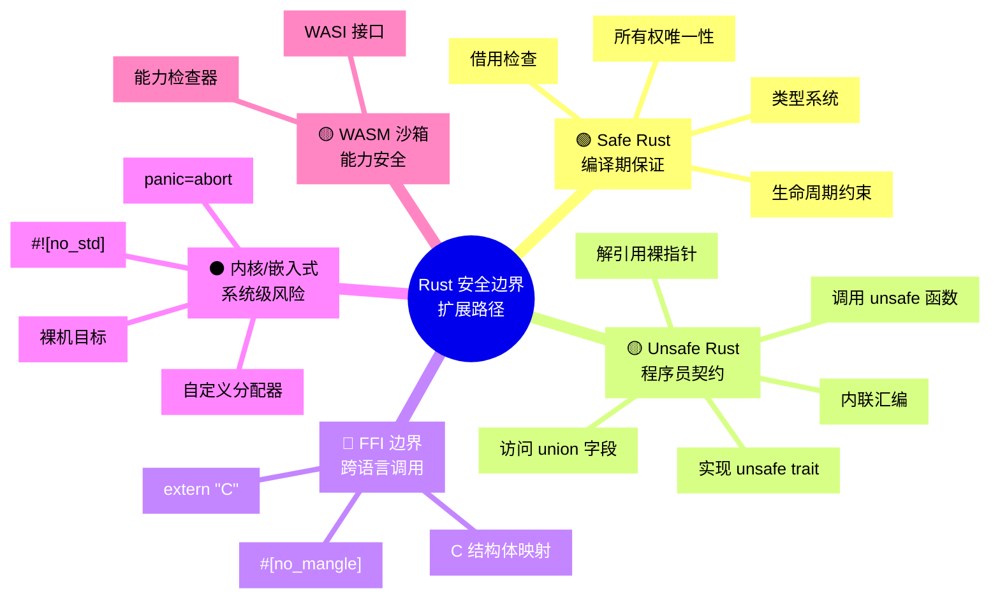
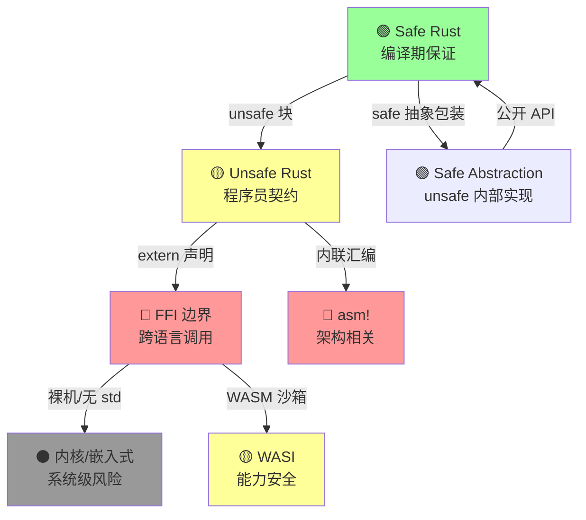
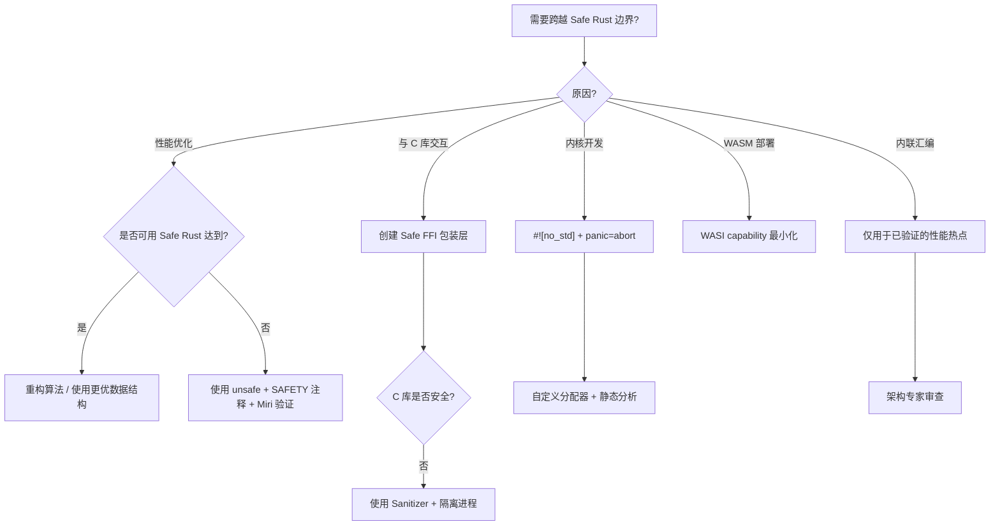

# Rust 安全边界扩展推理树

> **受众**: [专家]
> **Rust 版本**: 1.96.0+ (Edition 2024)
> **定位**: 本文件从「安全边界」核心出发，推演向更底层、更通用、更危险领域的扩展路径，标注每条扩展边的条件、风险和补偿机制。
> **原则**: 边界扩展必须是**显式的、可审计的、不可逆的**——一旦跨越边界，编译器的安全保证递减，程序员的责任递增。
> **风险色标**: 🟢 编译期保证 / 🟡 运行时检查 / 🔴 程序员责任 / ⚫ 系统级风险

> **定理链**: N/A — 描述性/综述性/导航性文档，不涉及形式化定理链
---

> **Bloom 层级**: 元（Meta）

**变更日志**:

- v1.0 (2026-05-21): 初始版本——安全边界五层扩展 + 风险矩阵 + 补偿机制

---

## 📑 目录

- [Rust 安全边界扩展推理树](#rust-安全边界扩展推理树)
  - [📑 目录](#-目录)
    - [〇、安全边界认知全景](#〇安全边界认知全景)
  - [一、边界扩展总树](#一边界扩展总树)
  - [二、逐层扩展分析](#二逐层扩展分析)
    - [2.1 L0: Safe Rust（🟢 编译期保证）](#21-l0-safe-rust-编译期保证)
    - [2.2 L1: Unsafe Rust（🟡 程序员契约）](#22-l1-unsafe-rust-程序员契约)
    - [2.3 L2: FFI 边界（🔴 跨语言调用）](#23-l2-ffi-边界-跨语言调用)
    - [2.4 L3: 内核/嵌入式（⚫ 系统级风险）](#24-l3-内核嵌入式-系统级风险)
    - [2.5 L4: WASM 沙箱（🟡 能力安全）](#25-l4-wasm-沙箱-能力安全)
  - [三、风险矩阵](#三风险矩阵)
  - [四、边界扩展决策树](#四边界扩展决策树)
  - [五、认知路径（Cognitive Path）](#五认知路径cognitive-path)
  - [五、相关概念链接](#五相关概念链接)
  - [认知路径](#认知路径)
    - [核心推理链](#核心推理链)
    - [反命题与边界](#反命题与边界)

### 〇、安全边界认知全景



> **认知功能**: 该 mindmap 将 Rust 安全边界从中心向外辐射展开，帮助读者建立「安全层级」的全局拓扑直觉。建议将其作为进入本文件前的「认知锚点」快速扫读，定位当前知识所处的安全层级。关键洞察：每层扩展都是不可逆的单向跨越——颜色编码直观呈现了编译器保证的递减梯度。[来源: 💡 原创分析]
> [来源: [Rust Reference](https://doc.rust-lang.org/reference/)]
> **认知路径**: 本 mindmap 将 Rust 安全边界从中心（Safe Rust）向外扩展，每层扩展都意味着**编译器保证递减，程序员责任递增**。颜色编码：绿色=编译器全责，黄色=程序员契约，红色=跨语言风险，黑色=系统级风险。理解这条边界扩展路径，是评估 Rust 项目安全风险的元框架。

## 一、边界扩展总树



> **认知功能**: 该流程图呈现安全边界的**有向扩展关系**，unsafe 块、`extern` 声明等作为边标签，明确标注跨越条件。建议用于理解各层级之间的因果依赖（如 FFI 是进入内核的前置条件）。关键洞察：Safe Abstraction 是唯一能「逆流」的边——它是 Rust 安全哲学的核心设计模式。[来源: 💡 原创分析]

---

## 二、逐层扩展分析
>
>

### 2.1 L0: Safe Rust（🟢 编译期保证）

> **边界特征**: 编译器提供完整保证——无 UAF、无 DF、无数据竞争、无类型错误。 [来源: Rust Reference §3, RustBelt POPL 2018]
> **程序员责任**: 仅需保证逻辑正确性，内存安全由编译器负责。
> **失效模式**: 编译器 bug（极罕见）、标准库 unsafe 内部 bug（历史上极罕见）。

### 2.2 L1: Unsafe Rust（🟡 程序员契约）

> **扩展条件**: 使用 `unsafe` 关键字标记的块、函数或 trait impl。
> **安全保证**: 编译器不再验证内存安全，程序员必须手动维护不变式。
> **核心契约**: [来源: The Rustonomicon, *What Unsafe Rust Can Do*]

| 操作 | 是否需要 unsafe | 风险等级 | 典型场景 | [来源: Rustonomicon §1.3]
|:---|:---:|:---:|:---|
| 解引用裸指针 (`*const T`, `*mut T`) | ✅ | 🔴 | 与 C 交互、自定义数据结构 |
| 调用 `unsafe` 函数 | ✅ | 🟡 | 使用 `std::ptr::read` / `write` |
| 实现 `unsafe` trait | ✅ | 🟡 | `Send` / `Sync` |
| 访问 `union` 字段 | ✅ | 🟡 | C 结构体互操作 |
| 调用内联汇编 | ✅ | 🔴 | 性能热点、硬件访问 |

**补偿机制**:

- **SAFETY 注释**: 每个 `unsafe` 块必须注释「为什么此操作是安全的」。 [来源: [RFC 2585](https://rust-lang.github.io/rfcs/2585.html), Rust Style Guide]
- **Miri 验证**: 动态检测未定义行为。
- **审计**: `cargo geiger` 统计 unsafe 代码比例。 [来源: cargo-geiger 文档]

### 2.3 L2: FFI 边界（🔴 跨语言调用）

> **扩展条件**: `extern "C"` 函数声明、`#[no_mangle]`、C 结构体映射。
> **风险**: C 代码的 UAF、DF、数据竞争可能通过 FFI 传入 Rust，破坏 Rust 的安全假设。 [来源: Rust FFI 指南, The Rustonomicon §4]

```rust,ignore
// FFI 边界示例：Rust 调用 C
extern "C" {
    fn c_function(ptr: *mut u8); // C 函数可能做任何事
}

pub fn safe_wrapper(data: &mut [u8]) {
    // 补偿：Safe Rust 包装，限制 C 的访问范围
    unsafe { c_function(data.as_mut_ptr()) }
}
```

**补偿机制**:

- **最小暴露面**: 仅通过 Safe Rust 包装函数暴露 FFI 功能。 [来源: Rust API Guidelines, *FFI Boundaries*]
- **类型隔离**: 使用 Newtype 区分 C 指针和 Rust 引用。
- **Sanitizer**: AddressSanitizer / MemorySanitizer 检测 C 端错误。

### 2.4 L3: 内核/嵌入式（⚫ 系统级风险）

> **扩展条件**: `#![no_std]`、裸机目标、`panic=abort`、自定义分配器。
> **风险**: 无 OS 保护、无虚拟内存、硬件异常直接致命。

| 特征 | 用户态 Rust | 内核态 Rust | [来源: Rust Embedded Book, Rust-for-Linux]
|:---|:---|:---|
| 标准库 | `std` 完整 | `core` + `alloc`（可选） |
| panic 处理 | unwind / abort | 必须 `panic=abort` |
| 内存分配 | 系统 malloc | 自定义分配器（或静态内存） |
| 异常处理 | OS 信号 | 硬件异常（双重故障致命） |
| 并发 | OS 线程调度 | 自旋锁 / 中断禁用 |

**补偿机制**:

- **静态分析**: `cargo-call-stack` 检测栈溢出。 [来源: Jorge Aparicio, Embedded WG]
- **形式化验证**: Kani 验证关键路径无 panic。 [来源: Kani Documentation, AWS]
- **硬件看门狗**: 外部重置机制。

### 2.5 L4: WASM 沙箱（🟡 能力安全）

> **扩展条件**: ``wasm32-wasip1` 或 `wasm32-wasip2`` target、WASI 系统调用。
> **特征**: WASM 提供内存沙箱，但 WASI capability 模型进一步限制资源访问。 [来源: WASI Specification, Bytecode Alliance]

| 能力 | 传统 WASM | WASI |
|:---|:---|:---|
| 文件系统 | 无（需宿主提供） | 显式 capability（预打开目录） |
| 网络 | 无 | 显式 capability |
| 环境变量 | 无 | 显式 capability |
| 随机数 | 无 | 显式 capability |

---

## 三、风险矩阵

| 边界层级 | 编译期保证 | 运行时检查 | 程序员责任 | 系统风险 | 补偿机制 |
|:---|:---:|:---:|:---:|:---:|:---|
| Safe Rust | 🟢 100% | — | — | — | 无（编译器负责） |
| Safe Abstraction | 🟢 对外 | — | 🟡 内部 | — | SAFETY 注释 + 测试 |
| Unsafe Rust | — | — | 🟡 100% | — | Miri + 审计 + 注释 |
| FFI | — | — | 🔴 100% | 🟡 C 侧风险 | 包装层 + Sanitizer |
| 内核/嵌入式 | — | — | 🔴 100% | ⚫ 硬件致命 | 静态分析 + 形式化验证 |
| 内联汇编 | — | — | 🔴 100% | ⚫ 架构相关 | 架构专家审查 |
| WASM/WASI | 🟡 沙箱 | 🟡 capability | 🟡 能力配置 | — | 最小 capability 原则 |

---

## 四、边界扩展决策树
>



> **认知功能**: 该决策树将抽象的边界扩展问题转化为**可操作的判断流程**，每个菱形节点对应一个工程决策点。建议在实际需要引入 unsafe/FFI/no_std 时对照使用，避免过早跨越安全边界。关键洞察：几乎所有边界扩展的第一步都是「能否用 Safe Rust 解决？」——这是 Rust 安全编程的黄金法则。[来源: 💡 原创分析]

---

## 五、认知路径（Cognitive Path）

> **从边界外向内扩展的学习路径**：理解 Rust 安全边界不是一次性掌握全部，而是逐步扩展可信赖的范围。

```text
第 1 步：Safe Rust 熟练
    └─ 目标：100% 利用编译器保证，不触碰 unsafe
    └─ 验证：能独立完成项目，不感觉表达能力受限

第 2 步：理解 unsafe 的语义
    └─ 目标：知道 unsafe 不是"关闭检查器"，而是"承担证明责任"
    └─ 验证：能阅读标准库的 SAFETY 注释并理解其不变式

第 3 步：安全抽象封装
    └─ 目标：在 unsafe 内部实现，对外提供 Safe API
    └─ 验证：编写的库用户无需 unsafe 即可使用全部功能

第 4 步：FFI 交互
    └─ 目标：与 C 库安全交互，最小化 unsafe 暴露面
    └─ 验证：FFI 调用被 Safe 包装函数完全封装

第 5 步：内核/嵌入式（可选）
    └─ 目标：在 #![no_std] 环境下编程
    └─ 验证：理解 panic=abort 和自定义分配器的含义

第 6 步：形式化验证（可选）
    └─ 目标：用 Kani/Creusot 验证关键 unsafe 代码
    └─ 验证：关键路径有形式化规约和证明
```

> **思维表征说明**:
> 认知路径是**纵向递进的学习阶梯**——与 `graph TD` 流程图（展示知识结构）和 `stateDiagram`（展示状态约束）都不同，认知路径回答「**学习者应该以什么顺序掌握这些概念**」。
> 每一步有明确的目标和验证标准，帮助学习者自我评估当前位置。
> 此路径遵循「从安全到危险、从编译器保证到人工证明、从应用到形式化」的渐进原则。
> [来源: 认知负荷理论 — Sweller (1988); Bloom  taxonomy]

## 五、相关概念链接

- [跨层依赖拓扑](inter_layer_topology.md)
- [层次内模型映射](intra_layer_model_map.md)
- [定理推理森林](theorem_inference_forest.md)
- [L3 Unsafe](../03_advanced/03_unsafe.md)
- [L4 RustBelt](../04_formal/04_rustbelt.md)
- [L6 WASI](../06_ecosystem/08_wasi.md)

---

> **文档版本**: 1.0
> **最后更新: 2026-05-21
> **状态**: ✅ 边界扩展推理树 v1.0

## 认知路径

> **认知路径**: 本文件作为 Rust 分层知识体系的 **Rust 安全边界扩展推理树** 元层导航节点，连接概念定义、学习路径与质量评估框架。

### 核心推理链

| 定理 | 前提 | 结论 | 置信度 |
|:---|:---|:---|:---|
| Boundary Extension Tree 结构化定义 ⟹ 学习者认知锚点可建立 | 本文件定义了元层结构 | 支持上层概念定位 | 高 |

> **过渡**: 利用本文件的导航结构，读者可以从当前位置快速跃迁到任意概念层级，实现非线性学习。
> **过渡**: Rust 安全边界扩展推理树 的维护需要与概念内容同步更新，确保元数据与实际知识体系的一致性。
> **过渡**: 将 Rust 安全边界扩展推理树 作为学习起点或复习锚点，有助于建立全局视野，避免陷入局部细节而忽视整体架构。

### 反命题与边界

> **反命题**: "元层文档可以替代具体概念学习" —— 错误。Rust 安全边界扩展推理树 提供的是导航与评估框架，不能替代对核心概念（L1-L5）的深入理解与实践。
