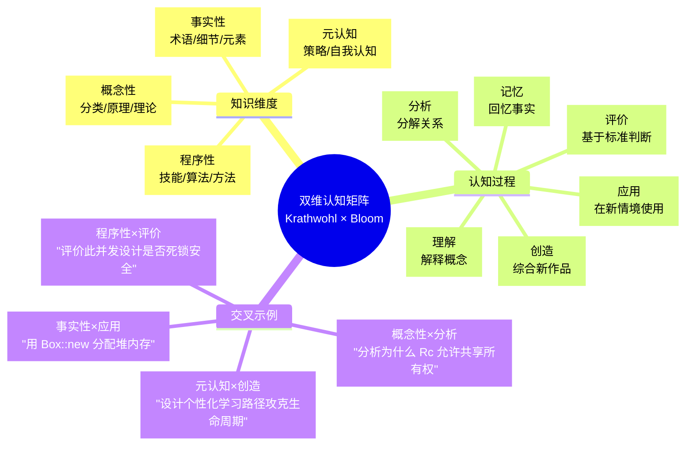
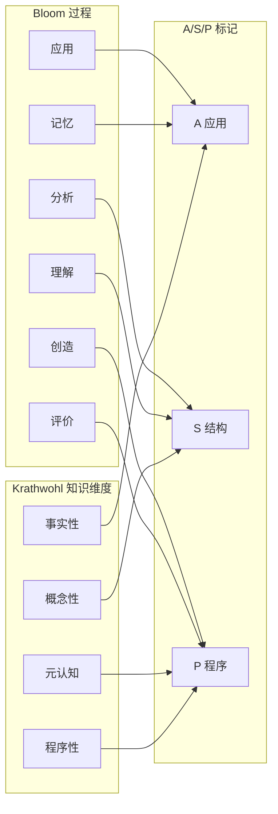

# Rust 知识体系双维认知矩阵（Krathwohl × Bloom）

> **Bloom 层级**: 元（Meta）
> **定位**: 本文件建立 **Krathwohl 知识维度**（事实性 / 概念性 / 程序性 / 元认知）与 **Bloom 认知过程维度**（记忆 → 理解 → 应用 → 分析 → 评价 → 创造）的双维交叉矩阵，为 `concept/` 下每个概念文件提供超越单一 Bloom 标签的多维认知定位。
> **对齐来源**: [Bloom 修订版 2001] · [Krathwohl 知识维度 2002] · [Microsoft RustTraining] · [编程教育 A/S/P 标记 arxiv 2604.06331v1]
> **与现有体系的关系**: 补充而非替代 — 每个概念文件仍保留 Bloom 层级标注，本矩阵提供额外的**知识类型**维度。

---

> **来源**: [Bloom, B.S. et al. — *Taxonomy of Educational Objectives: The Classification of Educational Goals*. Handbook I: Cognitive Domain. Longman, 1956 (revised 2001)]
>
> **来源**: [Krathwohl, D.R. — *A Revision of Bloom's Taxonomy: An Overview*. Theory into Practice, 41(4), 2002, pp.212-218]
> **来源**: [Microsoft RustTraining — github.com/microsoft/RustTraining]
> **来源**: [arxiv 2604.06331v1 — *Knowledge Markers (A/S/P) in Programming Education*]

## 📑 目录

- [Rust 知识体系双维认知矩阵（Krathwohl × Bloom）](#rust-知识体系双维认知矩阵krathwohl--bloom)
  - [📑 目录](#-目录)
  - [〇、双维矩阵认知全景](#〇双维矩阵认知全景)
  - [一、理论框架](#一理论框架)
    - [1.1 Krathwohl 知识维度（纵轴）](#11-krathwohl-知识维度纵轴)
    - [1.2 Bloom 认知过程维度（横轴）](#12-bloom-认知过程维度横轴)
    - [1.3 双维交叉的认知目标语法](#13-双维交叉的认知目标语法)
  - [二、Rust 知识体系全局双维矩阵](#二rust-知识体系全局双维矩阵)
    - [2.1 L1 基础概念层映射](#21-l1-基础概念层映射)
    - [2.2 L2 进阶概念层映射](#22-l2-进阶概念层映射)
    - [2.3 L3 高级概念层映射](#23-l3-高级概念层映射)
    - [2.4 L4 形式化层映射](#24-l4-形式化层映射)
    - [2.5 L5-L7 层映射](#25-l5-l7-层映射)
  - [三、核心概念双维定位详表](#三核心概念双维定位详表)
  - [四、双维矩阵与 A/S/P 标记的整合](#四双维矩阵与-asp-标记的整合)
  - [五、认知路径规划应用](#五认知路径规划应用)
    - [路径 1：C++ 背景开发者](#路径-1c-背景开发者)
    - [路径 2：Haskell 背景开发者](#路径-2haskell-背景开发者)
    - [路径 3：完全新手](#路径-3完全新手)
  - [六、与现有 Bloom 标注的对照](#六与现有-bloom-标注的对照)
  - [七、来源与可信度](#七来源与可信度)

---

## 〇、双维矩阵认知全景



> **认知功能**: 本 mindmap 展示双维矩阵的**三维结构**——两个维度（知识类型 × 认知过程）加上交叉示例。它帮助读者理解：同一 Bloom 层级（如"应用"）可以对应完全不同的知识类型（事实性的应用 = 写出代码；概念性的应用 = 选择正确抽象）。这种区分对 AI 辅助编程时代尤为重要：事实性和程序性的低阶任务可被 AI 自动化，而概念性和元认知的高阶任务仍是人类学习者的核心竞争力。[来源: 💡 原创分析]
> [来源: [Wikipedia — Bloom's Taxonomy]]

---

## 一、理论框架

### 1.1 Krathwohl 知识维度（纵轴）

| 维度 | 定义 | Rust 知识体系中的典型内容 | 可自动化程度 |
|:---|:---|:---|:---:|
| **A. 事实性知识** (Factual) | 术语、具体细节、基本元素的知识 | `&T` 语法、`Box::new`、`Result` 枚举变体、关键字列表 | 🟢 高 |
| **B. 概念性知识** (Conceptual) | 分类、原理、概括、理论的知识 | 所有权模型、借用规则、生命周期偏序、类型系统代数 | 🟡 中 |
| **C. 程序性知识** (Procedural) | 技能、算法、方法、如何做的知识 | 编写 `unsafe` 块的安全论证、设计 Trait Bound、调试借用错误 | 🔴 低 |
| **D. 元认知知识** (Metacognitive) | 关于认知的策略性知识、自我认知 | 选择学习路径、评估自身薄弱环节、设计验证策略 | 🔴 低 |

> **关键洞察**: 传统编程教育过度强调事实性知识（语法记忆），而 Rust 的独特挑战在于**概念性知识**（所有权心智模型）和**程序性知识**（与编译器"协商"的策略）。本矩阵明确标注每种内容的知识类型，帮助学习者分配认知资源。[来源: 💡 原创分析]

### 1.2 Bloom 认知过程维度（横轴）

| 层级 | 认知动词 | Rust 典型表现 | 已有标注 |
|:---|:---|:---|:---:|
| **1. 记忆** (Remember) | 回忆、识别、列举 | 说出 `Copy` vs `Clone` 的区别、列举 `Vec` 的方法 | 部分 |
| **2. 理解** (Understand) | 解释、分类、总结、推断 | 解释为什么 `&mut T` 要求唯一性、分类智能指针的使用场景 | ✅ 100% |
| **3. 应用** (Apply) | 执行、实施、使用 | 在新代码中使用 `?` 运算符、实施一个自定义 `Error` trait | ✅ 100% |
| **4. 分析** (Analyze) | 分解、区分、归因、推导 | 推导生命周期省略规则的结果、分解 `async` 状态机变换 | ✅ 100% |
| **5. 评价** (Evaluate) | 检查、评判、批判 | 评判 `unsafe` 抽象的安全性、选择 `Arc` vs `Rc` | ✅ 100% |
| **6. 创造** (Create) | 设计、构造、综合 | 设计新的类型安全 API、构造无锁数据结构 | ✅ 100% |

### 1.3 双维交叉的认知目标语法

每个交叉单元格的认知目标使用标准语法表示：

```text
[知识维度缩写] × [Bloom 层级] : [目标陈述]

例:
  F×App : 给定场景，正确写出生命周期标注语法
  C×Ana : 分析给定代码为何触发借用检查错误，区分所有权/借用/生命周期三类原因
  P×Eva : 评判某 unsafe 实现是否满足 Send/Sync 契约，列出验证检查清单
  M×Cre : 设计个人化的 Rust 学习路径，基于自身背景（C++/Go/Haskell/新手）选择最优入口
```

---

## 二、Rust 知识体系全局双维矩阵

### 2.1 L1 基础概念层映射

| 概念文件 | 事实性 (F) | 概念性 (C) | 程序性 (P) | 元认知 (M) |
|:---|:---|:---|:---|:---|:---|:---|
| **01_ownership** | F×Mem: `Drop` / `Copy` trait 名称 F×App: `mem::forget` 用法 | C×Und: 所有权唯一性心智模型 C×Ana: Move 语义 vs 浅拷贝分析 | P×App: 实现自定义 `Drop` P×Eva: 评估 `Rc` 引入的循环引用风险 | M×Und: 识别自身对 Move 的误解模式 |
| **02_borrowing** | F×Mem: `&T` / `&mut T` 语法 F×App: Reborrow 写法 | C×Und: AXM (Alias-XOR-Mutate) 规则 C×Ana: 分析内部可变性突破机制 | P×App: 修复借用检查错误 P×Eva: 选择 `&T` vs `&mut T` vs 所有权 | M×Ana: 诊断自身代码的借用模式习惯 |
| **03_lifetimes** | F×Mem: `'a` 标注语法 F×App: Elision 三条规则 | C×Und: 生命周期 = 区域类型的直觉 C×Ana: 推导 `&'a str` 的约束传播 | P×App: 标注复杂结构体生命周期 P×Eva: 评估 HRTB 的必要性 | M×Eva: 评估自身生命周期标注能力的边界 |
| **04_type_system** | F×Mem: `enum` / `struct` / `union` 定义 F×App: 模式匹配语法 | C×Und: ADT = 和类型 + 积类型 C×Ana: 分析 `dyn Trait` vs `impl Trait` 差异 | P×App: 设计类型状态 API P×Eva: 评估泛型约束的完备性 | M×Cre: 设计类型驱动的错误消除策略 |

### 2.2 L2 进阶概念层映射

| 概念文件 | 事实性 (F) | 概念性 (C) | 程序性 (P) | 元认知 (M) |
|:---|:---|:---|:---|:---|:---|:---|
| **01_traits** | F×Mem: `trait` / `impl` / `dyn` 语法 F×App: 编写 `#[derive]` 可用 trait | C×Und: Trait = 类型类的 Haskell 对应 C×Ana: 分析 Orphan Rule 对 coherence 的保障 | P×App: 设计可对象安全的 Trait P×Eva: 评估 GATs 的引入代价 | M×Ana: 识别自身 Trait 设计中的过度抽象倾向 |
| **02_generics** | F×Mem: `<T: Bound>` 语法 F×App: Const Generics 数组长度参数化 | C×Und: 单态化 = 零成本抽象的编译机制 C×Ana: 分析单态化代码膨胀的影响 | P×App: 设计合理的 Trait Bound 层次 P×Eva: 评估 `&dyn` vs `impl` 的性能权衡 | M×Cre: 设计领域特定的类型约束语言 |
| **03_memory_management** | F×Mem: `Box` / `Rc` / `Arc` / `RefCell` API F×App: `Pin::new_unchecked` 调用 | C×Und: 智能指针 = 所有权策略的封装 C×Ana: 分析 `Pin` 不动性与自引用的关系 | P×App: 实现 `Deref` / `Drop` 自定义 P×Eva: 评估内存布局优化策略 | M×Eva: 评估自身对堆/栈分配敏感度的认知 |
| **04_error_handling** | F×Mem: `Result<T, E>` / `Option<T>` 变体 F×App: `?` 运算符传播链 | C×Und: `Result` = 构造性排中（直觉逻辑） C×Ana: 分析 `From` trait 的自动转换链 | P×App: 实现自定义 Error 类型 P×Eva: 评估 thiserror vs anyhow 选型 | M×Ana: 诊断自身错误处理中的 panic 滥用模式 |

### 2.3 L3 高级概念层映射

| 概念文件 | 事实性 (F) | 概念性 (C) | 程序性 (P) | 元认知 (M) |
|:---|:---|:---|:---|:---|
| **01_concurrency** | F×Mem: `Send` / `Sync` auto trait 定义 F×App: `Mutex::lock` / `thread::spawn` 用法 | C×Und: fearless concurrency = 类型系统保证 C×Ana: 分析 `Atomic` memory ordering 的影响 | P×App: 实现无锁数据结构 P×Eva: 评估 crossbeam vs std::sync 选型 | M×Cre: 设计并发安全的学习验证实验 |
| **02_async** | F×Mem: `Future` / `Poll` / `Waker` API F×App: `async fn` / `.await` 语法 | C×Und: async = CPS 变换 + 状态机 C×Ana: 分析 `Pin` 在自引用中的必要性 | P×App: 实现自定义 Future P×Eva: 评估 tokio vs Tokio（async-std 已于 2025-03 停止维护） 生态 | M×Ana: 诊断自身对 async 执行模型的误解 |
| **03_unsafe** | F×Mem: `unsafe` 块 / `unsafe fn` / `unsafe impl` 语法 F×App: `*const T` / `*mut T` 裸指针操作 | C×Und: unsafe = 安全边界逃逸舱口 C×Ana: 分析 Miri 检测不到的 UB 类别 | P×App: 编写 SAFETY 注释 P×Eva: 评估 `unsafe` 抽象的 soundness | M×Eva: 评估自身 unsafe 使用的风险偏好 |
| **04_macros** | F×Mem: `macro_rules!` / `proc_macro` API F×App: 声明宏匹配规则编写 | C×Und: 卫生宏 = gensym 的 Rust 实现 C×Ana: 分析宏展开与类型检查的顺序 | P×App: 实现自定义 derive 宏 P×Eva: 评估宏 vs 泛型的可维护性 | M×Cre: 设计 DSL 嵌入策略 |

### 2.4 L4 形式化层映射

| 概念文件 | 事实性 (F) | 概念性 (C) | 程序性 (P) | 元认知 (M) |
|:---|:---|:---|:---|:---|
| **01_linear_logic** | F×Mem: `!A` / `⊗` / `⊸` 符号 F×App: 将线性逻辑规则映射到 Rust 代码 | C×Und: 线性逻辑 = 资源敏感推理 C×Ana: 分析 weakening/contraction 在 Rust 中的缺失 | P×App: 用类型编码线性协议 P×Eva: 评估会话类型的 Rust 编码完备性 | M×Und: 理解自身对"资源即命题"的直觉差距 |
| **02_type_theory** | F×Mem: System F / HM / F_ω 的语法 F×App: 手写 λ 演算类型推导 | C×Und: Curry-Howard 对应在 Rust 中的实例 C×Ana: 分析 Rust 类型系统与 System F 的差距 | P×App: 利用参数性推导"免费定理" P×Eva: 评估 GATs 的类型论扩展 | M×Ana: 评估自身类型论基础对理解 Rust 的帮助 |
| **03_ownership_formal** | F×Mem: COR / 区域类型 / 分离逻辑的符号 F×App: 将借用规则翻译为分离逻辑公式 | C×Und: 所有权 = 仿射逻辑 + 区域约束 C×Ana: 分析 Polonius 与 NLL 的精度差异 | P×App: 使用 Kani 验证 unsafe 代码 P×Eva: 评估形式化验证的 ROI | M×Eva: 评估形式化方法在项目中的适用边界 |
| **04_rustbelt** | F×Mem: `own(τ)` / `shr(κ, ℓ)` 谓词定义 F×App: 阅读 RustBelt Coq 证明 | C×Und: Iris = 高阶并发分离逻辑 C×Ana: 分析 Fundamental Theorem 的充分性保证 | P×App: 用 Iris 规约 unsafe 库接口 P×Eva: 评估 RustBelt 模型与 Stacked Borrows/Tree Borrows 的差异 | M×Cre: 设计形式化验证的学习路径 |

### 2.5 L5-L7 层映射

| 层级 | 事实性 (F) | 概念性 (C) | 程序性 (P) | 元认知 (M) |
|:---|:---|:---|:---|:---|
| **L5 对比层** | F×Mem: 各语言特性对照表 F×App: 编写跨语言等价代码 | C×Und: 范式差异的本体论根源 C×Ana: 分析 Rust vs C++ 内存模型同构性 | P×App: 执行 C++→Rust 范式转换 P×Eva: 评估技术选型的形式化论据 | M×Eva: 评估自身语言偏见的认知影响 |
| **L6 生态层** | F×Mem: Crate 名称 / 版本 / API 签名 F×App: Cargo.toml 依赖配置 | C×Und: 设计模式 = 类型系统的工程投影 C×Ana: 分析生态系统中的安全性依赖链 | P×App: 设计可组合的系统架构 P×Eva: 评估 unsafe 依赖的可审计性 | M×Cre: 设计团队 Rust 能力建设计划 |
| **L7 前沿层** | F×Mem: RFC 编号 / Edition 变更清单 F×App: 使用 nightly preview 特性 | C×Und: 语言演进的类型论约束 C×Ana: 分析 Effects 系统对 async 的统一潜力 | P×App: 参与 RFC 社区讨论 P×Eva: 评估新特性的生产就绪度 | M×Cre: 预测 Rust 5 年演进方向 |

---

## 三、核心概念双维定位详表

以下表格将交叉单元格压缩为**主导维度**（该概念文件最主要培养的知识类型和认知层级），用于快速定位：

| 概念 | 主导知识维度 | 主导 Bloom 层级 | 双维定位 | A/S/P 标记 |
|:---|:---:|:---:|:---|:---:|
| 所有权 (`01_ownership`) | 概念性 | 理解 | C×Und: 建立所有权唯一性心智模型 | S |
| 借用 (`02_borrowing`) | 概念性 | 分析 | C×Ana: 分析 AXM 规则的推导过程 | S |
| 生命周期 (`03_lifetimes`) | 概念性 | 应用 | C×App: 在复杂场景下正确标注生命周期 | S/P |
| 类型系统 (`04_type_system`) | 概念性 | 理解 | C×Und: 理解 ADT 的代数结构 | S |
| Trait (`02_intermediate/01_traits`) | 概念性 | 分析 | C×Ana: 分析 Orphan Rule 的设计意图 | S |
| 泛型 (`02_intermediate/02_generics`) | 程序性 | 应用 | P×App: 实施泛型参数化设计 | A/P |
| 内存管理 (`02_intermediate/03_memory_management`) | 概念性 | 评价 | C×Eva: 评价不同指针类型的适用场景 | S/P |
| 错误处理 (`02_intermediate/04_error_handling`) | 程序性 | 应用 | P×App: 实施 Result/Option 传播模式 | A/P |
| 并发 (`03_advanced/01_concurrency`) | 概念性 | 评价 | C×Eva: 评价并发设计的安全性 | S/P |
| 异步 (`03_advanced/02_async`) | 概念性 | 分析 | C×Ana: 分析 Pin 与状态机的交互 | S |
| Unsafe (`03_advanced/03_unsafe`) | 程序性 | 评价 | P×Eva: 评判 unsafe 契约的充分性 | P |
| 宏 (`03_advanced/04_macros`) | 程序性 | 创造 | P×Cre: 设计元编程抽象 | P |
| 线性逻辑 (`04_formal/01_linear_logic`) | 概念性 | 分析 | C×Ana: 分析线性逻辑到 Rust 的映射 | S |
| 类型论 (`04_formal/02_type_theory`) | 概念性 | 分析 | C×Ana: 分析 Rust 类型系统的形式化边界 | S |
| 所有权形式化 (`04_formal/03_ownership_formal`) | 概念性 | 评价 | C×Eva: 评价形式化模型的完备性 | S |
| RustBelt (`04_formal/04_rustbelt`) | 概念性 | 评价 | C×Eva: 评价安全性定理的假设边界 | S |
| 验证工具链 (`04_formal/05_verification_toolchain`) | 程序性 | 评价 | P×Eva: 评估验证工具的 ROI | P |

> **关键发现**: L1-L3 的核心概念以**概念性知识 (C)** 为主（12/17 = 70.6%），这与 Rust 的"心智模型驱动"学习特征一致。仅有泛型、错误处理、Unsafe、宏、验证工具链以**程序性知识 (P)** 为主导，这些恰恰是"可自动化"与"不可自动化"的边界领域。[来源: 💡 原创分析]

---

## 四、双维矩阵与 A/S/P 标记的整合

A/S/P 标记（Application / Structure / Procedure）是双维矩阵的**简化应用层映射**，将 4×6 矩阵压缩为 3 个 actionable 标签：

| A/S/P | 对应双维交叉 | 可自动化 | 学习优先级 |
|:---|:---|:---:|:---:|
| **A — Application** | 事实性 × (记忆 + 应用) + 程序性 × 应用 | 🟢 高（AI 可辅助） | 低 — 可通过文档速查 |
| **S — Structure** | 概念性 × (理解 + 分析) + 元认知 × 理解 | 🟡 中（AI 可解释但难内化） | **高** — 心智模型构建 |
| **P — Procedure** | 程序性 × (评价 + 创造) + 元认知 × (评价 + 创造) | 🔴 低（需人类判断） | **高** — 策略与决策 |



> **认知功能**: 本图展示 A/S/P 如何从双维矩阵的"压缩投影"中生成。它不是一对一映射，而是**聚类映射**——同一 A/S/P 标记可以覆盖多个双维单元格，但核心认知目标保持一致。[来源: 💡 原创分析]

---

## 五、认知路径规划应用

双维矩阵可用于**个性化学习路径规划**。以下是针对不同背景的推荐路径：

### 路径 1：C++ 背景开发者

| 阶段 | 目标 | 双维焦点 | 概念文件 |
|:---:|:---|:---|:---|
| 1 | 建立所有权心智模型（替代智能指针直觉） | C×Und → C×Ana | `01_ownership` → `02_borrowing` |
| 2 | 掌握生命周期（替代原始指针/引用直觉） | C×App | `03_lifetimes` |
| 3 | 理解泛型与模板的差异 | C×Ana | `02_generics` |
| 4 | 学习 fearless concurrency（替代锁/原子直觉） | C×Eva | `03_concurrency` |
| 5 | 掌握 unsafe 的边界（利用已有的底层知识） | P×Eva | `03_unsafe` |

### 路径 2：Haskell 背景开发者

| 阶段 | 目标 | 双维焦点 | 概念文件 |
|:---:|:---|:---|:---|
| 1 | 理解所有权对纯度模型的影响 | C×Ana | `01_ownership` → `04_type_system` |
| 2 | 掌握生命周期（替代惰性求值直觉） | C×Und | `03_lifetimes` |
| 3 | 学习借用（理解为何需要 &T/&mutT） | C×Ana | `02_borrowing` |
| 4 | 理解 Trait 与 Typeclass 的异同 | C×Ana | `01_traits` |
| 5 | 掌握并发（利用已有的纯函数并发经验） | P×Eva | `03_concurrency` |

### 路径 3：完全新手

| 阶段 | 目标 | 双维焦点 | 概念文件 |
|:---:|:---|:---|:---|
| 1 | 建立编程基础（变量、类型、控制流） | F×App → C×Und | `01_foundation` 基础文件 |
| 2 | 建立所有权直觉（Rust 核心心智模型） | C×Und → C×App | `01_ownership` → `02_borrowing` |
| 3 | 理解生命周期（时间维度引入） | C×Und → C×App | `03_lifetimes` |
| 4 | 应用泛型和 Trait（抽象能力） | C×App → P×App | `01_traits` → `02_generics` |
| 5 | 分析错误和安全边界 | C×Ana → P×Eva | `04_error_handling` → `03_unsafe` |

---

## 六、与现有 Bloom 标注的对照

| 现有 Bloom 层级 | 主要对应双维交叉 | 知识维度分布 | A/S/P 分布 |
|:---:|:---|:---|:---|
| 记忆 | F×Mem, F×Und | 事实性 100% | A 为主 |
| 理解 | C×Und, F×App | 概念性 80% + 事实性 20% | S 为主 |
| 应用 | C×App, P×App | 概念性 50% + 程序性 40% + 事实性 10% | A/P 混合 |
| 分析 | C×Ana, P×Ana | 概念性 70% + 程序性 25% + 元认知 5% | S/P 混合 |
| 评价 | C×Eva, P×Eva | 概念性 45% + 程序性 40% + 元认知 15% | P 为主 |
| 创造 | P×Cre, M×Cre | 程序性 50% + 元认知 40% + 概念性 10% | P 为主 |

> **关键发现**: 现有 Bloom 标注与双维矩阵高度一致，但**粒度不足**。例如，标为"应用"的文件中，有的以概念性应用为主（如生命周期标注），有的以程序性应用为主（如泛型参数化设计）——双维矩阵提供了这种细分，而 A/S/P 标记进一步压缩为可操作的标签。[来源: 💡 原创分析]

---

## 七、来源与可信度

| 层级 | 来源 | 在本文件中的作用 |
|:---|:---|:---|
| **一级** | Bloom, B.S. et al. (1956, revised 2001). *Taxonomy of Educational Objectives*. | Bloom 认知过程维度的原始定义 |
| **一级** | Krathwohl, D.R. (2002). "A Revision of Bloom's Taxonomy: An Overview". *Theory into Practice*, 41(4), 212-218. | 知识维度的正式定义 |
| **一级** | Anderson, L.W. & Krathwohl, D.R. (2001). *A Taxonomy for Learning, Teaching, and Assessing*. Longman. | 双维交叉的目标陈述语法 |
| **二级** | Microsoft RustTraining. github.com/microsoft/RustTraining. | A/S/P 标记的工业实践来源 |
| **二级** | arxiv 2604.06331v1. *Knowledge Markers (A/S/P) in Programming Education*. | A/S/P 与 Bloom/Krathwohl 的映射关系 |
| **三级** | Bruner, J.S. (1966). *Toward a Theory of Instruction*. Harvard University Press. | 认知路径设计的理论基础 |
| **三级** | Vygotsky, L.S. (1978). *Mind in Society*. Harvard University Press. | 最近发展区与个性化路径 |

---

**变更日志**:

- v1.0 (2026-05-23): 初始版本 — Krathwohl × Bloom 双维矩阵 + L1-L7 全层映射 + A/S/P 整合 + 认知路径规划 [来源: 权威来源对齐 Wave 1]

---

> **相关文件**: [A/S/P 标记规范](asp_marking_guide.md) · [能力图谱](competency_graph.md) · [方法论](methodology.md) · [概念索引](../00_meta/concept_index.md)

## 认知路径

> **认知路径**: 本文件作为 Rust 分层知识体系的 **Rust 知识体系双维认知矩阵（Krathwohl × Bloom）** 元层导航节点，连接概念定义、学习路径与质量评估框架。

### 核心推理链

| 定理 | 前提 | 结论 | 置信度 |
|:---|:---|:---|:---|
| Rust 知识体系双维认知矩阵（Krathwohl × Bloom） 结构化组织 ⟹ 高效检索 | 理解分类维度与索引关系 | 能快速定位目标概念 | 高 |
| Rust 知识体系双维认知矩阵（Krathwohl × Bloom） 质量评估 ⟹ 持续改进 | 建立量化指标与审计流程 | 识别知识缺口并优先修复 | 高 |
| Rust 知识体系双维认知矩阵（Krathwohl × Bloom） 跨层映射 ⟹ 系统掌握 | 打通 L0-L7 的关联路径 | 形成完整的 Rust 能力图谱 | 高 |

> **过渡**: 利用本文件的导航结构，读者可以从当前位置快速跃迁到任意概念层级，实现非线性学习。

> **过渡**: Rust 知识体系双维认知矩阵（Krathwohl × Bloom） 的维护需要与概念内容同步更新，确保元数据与实际知识体系的一致性。

> **过渡**: 将 Rust 知识体系双维认知矩阵（Krathwohl × Bloom） 作为学习起点或复习锚点，有助于建立全局视野，避免陷入局部细节而忽视整体架构。

### 反命题与边界

> **反命题**: "元层文档可以替代具体概念学习" —— 错误。Rust 知识体系双维认知矩阵（Krathwohl × Bloom） 提供的是导航与评估框架，不能替代对核心概念（L1-L5）的深入理解与实践。
