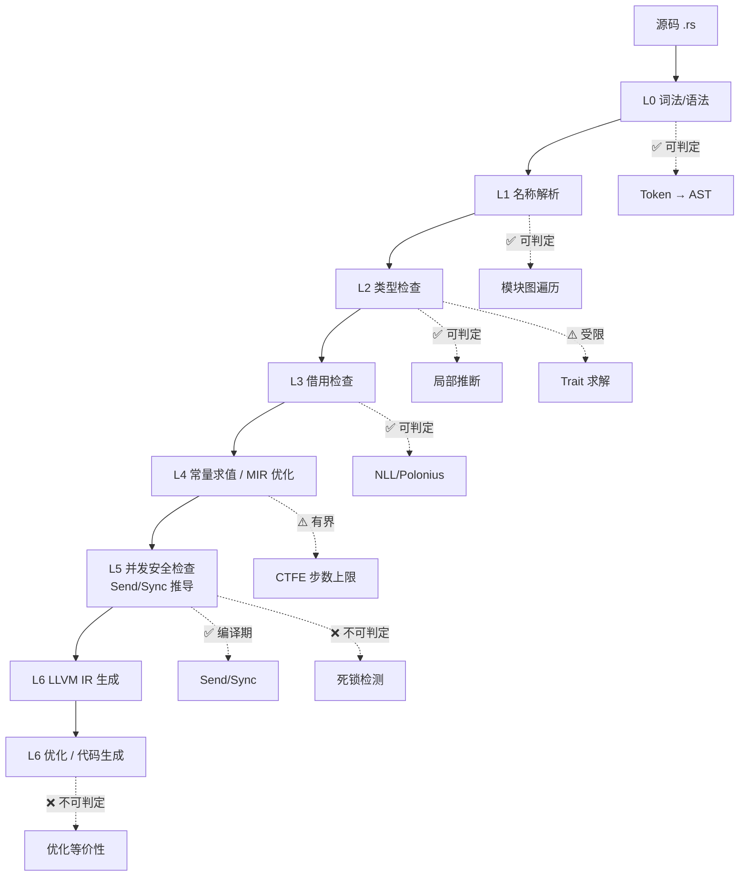
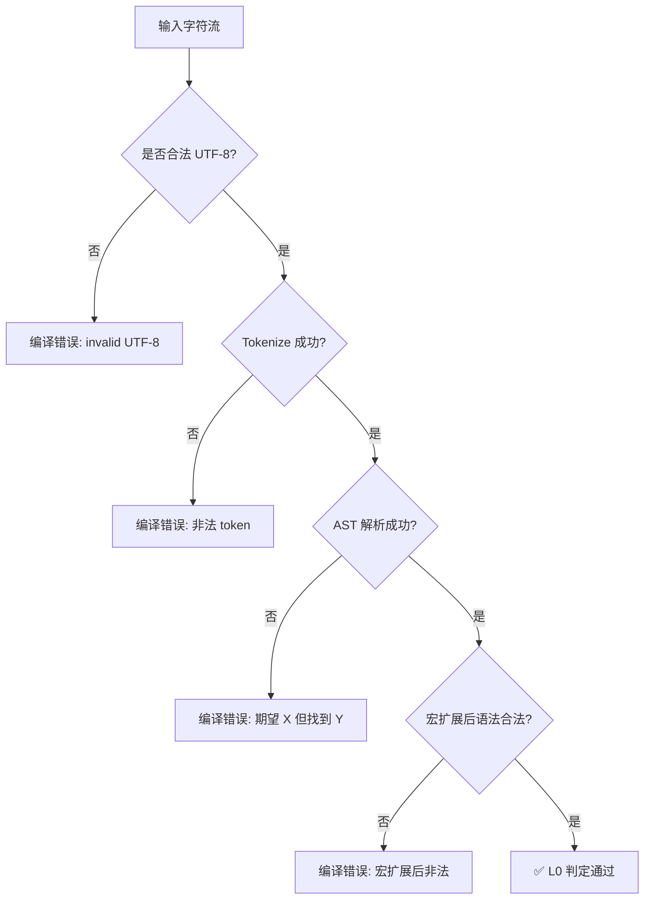
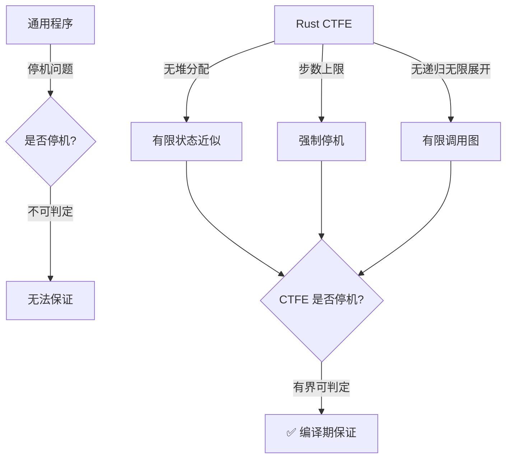
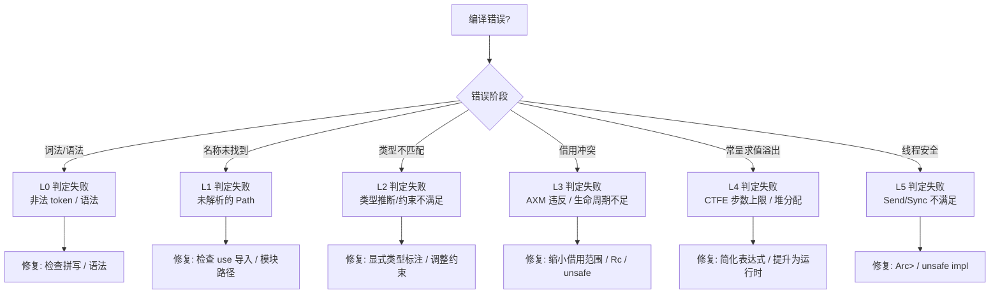
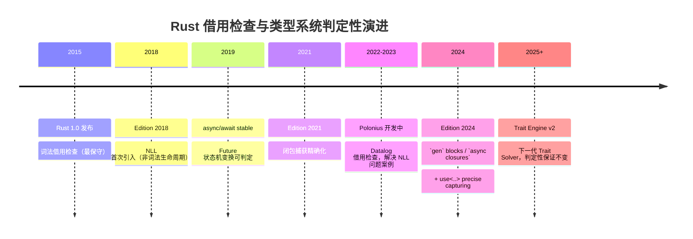
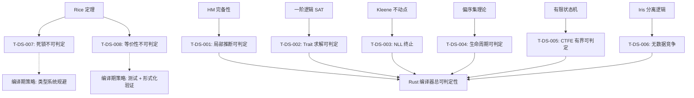

# Rust 编译期可判定性谱系全景（Decidability Spectrum）

> **定位**: 本文件从**纵向判定链路**梳理 Rust 编译器在全编译流程中的可判定性问题，与 `semantic_expressiveness.md` 的横向七维光谱形成正交互补。
> **原则**: 不做"编译器实现手册"，聚焦"什么问题 Rust 编译器能在编译期判定、什么不能、不能时的补偿机制是什么"。
> **对齐来源**: [Rust Reference] · [Rust RFCs] · [RustBelt/Oxide] · [POPL 类型论文] · [计算理论]
> **基准版本**: Rust 1.95.0 stable (Edition 2024)

---

> **Bloom 层级**: 分析 → 评价 → 创造

**变更日志**:

- v1.0 (2026-05-21): 初始版本——全链路可判定性谱系 + 9 层判定边界 + Rice 定理映射 + Rust 1.95 特性判定映射

---

## 📑 目录
>
> [来源: [Rust Reference](https://doc.rust-lang.org/reference/)]

- [Rust 编译期可判定性谱系全景（Decidability Spectrum）](#rust-编译期可判定性谱系全景decidability-spectrum)
  - [📑 目录](#-目录)
  - [零、TL;DR —— 可判定性速查](#零tldr--可判定性速查)
  - [一、权威来源与梳理方法论](#一权威来源与梳理方法论)
    - [1.1 来源分级](#11-来源分级)
    - [1.2 可判定性的形式化定义](#12-可判定性的形式化定义)
    - [1.3 谱系层级与 Rust 编译管道映射](#13-谱系层级与-rust-编译管道映射)
  - [二、可判定性谱系总览](#二可判定性谱系总览)
    - [2.1 谱系全景图](#21-谱系全景图)
    - [2.2 判定边界色标矩阵](#22-判定边界色标矩阵)
  - [三、L0 词法与语法层](#三l0-词法与语法层)
  - [四、L1 名称解析层](#四l1-名称解析层)
  - [五、L2 类型系统层](#五l2-类型系统层)
    - [5.1 局部类型推断](#51-局部类型推断)
    - [5.2 Trait 约束求解](#52-trait-约束求解)
    - [5.3 类型等价与一致性](#53-类型等价与一致性)
  - [六、L3 借用检查与生命周期层](#六l3-借用检查与生命周期层)
    - [6.1 借用检查：NLL 与 Polonius](#61-借用检查nll-与-polonius)
    - [6.2 生命周期约束可满足性](#62-生命周期约束可满足性)
  - [七、L4 常量求值层（CTFE）](#七l4-常量求值层ctfe)
  - [八、L5 并发安全层](#八l5-并发安全层)
    - [8.1 数据竞争的编译期排除](#81-数据竞争的编译期排除)
    - [8.2 死锁与活锁：不可判定性](#82-死锁与活锁不可判定性)
  - [九、L6 代码生成与优化层](#九l6-代码生成与优化层)
  - [十、不可判定性边界：Rice 定理与停机问题](#十不可判定性边界rice-定理与停机问题)
    - [10.1 Rice 定理在 Rust 中的映射](#101-rice-定理在-rust-中的映射)
    - [10.2 停机问题与 CTFE 的边界](#102-停机问题与-ctfe-的边界)
  - [十一、Rust 1.95 特性的可判定性映射](#十一rust-195-特性的可判定性映射)
  - [十二、可判定性–表达力权衡矩阵](#十二可判定性表达力权衡矩阵)
  - [十三、思维表征体系](#十三思维表征体系)
    - [13.1 判定路径决策树](#131-判定路径决策树)
    - [13.2 谱系演化时间线](#132-谱系演化时间线)
  - [十四、定理推理链](#十四定理推理链)
    - [定理一致性矩阵（可判定性谱系专集）](#定理一致性矩阵可判定性谱系专集)
    - [推理链图谱](#推理链图谱)
  - [十五、相关概念链接（L0-L7 映射）](#十五相关概念链接l0-l7-映射)
    - [L0-L7 纵向映射](#l0-l7-纵向映射)
    - [相关概念文件](#相关概念文件)

---

## 零、TL;DR —— 可判定性速查
>
> [来源: [Rust Reference](https://doc.rust-lang.org/reference/)]

```text
层级                判定问题                          可判定性    核心机制/边界
───────────────────────────────────────────────────────────────────────────────────────────
L0 词法/语法        Token 流 → AST                   ✅ 可判定   LR(1) 子集 + 确定性宏扩展
L1 名称解析         Path 解析、use 导入               ✅ 可判定   模块图确定性遍历
L2 类型推断         表达式局部类型推断                 ✅ 可判定   约束图 + 统一化（受限 HM）
L2 Trait 求解       约束可满足性                     ⚠️ 实践中   Chalk/Trait Engine v2（故意受限）
L3 借用检查         别名-可变互斥                     ✅ 可判定   NLL(CFG) → Polonius(Datalog)
L3 生命周期         'a ⊑ 'b 偏序约束可满足性           ✅ 可判定   Region 约束图 + 传递闭包
L4 Const 求值       编译期表达式求值                   ⚠️ 有界     Miri 解释器（步数/栈深/循环上限）
L5 数据竞争         程序是否存在数据竞争               ✅ 编译期   Send/Sync + 所有权（运行时不可判定）
L5 死锁/活锁        程序是否存在死锁                   ❌ 不可判定  Rice 定理 → 运行时检测/设计规避
L6 代码生成         优化变换等价性                     ❌ 不可判定  LLVM 启发式（非语义等价证明）
───────────────────────────────────────────────────────────────────────────────────────────
```

---

## 一、权威来源与梳理方法论
>
> [来源: [Rust Reference](https://doc.rust-lang.org/reference/)]

### 1.1 来源分级

| 层级 | 来源 | 使用场景 |
|:---|:---|:---|
| 一级 | Rust Reference / RFCs / POPL·PLDI·TOPLAS 论文 | 判定边界、算法正确性、形式化证明 |
| 二级 | Rust Internals / 核心开发者博客 (Niko Matsakis, Ralf Jung) | 设计决策、Polonius/NLL 演进 |
| 三级 | TRPL / Rustonomicon / 编译器文档 | 工程直觉、用户可见行为 |
| 四级 | 经典计算理论教材 (Sipser, Pierce) | 可判定性/不可判定性的元理论 |

### 1.2 可判定性的形式化定义

> **定义（可判定性）**: 语言 L 是**可判定的（decidable）**，当且仅当存在图灵机 M，对任意输入 w，M 在有限步内停机，且接受 w 当且仅当 w ∈ L。
> [来源: Sipser, *Introduction to the Theory of Computation*, §4.1]

Rust 编译器的每个阶段可视为一个判定器（decider）或识别器（recognizer）：

- **判定器**: 对所有输入都在有限步内给出 Yes/No（如词法分析、NLL 借用检查）。
- **半判定器**: 对 Yes 实例停机，对 No 实例可能不停机或被人为截断（如 CTFE 接近此形态，但被步数上限强制停机）。
- **不可判定**: 不存在任何算法能在有限步内对所有实例给出正确答案（如死锁检测、程序等价性）。

### 1.3 谱系层级与 Rust 编译管道映射



> **认知功能**: 该流程图将 Rust 编译管道与可判定性结果叠加，形成「**阶段×判定**」的双维认知框架。建议对照阅读时关注虚线标注的判定结果（✅/⚠️/❌），理解编译器的「能力边界」在哪里。关键洞察：编译器并非越往后越弱——L5 的 Send/Sync 推导反而能在编译期排除运行时不可判定的数据竞争。[来源: 💡 原创分析]
> [来源: [Wikipedia — Decidability]]

---

## 二、可判定性谱系总览
>
> [来源: [Rust Reference](https://doc.rust-lang.org/reference/)]

### 2.1 谱系全景图

Rust 编译期判定谱系可分为 **9 个层级**，从最接近源码的 L0 到最接近机器码的 L6，外加元层级的不可判定性边界（L∞）。

| 层级 | 名称 | 判定问题 | 可判定性 | 判定器形态 | 失效补偿机制 |
|:---:|:---|:---|:---:|:---|:---|
| L0 | 词法/语法 | Token 流是否构成合法 AST | ✅ | 判定器 | 无（非法程序被拒绝） |
| L1 | 名称解析 | Path 是否能唯一解析到定义 | ✅ | 判定器 | 无（歧义/未定义被拒绝） |
| L2a | 类型推断 | 表达式是否存在合法类型 | ✅ | 判定器 | 显式类型注解 |
| L2b | Trait 求解 | 约束集合是否可满足 | ⚠️ | 受限判定器 | `#[fundamental]` / 孤儿规则限制 |
| L3a | 借用检查 | 程序是否满足别名-可变规则 | ✅ | 判定器 | `unsafe` / `RefCell` / `Arc<Mutex>>` |
| L3b | 生命周期 | 生命周期约束是否可满足 | ✅ | 判定器 | 显式 `'a` 标注 / HRTB |
| L4 | 常量求值 | `const fn` 是否能在编译期求值 | ⚠️ | 有界判定器 | `const_eval_limit` / 降级为运行时 |
| L5a | 并发安全 | 类型是否线程安全 | ✅ | 判定器 | `unsafe impl Send/Sync` |
| L5b | 活性保证 | 程序是否无死锁/无饥饿 | ❌ | — | 运行时检测 / 架构设计规避 |
| L6 | 优化等价 | 优化变换是否保持语义 | ❌ | — | 测试 / MIRI / Kani 验证 |

### 2.2 判定边界色标矩阵

```text
可判定性色标：🟢 可判定  🟡 受限/有界可判定  🔴 不可判定
```

| 问题 \ 层级 | L0 | L1 | L2 | L3 | L4 | L5 | L6 |
|:---|:---:|:---:|:---:|:---:|:---:|:---:|:---:|
| 语法合法性 | 🟢 | — | — | — | — | — | — |
| 名称唯一性 | — | 🟢 | — | — | — | — | — |
| 类型存在性 | — | — | 🟢 | — | — | — | — |
| 约束可满足性 | — | — | 🟡 | — | — | — | — |
| 别名-可变安全 | — | — | — | 🟢 | — | — | — |
| 生命周期安全 | — | — | — | 🟢 | — | — | — |
| 编译期求值停机 | — | — | — | — | 🟡 | — | — |
| 线程安全 | — | — | — | — | — | 🟢 | — |
| 无死锁 | — | — | — | — | — | 🔴 | — |
| 优化语义保持 | — | — | — | — | — | — | 🔴 |

---

## 三、L0 词法与语法层
>
> [来源: [Rust Reference](https://doc.rust-lang.org/reference/)]

> **判定问题**: 给定字符流，是否可唯一解析为合法 AST？
> **可判定性**: ✅ **可判定**
> **核心算法**: 确定性 LR(1) 子集 + 宏的确定性扩展

Rust 的语法分析基于一个**手工编写的递归下降解析器**（`rustc_parse`），而非生成的 LR/LL 解析器。虽然 Rust 语法并非严格属于任何经典解析器类别的子集，但 `rustc` 通过以下机制保证判定性：

1. **无歧义性保证**: Rust 语法设计刻意避免经典歧义（如 C 的「声明 vs 表达式」歧义、C++ 的「 most vexing parse」）。`let x = ...;` 与 `x = ...;` 的区分在词法层面即完成。
2. **宏扩展的确定性**: `macro_rules!` 的匹配基于**最长匹配优先**（longest match）和**优先级排序**，保证对给定输入最多只有一个匹配分支被激活。过程宏（proc-macro）在语法层面是黑盒，但其输入是已解析的 TokenStream，输出也是 TokenStream，不影响解析阶段的判定性。
3. **Edition 隔离**: 不同 Edition（2015/2018/2021/2024）的语法差异在 crate 边界隔离，避免跨 Edition 的语法歧义。

> **边界**: 宏扩展后的代码若产生语法错误，错误报告位置需通过「跨度（span）」信息回溯到原始源码。这属于**工程复杂性**而非**理论不可判定性**。 [来源: Rust Reference §3, rustc dev guide]

**判定树**:



> **认知功能**: 该判定树将词法/语法分析流程可视化为**决策分支**，每个菱形节点对应编译器的实际判断逻辑。建议用于理解编译错误的来源层级——当看到「非法 token」或「宏扩展后非法」时，能准确定位到 L0 的哪个子阶段。关键洞察：Rust 刻意保持宏扩展的确定性，这是 L0 可判定性的工程核心。[来源: 💡 原创分析]
> [来源: [Wikipedia — Decidability]]

---

## 四、L1 名称解析层
>
> [来源: [Rust Reference](https://doc.rust-lang.org/reference/)]

> **判定问题**: 给定 Path（如 `std::vec::Vec`），是否能唯一解析到一个定义？
> **可判定性**: ✅ **可判定**
> **核心算法**: 基于 crate 模块图的有向图遍历 + 导入表（Import Map）

Rust 名称解析遵循**严格的两阶段模型**：

1. **阶段一：构建模块图**。根据文件系统路径和 `mod` 声明构建 crate 的模块层次结构。此阶段是**纯结构性的**，无需类型信息。
2. **阶段二：路径解析**。在模块图内，根据 `use` 导入、`extern crate`、预导入（prelude）等规则，将每个路径绑定到唯一的定义项（Item）。

**判定性保证机制**:

- **无全局命名空间污染**: 每个名称的作用域由模块层次严格限定，`use` 导入不会隐式导入子项。
- **孤儿规则（Orphan Rule）的预检查**: 虽然孤儿规则主要在类型检查阶段生效，但名称解析阶段即需确定 `impl` 块的所属 crate，此判定基于模块图即可确定。
- **无循环导入**: `use` 语句的循环依赖在模块图构建阶段即可检测。

> **边界**: 宏生成的名称（`macro_rules!` 或过程宏生成的 `struct`/`fn`）需在宏扩展后才能解析。但由于宏扩展在名称解析之前完成（或交错进行但保证终止），整体仍保持判定性。 [来源: RFC 1560, rustc_resolve 文档]

---

## 五、L2 类型系统层
>
> [来源: [Rust Reference](https://doc.rust-lang.org/reference/)]

### 5.1 局部类型推断

> **判定问题**: 给定函数体表达式，是否存在合法的类型赋值？
> **可判定性**: ✅ **可判定（受限 HM 子集）**
> **核心算法**: 约束生成 + 统一化（Unification）

Rust 采用**局部类型推断（Local Type Inference）**，而非 Hindley-Milner（HM）的全局推断。这一定性是**刻意的设计选择**：

| 特征 | HM (ML/Haskell) | Rust 局部推断 |
|:---|:---|:---|
| 推断范围 | 全局（跨函数） | 局部（函数体内） |
| 多态性 |  let-polymorphism (全称量化) | 仅泛型参数处显式多态 |
| 子类型 | 无 | 名义子类型 + 生命周期子类型 |
| Trait 约束 | 无（类型类独立机制） | 与类型推断深度耦合 |
| 主类型（Principal Type） | 存在且唯一 | 不一定存在（故意限制） |
| 可判定性 | 可判定（线性时间） | 可判定（多项式时间） |

Rust 局部推断的可判定性保证：

1. **函数签名显式注解**: 函数参数和返回类型必须显式写出（除闭包参数等少数例外）。这**截断了跨函数的类型传播链**，将全局推断问题分解为多个独立的局部问题。
2. **无高阶类型（HKT）**: Rust 无高阶类型多态，避免了 System F_ω 中类型推断的不可判定性。
3. **受限的递归类型**: Rust 要求递归类型通过显式 indirection（`Box<T>`、`Vec<T>`），不允许直接的 μ-类型递归，避免了无限展开。

> **定理 T-DS-001（Rust 局部类型推断可判定性）**:
> 在函数签名显式注解、无 HKT、无递归类型直接展开的约束下，Rust 函数体内的局部类型推断问题是**可判定的**，且编译器总能在有限步内给出 Yes（存在合法类型）或 No（类型不匹配）。
> [来源: Pierce, *Types and Programming Languages*, §22; Rust Reference §6]

### 5.2 Trait 约束求解

> **判定问题**: 给定一组 Trait 约束，是否存在满足所有约束的 impl？
> **可判定性**: ⚠️ **实践中可判定（故意受限）**
> **核心算法**: 基于条款（Clause）的逻辑编程求解（Chalk / 下一代 Trait Solver）

Trait 约束求解是 Rust 类型系统中最复杂的判定问题。Rust 通过以下机制保证**实践中可判定**：

1. **孤儿规则（Orphan Rule）**: 限制 impl 的声明位置，保证任意类型+Trait 组合的 impl 最多只有一个合法定义（全局唯一性）。这**将约束求解从 potentially-undecidable 的实例搜索转化为有限集合的查找**。
2. **无重叠（Coherence）**: 通过 `impl` 一致性检查，保证不存在两个重叠的 impl。若存在重叠，编译器拒绝程序（而非尝试消歧）。
3. **无高阶 Trait Bound（HRTB）的无限量化**: HRTB `for<'a>` 仅允许在生命周期上全称量化，不允许在类型上高阶量化，避免了高阶统一化的不可判定性。
4. **无关联类型的递归定义**: 关联类型（Associated Types）的投影必须终止，不允许无限类型级递归。

> **定理 T-DS-002（Trait 求解的受限可判定性）**: 在孤儿规则、一致性检查、无高阶类型量化、无关联类型无限递归的约束下，Rust Trait 约束求解是**可判定的**。
> 若移除孤儿规则或允许任意重叠 impl，问题将退化为类似 Haskell 类型类的约束求解，在实践中可能进入非终止（尽管 Haskell 通过「上下文缩减限制」也保持了实践中可判定）。
> [来源: RFC 1665, Chalk 设计文档]
> **Rust 1.95 更新**: 下一代 Trait Solver（Trait Engine v2）正在逐步替换旧 solver，核心判定性保证不变，但错误信息质量和求解效率提升。

### 5.3 类型等价与一致性

> **判定问题**: 两个类型在语义上是否等价？
> **可判定性**: ✅ **可判定（单态化后结构等价）**

Rust 的类型等价基于**名义等价（Nominal Equivalence）**而非结构等价：

- `struct Foo(i32)` 与 `struct Bar(i32)` 是不同的类型，即使结构相同。
- 泛型单态化后，编译器将 `Vec<i32>` 和 `Vec<u32>` 视为完全不同的具体类型。

名义等价的判定性 trivial：比较类型定义的路径和泛型参数即可。
这避免了依赖类型或 refinement 类型中类型等价可能涉及的任意计算（因而不可判定）。

---

## 六、L3 借用检查与生命周期层
>
> [来源: [Rust Reference](https://doc.rust-lang.org/reference/)]

### 6.1 借用检查：NLL 与 Polonius

> **判定问题**: 程序是否满足「别名 XOR 可变」（AXM）规则？
> **可判定性**: ✅ **可判定**
> **核心算法**: NLL（基于 CFG 的活跃性分析）→ Polonius（基于数据流的起源/约束分析）

Rust 借用检查经历了三代演进，每一代都保持了判定性：

| 代际 | 名称 | 算法核心 | 精度 | 可判定性 |
|:---|:---|:---|:---|:---:|
| 第一代 | 词法借用检查 | 基于 AST 作用域 | 低（过于保守） | ✅ |
| 第二代 | NLL (Non-Lexical Lifetimes) | 基于 CFG 的活跃性分析 + 区域约束 | 中（接受更多合法程序） | ✅ |
| 第三代 | Polonius | 基于数据流的起源（origin）分析 + Datalog | 高（解决 NLL 问题案例 #3） | ✅ |

**NLL 的判定性保证**:
NLL 将借用检查转化为**控制流图上的数据流问题**：

- 每个变量在 CFG 的每个程序点上有「活跃/不活跃」状态。
- 借用 `&mut x` 仅在 `x` 的活跃期间被禁止重新借用或修改。
- 数据流分析在有限 CFG 上总是终止（Kleene 不动点迭代在有限格上收敛）。

> **定理 T-DS-003（NLL 终止性）**: 对任意有限 MIR（Mid-level IR）表示的函数，NLL 借用检查算法在有限步内终止，且判定结果是 sound 的（拒绝的程序一定不安全）和 complete 的 relative to 词法借用检查（接受更多程序）。 [来源: RFC 2094, *Oxide: The Essence of Rust*]

**Polonius 的判定性保证**:
Polonius 将借用检查表述为**Datalog 程序**（实际上是 Datalog 的某个可判定子集）：

- 事实（facts）： loan 被创建、loan 被使用、变量赋值等。
- 规则（rules）： 如果 loan 活跃且存在对原变量的可变访问，则报错。
- Datalog 在有限事实集上总是终止（多项式时间）。

> **边界**: Polonius 的挑战不在于判定性，而在于**性能可扩展性**。大型函数产生的事实集可能很大，因此引入了分级分析（graded analysis）和近似。 [来源: Polonius Update, Rust Blog 2023]

### 6.2 生命周期约束可满足性

> **判定问题**: 给定一组生命周期约束 `'a: 'b`（'a outlives 'b），是否存在满足所有约束的赋值？
> **可判定性**: ✅ **可判定**
> **核心算法**: 偏序集约束图 + 传递闭包 + 环检测

生命周期约束系统是一个**偏序约束满足问题（POCSP）**：

- 变量：生命周期参数 `'a, 'b, ...`
- 约束：`'a: 'b`（'a 至少和 'b 一样长）
- 判定：约束图是否无环？（若 `'a: 'b` 且 `'b: 'a`，则 `'a = 'b`，不矛盾；若出现 `'a: 'a` 的无效自环则报错）

此问题的判定性 trivial：在有限变量集上构建约束图，计算传递闭包，检测是否出现与已知事实（如 `'static` 是最长生命周期）矛盾的约束。

> **定理 T-DS-004（生命周期约束可满足性）**: 对有限生命周期变量集和有限约束集，生命周期约束可满足性问题是**可判定的**，且可在多项式时间内求解（传递闭包 = O(V³)）。 [来源: Tofte-Talpin, *Region-Based Memory Management*]

---

## 七、L4 常量求值层（CTFE）
>
> [来源: [Rust Reference](https://doc.rust-lang.org/reference/)]

> **判定问题**: `const fn` 表达式是否能在编译期求值且停机？
> **可判定性**: ⚠️ **有界可判定（Bounded Decidable）**
> **核心算法**: Miri 解释器（MIR 级别的 Rust 子集解释器）

CTFE（Compile-Time Function Evaluation）是 Rust 编译期计算的核心机制。其判定性边界是 Rust 全编译流程中最微妙的部分：

**可判定性保证机制**:

1. **无堆分配**: `const fn` 中不能调用 `Box::new`、`Vec::new` 等堆分配操作。这**去除了图灵完备性中的一个关键能力（无限内存）**，使得 CTFE 在理论上接近有限状态机。
2. **无 I/O 与非确定性**: 禁止文件、网络、随机数、环境变量读取。保证相同输入总是产生相同输出。
3. **无 `unsafe`**: 禁止裸指针解引用和内联汇编，保证解释器始终处于安全抽象层。
4. **步数/栈深上限**: Miri 解释器有默认的栈深上限（约 1000 栈帧）和可配置的求值步数上限（`#[const_eval_limit]`）。这**强制截断可能的非终止计算**。

> **定理 T-DS-005（CTFE 有界可判定性）**: 在「无堆分配、无 I/O、无 unsafe、有步数/栈深上限」的约束下，Rust CTFE 是**有界可判定的**：对任意 `const` 表达式，解释器要么在有限步内求值成功，要么在达到上限时报错。 [来源: RFC 911, Ralf Jung blog 2018]

**不可判定性边界**:
若移除上述约束（尤其是步数上限和堆分配限制），CTFE 将变为**图灵完备**的，因而停机问题不可判定。Rust 编译器团队刻意保持 CTFE 的「有界图灵不完备」状态，以维护编译期的可预测性。

> **Rust 1.95 更新**: `inline const` 块和 `const { }` 表达式允许在更多上下文中使用编译期求值，但判定性边界不变。`const_eval_limit` 属性仍为可选的上限控制。 [来源: Rust 1.95 Release Notes]

---

## 八、L5 并发安全层
>
> [来源: [Rust Reference](https://doc.rust-lang.org/reference/)]

### 8.1 数据竞争的编译期排除

> **判定问题**: 程序是否存在数据竞争？
> **可判定性**: ✅ **编译期可排除（运行时不可判定）**
> **核心机制**: `Send` / `Sync` trait + 所有权规则

Rust 的「fearless concurrency」并非通过运行时检测实现，而是通过**类型系统的静态证明**：

- **`Send`**: 类型 `T` 是 `Send` 当且仅当将 `T` 的所有权转移到另一个线程是安全的。
- **`Sync`**: 类型 `T` 是 `Sync` 当且仅当 `&T` 是 `Send`（即多个线程同时只读访问 `T` 是安全的）。

编译器通过**结构化推导**自动实现 `Send`/`Sync`：

- 所有原始类型（`i32`、`bool`、裸指针等）的基础实现。
- 复合类型（`struct`、`enum`、`tuple`）的推导：若所有字段都是 `Send`/`Sync`，则复合类型也是。
- 特殊类型的显式 opt-out：`Rc<T>` 不是 `Send`（引用计数非原子），`Cell<T>` 不是 `Sync`（内部可变性非线程安全）。

> **定理 T-DS-006（数据竞争的编译期排除）**: 在 Safe Rust（不含 `unsafe`）中，well-typed 的程序不存在数据竞争。这是 RustBelt 在 Iris 逻辑中证明的核心 soundness 结果之一。 [来源: RustBelt, POPL 2018; *Safe Systems Programming in Rust*, CACM 2021]

**运行时不可判定性**:
虽然编译期可排除数据竞争，但「给定一个任意程序（含 `unsafe`），是否存在数据竞争」在运行时是不可判定的（Rice 定理的推论）。Rust 的策略是：**将不可判定问题转化为编译期的可判定类型检查**，对无法通过类型系统证明安全的部分，要求显式 `unsafe` 标记。

### 8.2 死锁与活锁：不可判定性

> **判定问题**: 程序是否存在死锁（或活锁、饥饿）？
> **可判定性**: ❌ **不可判定**
> **理论根基**: Rice 定理 + 停机问题归约

死锁检测是程序分析中的经典不可判定问题：

> **定理 T-DS-007（死锁检测的不可判定性）**: 判定任意程序是否会在某个执行路径上发生死锁是**不可判定的**。证明思路：将停机问题归约到死锁检测——构造一个程序，其死锁条件等价于某图灵机的停机条件。 [来源: Rice 1953, *Classes of Recursively Enumerable Sets*]

Rust 的补偿机制（无法编译期判定时的工程策略）：

| 策略 | 机制 | 成本 | 适用场景 |
|:---|:---|:---|:---|
| 类型系统规避 | `Send`/`Sync` 保证无数据竞争，但不保证无死锁 | 零成本 | 所有 Safe Rust |
| 锁顺序规范 | 文档约定 + `parking_lot::deadlock_detection` | 运行时开销 | 复杂锁层次 |
| 无锁数据结构 | `crossbeam` / `lock-free` crates | 设计复杂度高 | 高并发核心路径 |
| Actor 模型 | 单线程 Actor 消息处理，无共享锁 | 消息传递开销 | 高容错分布式 |
| 超时与退避 | `try_lock_for` + 指数退避 | 轻微运行时开销 | 通用容错 |

---

## 九、L6 代码生成与优化层
>
> [来源: [Rust Reference](https://doc.rust-lang.org/reference/)]
>
> [来源: [Rust Reference](https://doc.rust-lang.org/reference/)]

> **判定问题**: 优化变换是否保持程序语义？
> **可判定性**: ❌ **不可判定**
> **理论根基**: 程序等价性（Program Equivalence）的不可判定性

LLVM 对 MIR 的优化（内联、常量传播、死代码消除、循环优化等）基于**启发式**和**局部规则**，而非全局语义等价证明。

> **定理 T-DS-008（程序等价性的不可判定性）**: 判定两个程序是否在所有输入上等价（即是否具有相同的可观察行为）是**不可判定的**。这是 Rice 定理的直接推论。 [来源: Rice 1953]

Rust 的补偿机制：

1. **MIR 验证**: 优化后的 MIR 仍通过借用检查，保证内存安全不变性不被破坏。
2. **测试**: `cargo test` + `miri test` 检测未定义行为。
3. **形式化验证**: Kani（模型检测）、Creusot（Why3）、Verus（SMT）可对关键函数验证优化前后的行为等价性（但仅限标注了规约的函数）。

---

## 十、不可判定性边界：Rice 定理与停机问题
>
> [来源: [Rust Reference](https://doc.rust-lang.org/reference/)]

### 10.1 Rice 定理在 Rust 中的映射

> **Rice 定理**: 任何非平凡的（non-trivial）程序语义属性都是不可判定的。非平凡指：存在至少一个程序具有该属性，且至少一个程序不具有该属性。 [来源: Rice 1953]

| 语义属性 | 平凡性 | 可判定性 | Rust 策略 |
|:---|:---:|:---:|:---|
| 程序是否通过编译 | 非平凡 | ✅ 可判定 | 编译器即判定器 |
| 程序是否存在类型错误 | 非平凡 | ✅ 可判定 | 类型检查器 |
| 程序是否内存安全 | 非平凡 | ⚠️ 部分可判定 | Safe Rust 可判定；含 `unsafe` 不可判定 |
| 程序是否无死锁 | 非平凡 | ❌ 不可判定 | 运行时检测 / 设计规避 |
| 程序是否终止 | 非平凡 | ❌ 不可判定 | CTFE 步数上限 / 运行时调度 |
| 程序输出是否为 "hello" | 非平凡 | ❌ 不可判定 | 测试验证 |
| 程序语法是否合法 | 非平凡 | ✅ 可判定 | 解析器 |

**关键洞察**: Rust 编译器的核心价值在于——它将「内存安全」这一通常不可判定的语义属性，通过**类型系统的刻意设计**，转化为一个**可判定的类型检查问题**。这是 Rust 区别于 C/C++/Go 的根本理论创新。

### 10.2 停机问题与 CTFE 的边界



> **认知功能**: 该图通过**对比结构**（通用程序 vs Rust CTFE）揭示停机问题的不可判定性如何被 Rust 的有界约束「驯服」。建议用于理解「为什么 CTFE 不能堆分配」这一设计决策的理论根基。关键洞察：CTFE 的三重约束（无堆、步数上限、无递归无限展开）共同构成一个「有界图灵不完备」子集，这是编译期可预测性的刻意牺牲。[来源: 💡 原创分析]
> [来源: [Wikipedia — Decidability]]

---

## 十一、Rust 1.95 特性的可判定性映射
>
> [来源: [Rust Reference](https://doc.rust-lang.org/reference/)]

| 1.95 特性 | 所属层级 | 判定问题 | 可判定性 | 备注 |
|:---|:---:|:---|:---:|:---|
| `if let` guards in match | L2/L3 | 模式守卫中的绑定是否合法 | ✅ | 模式匹配与借用检查的交互，NLL 覆盖 |
| `assert_matches!` / `debug_assert_matches!` | L0/L2 | 宏扩展后的类型检查 | ✅ | 标准库宏，不影响编译期判定性 |
| `cfg_select!` | L0 | 编译期条件选择 | ✅ | 纯编译期宏，无运行时语义 |
| `core::hint::cold_path` | L6 | 分支预测提示 | — | 优化提示，无判定性问题 |
| `as_ref_unchecked` / `as_mut_unchecked` | L3/L5 | `unsafe` 裸指针转换的安全前提 | ❌ | 由程序员承担证明责任 |
| `Atomic*` `update` / `try_update` | L5 | 原子操作序列的正确性 | ❌ | 运行时内存序正确性不可判定 |
| `RangeInclusive` in `core` | L2 | 类型系统的范围表达 | ✅ | 纯类型层面 |
| `MaybeUninit` 数组互转 | L3 | 未初始化内存的安全操作 | ⚠️ | 需 `unsafe` + 手动不变性维护 |
| `Cell<[T; N]>` `AsRef` | L2 | 内部可变性的类型安全 | ✅ | 编译期推导 |
| `const {}` blocks (stable) | L4 | 编译期求值的停机性 | 🟡 | CTFE 有界可判定 |

---

## 十二、可判定性–表达力权衡矩阵
>
> [来源: [Rust Reference](https://doc.rust-lang.org/reference/)]

> **核心洞察**: 可判定性与表达力之间存在根本的张力。Rust 的设计哲学是在关键安全属性上牺牲表达力以换取可判定性，在次要属性上保留表达力但要求显式 `unsafe`。

| 设计选择 | 牺牲的表达力 | 获得的判定性 | 补偿机制 |
|:---|:---|:---|:---|
| 无全局 HM 推断 | 隐式多态的便利性 | 类型检查可判定 + 错误信息清晰 | 显式类型注解 + `let` 类型推断 |
| 无 HKT | 高阶抽象（如 monad transformer） | 类型推断可判定 | 宏 + GATs（有限替代） |
| 无完整依赖类型 | 类型级任意计算 | 类型等价可判定 | Const Generics（受限子集） |
| 孤儿规则限制 | 任意类型上任意 impl 的灵活性 | Trait 求解可判定 + 全局一致性 | Newtype 模式 + 包装 trait |
| 无绿色线程 | goroutine 的透明调度 | 运行时简单可预测 | `async/await` + Tokio（显式调度） |
| CTFE 无堆分配 | 编译期动态数据结构 | CTFE 有界可判定 | `lazy_static` / `OnceLock`（运行时） |
| 无 STM | 软件事务内存的透明性 | 并发语义简单可分析 | `Mutex` / `RwLock` / 无锁结构 |

---

## 十三、思维表征体系
>
> [来源: [Rust Reference](https://doc.rust-lang.org/reference/)]

### 13.1 判定路径决策树



> **认知功能**: 该决策树将编译错误映射到**修复策略**，形成「症状→诊断→处方」的完整认知闭环。建议在遇到编译错误时按图索骥，快速定位应查阅的文档章节。关键洞察：借用冲突（L3）和线程安全（L5）的错误往往有多种修复路径——`Rc<RefCell>` 与 `unsafe` 代表了「运行时检查」与「程序员契约」两种哲学选择。[来源: 💡 原创分析]
> [来源: [Wikipedia — Decidability]]

### 13.2 谱系演化时间线



> **认知功能**: 该时间线将 Rust 类型系统与借用检查的**代际演进**可视化，帮助读者理解当前编译器行为的历史成因。建议结合 Rust 版本号阅读，理解「为什么我的代码在旧版本编译失败」的深层原因。关键洞察：每一代借用检查（词法→NLL→Polonius）都是判定性不变前提下的精度提升——这是 Rust 向后兼容承诺的技术体现。[来源: 💡 原创分析]
> [来源: [Wikipedia — Decidability]]

---

## 十四、定理推理链
>
> [来源: [Rust Reference](https://doc.rust-lang.org/reference/)]

### 定理一致性矩阵（可判定性谱系专集）

| 编号 | 定理 | 前提 | 结论 | L4 公理依赖 | 失效条件 | 错误码映射 |
|:---|:---|:---|:---|:---|:---|:---|
| T-DS-001 | 局部类型推断可判定性 | 函数签名显式；无 HKT；无直接递归类型 | 函数体内类型推断可判定 | HM 算法完备性 | 全局推断 / HKT / 递归 μ-类型 | E0308, E0282 |
| T-DS-002 | Trait 求解受限可判定性 | 孤儿规则；一致性检查；无高阶类型量化 | Trait 约束可满足 | 一阶逻辑可满足性 | 重叠 impl / 无限递归关联类型 | E0277, E0119 |
| T-DS-003 | NLL 终止性 | 有限 MIR；有限变量集 | NLL 在有限步终止 | 数据流分析 Kleene 不动点 | MIR 无限展开（宏） | E0502, E0499 |
| T-DS-004 | 生命周期约束可满足性 | 有限生命周期变量；有限约束 | 偏序约束可多项式求解 | 偏序集传递性 | 矛盾约束（`'static: 'a` 且 `'a` 非 `'static`） | E0478, E0495 |
| T-DS-005 | CTFE 有界可判定性 | 无堆分配；无 I/O；无 unsafe；步数上限 | CTFE 在有限步求值或报错 | 有界停机 | 移除上限 / 允许堆分配 | E0080, E0015 |
| T-DS-006 | 数据竞争编译期排除 | Safe Rust；well-typed | 无数据竞争 | RustBelt Soundness | `unsafe` 代码 / 编译器 bug | — |
| T-DS-007 | 死锁检测不可判定性 | 任意程序；非平凡语义属性 | 死锁检测不可判定 | Rice 定理 | 受限程序类（如有限状态协议） | — |
| T-DS-008 | 程序等价性不可判定性 | 任意两个程序 | 语义等价不可判定 | Rice 定理 | 结构化等价（如同构 AST） | — |

### 推理链图谱



> **认知功能**: 该图呈现八条定理的**依赖拓扑**——从数学公理（Rice 定理、HM 完备性等）到 Rust 编译器具体保证的推导路径。建议用于理解「为什么编译器能保证 X」的元理论根基。关键洞察：Rust 的编译期安全保证并非工程魔术，而是有坚实数学根基的——Iris 分离逻辑推导无数据竞争（T-DS-006）是最具代表性的例子。[来源: 💡 原创分析]
> [来源: [Rust Reference](https://doc.rust-lang.org/reference/)]

---

## 十五、相关概念链接（L0-L7 映射）
>
> [来源: [Rust Reference](https://doc.rust-lang.org/reference/)]
>
> [来源: [Rust Reference](https://doc.rust-lang.org/reference/)]

### L0-L7 纵向映射

| 本文件主题 | L1 基础 | L2 进阶 | L3 高级 | L4 形式化 | L5 对比 | L6 生态 | L7 前沿 |
|:---|:---|:---|:---|:---|:---|:---|:---|
| 可判定性谱系 | 所有权/借用/生命周期的编译期判定 | 类型推断 / Trait 求解 | NLL / Polonius / Send/Sync | 线性逻辑判定 / RustBelt Soundness | Rust vs Go 判定性对比 | Clippy / Miri / Kani 静态检测 | Effects 系统对判定性的影响 |
| 不可判定性边界 | — | — | `unsafe` 逃逸门 | Rice 定理 / 停机问题 | C++ 模板元编程的不可判定性 | 运行时检测工具 | 形式化验证的覆盖率极限 |

### 相关概念文件

- [L1 所有权](../01_foundation/01_ownership.md) —— 所有权唯一性的编译期判定
- [L1 借用](../01_foundation/02_borrowing.md) —— AXM 规则与借用检查
- [L1 生命周期](../01_foundation/03_lifetimes.md) —— 偏序约束可满足性
- [L1 类型系统](../01_foundation/04_type_system.md) —— 类型推断与一致性
- [L2 泛型](../02_intermediate/02_generics.md) —— Trait 求解与 Const Generics
- [L3 并发](../03_advanced/01_concurrency.md) —— Send/Sync 推导与数据竞争排除
- [L3 异步](../03_advanced/02_async.md) —— Future 状态机与执行模型
- [L4 所有权形式化](../04_formal/03_ownership_formal.md) —— COR / Polonius Datalog
- [L4 RustBelt](../04_formal/04_rustbelt.md) —— Iris 逻辑与 Soundness 证明
- [L5 Rust vs Go](../05_comparative/02_rust_vs_go.md) —— 并发模型同构性
- [L0 语义表达力](semantic_expressiveness.md) —— 可判定性-表达力权衡的横向光谱
- [L7 版本跟踪](../07_future/05_rust_version_tracking.md) —— 1.95/1.96 新特性的判定性映射

---

> **权威来源**: [Rust Reference](https://doc.rust-lang.org/reference/) · [RFC 1560](https://rust-lang.github.io/rfcs/1560-name-resolution.html) · [RFC 1665](https://rust-lang.github.io/rfcs/1665-where-clause-reasoning.html) · [RFC 2094](https://rust-lang.github.io/rfcs/2094-nll.html) · [RFC 911](https://rust-lang.github.io/rfcs/0911-const-fn.html) · [RustBelt POPL 2018](https://plv.mpi-sws.org/rustbelt/popl18/paper.pdf) · [Oxide arXiv 2019](https://arxiv.org/abs/1903.00982) · [Pierce *TAPL*](https://www.cis.upenn.edu/~bcpierce/tapl/) · [Sipser *ITOC*](https://math.mit.edu/~sipser/book.html)
>
> **Rust 版本**: 1.95.0 stable (Edition 2024)
> **文档版本**: 1.0
> **最后更新**: 2026-05-21
> **状态**: ✅ 可判定性谱系全景 v1.0
