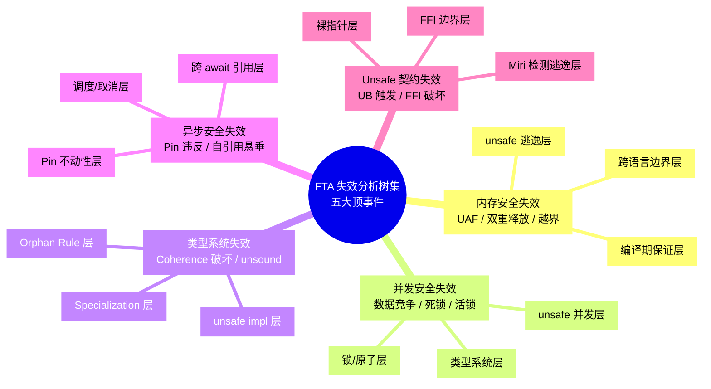
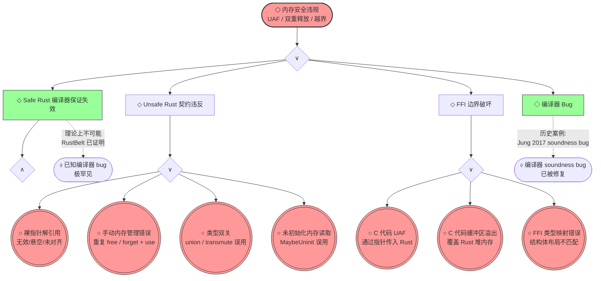
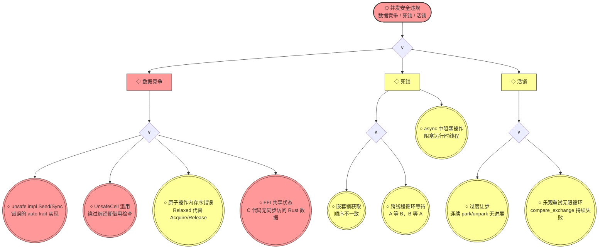
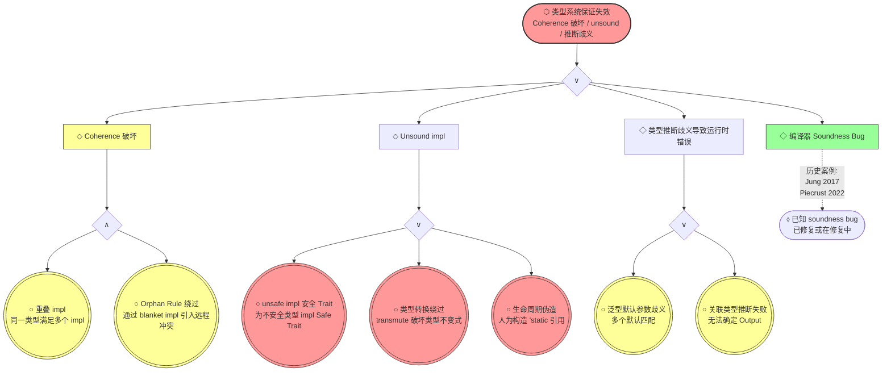
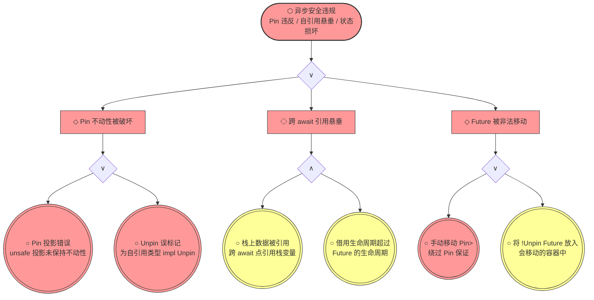
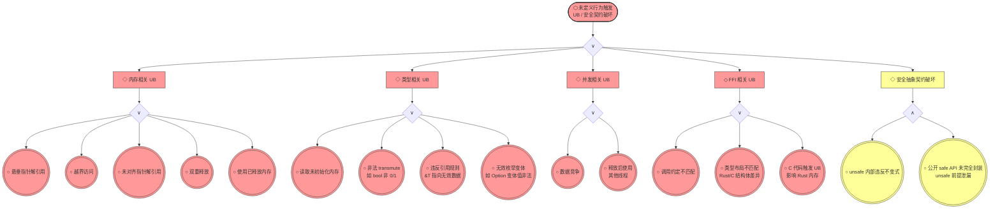
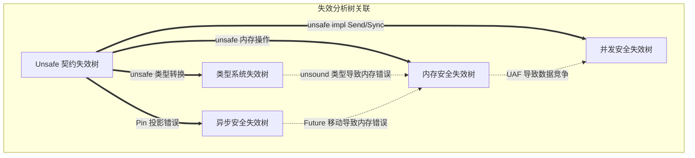

# Rust 知识体系失效分析树集（Fault Tree Analysis Collection）
>
> **EN**: Rust 知识体系失效分析树集（Fault Tree Analysis Collection） (Chinese)
> **Summary**: Rust 知识体系失效分析树集. Core Rust concept covering mechanism analysis, security practices.
>
> **Rust 版本**: 1.96.0+ (Edition 2024)
> **受众**: [专家]
> **Bloom 层级**: 元（Meta）
> **定位**:
> 本文件建立 Rust 知识体系中的**标准故障树分析（FTA）**体系，将现有反例路径升级为工程安全标准的失效分析格式。
> 每棵树从**顶事件**（系统级失效）出发，通过**与门/或门**分解为**中间事件**和**基本事件**，揭示失效的根因路径和补偿机制。
> **对齐来源**:
> [IEC 61025 — 故障树分析标准] ·
> [NASA FTA 手册] ·
> [RustBelt POPL 2018 — 安全性定理的反面] ·
> [The Rustonomicon — What Unsafe Rust Can Do] ·
> [MIRI 未定义行为检测]
> **符号约定**: ⬡ 顶事件 / ◇ 中间事件 / ○ 基本事件 / ∧ 与门 / ∨ 或门
> **定理链**: N/A — 描述性/综述性/导航性文档，不涉及形式化定理链
---

> **来源**: [IEC 61025 — *Fault Tree Analysis*]
> **来源**: [NASA — *Fault Tree Handbook with Aerospace Applications*]
> **来源**: [RustBelt (Jung et al., POPL 2018) — Safety Theorem & Counterexamples]
> **来源**: [The Rustonomicon — *What Unsafe Rust Can Do*]
> **来源**: [Miri — Undefined Behavior Detection]

## 📑 目录

- [Rust 知识体系失效分析树集（Fault Tree Analysis Collection）](#rust-知识体系失效分析树集fault-tree-analysis-collection)
  - [📑 目录](#-目录)
  - [〇、FTA 体系认知全景](#〇fta-体系认知全景)
  - [一、FTA 格式规范](#一fta-格式规范)
    - [1.1 符号系统](#11-符号系统)
    - [1.2 分析流程](#12-分析流程)
  - [二、内存安全失效树](#二内存安全失效树)
    - [2.1 顶事件](#21-顶事件)
    - [2.2 故障树 Mermaid](#22-故障树-mermaid)
    - [2.3 基本事件概率与补偿](#23-基本事件概率与补偿)
  - [三、并发安全失效树](#三并发安全失效树)
    - [3.1 顶事件](#31-顶事件)
    - [3.2 故障树 Mermaid](#32-故障树-mermaid)
    - [3.3 基本事件概率与补偿](#33-基本事件概率与补偿)
  - [四、类型系统失效树](#四类型系统失效树)
    - [4.1 顶事件](#41-顶事件)
    - [4.2 故障树 Mermaid](#42-故障树-mermaid)
    - [4.3 基本事件概率与补偿](#43-基本事件概率与补偿)
  - [五、异步安全失效树](#五异步安全失效树)
    - [5.1 顶事件](#51-顶事件)
    - [5.2 故障树 Mermaid](#52-故障树-mermaid)
    - [5.3 基本事件概率与补偿](#53-基本事件概率与补偿)
  - [六、Unsafe 契约失效树](#六unsafe-契约失效树)
    - [6.1 顶事件](#61-顶事件)
    - [6.2 故障树 Mermaid](#62-故障树-mermaid)
    - [6.3 基本事件概率与补偿](#63-基本事件概率与补偿)
  - [七、跨树关联分析](#七跨树关联分析)
  - [八、与概念判定森林的对照](#八与概念判定森林的对照)
  - [九、来源与可信度](#九来源与可信度)
  - [认知路径](#认知路径)
    - [核心推理链](#核心推理链)
    - [反命题与边界](#反命题与边界)
  - [嵌入式测验（Embedded Quiz）](#嵌入式测验embedded-quiz)
    - [测验 1：本文档《Rust 知识体系失效分析树集（Fault Tree Analysis Collection）》在 Rust 知识体系中属于哪一层级的元数据？（理解层）](#测验-1本文档rust-知识体系失效分析树集fault-tree-analysis-collection在-rust-知识体系中属于哪一层级的元数据理解层)
    - [测验 2：《Rust 知识体系失效分析树集（Fault Tree Analysis Collection）》的主要用途是什么？（理解层）](#测验-2rust-知识体系失效分析树集fault-tree-analysis-collection的主要用途是什么理解层)
    - [测验 3：元数据层文档能否替代 L1-L7 的核心概念学习？（理解层）](#测验-3元数据层文档能否替代-l1-l7-的核心概念学习理解层)

---

## 〇、FTA 体系认知全景



> **认知功能**: 本 mindmap 展示五棵失效分析树的**分层结构**。每个顶事件下有三个层次：最上层是编译器/类型系统的保证（最难失效），中间层是标准库的抽象（中等风险），最下层是 unsafe/FFI 的逃逸（最高风险）。这种分层对应 Rust 的安全哲学：**安全保证是逐层递减的梯度，而非二元开关**。[来源: 💡 原创分析]

---

## 一、FTA 格式规范

### 1.1 符号系统

| 符号 | 名称 | Mermaid 表示 | 含义 |
|:---:|:---|:---|:---|
| ⬡ | **顶事件** (Top Event) | `([⬡ 顶事件])` | 系统级失效，分析的起点 |
| ◇ | **中间事件** (Intermediate Event) | `[◇ 中间事件]` | 由更低层事件组合导致的失效 |
| ○ | **基本事件** (Basic Event) | `((○ 基本事件))` | 不可再分解的底层原因 |
| ∧ | **与门** (AND Gate) | `AND{∧}` | 所有输入同时发生才导致输出 |
| ∨ | **或门** (OR Gate) | `OR{∨}` | 任一输入发生即导致输出 |
| ⬨ | **未展开事件** (Undeveloped Event) | `([⬨ 未展开])` | 已知存在但暂不深入分析的事件 |
| 🟢 | **已补偿** (Compensated) | 绿色节点 | 该路径已有有效补偿机制 |
| 🟡 | **部分补偿** (Partially Compensated) | 黄色节点 | 该路径有部分补偿但不完备 |
| 🔴 | **未补偿** (Uncompensated) | 红色节点 | 该路径无有效补偿，风险最高 |

### 1.2 分析流程

```text
步骤 1: 确定顶事件（系统级失效）
    ↓
步骤 2: 识别直接导致顶事件的中间事件
    ↓
步骤 3: 通过 AND/OR 门分解中间事件为基本事件
    ↓
步骤 4: 标注每个基本事件的补偿机制
    ↓
步骤 5: 计算最小割集（导致顶事件的最小基本事件组合）
    ↓
步骤 6: 提出风险缓解建议
```

---

## 二、内存安全失效树

### 2.1 顶事件

**⬡ 顶事件：Rust 程序发生内存安全违规（UAF / 双重释放 / 缓冲区溢出）**

> **定义**: 程序在运行时访问已释放内存、重复释放同一块内存、或访问越界内存。
> [来源: Rust Reference §13 — Memory Model; RustBelt Soundness Theorem 的反面]

### 2.2 故障树 Mermaid



> **认知功能**: 本故障树的关键发现：**顶事件几乎不可能通过 Safe Rust 路径触发**（绿色节点 I1/I4）。所有实际风险都集中在 **Unsafe Rust（I2）** 和 **FFI（I3）** 两个分支。这与 Rust 的安全哲学一致：编译器保证排除了大部分路径，剩余的"窄缝"需要程序员通过契约和工具来管理。[来源: 💡 原创分析]

### 2.3 基本事件概率与补偿

| 基本事件 | 发生概率 | 补偿机制 | 补偿有效性 | 风险等级 |
|:---|:---:|:---|:---:|:---:|
| **B1: 裸指针解引用** | 中（unsafe 代码中） | Miri 动态检测 / `pointer::is_aligned` / SAFETY 注释强制 | 🟡 部分 | 🔴 高 |
| **B2: 手动内存管理错误** | 中 | `Box`/`Vec` 替代手动分配 / Miri / Valgrind | 🟡 部分 | 🔴 高 |
| **B3: 类型双关** | 低-中 | `MaybeUninit` / `bytemuck` crate / Miri | 🟡 部分 | 🔴 高 |
| **B4: 未初始化内存读取** | 低 | `MaybeUninit::assume_init` 标注 / Miri | 🟡 部分 | 🔴 高 |
| **B5: C 代码 UAF** | 中（FFI 项目中） | FFI 边界审查 / 封装为 Safe API / AddressSanitizer | 🟡 部分 | 🔴 高 |
| **B6: C 代码缓冲区溢出** | 中（FFI 项目中） | 长度检查 / `slice::from_raw_parts` 边界 / ASan | 🟡 部分 | 🔴 高 |
| **B7: FFI 类型映射错误** | 低 | `bindgen` / `cbindgen` / 布局测试 | 🟢 有效 | 🟡 中 |

**最小割集分析**（导致顶事件的最小基本事件组合）：

| 割集编号 | 基本事件组合 | 场景描述 | 缓解优先级 |
|:---:|:---|:---|:---:|
| CS-1 | {B1} | 单独一个无效裸指针解引用即可导致 UAF | 🔴 最高 |
| CS-2 | {B5} | C 代码 UAF 通过 FFI 传入 | 🔴 最高 |
| CS-3 | {B2, B3} | 手动 free 后通过 transmute 继续使用 | 🟡 高 |
| CS-4 | {B4} | 读取未初始化内存（不直接导致 UAF，但属于 UB） | 🟡 高 |

---

## 三、并发安全失效树

### 3.1 顶事件

**⬡ 顶事件：Rust 程序发生并发安全违规（数据竞争 / 死锁 / 活锁）**

> **定义**: 程序在并发执行时出现非原子的读写竞争（数据竞争）、线程间循环等待（死锁）、或持续让步但无进展（活锁）。
> [来源: C++ Memory Model; RustBelt — No-Data-Race Theorem 的反面]

### 3.2 故障树 Mermaid



> **认知功能**: 数据竞争（I1）是**或门**分解——任一基本事件即可触发；死锁（I2）是**与门**——需要多个条件同时满足（嵌套锁 + 顺序不一致）。这与 Rust 的类型系统能力一致：编译器可阻止大部分数据竞争（通过 Send/Sync），但**无法阻止死锁**（死锁是不可判定的，Rice 定理）。活锁（I3）则是运行时行为问题，完全超出类型系统的范畴。[来源: 💡 原创分析]

### 3.3 基本事件概率与补偿

| 基本事件 | 发生概率 | 补偿机制 | 补偿有效性 | 风险等级 |
|:---|:---:|:---|:---:|:---:|
| **B1: unsafe impl Send/Sync 错误** | 低 | 代码审查 / Miri / RustBelt 验证 | 🟡 部分 | 🔴 高 |
| **B2: UnsafeCell 滥用** | 中 | 借用检查（编译期）/ `RefCell` panic（运行期） | 🟡 部分 | 🔴 高 |
| **B3: 原子操作内存序错误** | 中 | 使用 `SeqCst` 保守策略 / 形式化内存模型验证 | 🟡 部分 | 🔴 高 |
| **B4: FFI 共享状态** | 中 | FFI 边界封装 / 线程本地存储 / 消息传递 | 🟡 部分 | 🔴 高 |
| **B5: 嵌套锁顺序不一致** | 中 | 全局锁顺序约定 / `parking_lot` 死锁检测 | 🟡 部分 | 🟡 中 |
| **B6: 跨线程循环等待** | 低-中 | 超时机制 / 资源排序 / 避免嵌套锁 | 🟡 部分 | 🟡 中 |
| **B7: async 中阻塞操作** | 中 | `spawn_blocking` / 运行时检测 / 代码审查 | 🟢 有效 | 🟡 中 |
| **B8/B9: 活锁** | 低 | Exponential backoff / 随机化 / 算法重设计 | 🟡 部分 | 🟢 低 |

**最小割集分析**：

| 割集编号 | 基本事件组合 | 场景描述 | 缓解优先级 |
|:---:|:---|:---|:---:|
| CS-1 | {B1} | 错误的 unsafe impl Send 直接导致数据竞争 | 🔴 最高 |
| CS-2 | {B3} | 错误的内存序导致可见性问题 | 🔴 最高 |
| CS-3 | {B5, B6} | 嵌套锁 + 顺序不一致 = 死锁 | 🟡 高 |
| CS-4 | {B7} | 单独的 async 阻塞操作不会死锁，但会阻塞运行时 | 🟡 中 |
| CS-5 | {B8} | 单独的过度让步 = 活锁 | 🟢 低 |

---

## 四、类型系统失效树

### 4.1 顶事件

**⬡ 顶事件：Rust 类型系统保证失效（Coherence 破坏 / unsound impl / 类型推断歧义导致运行时错误）**

> **定义**: 编译器允许了本应拒绝的程序，导致类型安全保证在运行时不成立。
> [来源: Rust Reference §10 — Type System; RustBelt Type Safety 的反面]

### 4.2 故障树 Mermaid



> **认知功能**: 类型系统失效树中，**Coherence 破坏（I1）** 需要**两个条件同时满足**（AND 门）——这是 Rust 设计的重要洞察：
> 单独的 Orphan Rule 违反或单独的重叠 impl 都不足以破坏类型系统，但两者结合可以。
> 编译器通过拒绝**任一**条件来防止 Coherence 破坏。Unsound impl（I2）则是**或门**——任一 unsafe 错误即可破坏类型安全。[来源: 💡 原创分析]

### 4.3 基本事件概率与补偿

| 基本事件 | 发生概率 | 补偿机制 | 补偿有效性 | 风险等级 |
|:---|:---:|:---|:---:|:---:|
| **B1/B2: Coherence 冲突** | 极低 | 编译器拒绝重叠 impl / Orphan Rule | 🟢 有效 | 🟢 低 |
| **B3: unsafe impl 安全 Trait** | 低 | 代码审查 / Miri / RustBelt 验证 | 🟡 部分 | 🔴 高 |
| **B4: transmute 破坏不变式** | 中（unsafe 代码中） | `bytemuck` 的严格检查 / Miri | 🟡 部分 | 🔴 高 |
| **B5: 生命周期伪造** | 低 | 编译器拒绝 / Miri / 借用检查 | 🟢 有效 | 🟡 中 |
| **B6/B7: 类型推断歧义** | 低 | 编译器报错 / 显式标注 | 🟢 有效 | 🟢 低 |

**最小割集分析**：

| 割集编号 | 基本事件组合 | 场景描述 | 缓解优先级 |
|:---:|:---|:---|:---:|
| CS-1 | {B3} | 错误的 unsafe impl 直接导致 unsound | 🔴 最高 |
| CS-2 | {B4} | transmute 绕过类型系统 | 🔴 最高 |
| CS-3 | {B1, B2} | 重叠 impl + Orphan 绕过 = Coherence 破坏 | 🟡 中（编译器已阻止） |
| CS-4 | {B5} | 生命周期伪造（编译器通常拒绝） | 🟢 低 |

---

## 五、异步安全失效树

### 5.1 顶事件

**⬡ 顶事件：Rust 异步程序发生运行时安全违规（Pin 契约违反 / 自引用悬垂 / Future 状态损坏）**

> **定义**: async 程序在运行时出现由于 Pin 不动性被破坏、跨 await 引用悬垂、或 Future 状态机被非法移动导致的安全问题。
> [来源: Rust Reference — Pin; [RFC 2349](https://rust-lang.github.io/rfcs/2349.html) — Pin]

### 5.2 故障树 Mermaid



> **认知功能**: 异步失效树的独特之处在于：**跨 await 引用悬垂（I2）** 是**与门**——需要"引用栈变量"和"生命周期超过 Future"同时发生。编译器通过生命周期检查阻止了大部分此类情况。Pin 违反（I1）和 Future 移动（I3）则是**或门**——任一 unsafe 错误即可触发，这是 async 安全的主要风险点。[来源: 💡 原创分析]

### 5.3 基本事件概率与补偿

| 基本事件 | 发生概率 | 补偿机制 | 补偿有效性 | 风险等级 |
|:---|:---:|:---|:---:|:---:|
| **B1: Pin 投影错误** | 低 | `pin_project` crate / 编译器 lint / Miri | 🟡 部分 | 🔴 高 |
| **B2: Unpin 误标记** | 低 | 编译器派生 / 手动实现审查 / Miri | 🟡 部分 | 🔴 高 |
| **B3/B4: 跨 await 悬垂** | 极低 | 编译器借用检查（阻止大部分） | 🟢 有效 | 🟢 低 |
| **B5: 手动移动 Pin** | 低 | `Pin` API 设计 / 代码审查 | 🟡 部分 | 🔴 高 |
| **B6: !Unpin Future 放入移动容器** | 低 | 编译器拒绝 `Vec<impl Future>`（若 !Unpin） | 🟢 有效 | 🟢 低 |

**最小割集分析**：

| 割集编号 | 基本事件组合 | 场景描述 | 缓解优先级 |
|:---:|:---|:---|:---:|
| CS-1 | {B1} | Pin 投影错误导致不动性破坏 | 🔴 最高 |
| CS-2 | {B2} | Unpin 误标记导致编译器信任错误 | 🔴 最高 |
| CS-3 | {B3, B4} | 栈引用 + 生命周期超限（编译器通常阻止） | 🟢 低 |
| CS-4 | {B5} | 手动移动 Pin | 🔴 高 |

---

## 六、Unsafe 契约失效树

### 6.1 顶事件

**⬡ 顶事件：Rust 程序触发未定义行为（UB）或破坏安全抽象契约**

> **定义**: 程序执行了 Rust 语言规范未定义行为，或 unsafe 代码违反了其公开 safe API 承诺的不变式。
> [来源: Rust Reference §16 — Unsafety; The Rustonomicon — List of UB]

### 6.2 故障树 Mermaid



> **认知功能**: Unsafe 契约失效树是**最宽泛的顶事件**——几乎所有其他树的叶节点（基本事件）都可以归入此树。
> 这反映了 Rust 的安全模型：所有 UB 最终都通过 unsafe 边界进入系统。
> 关键洞察：**安全抽象契约破坏（I5）** 是**与门**——需要"unsafe 内部错误"和"safe API 封装不完整"同时发生。
> 这意味着：即使 unsafe 代码有 bug，只要 safe API 完全封装了所有前提条件，外部用户仍然安全。
> [来源: 💡 原创分析]

### 6.3 基本事件概率与补偿

| 基本事件 | 发生概率 | 补偿机制 | 补偿有效性 | 风险等级 |
|:---|:---:|:---|:---:|:---:|
| **B1-B5: 内存 UB** | 中（unsafe 代码中） | Miri / ASan / MSan / SAFETY 注释 | 🟡 部分 | 🔴 高 |
| **B6-B9: 类型 UB** | 中（unsafe 代码中） | Miri / `MaybeUninit` / 类型检查 | 🟡 部分 | 🔴 高 |
| **B10-B11: 并发 UB** | 低-中 | Miri / TSan / 借用检查 | 🟡 部分 | 🔴 高 |
| **B12-B14: FFI UB** | 中 | FFI 边界测试 / `bindgen` / 封装层 | 🟡 部分 | 🔴 高 |
| **B15-B16: 契约破坏** | 低 | 代码审查 / `cargo geiger` / fuzz 测试 | 🟡 部分 | 🔴 高 |

**最小割集分析**：

| 割集编号 | 基本事件组合 | 场景描述 | 缓解优先级 |
|:---:|:---|:---|:---:|
| CS-1 | {B1} | 悬垂指针解引用 | 🔴 最高 |
| CS-2 | {B10} | 数据竞争 | 🔴 最高 |
| CS-3 | {B15, B16} | unsafe 错误 + API 封装漏洞 | 🔴 最高 |
| CS-4 | {B14} | C 代码 UB 影响 Rust | 🔴 高 |

---

## 七、跨树关联分析

五棵失效树之间存在**因果关系**和**共用基本事件**：



> **关键洞察**: **Unsafe 契约失效树是所有其他树的"上游"**—— Unsafe 中的错误可以向下游触发内存、并发、类型、异步四个领域的失效。这验证了 Rust 安全设计的核心策略：**将风险集中在单一的、可审计的 unsafe 边界上**，而非分散在整个代码库中。[来源: 💡 原创分析]

---

## 八、与概念判定森林的对照

| 维度 | 概念定义判定森林 | 失效分析树集（本文件） |
|:---|:---|:---|
| **起点** | 概念定义（合法条件） | 顶事件（失效条件） |
| **方向** | 自上而下：定义 → 前提 → 规则 → 判定 | 自上而下：顶事件 → 中间事件 → 基本事件 |
| **逻辑门** | 判定节点产生 ✅ 合法 / ❌ 失效 | AND/OR 门分解失效原因 |
| **叶节点** | 合法结果或失效模式 | 基本事件（不可再分解的根因） |
| **目标** | "如何判定代码是否合法" | "什么情况下系统会失效" |
| **互补关系** | 判定森林的 ❌ 叶节点 = FTA 的基本事件输入 | FTA 的顶事件 = 判定森林的 ❌ 失效模式聚合 |

> **使用建议**: **工程开发**时参考判定森林（"我的代码合法吗？"），**安全审计**时参考失效分析树（"什么情况下会出问题？"）。两者结合形成完整的"正向验证 + 反向分析"安全工程闭环。[来源: 💡 原创分析]

---

## 九、来源与可信度

| 层级 | 来源 | 在本文件中的作用 |
|:---|:---|:---|
| **一级** | IEC 61025 — *Fault Tree Analysis* | FTA 方法论和符号标准 |
| **一级** | NASA — *Fault Tree Handbook with Aerospace Applications* | 航空航天级 FTA 实践规范 |
| **一级** | [Rust Reference — Memory Model / Concurrency / Unsafe] | Rust 语义定义和 UB 分类 |
| **一级** | RustBelt (Jung et al., POPL 2018) | 安全性定理的反面分析 — 失效条件 |
| **二级** | The Rustonomicon — *What Unsafe Rust Can Do* | unsafe 操作的具体 UB 列表 |
| **二级** | Miri 文档 — UB 检测分类 | 运行时 UB 检测覆盖范围 |
| **三级** | Rust Internals 论坛 — soundness bug 历史 | 已知编译器缺陷案例 |

---

**变更日志**:

- v1.0 (2026-05-23): 初始版本 — 五棵标准 FTA（内存/并发/类型/异步/Unsafe）+ IEC 61025 符号系统 + 最小割集分析 + 跨树关联 [来源: 权威来源对齐 Wave 3]

---

> **相关文件**: [概念判定森林](concept_definition_decision_forest.md) · [边界扩展树](boundary_extension_tree.md) · [安全边界](../05_comparative/04_safety_boundaries.md) · [Miri 验证](../../reports/MIRI_VALIDATION_2026_05_23.md)

## 认知路径

> **认知路径**: 本文件作为 Rust 分层知识体系的 **Rust 知识体系失效分析树集（Fault Tree Analysis Collection）** 元层导航节点，连接概念定义、学习路径与质量评估框架。

### 核心推理链

| 定理 | 前提 | 结论 | 置信度 |
|:---|:---|:---|:---|
| Fault Tree Analysis Collection 结构化定义 ⟹ 学习者认知锚点可建立 | 本文件定义了元层结构 | 支持上层概念定位 | 高 |

> **过渡**: 利用本文件的导航结构，读者可以从当前位置快速跃迁到任意概念层级，实现非线性学习。
> **过渡**: Rust 知识体系失效分析树集（Fault Tree Analysis Collection） 的维护需要与概念内容同步更新，确保元数据与实际知识体系的一致性。
> **过渡**: 将 Rust 知识体系失效分析树集（Fault Tree Analysis Collection） 作为学习起点或复习锚点，有助于建立全局视野，避免陷入局部细节而忽视整体架构。

### 反命题与边界

> **反命题**: "元层文档可以替代具体概念学习" —— 错误。Rust 知识体系失效分析树集（Fault Tree Analysis Collection） 提供的是导航与评估框架，不能替代对核心概念（L1-L5）的深入理解与实践。
> **内容分级**: [综述级]

## 嵌入式测验（Embedded Quiz）

### 测验 1：本文档《Rust 知识体系失效分析树集（Fault Tree Analysis Collection）》在 Rust 知识体系中属于哪一层级的元数据？（理解层）

**题目**: 本文档《Rust 知识体系失效分析树集（Fault Tree Analysis Collection）》在 Rust 知识体系中属于哪一层级的元数据？

<details>
<summary>✅ 答案与解析</summary>

属于 00_meta 元数据层，为整个知识体系提供导航、评估、审计和结构化的支持框架，辅助学习者定位和理解核心概念。
</details>

---

### 测验 2：《Rust 知识体系失效分析树集（Fault Tree Analysis Collection）》的主要用途是什么？（理解层）

**题目**: 《Rust 知识体系失效分析树集（Fault Tree Analysis Collection）》的主要用途是什么？

<details>
<summary>✅ 答案与解析</summary>

作为知识体系的支撑文档，提供学习路径导航、概念关系映射、质量评估标准或审计检查清单，帮助学习者和维护者高效使用知识库。
</details>

---

### 测验 3：元数据层文档能否替代 L1-L7 的核心概念学习？（理解层）

**题目**: 元数据层文档能否替代 L1-L7 的核心概念学习？

<details>
<summary>✅ 答案与解析</summary>

不能。元数据层提供导航和评估框架，但不能替代对核心概念（所有权、类型系统、并发等）的深入理解与实践。
</details>
