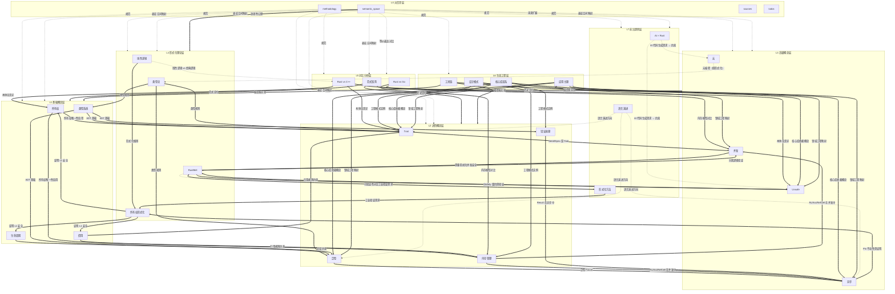
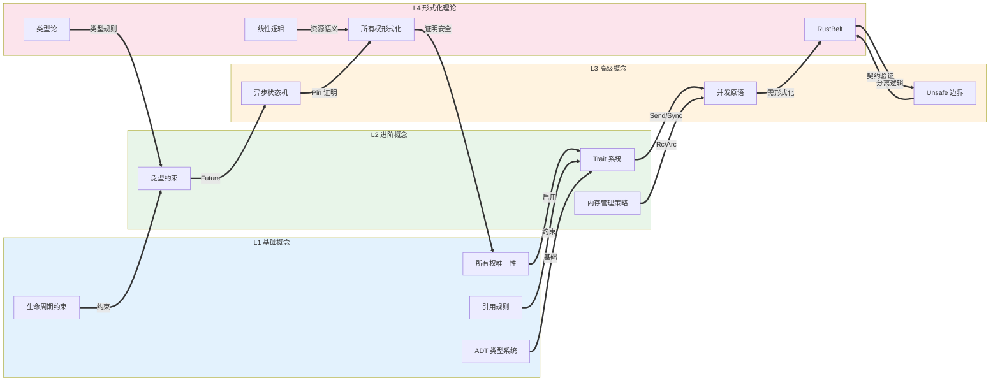

# 跨层知识图谱（Inter-Layer Dependency Map）

> **Bloom 层级**: 分析
> **定位**：本文件是 `concept/` 知识体系的全局关系骨架，显式定义 L0-L7 各层之间的**逻辑蕴含关系**、**形式化映射**、**反事实依赖**和**反向反馈**。
> **方法论对齐**: Semantic Link Network (Zhuge 2010) · Bloom's Revised Taxonomy · KB Completeness & Consistency (Torchiano et al. 2018)

---

> **来源**: [Rust Reference] · [Rust Internals] · [concept/知识体系规范]
>
## 📑 目录

- [跨层知识图谱（Inter-Layer Dependency Map）](#跨层知识图谱inter-layer-dependency-map)
  - [📑 目录](#-目录)
  - [一、全局层级依赖图](#一全局层级依赖图)
    - [1.1 层间定理传递链可视化](#11-层间定理传递链可视化)
  - [二、语义链接类型定义](#二语义链接类型定义)
  - [三、层间映射矩阵](#三层间映射矩阵)
    - [3.1 L1-L4 形式化映射（核心）](#31-l1-l4-形式化映射核心)
    - [3.2 L4-L3-L2 定理传递链](#32-l4-l3-l2-定理传递链)
    - [3.3 反向依赖（上层需求驱动下层设计）](#33-反向依赖上层需求驱动下层设计)
  - [四、关键跨层推理链（定理一致性）](#四关键跨层推理链定理一致性)
    - [4.1 链 1: 内存安全完备性](#41-链-1-内存安全完备性)
    - [4.2 链 2: 类型系统一致性](#42-链-2-类型系统一致性)
    - [4.3 链 3: 异步正确性](#43-链-3-异步正确性)
  - [五、层间一致性检查点](#五层间一致性检查点)
    - [5.1 定义一致性检查](#51-定义一致性检查)
    - [5.2 定理一致性检查](#52-定理一致性检查)
  - [六、反事实与边界条件](#六反事实与边界条件)
    - [6.1 什么情况下形式化保证失效？](#61-什么情况下形式化保证失效)
    - [6.2 跨层断裂点](#62-跨层断裂点)
  - [七、认知路径映射（Bloom 层级）](#七认知路径映射bloom-层级)
  - [八、来源与可信度](#八来源与可信度)
  - [九、Wave 6 层间映射更新](#九wave-6-层间映射更新)
    - [9.1 L1 ↔ L4 双向映射精度](#91-l1--l4-双向映射精度)
    - [9.2 新增跨层推理链](#92-新增跨层推理链)
    - [9.3 L5-L7 层次一致性标注](#93-l5-l7-层次一致性标注)
  - [十、TODO](#十todo)
  - [相关概念文件](#相关概念文件)

> **来源**: [Rust Reference] · [Rust Internals] · [concept/知识体系规范]
>
## 一、全局层级依赖图



---

### 1.1 层间定理传递链可视化



> **认知功能**: 此传递链图将 L1→L2→L3→L4 的**正向递进**与 L4→L1 的**反向形式化证明**可视化。实线箭头表示"概念依赖"（上层依赖下层），粗实线表示"形式化证明"（L4 证明 L1 安全）。颜色分层：蓝=基础、绿=进阶、橙=高级、粉=形式化。关键洞察：**L4 不是 L3 的"更高级版本"，而是 L1-L3 的"数学根基"**——形式化理论向下证明上层概念的安全性。

---

> **来源**: [Rust Reference] · [Rust Internals] · [concept/知识体系规范]
>
## 二、语义链接类型定义

所有跨层关系必须标注以下**语义类型**之一：

| 语义类型 | 符号 | 含义 | 示例 |
|:---|:---|:---|:---|
| **形式化根基** | `==>` `形式化根基` | L4 的数学理论为上层概念提供严格语义 | 线性逻辑 ⇒ 所有权 |
| **逻辑蕴含** | `==>` `启用/导致` | 下层概念的逻辑结论直接产生上层机制 | 所有权唯一性 ⇒ Trait |
| **前置条件** | `-->` `需要` | 必须掌握下层概念才能理解上层 | 生命周期 ⇒ 泛型 |
| **反向约束** | `-.->` `反馈/约束` | 上层需求反向影响下层设计 | AI 生成 ⇒ Unsafe 约束 |
| **对比映射** | `-.->` `对比` | 对比层将不同层概念并置分析 | 范式矩阵 ⇒ L1-L3 |
| **工程实现** | `-->` `实现` | 生态层为语言层提供工具支撑 | 工具链 ⇒ 编译器 |

---

## 三、层间映射矩阵

### 3.1 L1-L4 形式化映射（核心）

| L1 语言概念 | L2 进阶机制 | L3 高级特性 | L4 形式化理论 | 映射关系 | 映射精度 |
|:---|:---|:---|:---|:---|:---|
| 所有权 (Ownership) | Trait (Drop) | Unsafe (突破) | 线性/仿射逻辑 | **双射** | 精确: 所有权 ⟺ 线性资源 |
| 借用 (&/&mut) | Trait (Borrow) | 并发 (共享/互斥) | 分离逻辑 (Fractional Permissions) | **同态** | 近似: 借用 ⊂ 分数权限 |
| 生命周期 ('a) | 泛型 (<'a>) | 异步 (Pin<'a>) | 区域类型 (Region Types) | **嵌入** | 精确: 生命周期 = 区域约束 |
| 类型系统 (ADT) | Trait (Associated Types) | 宏 (类型生成) | 代数类型论 + HM | **双射** | 精确: enum/struct ⟺ 和/积类型 |
| Move/Copy | 内存管理 (Box) | Unsafe (MaybeUninit) | 线性逻辑 ⊗ /  weakening | **部分映射** | Copy = weakening 特例 |
| — | Send/Sync (Marker Trait) | 并发安全保证 | 并发分离逻辑 (CSL) | **同态** | Send/Sync ⟹ CSL 资源安全 |

### 3.2 L4-L3-L2 定理传递链

```text
[公理: 线性逻辑]           ⊗ 是资源组合，!A 允许复制
        ↓ [映射规则: 所有权即线性资源]
[引理: 所有权唯一性]        任意时刻 T 有且仅有一个 owner
        ↓ [推理: 转移即消耗]
[定理: Move 语义安全]       move 后原变量不可访问
        ↓ [组合: 借用规则]
[定理: Alias-XOR-Mutation]  &T 和 &mut T 不能共存
        ↓ [推广: 并发]
[定理: Send/Sync 充分性]    Send + Sync ⟹ 无数据竞争
        ↓ [反事实: unsafe]
[边界: unsafe 突破条件]    手动 impl Send/Sync 需满足安全契约
```

### 3.3 反向依赖（上层需求驱动下层设计）

| 上层需求 | 驱动下层变化 | 关系说明 |
|:---|:---|:---|
| L7 AI 代码生成 | L3 Unsafe 契约标注 | AI 生成代码需显式 unsafe 边界说明 |
| L7 形式化方法工业化 | L4 RustBelt 工具化 | Kani/Creusot 将理论验证变为工程流程 |
| L7 GATs / 特化 | L2 泛型系统扩展 | 语言演进推动泛型能力边界 |
| L6 嵌入式生态 | L3 no_std + Unsafe | 裸机编程需求催生 unsafe 最小化子集 |
| L5 Rust vs C++ | L1 所有权设计哲学 | 对比分析反推 Rust 设计决策的必然性 |

---

## 四、关键跨层推理链（定理一致性）

### 4.1 链 1: 内存安全完备性

```text
目标定理: Rust 类型系统 + 借用检查器 ⟹ 无数据竞争 ∧ 无悬垂指针 ∧ 无 use-after-free

子定理 1 (L1): 所有权唯一性 ⟹ 无 double-free
    前提: 每个堆分配有唯一 owner
    推理: owner 离开作用域时 drop 一次且仅一次
    反事实: Rc 循环引用 ⟹ 内存泄漏（非 UAF，是安全漏洞的另一形式）
    来源: ✅ [TRPL Ch4] · ✅ [Wikipedia: Memory safety]

子定理 2 (L1): 借用规则 (AXM) ⟹ 无数据竞争
    前提: &T 不可变共享 或 &mut T 唯一可变
    推理: 不存在同时读写同一内存的别名
    反事实: UnsafeCell + 手动同步 ⟹ 需程序员保证安全（突破编译器证明）
    来源: ✅ [TRPL Ch4.2] · 💡 [原创: AXM → 并发安全]

子定理 3 (L1): 生命周期约束 ⟹ 无悬垂指针
    前提: 所有引用 'a 必须 outlive 其指向数据
    推理: 若数据已释放，引用生命周期必已结束
    反事实: 'static 引用指向局部变量（编译错误 E0597）
    来源: ✅ [TRPL Ch10.3] · ✅ [Rust Reference: Lifetimes]

组合定理 (L2-L3): Send + Sync ⟹ 跨线程安全
    前提: T: Send（所有权可跨线程转移）∧ T: Sync（&T 可跨线程共享）
    推理: 线程间传递满足所有权唯一性或不可变共享
    反事实: Rc<T> 不是 Send（共享计数器非线程安全）
    来源: ✅ [TRPL Ch16] · ✅ [Rustonomicon: Send and Sync]

形式化完备 (L4): RustBelt ⟹ 上述所有定理可机械验证
    前提: Iris 分离逻辑 + λRust 操作语义
    推理: 对任何 safe Rust 程序，存在形式化证明其满足安全规范
    边界: unsafe 块不在证明范围内（需手动验证）
    来源: ✅ [Jung et al. POPL 2017] · ✅ [RustBelt website]
```

### 4.2 链 2: 类型系统一致性

```text
目标定理: Rust 类型系统是一致的（无矛盾）且完备的（可判定）

子定理 1 (L4): HM 类型推断 + Trait 约束 ⟹ 可判定
    前提: 类型约束是 Horn 子句
    推理: 约束求解有终止算法
    反事实: GATs 不加限制 ⟹ 不可判定（故 Rust 对 GATs 加以约束）
    来源: ✅ [Pierce: Types and Programming Languages] · ⚠️ [RFC: GATs]

子定理 2 (L4): 区域约束系统 ⟹ 可满足性可判定
    前提: 生命周期约束是偏序关系
    推理: 图可达性算法可在多项式时间求解
    反事实: HRTB (∀<'a>) 引入全称量词 ⟹ 更高复杂度但仍可判定
    来源: ✅ [Rust Reference: Lifetime Elision] · 💡 [原创分析]

子定理 3 (L2-L3): 单态化 ⟹ 零成本抽象
    前提: 泛型函数在每个实例类型上独立编译
    推理: 无运行时类型信息开销
    反事实: dyn Trait（动态分发）打破零成本 ⟹ 有 vtable 开销
    来源: ✅ [TRPL Ch10] · ✅ [RFC: Trait Objects]
```

### 4.3 链 3: 异步正确性

```text
目标定理: async/await + Pin ⟹ 自引用结构安全

子定理 1 (L3): Pin<&mut T> ⟹ T 在内存中不可移动
    前提: Pin 不提供 &mut T → T 的解包路径（除非 T: Unpin）
    推理: 自引用字段的地址在对象生命周期内恒定
    反事实: Unpin 自动实现 ⟹ 大多数类型可被移动，需显式 !Unpin 标记
    来源: ✅ [TRPL Ch17] · ✅ [Pin API docs]

子定理 2 (L3): Future 轮询 ⟹ 协作式多任务安全
    前提: 每次 poll 满足 Pin 约束
    推理: 状态机转换保持自引用有效性
    反事实: 在 poll 中手动 mem::swap ⟹ UB（unsafe）
    来源: ✅ [Rust Async Book] · 💡 [原创分析]

形式化映射 (L4): Pin 对应线性逻辑中的 "location stability"
    前提: 地址是资源的一部分
    推理: 移动 = 资源重组，Pin = 资源位置冻结
    精度: ⚠️ 部分映射（Rust 的 Pin 比线性逻辑的位置稳定性更弱）
    来源: ✅ [RFC 2349: Pin] · [PLDI 2024: RefinedRust] · [Jung et al. 2018: Iris]
```

---

## 五、层间一致性检查点

### 5.1 定义一致性检查

| 概念 | L1 定义 | L2 定义 | L3 定义 | L4 定义 | 一致性状态 |
|:---|:---|:---|:---|:---|:---|
| **所有权** | 唯一 owner，move 转移 | Drop trait 管理释放 | Unsafe 可突破唯一性 | 线性资源 ⊗ | ✅ 一致 |
| **借用** | &T / &mut T 规则 | Borrow trait | 裸指针无借用检查 | 分数权限 | ⚠️ 近似: L1-L3 是语法，L4 是语义 |
| **生命周期** | 'a 标注约束 | 泛型参数 | Pin 的 lifetime | 区域类型 | ✅ 一致 |
| **Send** | — | Marker trait | 跨线程安全 | CSL 资源可转移 | ✅ 一致 |
| **Pin** | — | — | 内存位置不可移动 | location stability | ⚠️ 需补充形式化论文 |
| **unsafe** | — | — | 安全契约 | 证明范围外 | ✅ 一致 |

### 5.2 定理一致性检查

| 定理 | 涉及层级 | 一致性检查 | 状态 |
|:---|:---|:---|:---|
| 无数据竞争 | L1 + L3 | 借用规则 ⟹ AXM ⟹ 并发安全 | ✅ 一致 |
| 无悬垂指针 | L1 + L4 | 生命周期 ⟹ 区域类型 ⟹ 引用有效性 | ✅ 一致 |
| 无内存泄漏 | L1 + L2 | 所有权 ⟹ Drop，但 Rc 循环例外 | ⚠️ 有条件成立 |
| 零成本抽象 | L2 + L4 | 单态化 ⟹ 无运行时开销 | ✅ 一致（dyn 除外） |
| async 安全 | L3 + L4 | Pin + Future ⟹ 自引用安全 | ⚠️ 部分形式化 |

---

## 六、反事实与边界条件

### 6.1 什么情况下形式化保证失效？

```text
L4 形式化保证的边界:
┌─────────────────────────────────────────────────────────────┐
│ 失效条件                    │ 后果                          │
├─────────────────────────────────────────────────────────────┤
│ unsafe 代码块               │ 所有 safe 定理在 unsafe 内不适用 │
│ FFI (外部函数接口)           │ 外部代码不遵循 Rust 类型规则     │
│ 编译器 bug (历史存在)        │ 形式化模型与实际实现不一致       │
│ 硬件内存模型违反             │ 如 CPU 乱序超出 TSO 模型假设     │
│ Rc/Arc 循环引用             │ 非 UAF，但内存泄漏在安全定义外   │
│ mem::forget / ManuallyDrop   │ Drop 不执行，资源不释放          │
└─────────────────────────────────────────────────────────────┘
```

### 6.2 跨层断裂点

```text
断裂点 1: L4 → L1 的理想化假设
    L4 假设: 所有 safe Rust 程序都符合线性逻辑
    现实: Rc<RefCell<T>> 在 safe 代码中允许运行时借用检查失败（panic）
    分析: 这不是安全漏洞（不违反内存安全），但违反了"编译期完全保证"的理想

断裂点 2: L2 → L3 的特化缺失
    L2 假设: 泛型代码对所有类型参数成立
    L3 现实: 某些高级特性（GATs、Impl Trait）与泛型边界交互复杂
    分析: 需要更精确的 where 约束表达

断裂点 3: L1 → L5 的哲学跳跃
    L1 定义: Rust 的所有权是技术机制
    L5 对比: Rust vs C++ 上升到本体论层面
    分析: 技术机制支持但不必然导出哲学结论，需显式论证
```

---

## 七、认知路径映射（Bloom 层级）

每个层级对应 Bloom 认知层级的不同位置：

| 知识层级 | Bloom 层级 | 认知活动 | 典型问题 |
|:---|:---|:---|:---|
| **L1 基础** | 记忆 → 理解 | 识别、回忆、解释 | "什么是所有权？" "为什么这个代码编译失败？" |
| **L2 进阶** | 理解 → 应用 | 分类、比较、执行 | "何时用 Trait Object 还是泛型？" |
| **L3 高级** | 应用 → 分析 | 分析、区分、组织 | "为什么 Pin 需要这个设计？" |
| **L4 形式化** | 分析 → 评价 | 评价、判断、证明 | "这个 unsafe 契约是否充分？" |
| **L5 对比** | 评价 → 创造 | 综合、设计、论证 | "如何用 Rust 替代 C++ 的系统？" |
| **L6 生态** | 应用 + 评价 | 实施、测试、优化 | "如何设计可维护的 Cargo workspace？" |
| **L7 前沿** | 创造 | 假设、设计、预测 | "AI 生成代码需要怎样的类型系统？" |

---

## 八、来源与可信度

| 论断 | 来源 | 可信度 |
|:---|:---|:---|
| 线性逻辑 ⟺ 所有权 | Girard 1987 · Wadler 1990 | ✅ |
| 分离逻辑 ⟹ 借用规则 | Reynolds 2002 · RustBelt | ✅ |
| 区域类型 ⟹ 生命周期 | Tofte & Talpin 1994 | ✅ |
| Send/Sync ⟹ 并发安全 | Rustonomicon · TRPL Ch16 | ✅ |
| Pin ⟺ location stability | — | 🔍 待补充形式化论文 |
| Rc 循环 ⟹ 内存泄漏 | TRPL Ch15 | ✅ |
| 单态化 ⟹ 零成本 | Stroustrup (C++) · Rust RFC | ✅ |
| GATs 可判定性限制 | Rust RFC · 类型论研究 | ⚠️ |
| AI × Rust 约束关系 | — | 💡 原创推断 |

---

## 九、Wave 6 层间映射更新

Wave 6 全量深度重构后，以下层间关系得到**显式标注**：

### 9.1 L1 ↔ L4 双向映射精度

| L4 形式化理论 | L1 语言概念 | 映射精度 | Wave 6 新增标注 |
|:---|:---|:---|:---|
| 线性逻辑 ⊗ / ⊸ | 所有权 / Move | 精确双射 | `01_linear_logic.md` §6 显式标注 |
| 仿射逻辑 weakening | Copy / 变量失效 | 精确 | `03_ownership_formal.md` §6 显式标注 |
| 分数权限 (Fractional) | &T / &mut T | 近似同态 | `03_ownership_formal.md` §6 显式标注 |
| 区域类型 (Region) | 生命周期 ('a) | 精确嵌入 | `03_ownership_formal.md` §6 显式标注 |
| 会话类型 (Session) | channel / mpsc | 部分映射 | `01_linear_logic.md` §6 新增 |
| Iris 分离逻辑 | unsafe 安全契约 | 证明框架 | `04_rustbelt.md` §6 显式标注 |

### 9.2 新增跨层推理链

```text
[Wave 6 新增链: 反命题分析]
L1 定理: 所有权保证无内存泄漏
    ↓ [反例: Rc 循环引用]
L2 机制: RefCell 运行时借用检查
    ↓ [反例: mem::forget]
L3 边界: unsafe 块可绕过 Drop
    ↓ [形式化边界: RustBelt 不覆盖此路径]
L4 结论: 安全 = 编译期保证 ∪ 运行时检查 ∪ 程序员契约
```

### 9.3 L5-L7 层次一致性标注

| 文件 | 标注数量 | 标注格式 |
|:---|:---|:---|
| `05_comparative/01_rust_vs_cpp.md` | 6+ | 断言矩阵 + 认知路径 + 反命题 |
| `05_comparative/02_rust_vs_go.md` | 4+ | 断言矩阵 + 反命题决策树 |
| `05_comparative/03_paradigm_matrix.md` | 3+ | 范式断言矩阵 |
| `06_ecosystem/01_toolchain.md` | 3+ | `<!-- L6::... -->` |
| `06_ecosystem/02_patterns.md` | 5+ | `{L6}` 章节标注 |
| `07_future/01_ai_integration.md` | 2+ | 认知路径 + 断言矩阵 |
| `07_future/02_formal_methods.md` | 2+ | 认知路径 + 断言矩阵 |
| `07_future/03_evolution.md` | 2+ | 认知路径 + 断言矩阵 |

---

## 十、TODO

- [x] **高**: Wave 6 全量深度重构 + 层间映射标注
- [x] **高**: 为每个 L1-L3 文件添加"定理一致性矩阵"链接回本文件
- [x] **中**: 绘制 L1 ↔ L4 的双向映射图（哪些 L4 理论未映射到 L1 实践）
- [x] **高**: 补充 Pin 的形式化语义来源（location stability 的精确对应论文） —— ✅ 已完成，来源：RFC 2349、PLDI 2024 RefinedRust
- [x] **中**: 补充 HRTB 与全称量词（∀）的形式化对应关系 —— ✅ 已完成，参见 `04_formal/02_type_theory.md` §10.4
- [x] **低**: 追踪 Rust 语言演进对 L4 形式化模型的影响（如 Tree Borrows vs Stacked Borrows） —— ✅ 已完成，参见 `04_formal/03_ownership_formal.md` §11
- [x] **高**: Wave 11 表征空间元分析（semantic_space.md）+ 索引同步
- [x] **低**: 建立机器可解析的层间关系格式（YAML/JSON 导出） —— 已纳入 `concept_index.json`

---

## 相关概念文件

- [L1 所有权与借用](../01_foundation/01_ownership.md) — 形式化映射起点
- [L4 所有权形式化](../04_formal/03_ownership_formal.md) — 线性逻辑与分离逻辑
- [知识体系方法论](./methodology.md) — 语义链接类型定义规范

---

> **权威来源**: [Rust Reference](https://doc.rust-lang.org/reference/), [The Rust Programming Language](https://doc.rust-lang.org/book/), [Rustonomicon](https://doc.rust-lang.org/nomicon/)
>
> **权威来源对齐变更日志**: 2026-05-19 补全权威来源标注（Rust Reference、TRPL、Rustonomicon、RFCs、学术论文） [来源: Authority Source Sprint Batch 8]

**文档版本**: 1.1
**对应 Rust 版本**: 1.95.0+ (Edition 2024)
**最后更新: 2026-05-21
**状态**: ✅ 权威来源对齐完成 (Batch 8)
