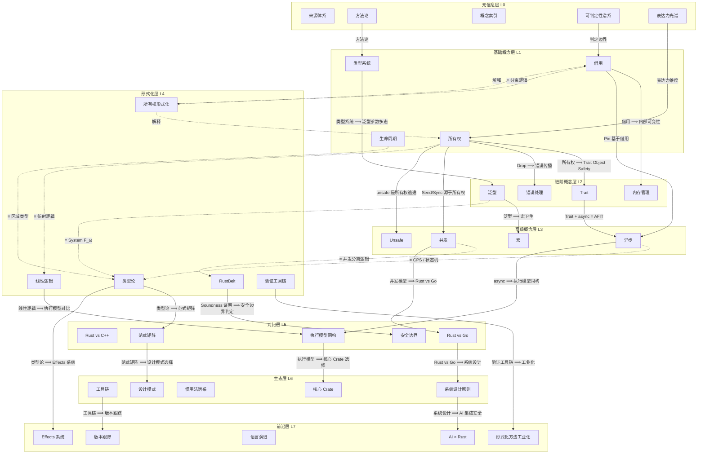
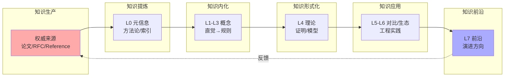
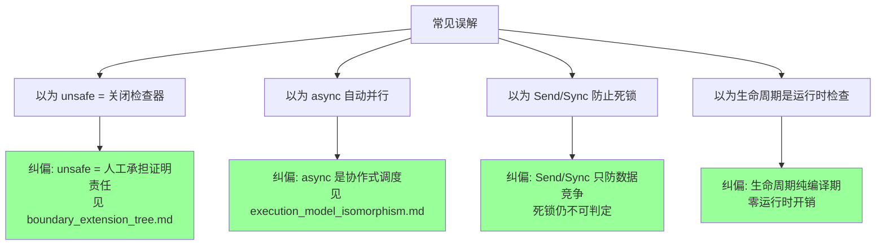

# Rust 知识体系跨层依赖与蕴含拓扑图

> **定位**: 本文件建立 L0-L7 八层架构之间的全局依赖与蕴含关系，回答「学习/理解/验证某一概念时，必须前置掌握什么、可后置推导什么、与什么互斥、与什么同构」。
> **原则**: 每条关系边必须可验证（通过引用具体文件的定理或定义）。
> **符号约定**: `⟹` 蕴含 / `←` 依赖 / `≡` 同构 / `⊘` 互斥 / `↔` 双向映射

---

> **Bloom 层级**: 元（Meta）

**变更日志**:

- v1.0 (2026-05-21): 初始版本——L0-L7 跨层拓扑 + 关系矩阵 + 知识流动图

---

## 📑 目录

- [Rust 知识体系跨层依赖与蕴含拓扑图](#rust-知识体系跨层依赖与蕴含拓扑图)
  - [📑 目录](#-目录)
  - [一、跨层拓扑总图](#一跨层拓扑总图)
  - [二、层次间关系矩阵](#二层次间关系矩阵)
    - [2.1 纵向依赖矩阵（学习路径）](#21-纵向依赖矩阵学习路径)
    - [2.2 横向蕴含矩阵（理论推导）](#22-横向蕴含矩阵理论推导)
    - [2.3 互斥关系矩阵（不可同时成立）](#23-互斥关系矩阵不可同时成立)
  - [三、知识流动图](#三知识流动图)
  - [四、主题-层级交叉映射](#四主题-层级交叉映射)
  - [五、相关概念链接](#五相关概念链接)
  - [六、跨层认知路径（导航指南）](#六跨层认知路径导航指南)
  - [认知路径](#认知路径)
    - [核心推理链](#核心推理链)
    - [反命题与边界](#反命题与边界)

## 一、跨层拓扑总图



> **认知功能**: 本图提供 Rust 知识体系的**全局导航地图**，将八层架构的纵向依赖与横向同构关系可视化。**使用建议**: 在学习新层级前，先定位当前所在层，沿箭头追溯前置依赖，避免知识断层。**关键洞察**: L1-L3 是形式化根基的「现象层」，L4 是它们的「理论层」——每根虚线同构边都是一座从工程直觉通往数学证明的桥。[来源: 💡 原创分析]
> [来源: [TRPL](https://doc.rust-lang.org/book/)]

---

## 二、层次间关系矩阵

### 2.1 纵向依赖矩阵（学习路径）

| 目标层 | 直接依赖层 | 关系类型 | 关键依赖内容 |
|:---|:---|:---:|:---|:---|
| L1 基础 | L0 元信息 | ← | 来源分级、Bloom 层级、方法论 | [来源: 00_meta/methodology.md]
| L2 进阶 | L1 基础 | ← | 所有权 → Trait / 借用 → 内存管理 | [来源: 01_foundation/ 文件群]
| L3 高级 | L1 基础 + L2 进阶 | ← | 所有权+借用 → 并发/异步；泛型 → 宏 | [来源: 03_advanced/ 文件群]
| L4 形式化 | L1-L3 | ≡ | 基础概念的形式化对应（线性逻辑/类型论/分离逻辑） | [来源: 04_formal/ 文件群]
| L5 对比 | L1-L4 | ← | 需要理解 Rust 特性后才能有效对比 | [来源: 05_comparative/ 文件群]
| L6 生态 | L2-L5 | ← | 设计模式需要 Trait/泛型知识；Crate 选择需要对比分析 | [来源: 06_ecosystem/ 文件群]
| L7 前沿 | L4-L6 | ← | Effects 系统需要类型论；工业化需要验证工具链 | [来源: 07_future/ 文件群]

### 2.2 横向蕴含矩阵（理论推导）

| 前提概念 | 蕴含概念 | 关系 | 推理依据 | 所在文件 |
|:---|:---|:---:|:---|:---|
| 所有权唯一性 | Move 语义完备性 | ⟹ | 若值只有一个所有者，则转移所有权后原持有者失效 | `01_ownership.md` T-001 |
| Move 语义 | 无 UAF（Safe Rust） | ⟹ | 转移后原引用不可达，编译期拒绝访问 | `01_ownership.md` T-003 |
| 借用唯一性（AXM） | 无数据竞争（Safe Rust） | ⟹ | `&mut T` 独占保证无并发写；`&T` 共享保证无并发写 | `02_borrowing.md` T-012 |
| `Send` + `Sync` | fearless concurrency | ⟹ | 类型系统保证线程安全，无需运行时检查 | `03_concurrency.md` T-040 |
| 生命周期偏序 | NLL 流敏感安全 | ⟹ | CFG 上活跃性分析保证引用只在有效期间使用 | `03_lifetimes.md` T-021 |
| Trait Coherence | 全局唯一 impl | ⟹ | 孤儿规则保证任意类型+Trait 最多一个 impl | `01_traits.md` T-020 |
| 线性逻辑 `!A` | `Copy` trait | ≡ | `!A` 允许无限复制 ↔ `Copy` 允许按位复制 | `04_linear_logic.md` |
| 分离逻辑 `P * Q` | struct 字段独立 | ≡ | 资源组合 ↔ 结构体字段拥有独立资源 | `04_ownership_formal.md` |

### 2.3 互斥关系矩阵（不可同时成立）

| 概念 A | 概念 B | 关系 | 互斥原因 |
|:---|:---|:---:|:---|
| `&mut T` 借用 | `&mut T` 重叠借用 | ⊘ | AXM：Alias XOR Mutation |
| `&T` 共享借用 | `&mut T` 可变借用 | ⊘ | 同一时间只能存在共享或可变之一 |
| Safe Rust | 任意 UB | ⊘ | Safe Rust 定义上无 UB |
| 全局 HM 推断 | Rust 类型系统 | ⊘ | Rust 故意限制推断保证可判定性 |
| HKT | Rust 当前类型系统 | ⊘ | 无高阶类型多态 |
| 完整依赖类型 | Rust 当前类型系统 | ⊘ | Const Generics 是有意限制的子集 |
| `unsafe` 逃逸 | 编译期安全保证 | ⊘ | `unsafe` 块内编译器不保证安全 |

---

## 三、知识流动图
>



> **认知功能**: 本图揭示知识从权威来源到工程实践的**转化链路**，帮助学习者识别当前处于「消费知识」还是「生产知识」的阶段。
> **使用建议**: 当遇到理解困难时，向上游回溯至 L0 元信息或 L4 形式化层寻找更严密的定义。
> **关键洞察**: L7 前沿通过「反馈」箭头回流至权威来源，形成闭环——这意味着今天的「前沿」就是明天的「基础」。
> [来源: 💡 原创分析]

---

## 四、主题-层级交叉映射

| 主题 | L1 | L2 | L3 | L4 | L5 | L6 | L7 |
|:---|:---|:---|:---|:---|:---|:---|:---|
| **可判定性** | 类型推断 / 借用检查 | Trait 求解 | NLL / CTFE | 停机问题 / Rice | vs Go 可判定性 | Clippy / Miri | Polonius |
| **表达力** | 代数类型 | GATs | async/gen | System F_ω | 七维雷达图 | API 设计 | Effects |
| **惯用法** | match / if let | Trait Bound | Pin / unsafe | — | vs 其他语言 | 七层谱系 | 新语法糖 |
| **执行模型** | — | — | 线程/async | π 演算 / CSP | vs Go 同构性 | Tower / Tokio | 异步 trait |
| **系统设计** | 所有权隐喻 | 零成本抽象 | 并发架构 | TLA+ / RustBelt | 安全边界 | 帕累托前沿 | AI 安全 |

---

## 五、相关概念链接

- [L0 可判定性谱系](decidability_spectrum.md) —— 全链路判定边界
- [L0 表达力多视角](expressiveness_multiview.md) —— 七视角表达力深化
- [L0 概念索引](concept_index.md) —— A-Z 全局概念倒排索引
- [L0 方法论](methodology.md) —— 思维表征规范与认知路径
- [L0 层次内模型映射](intra_layer_model_map.md) —— 同层模型横向关系
- [L0 定理推理森林](theorem_inference_forest.md) —— 模型内定理链
- [L0 边界扩展树](boundary_extension_tree.md) —— 安全边界推演
- [L1 所有权](../01_foundation/01_ownership.md) —— 所有权唯一性定理
- [L1 借用](../01_foundation/02_borrowing.md) —— AXM 定理
- [PLAN.md](../PLAN.md) —— 项目演进计划

## 六、跨层认知路径（导航指南）

> **如何根据当前水平选择正确的学习层级？**

```text
入门级（L0-L1）
    └─ 目标：理解所有权、借用、生命周期、基本类型
    └─ 验证：能独立编写无编译错误的单线程程序
    └─ 时长建议：2-4 周

进阶级（L2-L3）
    └─ 目标：掌握 Trait、泛型、并发、异步、错误处理
    └─ 验证：能设计并发的多模块项目
    └─ 时长建议：4-8 周

高级（L4-L5）
    └─ 目标：理解形式化基础、跨语言对比、安全边界
    └─ 验证：能阅读 RustBelt 论文核心章节，能评估设计决策
    └─ 时长建议：3-6 个月

专家级（L6-L7）
    └─ 目标：掌握生态工具链、参与语言演进讨论、形式化验证
    └─ 验证：能贡献 RFC、编写形式化规约、设计系统架构
    └─ 时长建议：持续
```

> **常见跨层误解与纠偏（反命题树）**:



> **认知功能**: 此图是跨层学习的**常见误解纠偏器**。
> 四个绿色节点标记了 Rust 学习者最典型的认知偏差：
> unsafe = 关闭检查器、async = 自动并行、Send/Sync = 防死锁、生命周期 = 运行时检查。
> 每个纠偏都指向具体文件，形成「发现问题 → 定位纠正资源」的闭环。
> 建议在学完每一层后回查此图，确认自己没有携带这些误解进入下一层。
> 关键认知：跨层误解的本质是「将某一层的保证过度推广到另一层」。 [来源: 💡 原创分析]
> **思维表征说明**: 认知路径回答「**学习者按什么顺序跨层递进**」，反命题树回答「**跨层时最常见的误解是什么**」。
> 二者结合构成完整的「层间导航」——不仅告诉学习者「去哪里」，还告诉学习者「哪里容易迷路」。
> 这与 `intra_layer_model_map.md` 的层内决策树形成互补：前者是纵向导航，后者是横向导航。
> [来源: Bloom 认知层级; 元认知理论 — Flavell 1979]

---

> **文档版本**: 1.1
> **最后更新**: 2026-05-21
> **状态**: ✅ 跨层依赖与蕴含拓扑图 v1.1 — 新增认知路径与反命题树

## 认知路径

> **认知路径**: 本文件作为 Rust 分层知识体系的 **Rust 知识体系跨层依赖与蕴含拓扑图** 元层导航节点，连接概念定义、学习路径与质量评估框架。

### 核心推理链

| 定理 | 前提 | 结论 | 置信度 |
|:---|:---|:---|:---|
| Rust 知识体系跨层依赖与蕴含拓扑图 结构化组织 ⟹ 高效检索 | 理解分类维度与索引关系 | 能快速定位目标概念 | 高 |
| Rust 知识体系跨层依赖与蕴含拓扑图 质量评估 ⟹ 持续改进 | 建立量化指标与审计流程 | 识别知识缺口并优先修复 | 高 |
| Rust 知识体系跨层依赖与蕴含拓扑图 跨层映射 ⟹ 系统掌握 | 打通 L0-L7 的关联路径 | 形成完整的 Rust 能力图谱 | 高 |

> **过渡**: 利用本文件的导航结构，读者可以从当前位置快速跃迁到任意概念层级，实现非线性学习。

> **过渡**: Rust 知识体系跨层依赖与蕴含拓扑图 的维护需要与概念内容同步更新，确保元数据与实际知识体系的一致性。

> **过渡**: 将 Rust 知识体系跨层依赖与蕴含拓扑图 作为学习起点或复习锚点，有助于建立全局视野，避免陷入局部细节而忽视整体架构。

### 反命题与边界

> **反命题**: "元层文档可以替代具体概念学习" —— 错误。Rust 知识体系跨层依赖与蕴含拓扑图 提供的是导航与评估框架，不能替代对核心概念（L1-L5）的深入理解与实践。
