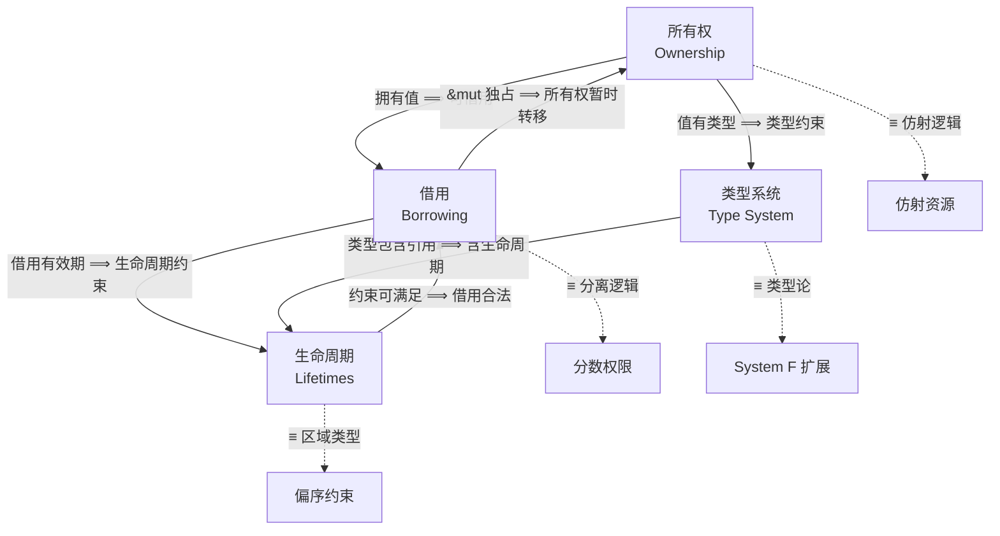
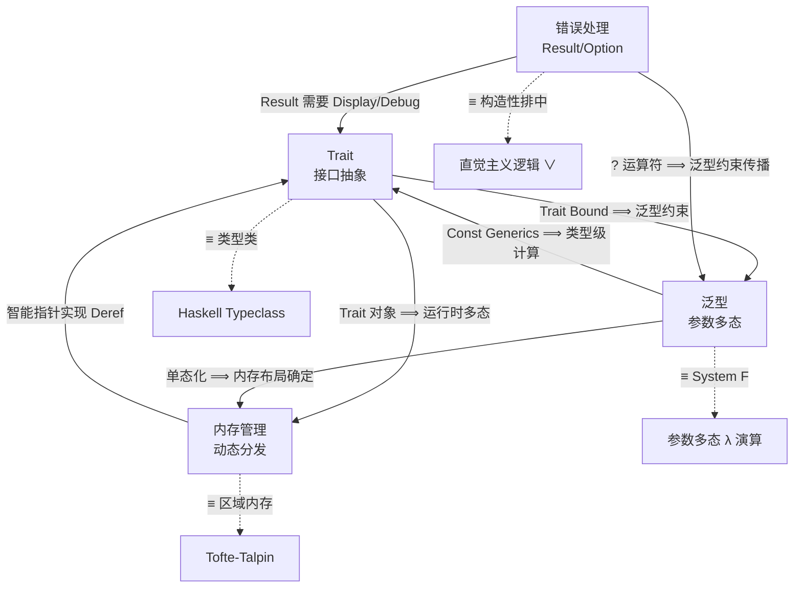
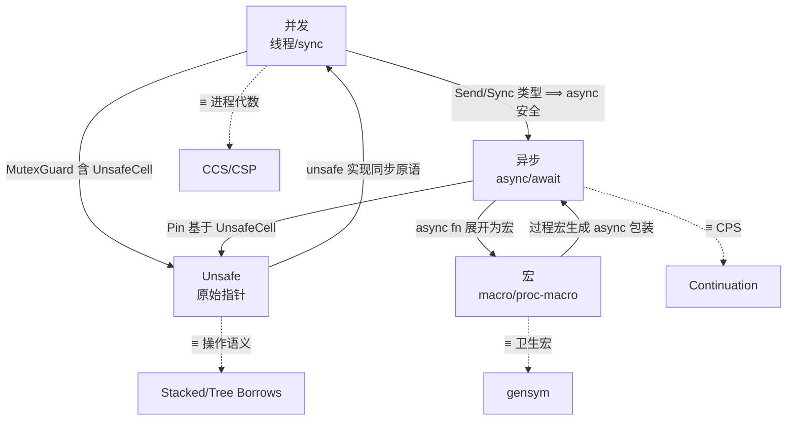
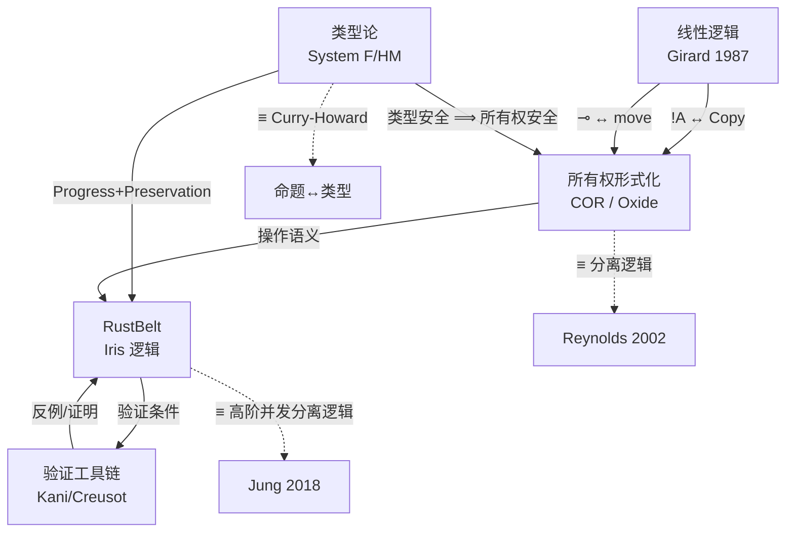
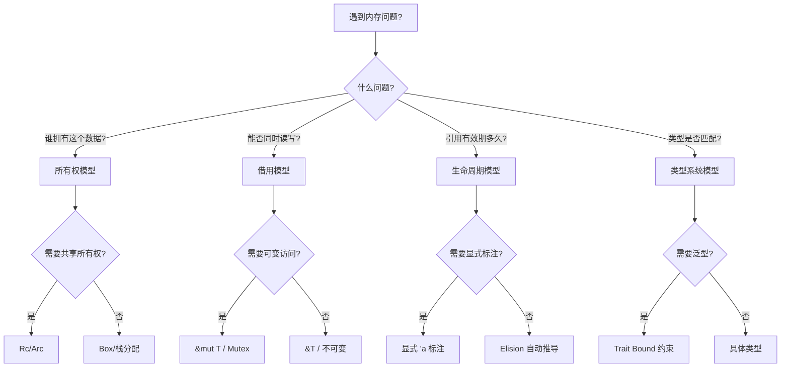

# Rust 知识体系层次内模型间映射图
>
> **EN**: Rust 知识体系层次内模型间映射图 (Chinese)
> **Summary**: Rust 知识体系层次内模型间映射图 (Chinese). Core Rust concept covering mental model building.
>
> **受众**: [进阶]
>
> **Rust 版本**: 1.96.0+ (Edition 2024)

> **定位**: 本文件梳理每一层（L1-L4）内部核心模型之间的等价、蕴含、依赖和互斥关系，回答「同一层级内的概念如何相互定义、相互支撑、相互约束」。
> **原则**: 每个映射必须标注关系类型（≡ 同构 / ⟹ 蕴含 / ← 依赖 / ⊘ 互斥）和形式化依据。
> **符号约定**: 同于 `inter_layer_topology.md`

> **定理链**: N/A — 描述性/综述性/导航性文档，不涉及形式化定理链
---

> **Bloom 层级**: 元（Meta）

**变更日志**:

- v1.0 (2026-05-21): 初始版本——L1-L4 层内模型映射矩阵 + Mermaid 关系图

---

## 📑 目录

- [Rust 知识体系层次内模型间映射图](#rust-知识体系层次内模型间映射图)
  - [📑 目录](#-目录)
  - [一、L1 基础概念层：所有权 · 借用 · 生命周期 · 类型系统](#一l1-基础概念层所有权--借用--生命周期--类型系统)
    - [1.1 四元关系拓扑](#11-四元关系拓扑)
    - [1.2 四元关系矩阵](#12-四元关系矩阵)
  - [二、L2 进阶概念层：Trait · 泛型 · 内存管理 · 错误处理](#二l2-进阶概念层trait--泛型--内存管理--错误处理)
    - [2.1 四元关系拓扑](#21-四元关系拓扑)
    - [2.2 四元关系矩阵](#22-四元关系矩阵)
  - [三、L3 高级概念层：并发 · 异步 · Unsafe · 宏](#三l3-高级概念层并发--异步--unsafe--宏)
    - [3.1 四元关系拓扑](#31-四元关系拓扑)
    - [3.2 四元关系矩阵](#32-四元关系矩阵)
  - [四、L4 形式化层：线性逻辑 · 类型论 · 所有权形式化 · RustBelt · 验证工具链](#四l4-形式化层线性逻辑--类型论--所有权形式化--rustbelt--验证工具链)
    - [4.1 五元关系拓扑](#41-五元关系拓扑)
    - [4.2 五元关系矩阵](#42-五元关系矩阵)
  - [五、模型间映射的形式化核心](#五模型间映射的形式化核心)
    - [5.1 L1-L4 核心同构链](#51-l1-l4-核心同构链)
  - [六、相关概念链接](#六相关概念链接)
  - [五、层内模型认知路径](#五层内模型认知路径)
  - [认知路径](#认知路径)
    - [核心推理链](#核心推理链)
    - [反命题与边界](#反命题与边界)
  - [嵌入式测验（Embedded Quiz）](#嵌入式测验embedded-quiz)
    - [测验 1：本文档《Rust 知识体系层次内模型间映射图》在 Rust 知识体系中属于哪一层级的元数据？（理解层）](#测验-1本文档rust-知识体系层次内模型间映射图在-rust-知识体系中属于哪一层级的元数据理解层)
    - [测验 2：《Rust 知识体系层次内模型间映射图》的主要用途是什么？（理解层）](#测验-2rust-知识体系层次内模型间映射图的主要用途是什么理解层)
    - [测验 3：元数据层文档能否替代 L1-L7 的核心概念学习？（理解层）](#测验-3元数据层文档能否替代-l1-l7-的核心概念学习理解层)

## 一、L1 基础概念层：所有权 · 借用 · 生命周期 · 类型系统

### 1.1 四元关系拓扑



> **认知功能**: 本图将 L1 四大基础模型压缩为**可操作的认知单元**，揭示它们如何相互定义、相互约束。
> [来源: [Rust Reference]]
> **使用建议**: 遇到编译错误时，根据错误类型（所有权/借用/生命周期/类型）定位到对应节点，沿边检查关联模型是否被违反。
> **关键洞察**: 借用合法性同时依赖所有权（来源）和生命周期（时效），这解释了为何 borrow checker 错误常常需要同时调整多个「 seemingly unrelated 」的代码区域。
> [来源: 💡 原创分析]

### 1.2 四元关系矩阵

| 关系 | 模型 A | 模型 B | 关系类型 | 形式化依据 |
|:---|:---|:---|:---:|:---|
| 拥有-借用 | 所有权 | 借用 | ⟹ | 所有者有权出借只读或独占引用 |
| 借用-生命周期 | 借用 | 生命周期 | ← | 借用的合法性由生命周期约束保证 |
| 类型-生命周期 | 类型系统 | 生命周期 | ⟹ | 引用类型 `&'a T` 包含生命周期参数 |
| 所有权-类型 | 所有权 | 类型系统 | ← | 类型的 `Drop` / `Copy` / `Clone` 决定所有权语义 |
| 借用-所有权恢复 | 借用 | 所有权 | ⟹ | 借用结束后所有权归还（自动） |
| 所有权-仿射逻辑 | 所有权 | 仿射逻辑 | ≡ | `own(x)` ↔ 独占资源命题 |
| 借用-分离逻辑 | 借用 | 分离逻辑 | ≡ | `&x` ↔ `borrow(x, 1)`（分数权限） |
| 生命周期-区域类型 | 生命周期 | 区域类型 | ≡ | `'a: 'b` ↔ 区域包含关系 |
| &mut vs &mut | `&mut T`（A） | `&mut T`（B，重叠） | ⊘ | AXM：同一作用域内不允许重叠 `&mut` |

---

## 二、L2 进阶概念层：Trait · 泛型 · 内存管理 · 错误处理

### 2.1 四元关系拓扑



> **认知功能**: 本图展示 L2 进阶概念的**组合威力**——Trait、泛型、内存管理与错误处理不是独立工具，而是相互增强的抽象机制。
> **使用建议**: 设计 API 时，从 Trait 抽象出发，通过泛型参数化，利用错误处理传播约束，最终由内存管理保证资源安全。
> **关键洞察**: `?` 运算符能无缝工作，本质上是错误处理（Result）→ Trait（From）→ 泛型（约束传播）这一链条的工程化封装。[来源: 💡 原创分析]

### 2.2 四元关系矩阵

| 关系 | 模型 A | 模型 B | 关系类型 | 形式化依据 |
|:---|:---|:---|:---:|:---|
| Trait-泛型 | Trait | 泛型 | ⟹ | Trait bound 约束泛型参数的能力 |
| 泛型-内存 | 泛型 | 内存管理 | ⟹ | 单态化后内存布局静态确定 |
| 错误-Trait | 错误处理 | Trait | ← | `Error` trait / `From` trait 支撑 `?` 传播 |
| 内存-Trait | 内存管理 | Trait | ← | `Deref` / `Drop` / `AsRef` 是 Trait |
| Trait-类型类 | Trait | Haskell Typeclass | ≡ | `impl Trait for T` ↔ `instance Trait T` |
| 泛型-System F | 泛型 | System F | ≡ | `<T>` ↔ `ΛT.λx:T` |
| 错误-直觉逻辑 | Result | 直觉主义逻辑 | ≡ | `Ok \| Err` ↔ 构造性析取 |

---

## 三、L3 高级概念层：并发 · 异步 · Unsafe · 宏

### 3.1 四元关系拓扑



> **认知功能**: 本图映射 L3 高级概念的**循环依赖网络**，说明为何并发安全无法脱离 Unsafe 理解，async 也无法脱离宏机制。
> **使用建议**: 在排查 async 性能问题或并发 bug 时，将视线扩展至相邻节点——async 的 Pin 依赖 Unsafe，并发的 Send/Sync 也常由 unsafe 实现。
> **关键洞察**: 这四个概念的虚线同构边全部指向形式化理论（CCS/CSP/CPS/操作语义），表明 L3 的「高级」本质上是「更接近底层语义」。

### 3.2 四元关系矩阵

| 关系 | 模型 A | 模型 B | 关系类型 | 形式化依据 |
|:---|:---|:---|:---:|:---|
| 并发-异步 | 并发 | 异步 | ⟹ | `async` 任务需满足 `Send` 才能跨线程调度 |
| 并发-unsafe | 并发 | Unsafe | ← | `Mutex` / `Atomic` 内部使用 `UnsafeCell` |
| 异步-unsafe | 异步 | Unsafe | ← | `Pin` 的内存稳定性依赖 `unsafe` 契约 |
| 宏-异步 | 宏 | 异步 | ← | `async fn` / `await` 是编译器宏级变换 |
| unsafe-并发 | Unsafe | 并发 | ⟹ | `unsafe impl Send/Sync` 扩展并发边界 |
| 并发-CCS | 并发 | CCS/CSP | ≡ | `thread::spawn` ↔ `P \| Q` |
| 异步-CPS | async/await | CPS | ≡ | `.await` ↔ 续体边界 |
| unsafe-TreeBorrows | Unsafe | Tree Borrows | ≡ | `*ptr` ↔ 树形借用状态机转换 |

---

## 四、L4 形式化层：线性逻辑 · 类型论 · 所有权形式化 · RustBelt · 验证工具链

### 4.1 五元关系拓扑



> **认知功能**: 本图呈现 Rust 安全保证的**数学基础设施**，将抽象的形式化理论转化为可追踪的依赖网络。
> **使用建议**: 当需要为 unsafe 代码编写安全规约时，沿图从 RustBelt 向上追溯至线性逻辑和分离逻辑，找到最匹配的公理系统。
> **关键洞察**: 验证工具链（Kani/Creusot）与 RustBelt 构成「证明-反例」循环——工具链试图自动证明 RustBelt 提出的验证条件，而 RustBelt 的理论边界决定了工具能走多远。

### 4.2 五元关系矩阵

| 关系 | 模型 A | 模型 B | 关系类型 | 形式化依据 |
|:---|:---|:---|:---:|:---|
| 线性逻辑-所有权 | 线性逻辑 | 所有权形式化 | ≡ | `!A` ↔ `Copy` / `A ⊸ B` ↔ `move` |
| 类型论-所有权 | 类型论 | 所有权形式化 | ⟹ | 类型安全 ⟹ 所有权安全（子集关系） |
| 所有权-RustBelt | 所有权形式化 | RustBelt | ⟹ | COR 操作语义 → Iris 资源语义 |
| RustBelt-工具链 | RustBelt | 验证工具链 | ← | 工具链验证 RustBelt 提出的验证条件 |
| 类型论-CH | 类型论 | Curry-Howard | ≡ | 类型 ↔ 命题 / 程序 ↔ 证明 |
| RustBelt-Iris | RustBelt | Iris 逻辑 | ≡ | `own(x)` ↔ Iris 资源命题 |
| 所有权-分离逻辑 | 所有权形式化 | 分离逻辑 | ≡ | `struct` ↔ `P * Q` |

---

## 五、模型间映射的形式化核心

### 5.1 L1-L4 核心同构链

```text
Rust 所有权  ≡  仿射逻辑 !A / A ⊸ B
     ↓
Rust 借用   ≡  分离逻辑 borrow(x, q)  （分数权限 q ∈ {1, ∞}）
     ↓
Rust 生命周期 ≡ 区域类型 κ ⊑ κ'  （偏序约束可满足性）
     ↓
Rust 类型系统 ≡ System F_ω 子集  （参数多态 + 受限高阶）
     ↓
Rust Trait    ≡  Haskell Typeclass  （约束多态 + 字典传递）
     ↓
Rust async    ≡  CPS + 状态机  （无栈协程 = defunctionalized continuation）
     ↓
Rust 并发     ≡  并发分离逻辑  （Iris: own + shr + 协议验证）
```

---

## 六、相关概念链接

- [跨层依赖拓扑](inter_layer_topology.md) —— L0-L7 纵向关系
- [定理推理森林](theorem_inference_forest.md) —— 模型内定理链
- [边界扩展树](boundary_extension_tree.md) —— 安全边界推演
- [L1 所有权](../01_foundation/01_ownership.md)
- [L1 借用](../01_foundation/02_borrowing.md)
- [L4 线性逻辑](../04_formal/01_linear_logic.md)
- [L4 所有权形式化](../04_formal/03_ownership_formal.md)

## 五、层内模型认知路径

> **如何在同一层级内选择正确的模型？**——以 L1 基础层为例的决策路径。



> **认知功能**: 此决策树是层内模型选择的**可操作导航器**。面对具体问题时（如「内存泄漏」「并发冲突」「类型不匹配」），按图从左到右回答问题即可定位到正确的 Rust 机制。
> 它将抽象的「模型映射」转化为工程师可执行的诊断流程。
> 关键认知：同一层内的概念不是孤立的——所有权、借用、生命周期、类型系统形成相互定义的网络，此决策树将这个网络的「遍历路径」显性化。
> 建议在调试时作为「问题分类 → 机制匹配」的检查清单。 [来源: 💡 原创分析]
> **思维表征说明**: 此决策树是**层内模型选择的认知导航**——与跨层的 `inter_layer_topology.md` 不同，它回答「在同一层级（如 L1）内，面对具体问题时应该选择哪个模型」。
> 每个决策节点对应一个工程问题，叶子节点对应具体机制。这是将「模型映射」转化为「可操作判断」的关键步骤。
> [来源: 认知负荷理论 — Sweller 1988; 决策树方法论]

---

> **文档版本**: 1.1
> **最后更新**: 2026-05-21
> **状态**: ✅ 层次内模型间映射图 v1.1 — 新增认知路径决策树

## 认知路径

> **认知路径**: 本文件作为 Rust 分层知识体系的 **Rust 知识体系层次内模型间映射图** 元层导航节点，连接概念定义、学习路径与质量评估框架。

### 核心推理链

| 定理 | 前提 | 结论 | 置信度 |
|:---|:---|:---|:---|
| 模型间等价关系 ⟹ 跨视角推理可迁移 | 本文件定义了元层结构 | 支持上层概念定位 | 高 |

> **过渡**: 利用本文件的导航结构，读者可以从当前位置快速跃迁到任意概念层级，实现非线性学习。

> **过渡**: Rust 知识体系层次内模型间映射图 的维护需要与概念内容同步更新，确保元数据与实际知识体系的一致性。

> **过渡**: 将 Rust 知识体系层次内模型间映射图 作为学习起点或复习锚点，有助于建立全局视野，避免陷入局部细节而忽视整体架构。

### 反命题与边界

> **反命题**: "元层文档可以替代具体概念学习" —— 错误。Rust 知识体系层次内模型间映射图 提供的是导航与评估框架，不能替代对核心概念（L1-L5）的深入理解与实践。
> **内容分级**: [综述级]

## 嵌入式测验（Embedded Quiz）

### 测验 1：本文档《Rust 知识体系层次内模型间映射图》在 Rust 知识体系中属于哪一层级的元数据？（理解层）

**题目**: 本文档《Rust 知识体系层次内模型间映射图》在 Rust 知识体系中属于哪一层级的元数据？

<details>
<summary>✅ 答案与解析</summary>

属于 00_meta 元数据层，为整个知识体系提供导航、评估、审计和结构化的支持框架，辅助学习者定位和理解核心概念。
</details>

---

### 测验 2：《Rust 知识体系层次内模型间映射图》的主要用途是什么？（理解层）

**题目**: 《Rust 知识体系层次内模型间映射图》的主要用途是什么？

<details>
<summary>✅ 答案与解析</summary>

作为知识体系的支撑文档，提供学习路径导航、概念关系映射、质量评估标准或审计检查清单，帮助学习者和维护者高效使用知识库。
</details>

---

### 测验 3：元数据层文档能否替代 L1-L7 的核心概念学习？（理解层）

**题目**: 元数据层文档能否替代 L1-L7 的核心概念学习？

<details>
<summary>✅ 答案与解析</summary>

不能。元数据层提供导航和评估框架，但不能替代对核心概念（所有权、类型系统、并发等）的深入理解与实践。
</details>
