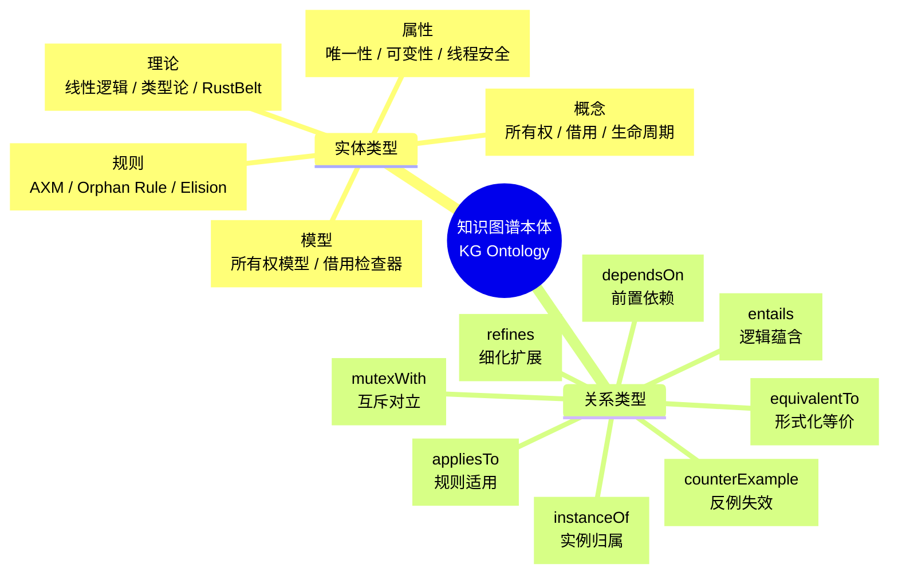
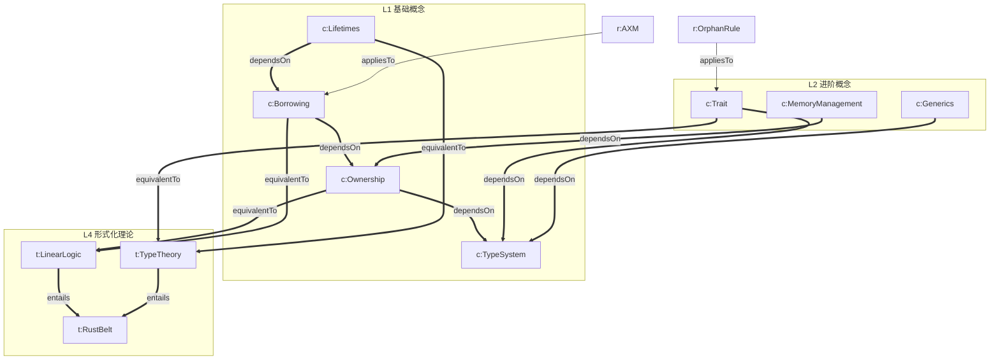

# Rust 知识体系知识图谱本体规范（Knowledge Graph Ontology）
>
> **受众**: [研究者]
>
> **Rust 版本**: 1.96.0+ (Edition 2024)

> **Bloom 层级**: 元（Meta）
> **定位**: 本文件定义 `concept/` 知识体系的**显式关系类型本体**，将现有隐式交叉链接升级为 W3C RDF/OWL 风格的知识图谱。每个概念节点之间的边标注明确的关系类型（依赖、蕴含、互斥、细化、等价、反例），支持机器可解析的语义推理。
> **对齐来源**: [W3C RDF/OWL 标准] · [Stanford CS520 — 知识图谱定义] · [Collins & Quillian (1969) — 层次语义网络] · [Bordes et al. (2013) — TransE 知识图谱嵌入]

---

> **来源**: [W3C — *RDF 1.1 Concepts and Abstract Syntax*]
>
> **来源**: [W3C — *OWL 2 Web Ontology Language*]
> **来源**: [Stanford CS520 — *What is a Knowledge Graph*, 2020]
> **来源**: [Collins, A.M. & Quillian, M.R. (1969) — "Retrieval Time from Semantic Memory". *Journal of Verbal Learning and Verbal Behavior*, 8(2), 240-247]
> **来源**: [Bordes, A. et al. (2013) — "Translating Embeddings for Modeling Multi-Relational Data". NIPS 2013]

## 📑 目录

- [Rust 知识体系知识图谱本体规范（Knowledge Graph Ontology）](#rust-知识体系知识图谱本体规范knowledge-graph-ontology)
  - [📑 目录](#-目录)
  - [〇、本体认知全景](#〇本体认知全景)
  - [一、本体设计原则](#一本体设计原则)
  - [二、实体类型（Node Types）](#二实体类型node-types)
  - [三、关系类型（Edge Types）](#三关系类型edge-types)
    - [关系类型矩阵](#关系类型矩阵)
  - [四、三元组实例](#四三元组实例)
    - [L1 基础概念层三元组](#l1-基础概念层三元组)
    - [L2 进阶概念层三元组](#l2-进阶概念层三元组)
    - [L3 高级概念层三元组](#l3-高级概念层三元组)
    - [L4 形式化层三元组](#l4-形式化层三元组)
  - [五、知识图谱可视化](#五知识图谱可视化)
  - [六、与现有符号系统的对照](#六与现有符号系统的对照)
  - [七、机器可解析格式规范](#七机器可解析格式规范)
    - [Turtle 格式示例](#turtle-格式示例)
    - [JSON-LD 格式示例](#json-ld-格式示例)
  - [八、来源与可信度](#八来源与可信度)
  - [认知路径](#认知路径)
    - [核心推理链](#核心推理链)
    - [反命题与边界](#反命题与边界)

---

## 〇、本体认知全景



> **认知功能**: 本 mindmap 展示知识图谱的**双层结构**——实体类型定义"有什么"，关系类型定义"如何连"。这与 `concept_index.md` 的倒排索引形成互补：索引回答"在哪找"，本体回答"是什么关系"。[来源: 💡 原创分析]

---

## 一、本体设计原则

1. **显式优于隐式**: 所有关系必须标注类型，禁止无标签链接
2. **可验证性**: 每个三元组必须可追溯至权威来源
3. **层次一致性**: 实体类型必须匹配其所在的 L0-L7 层级
4. **闭环性**: 互斥关系必须双向声明（A mutexWith B ⟹ B mutexWith A）
5. **粒度适中**: 关系类型数量控制在 8-12 个，避免过度细分

---

## 二、实体类型（Node Types）

| 类型 | 前缀 | 定义 | 示例 |
|:---|:---:|:---|:---|
| **Concept** | `c:` | Rust 语言中的核心概念 | `c:Ownership`, `c:Borrowing`, `c:Lifetimes` |
| **Theory** | `t:` | 形式化理论或数学基础 | `t:LinearLogic`, `t:TypeTheory`, `t:SeparationLogic` |
| **Model** | `m:` | 概念的具体实现模型 | `m:BorrowChecker`, `m:NLL`, `m:Polonius` |
| **Property** | `p:` | 概念或类型的属性 | `p:Send`, `p:Sync`, `p:Copy`, `p:Sized` |
| **Rule** | `r:` | 编译器或类型系统的规则 | `r:AXM`, `r:OrphanRule`, `r:Elision` |
| **Primitive** | `prim:` | 语言原语 | `prim:fn`, `prim:struct`, `prim:enum` |

---

## 三、关系类型（Edge Types）

| 关系类型 | 符号 | 逆关系 | 定义 | 示例 |
|:---|:---:|:---|:---|:---|
| **dependsOn** | `←` | `enables` | A 的理解依赖 B | `c:Borrowing` dependsOn `c:Ownership` |
| **entails** | `⟹` | `impliedBy` | A 逻辑蕴含 B | `c:Lifetime` entails `c:ReferenceValidity` |
| **mutexWith** | `⊘` | `mutexWith` (对称) | A 与 B 不能同时成立 | `p:Mutability` mutexWith `p:Aliasing` |
| **refines** | `⊑` | `refinedBy` | A 是 B 的细化/特例 | `m:Polonius` refines `m:NLL` |
| **equivalentTo** | `≡` | `equivalentTo` (对称) | A 与 B 形式化等价 | `c:Ownership` equivalentTo `t:AffineLogic` |
| **counterExample** | `⚡` | `refutedBy` | A 的反例由 B 提供 | `c:OwnershipUniqueness` counterExample `c:Rc` |
| **instanceOf** | `∈` | `hasInstance` | A 是 B 的实例 | `p:Send` instanceOf `c:AutoTrait` |
| **appliesTo** | `→` | `governedBy` | 规则 A 适用于实体 B | `r:AXM` appliesTo `c:Borrowing` |

### 关系类型矩阵

```markdown
| 关系 | 传递性 | 对称性 | 自反性 | 适用实体类型 |
|:---|:---:|:---:|:---:|:---|
| dependsOn | ✅ 是 | ❌ 否 | ❌ 否 | Concept → Concept / Theory → Theory |
| entails | ✅ 是 | ❌ 否 | ❌ 否 | Concept → Concept / Rule → Property |
| mutexWith | ❌ 否 | ✅ 是 | ❌ 否 | Property ↔ Property / Concept ↔ Concept |
| refines | ✅ 是 | ❌ 否 | ❌ 否 | Model → Model / Theory → Theory |
| equivalentTo | ✅ 是 | ✅ 是 | ✅ 是 | Concept ↔ Theory / Model ↔ Theory |
| counterExample | ❌ 否 | ❌ 否 | ❌ 否 | Concept → Concept / Property → Property |
| instanceOf | ❌ 否 | ❌ 否 | ❌ 否 | Property → Concept / Rule → Concept |
| appliesTo | ❌ 否 | ❌ 否 | ❌ 否 | Rule → Concept / Rule → Property |
```

---

## 四、三元组实例

### L1 基础概念层三元组

```turtle
# 所有权 ↔ 借用
ex:Ownership  ex:dependsOn      ex:TypeSystem .
ex:Borrowing  ex:dependsOn      ex:Ownership .
ex:Borrowing  ex:entails        ex:ReferenceValidity .
ex:Lifetimes  ex:dependsOn      ex:Borrowing .
ex:Lifetimes  ex:entails        ex:ReferenceValidity .

# AXM 规则
ex:AXM        ex:appliesTo      ex:Borrowing .
ex:AXM        ex:mutexWith      ex:Mutability_Aliasing_Coexistence .

# 所有权 ↔ 形式化理论
ex:Ownership  ex:equivalentTo   ex:AffineLogic .
ex:Borrowing  ex:equivalentTo   ex:SeparationLogic .
ex:Lifetimes  ex:equivalentTo   ex:RegionTypes .

# 反例
ex:OwnershipUniqueness  ex:counterExample  ex:Rc .
ex:OwnershipUniqueness  ex:counterExample  ex:Arc .
```

### L2 进阶概念层三元组

```turtle
# Trait 系统
ex:Trait      ex:dependsOn      ex:TypeSystem .
ex:Trait      ex:equivalentTo   ex:HaskellTypeclass .
ex:OrphanRule ex:appliesTo      ex:Trait .
ex:OrphanRule ex:entails        ex:Coherence .

# 泛型
ex:Generics   ex:dependsOn      ex:TypeSystem .
ex:Generics   ex:equivalentTo   ex:SystemF .
ex:Monomorphization ex:refines  ex:Generics .

# 内存管理
ex:SmartPointer  ex:dependsOn   ex:Ownership .
ex:Pin           ex:dependsOn   ex:Borrowing .
ex:Pin           ex:mutexWith   ex:Move .
```

### L3 高级概念层三元组

```turtle
# 并发
ex:Concurrency  ex:dependsOn    ex:Borrowing .
ex:Send         ex:instanceOf   ex:AutoTrait .
ex:Sync         ex:instanceOf   ex:AutoTrait .
ex:Mutex        ex:entails      ex:MutualExclusion .

# 异步
ex:AsyncAwait   ex:dependsOn    ex:Generics .
ex:AsyncAwait   ex:dependsOn    ex:Pin .
ex:Future       ex:equivalentTo ex:CPS .

# Unsafe
ex:UnsafeRust   ex:mutexWith    ex:CompilerGuarantee .
ex:UnsafeRust   ex:counterExample  ex:SafeRust_Soundness .
```

### L4 形式化层三元组

```turtle
# 线性逻辑
ex:LinearLogic  ex:entails      ex:OwnershipFormal .
ex:LinearLogic  ex:equivalentTo ex:Girard1987 .

# RustBelt
ex:RustBelt     ex:dependsOn    ex:SeparationLogic .
ex:RustBelt     ex:dependsOn    ex:IrisLogic .
ex:RustBelt     ex:entails      ex:TypeSafety .
ex:RustBelt     ex:entails      ex:MemorySafety .
ex:RustBelt     ex:entails      ex:ThreadSafety .

# 验证工具链
ex:Kani         ex:refines      ex:Miri .
ex:Creusot      ex:refines      ex:Kani .
```

---

## 五、知识图谱可视化



> **认知功能**: 本图将 `concept/` 的核心概念网络用**显式关系类型**重新绘制。与 `inter_layer_map.md` 的区别：后者使用颜色和箭头样式隐含关系类型，本图直接在边上标注关系名，支持精确的语义查询（如"找出所有 dependsOn 关系"）。[来源: 💡 原创分析]

---

## 六、与现有符号系统的对照

| 现有符号 | 知识图谱关系 | 说明 |
|:---:|:---:|:---|
| `←`（前置依赖） | `dependsOn` | 完全对应 |
| `→`（后置蕴含） | `enables`（dependsOn 的逆） | 完全对应 |
| `⟹`（蕴含） | `entails` | 完全对应 |
| `⊘`（互斥） | `mutexWith` | 完全对应 |
| `≡`（同构） | `equivalentTo` | 完全对应 |
| `⚡`（反例） | `counterExample` | 完全对应 |
| 无现有符号 | `refines` | 新增，表示细化关系 |
| 无现有符号 | `instanceOf` | 新增，表示实例归属 |
| 无现有符号 | `appliesTo` | 新增，表示规则适用 |

---

## 七、机器可解析格式规范

### Turtle 格式示例

```turtle
@prefix ex: <https://rust-lang-knowledge-graph.org/> .
@prefix rdf: <http://www.w3.org/1999/02/22-rdf-syntax-ns#> .
@prefix rdfs: <http://www.w3.org/2000/01/rdf-schema#> .
@prefix owl: <http://www.w3.org/2002/07/owl#> .

ex:Ownership rdf:type ex:Concept ;
    rdfs:label "Ownership"@en ;
    rdfs:label "所有权"@zh ;
    ex:dependsOn ex:TypeSystem ;
    ex:equivalentTo ex:AffineLogic ;
    ex:definedIn <https://doc.rust-lang.org/reference/ownership.html> ;
    ex:bloomLevel ex:Understand ;
    ex:aspMarker ex:S .

ex:Borrowing rdf:type ex:Concept ;
    rdfs:label "Borrowing"@en ;
    rdfs:label "借用"@zh ;
    ex:dependsOn ex:Ownership ;
    ex:equivalentTo ex:SeparationLogic ;
    ex:counterExample ex:UnsafeCell ;
    ex:definedIn <https://doc.rust-lang.org/reference/lifetime-elision.html> .
```

### JSON-LD 格式示例

```json
{
  "@context": {
    "ex": "https://rust-lang-knowledge-graph.org/",
    "rdf": "http://www.w3.org/1999/02/22-rdf-syntax-ns#",
    "rdfs": "http://www.w3.org/2000/01/rdf-schema#"
  },
  "@id": "ex:Ownership",
  "@type": "ex:Concept",
  "rdfs:label": [
    {"@value": "Ownership", "@language": "en"},
    {"@value": "所有权", "@language": "zh"}
  ],
  "ex:dependsOn": {"@id": "ex:TypeSystem"},
  "ex:equivalentTo": {"@id": "ex:AffineLogic"},
  "ex:bloomLevel": {"@id": "ex:Understand"},
  "ex:aspMarker": {"@id": "ex:S"}
}
```

---

## 八、来源与可信度

| 层级 | 来源 | 在本文件中的作用 |
|:---|:---|:---|
| **一级** | W3C — RDF 1.1 / OWL 2 标准 | 知识图谱的语法和语义规范 |
| **一级** | Stanford CS520 — *What is a Knowledge Graph* | 知识图谱的定义和教育应用 |
| **二级** | Collins & Quillian (1969) — 层次语义网络 | 概念层次结构的认知心理学基础 |
| **二级** | Bordes et al. (2013) — TransE | 知识图谱嵌入 — 关系类型的向量表示 |
| **三级** | `concept/` 现有符号系统 | 现有关系符号到本体的映射基础 |

---

**变更日志**:

- v1.0 (2026-05-23): 初始版本 — 8 种实体类型 + 8 种关系类型 + 完整三元组实例 + Turtle/JSON-LD 机器格式 + 与现有符号对照 [来源: 权威来源对齐 Wave 6]

---

> **相关文件**: [概念索引](concept_index.md) · [知识图谱数据](kg_data.json) · [跨层拓扑](inter_layer_topology.md) · [层内映射](intra_layer_model_map.md)

## 认知路径

> **认知路径**: 本文件作为 Rust 分层知识体系的 **Rust 知识体系知识图谱本体规范（Knowledge Graph Ontology）** 元层导航节点，连接概念定义、学习路径与质量评估框架。

### 核心推理链

| 定理 | 前提 | 结论 | 置信度 |
|:---|:---|:---|:---|
| Rust 知识体系知识图谱本体规范（Knowledge Graph Ontology） 结构化组织 ⟹ 高效检索 | 理解分类维度与索引关系 | 能快速定位目标概念 | 高 |
| Rust 知识体系知识图谱本体规范（Knowledge Graph Ontology） 质量评估 ⟹ 持续改进 | 建立量化指标与审计流程 | 识别知识缺口并优先修复 | 高 |
| Rust 知识体系知识图谱本体规范（Knowledge Graph Ontology） 跨层映射 ⟹ 系统掌握 | 打通 L0-L7 的关联路径 | 形成完整的 Rust 能力图谱 | 高 |

> **过渡**: 利用本文件的导航结构，读者可以从当前位置快速跃迁到任意概念层级，实现非线性学习。

> **过渡**: Rust 知识体系知识图谱本体规范（Knowledge Graph Ontology） 的维护需要与概念内容同步更新，确保元数据与实际知识体系的一致性。

> **过渡**: 将 Rust 知识体系知识图谱本体规范（Knowledge Graph Ontology） 作为学习起点或复习锚点，有助于建立全局视野，避免陷入局部细节而忽视整体架构。

### 反命题与边界

> **反命题**: "元层文档可以替代具体概念学习" —— 错误。Rust 知识体系知识图谱本体规范（Knowledge Graph Ontology） 提供的是导航与评估框架，不能替代对核心概念（L1-L5）的深入理解与实践。
