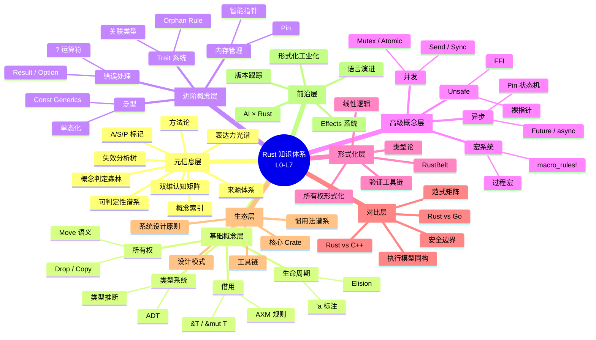
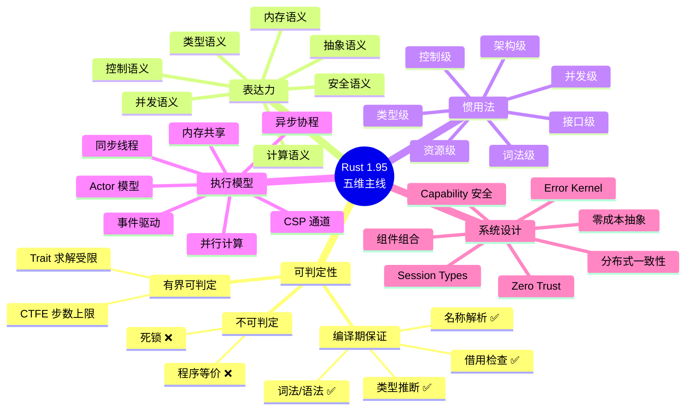

# Rust 知识体系全局思维导图（Knowledge Mindmap）
> **EN**: Rust 知识体系全局思维导图（Knowledge Mindmap） (Chinese)
> **Summary**: **变更日志**: - v1.0 (2026-05-21): 初始版本——L0-L7 全局 mindmap + 五维主线 mindmap - [Rust 知识体系全局思维导图（Knowledge Mindmap）](#rust-知识体系全局思维导图knowledge-mindmap) - [📑 目录](#-目录) - [一、L0-L7 全局知识体系 Mindmap](#一l0-l7-全局知识体系-mindmap) - [二、五维主线 Mindmap](#二五维主线-mindmap) - [三、Mindmap 与四层关系图谱的关联](#三mindmap-与四层关系图谱的关联) - [四、相关概念

> **受众**: [进阶]
> **定位**: 本文件是 `concept/` 知识体系的**认知入口**——用 Mermaid `mindmap` 语法将整个 L0-L7 知识体系浓缩为一张可导航的思维导图，帮助学习者建立全局认知地图。
> **原则**: 不做"内容重复"，聚焦"结构导航"——每个节点链接到对应的具体文件。
> **使用方法**: 在支持 Mermaid 的 Markdown 阅读器中查看，点击节点 mentally 定位到对应主题。

> **定理链**: N/A — 描述性/综述性/导航性文档，不涉及形式化定理链
---

> **Bloom 层级**: 记忆 → 理解

**变更日志**:

- v1.0 (2026-05-21): 初始版本——L0-L7 全局 mindmap + 五维主线 mindmap

---

## 📑 目录

- [Rust 知识体系全局思维导图（Knowledge Mindmap）](#rust-知识体系全局思维导图knowledge-mindmap)
  - [📑 目录](#-目录)
  - [一、L0-L7 全局知识体系 Mindmap](#一l0-l7-全局知识体系-mindmap)
  - [二、五维主线 Mindmap](#二五维主线-mindmap)
  - [三、Mindmap 与四层关系图谱的关联](#三mindmap-与四层关系图谱的关联)
  - [四、相关概念链接](#四相关概念链接)
  - [认知路径](#认知路径)
    - [核心推理链](#核心推理链)
    - [反命题与边界](#反命题与边界)

## 一、L0-L7 全局知识体系 Mindmap

> **认知功能**: 此 mindmap 是知识体系的**全局鸟瞰图**。
> [来源: [Wikipedia — Knowledge Graph]]
> 放射式结构帮助学习者在 30 秒内建立「我在哪里」的空间定位——中心是 Rust 知识体系根节点，第一层放射是 L0-L7 八层架构，第二层放射是每层核心主题。
> 建议作为每日打开的第一页，快速扫视建立全局感后再深入具体文件。
> 关键认知：mindmap 不是「知识清单」，而是「认知地图」——它回答的不是「学什么」，而是「从哪开始学、学到哪一层、与什么关联」。
> [来源: 💡 原创分析]
> **思维表征说明**: `mindmap` 是 Mermaid 的**思维导图**语法，与 `graph TD` 流程图完全不同——它以**中心放射状**组织信息，强调「从整体到局部」的认知顺序。
> 此图是知识体系的「鸟瞰图」：中心是 Rust 知识体系根节点，第一层放射是 L0-L7 八层架构，第二层放射是每层核心主题。
> 学习者可以「由外向内」快速定位自己当前的学习位置。 [来源: Tony Buzan, *The Mind Map Book*; 认知心理学 — 组块化理论]

---

## 二、五维主线 Mindmap

> **认知功能**: 此 mindmap 从**五维主线**视角重组知识体系——不是按 L0-L7 的纵向层次，而是按「可判定性—表达力—惯用法—执行模型—系统设计」的横向维度。
> 它与上面的 L0-L7 mindmap 形成互补：前者帮助「按层次递进」，后者帮助「按主题深入」。
> 当学习者在某个维度上遇到瓶颈时，可切换到另一个 mindmap 寻找关联概念。
> 关键认知：五维主线是知识体系的「另一种索引」——同一概念可从层次视角（L1-L7）和主题视角（五维）两个维度访问，建立这种双向索引是深度理解的标志。
> **思维表征说明**: 此 mindmap 从**五维主线**视角重组知识体系——不是按 L0-L7 的纵向层次，而是按「可判定性—表达力—惯用法—执行模型—系统设计」的横向维度。
> 两个 mindmap 形成互补：前者帮助学习者「按层次递进」，后者帮助学习者「按主题深入」。
> 当学习者在某个维度上遇到瓶颈时，可以切换到另一个 mindmap 寻找关联概念。
> [来源: 多维记忆理论 — 双编码理论 Paivio 1986]

---

## 三、Mindmap 与四层关系图谱的关联
>

| 表征文件 | 认知功能 | 适用场景 |
|:---|:---|:---|
| `knowledge_mindmap.md`（本文件） | **全局鸟瞰** — 快速定位主题 | 初学者入门、复习时建立整体感 |
| `inter_layer_topology.md` | **纵向导航** — 层间依赖关系 | 理解概念前置条件、学习路径规划 |
| `intra_layer_model_map.md` | **横向导航** — 层内模型选择 | 解决具体问题时选择正确模型 |
| `theorem_inference_forest.md` | **深度验证** — 公理→定理链 | 形式化验证、学术写作、深度理解 |
| `boundary_extension_tree.md` | **边界意识** — 安全边界扩展 | 评估代码风险、unsafe 使用决策 |

> **使用建议**: 将本 mindmap 作为**每日打开的第一页**——30 秒浏览建立全局感，然后根据当前任务跳转到对应的导航文件（纵向/横向/深度/边界）。

## 四、相关概念链接
>
>

- [跨层依赖拓扑](./inter_layer_topology.md) —— L0-L7 纵向导航
- [层内模型映射](./intra_layer_model_map.md) —— 同层模型横向选择
- [定理推理森林](./theorem_inference_forest.md) —— 公理→定理深度验证
- [边界扩展树](./boundary_extension_tree.md) —— 安全边界风险评估
- [可判定性谱系](./decidability_spectrum.md) —— 编译期判定边界
- [表达力多视角](./expressiveness_multiview.md) —— 七视角表达力分析
- [L1 所有权](../01_foundation/01_ownership.md) —— 所有权唯一性
- [L3 异步](../03_advanced/02_async.md) —— async/await 状态机
- [表达力多视角](expressiveness_multiview.md) —— 七视角表达力分析

---

> **权威来源**: [Tony Buzan, *The Mind Map Book*] · [认知心理学组块化理论 — Miller 1956] · [双编码理论 — Paivio 1986]
>
> **文档版本**: 1.1
> **最后更新**: 2026-05-21
> **状态**: ✅ 全局思维导图 v1.1 — 新增相关概念链接

> **权威来源**: [Rust Reference](https://doc.rust-lang.org/reference/) · [The Rust Programming Language](https://doc.rust-lang.org/book/) · [Rust Standard Library](https://doc.rust-lang.org/std/)
> **对应 Rust 版本**: 1.96.0+ (Edition 2024)

## 认知路径

> **认知路径**: 本文件作为 Rust 分层知识体系的 **Rust 知识体系全局思维导图（Knowledge Mindmap）** 元层导航节点，连接概念定义、学习路径与质量评估框架。

### 核心推理链

| 定理 | 前提 | 结论 | 置信度 |
|:---|:---|:---|:---|
| Knowledge Mindmap 结构化定义 ⟹ 学习者认知锚点可建立 | 本文件定义了元层结构 | 支持上层概念定位 | 高 |

> **过渡**: 利用本文件的导航结构，读者可以从当前位置快速跃迁到任意概念层级，实现非线性学习。

> **过渡**: Rust 知识体系全局思维导图（Knowledge Mindmap） 的维护需要与概念内容同步更新，确保元数据与实际知识体系的一致性。

> **过渡**: 将 Rust 知识体系全局思维导图（Knowledge Mindmap） 作为学习起点或复习锚点，有助于建立全局视野，避免陷入局部细节而忽视整体架构。

### 反命题与边界

> **反命题**: "元层文档可以替代具体概念学习" —— 错误。Rust 知识体系全局思维导图（Knowledge Mindmap） 提供的是导航与评估框架，不能替代对核心概念（L1-L5）的深入理解与实践。
> **内容分级**: [综述级]
