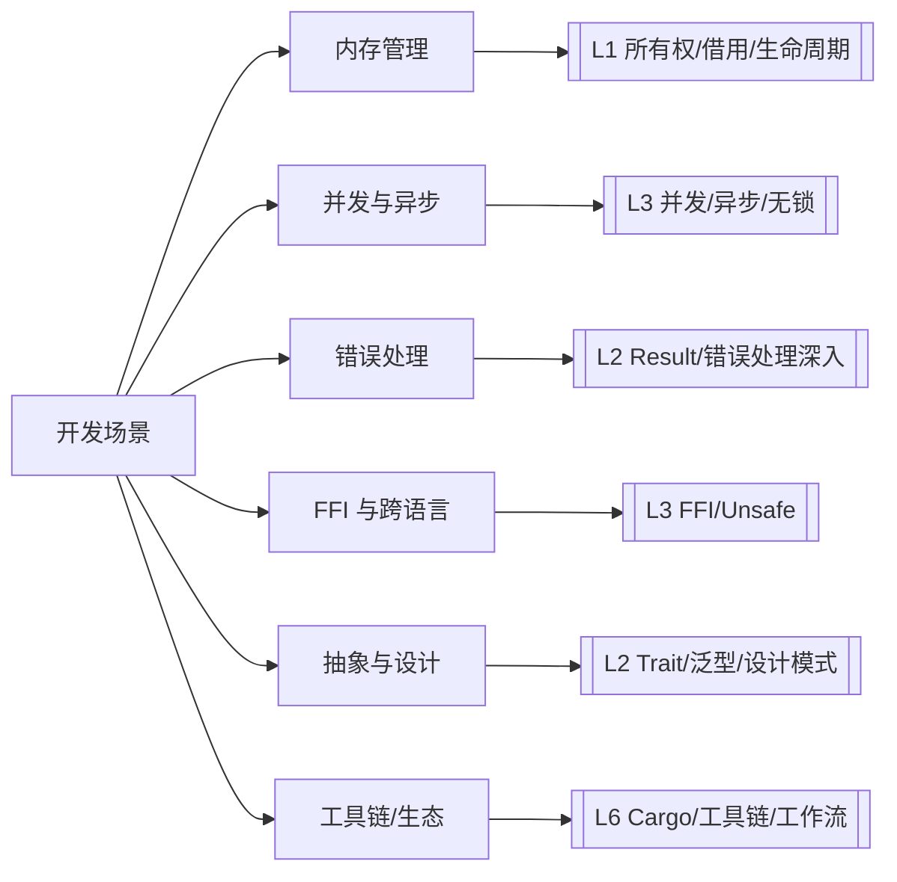
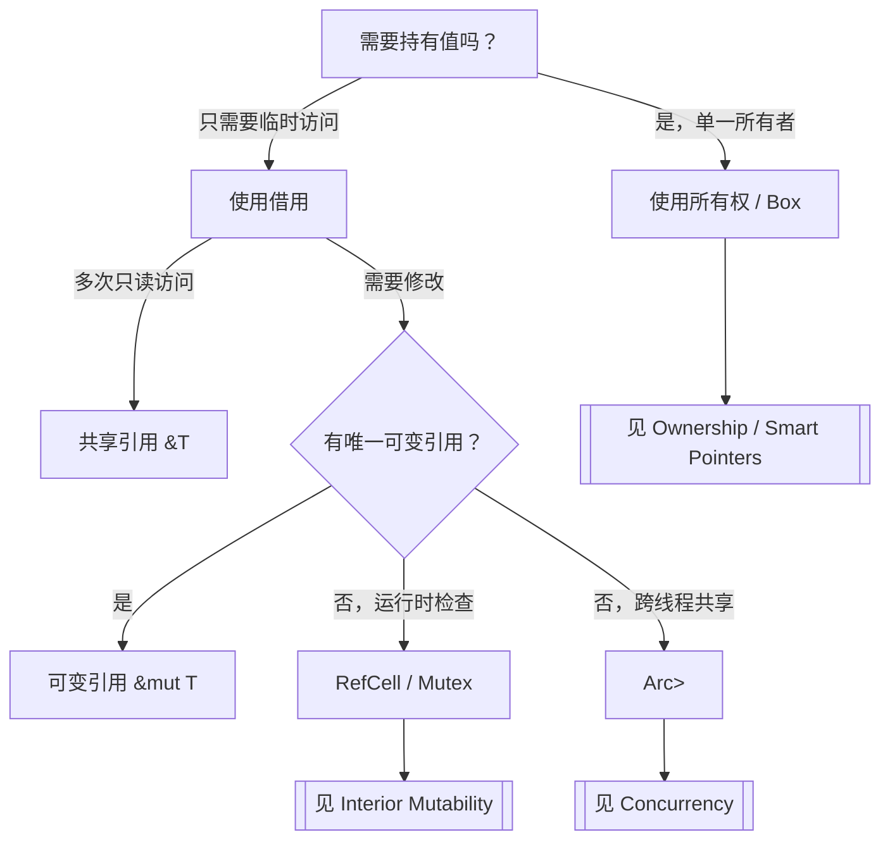
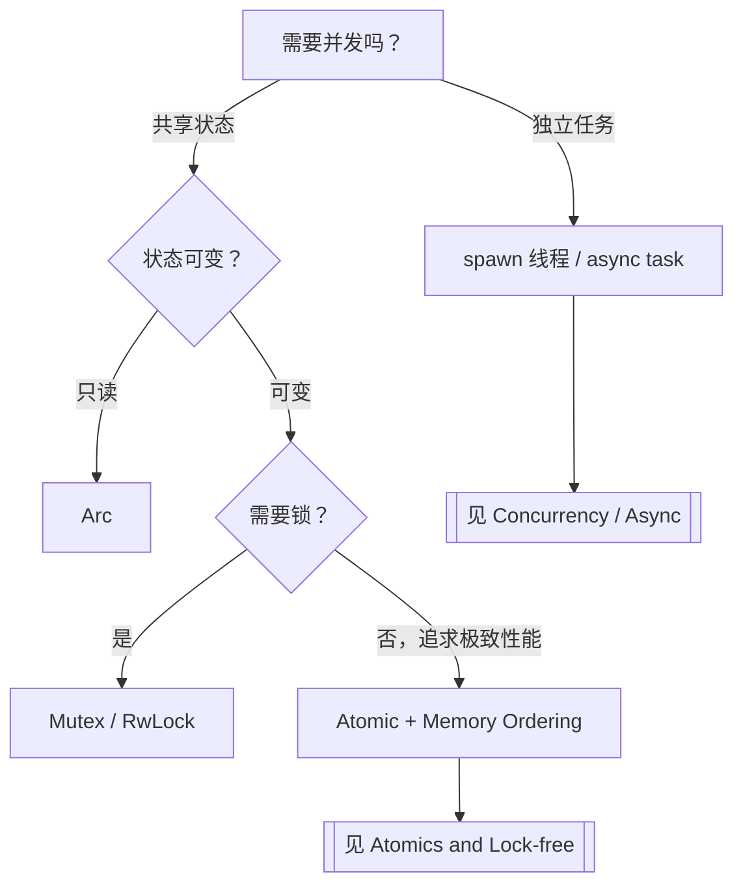

# 场景决策树图谱（Scenario Decision Tree Atlas）

> **EN**: Scenario Decision Tree Atlas
> **Summary**: A navigational index that maps typical Rust development scenarios to decision questions, candidate solutions, and authoritative concept pages across L1–L7. 典型开发场景 → 决策问题 → 候选方案 → Rust 概念/工具选择。
> **受众**: [研究者]
> **内容分级**: [元层]
> **来源**: [Rust Reference](https://doc.rust-lang.org/reference/introduction.html) · [TRPL](https://doc.rust-lang.org/book/title-page.html)

---

## 一、使用说明

本图谱不重复权威页正文，只提供**决策入口**。每个场景给出需要回答的关键问题、可选择的 Rust 机制/工具，以及对应的权威概念页链接。研究者可通过层级与场景两维快速定位。

---

## 二、场景总览

---

## 三、按场景索引

### 3.1 内存管理场景

| 决策问题 | 候选方案 | 关键概念页 |
|:---|:---|:---|
| 数据是否需要在函数调用后继续使用？ | 返回值 / 借用 / `Rc`/`Arc` | [Ownership](../../01_foundation/01_ownership_borrow_lifetime/01_ownership.md), [Borrowing](../../01_foundation/01_ownership_borrow_lifetime/02_borrowing.md), [Smart Pointers](../../02_intermediate/02_memory_management/12_smart_pointers.md) |
| 是否需要在多个所有者之间共享只读数据？ | `Rc<T>` / `Arc<T>` | [Smart Pointers](../../02_intermediate/02_memory_management/12_smart_pointers.md), [Concurrency](../../03_advanced/00_concurrency/01_concurrency.md) |
| 是否需要在不可变引用下修改内部状态？ | `Cell` / `RefCell` / `Mutex` | [Interior Mutability](../../02_intermediate/02_memory_management/08_interior_mutability.md), [Lock-free](../../03_advanced/00_concurrency/16_lock_free.md) |
| 堆分配还是栈分配？ | `Box<T>` / 栈数组 / 自定义分配器 | [Memory Management](../../02_intermediate/02_memory_management/03_memory_management.md), [Custom Allocators](../../03_advanced/06_low_level_patterns/14_custom_allocators.md) |
| 是否需要写时克隆或零拷贝？ | `Cow<T>` / 切片借用 | [Cow and Borrowed](../../02_intermediate/02_memory_management/11_cow_and_borrowed.md), [Zero-copy Parsing](../../03_advanced/06_low_level_patterns/15_zero_copy_parsing.md) |

### 3.2 并发与异步场景

| 决策问题 | 候选方案 | 关键概念页 |
|:---|:---|:---|
| 任务是否需要共享可变状态？ | `Mutex` / `RwLock` / 消息通道 | [Concurrency](../../03_advanced/00_concurrency/01_concurrency.md), [Concurrency Patterns](../../03_advanced/00_concurrency/10_concurrency_patterns.md) |
| 是否需要无锁/原子操作？ | `Atomic*` + Memory Ordering | [Atomics and Memory Ordering](../../03_advanced/00_concurrency/11_atomics_and_memory_ordering.md), [Lock-free](../../03_advanced/00_concurrency/16_lock_free.md) |
| I/O 密集型还是 CPU 密集型？ | `async`/await / 线程池 | [Async/Await](../../03_advanced/01_async/02_async.md), [Async Patterns](../../03_advanced/01_async/26_async_patterns.md) |
| 自引用类型如何跨 await 点保存？ | `Pin<Box<Self>>` / `Pin<&mut Self>` | [Pin and Unpin](../../03_advanced/01_async/06_pin_unpin.md), [Async Closures](../../03_advanced/01_async/24_async_closures.md) |

### 3.3 错误处理场景

| 决策问题 | 候选方案 | 关键概念页 |
|:---|:---|:---|
| 错误是否可恢复？ | `Result<T, E>` / `panic!` / `abort` | [Panic and Abort](../../01_foundation/08_error_handling/13_panic_and_abort.md), [Error Handling Basics](../../01_foundation/08_error_handling/32_error_handling_basics.md) |
| 需要自定义错误类型吗？ | `thiserror` / `anyhow` / 手动 `enum` | [Error Handling Deep Dive](../../02_intermediate/03_error_handling/16_error_handling_deep_dive.md), [Error Handling Intermediate](../../02_intermediate/03_error_handling/04_error_handling.md) |
| 跨 FFI 边界如何处理错误？ | 错误码 / 返回值约定 | [FFI](../../03_advanced/04_ffi/05_rust_ffi.md), [FFI Advanced](../../03_advanced/04_ffi/09_ffi_advanced.md) |

### 3.4 FFI 与跨语言场景

| 决策问题 | 候选方案 | 关键概念页 |
|:---|:---|:---|
| 是否需要调用 C 库？ | `extern "C"` / `bindgen` | [Rust FFI](../../03_advanced/04_ffi/05_rust_ffi.md), [Linkage](../../03_advanced/04_ffi/27_linkage.md) |
| 安全抽象如何封装 unsafe？ | `unsafe` 块 + 不变式文档 | [Unsafe Rust](../../03_advanced/02_unsafe/03_unsafe.md), [Unsafe Rust Patterns](../../03_advanced/02_unsafe/12_unsafe_rust_patterns.md) |
| ABI 如何控制？ | `#[repr(C)]` / `no_mangle` / `extern` | [Application Binary Interface](../../04_formal/05_rustc_internals/38_application_binary_interface.md), [ABI/对象模型对比](../../05_comparative/01_systems_languages/18_cpp_abi_object_model.md) |

### 3.5 抽象与设计场景

| 决策问题 | 候选方案 | 关键概念页 |
|:---|:---|:---|
| 如何定义共享行为？ | `trait` / 泛型约束 | [Traits](../../02_intermediate/00_traits/01_traits.md), [Generics](../../02_intermediate/01_generics/02_generics.md) |
| 需要编译期多态还是运行时多态？ | 泛型单态化 / `dyn Trait` | [Dispatch Mechanisms](../../02_intermediate/00_traits/39_dispatch_mechanisms.md), [Type Erasure](../../03_advanced/06_low_level_patterns/17_type_erasure.md) |
| 需要领域特定语言？ | 声明宏 / 过程宏 | [Attributes and Macros](../../01_foundation/09_macros_basics/12_attributes_and_macros.md), [Proc Macros](../../03_advanced/03_proc_macros/07_proc_macro.md) |

### 3.6 工具链与生态场景

| 决策问题 | 候选方案 | 关键概念页 |
|:---|:---|:---|
| 单 crate 还是多 crate 工作区？ | Workspace / single package | [Cargo Workspaces](../../06_ecosystem/01_cargo/78_cargo_workspaces.md), [Cargo Getting Started](../../06_ecosystem/01_cargo/80_cargo_getting_started.md) |
| 依赖版本冲突如何解决？ | SemVer / lockfile / resolver | [Cargo Dependency Resolution](../../06_ecosystem/01_cargo/60_cargo_dependency_resolution.md), [cargo-semver-checks Preview](../../07_future/03_preview_features/46_cargo_semver_checks_preview.md) |
| 发布前需要哪些质量门禁？ | `clippy` / `rustfmt` / tests / docs | [Testing Strategies](../../06_ecosystem/09_testing_and_quality/12_testing_strategies.md), [DevOps and CI/CD](../../06_ecosystem/00_toolchain/28_devops_and_ci_cd.md) |

---

## 四、典型决策树示例

### 4.1 内存管理决策树

### 4.2 并发模型决策树

---

## 五、与相关元页的关系

- 需要按概念查定义 → [概念定义图谱](01_concept_definition_atlas.md)
- 需要按属性筛选 → [属性关系图谱](02_attribute_relationship_atlas.md)
- 需要按错误症状定位 → [推理判定树图谱](09_reasoning_judgment_tree_atlas.md)
- 需要跨层依赖图 → [层间映射图谱](06_inter_layer_mapping_atlas.md)

---

> **内容分级**: [元层]
