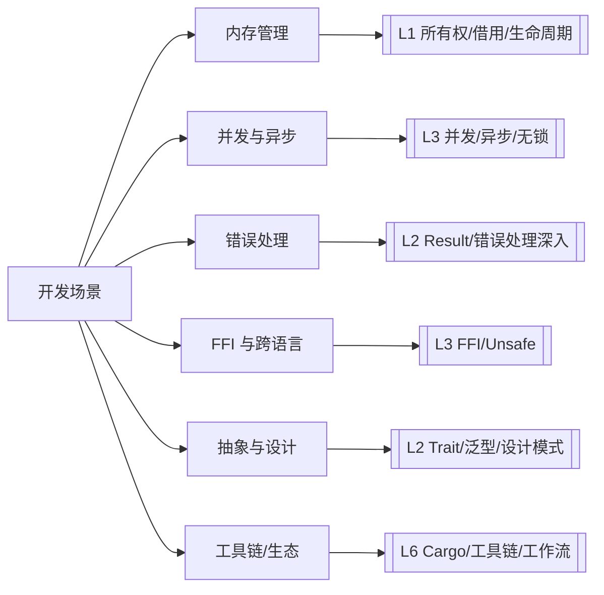
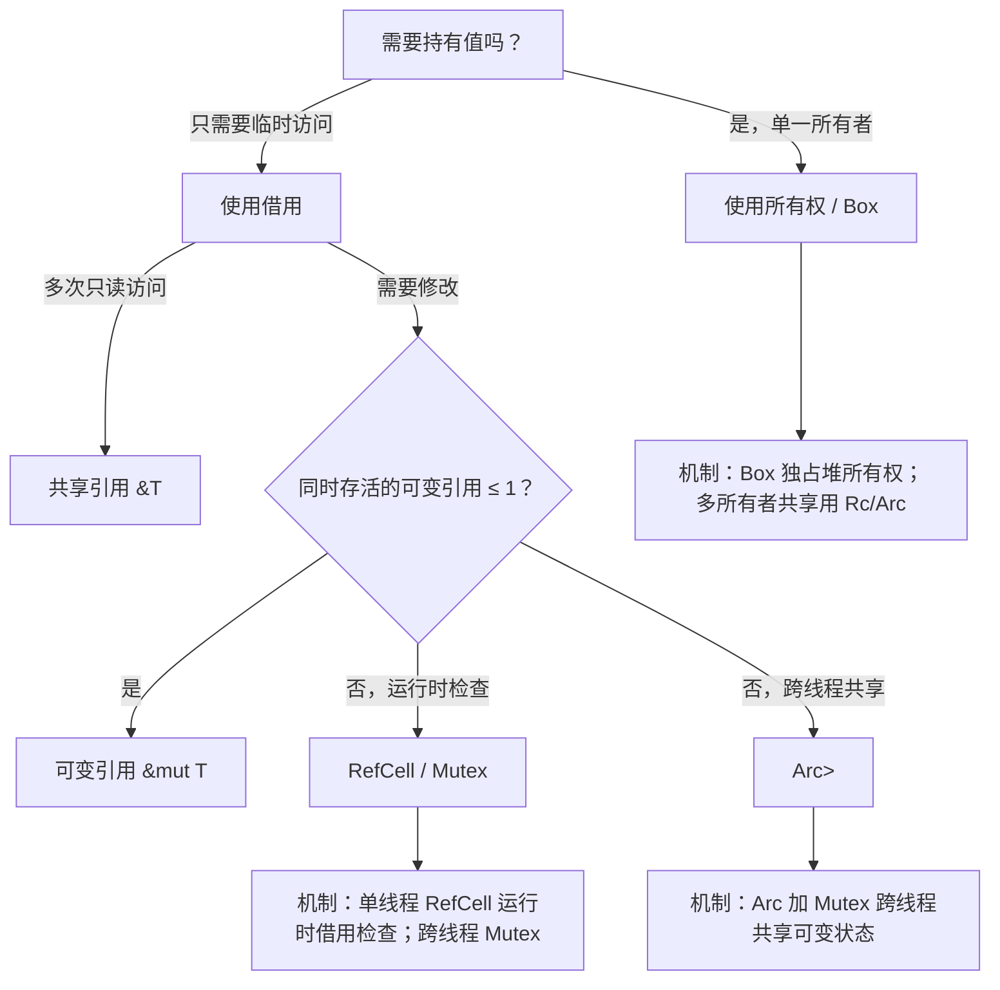
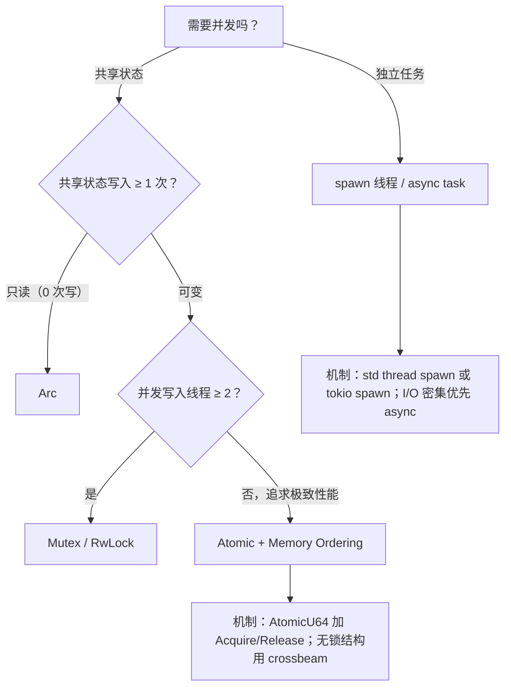
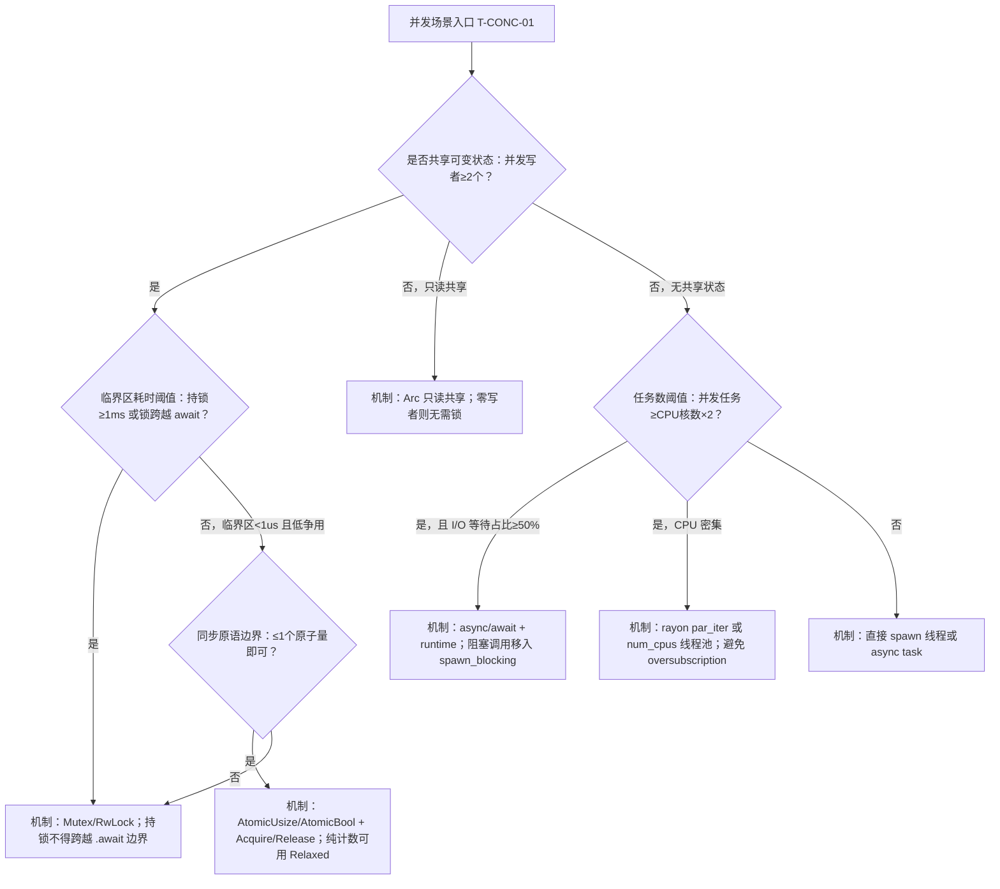
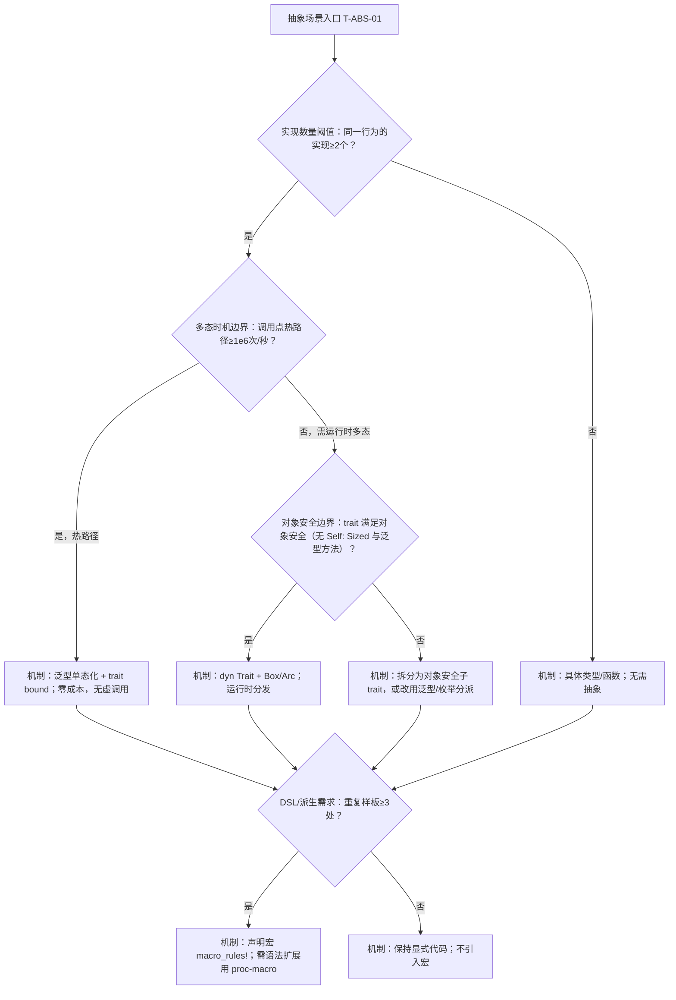

# 场景决策树图谱（Scenario Decision Tree Atlas）

> **EN**: Scenario Decision Tree Atlas
> **Summary**: A navigational index that maps typical Rust development scenarios to decision questions, candidate solutions, and authoritative concept pages across L1–L7. 典型开发场景 → 决策问题 → 候选方案 → Rust 概念/工具选择。
> **Rust 版本**: 1.97.0+ (Edition 2024)
> **受众**: [研究者]
> **内容分级**: [元层]
> **权威来源**: 本文件为 `concept/` 权威页。
> **来源**: [Rust Reference](https://doc.rust-lang.org/reference/introduction.html) · [TRPL](https://doc.rust-lang.org/book/title-page.html)

---

## 一、使用说明

本图谱不重复权威页正文，只提供**决策入口**。每个场景给出需要回答的关键问题、可选择的 Rust 机制/工具，以及对应的权威概念页链接。研究者可通过层级与场景两维快速定位。

---

## 二、场景总览



---

## 三、按场景索引

本节将「按场景索引」分解为若干主题：内存管理场景、并发与异步场景、错误处理场景、FFI 与跨语言场景等6个方面。

### 3.1 内存管理场景

| 决策问题 | 候选方案 | 关键概念页 |
|:---|:---|:---|
| 数据是否需要在函数调用后继续使用？ | 返回值 / 借用 / `Rc`/`Arc` | [Ownership](../../01_foundation/01_ownership_borrow_lifetime/01_ownership.md), [Borrowing](../../01_foundation/01_ownership_borrow_lifetime/02_borrowing.md), [Smart Pointers](../../02_intermediate/02_memory_management/04_smart_pointers.md) |
| 是否需要在多个所有者之间共享只读数据？ | `Rc<T>` / `Arc<T>` | [Smart Pointers](../../02_intermediate/02_memory_management/04_smart_pointers.md), [Concurrency](../../03_advanced/00_concurrency/01_concurrency.md) |
| 是否需要在不可变引用下修改内部状态？ | `Cell` / `RefCell` / `Mutex` | [Interior Mutability](../../02_intermediate/02_memory_management/02_interior_mutability.md), [Lock-free](../../03_advanced/00_concurrency/06_lock_free.md) |
| 堆分配还是栈分配？ | `Box<T>` / 栈数组 / 自定义分配器 | [Memory Management](../../02_intermediate/02_memory_management/01_memory_management.md), [Custom Allocators](../../03_advanced/06_low_level_patterns/01_custom_allocators.md) |
| 是否需要写时克隆或零拷贝？ | `Cow<T>` / 切片借用 | [Cow and Borrowed](../../02_intermediate/02_memory_management/03_cow_and_borrowed.md), [Zero-copy Parsing](../../03_advanced/06_low_level_patterns/02_zero_copy_parsing.md) |

### 3.2 并发与异步场景

| 决策问题 | 候选方案 | 关键概念页 |
|:---|:---|:---|
| 任务是否需要共享可变状态？ | `Mutex` / `RwLock` / 消息通道 | [Concurrency](../../03_advanced/00_concurrency/01_concurrency.md), [Concurrency Patterns](../../03_advanced/00_concurrency/03_concurrency_patterns.md) |
| 是否需要无锁/原子操作？ | `Atomic*` + Memory Ordering | [Atomics and Memory Ordering](../../03_advanced/00_concurrency/05_atomics_and_memory_ordering.md), [Lock-free](../../03_advanced/00_concurrency/06_lock_free.md) |
| I/O 密集型还是 CPU 密集型？ | `async`/await / 线程池 | [Async/Await](../../03_advanced/01_async/01_async.md), [Async Patterns](../../03_advanced/01_async/03_async_patterns.md) |
| 自引用类型如何跨 await 点保存？ | `Pin<Box<Self>>` / `Pin<&mut Self>` | [Pin and Unpin](../../03_advanced/01_async/08_pin_unpin.md), [Async Closures](../../03_advanced/01_async/07_async_closures.md) |

### 3.3 错误处理场景

| 决策问题 | 候选方案 | 关键概念页 |
|:---|:---|:---|
| 错误是否可恢复？ | `Result<T, E>` / `panic!` / `abort` | [Panic and Abort](../../01_foundation/08_error_handling/03_panic_and_abort.md), [Error Handling Basics](../../01_foundation/08_error_handling/01_error_handling_basics.md) |
| 需要自定义错误类型吗？ | `thiserror` / `anyhow` / 手动 `enum` | [Error Handling Deep Dive](../../02_intermediate/03_error_handling/02_error_handling_deep_dive.md), [Error Handling Intermediate](../../02_intermediate/03_error_handling/01_error_handling.md) |
| 跨 FFI 边界如何处理错误？ | 错误码 / 返回值约定 | [FFI](../../03_advanced/04_ffi/01_rust_ffi.md), [FFI Advanced](../../03_advanced/04_ffi/02_ffi_advanced.md) |

### 3.4 FFI 与跨语言场景

| 决策问题 | 候选方案 | 关键概念页 |
|:---|:---|:---|
| 是否需要调用 C 库？ | `extern "C"` / `bindgen` | [Rust FFI](../../03_advanced/04_ffi/01_rust_ffi.md), [Linkage](../../03_advanced/04_ffi/03_linkage.md) |
| 安全抽象如何封装 unsafe？ | `unsafe` 块 + 不变式文档 | [Unsafe Rust](../../03_advanced/02_unsafe/01_unsafe.md), [Unsafe Rust Patterns](../../03_advanced/02_unsafe/04_unsafe_rust_patterns.md) |
| ABI 如何控制？ | `#[repr(C)]` / `no_mangle` / `extern` | [Application Binary Interface](../../04_formal/05_rustc_internals/05_application_binary_interface.md), [ABI/对象模型对比](../../05_comparative/01_systems_languages/02_cpp_abi_object_model.md) |

### 3.5 抽象与设计场景

| 决策问题 | 候选方案 | 关键概念页 |
|:---|:---|:---|
| 如何定义共享行为？ | `trait` / 泛型约束 | [Traits](../../02_intermediate/00_traits/01_traits.md), [Generics](../../02_intermediate/01_generics/01_generics.md) |
| 需要编译期多态还是运行时多态？ | 泛型单态化 / `dyn Trait` | [Dispatch Mechanisms](../../02_intermediate/00_traits/02_dispatch_mechanisms.md), [Type Erasure](../../03_advanced/06_low_level_patterns/03_type_erasure.md) |
| 需要领域特定语言？ | 声明宏 / 过程宏 | [Attributes and Macros](../../01_foundation/09_macros_basics/01_attributes_and_macros.md), [Proc Macros](../../03_advanced/03_proc_macros/02_proc_macro.md) |

### 3.6 工具链与生态场景

| 决策问题 | 候选方案 | 关键概念页 |
|:---|:---|:---|
| 单 crate 还是多 crate 工作区？ | Workspace / single package | [Cargo Workspaces](../../06_ecosystem/01_cargo/14_cargo_workspaces.md), [Cargo Getting Started](../../06_ecosystem/01_cargo/15_cargo_getting_started.md) |
| 依赖版本冲突如何解决？ | SemVer / lockfile / resolver | [Cargo Dependency Resolution](../../06_ecosystem/01_cargo/06_cargo_dependency_resolution.md), [cargo-semver-checks 预研](../../07_future/03_preview_features/27_cargo_semver_checks_preview.md) |
| 发布前需要哪些质量门禁？ | `clippy` / `rustfmt` / tests / docs | [Testing Strategies](../../06_ecosystem/09_testing_and_quality/01_testing_strategies.md), [DevOps and CI/CD](../../06_ecosystem/00_toolchain/03_devops_and_ci_cd.md) |

---

## 四、典型决策树示例

「典型决策树示例」部分包含内存管理决策树 与 并发模型决策树 两条主线，本节依次说明。

### 4.1 内存管理决策树



### 4.2 并发模型决策树



---

## 五、使用提示

1. 从"症状类别"进入，找到最贴近的决策树。
2. 在每个决策节点诚实回答，不要跳过看似不相关的分支。
3. 叶子节点给出的权威页才是最终答案，不要停留在本页。

## 六、与相关元页的关系

- 需要按概念查定义 → [概念定义图谱](01_concept_definition_atlas.md)
- 需要按属性筛选 → [属性关系图谱](02_attribute_relationship_atlas.md)
- 需要按错误症状定位 → [推理判定树图谱](09_reasoning_judgment_tree_atlas.md)
- 需要跨层依赖图 → [层间映射图谱](06_inter_layer_mapping_atlas.md)

---

## 闭环增强（可执行化）

> 本小节为**纯增量**补充：把 §3–§4 的导航式场景树升级为含**定量阈值/边界条件**的可执行判定树，叶子一律给出**具体机制**而非 `[[见…]]` 跳出，并与 05（定理）/09（判定树）建立稳定 ID 与跨文件回边。原 §3–§6 全部内容保持不变。
>
> 节点 ID 体系：本文件新增决策节点以 `T-<场景>-NN` 命名（如 `T-MEM-01`），供 05/09 回边引用。判定节点均为含阈值/边界/数字的可判定条件。

### A. 内存管理场景（入口 `T-MEM-01`）

```mermaid
flowchart TD
    M0[内存场景入口 T-MEM-01] --> M1{数据规模阈值：≥1MB 或元素数≥1024个？}
    M1 -->|是，且跨线程共享| M2{所有者数量边界：跨线程所有者≥2个？}
    M1 -->|否，栈上小数据| M7[机制：栈值或定长数组；元素数>1024时用 Vec::with_capacity 预分配]
    M2 -->|是| M3[机制：Arc<T> 只读共享；需可变则用 Arc<Mutex<T>> 或 Arc<RwLock<T>>]
    M2 -->|否，单线程| M4[机制：Rc<T>；需内部可变则 Rc<RefCell<T>>]
    M1 -->|迭代中需修改| M5{修改次数边界：迭代内可变借用≥1次？}
    M5 -->|是| M6[机制：先 collect 为拥有所有权的 Vec 再修改，或用索引/Vec::retain]
    M5 -->|否| M8[机制：直接 &mut 迭代；不引入额外分配]
    M3 --> M9[机制：写时克隆用 Cow<'_, T>；零拷贝解析用切片借用 &[u8]]
    M4 --> M9
    M6 --> M9
    M7 --> M9
    M8 --> M9
```

> 叶子合规：本树叶子均为具体机制（`Arc`/`Rc`/`Cow`/`collect`/`with_capacity`），无 `[[` 跳出。
> 回边：见 [`09_reasoning_judgment_tree_atlas.md#J-BORROW-01`](09_reasoning_judgment_tree_atlas.md)（叶 M6「迭代中修改→先 collect」对应借用冲突判定入口）。
> 回边：见 [`05_logical_reasoning_atlas.md#TH-OWN-01`](05_logical_reasoning_atlas.md)（单一所有权分支 M3/M4 的定理依据）。

### B. 并发与异步场景（入口 `T-CONC-01`）



> 叶子合规：本树叶子均为具体机制（`Mutex`/`Atomic*`/`rayon`/`spawn_blocking`），无 `[[` 跳出。
> 回边：见 [`09_reasoning_judgment_tree_atlas.md#J-PANIC-04`](09_reasoning_judgment_tree_atlas.md)（叶 C3「持锁跨 await」对应运行时 panic/死锁判定入口）。
> 回边：见 [`05_logical_reasoning_atlas.md#TH-SEND-06`](05_logical_reasoning_atlas.md)（共享/跨线程边界的定理依据）。

### C. 错误处理场景（入口 `T-ERR-01`）

```mermaid
flowchart TD
    E0[错误处理场景入口 T-ERR-01] --> E1{可恢复性边界：调用方可恢复概率≥1%？}
    E1 -->|是，可恢复| E2{错误源数量阈值：不同错误类型≥3个？}
    E1 -->|否，编程错误或不变式破坏| E5[机制：panic!/assert!/unreachable!；不可恢复即快速失败]
    E2 -->|是| E3[机制：自定义 enum + thiserror 派生 Error；库边界优先 thiserror]
    E2 -->|否，1-2 个错误源| E4[机制：anyhow::Result（应用层）或 Box<dyn Error>]
    E3 --> E6{跨 FFI 边界：extern "C" 调用≥1处？}
    E4 --> E6
    E6 -->|是| E7[机制：FFI 边界用错误码/返回值约定；不把 Rust panic 传出 extern]
    E6 -->|否| E8[机制：用 ? 传播 + map_err 统一类型；调用点 match 处理]
```

> 叶子合规：本树叶子均为具体机制（`thiserror`/`anyhow`/`?`/`panic!`/错误码），无 `[[` 跳出。
> 回边：见 [`09_reasoning_judgment_tree_atlas.md#J-TYPE-03`](09_reasoning_judgment_tree_atlas.md)（叶 E8「错误类型不统一」对应类型不匹配判定入口）。

### D. FFI 与跨语言场景（入口 `T-FFI-01`）

```mermaid
flowchart TD
    F0[FFI 场景入口 T-FFI-01] --> F1{外部调用次数边界：extern 函数≥1个？}
    F1 -->|是| F2{是否传字符串/切片：跨边界指针参数≥1个？}
    F1 -->|否| F7[机制：纯 Rust，无需 FFI；保持 safe API]
    F2 -->|是| F3[机制：#[repr(C)] 布局 + 显式 (ptr, len) 对；用 std::ffi::CString/CStr]
    F2 -->|否，仅 POD| F4{ABI 边界：需固定布局或符号≥1项？}
    F4 -->|是| F5[机制：#[repr(C)] + extern "C" + bindgen 生成绑定]
    F4 -->|否| F6[机制：直接 extern "C" fn；保持 ABI 简单]
    F3 --> F8{unsafe 封装边界：unsafe 块≥1块？}
    F5 --> F8
    F6 --> F8
    F8 -->|是| F9[机制：unsafe 块外暴露 safe API，文档化 invariant]
```

> 叶子合规：本树叶子均为具体机制（`#[repr(C)]`/`bindgen`/`CString`/safe 封装），无 `[[` 跳出。
> 回边：见 [`09_reasoning_judgment_tree_atlas.md#J-UNSAFE-05`](09_reasoning_judgment_tree_atlas.md)（叶 F9「unsafe 封装」对应 unsafe 判定入口）。

### E. 抽象与设计场景（入口 `T-ABS-01`）



> 叶子合规：本树叶子均为具体机制（泛型单态化/`dyn Trait`/`macro_rules!`/proc-macro），无 `[[` 跳出。
> 回边：见 [`09_reasoning_judgment_tree_atlas.md#J-TYPE-03`](09_reasoning_judgment_tree_atlas.md)（叶 A3/A5「trait bound/对象安全」对应类型不匹配判定入口）。
> 回边：见 [`05_logical_reasoning_atlas.md#TH-VAR-08`](05_logical_reasoning_atlas.md)（叶 A5 子类型/变型安全的定理依据）。

### F. 工具链与生态场景（入口 `T-TOOL-01`）

```mermaid
flowchart TD
    W0[工具链场景入口 T-TOOL-01] --> W1{crate 数量阈值：相关 crate≥2个？}
    W1 -->|是| W2[机制：Cargo workspace + 共享 workspace.dependencies；resolver = "2"]
    W1 -->|否| W3[机制：单 package；保持简单]
    W2 --> W4{依赖冲突边界：同一 crate 主版本冲突≥1处？}
    W3 --> W4
    W4 -->|是| W5[机制：cargo tree -d 定位；用 [patch] 或升级对齐 SemVer；lockfile 锁定]
    W4 -->|否| W6{发布前门禁：未过质量门≥1项？}
    W5 --> W6
    W6 -->|是| W7[机制：cargo fmt/check/test + clippy 升 -D warnings + cargo audit 全绿再发布]
    W6 -->|否| W8[机制：cargo publish --dry-run 验证后发布]
```

> 叶子合规：本树叶子均为具体机制（workspace/`cargo tree -d`/`[patch]`/clippy/audit），无 `[[` 跳出。
> 验证回边：本树发布门禁与 [`09_reasoning_judgment_tree_atlas.md`](09_reasoning_judgment_tree_atlas.md) 的「验证回边 V1–V5」共用同一套命令（check/clippy/test/audit）。

### G. 本文件闭环小结

- 新增决策树：**6 棵**（A–F），覆盖 §3 全部 6 个场景；原 §4 两棵示例树保留不动。
- 新增定量判定节点：**21 个**（A:3 / B:4 / C:3 / D:4 / E:4 / F:3），均含阈值/边界/数字。
- 新增 `[[` 跳出叶子：**0**（所有叶子为具体机制）。
- 原 §4 示例树 `[[见…]]` 跳出叶子收敛：**5 处**（§4.1 的 I/J/K、§4.2 的 J/K）改为具体机制叶子（`Box`/`Rc`/`Arc`/`RefCell`/`Mutex`/`spawn`/`AtomicU64`/`crossbeam`），与 §A–§F「叶子即机制」合规标准对齐；对应权威概念页见 §三各场景表的「关键概念页」列。
- 原 §4 示例树定性判定节点定量化（2026-07-12）：**3 处**（§4.1 `E{有唯一可变引用？}`→`{同时存活的可变引用 ≤ 1？}`；§4.2 `E{状态可变？}`→`{共享状态写入 ≥ 1 次？}`、`G{需要锁？}`→`{并发写入线程 ≥ 2？}`），本文件判定节点定量占比 24/24=100%。
- 跨文件回边：→ 09 `J-BORROW-01`/`J-PANIC-04`/`J-TYPE-03`/`J-UNSAFE-05`；→ 05 `TH-OWN-01`/`TH-SEND-06`/`TH-VAR-08`（共 8 条逻辑回边）。

<!-- GENERATED-INDEX: 以下「数据驱动索引」节由 scripts/generate_knowledge_topology_atlas.py 自动生成；人工策展内容写在标记之前。 -->

## 数据驱动索引：场景/决策表征覆盖全量概念（自动生成）

> 以下来自 `extract_concept_topology.py` 的表征信号抽取：概念页含「决策树/判定树/选型/判断推理/何时用/场景」类章节，或含带菱形判定节点的 mermaid 图，即收录。每行仅给出入口与信号，决策正文以权威页为准。

覆盖 **244** 个概念（信号：决策/场景类章节或 mermaid 判定图）。

### L0 元信息层（19 个概念）

| 概念页 | 表征信号 | 主题提示 |
|:---|:---|:---|
| [Rust 安全边界扩展推理树](../../00_meta/00_framework/boundary_extension_tree.md) | 决策/场景节 ×1 · mermaid 判定图 ×1 | 边界扩展决策树 |
| [Rust 知识体系概念定义判定森林](../../00_meta/00_framework/concept_definition_decision_forest.md) | 决策/场景节 ×9 · mermaid 判定图 ×8 | 判定树格式规范 · 所有权判定树 |
| [C/C++ → Rust 工程层对比路线图](../../00_meta/00_framework/cpp_rust_engineering_roadmap.md) | 决策/场景节 ×1 · mermaid 判定图 ×1 | 主题簇选择决策树 |
| [Rust 编译期可判定性谱系全景](../../00_meta/00_framework/decidability_spectrum.md) | mermaid 判定图 ×3 | mermaid 判定节点图 |
| [Rust 语义表达力多视角深化](../../00_meta/00_framework/expressiveness_multiview.md) | mermaid 判定图 ×1 | mermaid 判定节点图 |
| [Rust 知识体系失效分析树集](../../00_meta/00_framework/fault_tree_analysis_collection.md) | mermaid 判定图 ×5 | mermaid 判定节点图 |
| [方法论：思维表征与知识结构规范](../../00_meta/00_framework/methodology.md) | 决策/场景节 ×2 · mermaid 判定图 ×1 | 决策/边界判定树（Decision / Boundary Tree） · 决策/边界判定树（Decision / Boundary Tree） |
| [Rust 范式转换模式矩阵](../../00_meta/00_framework/paradigm_transition_matrix.md) | mermaid 判定图 ×1 | mermaid 判定节点图 |
| [模式语义空间索引：设计模式在概念体系中的坐标](../../00_meta/00_framework/pattern_semantic_space_index.md) | 决策/场景节 ×1 · mermaid 判定图 ×1 | 模式选择决策树 |
| [Rust 表征空间](../../00_meta/00_framework/semantic_space.md) | mermaid 判定图 ×4 | mermaid 判定节点图 |
| [Concept 文件双语模板 v2](../../00_meta/01_terminology/02_bilingual_template_v2.md) | 决策/场景节 ×2 | 判断推理与决策树 · 反例 / 边界 / 反推 / 决策树规范 |
| [Concept Audit Guide](../../00_meta/03_audit/01_concept_audit_guide.md) | mermaid 判定图 ×1 | mermaid 判定节点图 |
| [概念一致性检查清单](../../00_meta/03_audit/03_audit_checklist.md) | mermaid 判定图 ×1 | mermaid 判定节点图 |
| [全局概念索引](../../00_meta/04_navigation/03_concept_index.md) | 决策/场景节 ×1 | 判定树与失效分析树索引 |
| [Rust 知识体系层次内模型间映射图](../../00_meta/04_navigation/06_intra_layer_model_map.md) | mermaid 判定图 ×1 | mermaid 判定节点图 |
| [Rust 概念速查卡片](../../00_meta/04_navigation/11_quick_reference.md) | 决策/场景节 ×1 | 模式选择决策树（速查版） |
| [场景决策树图谱](../../00_meta/knowledge_topology/03_scenario_decision_tree_atlas.md) | 决策/场景节 ×4 · mermaid 判定图 ×8 | 场景总览 · 按场景索引 |
| [逻辑推理图谱](../../00_meta/knowledge_topology/05_logical_reasoning_atlas.md) | mermaid 判定图 ×1 | mermaid 判定节点图 |
| [推理判定树图谱](../../00_meta/knowledge_topology/09_reasoning_judgment_tree_atlas.md) | 决策/场景节 ×2 · mermaid 判定图 ×6 | 主要判定树 · 使用判定树的技巧 |

### L1 基础概念层（29 个概念）

| 概念页 | 表征信号 | 主题提示 |
|:---|:---|:---|
| [Rust 起步指南](../../01_foundation/00_start/00_start.md) | 决策/场景节 ×1 · mermaid 判定图 ×1 | 反命题决策树 |
| [零成本抽象：Rust 的性能哲学](../../01_foundation/00_start/02_zero_cost_abstractions.md) | mermaid 判定图 ×1 | mermaid 判定节点图 |
| [闭包基础：捕获环境与匿名函数](../../01_foundation/00_start/03_closure_basics.md) | mermaid 判定图 ×1 | mermaid 判定节点图 |
| [标准 I/O 与进程](../../01_foundation/00_start/05_std_io_and_process.md) | 决策/场景节 ×1 | 判断推理与决策树 |
| [Ownership](../../01_foundation/01_ownership_borrow_lifetime/01_ownership.md) | 决策/场景节 ×2 · mermaid 判定图 ×4 | 决策/边界判定树（Decision / Boundary Tree） · 决策/边界判定树（Decision / Boundary Tree） |
| [Borrowing](../../01_foundation/01_ownership_borrow_lifetime/02_borrowing.md) | 决策/场景节 ×2 · mermaid 判定图 ×3 | 决策/边界判定树（Decision / Boundary Tree） · 决策/边界判定树（Decision / Boundary Tree） |
| [Lifetimes](../../01_foundation/01_ownership_borrow_lifetime/03_lifetimes.md) | 决策/场景节 ×1 · mermaid 判定图 ×3 | 判定表：生命周期标注与失效场景判定 |
| [Type System Basics](../../01_foundation/02_type_system/01_type_system.md) | mermaid 判定图 ×9 | mermaid 判定节点图 |
| [数值类型与运算：从整数到浮点的完整图景](../../01_foundation/02_type_system/03_numerics.md) | mermaid 判定图 ×1 | mermaid 判定节点图 |
| [类型强制与转换：显式与隐式的边界](../../01_foundation/02_type_system/04_coercion_and_casting.md) | mermaid 判定图 ×1 | mermaid 判定节点图 |
| [引用语义：自动解引用、Deref 强制与类型转换](../../01_foundation/03_values_and_references/01_reference_semantics.md) | mermaid 判定图 ×1 | mermaid 判定节点图 |
| [控制流：表达式导向的流程控制](../../01_foundation/04_control_flow/01_control_flow.md) | 决策/场景节 ×1 · mermaid 判定图 ×1 | 补充视角：crate 实践中的循环选型 |
| [集合类型：Rust 标准库的数据结构谱系](../../01_foundation/05_collections/01_collections.md) | 决策/场景节 ×1 · mermaid 判定图 ×1 | 选型决策矩阵 |
| [高级集合类型：BTreeMap、VecDeque、BinaryHeap 与自定义 Hasher 深度分析](../../01_foundation/05_collections/02_collections_advanced.md) | 决策/场景节 ×1 · mermaid 判定图 ×1 | 选型决策矩阵 |
| [字符串与文本：Rust 的 Unicode 处理与格式化系统](../../01_foundation/06_strings_and_text/01_strings_and_text.md) | 决策/场景节 ×1 · mermaid 判定图 ×1 | 选型决策矩阵 |
| [字符串与编码：Rust 的文本处理类型系统](../../01_foundation/06_strings_and_text/02_strings_and_encoding.md) | 决策/场景节 ×1 · mermaid 判定图 ×2 | 选型决策矩阵 |
| [格式化与显示](../../01_foundation/06_strings_and_text/03_formatting_and_display.md) | 决策/场景节 ×1 · mermaid 判定图 ×1 | 判断推理与决策树 |
| [模块系统与路径：Rust 的代码组织哲学](../../01_foundation/07_modules_and_items/01_modules_and_paths.md) | mermaid 判定图 ×1 | mermaid 判定节点图 |
| [类型别名](../../01_foundation/07_modules_and_items/07_type_aliases.md) | 决策/场景节 ×1 | 判断推理与决策树 |
| [静态项](../../01_foundation/07_modules_and_items/08_static_items.md) | 决策/场景节 ×1 | 判断推理与决策树 |
| [常量项与常量函数](../../01_foundation/07_modules_and_items/09_const_items_and_const_fn.md) | 决策/场景节 ×1 | 判断推理与决策树 |
| [Crate 与源文件](../../01_foundation/07_modules_and_items/11_crates_and_source_files.md) | 决策/场景节 ×1 · mermaid 判定图 ×1 | 反命题决策树 |
| [项](../../01_foundation/07_modules_and_items/12_items.md) | 决策/场景节 ×1 · mermaid 判定图 ×1 | 反命题决策树 |
| [Rust 错误处理基础](../../01_foundation/08_error_handling/01_error_handling_basics.md) | mermaid 判定图 ×1 | mermaid 判定节点图 |
| [错误处理控制流](../../01_foundation/08_error_handling/02_error_handling_control_flow.md) | mermaid 判定图 ×1 | mermaid 判定节点图 |
| [Panic 与 Abort：不可恢复错误的处理机制](../../01_foundation/08_error_handling/03_panic_and_abort.md) | mermaid 判定图 ×1 | mermaid 判定节点图 |
| [属性与声明宏：编译期元编程基础](../../01_foundation/09_macros_basics/01_attributes_and_macros.md) | mermaid 判定图 ×1 | mermaid 判定节点图 |
| [测试基础：从单元测试到集成测试](../../01_foundation/10_testing_basics/01_testing_basics.md) | mermaid 判定图 ×1 | mermaid 判定节点图 |
| [常用开发工具](../../01_foundation/10_testing_basics/02_useful_development_tools.md) | 决策/场景节 ×2 · mermaid 判定图 ×1 | 反命题决策树 · 工具选择决策树 |

### L2 进阶概念层（26 个概念）

| 概念页 | 表征信号 | 主题提示 |
|:---|:---|:---|
| [Traits](../../02_intermediate/00_traits/01_traits.md) | 决策/场景节 ×1 · mermaid 判定图 ×4 | 补充视角：关联类型的工程实践场景 |
| [分发机制 (Dispatch Mechanisms)](../../02_intermediate/00_traits/02_dispatch_mechanisms.md) | 决策/场景节 ×1 | 📈 选择决策树 |
| [Serde 序列化模式：Rust 的类型驱动数据转换](../../02_intermediate/00_traits/03_serde_patterns.md) | mermaid 判定图 ×2 | mermaid 判定节点图 |
| [高级 Trait 主题：从关联类型到特化](../../02_intermediate/00_traits/04_advanced_traits.md) | mermaid 判定图 ×1 | mermaid 判定节点图 |
| [泛型关联类型](../../02_intermediate/00_traits/07_generic_associated_types.md) | 决策/场景节 ×1 · mermaid 判定图 ×1 | 选型判定表：GAT vs 关联类型 vs HRTB vs `impl Trai… |
| [Generics](../../02_intermediate/01_generics/01_generics.md) | mermaid 判定图 ×5 | mermaid 判定节点图 |
| [Memory Management](../../02_intermediate/02_memory_management/01_memory_management.md) | mermaid 判定图 ×4 | mermaid 判定节点图 |
| [内部可变性：编译期规则的运行时逃逸](../../02_intermediate/02_memory_management/02_interior_mutability.md) | 决策/场景节 ×2 · mermaid 判定图 ×1 | 判定表：内部可变性选型判定 · 补充视角：crate 实践中的智能指针与内部可变性选型 |
| [Cow：写时克隆与零拷贝抽象](../../02_intermediate/02_memory_management/03_cow_and_borrowed.md) | mermaid 判定图 ×2 | mermaid 判定节点图 |
| [智能指针：堆内存管理与共享语义](../../02_intermediate/02_memory_management/04_smart_pointers.md) | 决策/场景节 ×3 · mermaid 判定图 ×1 | 选型决策矩阵 · 判定表：智能指针选型判定 |
| [Error Handling](../../02_intermediate/03_error_handling/01_error_handling.md) | mermaid 判定图 ×7 | mermaid 判定节点图 |
| [错误处理深入：从 Result 到自定义错误生态](../../02_intermediate/03_error_handling/02_error_handling_deep_dive.md) | mermaid 判定图 ×1 | mermaid 判定节点图 |
| [Rust 范围类型语义：`std::ops::Range` → `core::range`](../../02_intermediate/04_types_and_conversions/01_range_types.md) | mermaid 判定图 ×1 | mermaid 判定节点图 |
| [闭包类型系统：Fn、FnMut、FnOnce 的捕获语义](../../02_intermediate/04_types_and_conversions/02_closure_types.md) | mermaid 判定图 ×1 | mermaid 判定节点图 |
| [Newtype 与包装器模式：类型安全的零成本抽象](../../02_intermediate/04_types_and_conversions/03_newtype_and_wrapper.md) | mermaid 判定图 ×1 | mermaid 判定节点图 |
| [高级类型系统：从关联类型到类型级编程](../../02_intermediate/04_types_and_conversions/04_type_system_advanced.md) | mermaid 判定图 ×1 | mermaid 判定节点图 |
| [联合体](../../02_intermediate/04_types_and_conversions/06_unions.md) | 决策/场景节 ×1 | 判断推理与决策树 |
| [类型转换](../../02_intermediate/04_types_and_conversions/07_type_conversions.md) | 决策/场景节 ×1 | 判断推理与决策树 |
| [模块系统：Rust 的代码组织与可见性规则](../../02_intermediate/05_modules_and_visibility/01_module_system.md) | mermaid 判定图 ×1 | mermaid 判定节点图 |
| [友元 vs 模块可见性：C++ 的 `friend` 与 Rust 的隐私边界](../../02_intermediate/05_modules_and_visibility/02_friend_vs_module_privacy.md) | 决策/场景节 ×1 | Rust 中模拟 `friend` 的场景 |
| [`assert_matches!`：模式匹配断言的形式化语义](../../02_intermediate/06_macros_and_metaprogramming/01_assert_matches.md) | 决策/场景节 ×1 · mermaid 判定图 ×2 | 使用场景与最佳实践 |
| [DSL 与嵌入 式设计：Rust 中的领域特定语言](../../02_intermediate/06_macros_and_metaprogramming/02_dsl_and_embedding.md) | mermaid 判定图 ×1 | mermaid 判定节点图 |
| [宏模式：编译期代码生成的工程实践](../../02_intermediate/06_macros_and_metaprogramming/03_macro_patterns.md) | mermaid 判定图 ×1 | mermaid 判定节点图 |
| [元编程：Rust 的编译期代码生成与变换](../../02_intermediate/06_macros_and_metaprogramming/04_metaprogramming.md) | mermaid 判定图 ×2 | mermaid 判定节点图 |
| [属性分类详解](../../02_intermediate/06_macros_and_metaprogramming/06_attributes_by_category.md) | 决策/场景节 ×1 | 判断推理与决策树 |
| [Rust 迭代器模式](../../02_intermediate/07_iterators_and_closures/01_iterator_patterns.md) | mermaid 判定图 ×1 | mermaid 判定节点图 |

### L3 高级概念层（39 个概念）

| 概念页 | 表征信号 | 主题提示 |
|:---|:---|:---|
| [Concurrency](../../03_advanced/00_concurrency/01_concurrency.md) | 决策/场景节 ×2 · mermaid 判定图 ×6 | 决策/边界判定树（Decision / Boundary Tree） · 决策/边界判定树（Decision / Boundary Tree） |
| [Send 与 Sync：Auto Trait 的并发安全契约](../../03_advanced/00_concurrency/02_send_sync_auto_traits.md) | 决策/场景节 ×1 · mermaid 判定图 ×1 | 决策树：类型需要跨线程时怎么办 |
| [并发 模式：从消息 传递到锁自由的数据结构](../../03_advanced/00_concurrency/03_concurrency_patterns.md) | mermaid 判定图 ×1 | mermaid 判定节点图 |
| [原子操作与内存序：无锁并发的精确控制](../../03_advanced/00_concurrency/05_atomics_and_memory_ordering.md) | mermaid 判定图 ×1 | mermaid 判定节点图 |
| [无锁编程与内存模型](../../03_advanced/00_concurrency/06_lock_free.md) | mermaid 判定图 ×1 | mermaid 判定节点图 |
| [Async/Await](../../03_advanced/01_async/01_async.md) | 决策/场景节 ×4 · mermaid 判定图 ×3 | 反命题决策树（Counter-proposition Decision Tre… · 决策/边界判定树（Decision / Boundary Tree） |
| [异步模式：从 Future 到生产级并发](../../03_advanced/01_async/03_async_patterns.md) | mermaid 判定图 ×1 | mermaid 判定节点图 |
| [Async 取消安全](../../03_advanced/01_async/05_async_cancellation_safety.md) | 决策/场景节 ×1 · mermaid 判定图 ×1 | 选型判定树 |
| [Async 边界全景](../../03_advanced/01_async/06_async_boundary_panorama.md) | mermaid 判定图 ×1 | mermaid 判定节点图 |
| [Pin 与 Unpin：自引用类型的不动性保证](../../03_advanced/01_async/08_pin_unpin.md) | mermaid 判定图 ×1 | mermaid 判定节点图 |
| [Stream 代数与背压：拉取式序列的形式刻画](../../03_advanced/01_async/09_stream_algebra_and_backpressure.md) | 决策/场景节 ×1 · mermaid 判定图 ×2 | 选型判定树 |
| [Executor 公平性与调度：Tokio 调度器 internals](../../03_advanced/01_async/10_executor_fairness_and_scheduling.md) | mermaid 判定图 ×1 | mermaid 判定节点图 |
| [Pin 投射反例集：unsafe 结构投射的 UB 目录与正确模式库](../../03_advanced/01_async/11_pin_projection_counterexamples.md) | 决策/场景节 ×1 · mermaid 判定图 ×2 | 判定树与检查清单 |
| [Waker 契约深度解析：RawWakerVTable 实现与契约违反反例集](../../03_advanced/01_async/12_waker_contract_deep_dive.md) | 决策/场景节 ×1 · mermaid 判定图 ×2 | 判定树与检查清单 |
| [是否需要进入 L4 形式化层？](../../03_advanced/02_unsafe/00_before_formal.md) | 决策/场景节 ×1 · mermaid 判定图 ×1 | 快速决策树 |
| [Unsafe Rust 安全编程](../../03_advanced/02_unsafe/01_unsafe.md) | 决策/场景节 ×2 · mermaid 判定图 ×7 | 决策/边界判定树（Decision / Boundary Tree） · 决策/边界判定树（Decision / Boundary Tree） |
| [Unsafe 边界全景](../../03_advanced/02_unsafe/02_unsafe_boundary_panorama.md) | mermaid 判定图 ×1 | mermaid 判定节点图 |
| [NLL 与 Polonius：借用检查器的演进](../../03_advanced/02_unsafe/03_nll_and_polonius.md) | mermaid 判定图 ×1 | mermaid 判定节点图 |
| [Rust 内存模型](../../03_advanced/02_unsafe/06_memory_model.md) | 决策/场景节 ×1 | 反命题决策树 |
| [Unsafe 参考](../../03_advanced/02_unsafe/07_unsafe_reference.md) | 决策/场景节 ×1 | 反命题决策树 |
| [Macros](../../03_advanced/03_proc_macros/01_macros.md) | 决策/场景节 ×2 · mermaid 判定图 ×6 | 决策/边界判定树（Decision / Boundary Tree） · 决策/边界判定树（Decision / Boundary Tree） |
| [过程宏：编译期代码生成的元编程工具](../../03_advanced/03_proc_macros/02_proc_macro.md) | mermaid 判定图 ×1 | mermaid 判定节点图 |
| [Rust FFI：与外部代码的安全边界](../../03_advanced/04_ffi/01_rust_ffi.md) | mermaid 判定图 ×1 | mermaid 判定节点图 |
| [FFI 高级主题：跨语言边界的安全与性能](../../03_advanced/04_ffi/02_ffi_advanced.md) | mermaid 判定图 ×1 | mermaid 判定节点图 |
| [自定义分配器与内存布局优化](../../03_advanced/06_low_level_patterns/01_custom_allocators.md) | mermaid 判定图 ×1 | mermaid 判定节点图 |
| [零拷贝解析与序列化优化](../../03_advanced/06_low_level_patterns/02_zero_copy_parsing.md) | mermaid 判定图 ×1 | mermaid 判定节点图 |
| [类型擦除与动态分发](../../03_advanced/06_low_level_patterns/03_type_erasure.md) | mermaid 判定图 ×1 | mermaid 判定节点图 |
| [Rust 网络编程：Tokio TCP/UDP、异步 IO 与 Tower 服务抽象](../../03_advanced/06_low_level_patterns/04_network_programming.md) | 决策/场景节 ×1 | 选型决策矩阵 |
| [Rust 运行时](../../03_advanced/06_low_level_patterns/07_rust_runtime.md) | 决策/场景节 ×1 | 反命题决策树 |
| [可见性与隐私](../../03_advanced/06_low_level_patterns/10_visibility_and_privacy.md) | 决策/场景节 ×1 · mermaid 判定图 ×1 | 可见性决策树 |
| [Unsafe 集合内部实现：Vec、Arc、Mutex](../../03_advanced/07_unsafe_internals/01_unsafe_collections_internals.md) | 决策/场景节 ×1 | 判断推理与决策树 |
| [Rust 高级进程管理](../../03_advanced/08_process_ipc/02_advanced_process_management.md) | mermaid 判定图 ×1 | mermaid 判定节点图 |
| [Rust 异步进程管理](../../03_advanced/08_process_ipc/03_async_process_management.md) | mermaid 判定图 ×1 | mermaid 判定节点图 |
| [Rust 跨平台进程管理](../../03_advanced/08_process_ipc/04_cross_platform_process_management.md) | 决策/场景节 ×1 · mermaid 判定图 ×1 | 6. 决策树 |
| [Rust 进程间通信机制](../../03_advanced/08_process_ipc/05_ipc_mechanisms.md) | 决策/场景节 ×3 · mermaid 判定图 ×1 | 9. 选型建议 · 补充视角：IPC 机制工程选型速查 |
| [Rust 进程监控与诊断](../../03_advanced/08_process_ipc/06_process_monitoring_and_diagnostics.md) | mermaid 判定图 ×1 | mermaid 判定节点图 |
| [Rust 进程性能工程](../../03_advanced/08_process_ipc/08_process_performance_engineering.md) | mermaid 判定图 ×1 | mermaid 判定节点图 |
| [Rust 进程测试与基准](../../03_advanced/08_process_ipc/09_process_testing_and_benchmarking.md) | mermaid 判定图 ×1 | mermaid 判定节点图 |
| [Rust 现代进程管理库](../../03_advanced/08_process_ipc/10_modern_process_libraries.md) | 决策/场景节 ×1 · mermaid 判定图 ×1 | 8. 库选型决策树 |

### L4 形式化理论层（32 个概念）

| 概念页 | 表征信号 | 主题提示 |
|:---|:---|:---|
| [Type Theory](../../04_formal/00_type_theory/01_type_theory.md) | 决策/场景节 ×1 · mermaid 判定图 ×4 | 反命题决策树（Counter-proposition Decision Tre… |
| [子类型与变型：Rust 类型系统中的协变、逆变与不变](../../04_formal/00_type_theory/02_subtype_variance.md) | mermaid 判定图 ×1 | mermaid 判定节点图 |
| [类型推断：Hindley-Milner 算法与 Rust 的工业实现](../../04_formal/00_type_theory/03_type_inference.md) | mermaid 判定图 ×1 | mermaid 判定节点图 |
| [范畴论与 Rust：从函子到单子](../../04_formal/00_type_theory/04_category_theory.md) | mermaid 判定图 ×1 | mermaid 判定节点图 |
| [Lambda 演算与 Rust 计算模型](../../04_formal/00_type_theory/05_lambda_calculus.md) | mermaid 判定图 ×1 | mermaid 判定节点图 |
| [rustc 类型检查与类型推断](../../04_formal/00_type_theory/07_type_checking_and_inference.md) | 决策/场景节 ×1 | 反命题决策树 |
| [Type Inference Complexity](../../04_formal/00_type_theory/08_type_inference_complexity.md) | 决策/场景节 ×1 | 反命题决策树 |
| [类型系统参考](../../04_formal/00_type_theory/09_type_system_reference.md) | 决策/场景节 ×1 | 反命题决策树 |
| [Linear Logic & Affine Logic](../../04_formal/01_ownership_logic/01_linear_logic.md) | 决策/场景节 ×1 · mermaid 判定图 ×3 | 反命题决策树（Anti-Proposition Decision Trees） |
| [Ownership Formalization](../../04_formal/01_ownership_logic/02_ownership_formal.md) | mermaid 判定图 ×4 | mermaid 判定节点图 |
| [线性逻辑在 Rust 中的工程应用](../../04_formal/01_ownership_logic/03_linear_logic_applications.md) | mermaid 判定图 ×1 | mermaid 判定节点图 |
| [RustBelt & Verification Toolchain](../../04_formal/02_separation_logic/01_rustbelt.md) | 决策/场景节 ×1 · mermaid 判定图 ×3 | 反命题决策树（Antithesis Decision Trees） |
| [分离逻辑：Rust 所有权的形式化根基](../../04_formal/02_separation_logic/02_separation_logic.md) | mermaid 判定图 ×1 | mermaid 判定节点图 |
| [指称语义与领域理论](../../04_formal/03_operational_semantics/01_denotational_semantics.md) | mermaid 判定图 ×1 | mermaid 判定节点图 |
| [Hoare 逻辑：程序验证的形式化基础与 Rust 契约](../../04_formal/03_operational_semantics/02_hoare_logic.md) | mermaid 判定图 ×2 | mermaid 判定节点图 |
| [操作语义：程序行为的形式化定义](../../04_formal/03_operational_semantics/03_operational_semantics.md) | mermaid 判定图 ×1 | mermaid 判定节点图 |
| [Verification Toolchain Selection Guide](../../04_formal/04_model_checking/01_verification_toolchain.md) | 决策/场景节 ×3 · mermaid 判定图 ×2 | TL;DR —— 30 秒选型 · 工具链全景矩阵（选型版） |
| [现代 Rust 验证工具生态](../../04_formal/04_model_checking/04_modern_verification_tools.md) | 决策/场景节 ×1 | 选型速查表（2026） |
| [Miri：Rust 未定义行为动态检测器](../../04_formal/04_model_checking/08_miri.md) | mermaid 判定图 ×1 | mermaid 判定节点图 |
| [认证工具链与认证包清单](../../04_formal/04_model_checking/10_certified_toolchains_and_packages.md) | 决策/场景节 ×1 · mermaid 判定图 ×1 | 认证 vs 非认证边界决策树 |
| [MIR、Codegen 与 LLVM IR 入门](../../04_formal/05_rustc_internals/02_mir_codegen_llvm_primer.md) | 决策/场景节 ×1 · mermaid 判定图 ×1 | 反命题决策树 |
| [rustc 中的 Trait Solver](../../04_formal/05_rustc_internals/03_trait_solver_in_rustc.md) | mermaid 判定图 ×1 | mermaid 判定节点图 |
| [Rustc 名称解析与 HIR](../../04_formal/05_rustc_internals/04_name_resolution_and_hir.md) | mermaid 判定图 ×1 | mermaid 判定节点图 |
| [名称、作用域与解析](../../04_formal/05_rustc_internals/06_names_and_resolution.md) | 决策/场景节 ×1 | 反命题决策树 |
| [词法结构](../../04_formal/05_rustc_internals/10_lexical_structure.md) | 决策/场景节 ×1 | 反命题决策树 |
| [条目参考](../../04_formal/05_rustc_internals/11_items_reference.md) | 决策/场景节 ×1 | 反命题决策树 |
| [属性](../../04_formal/05_rustc_internals/12_attributes.md) | 决策/场景节 ×1 | 反命题决策树 |
| [语句与表达式参考](../../04_formal/05_rustc_internals/13_statements_and_expressions_reference.md) | 决策/场景节 ×1 | 反命题决策树 |
| [模式参考](../../04_formal/05_rustc_internals/14_patterns_reference.md) | 决策/场景节 ×1 | 反命题决策树 |
| [泛型编译器行为：单态化、分发与类型擦除](../../04_formal/05_rustc_internals/15_generics_compiler_behavior.md) | 决策/场景节 ×1 | 反命题决策树 |
| [名字参考](../../04_formal/05_rustc_internals/16_names_reference.md) | 决策/场景节 ×1 | 反命题决策树 |
| [Rust Reference 附录](../../04_formal/05_rustc_internals/17_reference_appendices.md) | 决策/场景节 ×1 | 反命题决策树 |

### L5 对比分析层（16 个概念）

| 概念页 | 表征信号 | 主题提示 |
|:---|:---|:---|
| [Paradigm Matrix: Multi-Language Formal Comparison](../../05_comparative/00_paradigms/01_paradigm_matrix.md) | 决策/场景节 ×1 · mermaid 判定图 ×4 | 适用域决策矩阵 |
| [Rust 执行模型同构性矩阵：同步 · 异步 · 并发 · 并行](../../05_comparative/00_paradigms/02_execution_model_isomorphism.md) | 决策/场景节 ×1 · mermaid 判定图 ×1 | 执行模型选择决策树 |
| [Rust vs C++：形式系统模型 vs 机制工程模型 —— 全面分析论证>](../../05_comparative/01_systems_languages/01_rust_vs_cpp.md) | 决策/场景节 ×2 · mermaid 判定图 ×1 | 决策树：你的问题适合哪种本体论？ · 反命题决策树集：三个常见迷思的消解 |
| [Rust vs Go：线性所有权 vs CSP 过程逻辑](../../05_comparative/01_systems_languages/03_rust_vs_go.md) | 决策/场景节 ×1 · mermaid 判定图 ×4 | 决策树：何时选 Rust vs Go |
| [Rust vs Ruby：性能与表达力的两极](../../05_comparative/01_systems_languages/04_rust_vs_ruby.md) | 决策/场景节 ×1 · mermaid 判定图 ×1 | 互补使用场景 |
| [Rust vs Swift：现代系统语言的两种路径](../../05_comparative/01_systems_languages/05_rust_vs_swift.md) | 决策/场景节 ×1 · mermaid 判定图 ×1 | 互补使用场景 |
| [Rust vs Zig：现代系统语言的两种哲学](../../05_comparative/01_systems_languages/06_rust_vs_zig.md) | 决策/场景节 ×1 · mermaid 判定图 ×1 | 互补使用场景 |
| [Rust vs Java：系统编程与托管运行时的范式对比](../../05_comparative/02_managed_languages/01_rust_vs_java.md) | 决策/场景节 ×1 · mermaid 判定图 ×1 | 场景适用矩阵 |
| [Rust vs Python：系统编程与动态脚本的对照分析](../../05_comparative/02_managed_languages/02_rust_vs_python.md) | 决策/场景节 ×1 · mermaid 判定图 ×1 | 选型决策矩阵 |
| [Rust vs JavaScript：系统编程与脚本执行的范式差异](../../05_comparative/02_managed_languages/03_rust_vs_javascript.md) | 决策/场景节 ×1 · mermaid 判定图 ×1 | 选型决策矩阵 |
| [Rust vs Kotlin：静态安全的两种路径](../../05_comparative/02_managed_languages/04_rust_vs_kotlin.md) | mermaid 判定图 ×1 | mermaid 判定节点图 |
| [Rust vs Scala：类型系统的两种哲学](../../05_comparative/02_managed_languages/05_rust_vs_scala.md) | mermaid 判定图 ×1 | mermaid 判定节点图 |
| [Rust vs C#：托管与原生之路](../../05_comparative/02_managed_languages/06_rust_vs_csharp.md) | mermaid 判定图 ×1 | mermaid 判定节点图 |
| [Rust vs Elixir 对比分析](../../05_comparative/02_managed_languages/07_rust_vs_elixir.md) | 决策/场景节 ×1 · mermaid 判定图 ×1 | 反命题与适用场景 |
| [Rust vs TypeScript：静态类型系统的两种哲学 —— 编译期证明与渐进式工程](../../05_comparative/02_managed_languages/08_rust_vs_typescript.md) | 决策/场景节 ×1 · mermaid 判定图 ×1 | 选型决策矩阵 |
| [Rust 安全保证的边界条件全景](../../05_comparative/03_domain_comparisons/01_safety_boundaries.md) | mermaid 判定图 ×5 | mermaid 判定节点图 |

### L6 生态工程层（53 个概念）

| 概念页 | 表征信号 | 主题提示 |
|:---|:---|:---|
| [Toolchain](../../06_ecosystem/00_toolchain/01_toolchain.md) | 决策/场景节 ×2 | 决策树 · 反命题决策树 |
| [日志与可观测性：Rust 服务端监控生态](../../06_ecosystem/00_toolchain/02_logging_observability.md) | 决策/场景节 ×1 · mermaid 判定图 ×1 | 选型决策矩阵 |
| [DevOps 与 CI/CD：Rust 的持续交付工程实践](../../06_ecosystem/00_toolchain/03_devops_and_ci_cd.md) | 决策/场景节 ×1 · mermaid 判定图 ×1 | DevOps 决策矩阵 |
| [Rust 编译器基础设施深度解析](../../06_ecosystem/00_toolchain/05_compiler_infrastructure.md) | 决策/场景节 ×1 | 反命题与选型建议 |
| [将 Rust 集成到现有平台](../../06_ecosystem/00_toolchain/08_platform_rust_integration.md) | 决策/场景节 ×1 | 选型决策树 |
| [rustc Driver、Interface 与 Stable MIR](../../06_ecosystem/00_toolchain/10_rustc_driver_and_stable_mir.md) | 决策/场景节 ×1 | 典型应用场景 |
| [Cargo Script 脚本化 Rust](../../06_ecosystem/01_cargo/01_cargo_script.md) | mermaid 判定图 ×2 | mermaid 判定节点图 |
| [Cargo `public = true` 与 Resolver v3](../../06_ecosystem/01_cargo/02_public_private_deps.md) | mermaid 判定图 ×1 | mermaid 判定节点图 |
| [Cargo Build Scripts](../../06_ecosystem/01_cargo/05_cargo_build_scripts.md) | mermaid 判定图 ×1 | mermaid 判定节点图 |
| [Cargo 安全公告：CVE-2026-5222 与 CVE-2026-5223](../../06_ecosystem/01_cargo/13_cargo_security_cves.md) | mermaid 判定图 ×1 | mermaid 判定节点图 |
| [Cargo 入门](../../06_ecosystem/01_cargo/15_cargo_getting_started.md) | mermaid 判定图 ×1 | mermaid 判定节点图 |
| [Cargo 指南实践](../../06_ecosystem/01_cargo/17_cargo_guide_practices.md) | 决策/场景节 ×1 · mermaid 判定图 ×1 | 实践决策树 |
| [Cargo build-std](../../06_ecosystem/01_cargo/22_build_std.md) | 决策/场景节 ×1 · mermaid 判定图 ×1 | 何时选择 build-std（决策树） |
| [Core Crates](../../06_ecosystem/02_core_crates/01_core_crates.md) | 决策/场景节 ×1 · mermaid 判定图 ×5 | 扩展内容：选型方法论与趋势 |
| [Design Patterns](../../06_ecosystem/03_design_patterns/01_patterns.md) | 决策/场景节 ×2 · mermaid 判定图 ×4 | 反命题决策树 {L6} · 判定表：设计模式迁移与选型判定 |
| [Rust 惯用法谱系全景](../../06_ecosystem/03_design_patterns/02_idioms_spectrum.md) | mermaid 判定图 ×1 | mermaid 判定节点图 |
| [Rust 系统设计原则与国际权威对齐](../../06_ecosystem/03_design_patterns/03_system_design_principles.md) | 决策/场景节 ×1 · mermaid 判定图 ×1 | 系统设计决策矩阵 |
| [系统可组合性 (System Composability)](../../06_ecosystem/03_design_patterns/04_system_composability.md) | 决策/场景节 ×1 | 组合模式选型决策矩阵 |
| [模式选择最佳实践 (Pattern Selection Best Practices)](../../06_ecosystem/03_design_patterns/10_pattern_selection_best_practices.md) | 决策/场景节 ×2 | 2. 模式选择决策树 · 3. 场景驱动的模式选择 |
| [工程实践与生产级模式](../../06_ecosystem/03_design_patterns/13_engineering_and_production_patterns.md) | 决策/场景节 ×1 | 模式选择决策树 |
| [C09 设计模式 - 术语表](../../06_ecosystem/03_design_patterns/14_design_patterns_glossary.md) | 决策/场景节 ×1 | 模式选择决策树 |
| [模式组合代数：设计模式的结构化关联与冲突分析](../../06_ecosystem/03_design_patterns/16_pattern_composition_algebra.md) | 决策/场景节 ×1 | 模式选择的形式化决策树 |
| [分布式 系统：Rust 在微服务 与集群中的工程实践](../../06_ecosystem/04_web_and_networking/01_distributed_systems.md) | 决策/场景节 ×1 · mermaid 判定图 ×1 | 分布式网络系统技术选型 |
| [Rust 云原生生态](../../06_ecosystem/04_web_and_networking/02_cloud_native.md) | mermaid 判定图 ×1 | mermaid 判定节点图 |
| [Rust Web 框架对比与选型](../../06_ecosystem/04_web_and_networking/03_web_frameworks.md) | 决策/场景节 ×2 · mermaid 判定图 ×2 | 选型决策框架 · 判定表：Web 框架选型判定 |
| [Glommio 与 Thread-per-Core 异步运行时](../../06_ecosystem/04_web_and_networking/05_glommio_and_thread_per_core.md) | 决策/场景节 ×1 | 适用场景与不推荐场景 |
| [网络协议：QUIC/HTTP-3 与 Rust 实现](../../06_ecosystem/04_web_and_networking/07_network_protocols.md) | 决策/场景节 ×1 | Rust 网络协议栈的选型 |
| [交叉编译：多目标平台支持与条件编译](../../06_ecosystem/05_systems_and_embedded/02_cross_compilation.md) | mermaid 判定图 ×1 | mermaid 判定节点图 |
| [Rust 嵌入式系统开发](../../06_ecosystem/05_systems_and_embedded/03_embedded_systems.md) | mermaid 判定图 ×1 | mermaid 判定节点图 |
| [Rust CLI 开发生态](../../06_ecosystem/05_systems_and_embedded/04_cli_development.md) | mermaid 判定图 ×1 | mermaid 判定节点图 |
| [Rust 操作系统内核开发](../../06_ecosystem/05_systems_and_embedded/05_os_kernel.md) | 决策/场景节 ×1 | Rust 操作系统选型矩阵 |
| [Rust 嵌入式图形开发](../../06_ecosystem/05_systems_and_embedded/07_embedded_graphics.md) | mermaid 判定图 ×1 | mermaid 判定节点图 |
| [C-to-Rust Translation Ecosystem](../../06_ecosystem/05_systems_and_embedded/08_c_to_rust_translation.md) | 决策/场景节 ×1 | TL;DR —— 30 秒选型 |
| [Application Domains](../../06_ecosystem/06_data_and_distributed/01_application_domains.md) | mermaid 判定图 ×5 | mermaid 判定节点图 |
| [Rust 数据库访问生态](../../06_ecosystem/06_data_and_distributed/02_database_access.md) | mermaid 判定图 ×1 | mermaid 判定节点图 |
| [数据库系统：Rust 在存储引擎中的语义](../../06_ecosystem/06_data_and_distributed/04_database_systems.md) | 决策/场景节 ×1 | 跨系统选型决策矩阵 |
| [安全 实践：Rust 代码的防御性编程](../../06_ecosystem/07_security_and_cryptography/01_security_practices.md) | mermaid 判定图 ×1 | mermaid 判定节点图 |
| [Formal Verification Tools](../../06_ecosystem/08_formal_verification/02_formal_verification_tools.md) | 决策/场景节 ×1 | 验证工具对比与选型 |
| [Rust 测试策略：从单元测试到属性验证](../../06_ecosystem/09_testing_and_quality/01_testing_strategies.md) | mermaid 判定图 ×1 | mermaid 判定节点图 |
| [文档生态：rustdoc、文档测试与 API 文档规范](../../06_ecosystem/09_testing_and_quality/02_documentation.md) | mermaid 判定图 ×1 | mermaid 判定节点图 |
| [测试生态：单元测试、集成测试与验证策略](../../06_ecosystem/09_testing_and_quality/03_testing.md) | 决策/场景节 ×1 · mermaid 判定图 ×1 | 补充视角：进程管理场景测试要点 |
| [性能优化：Rust 代码的测量与调优](../../06_ecosystem/10_performance/01_performance_optimization.md) | 决策/场景节 ×1 · mermaid 判定图 ×1 | 补充视角：进程管理场景下的性能优化 |
| [Blockchain & Smart Contract Security](../../06_ecosystem/11_domain_applications/01_blockchain.md) | mermaid 判定图 ×2 | mermaid 判定节点图 |
| [Game Development & ECS Architecture](../../06_ecosystem/11_domain_applications/02_game_ecs.md) | mermaid 判定图 ×2 | mermaid 判定节点图 |
| [WebAssembly 生态：Rust 的浏览器外运行时](../../06_ecosystem/11_domain_applications/03_webassembly.md) | 决策/场景节 ×1 · mermaid 判定图 ×1 | 应用场景分析 |
| [许可证与合规：Rust 项目的法律工程](../../06_ecosystem/11_domain_applications/04_licensing_and_compliance.md) | mermaid 判定图 ×1 | mermaid 判定节点图 |
| [Rust 游戏开发生态](../../06_ecosystem/11_domain_applications/05_game_development.md) | mermaid 判定图 ×1 | mermaid 判定节点图 |
| [](../../06_ecosystem/11_domain_applications/09_data_structures_in_rust.md) | 决策/场景节 ×1 · mermaid 判定图 ×1 | 7. 集合选择决策树 |
| [前沿算法技术](../../06_ecosystem/11_domain_applications/11_cutting_edge_algorithms.md) | 决策/场景节 ×2 | 前沿算法决策树 · 选型矩阵 |
| [形式化算法理论](../../06_ecosystem/11_domain_applications/12_formal_algorithm_theory.md) | 决策/场景节 ×1 | 验证工具选型决策树 |
| [Rust 工业应用案例研究](../../06_ecosystem/11_domain_applications/14_industrial_case_studies.md) | 决策/场景节 ×1 | 选型决策树 |
| [Rust 高级网络协议概览](../../06_ecosystem/12_networking/01_advanced_network_protocols.md) | 决策/场景节 ×3 · mermaid 判定图 ×1 | 1. 协议分类与适用场景 · 9. 技术选型决策树 |
| [Rust 网络编程快速入门](../../06_ecosystem/12_networking/04_network_programming_quick_start.md) | 决策/场景节 ×2 · mermaid 判定图 ×1 | 按场景选择起点 · 同步 vs 异步决策树 |

### L7 前沿趋势层（30 个概念）

| 概念页 | 表征信号 | 主题提示 |
|:---|:---|:---|
| [Rust Editions](../../07_future/00_version_tracking/02_editions.md) | 决策/场景节 ×1 · mermaid 判定图 ×1 | 反命题决策树 |
| [Rust 的发布流程与 Nightly Rust](../../07_future/00_version_tracking/04_nightly_rust.md) | 决策/场景节 ×1 | 常见 Nightly 使用场景 |
| [Rust 1.97 兼容性迁移判定树](../../07_future/00_version_tracking/migration_197_decision_tree.md) | 决策/场景节 ×2 · mermaid 判定图 ×8 | 2. 总路由判定树（先定位变化，再进入对应小节） · 10. 维护规则：新版兼容性变化如何追加判定树 |
| [Rust 1.91 稳定特性](../../07_future/00_version_tracking/rust_1_91_stabilized.md) | 决策/场景节 ×1 | 内存分配优化对异步场景的影响 |
| [Edition 2024 完全指南：新特性与迁移策略](../../07_future/01_edition_roadmap/02_edition_guide.md) | mermaid 判定图 ×1 | mermaid 判定节点图 |
| [Rust 2027 Edition 及未来路线图](../../07_future/01_edition_roadmap/04_roadmap.md) | mermaid 判定图 ×1 | mermaid 判定节点图 |
| [Effects System: Concept Pre-study](../../07_future/03_preview_features/01_effects_system.md) | mermaid 判定图 ×3 | mermaid 判定节点图 |
| [MC/DC Coverage 概念预研：安全关键 Rust 的覆盖率验证](../../07_future/03_preview_features/02_mcdc_coverage_preview.md) | mermaid 判定图 ×1 | mermaid 判定节点图 |
| [Safety Tags 概念预研：Unsafe 契约的机器可读标注](../../07_future/03_preview_features/03_safety_tags_preview.md) | 决策/场景节 ×1 · mermaid 判定图 ×1 | 使用场景 |
| [并行 前端编译预研：Rust 编译器 的多核扩展](../../07_future/03_preview_features/04_parallel_frontend_preview.md) | mermaid 判定图 ×1 | mermaid 判定节点图 |
| [派生 CoercePointee 预研：智能指针的自动类型强制](../../07_future/03_preview_features/05_derive_coerce_pointee_preview.md) | mermaid 判定图 ×1 | mermaid 判定节点图 |
| [Const Trait Impl 预研：常量上下文中的 Trait 泛化](../../07_future/03_preview_features/06_const_trait_impl_preview.md) | mermaid 判定图 ×1 | mermaid 判定节点图 |
| [Unsafe Fields 预研：字段级安全边界的精确标注](../../07_future/03_preview_features/11_unsafe_fields_preview.md) | mermaid 判定图 ×3 | mermaid 判定节点图 |
| [Ferrocene：已交付的 Rust 安全关键认证工具链](../../07_future/03_preview_features/12_ferrocene_preview.md) | 决策/场景节 ×1 · mermaid 判定图 ×1 | 选型决策树 |
| [Pin Ergonomics 与 Reborrow Traits 预研：超越 `Pin::as_mut`](../../07_future/03_preview_features/14_pin_ergonomics_preview.md) | mermaid 判定图 ×1 | mermaid 判定节点图 |
| [Cranelift 后端预研：Rust 编译器的快速调试编译](../../07_future/03_preview_features/16_cranelift_backend_preview.md) | 决策/场景节 ×1 · mermaid 判定图 ×1 | 使用场景分析 |
| [Arbitrary Self Types 预览：自定义方法接收器](../../07_future/03_preview_features/18_arbitrary_self_types_preview.md) | 决策/场景节 ×1 | 使用场景 |
| [Rust 语言规范预研：从参考文档到形式化规范](../../07_future/03_preview_features/21_rust_specification_preview.md) | mermaid 判定图 ×1 | mermaid 判定节点图 |
| [Async Drop：异步资源的优雅销毁](../../07_future/03_preview_features/22_async_drop_preview.md) | 决策/场景节 ×1 · mermaid 判定图 ×1 | 设计决策矩阵 |
| [Field Projections 预览：安全的字段级投影](../../07_future/03_preview_features/23_field_projections_preview.md) | 决策/场景节 ×1 | 使用场景 |
| [BorrowSanitizer：动态别名规则验证工具](../../07_future/03_preview_features/24_borrow_sanitizer.md) | mermaid 判定图 ×1 | mermaid 判定节点图 |
| [Gen Blocks 预研：超越异步的泛化生成器](../../07_future/03_preview_features/25_gen_blocks_preview.md) | mermaid 判定图 ×2 | mermaid 判定节点图 |
| [Rust in Space Preview](../../07_future/03_preview_features/30_rust_in_space.md) | 决策/场景节 ×1 | 核心应用场景 |
| [Specialization：Trait 实现的精确化与重叠解析](../../07_future/03_preview_features/31_specialization_preview.md) | 决策/场景节 ×1 · mermaid 判定图 ×1 | 设计决策矩阵 |
| [编译期执行与常量求值](../../07_future/03_preview_features/32_compile_time_execution.md) | mermaid 判定图 ×1 | mermaid 判定节点图 |
| [Open Enums 概念预研：从 `#[non_exhaustive]` 到可扩展枚举](../../07_future/03_preview_features/34_open_enums_preview.md) | mermaid 判定图 ×3 | mermaid 判定节点图 |
| [Formal Methods Industrialization](../../07_future/04_research_and_experimental/02_formal_methods.md) | mermaid 判定图 ×5 | mermaid 判定节点图 |
| [Language Evolution](../../07_future/04_research_and_experimental/03_evolution.md) | mermaid 判定图 ×3 | mermaid 判定节点图 |
| [Rust for Linux ：操作系统内核中的内存安全](../../07_future/04_research_and_experimental/04_rust_for_linux.md) | mermaid 判定图 ×1 | mermaid 判定节点图 |
| [Rust 在 AI 与机器学习中的新兴角色](../../07_future/04_research_and_experimental/05_rust_in_ai.md) | 决策/场景节 ×1 · mermaid 判定图 ×1 | 应用场景矩阵 |

---

---

## 国际权威参考 / International Authority References（P0 官方 · P1 学术 · P2 生态）

> 依据 `AGENTS.md` §2「对齐网络国际化权威内容」补充：仅追加已验证可达的权威链接，不改动正文事实。

- **P1 学术/形式化**: [Hogan et al.: Knowledge Graphs (ACM Comput. Surv. 2021)](https://dl.acm.org/doi/10.1145/3447772)
