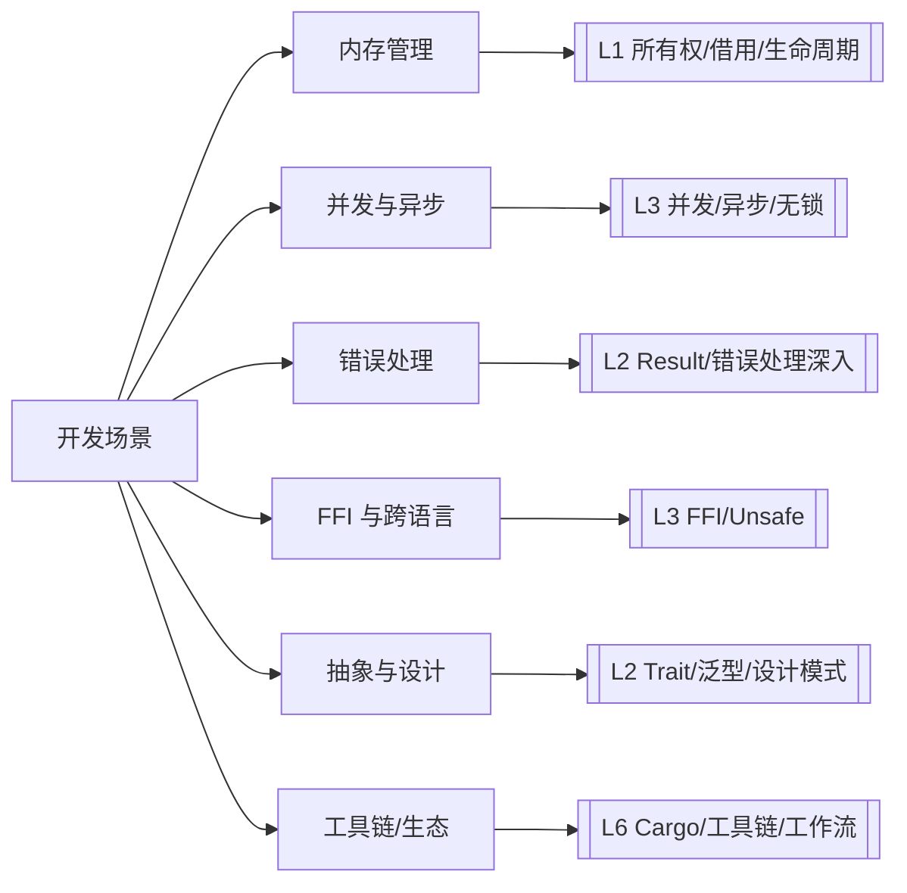
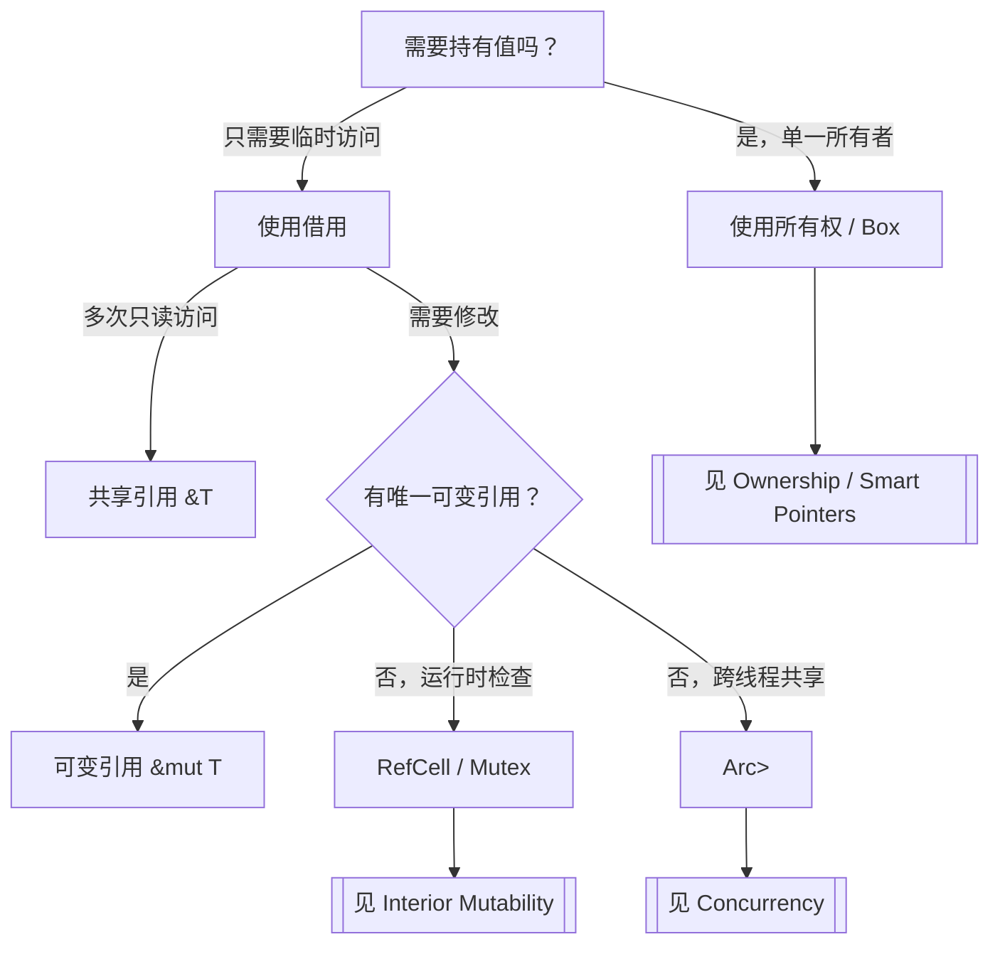
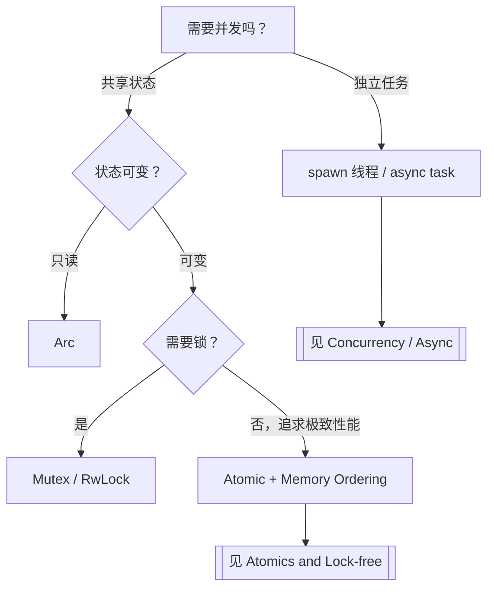
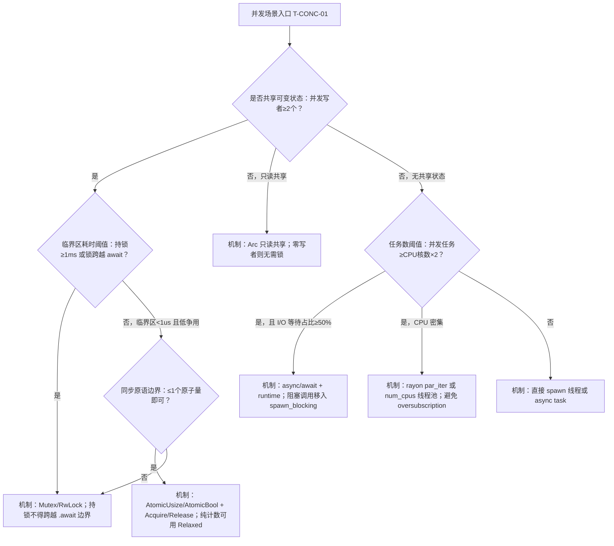
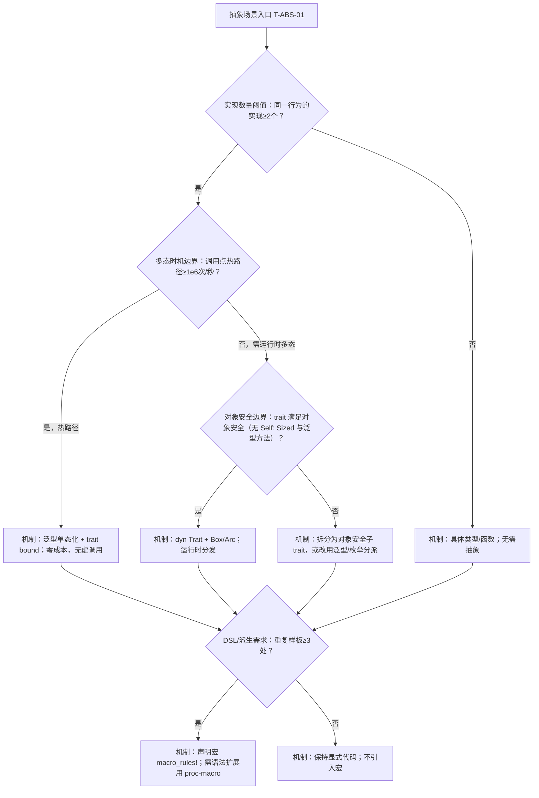

# 场景决策树图谱（Scenario Decision Tree Atlas）

> **EN**: Scenario Decision Tree Atlas
> **Summary**: A navigational index that maps typical Rust development scenarios to decision questions, candidate solutions, and authoritative concept pages across L1–L7. 典型开发场景 → 决策问题 → 候选方案 → Rust 概念/工具选择。
> **Rust 版本**: 1.97.0+ (Edition 2024)
> **受众**: [研究者]
> **内容分级**: [元层]
> **权威来源**: 本文件为 `concept/` 权威页。
> **来源**: [Rust Reference](https://doc.rust-lang.org/reference/introduction.html) · [TRPL](https://doc.rust-lang.org/book/title-page.html)

---

## 一、使用说明

本图谱不重复权威页正文，只提供**决策入口**。每个场景给出需要回答的关键问题、可选择的 Rust 机制/工具，以及对应的权威概念页链接。研究者可通过层级与场景两维快速定位。

---

## 二、场景总览



---

## 三、按场景索引

本节将「按场景索引」分解为若干主题：内存管理场景、并发与异步场景、错误处理场景、FFI 与跨语言场景等6个方面。

### 3.1 内存管理场景

| 决策问题 | 候选方案 | 关键概念页 |
|:---|:---|:---|
| 数据是否需要在函数调用后继续使用？ | 返回值 / 借用 / `Rc`/`Arc` | [Ownership](../../01_foundation/01_ownership_borrow_lifetime/01_ownership.md), [Borrowing](../../01_foundation/01_ownership_borrow_lifetime/02_borrowing.md), [Smart Pointers](../../02_intermediate/02_memory_management/12_smart_pointers.md) |
| 是否需要在多个所有者之间共享只读数据？ | `Rc<T>` / `Arc<T>` | [Smart Pointers](../../02_intermediate/02_memory_management/12_smart_pointers.md), [Concurrency](../../03_advanced/00_concurrency/01_concurrency.md) |
| 是否需要在不可变引用下修改内部状态？ | `Cell` / `RefCell` / `Mutex` | [Interior Mutability](../../02_intermediate/02_memory_management/08_interior_mutability.md), [Lock-free](../../03_advanced/00_concurrency/16_lock_free.md) |
| 堆分配还是栈分配？ | `Box<T>` / 栈数组 / 自定义分配器 | [Memory Management](../../02_intermediate/02_memory_management/03_memory_management.md), [Custom Allocators](../../03_advanced/06_low_level_patterns/14_custom_allocators.md) |
| 是否需要写时克隆或零拷贝？ | `Cow<T>` / 切片借用 | [Cow and Borrowed](../../02_intermediate/02_memory_management/11_cow_and_borrowed.md), [Zero-copy Parsing](../../03_advanced/06_low_level_patterns/15_zero_copy_parsing.md) |

### 3.2 并发与异步场景

| 决策问题 | 候选方案 | 关键概念页 |
|:---|:---|:---|
| 任务是否需要共享可变状态？ | `Mutex` / `RwLock` / 消息通道 | [Concurrency](../../03_advanced/00_concurrency/01_concurrency.md), [Concurrency Patterns](../../03_advanced/00_concurrency/10_concurrency_patterns.md) |
| 是否需要无锁/原子操作？ | `Atomic*` + Memory Ordering | [Atomics and Memory Ordering](../../03_advanced/00_concurrency/11_atomics_and_memory_ordering.md), [Lock-free](../../03_advanced/00_concurrency/16_lock_free.md) |
| I/O 密集型还是 CPU 密集型？ | `async`/await / 线程池 | [Async/Await](../../03_advanced/01_async/02_async.md), [Async Patterns](../../03_advanced/01_async/26_async_patterns.md) |
| 自引用类型如何跨 await 点保存？ | `Pin<Box<Self>>` / `Pin<&mut Self>` | [Pin and Unpin](../../03_advanced/01_async/06_pin_unpin.md), [Async Closures](../../03_advanced/01_async/24_async_closures.md) |

### 3.3 错误处理场景

| 决策问题 | 候选方案 | 关键概念页 |
|:---|:---|:---|
| 错误是否可恢复？ | `Result<T, E>` / `panic!` / `abort` | [Panic and Abort](../../01_foundation/08_error_handling/13_panic_and_abort.md), [Error Handling Basics](../../01_foundation/08_error_handling/32_error_handling_basics.md) |
| 需要自定义错误类型吗？ | `thiserror` / `anyhow` / 手动 `enum` | [Error Handling Deep Dive](../../02_intermediate/03_error_handling/16_error_handling_deep_dive.md), [Error Handling Intermediate](../../02_intermediate/03_error_handling/04_error_handling.md) |
| 跨 FFI 边界如何处理错误？ | 错误码 / 返回值约定 | [FFI](../../03_advanced/04_ffi/05_rust_ffi.md), [FFI Advanced](../../03_advanced/04_ffi/09_ffi_advanced.md) |

### 3.4 FFI 与跨语言场景

| 决策问题 | 候选方案 | 关键概念页 |
|:---|:---|:---|
| 是否需要调用 C 库？ | `extern "C"` / `bindgen` | [Rust FFI](../../03_advanced/04_ffi/05_rust_ffi.md), [Linkage](../../03_advanced/04_ffi/27_linkage.md) |
| 安全抽象如何封装 unsafe？ | `unsafe` 块 + 不变式文档 | [Unsafe Rust](../../03_advanced/02_unsafe/03_unsafe.md), [Unsafe Rust Patterns](../../03_advanced/02_unsafe/12_unsafe_rust_patterns.md) |
| ABI 如何控制？ | `#[repr(C)]` / `no_mangle` / `extern` | [Application Binary Interface](../../04_formal/05_rustc_internals/38_application_binary_interface.md), [ABI/对象模型对比](../../05_comparative/01_systems_languages/18_cpp_abi_object_model.md) |

### 3.5 抽象与设计场景

| 决策问题 | 候选方案 | 关键概念页 |
|:---|:---|:---|
| 如何定义共享行为？ | `trait` / 泛型约束 | [Traits](../../02_intermediate/00_traits/01_traits.md), [Generics](../../02_intermediate/01_generics/02_generics.md) |
| 需要编译期多态还是运行时多态？ | 泛型单态化 / `dyn Trait` | [Dispatch Mechanisms](../../02_intermediate/00_traits/39_dispatch_mechanisms.md), [Type Erasure](../../03_advanced/06_low_level_patterns/17_type_erasure.md) |
| 需要领域特定语言？ | 声明宏 / 过程宏 | [Attributes and Macros](../../01_foundation/09_macros_basics/12_attributes_and_macros.md), [Proc Macros](../../03_advanced/03_proc_macros/07_proc_macro.md) |

### 3.6 工具链与生态场景

| 决策问题 | 候选方案 | 关键概念页 |
|:---|:---|:---|
| 单 crate 还是多 crate 工作区？ | Workspace / single package | [Cargo Workspaces](../../06_ecosystem/01_cargo/78_cargo_workspaces.md), [Cargo Getting Started](../../06_ecosystem/01_cargo/80_cargo_getting_started.md) |
| 依赖版本冲突如何解决？ | SemVer / lockfile / resolver | [Cargo Dependency Resolution](../../06_ecosystem/01_cargo/60_cargo_dependency_resolution.md), [cargo-semver-checks 预研](../../07_future/03_preview_features/46_cargo_semver_checks_preview.md) |
| 发布前需要哪些质量门禁？ | `clippy` / `rustfmt` / tests / docs | [Testing Strategies](../../06_ecosystem/09_testing_and_quality/12_testing_strategies.md), [DevOps and CI/CD](../../06_ecosystem/00_toolchain/28_devops_and_ci_cd.md) |

---

## 四、典型决策树示例

「典型决策树示例」部分包含内存管理决策树 与 并发模型决策树 两条主线，本节依次说明。

### 4.1 内存管理决策树



### 4.2 并发模型决策树



---

## 五、使用提示

1. 从"症状类别"进入，找到最贴近的决策树。
2. 在每个决策节点诚实回答，不要跳过看似不相关的分支。
3. 叶子节点给出的权威页才是最终答案，不要停留在本页。

## 六、与相关元页的关系

- 需要按概念查定义 → [概念定义图谱](01_concept_definition_atlas.md)
- 需要按属性筛选 → [属性关系图谱](02_attribute_relationship_atlas.md)
- 需要按错误症状定位 → [推理判定树图谱](09_reasoning_judgment_tree_atlas.md)
- 需要跨层依赖图 → [层间映射图谱](06_inter_layer_mapping_atlas.md)

---

## 闭环增强（可执行化）

> 本小节为**纯增量**补充：把 §3–§4 的导航式场景树升级为含**定量阈值/边界条件**的可执行判定树，叶子一律给出**具体机制**而非 `[[见…]]` 跳出，并与 05（定理）/09（判定树）建立稳定 ID 与跨文件回边。原 §3–§6 全部内容保持不变。
>
> 节点 ID 体系：本文件新增决策节点以 `T-<场景>-NN` 命名（如 `T-MEM-01`），供 05/09 回边引用。判定节点均为含阈值/边界/数字的可判定条件。

### A. 内存管理场景（入口 `T-MEM-01`）

```mermaid
flowchart TD
    M0[内存场景入口 T-MEM-01] --> M1{数据规模阈值：≥1MB 或元素数≥1024个？}
    M1 -->|是，且跨线程共享| M2{所有者数量边界：跨线程所有者≥2个？}
    M1 -->|否，栈上小数据| M7[机制：栈值或定长数组；元素数>1024时用 Vec::with_capacity 预分配]
    M2 -->|是| M3[机制：Arc<T> 只读共享；需可变则用 Arc<Mutex<T>> 或 Arc<RwLock<T>>]
    M2 -->|否，单线程| M4[机制：Rc<T>；需内部可变则 Rc<RefCell<T>>]
    M1 -->|迭代中需修改| M5{修改次数边界：迭代内可变借用≥1次？}
    M5 -->|是| M6[机制：先 collect 为拥有所有权的 Vec 再修改，或用索引/Vec::retain]
    M5 -->|否| M8[机制：直接 &mut 迭代；不引入额外分配]
    M3 --> M9[机制：写时克隆用 Cow<'_, T>；零拷贝解析用切片借用 &[u8]]
    M4 --> M9
    M6 --> M9
    M7 --> M9
    M8 --> M9
```

> 叶子合规：本树叶子均为具体机制（`Arc`/`Rc`/`Cow`/`collect`/`with_capacity`），无 `[[` 跳出。
> 回边：见 [`09_reasoning_judgment_tree_atlas.md#J-BORROW-01`](09_reasoning_judgment_tree_atlas.md)（叶 M6「迭代中修改→先 collect」对应借用冲突判定入口）。
> 回边：见 [`05_logical_reasoning_atlas.md#TH-OWN-01`](05_logical_reasoning_atlas.md)（单一所有权分支 M3/M4 的定理依据）。

### B. 并发与异步场景（入口 `T-CONC-01`）



> 叶子合规：本树叶子均为具体机制（`Mutex`/`Atomic*`/`rayon`/`spawn_blocking`），无 `[[` 跳出。
> 回边：见 [`09_reasoning_judgment_tree_atlas.md#J-PANIC-04`](09_reasoning_judgment_tree_atlas.md)（叶 C3「持锁跨 await」对应运行时 panic/死锁判定入口）。
> 回边：见 [`05_logical_reasoning_atlas.md#TH-SEND-06`](05_logical_reasoning_atlas.md)（共享/跨线程边界的定理依据）。

### C. 错误处理场景（入口 `T-ERR-01`）

```mermaid
flowchart TD
    E0[错误处理场景入口 T-ERR-01] --> E1{可恢复性边界：调用方可恢复概率≥1%？}
    E1 -->|是，可恢复| E2{错误源数量阈值：不同错误类型≥3个？}
    E1 -->|否，编程错误或不变式破坏| E5[机制：panic!/assert!/unreachable!；不可恢复即快速失败]
    E2 -->|是| E3[机制：自定义 enum + thiserror 派生 Error；库边界优先 thiserror]
    E2 -->|否，1-2 个错误源| E4[机制：anyhow::Result（应用层）或 Box<dyn Error>]
    E3 --> E6{跨 FFI 边界：extern "C" 调用≥1处？}
    E4 --> E6
    E6 -->|是| E7[机制：FFI 边界用错误码/返回值约定；不把 Rust panic 传出 extern]
    E6 -->|否| E8[机制：用 ? 传播 + map_err 统一类型；调用点 match 处理]
```

> 叶子合规：本树叶子均为具体机制（`thiserror`/`anyhow`/`?`/`panic!`/错误码），无 `[[` 跳出。
> 回边：见 [`09_reasoning_judgment_tree_atlas.md#J-TYPE-03`](09_reasoning_judgment_tree_atlas.md)（叶 E8「错误类型不统一」对应类型不匹配判定入口）。

### D. FFI 与跨语言场景（入口 `T-FFI-01`）

```mermaid
flowchart TD
    F0[FFI 场景入口 T-FFI-01] --> F1{外部调用次数边界：extern 函数≥1个？}
    F1 -->|是| F2{是否传字符串/切片：跨边界指针参数≥1个？}
    F1 -->|否| F7[机制：纯 Rust，无需 FFI；保持 safe API]
    F2 -->|是| F3[机制：#[repr(C)] 布局 + 显式 (ptr, len) 对；用 std::ffi::CString/CStr]
    F2 -->|否，仅 POD| F4{ABI 边界：需固定布局或符号≥1项？}
    F4 -->|是| F5[机制：#[repr(C)] + extern "C" + bindgen 生成绑定]
    F4 -->|否| F6[机制：直接 extern "C" fn；保持 ABI 简单]
    F3 --> F8{unsafe 封装边界：unsafe 块≥1块？}
    F5 --> F8
    F6 --> F8
    F8 -->|是| F9[机制：unsafe 块外暴露 safe API，文档化 invariant]
```

> 叶子合规：本树叶子均为具体机制（`#[repr(C)]`/`bindgen`/`CString`/safe 封装），无 `[[` 跳出。
> 回边：见 [`09_reasoning_judgment_tree_atlas.md#J-UNSAFE-05`](09_reasoning_judgment_tree_atlas.md)（叶 F9「unsafe 封装」对应 unsafe 判定入口）。

### E. 抽象与设计场景（入口 `T-ABS-01`）



> 叶子合规：本树叶子均为具体机制（泛型单态化/`dyn Trait`/`macro_rules!`/proc-macro），无 `[[` 跳出。
> 回边：见 [`09_reasoning_judgment_tree_atlas.md#J-TYPE-03`](09_reasoning_judgment_tree_atlas.md)（叶 A3/A5「trait bound/对象安全」对应类型不匹配判定入口）。
> 回边：见 [`05_logical_reasoning_atlas.md#TH-VAR-08`](05_logical_reasoning_atlas.md)（叶 A5 子类型/变型安全的定理依据）。

### F. 工具链与生态场景（入口 `T-TOOL-01`）

```mermaid
flowchart TD
    W0[工具链场景入口 T-TOOL-01] --> W1{crate 数量阈值：相关 crate≥2个？}
    W1 -->|是| W2[机制：Cargo workspace + 共享 workspace.dependencies；resolver = "2"]
    W1 -->|否| W3[机制：单 package；保持简单]
    W2 --> W4{依赖冲突边界：同一 crate 主版本冲突≥1处？}
    W3 --> W4
    W4 -->|是| W5[机制：cargo tree -d 定位；用 [patch] 或升级对齐 SemVer；lockfile 锁定]
    W4 -->|否| W6{发布前门禁：未过质量门≥1项？}
    W5 --> W6
    W6 -->|是| W7[机制：cargo fmt/check/test + clippy 升 -D warnings + cargo audit 全绿再发布]
    W6 -->|否| W8[机制：cargo publish --dry-run 验证后发布]
```

> 叶子合规：本树叶子均为具体机制（workspace/`cargo tree -d`/`[patch]`/clippy/audit），无 `[[` 跳出。
> 验证回边：本树发布门禁与 [`09_reasoning_judgment_tree_atlas.md`](09_reasoning_judgment_tree_atlas.md) 的「验证回边 V1–V5」共用同一套命令（check/clippy/test/audit）。

### G. 本文件闭环小结

- 新增决策树：**6 棵**（A–F），覆盖 §3 全部 6 个场景；原 §4 两棵示例树保留不动。
- 新增定量判定节点：**21 个**（A:3 / B:4 / C:3 / D:4 / E:4 / F:3），均含阈值/边界/数字。
- 新增 `[[` 跳出叶子：**0**（所有叶子为具体机制）。
- 跨文件回边：→ 09 `J-BORROW-01`/`J-PANIC-04`/`J-TYPE-03`/`J-UNSAFE-05`；→ 05 `TH-OWN-01`/`TH-SEND-06`/`TH-VAR-08`（共 8 条逻辑回边）。

---

---

## 国际权威参考 / International Authority References（P0 官方 · P1 学术 · P2 生态）

> 依据 `AGENTS.md` §2「对齐网络国际化权威内容」补充：仅追加已验证可达的权威链接，不改动正文事实。

- **P1 学术/形式化**: [Hogan et al.: Knowledge Graphs (ACM Comput. Surv. 2021)](https://dl.acm.org/doi/10.1145/3447772)
