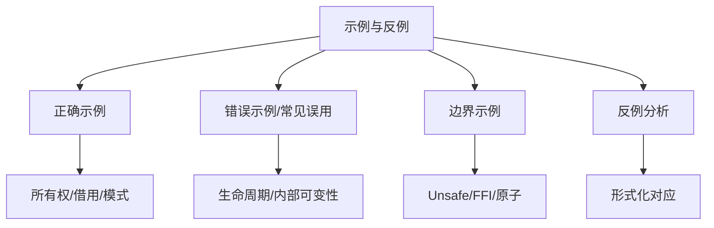

# 示例与反例图谱（Example and Counterexample Atlas）

> **EN**: Example and Counterexample Atlas
> **Summary**: A navigational index of correct examples, common misuses, boundary cases, and counterexamples organized by concept layer. 按概念组织的正确示例、错误示例、边界示例与反例分析。
> **Rust 版本**: 1.97.0+ (Edition 2024)
> **受众**: [研究者]
> **内容分级**: [综述级]
> **权威来源**: 本文件为 `concept/` 权威页。
> **来源**: [Rust Reference](https://doc.rust-lang.org/reference/introduction.html) · [TRPL](https://doc.rust-lang.org/book/title-page.html)

---

## 一、使用说明

本图谱只提供**示例入口**，不复制权威页中的代码或解释。每行给出概念页、建议观察的示例类型，以及该页中可重点阅读的示例主题。学习者应按链接进入对应权威页查看完整示例与编译器反馈。

---

## 二、示例分类总览

---

## 三、按层级索引

本节聚焦「按层级索引」，覆盖L1 基础概念层、L2 进阶概念层、L3 高级概念层、L4 形式化理论层等方面。论述顺序由定义到边界：先明确「按层级索引」在「示例与反例图谱（Example and Counterexample Atlas）」中的确切含义与适用范围，再给出可核验的例证或数据，最后标注它与相邻主题的分界线。读完后应能用一句话复述「按层级索引」的判定标准，并指出它在全页论证链中的位置。

### 3.1 L1 基础概念层

| 概念页 | 推荐示例类型 | 主题提示 |
|:---|:---:|:---|
| [Ownership](../../01_foundation/01_ownership_borrow_lifetime/01_ownership.md) | 正确 + 错误 | 移动语义、`Copy` 与 `Clone`、use-after-move |
| [Borrowing](../../01_foundation/01_ownership_borrow_lifetime/02_borrowing.md) | 错误 + 边界 | 可变/共享借用冲突、reborrow、split borrow |
| [Lifetimes](../../01_foundation/01_ownership_borrow_lifetime/03_lifetimes.md) | 错误 + 边界 | 悬垂引用、生命周期省略、显式标注 |
| [Type System Basics](../../01_foundation/02_type_system/01_type_system.md) | 正确 + 边界 | 枚举、模式匹配、类型推断 |
| [Reference Semantics](../../01_foundation/03_values_and_references/01_reference_semantics.md) | 正确 + 错误 | 自动解引用、`Deref` 强制、类型转换 |
| [Control Flow](../../01_foundation/04_control_flow/01_control_flow.md) | 正确 + 边界 | 表达式导向、`if let`、穷尽性 |
| [Collections](../../01_foundation/05_collections/01_collections.md) | 正确 + 边界 | `Vec`、`HashMap`、迭代器消耗 |
| [Strings and Text](../../01_foundation/06_strings_and_text/01_strings_and_text.md) | 错误 + 边界 | `String` vs `str`、UTF-8 边界 |
| [Modules and Paths](../../01_foundation/07_modules_and_items/01_modules_and_paths.md) | 正确 + 错误 | 可见性、路径解析、re-export |
| [Attributes and Macros](../../01_foundation/09_macros_basics/01_attributes_and_macros.md) | 正确 + 边界 | 声明宏、属性展开 |
| [Panic and Abort](../../01_foundation/08_error_handling/03_panic_and_abort.md) | 边界 | 可恢复 vs 不可恢复、panic 边界 |

### 3.2 L2 进阶概念层

| 概念页 | 推荐示例类型 | 主题提示 |
|:---|:---:|:---|
| [Traits](../../02_intermediate/00_traits/01_traits.md) | 正确 + 错误 | trait bound、orphan rule、object safety |
| [Generics](../../02_intermediate/01_generics/01_generics.md) | 正确 + 边界 | 单态化、关联类型、HRTB |
| [Interior Mutability](../../02_intermediate/02_memory_management/02_interior_mutability.md) | 正确 + 错误 | `RefCell` panic、`Cell` 使用场景 |
| [Smart Pointers](../../02_intermediate/02_memory_management/04_smart_pointers.md) | 正确 + 边界 | `Box`/`Rc`/`Arc`、循环引用 |
| [Iterator Patterns](../../02_intermediate/07_iterators_and_closures/01_iterator_patterns.md) | 正确 + 边界 | 适配器链、消费与借用 |
| [Closure Types](../../02_intermediate/04_types_and_conversions/02_closure_types.md) | 正确 + 错误 | `Fn`/`FnMut`/`FnOnce`、捕获方式 |
| [Newtype and Wrapper](../../02_intermediate/04_types_and_conversions/03_newtype_and_wrapper.md) | 正确 + 边界 | 类型安全、零成本抽象 |
| [Error Handling Deep Dive](../../02_intermediate/03_error_handling/02_error_handling_deep_dive.md) | 正确 + 边界 | `thiserror`/`anyhow`、自定义错误 |
| [Macro Patterns](../../02_intermediate/06_macros_and_metaprogramming/03_macro_patterns.md) | 正确 + 错误 | 宏卫生、重复模式 |

### 3.3 L3 高级概念层

| 概念页 | 推荐示例类型 | 主题提示 |
|:---|:---:|:---|
| [Concurrency](../../03_advanced/00_concurrency/01_concurrency.md) | 正确 + 错误 | 数据竞争、Send/Sync 误用 |
| [Async/Await](../../03_advanced/01_async/01_async.md) | 正确 + 边界 | `.await` 挂起、executor 边界 |
| [Pin and Unpin](../../03_advanced/01_async/08_pin_unpin.md) | 正确 + 错误 | 自引用类型、Pin 投影 |
| [Unsafe Rust](../../03_advanced/02_unsafe/01_unsafe.md) | 错误 + 边界 | raw pointer、soundness 不变式 |
| [FFI](../../03_advanced/04_ffi/01_rust_ffi.md) | 正确 + 错误 | ABI 约定、生命周期桥接 |
| [Atomics and Memory Ordering](../../03_advanced/00_concurrency/06_atomics_and_memory_ordering.md) | 边界 + 反例 | 错误 memory order、happens-before |
| [Lock-free](../../03_advanced/00_concurrency/07_lock_free.md) | 边界 + 反例 | ABA、内存回收 |
| [Proc Macros](../../03_advanced/03_proc_macros/02_proc_macro.md) | 正确 + 错误 | derive/attribute/function-like |

### 3.4 L4 形式化理论层

| 概念页 | 推荐示例类型 | 主题提示 |
|:---|:---:|:---|
| [Linear Logic](../../04_formal/01_ownership_logic/01_linear_logic.md) | 反例 + 边界 | 所有权 vs 线性/仿射逻辑对应 |
| [RustBelt](../../04_formal/02_separation_logic/01_rustbelt.md) | 反例 + 边界 | unsafe 抽象 soundness 证明 |
| [Separation Logic](../../04_formal/02_separation_logic/02_separation_logic.md) | 反例 + 边界 | frame rule、所有权拆分 |
| [Miri](../../04_formal/04_model_checking/08_miri.md) | 错误 + 边界 | UB 检测、Stacked/Tree Borrows |
| [Kani](../../04_formal/04_model_checking/09_kani.md) | 边界 | 有界模型检查反例 |
| [Behavior Considered Undefined](../../04_formal/01_ownership_logic/06_behavior_considered_undefined.md) | 反例 | UB 清单逐项示例 |

### 3.5 L5–L7 层

| 概念页 | 推荐示例类型 | 主题提示 |
|:---|:---:|:---|
| [Rust vs C++](../../05_comparative/01_systems_languages/01_rust_vs_cpp.md) | 对比示例 | 构造、析构、move、FFI |
| [Rust vs Go](../../05_comparative/01_systems_languages/03_rust_vs_go.md) | 对比示例 | 所有权 vs CSP、错误处理 |
| [Execution Model Isomorphism](../../05_comparative/00_paradigms/02_execution_model_isomorphism.md) | 边界示例 | 同步/异步/并发/并行映射 |
| [Core Crates](../../06_ecosystem/02_core_crates/01_core_crates.md) | 正确示例 | serde、tokio、clap 等典型用法 |
| [Design Patterns](../../06_ecosystem/03_design_patterns/01_patterns.md) | 正确 + 边界 | 类型状态、构建器、访问者 |
| [Rust 2024 Edition](../../07_future/01_edition_roadmap/01_rust_edition_preview.md) | 边界示例 | edition 迁移前后差异 |

---

## 四、常见反例主题速查

| 反例主题 | 典型错误表现 | 应进入的权威页 |
|:---|:---|:---|
| use-after-move | 编译器 `use of moved value` | [Ownership](../../01_foundation/01_ownership_borrow_lifetime/01_ownership.md) |
| 可变+共享借用冲突 | `cannot borrow as mutable because it is also borrowed as immutable` | [Borrowing](../../01_foundation/01_ownership_borrow_lifetime/02_borrowing.md) |
| 悬垂引用 | lifetime may not live long enough | [Lifetimes](../../01_foundation/01_ownership_borrow_lifetime/03_lifetimes.md) |
| 非 Send 类型跨线程 | `Rc<RefCell<T>>` 传给 `spawn` | [Concurrency](../../03_advanced/00_concurrency/01_concurrency.md) |
| 自引用类型移动 | `Pin` 使用不当导致 UB | [Pin and Unpin](../../03_advanced/01_async/08_pin_unpin.md) |
| unsafe 违反 soundness | raw pointer 别名违规 | [Unsafe Rust](../../03_advanced/02_unsafe/01_unsafe.md), [Miri](../../04_formal/04_model_checking/08_miri.md) |

---

## 五、阅读策略

- **初学者**：从 L1 的正确示例开始，先建立直观印象。
- **进阶者**：重点阅读 L2 错误示例，理解编译器报错背后的规则。
- **专家/研究者**：关注 L3-L4 边界示例与反例，理解 soundness 与 UB 边界。

## 六、与相关元页的关系

- 需要按场景决策 → [场景决策树图谱](03_scenario_decision_tree_atlas.md)
- 需要按错误症状定位 → [推理判定树图谱](09_reasoning_judgment_tree_atlas.md)
- 需要形式化推理链 → [逻辑推理图谱](05_logical_reasoning_atlas.md)
- 需要查看概念定义 → [概念定义图谱](01_concept_definition_atlas.md)

<!-- GENERATED-INDEX: 以下「数据驱动索引」节由 scripts/generate_knowledge_topology_atlas.py 自动生成；人工策展内容写在标记之前。 -->

## 七、数据驱动索引：示例/反例覆盖全量概念（自动生成）

> 以下来自 `extract_concept_topology.py` 的表征信号抽取：概念页含「示例/反例/陷阱/边界测试/误用/易错」类章节（`##`–`####` 级标题，含「⚠️ 反例与陷阱」「### N.N 反例」等深层小节），或含 `compile_fail` 编译反例代码块，即收录。每行仅给出入口与信号，正文以权威页为准。

覆盖 **352** 个概念（信号：示例/反例类章节或 compile_fail 代码块）。

### L0 元信息层（18 个概念）

| 概念页 | 表征信号 | 主题提示 |
|:---|:---|:---|
| [Bloom Taxonomy](../../00_meta/00_framework/bloom_taxonomy.md) | 示例/反例节 ×1 | 边界测试：Bloom 层级 L5-L7 的形式化定义与 Rust 概念映射（认… |
| [C/C++ → Rust 工程层对比路线图](../../00_meta/00_framework/cpp_rust_engineering_roadmap.md) | 示例/反例节 ×1 | 代码对比示例 |
| [Rust 编译期可判定性谱系全景](../../00_meta/00_framework/decidability_spectrum.md) | 示例/反例节 ×1 · compile_fail ×2 | 边界测试：类型推断的不可判定性与人工标注（编译错误） |
| [方法论：思维表征与知识结构规范](../../00_meta/00_framework/methodology.md) | 示例/反例节 ×3 | 示例与反例（Examples & Counter-examples） · 代码示例规范 |
| [Rust 范式转换模式矩阵](../../00_meta/00_framework/paradigm_transition_matrix.md) | 示例/反例节 ×2 | 学习难点与认知陷阱 · 通用认知陷阱 |
| [语义桥：算法、设计模式与工作流模式的统一谱系](../../00_meta/00_framework/semantic_bridge_algorithms_patterns.md) | 示例/反例节 ×1 | Rust 示例 |
| [Rust 表征空间](../../00_meta/00_framework/semantic_space.md) | 示例/反例节 ×1 · compile_fail ×1 | 边界测试：术语过载与跨层语义漂移（概念混淆） |
| [Rust 知识体系定理推理森林](../../00_meta/00_framework/theorem_inference_forest.md) | 示例/反例节 ×1 | 失效条件与反例 |
| [Concept 文件双语模板 v2](../../00_meta/01_terminology/02_bilingual_template_v2.md) | 示例/反例节 ×9 · compile_fail ×2 | 技术细节与示例 · 示例与反例 |
| [Concept 文件双语模板](../../00_meta/01_terminology/03_bilingual_template.md) | 示例/反例节 ×1 | 示例代码 |
| [Rust 知识体系 A/S/P 三维认知标记规范](../../00_meta/03_audit/02_asp_marking_guide.md) | 示例/反例节 ×4 | 标记应用示例 · 示例 1：借用检查错误诊断 |
| [概念一致性检查清单](../../00_meta/03_audit/03_audit_checklist.md) | 示例/反例节 ×4 | 反例与边界完备性检查（Counter-example Completeness… · 每个核心概念的反例覆盖 |
| [全局概念索引](../../00_meta/04_navigation/03_concept_index.md) | 示例/反例节 ×1 | 反例 → 概念 速查索引 |
| [Rust 知识体系自测题库](../../00_meta/04_navigation/12_self_assessment.md) | 示例/反例节 ×1 · compile_fail ×2 | 边界测试：Bloom 层级与代码复杂度评估（概念映射） |
| [场景决策树图谱](../../00_meta/knowledge_topology/03_scenario_decision_tree_atlas.md) | 示例/反例节 ×1 | 典型决策树示例 |
| [示例与反例图谱](../../00_meta/knowledge_topology/04_example_counterexample_atlas.md) | 示例/反例节 ×3 | 示例分类总览 · 常见反例主题速查 |
| [Rust 知识体系知识图谱本体规范 v2.0](../../00_meta/knowledge_topology/kg_ontology_v2.md) | 示例/反例节 ×2 | Turtle 示例 · JSON-LD 1.1 示例 |
| [Rust 知识体系顶层本体（TLO）对齐](../../00_meta/knowledge_topology/kg_tlo_alignment.md) | 示例/反例节 ×1 | 5. `kg_data_v3.json` 关键实体 TLO 映射示例 |

### L1 基础概念层（38 个概念）

| 概念页 | 表征信号 | 主题提示 |
|:---|:---|:---|
| [零成本抽象：Rust 的性能哲学](../../01_foundation/00_start/02_zero_cost_abstractions.md) | 示例/反例节 ×9 · compile_fail ×4 | 边界测试：零成本抽象的编译错误 · 边界测试：泛型单态化与代码膨胀（逻辑错误 / 编译器限制） |
| [闭包基础：捕获环境与匿名函数](../../01_foundation/00_start/03_closure_basics.md) | 示例/反例节 ×8 · compile_fail ×5 | 常见陷阱 · 边界测试：闭包的编译错误 |
| [副作用与纯度：从引用透明到 Rust 的所有权效果](../../01_foundation/00_start/04_effects_and_purity.md) | 示例/反例节 ×10 · compile_fail ×7 | 反例与边界测试 · 反例：隐式副作用的 C/C++ 陷阱 |
| [标准 I/O 与进程](../../01_foundation/00_start/05_std_io_and_process.md) | 示例/反例节 ×8 · compile_fail ×1 | 技术细节与示例 · 示例与反例 |
| [Ownership](../../01_foundation/01_ownership_borrow_lifetime/01_ownership.md) | 示例/反例节 ×16 · compile_fail ×15 | 示例与反例（Examples & Counter-examples） · 正确示例：所有权转移 |
| [Borrowing](../../01_foundation/01_ownership_borrow_lifetime/02_borrowing.md) | 示例/反例节 ×15 · compile_fail ×17 | 示例与反例（Examples & Counter-examples） · 正确示例：不可变借用共存 |
| [Lifetimes](../../01_foundation/01_ownership_borrow_lifetime/03_lifetimes.md) | 示例/反例节 ×18 · compile_fail ×16 | 示例与反例（Examples & Counter-examples） · 正确示例：显式生命周期标注 |
| [Lifetimes 高级主题](../../01_foundation/01_ownership_borrow_lifetime/04_lifetimes_advanced.md) | 示例/反例节 ×11 · compile_fail ×5 | Step 6: 边界测试（Boundary Testing） · 代码示例：正确使用 + 典型错误 |
| [所有权清单自测：Brown University Ownership Inventory](../../01_foundation/01_ownership_borrow_lifetime/06_ownership_inventories_brown_book.md) | 示例/反例节 ×1 · compile_fail ×2 | 样题示例 |
| [Type System Basics](../../01_foundation/02_type_system/01_type_system.md) | 示例/反例节 ×14 · compile_fail ×14 | 示例与反例（Examples & Counter-examples） · 正确示例：ADT + Pattern Matching |
| [Never Type (`!`)：底类型与穷尽性](../../01_foundation/02_type_system/02_never_type.md) | 示例/反例节 ×4 · compile_fail ×3 | 边界测试 · 边界测试：尝试构造 `!` 的值（编译错误） |
| [数值类型与运算：从整数到浮点的完整图景](../../01_foundation/02_type_system/03_numerics.md) | 示例/反例节 ×13 · compile_fail ×4 | 常见陷阱 · 边界测试：数值类型的编译错误 |
| [类型强制与转换：显式与隐式的边界](../../01_foundation/02_type_system/04_coercion_and_casting.md) | 示例/反例节 ×10 · compile_fail ×6 | 常见陷阱 · 边界测试：类型转换的编译错误 |
| [数据抽象谱系：从 C struct 到 Rust enum + trait](../../01_foundation/02_type_system/05_data_abstraction_spectrum.md) | 示例/反例节 ×10 · compile_fail ×2 | 反例与边界测试 · 反例：C++ 的 std::variant vs Rust enum |
| [引用语义：自动解引用、Deref 强制与类型转换](../../01_foundation/03_values_and_references/01_reference_semantics.md) | 示例/反例节 ×8 · compile_fail ×4 | 代码示例集 · 边界测试：引用语义的编译错误 |
| [变量模型：从通用 PL 视角看 Rust 的所有权](../../01_foundation/03_values_and_references/03_variable_model.md) | 示例/反例节 ×11 · compile_fail ×4 | 反例与边界测试 · 反例：混淆绑定与赋值 |
| [控制流：表达式导向的流程控制](../../01_foundation/04_control_flow/01_control_flow.md) | 示例/反例节 ×13 · compile_fail ×6 | 常见陷阱 · 边界测试：控制流的编译错误 |
| [集合类型：Rust 标准库的数据结构谱系](../../01_foundation/05_collections/01_collections.md) | 示例/反例节 ×8 · compile_fail ×6 | 常见陷阱 · 边界测试：集合的编译错误 |
| [高级集合类型：BTreeMap、VecDeque、BinaryHeap 与自定义 Hasher 深度分析](../../01_foundation/05_collections/02_collections_advanced.md) | 示例/反例节 ×9 · compile_fail ×4 | 常见陷阱 · 编译验证示例 |
| [字符串与文本：Rust 的 Unicode 处理与格式化系统](../../01_foundation/06_strings_and_text/01_strings_and_text.md) | 示例/反例节 ×8 · compile_fail ×7 | 常见陷阱 · 边界测试：字符串与文本的编译错误 |
| [字符串与编码：Rust 的文本处理类型系统](../../01_foundation/06_strings_and_text/02_strings_and_encoding.md) | 示例/反例节 ×8 · compile_fail ×1 | 常见陷阱 · 边界测试：字符串编码的编译错误 |
| [格式化与显示](../../01_foundation/06_strings_and_text/03_formatting_and_display.md) | 示例/反例节 ×8 · compile_fail ×2 | 技术细节与示例 · 示例与反例 |
| [模块系统与路径：Rust 的代码组织哲学](../../01_foundation/07_modules_and_items/01_modules_and_paths.md) | 示例/反例节 ×8 · compile_fail ×3 | 常见陷阱 · 边界测试：模块系统的编译错误 |
| [Functions](../../01_foundation/07_modules_and_items/02_functions.md) | 示例/反例节 ×1 · compile_fail ×4 | 反例与边界测试 |
| [Use Declarations](../../01_foundation/07_modules_and_items/03_use_declarations.md) | 示例/反例节 ×1 · compile_fail ×3 | 反例与边界测试 |
| [Structs](../../01_foundation/07_modules_and_items/04_structs.md) | 示例/反例节 ×3 · compile_fail ×3 | 反例与边界测试 · 未实现 `Copy` 时的更新语法陷阱 |
| [Enumerations](../../01_foundation/07_modules_and_items/05_enumerations.md) | 示例/反例节 ×1 · compile_fail ×2 | 反例与边界测试 |
| [Implementations](../../01_foundation/07_modules_and_items/06_implementations.md) | 示例/反例节 ×1 · compile_fail ×3 | 反例与边界测试 |
| [类型别名](../../01_foundation/07_modules_and_items/07_type_aliases.md) | 示例/反例节 ×8 · compile_fail ×2 | 技术细节与示例 · 示例与反例 |
| [静态项](../../01_foundation/07_modules_and_items/08_static_items.md) | 示例/反例节 ×8 · compile_fail ×1 | 技术细节与示例 · 示例与反例 |
| [常量项与常量函数](../../01_foundation/07_modules_and_items/09_const_items_and_const_fn.md) | 示例/反例节 ×8 · compile_fail ×2 | 技术细节与示例 · 示例与反例 |
| [Crate 与源文件](../../01_foundation/07_modules_and_items/11_crates_and_source_files.md) | 示例/反例节 ×1 | Crate 级属性示例 |
| [项](../../01_foundation/07_modules_and_items/12_items.md) | 示例/反例节 ×1 | 常见 Item 示例 |
| [Rust 错误处理基础](../../01_foundation/08_error_handling/01_error_handling_basics.md) | 示例/反例节 ×8 · compile_fail ×5 | 常见陷阱 · 边界测试：错误处理的编译错误 |
| [Panic 与 Abort：不可恢复错误的处理机制](../../01_foundation/08_error_handling/03_panic_and_abort.md) | 示例/反例节 ×11 · compile_fail ×4 | 常见陷阱 · 边界测试：Panic 与 Abort 的编译错误 |
| [属性与声明宏：编译期元编程基础](../../01_foundation/09_macros_basics/01_attributes_and_macros.md) | 示例/反例节 ×7 · compile_fail ×4 | 常见陷阱 · 边界测试：属性与宏的编译错误 |
| [测试基础：从单元测试到集成测试](../../01_foundation/10_testing_basics/01_testing_basics.md) | 示例/反例节 ×5 · compile_fail ×1 | 常见陷阱 · 边界测试：`should_panic` 的预期消息匹配（运行时测试失败） |
| [常用开发工具](../../01_foundation/10_testing_basics/02_useful_development_tools.md) | 示例/反例节 ×1 | 配置示例 |

### L2 进阶概念层（29 个概念）

| 概念页 | 表征信号 | 主题提示 |
|:---|:---|:---|
| [Traits](../../02_intermediate/00_traits/01_traits.md) | 示例/反例节 ×18 · compile_fail ×12 | 示例与反例（Examples & Counter-examples） · 正确示例：Trait 定义与实现 |
| [分发机制 (Dispatch Mechanisms)](../../02_intermediate/00_traits/02_dispatch_mechanisms.md) | 示例/反例节 ×2 | 常见陷阱 · VTable 生成示例 |
| [Serde 序列化模式：Rust 的类型驱动数据转换](../../02_intermediate/00_traits/03_serde_patterns.md) | 示例/反例节 ×9 · compile_fail ×6 | 常见陷阱 · 边界测试：Serde 模式的编译错误 |
| [高级 Trait 主题：从关联类型到特化](../../02_intermediate/00_traits/04_advanced_traits.md) | 示例/反例节 ×9 · compile_fail ×5 | 常见陷阱 · 边界测试：高级 Trait 的编译错误 |
| [泛型关联类型](../../02_intermediate/00_traits/07_generic_associated_types.md) | 示例/反例节 ×4 · compile_fail ×1 | 实质代码示例 · 示例一：Lending Iterator —— 可变滑动窗口 |
| [Generics](../../02_intermediate/01_generics/01_generics.md) | 示例/反例节 ×15 · compile_fail ×6 | 示例与反例（Examples & Counter-examples） · 正确示例：泛型函数与约束 |
| [Const Generics（常量泛型）：值作为类型参数](../../02_intermediate/01_generics/02_const_generics.md) | 示例/反例节 ×5 | 实质示例 · 反例：stable 边界上的编译期拒绝 |
| [Memory Management](../../02_intermediate/02_memory_management/01_memory_management.md) | 示例/反例节 ×18 · compile_fail ×3 | 示例与反例（Examples & Counter-examples） · 正确示例：Box 堆分配 |
| [内部可变性：编译期规则的运行时逃逸](../../02_intermediate/02_memory_management/02_interior_mutability.md) | 示例/反例节 ×4 · compile_fail ×3 | 常见陷阱 · 编译错误示例 |
| [Cow：写时克隆与零拷贝抽象](../../02_intermediate/02_memory_management/03_cow_and_borrowed.md) | 示例/反例节 ×8 · compile_fail ×2 | 常见陷阱 · 边界测试：Cow 与借用的编译错误 |
| [智能指针：堆内存管理与共享语义](../../02_intermediate/02_memory_management/04_smart_pointers.md) | 示例/反例节 ×6 · compile_fail ×3 | 常见陷阱 · 编译错误示例 |
| [Error Handling](../../02_intermediate/03_error_handling/01_error_handling.md) | 示例/反例节 ×17 · compile_fail ×5 | 示例与反例（Examples & Counter-examples） · 正确示例：`?` 运算符链式传播 |
| [错误处理深入：从 Result 到自定义错误生态](../../02_intermediate/03_error_handling/02_error_handling_deep_dive.md) | 示例/反例节 ×7 · compile_fail ×3 | 常见陷阱 · 边界测试：错误处理的编译错误 |
| [Panic 机制](../../02_intermediate/03_error_handling/03_panic.md) | 示例/反例节 ×1 | `no_std` 示例 |
| [Rust 范围类型语义：`std::ops::Range` → `core::range`](../../02_intermediate/04_types_and_conversions/01_range_types.md) | 示例/反例节 ×7 · compile_fail ×4 | 边界测试：范围类型的编译错误 · 边界测试：范围模式在非 match 中使用（编译错误） |
| [闭包类型系统：Fn、FnMut、FnOnce 的捕获语义](../../02_intermediate/04_types_and_conversions/02_closure_types.md) | 示例/反例节 ×8 · compile_fail ×5 | 常见陷阱 · 边界测试：闭包类型的编译错误 |
| [Newtype 与包装器模式：类型安全的零成本抽象](../../02_intermediate/04_types_and_conversions/03_newtype_and_wrapper.md) | 示例/反例节 ×8 | 常见陷阱 · 边界测试：Newtype 与包装器的编译错误 |
| [高级类型系统：从关联类型到类型级编程](../../02_intermediate/04_types_and_conversions/04_type_system_advanced.md) | 示例/反例节 ×7 · compile_fail ×7 | 常见陷阱 · 编译错误示例 |
| [联合体](../../02_intermediate/04_types_and_conversions/06_unions.md) | 示例/反例节 ×8 · compile_fail ×1 | 技术细节与示例 · 示例与反例 |
| [类型转换](../../02_intermediate/04_types_and_conversions/07_type_conversions.md) | 示例/反例节 ×8 · compile_fail ×2 | 技术细节与示例 · 示例与反例 |
| [模块系统：Rust 的代码组织与可见性规则](../../02_intermediate/05_modules_and_visibility/01_module_system.md) | 示例/反例节 ×9 · compile_fail ×4 | 常见陷阱 · 编译验证示例 |
| [Rust API 命名约定](../../02_intermediate/05_modules_and_visibility/03_api_naming_conventions.md) | 示例/反例节 ×1 | 常见陷阱 |
| [`assert_matches!`：模式匹配断言的形式化语义](../../02_intermediate/06_macros_and_metaprogramming/01_assert_matches.md) | 示例/反例节 ×7 · compile_fail ×4 | 编译验证示例 · 边界测试：assert_matches 的编译错误 |
| [DSL 与嵌入 式设计：Rust 中的领域特定语言](../../02_intermediate/06_macros_and_metaprogramming/02_dsl_and_embedding.md) | 示例/反例节 ×8 · compile_fail ×2 | 常见陷阱 · 边界测试：DSL 与嵌入的编译错误 |
| [宏模式：编译期代码生成的工程实践](../../02_intermediate/06_macros_and_metaprogramming/03_macro_patterns.md) | 示例/反例节 ×8 · compile_fail ×2 | 常见陷阱 · 边界测试：宏模式的编译错误 |
| [元编程：Rust 的编译期代码生成与变换](../../02_intermediate/06_macros_and_metaprogramming/04_metaprogramming.md) | 示例/反例节 ×7 · compile_fail ×3 | 常见陷阱 · 边界测试：元编程的编译错误 |
| [C 预处理器 vs Rust 宏：从文本替换到语法树](../../02_intermediate/06_macros_and_metaprogramming/05_c_preprocessor_vs_rust_macros.md) | 示例/反例节 ×1 | 副作用陷阱 |
| [属性分类详解](../../02_intermediate/06_macros_and_metaprogramming/06_attributes_by_category.md) | 示例/反例节 ×8 · compile_fail ×1 | 技术细节与示例 · 示例与反例 |
| [Rust 迭代器模式](../../02_intermediate/07_iterators_and_closures/01_iterator_patterns.md) | 示例/反例节 ×16 · compile_fail ×3 | 常见陷阱 · 边界测试：迭代器模式的编译错误 |

### L3 高级概念层（47 个概念）

| 概念页 | 表征信号 | 主题提示 |
|:---|:---|:---|
| [Concurrency](../../03_advanced/00_concurrency/01_concurrency.md) | 示例/反例节 ×16 · compile_fail ×8 | 反例：unsafe impl Send/Sync 破坏精化 · 示例与反例（Examples & Counter-examples） |
| [Send 与 Sync：Auto Trait 的并发安全契约](../../03_advanced/00_concurrency/02_send_sync_auto_traits.md) | 示例/反例节 ×4 | 反例：编译期拒绝与 unsafe 手动 impl 对照 · 反例 1：`Rc` 跨线程（编译期拒绝 E0277） |
| [并发 模式：从消息 传递到锁自由的数据结构](../../03_advanced/00_concurrency/03_concurrency_patterns.md) | 示例/反例节 ×7 · compile_fail ×7 | 常见陷阱 · 编译错误示例 |
| [Cross-Platform Concurrency](../../03_advanced/00_concurrency/05_cross_platform_concurrency.md) | 示例/反例节 ×1 | 常见陷阱 |
| [原子操作与内存序：无锁并发的精确控制](../../03_advanced/00_concurrency/06_atomics_and_memory_ordering.md) | 示例/反例节 ×8 · compile_fail ×3 | 常见陷阱 · 编译错误示例 |
| [无锁编程与内存模型](../../03_advanced/00_concurrency/07_lock_free.md) | 示例/反例节 ×7 · compile_fail ×2 | 常见陷阱 · 编译错误示例 |
| [并行与分布式模式谱系：从线程池到共识算法](../../03_advanced/00_concurrency/08_parallel_distributed_pattern_spectrum.md) | 示例/反例节 ×12 · compile_fail ×7 | 反例与边界测试 · 反例：在 Actor 中使用共享可变状态 |
| [Async/Await](../../03_advanced/01_async/01_async.md) | 示例/反例节 ×15 · compile_fail ×4 | 示例与反例（Examples & Counter-examples） · 正确示例：async fn + .await |
| [Async/Await 高级主题](../../03_advanced/01_async/02_async_advanced.md) | 示例/反例节 ×6 · compile_fail ×3 | 边界测试：高级异步模式的编译错误 · 边界测试：`select!` 宏中分支完成后的变量使用（编译错误） |
| [异步模式：从 Future 到生产级并发](../../03_advanced/01_async/03_async_patterns.md) | 示例/反例节 ×10 · compile_fail ×5 | 边界测试：异步模式的编译错误 · 边界测试：`Stream` 与 `Future` 的所有权混淆（编译错误） |
| [Future 与 Executor 机制 (Future and Executor Mechanisms)](../../03_advanced/01_async/04_future_and_executor_mechanisms.md) | 示例/反例节 ×6 · compile_fail ×1 | Waker 示例 · 示例 1: 简单的 Future |
| [Async 取消安全](../../03_advanced/01_async/05_async_cancellation_safety.md) | 示例/反例节 ×6 | 经典陷阱与反例修正对照 · 反例一：`BufReader::read_line` 在 select 循环中… |
| [Async 边界全景](../../03_advanced/01_async/06_async_boundary_panorama.md) | 示例/反例节 ×1 | 反例 |
| [Async Closures](../../03_advanced/01_async/07_async_closures.md) | compile_fail ×4 | compile_fail 代码块 |
| [Pin 与 Unpin：自引用类型的不动性保证](../../03_advanced/01_async/08_pin_unpin.md) | 示例/反例节 ×8 · compile_fail ×5 | 问题：自引用类型的移动陷阱 · 常见陷阱 |
| [Stream 代数与背压：拉取式序列的形式刻画](../../03_advanced/01_async/09_stream_algebra_and_backpressure.md) | 示例/反例节 ×2 · compile_fail ×1 | 示例-反例对：背压缺失 vs 信用制 · 反例：无界通道 = 背压缺失 |
| [Executor 公平性与调度：Tokio 调度器 internals](../../03_advanced/01_async/10_executor_fairness_and_scheduling.md) | 示例/反例节 ×2 · compile_fail ×1 | 反例：CPU 密集任务阻塞 worker · 半修复的陷阱：`yield_now` 经 LIFO 槽立即重入 |
| [Pin 投射反例集：unsafe 结构投射的 UB 目录与正确模式库](../../03_advanced/01_async/11_pin_projection_counterexamples.md) | 示例/反例节 ×7 · compile_fail ×2 | UB 反例目录 · 反例 UB-1：移动被 pin 的字段 |
| [Waker 契约深度解析：RawWakerVTable 实现与契约违反反例集](../../03_advanced/01_async/12_waker_contract_deep_dive.md) | 示例/反例节 ×4 | 契约违反反例集 · 反例 C1：丢失 wake ⟹ 死锁（时序图） |
| [Async Trait 对象安全：dyn 兼容解决方案谱系与选型矩阵](../../03_advanced/01_async/13_async_trait_object_safety.md) | compile_fail ×1 | compile_fail 代码块 |
| [Unsafe Rust 安全编程](../../03_advanced/02_unsafe/01_unsafe.md) | 示例/反例节 ×22 · compile_fail ×7 | 示例与反例（Examples & Counter-examples） · 正确示例：安全封装裸指针（Vec 简化版） |
| [Unsafe 边界全景](../../03_advanced/02_unsafe/02_unsafe_boundary_panorama.md) | 示例/反例节 ×1 | 反例 |
| [NLL 与 Polonius：借用检查器的演进](../../03_advanced/02_unsafe/03_nll_and_polonius.md) | 示例/反例节 ×8 · compile_fail ×1 | 常见陷阱 · 编译错误示例 |
| [Rust 内存模型](../../03_advanced/02_unsafe/06_memory_model.md) | compile_fail ×2 | compile_fail 代码块 |
| [Macros](../../03_advanced/03_proc_macros/01_macros.md) | 示例/反例节 ×13 · compile_fail ×4 | 示例与反例（Examples & Counter-examples） · 正确示例：`macro_rules!` 声明宏 |
| [过程宏：编译期代码生成的元编程工具](../../03_advanced/03_proc_macros/02_proc_macro.md) | 示例/反例节 ×7 · compile_fail ×7 | 常见陷阱 · 编译错误示例 |
| [生产级宏开发](../../03_advanced/03_proc_macros/05_production_grade_macro_development.md) | 示例/反例节 ×1 | 完整示例 |
| [syn & quote 完整参考](../../03_advanced/03_proc_macros/08_syn_quote_reference.md) | 示例/反例节 ×3 · compile_fail ×1 | 9. 实测示例：derive 宏的最小可用骨架（2026-07-12 回填） · ⚠️ 反例与陷阱 |
| [宏卫生性完整参考](../../03_advanced/03_proc_macros/09_macro_hygiene.md) | 示例/反例节 ×3 · compile_fail ×1 | 9. 实测示例：声明宏的变量卫生（2026-07-12 回填） · ⚠️ 反例与陷阱 |
| [Rust FFI：与外部代码的安全边界](../../03_advanced/04_ffi/01_rust_ffi.md) | 示例/反例节 ×7 · compile_fail ×4 | 常见陷阱与最佳实践 · 编译错误示例 |
| [FFI 高级主题：跨语言边界的安全与性能](../../03_advanced/04_ffi/02_ffi_advanced.md) | 示例/反例节 ×11 · compile_fail ×6 | 常见陷阱 · 边界测试：高级 FFI 的编译错误 |
| [Linkage](../../03_advanced/04_ffi/03_linkage.md) | 示例/反例节 ×2 · compile_fail ×1 | ⚠️ 反例与陷阱 · 反例：无 `unsafe` 的 extern 块（rustc 1.97.0，E… |
| [内联汇编 (Inline Assembly)](../../03_advanced/05_inline_assembly/01_inline_assembly.md) | 示例/反例节 ×4 · compile_fail ×1 | 代码示例 · 安全边界与常见陷阱 |
| [自定义分配器与内存布局优化](../../03_advanced/06_low_level_patterns/01_custom_allocators.md) | 示例/反例节 ×12 · compile_fail ×4 | 常见陷阱 · 编译验证示例 |
| [零拷贝解析与序列化优化](../../03_advanced/06_low_level_patterns/02_zero_copy_parsing.md) | 示例/反例节 ×12 · compile_fail ×3 | 常见陷阱 · 编译验证示例 |
| [类型擦除与动态分发](../../03_advanced/06_low_level_patterns/03_type_erasure.md) | 示例/反例节 ×10 · compile_fail ×5 | 常见陷阱 · 边界测试：类型擦除的编译错误 |
| [Rust 网络编程：Tokio TCP/UDP、异步 IO 与 Tower 服务抽象](../../03_advanced/06_low_level_patterns/04_network_programming.md) | 示例/反例节 ×10 · compile_fail ×6 | 边界测试：网络编程的编译错误 · 边界测试：`TcpStream` 的 `move` 与分裂（编译错误） |
| [流处理语义：从 Dataflow Model 到 Differential Dataflow](../../03_advanced/06_low_level_patterns/05_stream_processing_semantics.md) | 示例/反例节 ×10 · compile_fail ×4 | 反例与边界测试 · 边界测试：无 Watermark 的流处理（伪代码） |
| [Rust 运行时](../../03_advanced/06_low_level_patterns/07_rust_runtime.md) | 示例/反例节 ×1 | 示例 |
| [可见性与隐私](../../03_advanced/06_low_level_patterns/10_visibility_and_privacy.md) | 示例/反例节 ×1 | 示例 |
| [Unsafe 集合内部实现：Vec、Arc、Mutex](../../03_advanced/07_unsafe_internals/01_unsafe_collections_internals.md) | 示例/反例节 ×8 | 技术细节与示例 · 示例与反例 |
| [Rust 进程模型与生命周期](../../03_advanced/08_process_ipc/01_process_model_and_lifecycle.md) | 示例/反例节 ×3 · compile_fail ×1 | 11. 可运行示例：执行命令并收集输出 · ⚠️ 反例与陷阱 |
| [Rust 高级进程管理](../../03_advanced/08_process_ipc/02_advanced_process_management.md) | 示例/反例节 ×1 | 10. 可运行示例：健康检查循环 |
| [Rust 异步进程管理](../../03_advanced/08_process_ipc/03_async_process_management.md) | 示例/反例节 ×3 · compile_fail ×1 | 9. 可运行示例：带取消的异步 select · ⚠️ 反例与陷阱 |
| [Rust 跨平台进程管理](../../03_advanced/08_process_ipc/04_cross_platform_process_management.md) | 示例/反例节 ×3 · compile_fail ×1 | 9. 可运行示例：跨平台路径处理 · ⚠️ 反例与陷阱 |
| [Rust 进程间通信机制](../../03_advanced/08_process_ipc/05_ipc_mechanisms.md) | 示例/反例节 ×1 | 11. 可运行示例：父子匿名管道 |
| [Rust 现代进程管理库](../../03_advanced/08_process_ipc/10_modern_process_libraries.md) | 示例/反例节 ×1 | 2. 标准库示例 |

### L4 形式化理论层（50 个概念）

| 概念页 | 表征信号 | 主题提示 |
|:---|:---|:---|
| [Type Theory](../../04_formal/00_type_theory/01_type_theory.md) | 示例/反例节 ×9 · compile_fail ×6 | 示例与反例 · Variance 示例 |
| [子类型与变型：Rust 类型系统中的协变、逆变与不变](../../04_formal/00_type_theory/02_subtype_variance.md) | 示例/反例节 ×8 · compile_fail ×5 | 边界测试：子类型变异性的编译错误 · 边界测试：协变与逆变的生命周期误用（编译错误） |
| [类型推断：Hindley-Milner 算法与 Rust 的工业实现](../../04_formal/00_type_theory/03_type_inference.md) | 示例/反例节 ×9 · compile_fail ×4 | 边界测试：类型推断的编译错误 · 边界测试：泛型方法链中的类型推断失败（编译错误） |
| [范畴论与 Rust：从函子到单子](../../04_formal/00_type_theory/04_category_theory.md) | 示例/反例节 ×7 · compile_fail ×2 | 边界测试：范畴论视角的编译错误 · 边界测试：`Option` 与 `Result` 的 monad 定律违反（编… |
| [Lambda 演算与 Rust 计算模型](../../04_formal/00_type_theory/05_lambda_calculus.md) | 示例/反例节 ×8 · compile_fail ×3 | 常见陷阱 · 编译验证示例 |
| [Type Semantics](../../04_formal/00_type_theory/06_type_semantics.md) | 示例/反例节 ×7 · compile_fail ×5 | 边界测试 · 边界测试：协变数组的 soundness 漏洞（编译错误） |
| [rustc 类型检查与类型推断](../../04_formal/00_type_theory/07_type_checking_and_inference.md) | 示例/反例节 ×2 · compile_fail ×1 | ⚠️ 反例与陷阱 · 反例：`collect()` 缺少类型标注导致推断失败（rustc 1.97.… |
| [Type Inference Complexity](../../04_formal/00_type_theory/08_type_inference_complexity.md) | 示例/反例节 ×3 · compile_fail ×2 | 边界示例：何时需要显式标注 · ⚠️ 反例与陷阱 |
| [类型系统参考](../../04_formal/00_type_theory/09_type_system_reference.md) | 示例/反例节 ×1 · compile_fail ×1 | ⚠️ 反例与陷阱 |
| [Linear Logic & Affine Logic](../../04_formal/01_ownership_logic/01_linear_logic.md) | 示例/反例节 ×9 · compile_fail ×4 | 示例与反例 · 边界测试：线性逻辑的编译错误 |
| [Ownership Formalization](../../04_formal/01_ownership_logic/02_ownership_formal.md) | 示例/反例节 ×8 · compile_fail ×6 | 边界测试：所有权形式化的编译错误 · 边界测试：线性类型与 `Drop` 的冲突（编译错误） |
| [线性逻辑在 Rust 中的工程应用](../../04_formal/01_ownership_logic/03_linear_logic_applications.md) | 示例/反例节 ×8 · compile_fail ×3 | 常见陷阱 · 边界测试：线性逻辑应用的编译错误 |
| [Borrow Checking Decidability](../../04_formal/01_ownership_logic/04_borrow_checking_decidability.md) | 示例/反例节 ×3 · compile_fail ×1 | 可运行示例 · ⚠️ 反例与陷阱 |
| [Tree Borrows 深度解析](../../04_formal/01_ownership_logic/05_tree_borrows_deep_dive.md) | 示例/反例节 ×1 · compile_fail ×1 | ⚠️ 反例与陷阱 |
| [未定义行为清单](../../04_formal/01_ownership_logic/06_behavior_considered_undefined.md) | 示例/反例节 ×1 · compile_fail ×1 | ⚠️ 反例与陷阱 |
| [RustBelt & Verification Toolchain](../../04_formal/02_separation_logic/01_rustbelt.md) | 示例/反例节 ×11 · compile_fail ×3 | CSL 规范代码示例 · 七之一、验证工具代码示例与 CI/CD 集成 |
| [分离逻辑：Rust 所有权的形式化根基](../../04_formal/02_separation_logic/02_separation_logic.md) | 示例/反例节 ×8 · compile_fail ×3 | 常见陷阱 · 边界测试：分离逻辑的编译错误 |
| [BorrowSanitizer 运行时别名模型检测](../../04_formal/02_separation_logic/04_borrow_sanitizer_in_formal.md) | 示例/反例节 ×2 | 错误报告示例 · ⚠️ 反例与陷阱 |
| [指称语义与领域理论](../../04_formal/03_operational_semantics/01_denotational_semantics.md) | 示例/反例节 ×9 · compile_fail ×1 | 边界测试：指称语义的编译错误 · 边界测试：非终止计算与 `loop {}` 的类型（编译错误） |
| [Hoare 逻辑：程序验证的形式化基础与 Rust 契约](../../04_formal/03_operational_semantics/02_hoare_logic.md) | 示例/反例节 ×8 · compile_fail ×2 | 常见陷阱 · 边界测试：Hoare 逻辑的编译错误 |
| [操作语义：程序行为的形式化定义](../../04_formal/03_operational_semantics/03_operational_semantics.md) | 示例/反例节 ×12 · compile_fail ×4 | 常见陷阱 · 编译验证示例 |
| [求值策略：Call-by-Value, Call-by-Name, Call-by-Need](../../04_formal/03_operational_semantics/04_evaluation_strategies.md) | 示例/反例节 ×9 · compile_fail ×4 | 反例与边界测试 · 反例：严格求值的性能陷阱 |
| [Axiomatic Semantics](../../04_formal/03_operational_semantics/05_axiomatic_semantics.md) | 示例/反例节 ×10 · compile_fail ×1 | 边界测试 · 边界测试：wp 计算的无限 descending chain（逻辑错误） |
| [Aeneas Symbolic Semantics](../../04_formal/03_operational_semantics/06_aeneas_symbolic_semantics.md) | 示例/反例节 ×2 | Rust / Aeneas 风格示例 · ⚠️ 反例与陷阱 |
| [常量求值](../../04_formal/03_operational_semantics/07_constant_evaluation.md) | 示例/反例节 ×1 · compile_fail ×1 | ⚠️ 反例与陷阱 |
| [Verification Toolchain Selection Guide](../../04_formal/04_model_checking/01_verification_toolchain.md) | 示例/反例节 ×3 · compile_fail ×6 | 验证边界：编译错误示例 · 边界测试：Kani 的循环展开限制与验证失败（验证失败/超时） |
| [航空航天认证与形式化方法 (Aerospace Certification & Formal Methods)](../../04_formal/04_model_checking/03_aerospace_certification_formal_methods.md) | 示例/反例节 ×8 · compile_fail ×4 | 边界测试：航空航天认证形式化方法的编译错误 · 边界测试：MISRA C 规则的 Rust 类比（编译错误） |
| [现代 Rust 验证工具生态](../../04_formal/04_model_checking/04_modern_verification_tools.md) | 示例/反例节 ×5 · compile_fail ×1 | 概念示例（伪代码） · 验证示例：安全包装器 |
| [通用程序语言理论基础：Rust 的 PL 基座](../../04_formal/04_model_checking/05_programming_language_foundations.md) | 示例/反例节 ×2 · compile_fail ×1 | ⚠️ 反例与陷阱 · 反例：`if` 表达式两分支类型不一致（rustc 1.97.0 实测） |
| [AutoVerus / Verus 自动证明生态](../../04_formal/04_model_checking/07_autoverus.md) | 示例/反例节 ×1 | ⚠️ 反例与陷阱 |
| [Miri：Rust 未定义行为动态检测器](../../04_formal/04_model_checking/08_miri.md) | 示例/反例节 ×5 · compile_fail ×1 | 运行单个示例或二进制 · 项目内可运行示例 |
| [Kani：Rust 有界模型检查器](../../04_formal/04_model_checking/09_kani.md) | 示例/反例节 ×7 · compile_fail ×1 | 可运行示例 · 示例 1：简单函数安全证明 |
| [认证工具链与认证包清单](../../04_formal/04_model_checking/10_certified_toolchains_and_packages.md) | 示例/反例节 ×2 · compile_fail ×1 | ⚠️ 反例与陷阱 · 反例：forbid 策略下的 `unsafe` 块（rustc 1.97.0… |
| [Rustc 查询系统与增量编译](../../04_formal/05_rustc_internals/01_rustc_query_system.md) | 示例/反例节 ×3 · compile_fail ×1 | 查询调用链示例 · ⚠️ 反例与陷阱 |
| [MIR、Codegen 与 LLVM IR 入门](../../04_formal/05_rustc_internals/02_mir_codegen_llvm_primer.md) | 示例/反例节 ×3 · compile_fail ×1 | 最小 annotated 示例 · ⚠️ 反例与陷阱 |
| [rustc 中的 Trait Solver](../../04_formal/05_rustc_internals/03_trait_solver_in_rustc.md) | 示例/反例节 ×3 · compile_fail ×1 | 行为差异示例：关联类型与高阶生命周期 · ⚠️ 反例与陷阱 |
| [Rustc 名称解析与 HIR](../../04_formal/05_rustc_internals/04_name_resolution_and_hir.md) | 示例/反例节 ×2 · compile_fail ×1 | ⚠️ 反例与陷阱 · 反例：两个 glob 导入引入同名类型（rustc 1.97.0 实测） |
| [Application Binary Interface](../../04_formal/05_rustc_internals/05_application_binary_interface.md) | 示例/反例节 ×2 · compile_fail ×1 | ⚠️ 反例与陷阱 · 反例：两个 `#[no_mangle]` 导出同名符号（rustc 1.97.… |
| [名称、作用域与解析](../../04_formal/05_rustc_internals/06_names_and_resolution.md) | 示例/反例节 ×1 · compile_fail ×1 | ⚠️ 反例与陷阱 |
| [析构函数与 Drop Scope](../../04_formal/05_rustc_internals/09_destructors.md) | 示例/反例节 ×1 · compile_fail ×1 | ⚠️ 反例与陷阱 |
| [词法结构](../../04_formal/05_rustc_internals/10_lexical_structure.md) | 示例/反例节 ×1 · compile_fail ×1 | ⚠️ 反例与陷阱 |
| [语句与表达式参考](../../04_formal/05_rustc_internals/13_statements_and_expressions_reference.md) | 示例/反例节 ×1 · compile_fail ×1 | ⚠️ 反例与陷阱 |
| [模式参考](../../04_formal/05_rustc_internals/14_patterns_reference.md) | 示例/反例节 ×1 · compile_fail ×1 | ⚠️ 反例与陷阱 |
| [泛型编译器行为：单态化、分发与类型擦除](../../04_formal/05_rustc_internals/15_generics_compiler_behavior.md) | 示例/反例节 ×1 · compile_fail ×1 | ⚠️ 反例与陷阱 |
| [名字参考](../../04_formal/05_rustc_internals/16_names_reference.md) | 示例/反例节 ×1 · compile_fail ×1 | ⚠️ 反例与陷阱 |
| [Rust Reference 附录](../../04_formal/05_rustc_internals/17_reference_appendices.md) | 示例/反例节 ×1 | 示例产生式 |
| [符号约定](../../04_formal/06_notation/01_notation.md) | 示例/反例节 ×2 | 示例 · Unicode 属性示例 |
| [进程代数与 Rust 并发原语：CSP · CCS · π 演算](../../04_formal/07_concurrency_semantics/01_process_calculi_for_rust.md) | 示例/反例节 ×4 · compile_fail ×1 | 反例：把 CSP 恒等式当成 Rust 法则 · 反例与边界 |
| [线性化与一致性谱系：从 Herlihy-Wing 到 Rust 无锁结构](../../04_formal/07_concurrency_semantics/02_linearizability_and_consistency.md) | 示例/反例节 ×3 | 反例与边界 · 反例：check-then-act 不是线性化的 |
| [Actor 模型形式语义：从 Hewitt 公理到 Rust 生态](../../04_formal/07_concurrency_semantics/03_actor_semantics.md) | 示例/反例节 ×3 | 反例与边界 · 反例：在 actor 间共享可变状态 |

### L5 对比分析层（19 个概念）

| 概念页 | 表征信号 | 主题提示 |
|:---|:---|:---|
| [Paradigm Matrix: Multi-Language Formal Comparison](../../05_comparative/00_paradigms/01_paradigm_matrix.md) | 示例/反例节 ×7 · compile_fail ×1 | 边界测试：范式矩阵中的编译错误 · 边界测试：命令式与函数式的边界（编译错误） |
| [Rust 执行模型同构性矩阵：同步 · 异步 · 并发 · 并行](../../05_comparative/00_paradigms/02_execution_model_isomorphism.md) | 示例/反例节 ×7 · compile_fail ×1 | 边界测试：执行模型同构的编译错误 · 边界测试：栈展开与 `panic = abort` 的行为差异（运行时行为） |
| [C++ vs Rust：构造、运算符、RTTI、友元](../../05_comparative/00_paradigms/03_cpp_rust_surface_features.md) | 示例/反例节 ×1 · compile_fail ×1 | ⚠️ 反例与陷阱 |
| [五模型定义矩阵：同步 · 并发 · 并行 · 异步 · 分布式](../../05_comparative/00_paradigms/04_five_models_definition_matrix.md) | 示例/反例节 ×1 | ⚠️ 反例与陷阱 |
| [Rust vs C++：形式系统模型 vs 机制工程模型 —— 全面分析论证>](../../05_comparative/01_systems_languages/01_rust_vs_cpp.md) | 示例/反例节 ×11 · compile_fail ×9 | 边界测试：Rust 与 C++ 的编译错误对比 · 边界测试：C++ 隐式转换 vs Rust 显式转换（编译错误） |
| [Rust vs C++：ABI、对象模型与内存布局](../../05_comparative/01_systems_languages/02_cpp_abi_object_model.md) | 示例/反例节 ×11 · compile_fail ×3 | 反例与边界测试 · 反例：FFI 中因布局差异导致的数据损坏 |
| [Rust vs Go：线性所有权 vs CSP 过程逻辑](../../05_comparative/01_systems_languages/03_rust_vs_go.md) | 示例/反例节 ×9 · compile_fail ×1 | 反例: Go 的 GC 停顿 vs Rust 的无 GC · 反例: Go 的接口运行时开销 vs Rust 的零成本抽象 |
| [Rust vs Ruby：性能与表达力的两极](../../05_comparative/01_systems_languages/04_rust_vs_ruby.md) | 示例/反例节 ×7 · compile_fail ×1 | 常见陷阱 · 编译验证示例 |
| [Rust vs Swift：现代系统语言的两种路径](../../05_comparative/01_systems_languages/05_rust_vs_swift.md) | 示例/反例节 ×6 · compile_fail ×3 | 常见陷阱 · 边界测试：Rust 与 Swift 的编译错误对比 |
| [Rust vs Zig：现代系统语言的两种哲学](../../05_comparative/01_systems_languages/06_rust_vs_zig.md) | 示例/反例节 ×8 · compile_fail ×2 | 常见陷阱 · 编译验证示例 |
| [Rust vs Java：系统编程与托管运行时的范式对比](../../05_comparative/02_managed_languages/01_rust_vs_java.md) | 示例/反例节 ×7 · compile_fail ×2 | 边界测试：Rust 与 Java 的编译错误对比 · 边界测试：Java 的泛型擦除 vs Rust 的单态化（编译错误） |
| [Rust vs Python：系统编程与动态脚本的对照分析](../../05_comparative/02_managed_languages/02_rust_vs_python.md) | 示例/反例节 ×6 · compile_fail ×2 | 常见陷阱 · 边界测试：Rust 与 Python 的编译错误对比 |
| [Rust vs JavaScript：系统编程与脚本执行的范式差异](../../05_comparative/02_managed_languages/03_rust_vs_javascript.md) | 示例/反例节 ×6 · compile_fail ×3 | 常见陷阱 · 边界测试：Rust 与 JavaScript 的编译错误对比 |
| [Rust vs Kotlin：静态安全的两种路径](../../05_comparative/02_managed_languages/04_rust_vs_kotlin.md) | 示例/反例节 ×7 · compile_fail ×2 | 常见陷阱 · 边界测试：Rust 与 Kotlin 的编译错误对比 |
| [Rust vs Scala：类型系统的两种哲学](../../05_comparative/02_managed_languages/05_rust_vs_scala.md) | 示例/反例节 ×7 · compile_fail ×2 | 常见陷阱 · 边界测试：Rust 与 Scala 的编译错误对比 |
| [Rust vs C#：托管与原生之路](../../05_comparative/02_managed_languages/06_rust_vs_csharp.md) | 示例/反例节 ×7 · compile_fail ×3 | 常见陷阱 · 边界测试：Rust 与 C# 的编译错误对比 |
| [Rust vs Elixir 对比分析](../../05_comparative/02_managed_languages/07_rust_vs_elixir.md) | 示例/反例节 ×7 · compile_fail ×1 | 常见陷阱 · 边界测试：Rust 与 Elixir 的编译错误对比 |
| [Rust vs TypeScript：静态类型系统的两种哲学 —— 编译期证明与渐进式工程](../../05_comparative/02_managed_languages/08_rust_vs_typescript.md) | 示例/反例节 ×7 · compile_fail ×2 | 常见陷阱 · 边界测试：Rust 与 TypeScript 的编译错误对比 |
| [Rust 安全保证的边界条件全景](../../05_comparative/03_domain_comparisons/01_safety_boundaries.md) | 示例/反例节 ×7 · compile_fail ×3 | 边界测试：安全边界的编译错误 · 边界测试：Safe 与 Unsafe 的边界穿越（编译错误） |

### L6 生态工程层（102 个概念）

| 概念页 | 表征信号 | 主题提示 |
|:---|:---|:---|
| [Toolchain](../../06_ecosystem/00_toolchain/01_toolchain.md) | 示例/反例节 ×8 · compile_fail ×3 | 边界测试：工具链的编译错误 · 边界测试：`cargo` 特性开关的依赖冲突（编译错误） |
| [日志与可观测性：Rust 服务端监控生态](../../06_ecosystem/00_toolchain/02_logging_observability.md) | 示例/反例节 ×8 · compile_fail ×5 | 常见陷阱 · 边界测试：日志与可观测性的编译错误 |
| [DevOps 与 CI/CD：Rust 的持续交付工程实践](../../06_ecosystem/00_toolchain/03_devops_and_ci_cd.md) | 示例/反例节 ×7 · compile_fail ×2 | 常见陷阱 · 边界测试：DevOps 与 CI/CD 的编译错误 |
| [Rust 编译器内部原理](../../06_ecosystem/00_toolchain/04_compiler_internals.md) | 示例/反例节 ×4 · compile_fail ×1 | 边界测试 · 边界测试：递归宏展开导致栈溢出（编译错误） |
| [Rust 编译器基础设施深度解析](../../06_ecosystem/00_toolchain/05_compiler_infrastructure.md) | 示例/反例节 ×3 | 实战示例 · 实践示例：条件编译与目标特性检测 |
| [Rustdoc 1.96–1.97 变更](../../06_ecosystem/00_toolchain/07_rustdoc_196_changes.md) | 示例/反例节 ×2 | 示例 · ⚠️ 反例与陷阱 |
| [将 Rust 集成到现有平台](../../06_ecosystem/00_toolchain/08_platform_rust_integration.md) | 示例/反例节 ×1 | 常见陷阱 |
| [Rust 编译器的 LLVM 后端与代码生成](../../06_ecosystem/00_toolchain/09_llvm_backend_and_codegen.md) | 示例/反例节 ×1 | ⚠️ 反例与陷阱 |
| [rustc 编译器诊断与 UI Tests](../../06_ecosystem/00_toolchain/11_compiler_diagnostics_and_ui_tests.md) | compile_fail ×1 | compile_fail 代码块 |
| [rustc 编译器测试体系](../../06_ecosystem/00_toolchain/13_compiler_testing.md) | 示例/反例节 ×1 | ⚠️ 反例与陷阱 |
| [Rust 常用开发工具](../../06_ecosystem/00_toolchain/14_development_tools.md) | 示例/反例节 ×1 | 示例 |
| [rustc / Cargo `-Z` 不稳定选项参考清单](../../06_ecosystem/00_toolchain/15_z_flags_reference.md) | 示例/反例节 ×2 | ⚠️ 反例与陷阱 · 反例：stable rustc 拒绝 `-Z` 旗标（rustc 1.97.0… |
| [Cargo Script 脚本化 Rust](../../06_ecosystem/01_cargo/01_cargo_script.md) | 示例/反例节 ×10 · compile_fail ×5 | 代码示例：Cargo Script 单文件程序 · 示例 1：零依赖脚本 |
| [Cargo `public = true` 与 Resolver v3](../../06_ecosystem/01_cargo/02_public_private_deps.md) | 示例/反例节 ×3 | 代码示例：声明公共与私有依赖 · 可运行示例 |
| [Resolver v3 与 `public = true` 的 feature unification 演示](../../06_ecosystem/01_cargo/03_resolver_v3_public_feature_unification.md) | 示例/反例节 ×2 | 示例结构 · ⚠️ 反例与陷阱 |
| [Cargo 1.96 新特性与工具链变更](../../06_ecosystem/01_cargo/04_cargo_196_features.md) | 示例/反例节 ×4 | 使用示例 · Cargo.toml 示例 |
| [Cargo Build Scripts](../../06_ecosystem/01_cargo/05_cargo_build_scripts.md) | 示例/反例节 ×4 · compile_fail ×1 | 一个完整示例 · 避免常见陷阱 |
| [Cargo 依赖解析](../../06_ecosystem/01_cargo/06_cargo_dependency_resolution.md) | 示例/反例节 ×3 · compile_fail ×1 | 示例结构 · ⚠️ 反例与陷阱 |
| [Cargo Source Replacement 与 Vendoring](../../06_ecosystem/01_cargo/07_cargo_source_replacement.md) | 示例/反例节 ×1 | ⚠️ 反例与陷阱 |
| [Cargo Profiles 与 Lints](../../06_ecosystem/01_cargo/11_cargo_profiles_and_lints.md) | 示例/反例节 ×2 | 常见 Lint 示例 · ⚠️ 反例与陷阱 |
| [Cargo 安全公告：CVE-2026-5222 与 CVE-2026-5223](../../06_ecosystem/01_cargo/13_cargo_security_cves.md) | 示例/反例节 ×5 · compile_fail ×1 | 示例 1：限制依赖来源，避免意外引入第三方 registry · 示例 2：配置私有 registry 并使用 source replaceme… |
| [Cargo Workspaces](../../06_ecosystem/01_cargo/14_cargo_workspaces.md) | 示例/反例节 ×1 | ⚠️ 反例与陷阱 |
| [Cargo 配置与环境变量](../../06_ecosystem/01_cargo/18_cargo_configuration.md) | 示例/反例节 ×1 | 跨编译配置示例 |
| [Cargo 命令参考](../../06_ecosystem/01_cargo/19_cargo_commands_reference.md) | 示例/反例节 ×1 | 常用命令组合示例 |
| [Cargo Manifest 目标与元数据](../../06_ecosystem/01_cargo/20_cargo_manifest_targets.md) | 示例/反例节 ×1 | `required-features` 示例 |
| [Cargo build-std](../../06_ecosystem/01_cargo/22_build_std.md) | 示例/反例节 ×3 | 典型配置示例 · 常见陷阱与排查 |
| [Cargo 1.97 新特性与工具链变更](../../06_ecosystem/01_cargo/23_cargo_197_features.md) | 示例/反例节 ×2 | 实测与位置陷阱 · 迁移建议与陷阱 |
| [Core Crates](../../06_ecosystem/02_core_crates/01_core_crates.md) | 示例/反例节 ×9 · compile_fail ×6 | 核心 Crate 最小可用示例 · 边界测试：核心 crate 的编译错误 |
| [Design Patterns](../../06_ecosystem/03_design_patterns/01_patterns.md) | 示例/反例节 ×8 · compile_fail ×5 | 边界测试：设计模式的编译错误 · 边界测试：Builder 模式未消费 self（编译错误） |
| [Rust 惯用法谱系全景](../../06_ecosystem/03_design_patterns/02_idioms_spectrum.md) | 示例/反例节 ×10 · compile_fail ×3 | 边界测试：惯用法谱系的编译错误 · 边界测试：`unwrap` 的滥用（运行时 panic） |
| [Rust 系统设计原则与国际权威对齐](../../06_ecosystem/03_design_patterns/03_system_design_principles.md) | 示例/反例节 ×8 · compile_fail ×1 | 边界测试：系统设计原则的编译错误 · 边界测试：Send/Sync 违反导致跨线程共享状态（编译错误） |
| [系统可组合性 (System Composability)](../../06_ecosystem/03_design_patterns/04_system_composability.md) | 示例/反例节 ×6 · compile_fail ×2 | 边界测试：系统可组合性的编译错误 · 边界测试：trait 对象的组合限制（编译错误） |
| [微服务架构模式 (Microservice Architecture Patterns)](../../06_ecosystem/03_design_patterns/05_microservice_patterns.md) | 示例/反例节 ×6 · compile_fail ×2 | 综合示例 · 常见陷阱 |
| [事件驱动架构 (Event-Driven Architecture)](../../06_ecosystem/03_design_patterns/06_event_driven_architecture.md) | 示例/反例节 ×8 · compile_fail ×3 | 综合示例 · 常见陷阱 |
| [CQRS & Event Sourcing](../../06_ecosystem/03_design_patterns/07_cqrs_event_sourcing.md) | 示例/反例节 ×6 · compile_fail ×1 | 边界测试 · 边界测试：无快照的查询退化（运行时性能） |
| [Architecture Patterns](../../06_ecosystem/03_design_patterns/08_architecture_patterns.md) | 示例/反例节 ×4 · compile_fail ×2 | 边界测试 · 边界测试：适配器绕过端口直接依赖核心（编译错误） |
| [模式实现对比 (Pattern Implementation Comparison)](../../06_ecosystem/03_design_patterns/09_pattern_implementation_comparison.md) | 示例/反例节 ×3 · compile_fail ×1 | 9. 实测示例：静态 vs 动态分派的语义等价与成本边界（2026-07-12… · ⚠️ 反例与陷阱 |
| [模式选择最佳实践 (Pattern Selection Best Practices)](../../06_ecosystem/03_design_patterns/10_pattern_selection_best_practices.md) | 示例/反例节 ×4 · compile_fail ×1 | 4. 反模式与陷阱 · 组合示例：HTTP客户端 |
| [形式化设计模式理论 (Formal Design Pattern Theory)](../../06_ecosystem/03_design_patterns/11_formal_design_pattern_theory.md) | 示例/反例节 ×2 · compile_fail ×1 | ⚠️ 反例与陷阱 · 反例：typestate 令牌被消费两次（rustc 1.97.0 实测） |
| [前沿研究与创新模式 (Frontier Research and Innovative Patterns)](../../06_ecosystem/03_design_patterns/12_frontier_research_and_innovative_patterns.md) | 示例/反例节 ×2 · compile_fail ×1 | ⚠️ 反例与陷阱 · 反例：原生 `async fn` trait 不能做成 trait objec… |
| [工程实践与生产级模式](../../06_ecosystem/03_design_patterns/13_engineering_and_production_patterns.md) | 示例/反例节 ×2 | ⚠️ 反例与陷阱 · 反例：`todo!()` 进入生产代码路径（rustc 1.97.0 实测） |
| [模式组合代数：设计模式的结构化关联与冲突分析](../../06_ecosystem/03_design_patterns/16_pattern_composition_algebra.md) | 示例/反例节 ×8 · compile_fail ×1 | 反例与边界测试 · 反例：Singleton + DI 的冲突 |
| [Workflow Theory & Formalization](../../06_ecosystem/03_design_patterns/17_workflow_theory.md) | 示例/反例节 ×4 · compile_fail ×1 | 边界测试 · 边界测试：状态机转换遗漏导致死代码（编译/逻辑错误） |
| [API Design Patterns](../../06_ecosystem/03_design_patterns/18_api_design_patterns.md) | 示例/反例节 ×6 · compile_fail ×1 | 边界测试 · 边界测试：GraphQL N+1 查询导致数据库过载（运行时性能） |
| [分布式 系统：Rust 在微服务 与集群中的工程实践](../../06_ecosystem/04_web_and_networking/01_distributed_systems.md) | 示例/反例节 ×8 · compile_fail ×3 | 常见陷阱 · 边界测试：分布式系统的编译错误 |
| [Rust 云原生生态](../../06_ecosystem/04_web_and_networking/02_cloud_native.md) | 示例/反例节 ×8 · compile_fail ×4 | 常见陷阱 · 编译验证示例 |
| [Rust Web 框架对比与选型](../../06_ecosystem/04_web_and_networking/03_web_frameworks.md) | 示例/反例节 ×6 · compile_fail ×5 | 常见陷阱 · 边界测试：Web 框架的编译错误 |
| [HTTP 客户端开发](../../06_ecosystem/04_web_and_networking/04_http_client_development.md) | 示例/反例节 ×1 · compile_fail ×1 | ⚠️ 反例与陷阱 |
| [Glommio 与 Thread-per-Core 异步运行时](../../06_ecosystem/04_web_and_networking/05_glommio_and_thread_per_core.md) | 示例/反例节 ×1 · compile_fail ×1 | ⚠️ 反例与陷阱 |
| [C10 Networks - Tier 2: WebSocket 实时通信](../../06_ecosystem/04_web_and_networking/06_websocket_realtime_communication.md) | 示例/反例节 ×1 · compile_fail ×1 | ⚠️ 反例与陷阱 |
| [网络协议：QUIC/HTTP-3 与 Rust 实现](../../06_ecosystem/04_web_and_networking/07_network_protocols.md) | 示例/反例节 ×3 · compile_fail ×6 | 编译错误示例 · ⚠️ 反例与陷阱 |
| [高性能网络服务架构 (High-Performance Network Service Architecture)](../../06_ecosystem/04_web_and_networking/08_high_performance_network_service_architecture.md) | 示例/反例节 ×1 · compile_fail ×1 | ⚠️ 反例与陷阱 |
| [Reactive Programming & FRP](../../06_ecosystem/04_web_and_networking/09_reactive_programming.md) | 示例/反例节 ×4 · compile_fail ×1 | 边界测试 · 边界测试：无背压导致内存溢出（运行时错误） |
| [Tokio 运行时内部机制](../../06_ecosystem/04_web_and_networking/10_tokio_runtime_internals.md) | 示例/反例节 ×2 | ⚠️ 反例与陷阱 · 反例：在 runtime 内再启动 runtime（rustc 1.97.0… |
| [WASI & WebAssembly Component Model](../../06_ecosystem/05_systems_and_embedded/01_wasi.md) | 示例/反例节 ×7 · compile_fail ×1 | 反例与边界测试（Examples & Counter-examples） · 正确示例：安全的 wit-bindgen 组件 |
| [交叉编译：多目标平台支持与条件编译](../../06_ecosystem/05_systems_and_embedded/02_cross_compilation.md) | 示例/反例节 ×6 · compile_fail ×2 | 常见陷阱 · 边界测试：交叉编译的编译错误 |
| [Rust 嵌入式系统开发](../../06_ecosystem/05_systems_and_embedded/03_embedded_systems.md) | 示例/反例节 ×8 · compile_fail ×3 | 常见陷阱 · 编译验证示例 |
| [Rust CLI 开发生态](../../06_ecosystem/05_systems_and_embedded/04_cli_development.md) | 示例/反例节 ×7 · compile_fail ×3 | 常见陷阱 · 边界测试：CLI 开发的编译错误 |
| [Rust 操作系统内核开发](../../06_ecosystem/05_systems_and_embedded/05_os_kernel.md) | 示例/反例节 ×7 · compile_fail ×4 | 代码示例：内核开发核心模式 · 示例 1：最小 `no_std` 内核入口与 Panic Handler |
| [Robotics & ROS2 in Rust](../../06_ecosystem/05_systems_and_embedded/06_robotics.md) | 示例/反例节 ×4 · compile_fail ×1 | 边界测试 · 边界测试：DDS 消息序列化无模式校验（类型混淆） |
| [Rust 嵌入式图形开发](../../06_ecosystem/05_systems_and_embedded/07_embedded_graphics.md) | 示例/反例节 ×11 · compile_fail ×1 | 代码示例：嵌入式图形核心模式 · 示例 1：使用 `MockDisplay` 测试像素级绘制 |
| [C-to-Rust Translation Ecosystem](../../06_ecosystem/05_systems_and_embedded/08_c_to_rust_translation.md) | 示例/反例节 ×3 · compile_fail ×1 | 可编译示例：使用 `bindgen` 生成 C FFI 绑定 · ⚠️ 反例与陷阱 |
| [Embedded-HAL 1.0 迁移与 Embassy 生产状态](../../06_ecosystem/05_systems_and_embedded/09_embedded_hal_1_0_migration.md) | 示例/反例节 ×1 | ⚠️ 反例与陷阱 |
| [Application Domains](../../06_ecosystem/06_data_and_distributed/01_application_domains.md) | 示例/反例节 ×6 · compile_fail ×1 | 编译验证：Web 后端最小可运行示例 · 边界测试：应用领域的编译错误 |
| [Rust 数据库访问生态](../../06_ecosystem/06_data_and_distributed/02_database_access.md) | 示例/反例节 ×8 · compile_fail ×5 | 常见陷阱 · 编译验证示例 |
| [流处理生态：Rust 实现与工业系统全景](../../06_ecosystem/06_data_and_distributed/03_stream_processing_ecosystem.md) | 示例/反例节 ×9 · compile_fail ×5 | 代码示例 · 边界测试：无界流上的错误递归（编译错误） |
| [数据库系统：Rust 在存储引擎中的语义](../../06_ecosystem/06_data_and_distributed/04_database_systems.md) | 示例/反例节 ×5 · compile_fail ×6 | 极简键值存储示例 · 编译错误示例 |
| [Data Engineering](../../06_ecosystem/06_data_and_distributed/05_data_engineering.md) | 示例/反例节 ×5 | 边界测试 · 边界测试：Parquet 写入时 schema 演化导致读取失败（兼容性错误） |
| [Distributed Consensus](../../06_ecosystem/06_data_and_distributed/06_distributed_consensus.md) | 示例/反例节 ×5 · compile_fail ×1 | 边界测试 · 边界测试：网络分区导致脑裂（安全性违反） |
| [Rust 数据科学与科学计算](../../06_ecosystem/06_data_and_distributed/07_rust_for_data_science.md) | 示例/反例节 ×5 · compile_fail ×1 | 边界测试 · 边界测试：Polars Lazy API 中过早 collect 导致内存溢出 |
| [CRDT 谱系：状态基、操作基与合并格形式化](../../06_ecosystem/06_data_and_distributed/08_crdt_type_zoo.md) | 示例/反例节 ×7 · compile_fail ×1 | 反例：非交换合并导致发散 · 反例 1：「最后写胜出」用本地墙钟 |
| [因果序与向量时钟：Lamport 偏序的算法化](../../06_ecosystem/06_data_and_distributed/09_causal_ordering_vector_clocks.md) | 示例/反例节 ×6 | 并发检测与反例 · 反例：用 Lamport 标量做并发检测 |
| [安全 实践：Rust 代码的防御性编程](../../06_ecosystem/07_security_and_cryptography/01_security_practices.md) | 示例/反例节 ×8 · compile_fail ×3 | 常见陷阱 · 边界测试：安全实践的编译错误 |
| [Security & Cryptography](../../06_ecosystem/07_security_and_cryptography/02_security_cryptography.md) | 示例/反例节 ×6 | 边界测试 · 边界测试：非常量时间比较导致定时攻击（运行时信息泄露） |
| [cargo vet 与供应链审计](../../06_ecosystem/07_security_and_cryptography/03_cargo_vet_supply_chain.md) | 示例/反例节 ×1 | ⚠️ 反例与陷阱 |
| [Formal Ecosystem Tower](../../06_ecosystem/08_formal_verification/01_formal_ecosystem_tower.md) | 示例/反例节 ×8 · compile_fail ×3 | 边界测试：形式化生态塔的编译错误 · 边界测试：Prusti 的前置条件验证（编译错误） |
| [Formal Verification Tools](../../06_ecosystem/08_formal_verification/02_formal_verification_tools.md) | 示例/反例节 ×6 · compile_fail ×1 | 边界测试 · 边界测试：Kani 数组越界未被 harness 覆盖（验证盲区） |
| [Rust 测试策略：从单元测试到属性验证](../../06_ecosystem/09_testing_and_quality/01_testing_strategies.md) | 示例/反例节 ×7 · compile_fail ×4 | 边界测试：测试策略的编译错误 · 边界测试：`#[should_panic]` 的误用（测试失败） |
| [文档生态：rustdoc、文档测试与 API 文档规范](../../06_ecosystem/09_testing_and_quality/02_documentation.md) | 示例/反例节 ×7 · compile_fail ×2 | 常见陷阱 · 边界测试：文档工具的编译错误 |
| [测试生态：单元测试、集成测试与验证策略](../../06_ecosystem/09_testing_and_quality/03_testing.md) | 示例/反例节 ×6 | 常见陷阱 · 边界测试：测试的编译错误 |
| [基准测试：Rust 代码性能测量与回归检测](../../06_ecosystem/09_testing_and_quality/04_benchmarking.md) | 示例/反例节 ×1 · compile_fail ×1 | ⚠️ 反例与陷阱 |
| [性能优化：Rust 代码的测量与调优](../../06_ecosystem/10_performance/01_performance_optimization.md) | 示例/反例节 ×9 · compile_fail ×1 | 常见陷阱 · 边界测试：性能优化的编译错误 |
| [Blockchain & Smart Contract Security](../../06_ecosystem/11_domain_applications/01_blockchain.md) | 示例/反例节 ×8 | ⚠️ 反例与陷阱 · 边界测试：区块链的编译错误 |
| [Game Development & ECS Architecture](../../06_ecosystem/11_domain_applications/02_game_ecs.md) | 示例/反例节 ×11 · compile_fail ×5 | 极简 ECS 实现示例 · 代码示例：在 `no_std` 环境中使用 `hecs` |
| [WebAssembly 生态：Rust 的浏览器外运行时](../../06_ecosystem/11_domain_applications/03_webassembly.md) | 示例/反例节 ×5 · compile_fail ×1 | 边界测试：WebAssembly 的编译错误 · 边界测试：`wasm32` 目标的标准库限制（编译错误） |
| [许可证与合规：Rust 项目的法律工程](../../06_ecosystem/11_domain_applications/04_licensing_and_compliance.md) | 示例/反例节 ×7 · compile_fail ×1 | 常见陷阱 · 边界测试：许可证与合规的编译错误 |
| [Rust 游戏开发生态](../../06_ecosystem/11_domain_applications/05_game_development.md) | 示例/反例节 ×7 · compile_fail ×3 | 常见陷阱 · 编译验证示例 |
| [算法与竞赛编程 (Algorithms & Competitive Programming)](../../06_ecosystem/11_domain_applications/07_algorithms_competitive_programming.md) | 示例/反例节 ×11 | 浮点精度陷阱 · 边界测试：算法竞赛的编译错误 |
| [算法工程实践 (Algorithm Engineering Practice)](../../06_ecosystem/11_domain_applications/08_algorithm_engineering_practice.md) | 示例/反例节 ×3 · compile_fail ×1 | 8. 实测示例：AoS → SoA 的缓存友好重构（2026-07-12 回填） · ⚠️ 反例与陷阱 |
|  | 示例/反例节 ×2 · compile_fail ×1 | 并查集示例 · ⚠️ 反例与陷阱 |
| [Machine Learning Ecosystem](../../06_ecosystem/11_domain_applications/13_machine_learning_ecosystem.md) | 示例/反例节 ×4 · compile_fail ×1 | 边界测试 · 边界测试：未初始化张量内存导致信息泄露（安全漏洞） |
| [Rust 工业应用案例研究](../../06_ecosystem/11_domain_applications/14_industrial_case_studies.md) | 示例/反例节 ×7 · compile_fail ×1 | 代码示例：简单内核模块 · 代码示例：工业案例中的典型 Rust 模式 |
| [Game Engine Internals](../../06_ecosystem/11_domain_applications/15_game_engine_internals.md) | 示例/反例节 ×4 · compile_fail ×1 | 边界测试 · 边界测试：渲染命令队列跨线程发送违反 Send（编译错误） |
| [Rust 量子计算生态](../../06_ecosystem/11_domain_applications/16_quantum_computing_rust.md) | 示例/反例节 ×8 · compile_fail ×2 | 代码示例：量子计算核心模式 · 示例 1：纯 Rust 实现单量子比特 Hadamard 变换 |
| [Rust WebAssembly 高级开发](../../06_ecosystem/11_domain_applications/17_webassembly_advanced.md) | 示例/反例节 ×6 · compile_fail ×2 | 边界测试 · 边界测试：wasm-bindgen 跨边界传递含 `String` 的结构体 |
| [C12 WASM - JavaScript 互操作](../../06_ecosystem/11_domain_applications/20_wasm_javascript_interop.md) | 示例/反例节 ×3 | 🚀 实践示例 · 示例 1: 简单计算 |
| [Rust 高级网络协议概览](../../06_ecosystem/12_networking/01_advanced_network_protocols.md) | 示例/反例节 ×1 · compile_fail ×1 | ⚠️ 反例与陷阱 |
| [网络安全](../../06_ecosystem/12_networking/02_network_security.md) | 示例/反例节 ×1 | ⚠️ 反例与陷阱 |
| [自定义协议实现](../../06_ecosystem/12_networking/03_custom_protocol_implementation.md) | 示例/反例节 ×1 | ⚠️ 反例与陷阱 |
| [Rust 网络编程快速入门](../../06_ecosystem/12_networking/04_network_programming_quick_start.md) | 示例/反例节 ×1 | 基础代码示例 |
| [C10 Networks - Tier 2: 网络基础实践](../../06_ecosystem/12_networking/05_networking_basics.md) | 示例/反例节 ×3 · compile_fail ×1 | 9. 实测示例：TCP 回环回声（2026-07-12 回填） · ⚠️ 反例与陷阱 |
| [形式化网络协议理论](../../06_ecosystem/12_networking/06_formal_network_protocol_theory.md) | 示例/反例节 ×4 · compile_fail ×2 | TCP 状态机示例 · HTTP 语义示例 |

### L7 前沿趋势层（49 个概念）

| 概念页 | 表征信号 | 主题提示 |
|:---|:---|:---|
| [Rust 形式模型演进跟踪](../../07_future/00_version_tracking/01_rust_version_tracking.md) | 示例/反例节 ×5 · compile_fail ×1 | 边界测试：MSRV 与依赖更新的冲突（编译错误） · 边界测试：不稳定特性在稳定编译器上的使用（编译错误） |
| [Rust Editions](../../07_future/00_version_tracking/02_editions.md) | 示例/反例节 ×1 | 代码示例对比 |
| [Rust 的发布流程与 Nightly Rust](../../07_future/00_version_tracking/04_nightly_rust.md) | 示例/反例节 ×1 | 时间线示例 |
| [Rust 1.97 兼容性迁移判定树](../../07_future/00_version_tracking/migration_197_decision_tree.md) | compile_fail ×1 | compile_fail 代码块 |
| [Rust 1.90 网络特性参考](../../07_future/00_version_tracking/rust_1_90_stabilized.md) | 示例/反例节 ×1 | 10. 实战示例集 |
| [Rust 1.91 稳定特性](../../07_future/00_version_tracking/rust_1_91_stabilized.md) | 示例/反例节 ×13 | 使用示例 · 实际应用示例 |
| [Rust 1.92 稳定特性](../../07_future/00_version_tracking/rust_1_92_stabilized.md) | 示例/反例节 ×18 | 实际应用示例 · 示例 1: 安全的未初始化内存管理 |
| [c10_networks - Rust 1.94 更新概览](../../07_future/00_version_tracking/rust_1_94_stabilized.md) | 示例/反例节 ×1 | 代码示例 |
| [Rust 1.97.0 稳定特性](../../07_future/00_version_tracking/rust_1_97_stabilized.md) | 示例/反例节 ×3 | `pin!` 示例 · 空 `export_name` 示例 |
| [Edition 2024 完全指南：新特性与迁移策略](../../07_future/01_edition_roadmap/02_edition_guide.md) | 示例/反例节 ×7 · compile_fail ×1 | 常见陷阱 · 边界测试：Edition Guide 的编译错误 |
| [Rust 2027 Edition 及未来路线图](../../07_future/01_edition_roadmap/04_roadmap.md) | 示例/反例节 ×8 · compile_fail ×1 | 常见陷阱 · 编译验证示例 |
| [Effects System: Concept Pre-study](../../07_future/02_preview_features/01_effects_system.md) | compile_fail ×3 | compile_fail 代码块 |
| [MC/DC Coverage 概念预研：安全关键 Rust 的覆盖率验证](../../07_future/02_preview_features/02_mcdc_coverage_preview.md) | 示例/反例节 ×5 | 边界测试：MCDC 覆盖率预览的编译错误 · 边界测试：MCDC 测试的条件分解（编译错误/逻辑错误） |
| [Safety Tags 概念预研：Unsafe 契约的机器可读标注](../../07_future/02_preview_features/03_safety_tags_preview.md) | 示例/反例节 ×6 · compile_fail ×4 | 边界测试：Safety Tags 预览的编译错误 · 边界测试：安全标签的层级不匹配（编译错误） |
| [并行 前端编译预研：Rust 编译器 的多核扩展](../../07_future/02_preview_features/04_parallel_frontend_preview.md) | 示例/反例节 ×7 · compile_fail ×1 | 边界测试：并行前端预览的编译错误 · 边界测试：并行编译的宏展开顺序（编译错误） |
| [派生 CoercePointee 预研：智能指针的自动类型强制](../../07_future/02_preview_features/05_derive_coerce_pointee_preview.md) | 示例/反例节 ×6 · compile_fail ×4 | 边界测试：CoercePointee 派生的编译错误 · 边界测试：非 `#[repr(transparent)]` 类型的 Coerc… |
| [Const Trait Impl 预研：常量上下文中的 Trait 泛化](../../07_future/02_preview_features/06_const_trait_impl_preview.md) | 示例/反例节 ×6 · compile_fail ×5 | 边界测试：const trait impl 的编译错误 · 边界测试：const 上下文中调用非 const 方法（编译错误） |
| [Stable ABI Preview](../../07_future/02_preview_features/07_stable_abi_preview.md) | 示例/反例节 ×1 | 边界测试：稳定 ABI 与 extern "C" 的符号兼容性（链接错误） |
| [Inline Const Pattern 预览](../../07_future/02_preview_features/08_inline_const_pattern_preview.md) | 示例/反例节 ×2 · compile_fail ×1 | 边界测试：`const {}` 块在 pattern 中的使用（编译错误/未来… · ⚠️ 反例与陷阱 |
| [Return Type Notation（RTN）预研：为 AFIT/RPITIT 返回类型添加边界](../../07_future/02_preview_features/09_return_type_notation_preview.md) | 示例/反例节 ×5 · compile_fail ×4 | 边界测试：Return Type Notation 预览的编译错误 · 边界测试：RTN 在类型位置使用（编译错误） |
| [`must_not_suspend` Lint Preview](../../07_future/02_preview_features/10_must_not_suspend_preview.md) | 示例/反例节 ×1 · compile_fail ×1 | 边界测试：`must_not_suspend` 与跨 await 点的借用（运… |
| [Unsafe Fields 预研：字段级安全边界的精确标注](../../07_future/02_preview_features/11_unsafe_fields_preview.md) | 示例/反例节 ×5 · compile_fail ×4 | 边界测试：Unsafe Fields 预览的编译错误 · 边界测试：unsafe 字段的显式访问要求（编译错误） |
| [Lifetime Capture in `impl Trait` Preview](../../07_future/02_preview_features/13_lifetime_capture_preview.md) | 示例/反例节 ×1 · compile_fail ×1 | 边界测试：impl trait 的精确 lifetime capture（编译… |
| [Pin Ergonomics 与 Reborrow Traits 预研：超越 `Pin::as_mut`](../../07_future/02_preview_features/14_pin_ergonomics_preview.md) | 示例/反例节 ×1 · compile_fail ×1 | ⚠️ 反例与陷阱 |
| [特质中返回位置 impl Trait（RPITIT）预览](../../07_future/02_preview_features/15_rpitit_preview.md) | 示例/反例节 ×2 · compile_fail ×1 | 边界测试：RPITIT（Return Position Impl Trait… · ⚠️ 反例与陷阱 |
| [Cranelift 后端预研：Rust 编译器的快速调试编译](../../07_future/02_preview_features/16_cranelift_backend_preview.md) | 示例/反例节 ×9 · compile_fail ×1 | 边界测试：Cranelift 后端预览的编译错误 · 边界测试：Cranelift 的调试构建与 LLVM 的语义差异（运行时差异） |
| [TAIT Preview](../../07_future/02_preview_features/17_type_alias_impl_trait_preview.md) | 示例/反例节 ×1 · compile_fail ×1 | 边界测试：TAIT（Type Alias Impl Trait）的递归类型限制… |
| [Arbitrary Self Types 预览：自定义方法接收器](../../07_future/02_preview_features/18_arbitrary_self_types_preview.md) | 示例/反例节 ×1 · compile_fail ×1 | ⚠️ 反例与陷阱 |
| [Const Trait 实现预览](../../07_future/02_preview_features/19_const_trait_preview.md) | 示例/反例节 ×2 · compile_fail ×1 | 边界测试：const trait 与泛型 const 求值（编译错误/未来特性） · ⚠️ 反例与陷阱 |
| [Ergonomic Ref-Counting 预研：人机工学引用计数](../../07_future/02_preview_features/20_ergonomic_ref_counting_preview.md) | 示例/反例节 ×1 | ⚠️ 反例与陷阱 |
| [Rust 语言规范预研：从参考文档到形式化规范](../../07_future/02_preview_features/21_rust_specification_preview.md) | 示例/反例节 ×6 · compile_fail ×1 | 边界测试：Rust 规范预览的编译错误 · 边界测试：规范未定义行为的边界（编译错误/运行时 UB） |
| [Async Drop：异步资源的优雅销毁](../../07_future/02_preview_features/22_async_drop_preview.md) | 示例/反例节 ×7 · compile_fail ×4 | 常见陷阱 · 边界测试：async drop 的编译错误 |
| [Field Projections 预览：安全的字段级投影](../../07_future/02_preview_features/23_field_projections_preview.md) | 示例/反例节 ×1 · compile_fail ×1 | ⚠️ 反例与陷阱 |
| [BorrowSanitizer：动态别名规则验证工具](../../07_future/02_preview_features/24_borrow_sanitizer.md) | 示例/反例节 ×2 | 可编译示例 · 与 Miri 的对比示例 |
| [Gen Blocks 预研：超越异步的泛化生成器](../../07_future/02_preview_features/25_gen_blocks_preview.md) | 示例/反例节 ×5 · compile_fail ×4 | 边界测试：Gen Blocks 预览的编译错误 · 边界测试：`gen` 块与 `Iterator` trait 的自动实现（编译… |
| [WASM Target Evolution Preview](../../07_future/02_preview_features/28_wasm_target_evolution.md) | 示例/反例节 ×2 | 启用 target feature 示例 · 边界测试：WASI 的 capability-based security 与… |
| [Specialization：Trait 实现的精确化与重叠解析](../../07_future/02_preview_features/31_specialization_preview.md) | 示例/反例节 ×7 · compile_fail ×4 | 常见陷阱 · 边界测试：特化（Specialization）的编译错误 |
| [编译期执行与常量求值](../../07_future/02_preview_features/32_compile_time_execution.md) | 示例/反例节 ×7 · compile_fail ×3 | 常见陷阱 · 边界测试：编译期执行的编译错误 |
| [Open Enums 概念预研：从 `#[non_exhaustive]` 到可扩展枚举](../../07_future/02_preview_features/34_open_enums_preview.md) | 示例/反例节 ×6 · compile_fail ×4 | 边界测试：Open Enums 预览的编译错误 · 边界测试：开放枚举的穷尽匹配失效（编译错误） |
| [f16 / f128 预研：半精度与四精度浮点类型](../../07_future/02_preview_features/35_f16_f128_preview.md) | 示例/反例节 ×2 · compile_fail ×1 | 实测示例（nightly 1.99.0） · ⚠️ 反例与陷阱 |
| [UnsafePinned 预研：可变引用别名语义的精确标注](../../07_future/02_preview_features/36_unsafe_pinned_preview.md) | 示例/反例节 ×2 · compile_fail ×1 | 实测示例（nightly 1.99.0） · ⚠️ 反例与陷阱 |
| [Default Field Values 预研：结构体字段默认值](../../07_future/02_preview_features/37_default_field_values_preview.md) | 示例/反例节 ×1 | 实测示例（nightly 1.99.0） |
| [AI × Rust：生成-验证闭环与确定性容器](../../07_future/04_research_and_experimental/01_ai_integration.md) | 示例/反例节 ×10 · compile_fail ×3 | 反例与边界测试 · 反例：AI 生成的 Rust 代码通过编译但逻辑错误 |
| [Formal Methods Industrialization](../../07_future/04_research_and_experimental/02_formal_methods.md) | 示例/反例节 ×8 · compile_fail ×2 | TLA+ 规约示例：Rust 并发协议的形式化规约 · 示例一：Rust `mpsc::channel` 的 TLA+ 规约 |
| [Language Evolution](../../07_future/04_research_and_experimental/03_evolution.md) | 示例/反例节 ×7 · compile_fail ×3 | 代码示例：同一功能在不同 Edition 中的写法差异 · 边界测试：语言演进的编译错误 |
| [Rust for Linux ：操作系统内核中的内存安全](../../07_future/04_research_and_experimental/04_rust_for_linux.md) | 示例/反例节 ×7 · compile_fail ×3 | 常见陷阱 · 边界测试：Rust for Linux 的编译错误 |
| [Rust 在 AI 与机器学习中的新兴角色](../../07_future/04_research_and_experimental/05_rust_in_ai.md) | 示例/反例节 ×7 · compile_fail ×2 | 常见陷阱 · 边界测试：Rust in AI 的编译错误 |
| [Rust for WebAssembly：从 wasm-bindgen 到前端框架的深度技术栈](../../07_future/04_research_and_experimental/06_rust_for_webassembly.md) | 示例/反例节 ×8 · compile_fail ×4 | 常见陷阱 · 边界测试：WebAssembly 的编译错误 |
| [eBPF / Aya / Rex 的 Rust 映射](../../07_future/04_research_and_experimental/07_ebpf_rust.md) | 示例/反例节 ×7 · compile_fail ×4 | 6. Rust 实现示例 · 边界测试：eBPF Rust 的编译错误 |

---

---

## 国际权威参考 / International Authority References（P0 官方 · P1 学术 · P2 生态）

> 依据 `AGENTS.md` §2「对齐网络国际化权威内容」补充：仅追加已验证可达的权威链接，不改动正文事实。

- **P1 学术/形式化**: [Hogan et al.: Knowledge Graphs (ACM Comput. Surv. 2021)](https://dl.acm.org/doi/10.1145/3447772)
