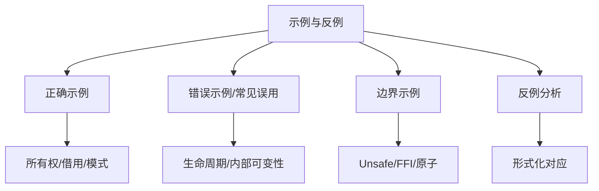

# 示例与反例图谱（Example and Counterexample Atlas）

> **EN**: Example and Counterexample Atlas
> **Summary**: A navigational index of correct examples, common misuses, boundary cases, and counterexamples organized by concept layer. 按概念组织的正确示例、错误示例、边界示例与反例分析。
> **受众**: [研究者]
> **内容分级**: [元层]
> **权威来源**: 本文件为 `concept/` 权威页。
> **来源**: [Rust Reference](https://doc.rust-lang.org/reference/introduction.html) · [TRPL](https://doc.rust-lang.org/book/title-page.html)

---

## 一、使用说明

本图谱只提供**示例入口**，不复制权威页中的代码或解释。每行给出概念页、建议观察的示例类型，以及该页中可重点阅读的示例主题。学习者应按链接进入对应权威页查看完整示例与编译器反馈。

---

## 二、示例分类总览

---

## 三、按层级索引

### 3.1 L1 基础概念层

| 概念页 | 推荐示例类型 | 主题提示 |
|:---|:---:|:---|
| [Ownership](../../01_foundation/01_ownership_borrow_lifetime/01_ownership.md) | 正确 + 错误 | 移动语义、`Copy` 与 `Clone`、use-after-move |
| [Borrowing](../../01_foundation/01_ownership_borrow_lifetime/02_borrowing.md) | 错误 + 边界 | 可变/共享借用冲突、reborrow、split borrow |
| [Lifetimes](../../01_foundation/01_ownership_borrow_lifetime/03_lifetimes.md) | 错误 + 边界 | 悬垂引用、生命周期省略、显式标注 |
| [Type System Basics](../../01_foundation/02_type_system/04_type_system.md) | 正确 + 边界 | 枚举、模式匹配、类型推断 |
| [Reference Semantics](../../01_foundation/03_values_and_references/05_reference_semantics.md) | 正确 + 错误 | 自动解引用、`Deref` 强制、类型转换 |
| [Control Flow](../../01_foundation/04_control_flow/07_control_flow.md) | 正确 + 边界 | 表达式导向、`if let`、穷尽性 |
| [Collections](../../01_foundation/05_collections/08_collections.md) | 正确 + 边界 | `Vec`、`HashMap`、迭代器消耗 |
| [Strings and Text](../../01_foundation/06_strings_and_text/09_strings_and_text.md) | 错误 + 边界 | `String` vs `str`、UTF-8 边界 |
| [Modules and Paths](../../01_foundation/07_modules_and_items/11_modules_and_paths.md) | 正确 + 错误 | 可见性、路径解析、re-export |
| [Attributes and Macros](../../01_foundation/09_macros_basics/12_attributes_and_macros.md) | 正确 + 边界 | 声明宏、属性展开 |
| [Panic and Abort](../../01_foundation/08_error_handling/13_panic_and_abort.md) | 边界 | 可恢复 vs 不可恢复、panic 边界 |

### 3.2 L2 进阶概念层

| 概念页 | 推荐示例类型 | 主题提示 |
|:---|:---:|:---|
| [Traits](../../02_intermediate/00_traits/01_traits.md) | 正确 + 错误 | trait bound、orphan rule、object safety |
| [Generics](../../02_intermediate/01_generics/02_generics.md) | 正确 + 边界 | 单态化、关联类型、HRTB |
| [Interior Mutability](../../02_intermediate/02_memory_management/08_interior_mutability.md) | 正确 + 错误 | `RefCell` panic、`Cell` 使用场景 |
| [Smart Pointers](../../02_intermediate/02_memory_management/12_smart_pointers.md) | 正确 + 边界 | `Box`/`Rc`/`Arc`、循环引用 |
| [Iterator Patterns](../../02_intermediate/07_iterators_and_closures/15_iterator_patterns.md) | 正确 + 边界 | 适配器链、消费与借用 |
| [Closure Types](../../02_intermediate/04_types_and_conversions/07_closure_types.md) | 正确 + 错误 | `Fn`/`FnMut`/`FnOnce`、捕获方式 |
| [Newtype and Wrapper](../../02_intermediate/04_types_and_conversions/14_newtype_and_wrapper.md) | 正确 + 边界 | 类型安全、零成本抽象 |
| [Error Handling Deep Dive](../../02_intermediate/03_error_handling/16_error_handling_deep_dive.md) | 正确 + 边界 | `thiserror`/`anyhow`、自定义错误 |
| [Macro Patterns](../../02_intermediate/06_macros_and_metaprogramming/17_macro_patterns.md) | 正确 + 错误 | 宏卫生、重复模式 |

### 3.3 L3 高级概念层

| 概念页 | 推荐示例类型 | 主题提示 |
|:---|:---:|:---|
| [Concurrency](../../03_advanced/00_concurrency/01_concurrency.md) | 正确 + 错误 | 数据竞争、Send/Sync 误用 |
| [Async/Await](../../03_advanced/01_async/02_async.md) | 正确 + 边界 | `.await` 挂起、executor 边界 |
| [Pin and Unpin](../../03_advanced/01_async/06_pin_unpin.md) | 正确 + 错误 | 自引用类型、Pin 投影 |
| [Unsafe Rust](../../03_advanced/02_unsafe/03_unsafe.md) | 错误 + 边界 | raw pointer、soundness 不变式 |
| [FFI](../../03_advanced/04_ffi/05_rust_ffi.md) | 正确 + 错误 | ABI 约定、生命周期桥接 |
| [Atomics and Memory Ordering](../../03_advanced/00_concurrency/11_atomics_and_memory_ordering.md) | 边界 + 反例 | 错误 memory order、happens-before |
| [Lock-free](../../03_advanced/00_concurrency/16_lock_free.md) | 边界 + 反例 | ABA、内存回收 |
| [Proc Macros](../../03_advanced/03_proc_macros/07_proc_macro.md) | 正确 + 错误 | derive/attribute/function-like |

### 3.4 L4 形式化理论层

| 概念页 | 推荐示例类型 | 主题提示 |
|:---|:---:|:---|
| [Linear Logic](../../04_formal/01_ownership_logic/01_linear_logic.md) | 反例 + 边界 | 所有权 vs 线性/仿射逻辑对应 |
| [RustBelt](../../04_formal/02_separation_logic/04_rustbelt.md) | 反例 + 边界 | unsafe 抽象 soundness 证明 |
| [Separation Logic](../../04_formal/02_separation_logic/11_separation_logic.md) | 反例 + 边界 | frame rule、所有权拆分 |
| [Miri](../../04_formal/04_model_checking/31_miri.md) | 错误 + 边界 | UB 检测、Stacked/Tree Borrows |
| [Kani](../../04_formal/04_model_checking/32_kani.md) | 边界 | 有界模型检查反例 |
| [Behavior Considered Undefined](../../04_formal/01_ownership_logic/37_behavior_considered_undefined.md) | 反例 | UB 清单逐项示例 |

### 3.5 L5–L7 层

| 概念页 | 推荐示例类型 | 主题提示 |
|:---|:---:|:---|
| [Rust vs C++](../../05_comparative/01_systems_languages/01_rust_vs_cpp.md) | 对比示例 | 构造、析构、move、FFI |
| [Rust vs Go](../../05_comparative/01_systems_languages/02_rust_vs_go.md) | 对比示例 | 所有权 vs CSP、错误处理 |
| [Execution Model Isomorphism](../../05_comparative/00_paradigms/05_execution_model_isomorphism.md) | 边界示例 | 同步/异步/并发/并行映射 |
| [Core Crates](../../06_ecosystem/02_core_crates/03_core_crates.md) | 正确示例 | serde、tokio、clap 等典型用法 |
| [Design Patterns](../../06_ecosystem/03_design_patterns/02_patterns.md) | 正确 + 边界 | 类型状态、构建器、访问者 |
| [Rust 2024 Edition](../../07_future/01_edition_roadmap/19_rust_edition_preview.md) | 边界示例 | edition 迁移前后差异 |

---

## 四、常见反例主题速查

| 反例主题 | 典型错误表现 | 应进入的权威页 |
|:---|:---|:---|
| use-after-move | 编译器 `use of moved value` | [Ownership](../../01_foundation/01_ownership_borrow_lifetime/01_ownership.md) |
| 可变+共享借用冲突 | `cannot borrow as mutable because it is also borrowed as immutable` | [Borrowing](../../01_foundation/01_ownership_borrow_lifetime/02_borrowing.md) |
| 悬垂引用 | lifetime may not live long enough | [Lifetimes](../../01_foundation/01_ownership_borrow_lifetime/03_lifetimes.md) |
| 非 Send 类型跨线程 | `Rc<RefCell<T>>` 传给 `spawn` | [Concurrency](../../03_advanced/00_concurrency/01_concurrency.md) |
| 自引用类型移动 | `Pin` 使用不当导致 UB | [Pin and Unpin](../../03_advanced/01_async/06_pin_unpin.md) |
| unsafe 违反 soundness | raw pointer 别名违规 | [Unsafe Rust](../../03_advanced/02_unsafe/03_unsafe.md), [Miri](../../04_formal/04_model_checking/31_miri.md) |

---

## 五、阅读策略

- **初学者**：从 L1 的正确示例开始，先建立直观印象。
- **进阶者**：重点阅读 L2 错误示例，理解编译器报错背后的规则。
- **专家/研究者**：关注 L3-L4 边界示例与反例，理解 soundness 与 UB 边界。

## 六、与相关元页的关系

- 需要按场景决策 → [场景决策树图谱](03_scenario_decision_tree_atlas.md)
- 需要按错误症状定位 → [推理判定树图谱](09_reasoning_judgment_tree_atlas.md)
- 需要形式化推理链 → [逻辑推理图谱](05_logical_reasoning_atlas.md)
- 需要查看概念定义 → [概念定义图谱](01_concept_definition_atlas.md)

---

> **内容分级**: [元层]
