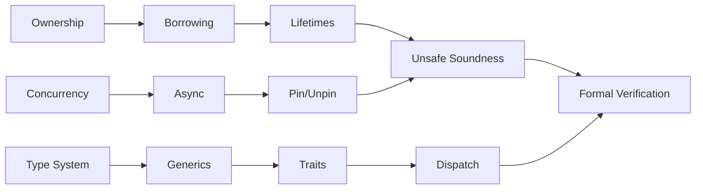
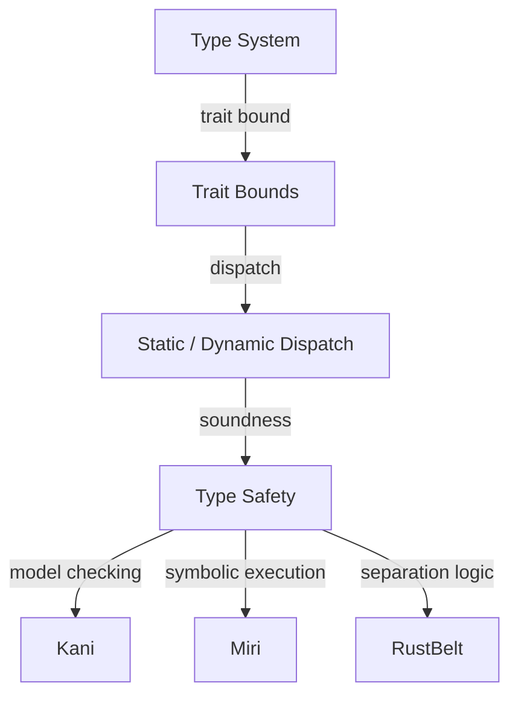
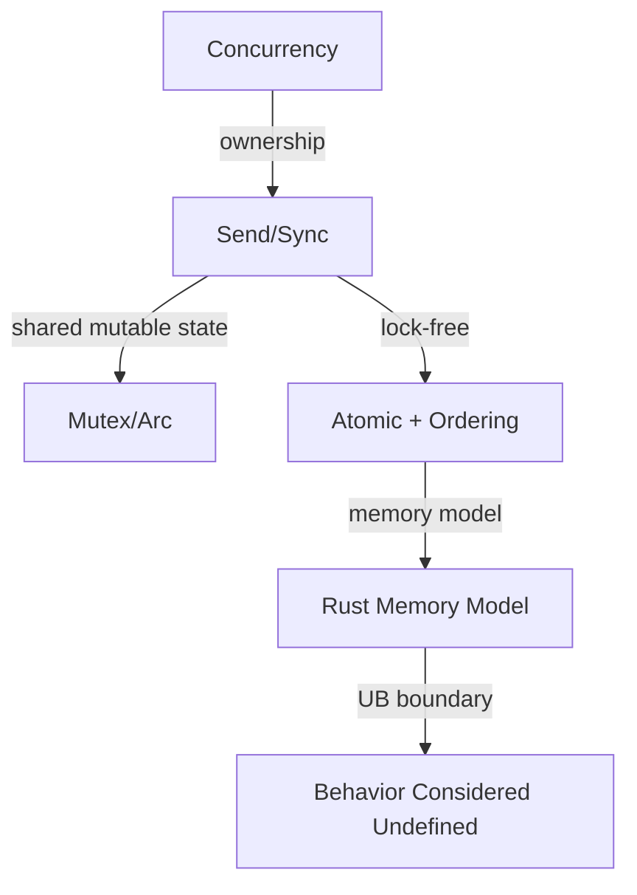
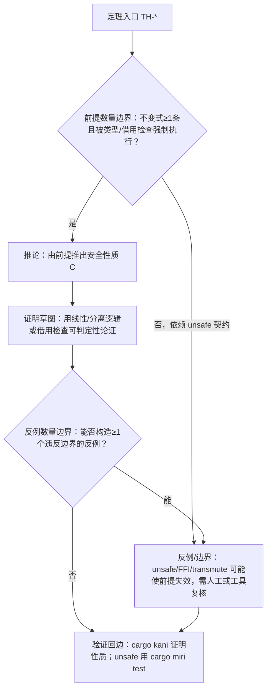

# 逻辑推理图谱（Logical Reasoning Atlas）

> **EN**: Logical Reasoning Atlas
> **Summary**: A navigational index of theorem chains, inference rules, proof/verification paths, and formal correspondences across the Rust concept hierarchy. 定理链（⟹/⟸）、推理规则、证明/验证路径、形式化对应。
> **受众**: [研究者]
> **内容分级**: [元层]
> **权威来源**: 本文件为 `concept/` 权威页。
> **来源**: [Rust Reference](https://doc.rust-lang.org/reference/introduction.html) · [TRPL](https://doc.rust-lang.org/book/title-page.html)

---

## 一、使用说明

本图谱记录 Rust 知识体系中的**推理骨架**，不展开各概念的技术细节。每个推理链都链接到 `concept/` 下的权威概念页，便于研究者从形式化、类型系统、所有权、并发等维度追踪逻辑依赖。

---

## 二、推理链总览

---

## 三、核心推理链

### 3.1 所有权与内存安全推理链

| 推理规则 | 方向 | 说明 | 权威页 |
|:---|:---:|:---|:---|
| 单一所有权 ⟹ 无 use-after-free | ⟹ | 每个值有唯一 owner，drop 时释放 | [Ownership](../../01_foundation/01_ownership_borrow_lifetime/01_ownership.md) |
| 所有权转移 ⟹ moved-from 状态不可再用 | ⟹ | 赋值/传参会 move 非 `Copy` 值 | [Move Semantics](../../01_foundation/01_ownership_borrow_lifetime/23_move_semantics.md) |
| 借用 ⟹ 别名互斥 | ⟹ | `&T` 与 `&mut T` 不能共存 | [Borrowing](../../01_foundation/01_ownership_borrow_lifetime/02_borrowing.md) |
| 生命周期 ⟹ 引用不悬垂 | ⟹ | 编译期证明被引用数据比引用活得更长 | [Lifetimes](../../01_foundation/01_ownership_borrow_lifetime/03_lifetimes.md) |
| 借用检查可判定性 ⟹ NLL/Polonius 演进 | ⟹ | 三代 borrow checker 的判定问题 | [Borrow Checking Decidability](../../04_formal/01_ownership_logic/28_borrow_checking_decidability.md) |

### 3.2 类型系统推理链

| 推理规则 | 方向 | 说明 | 权威页 |
|:---|:---:|:---|:---|
| 类型良构 ⟹ trait bound 可满足 | ⟹ | 类型参数必须实现所需 trait | [Traits](../../02_intermediate/00_traits/01_traits.md), [Generics](../../02_intermediate/01_generics/02_generics.md) |
| 泛型单态化 ⟹ 零成本抽象 | ⟹ | 编译期展开为具体类型 | [Generics](../../02_intermediate/01_generics/02_generics.md) |
| 子类型/变型 ⟹ 协变/逆变安全 | ⟹ | 生命周期与泛型的变型规则 | [Subtype Variance](../../04_formal/00_type_theory/06_subtype_variance.md) |
| 类型推断 ⟹ 约束求解 | ⟹ | `typeck` + trait solver + region constraints | [Type Checking and Inference](../../04_formal/00_type_theory/27_type_checking_and_inference.md) |
| 类型推断复杂度 ⟹ PSPACE | ⟹ | HM 立方时间 vs Rust 高阶多态 | [Type Inference Complexity](../../04_formal/00_type_theory/29_type_inference_complexity.md) |

### 3.3 并发安全推理链

| 推理规则 | 方向 | 说明 | 权威页 |
|:---|:---:|:---|:---|
| `Send` + `Sync` ⟹ 无线程数据竞争 | ⟹ | 编译期通过 marker trait 保证 | [Concurrency](../../03_advanced/00_concurrency/01_concurrency.md) |
| `Mutex<T>` / `RwLock<T>` ⟹ 内部可变性 + 互斥 | ⟹ | 运行时保证单一写者 | [Interior Mutability](../../02_intermediate/02_memory_management/08_interior_mutability.md) |
| Atomic + Memory Ordering ⟹ happens-before | ⟹ | 无锁算法的同步基础 | [Atomics and Memory Ordering](../../03_advanced/00_concurrency/11_atomics_and_memory_ordering.md) |
| `Pin<T>` + `Unpin` ⟹ 自引用类型安全移动 | ⟹ | 固定位置保证 | [Pin and Unpin](../../03_advanced/01_async/06_pin_unpin.md) |

### 3.4 形式化对应

| Rust 概念 | 形式化模型 | 权威页 |
|:---|:---|:---|
| 所有权 / move | 线性逻辑 / 仿射逻辑 | [Linear Logic](../../04_formal/01_ownership_logic/01_linear_logic.md), [Ownership Formalization](../../04_formal/01_ownership_logic/03_ownership_formal.md) |
| 借用 / 别名互斥 | 分离逻辑 / RustBelt | [Separation Logic](../../04_formal/02_separation_logic/11_separation_logic.md), [RustBelt](../../04_formal/02_separation_logic/04_rustbelt.md) |
| 类型系统 | 类型论 / HM 推断 | [Type Theory](../../04_formal/00_type_theory/02_type_theory.md), [Type Inference](../../04_formal/00_type_theory/08_type_inference.md) |
| 求值语义 | 操作语义 / 指称语义 | [Operational Semantics](../../04_formal/03_operational_semantics/17_operational_semantics.md), [Denotational Semantics](../../04_formal/03_operational_semantics/12_denotational_semantics.md) |
| unsafe 契约 | Hoare 逻辑 / Safety Tags | [Hoare Logic](../../04_formal/03_operational_semantics/15_hoare_logic.md), [Safety Tags](../../07_future/03_preview_features/08_safety_tags_preview.md) |

---

## 四、推理路径图

### 4.1 从类型到形式化验证

### 4.2 从并发到内存模型

---

## 五、推理方向说明

| 符号 | 含义 | 示例 |
|:---|:---|:---|
| ⟹ | 前提保证结论 | 所有权 ⟹ 无 use-after-free |
| ⟸ | 从目标反推条件 | 要无数据竞争 ⟸ 需要 `Send`/`Sync` |
| ⟺ | 等价 | `Box<T>` 拥有堆上 `T` ⟺ `T` 离开作用域时自动释放 |

## 六、与相关元页的关系

- 需要概念定义 → [概念定义图谱](01_concept_definition_atlas.md)
- 需要场景决策 → [场景决策树图谱](03_scenario_decision_tree_atlas.md)
- 需要层间依赖 → [层间映射图谱](06_inter_layer_mapping_atlas.md)
- 需要错误判定 → [推理判定树图谱](09_reasoning_judgment_tree_atlas.md)

---

## 闭环增强（可执行化）

> 本小节为**纯增量**补充：为 §3 现有每条 `X ⟹ Y` 增补「前提 → 推论 → 证明草图 → 反例/边界」四元组，并赋予稳定 ID（`TH-*`），供 03（场景决策）/09（判定树）回边引用。原 §2–§6 全部内容保持不变。
>
> 说明：反例/边界均落在 `unsafe`/FFI/transmute/`unsafe impl`/泄漏型 API 等**安全子集之外**的边界；在安全 Rust 内定理成立。标记「⚠需复核」处表示该边界依赖 unsafe 契约或具体工具行为，需结合权威页与工具确认。

### H. 核心定理四元组（8 条）

| ID | 前提（P） | 推论（C） | 证明草图 | 反例 / 边界 |
|:---:|:---|:---|:---|:---|
| `TH-OWN-01` | 单一所有权 + move 语义 | 无 use-after-free | 值有唯一 owner；move 后旧绑定被类型系统标记为 moved-from 不可再用；`Drop` 在 owner 作用域尾恰好执行一次释放，故不会重复释放，也不会在释放后访问 | `unsafe` 裸指针、`mem::forget`/`Box::leak`、`Rc`/`Arc` 环（造成泄漏而非 UAF）、`ManuallyDrop` 改变释放时机（⚠unsafe/泄漏边界需复核） |
| `TH-BORROW-02` | 借用排他（`&mut` 独占 / `&` 共享只读，NLL 内别名 XOR 可变性） | 单线程内无数据竞争 | 同一时刻：要么存在一个活跃 `&mut`，要么存在若干 `&`，二者互斥；写者独占消除读写/写写交错 | `UnsafeCell` 内部可变性、裸指针可绕过；跨线程需 `Sync` + 同步原语（原子/Mutex）才升级为「无线程竞争」 |
| `TH-LIFE-03` | 生命周期约束（`'a` + 借用检查） | 引用不悬垂 | 编译期证明被引用者的生命周期 `'r` 覆盖引用 `'a`（`'r: 'a`）；函数返回值与结构体字段均受同一约束 | `'static` 误用、`unsafe` 生命周期 transmute、裸指针/FFI 不受借用检查保护（⚠跨 FFI 悬垂需复核） |
| `TH-TYPE-04` | 类型安全（强类型 + typeck + trait solver） | 无类型混淆 | 每个值有唯一静态类型，运算按类型派发，安全子集无隐式 reinterpret；不能把 `T` 当作 `U` 读取 | `unsafe` 的 `mem::transmute`、union、`#[repr(C)]` ABI 不匹配可破坏（安全 Rust 内成立） |
| `TH-DROP-05` | `Drop` 语义（作用域尾逆序自动 drop） | 确定性释放 | RAII：owner 离开作用域时调用 `Drop::drop`，字段按逆构造序释放，时机可由作用域唯一确定 | `mem::forget`、`Rc`/`Arc` 环、`Box::leak`、`ManuallyDrop`、`static`（进程退出才回收，不触发 drop）（⚠static/leak 边界） |
| `TH-SEND-06` | `Send`/`Sync` marker trait（自动推导，`unsafe` 可手写 impl） | 线程安全边界（跨线程传值/共享的门控） | `T: Send` 才可 move 到另一线程；`T: Sync` 才可 `&T` 跨线程共享（等价 `&T: Send`）；编译期门控阻止非 `Send`/`Sync` 越界 | `unsafe impl Send/Sync` 若契约错误会引入竞争；裸指针默认 `!Send`/`!Sync`（⚠unsafe impl 的正确性需人工或工具复核） |
| `TH-PIN-07` | `Pin
` + `Unpin`（固定 `!Unpin` 值的地址） | 自引用类型稳定（不被移动而失效） | `Pin<&mut T>` 对 `T: !Unpin` 禁止 move，仅暴露受控访问，保证自引用字段地址不变；结构投影需 `pin_project` 且注意 `Drop` | `Pin::new_unchecked` 为 unsafe；绝大多数类型自动 `Unpin`（使 `Pin` 退化为普通引用）（⚠`new_unchecked` 契约需复核） |
| `TH-VAR-08` | 变型规则（协变/逆变/不变，生命周期与泛型） | 子类型协变安全 | `&'a T` 对 `'a` 协变、`fn(T)` 对 `T` 逆变；`&mut T`/`Cell<T>`/`UnsafeCell<T>` 对 `T` **不变**，以阻止经协变写入缩短生命周期的值 | 经典反例：若 `&mut &'a str` 对 `'a` 协变，可把短生命周期引用写入长生命周期槽 → 悬垂；不变性是有意的安全边界而非限制 |

### I. 推理闭环图

> 叶子合规：P6 为具体验证动作（`cargo kani`/`cargo miri test`），无 `[[` 跳出；P5 为反例/边界说明（非判定树叶子）。

### J. 跨文件回边（`TH-*` → 03/09）

| 定理 ID | 回边目标 | 用途 |
|:---:|:---|:---|
| `TH-OWN-01` | 回边：见 [`03_scenario_decision_tree_atlas.md#T-MEM-01`](03_scenario_decision_tree_atlas.md) | 单一所有权/共享所有权场景的可执行判定落地 |
| `TH-BORROW-02` | 回边：见 [`09_reasoning_judgment_tree_atlas.md#J-BORROW-01`](09_reasoning_judgment_tree_atlas.md) | 借用排他定理 ↔ 借用冲突判定入口 |
| `TH-LIFE-03` | 回边：见 [`09_reasoning_judgment_tree_atlas.md#J-LIFE-02`](09_reasoning_judgment_tree_atlas.md) | 生命周期定理 ↔ 悬垂/生命周期错误判定入口 |
| `TH-SEND-06` | 回边：见 [`03_scenario_decision_tree_atlas.md#T-CONC-01`](03_scenario_decision_tree_atlas.md) | `Send`/`Sync` 边界 ↔ 并发场景锁/原子选择 |
| `TH-VAR-08` | 回边：见 [`03_scenario_decision_tree_atlas.md#T-ABS-01`](03_scenario_decision_tree_atlas.md) | 变型安全 ↔ `dyn Trait`/对象安全选择 |

> 回边：见 [`09_reasoning_judgment_tree_atlas.md#J-LIFE-02`](09_reasoning_judgment_tree_atlas.md)（`TH-LIFE-03` 的反例/修复入口）；回边：见 [`03_scenario_decision_tree_atlas.md#T-MEM-01`](03_scenario_decision_tree_atlas.md)（`TH-OWN-01` 的可执行判定落地）。

### K. 本文件闭环小结

- 新增定理四元组：**8 条**（`TH-OWN-01` … `TH-VAR-08`），覆盖 §3.1–§3.3 的核心理法链；每条含 1 个反例或边界。
- 新增 mermaid：**1 个**（推理闭环图）；新增定量判定节点：**2 个**（P1/P4，含「≥1条/≥1个」）。
- 跨文件回边：**5 条**（→ 03：`T-MEM-01`/`T-CONC-01`/`T-ABS-01`；→ 09：`J-BORROW-01`/`J-LIFE-02`）。

---

> **内容分级**: [元层]

---

## 国际权威参考 / International Authority References（P0 官方 · P1 学术 · P2 生态）

> 依据 `AGENTS.md` §2「对齐网络国际化权威内容」补充：仅追加已验证可达的权威链接，不改动正文事实。

- **P1 学术/形式化**: [Hogan et al.: Knowledge Graphs (ACM Comput. Surv. 2021)](https://dl.acm.org/doi/10.1145/3447772)
