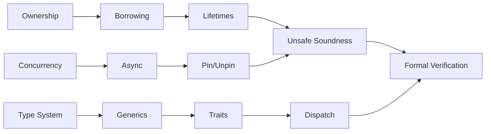
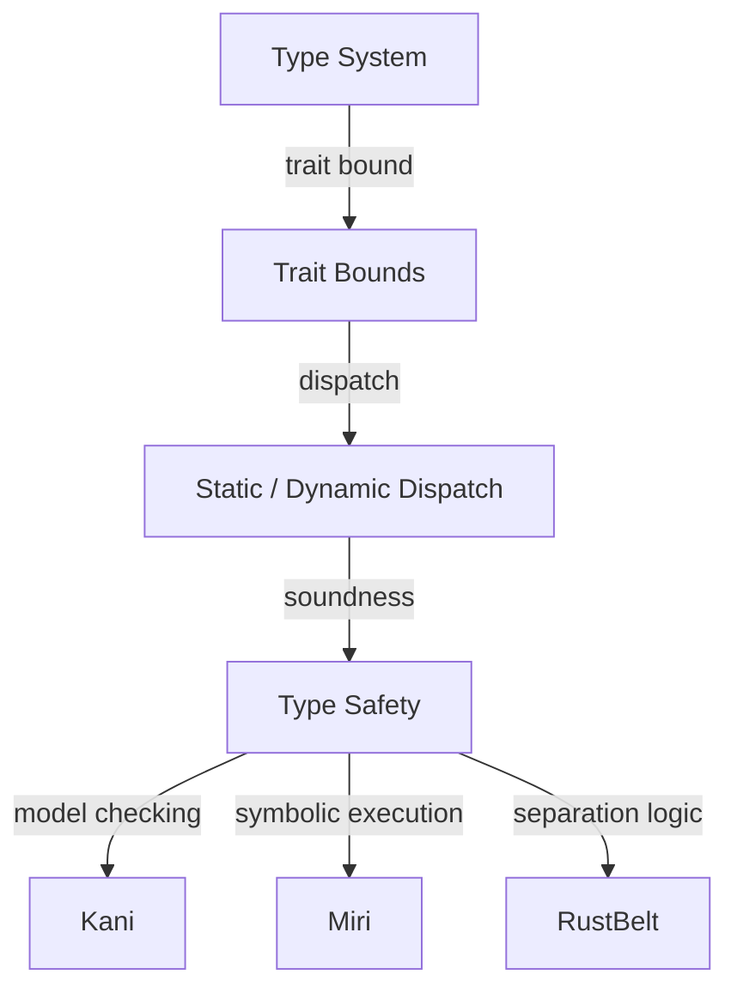
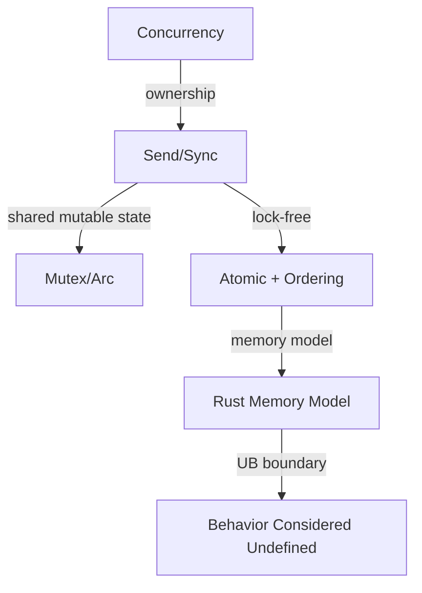

# 逻辑推理图谱（Logical Reasoning Atlas）

> **EN**: Logical Reasoning Atlas
> **Summary**: A navigational index of theorem chains, inference rules, proof/verification paths, and formal correspondences across the Rust concept hierarchy. 定理链（⟹/⟸）、推理规则、证明/验证路径、形式化对应。
> **受众**: [研究者]
> **内容分级**: [元层]
> **来源**: [Rust Reference](https://doc.rust-lang.org/reference/introduction.html) · [TRPL](https://doc.rust-lang.org/book/title-page.html)

---

## 一、使用说明

本图谱记录 Rust 知识体系中的**推理骨架**，不展开各概念的技术细节。每个推理链都链接到 `concept/` 下的权威概念页，便于研究者从形式化、类型系统、所有权、并发等维度追踪逻辑依赖。

---

## 二、推理链总览

---

## 三、核心推理链

### 3.1 所有权与内存安全推理链

| 推理规则 | 方向 | 说明 | 权威页 |
|:---|:---:|:---|:---|
| 单一所有权 ⟹ 无 use-after-free | ⟹ | 每个值有唯一 owner，drop 时释放 | [Ownership](../../01_foundation/01_ownership_borrow_lifetime/01_ownership.md) |
| 所有权转移 ⟹ moved-from 状态不可再用 | ⟹ | 赋值/传参会 move 非 `Copy` 值 | [Move Semantics](../../01_foundation/01_ownership_borrow_lifetime/23_move_semantics.md) |
| 借用 ⟹ 别名互斥 | ⟹ | `&T` 与 `&mut T` 不能共存 | [Borrowing](../../01_foundation/01_ownership_borrow_lifetime/02_borrowing.md) |
| 生命周期 ⟹ 引用不悬垂 | ⟹ | 编译期证明被引用数据比引用活得更长 | [Lifetimes](../../01_foundation/01_ownership_borrow_lifetime/03_lifetimes.md) |
| 借用检查可判定性 ⟹ NLL/Polonius 演进 | ⟹ | 三代 borrow checker 的判定问题 | [Borrow Checking Decidability](../../04_formal/01_ownership_logic/28_borrow_checking_decidability.md) |

### 3.2 类型系统推理链

| 推理规则 | 方向 | 说明 | 权威页 |
|:---|:---:|:---|:---|
| 类型良构 ⟹ trait bound 可满足 | ⟹ | 类型参数必须实现所需 trait | [Traits](../../02_intermediate/00_traits/01_traits.md), [Generics](../../02_intermediate/01_generics/02_generics.md) |
| 泛型单态化 ⟹ 零成本抽象 | ⟹ | 编译期展开为具体类型 | [Generics](../../02_intermediate/01_generics/02_generics.md) |
| 子类型/变型 ⟹ 协变/逆变安全 | ⟹ | 生命周期与泛型的变型规则 | [Subtype Variance](../../04_formal/00_type_theory/06_subtype_variance.md) |
| 类型推断 ⟹ 约束求解 | ⟹ | `typeck` + trait solver + region constraints | [Type Checking and Inference](../../04_formal/00_type_theory/27_type_checking_and_inference.md) |
| 类型推断复杂度 ⟹ PSPACE | ⟹ | HM 立方时间 vs Rust 高阶多态 | [Type Inference Complexity](../../04_formal/00_type_theory/29_type_inference_complexity.md) |

### 3.3 并发安全推理链

| 推理规则 | 方向 | 说明 | 权威页 |
|:---|:---:|:---|:---|
| `Send` + `Sync` ⟹ 无线程数据竞争 | ⟹ | 编译期通过 marker trait 保证 | [Concurrency](../../03_advanced/00_concurrency/01_concurrency.md) |
| `Mutex<T>` / `RwLock<T>` ⟹ 内部可变性 + 互斥 | ⟹ | 运行时保证单一写者 | [Interior Mutability](../../02_intermediate/02_memory_management/08_interior_mutability.md) |
| Atomic + Memory Ordering ⟹ happens-before | ⟹ | 无锁算法的同步基础 | [Atomics and Memory Ordering](../../03_advanced/00_concurrency/11_atomics_and_memory_ordering.md) |
| `Pin<T>` + `Unpin` ⟹ 自引用类型安全移动 | ⟹ | 固定位置保证 | [Pin and Unpin](../../03_advanced/01_async/06_pin_unpin.md) |

### 3.4 形式化对应

| Rust 概念 | 形式化模型 | 权威页 |
|:---|:---|:---|
| 所有权 / move | 线性逻辑 / 仿射逻辑 | [Linear Logic](../../04_formal/01_ownership_logic/01_linear_logic.md), [Ownership Formalization](../../04_formal/01_ownership_logic/03_ownership_formal.md) |
| 借用 / 别名互斥 | 分离逻辑 / RustBelt | [Separation Logic](../../04_formal/02_separation_logic/11_separation_logic.md), [RustBelt](../../04_formal/02_separation_logic/04_rustbelt.md) |
| 类型系统 | 类型论 / HM 推断 | [Type Theory](../../04_formal/00_type_theory/02_type_theory.md), [Type Inference](../../04_formal/00_type_theory/08_type_inference.md) |
| 求值语义 | 操作语义 / 指称语义 | [Operational Semantics](../../04_formal/03_operational_semantics/17_operational_semantics.md), [Denotational Semantics](../../04_formal/03_operational_semantics/12_denotational_semantics.md) |
| unsafe 契约 | Hoare 逻辑 / Safety Tags | [Hoare Logic](../../04_formal/03_operational_semantics/15_hoare_logic.md), [Safety Tags](../../04_formal/02_separation_logic/33_safety_tags_in_formal.md) |

---

## 四、推理路径图

### 4.1 从类型到形式化验证

### 4.2 从并发到内存模型

---

## 五、与相关元页的关系

- 需要概念定义 → [概念定义图谱](01_concept_definition_atlas.md)
- 需要场景决策 → [场景决策树图谱](03_scenario_decision_tree_atlas.md)
- 需要层间依赖 → [层间映射图谱](06_inter_layer_mapping_atlas.md)
- 需要错误判定 → [推理判定树图谱](09_reasoning_judgment_tree_atlas.md)

---

> **内容分级**: [元层]
