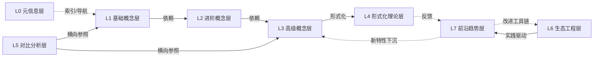

# 层间映射图谱（Inter-Layer Mapping Atlas）

> **EN**: Inter-Layer Mapping Atlas
> **Summary**: Dependencies, implications, and feedback relationships among L0–L7 layers based on prerequisite/consequent references. L0–L7 各层之间的依赖、蕴含、反馈关系，基于前置/后置概念引用统计。
> **受众**: [研究者]
> **内容分级**: [元层]
> **权威来源**: 本文件为 `concept/` 权威页。
> **来源**: [Rust Reference](https://doc.rust-lang.org/reference/introduction.html) · [TRPL](https://doc.rust-lang.org/book/title-page.html)

---

## 一、层间引用矩阵（行 = 源层，列 = 目标层）

| 源层 \ 目标层 | L0 元信息层 | L1 基础概念层 | L2 进阶概念层 | L3 高级概念层 | L4 形式化理论层 | L5 对比分析层 | L6 生态工程层 | L7 前沿趋势层 |
|---|---|---|---|---|---|---|---|---|
| L0 元信息层 | 6 | 0 | 0 | 0 | 0 | 1 | 4 | 0 |
| L1 基础概念层 | 0 | 18 | 26 | 19 | 1 | 2 | 9 | 1 |
| L2 进阶概念层 | 0 | 2 | 14 | 18 | 5 | 4 | 10 | 5 |
| L3 高级概念层 | 0 | 1 | 4 | 21 | 5 | 2 | 16 | 4 |
| L4 形式化理论层 | 0 | 2 | 5 | 14 | 52 | 5 | 3 | 2 |
| L5 对比分析层 | 0 | 0 | 2 | 2 | 0 | 6 | 16 | 1 |
| L6 生态工程层 | 0 | 1 | 0 | 3 | 3 | 2 | 93 | 30 |
| L7 前沿趋势层 | 0 | 2 | 0 | 4 | 2 | 0 | 4 | 35 |

## 二、跨层关键桥接概念

| 源层 | 概念 | 指向层 | 后置概念 |
|:---|:---|:---|:---|
| L0 元信息层 | [Rust 职业市场全景：2026 年数据与分析](../04_navigation/career_landscape.md) | L6 生态工程层 | Application Domains |
| L0 元信息层 | [Comprehensive Rust 课程映射](../00_framework/comprehensive_rust_mapping.md) | L6 生态工程层 | Application Domains |
| L0 元信息层 | [C/C++ → Rust 工程层对比路线图](../00_framework/cpp_rust_engineering_roadmap.md) | L5 对比分析层 | C++ ABI Object Model |
| L0 元信息层 | [模式语义空间索引：设计模式在概念体系中的坐标](../00_framework/pattern_semantic_space_index.md) | L6 生态工程层 | Pattern Composition Algebra |
| L0 元信息层 | [语义桥：算法、设计模式与工作流模式的统一谱系](../00_framework/semantic_bridge_algorithms_patterns.md) | L6 生态工程层 | Pattern Composition Algebra |
| L1 基础概念层 | [Ownership](../../01_foundation/01_ownership_borrow_lifetime/01_ownership.md) | L2 进阶概念层 | Smart Pointers |
| L1 基础概念层 | [引用语义：自动解引用、Deref 强制与类型转换](../../01_foundation/03_values_and_references/05_reference_semantics.md) | L2 进阶概念层 | Smart Pointers |
| L1 基础概念层 | [零成本抽象：Rust 的性能哲学](../../01_foundation/00_start/06_zero_cost_abstractions.md) | L5 对比分析层 | Rust vs C++ |
| L1 基础概念层 | [控制流：表达式导向的流程控制](../../01_foundation/04_control_flow/07_control_flow.md) | L3 高级概念层 | Async |
| L1 基础概念层 | [属性与声明宏：编译期元编程基础](../../01_foundation/09_macros_basics/12_attributes_and_macros.md) | L3 高级概念层 | Proc Macros |
| L1 基础概念层 | [测试基础：从单元测试到集成测试](../../01_foundation/10_testing_basics/16_testing_basics.md) | L6 生态工程层 | Testing Strategies |
| L2 进阶概念层 | [Traits](../../02_intermediate/00_traits/01_traits.md) | L3 高级概念层 | Trait Objects / Async |
| L2 进阶概念层 | [内部可变性：编译期规则的运行时逃逸](../../02_intermediate/02_memory_management/08_interior_mutability.md) | L3 高级概念层 | Mutex / Lock-free |
| L2 进阶概念层 | [宏模式：编译期代码生成的工程实践](../../02_intermediate/06_macros_and_metaprogramming/17_macro_patterns.md) | L3 高级概念层 | Proc Macros |
| L3 高级概念层 | [Unsafe Rust 安全编程](../../03_advanced/02_unsafe/03_unsafe.md) | L4 形式化理论层 | RustBelt / Separation Logic |
| L3 高级概念层 | [Rust 网络编程：Tokio TCP/UDP、异步 IO 与 Tower 服务抽象](../../03_advanced/06_low_level_patterns/18_network_programming.md) | L6 生态工程层 | Web Frameworks / Cloud Native |
| L3 高级概念层 | [无锁编程与内存模型](../../03_advanced/00_concurrency/16_lock_free.md) | L4 形式化理论层 | Memory Model / UB |
| L4 形式化理论层 | [Miri：Rust 未定义行为动态检测器](../../04_formal/04_model_checking/31_miri.md) | L6 生态工程层 | Testing / Security Practices |
| L4 形式化理论层 | [Rustc 查询系统与增量编译](../../04_formal/05_rustc_internals/19_rustc_query_system.md) | L7 前沿趋势层 | Parallel Frontend |
| L4 形式化理论层 | [类型布局](../../04_formal/05_rustc_internals/42_type_layout.md) | L3 高级概念层 | FFI / Custom Allocators |
| L5 对比分析层 | [Rust vs C++：形式系统模型 vs 机制工程模型](../../05_comparative/01_systems_languages/01_rust_vs_cpp.md) | L6 生态工程层 | C-to-Rust Translation |
| L6 生态工程层 | [Formal Verification Tools](../../06_ecosystem/08_formal_verification/74_formal_verification_tools.md) | L7 前沿趋势层 | Ferrocene / Safety Tags |
| L6 生态工程层 | [Rust 编译器基础设施深度解析](../../06_ecosystem/00_toolchain/47_compiler_infrastructure.md) | L4 形式化理论层 | rustc Internals |
| L7 前沿趋势层 | [Rust 2024 Edition (1.85.0+ stable)](../../07_future/01_edition_roadmap/19_rust_edition_preview.md) | L6 生态工程层 | Toolchain / CI-CD |
| L7 前沿趋势层 | [Rust 形式模型演进跟踪](../../07_future/00_version_tracking/05_rust_version_tracking.md) | L4 形式化理论层 | Verification / Compiler Internals |

## 三、层间依赖 Mermaid 视图

## 四、关键学习路径

| 学习路径 | 入口概念 | 经过层 | 目标概念 |
|:---|:---|:---:|:---|
| 从零到并发 CLI | [Getting Started](../../01_foundation/00_start/00_start.md) | L1 → L2 → L3 | [Concurrency](../../03_advanced/00_concurrency/01_concurrency.md) |
| 从所有权到形式化证明 | [Ownership](../../01_foundation/01_ownership_borrow_lifetime/01_ownership.md) | L1 → L2 → L3 → L4 | [RustBelt](../../04_formal/02_separation_logic/04_rustbelt.md) |
| 从泛型到编译器内部 | [Generics](../../02_intermediate/01_generics/02_generics.md) | L2 → L3 → L4 | [Trait Solver](../../04_formal/05_rustc_internals/26_trait_solver_in_rustc.md) |
| 从生态到前沿 | [Toolchain](../../06_ecosystem/00_toolchain/01_toolchain.md) | L6 → L7 | [Language Evolution](../../07_future/04_research_and_experimental/03_evolution.md) |
| 从对比到迁移 | [Rust vs C++](../../05_comparative/01_systems_languages/01_rust_vs_cpp.md) | L5 → L6 | [C-to-Rust Translation](../../06_ecosystem/05_systems_and_embedded/56_c_to_rust_translation.md) |

## 五、引用密度分析

| 关系 | 说明 | 示例 |
|:---|:---|:---|
| 自引用密集 | L4、L6、L7 内部自引用高 | L4 形式化页互相引用，L6 Cargo/工具链页互相引用 |
| 向上依赖 | L1→L2→L3→L4 | 所有权 → 智能指针 → unsafe → RustBelt |
| 跨层反馈 | L7→L3/L6 | 预览特性下沉到高级概念与工具链 |
| 横向参照 | L5 ↔ L1/L3/L6 | 对比页引用基础/高级概念及生态案例 |
| 元层导航 | L0 → L5/L6 | 元页为对比与生态提供索引 |

## 六、按目标层聚合的桥接入口

| 目标层 | 推荐起始概念 | 来源层 | 桥梁页 |
|:---|:---|:---:|:---|
| L4 形式化 | [Unsafe Rust](../../03_advanced/02_unsafe/03_unsafe.md) | L3 | [RustBelt](../../04_formal/02_separation_logic/04_rustbelt.md) |
| L4 形式化 | [Type System Basics](../../01_foundation/02_type_system/04_type_system.md) | L1 | [Type Theory](../../04_formal/00_type_theory/02_type_theory.md) |
| L6 生态 | [Concurrency](../../03_advanced/00_concurrency/01_concurrency.md) | L3 | [Web Frameworks](../../06_ecosystem/04_web_and_networking/27_web_frameworks.md) |
| L6 生态 | [Lifetimes](../../01_foundation/01_ownership_borrow_lifetime/03_lifetimes.md) | L1 | [Rust CLI 生态](../../06_ecosystem/05_systems_and_embedded/25_cli_development.md) |
| L7 前沿 | [rustc Query System](../../04_formal/05_rustc_internals/19_rustc_query_system.md) | L4 | [Parallel Frontend Preview](../../07_future/03_preview_features/09_parallel_frontend_preview.md) |
| L7 前沿 | [Formal Verification Tools](../../06_ecosystem/08_formal_verification/74_formal_verification_tools.md) | L6 | [Ferrocene Preview](../../07_future/03_preview_features/35_ferrocene_preview.md) |

## 七、层间引用统计说明

矩阵中的数字表示从源层文件指向目标层文件的前置/后置引用数量。数字高说明该方向依赖密集，数字低说明存在潜在缺口或该层较少引用他层。

## 八、与现有元文件的关系

- 更详细的层间依赖图见 [../inter_layer_map.md](../04_navigation/inter_layer_map.md)
- 层内模型映射见 [../intra_layer_model_map.md](../04_navigation/intra_layer_model_map.md)
- 形式化本体规范见 [../kg_ontology_v2.md](kg_ontology_v2.md)
- 层内关系见 [层内映射图谱](07_intra_layer_mapping_atlas.md)
- 场景决策见 [场景决策树图谱](03_scenario_decision_tree_atlas.md)

---

> **内容分级**: [元层]
